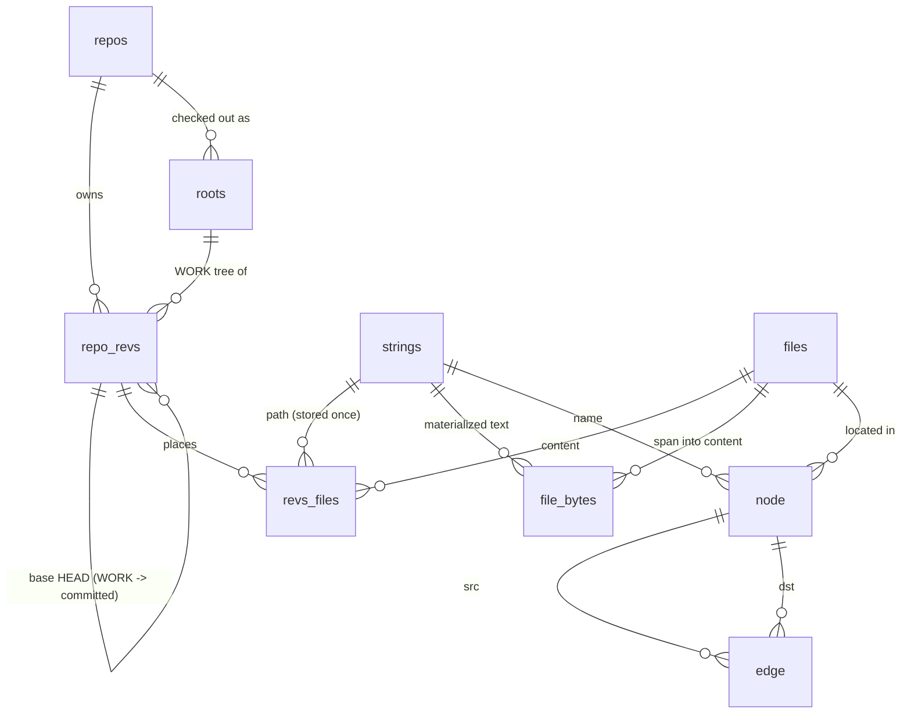
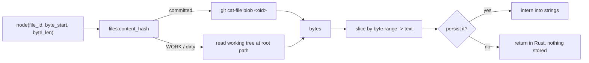
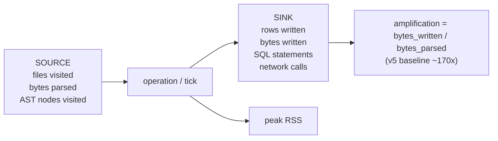
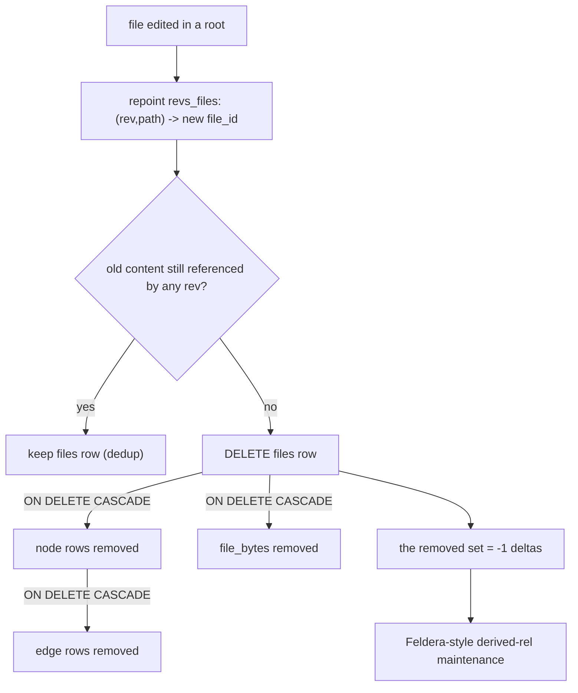

# v6 Store Spine — session book (2026-07-21)

Captures the design worked out this session for `v6/sprefa-store`: the closed
data model, the principles behind it, and the pieces we deliberately **deferred**.
Nothing in the "deferred" sections is built yet — this is the map, not the
territory.

## The one idea

The filesystem and git are **already content-addressed databases**. The store is
a thin relational spine that *indexes* them — identity, coordinates, and the
graph — and never copies file bytes into SQLite. Everything else follows from
that.

## The tables (9), and how they join



| table | role |
|---|---|
| `strings` | interned dictionary. Dense ids from lasso. Vocabulary + paths + any materialized text |
| `repos` | one row per configured repo |
| `roots` | a repo's checkouts on disk (`repo_id`, `path_string_id`). No `kind` — see below |
| `repo_revs` | a rev: committed (`git_sha`) or WORK (`root_id` + `base_rev_id`, no sha) |
| `files` | content, addressed once by hash. A file byte-identical anywhere = ONE row |
| `revs_files` | the junction: one content appears at many `(rev, path)` places |
| `file_bytes` | a byte span into content: `(file_id, string_id?, start, end)` |
| `node` | unified graph node, **content-scoped** (`file_id`, no rev). 4 families in one table |
| `edge` | unified graph edge: `(family, src_id, dst_id, kind)` |

## Principle 1 — the fs and git are the content database

We store **no file bytes**. `files` holds identity (a hash), `file_bytes` holds
spans (offsets), `strings` holds only text we *chose* to materialize. To read a
node's source text we go back to the real content store and slice it, joining in
Rust:



One nuance this forces: to read committed bytes *from git*, the key must be
git's own oid (git is addressed by oid, not blake3). So `files.content_hash` is
the **git blob oid for committed content** and **blake3 only for dirty files**
that git has never seen. This is the v0 "keyed by git oid OR content hash."

## Principle 2 — dense surrogate ids, never hashes-as-ids

Every id is a dense integer assigned by the DB or the interner. v5 made ids
64-bit content hashes, which forced `salt_rev`, collision guards, and the
`persisted/inflight_strings` bookkeeping. All deleted. Consequences baked into
the schema: real FK `REFERENCES` (enforced, `PRAGMA foreign_keys=ON`), junctions
are `WITHOUT ROWID` (no duplicate autoindex), entities are plain
`INTEGER PRIMARY KEY` (no `AUTOINCREMENT`, no `sqlite_sequence`).

The resident interner is **lasso** (a library, not a bespoke `SymAlloc`):
`string_id` = the dense `Spur`, the `strings` table is its durable mirror.

## Principle 3 — WORK means "has unstaged changes" (v1's `<sha>+`, done right)

v1 marked a dirty tree by mutating the sha string to `<HEAD_sha>+` — a state
flag jammed into an id, the same family of hack as `salt_rev`. v6 carries it
relationally: a WORK rev has `kind=work`, `root_id` (which tree), and
`base_rev_id` (the committed HEAD it diverges from). "Which files have unstaged
changes" is then one join, not a string compare:

```sql
SELECT w.path_string_id
FROM revs_files w
JOIN repo_revs r ON r.rev_id = w.rev_id
LEFT JOIN revs_files h
  ON h.rev_id = r.base_rev_id AND h.path_string_id = w.path_string_id
WHERE w.rev_id = :work AND (h.file_id IS NULL OR h.file_id <> w.file_id);
```

Proven at scale (137 of 20,000 diverged files in one query) and on the real
kernel (exactly `mm/util.c`, the one file edited).

**No `RootKind` enum.** Three same-rev checkouts (main / worktree / background)
produced one identical set of committed rows and nothing read `kind`. The
distinction is git/daemon operational metadata, not spine data. Standing rule
now: *an enum survives only with a golden test for it and its uses.* `Family` and
`RevKind` passed; `RootKind` did not, so it does not exist.

## Principle 4 — no N+1, ever

The store is the SQL boundary; **any function that touches a DB surrogate lives
here** (interning, `normalize`, the future `sprf_` UDFs). Writes are batched and
FK-ordered. A global, resettable, lock-free `stmt_counter` is the tripwire: a
golden test resets it, runs N rows, and asserts the statement count stayed
`ceil(N/100)`, never N. 50,000 nodes = 500 statements, asserted exact.

Locks never contend: the `Mutex<Interner>` guard is taken in an explicit scope
and dropped before any `.await`, so it is never held across a DB round-trip.

## Principle 5 — a perf gun on every crate (amplification)

Every crate reports how much work it did versus how much it produced. The one
number that mattered most in v5 was **amplification**: 5 MB of source parsed
turned into an 865 MB db (~170x), with indexes at 57% of the file and `df_node`
materialized four times. A metric that names that is not optional — it is how the
system answers "why is it slow / why is it huge" from its own trail.

The meter is a resettable counter set (the generalization of `stmt_counter`,
which is barrel #1, already installed):



| axis | counter | what it catches |
|---|---|---|
| source | `files_visited`, `bytes_parsed`, `ast_nodes_visited` | re-parsing, over-visiting |
| sink | `rows_written`, `bytes_written`, `sql_statements`, `network_calls` | N+1 (installed), write blowups, N+1 over the wire |
| memory | `peak_rss_bytes` | the beach-the-machine guard |
| derived | `storage_amplification = bytes_written/bytes_parsed`, `row_amplification = rows_written/source_facts`, `query_amplification = rows_scanned/rows_returned` | the 170x / 4x-projection / full-scan defects, named |

Build-vs-buy for the gun (per the standing "infra is bought / logging = tracing"
law):
- **reporting spine**: `tracing` — counters emit as span fields / events, one
  subscriber aggregates. No parallel bespoke pipeline.
- **peak RSS**: `memory-stats` crate (cross-platform) or `libc::getrusage`
  `ru_maxrss` directly. Not hand-rolled.
- **benches**: divan / criterion + hyperfine, CodSpeed in CI (the perf-skill
  harnesses), each crate carrying its own amplification assertion the way
  `tests/spine.rs` already asserts `sql_statements == ceil(N/100)`.

Status: `stmt_counter` (SQL statements) is live and test-asserted. The rest of
the counter set + the tracing subscriber + `peak_rss` are **deferred** — but the
shape is fixed: one `perf` module, resettable atomics, reported through tracing,
one amplification assertion per crate's golden test.

## Retract, cascade delete, and Feldera (DEFERRED — explanation only)

You asked: isn't retract-by-scope just cascade delete, and is that Feldera
capable? Yes and yes, with one subtlety that is the whole point of a
content-addressed store.

**Content is immutable and shared.** When a file "changes," you do NOT delete
its `files` row — you get a *new* row (new hash) and repoint `revs_files`. The
old content row may still be referenced by other revs (that is the dedup win).
So a naive `ON DELETE CASCADE` from `files` on every edit would nuke rows that
another rev still needs. Cascade is right, but it fires at the **content-orphan
boundary**, not the file-edit boundary:



So the intended FK actions (deferred to implement):

| FK | on delete |
|---|---|
| `repo_revs.repo_id -> repos` | CASCADE |
| `roots.repo_id -> repos` | CASCADE |
| `revs_files.rev_id -> repo_revs` | CASCADE |
| `node.file_id -> files` | CASCADE |
| `edge.src_id / dst_id -> node` | CASCADE |
| `file_bytes.file_id -> files` | CASCADE |
| `*.string_id / path_string_id -> strings` | RESTRICT (never delete a string) |
| `revs_files.file_id -> files` | RESTRICT (content can't vanish under a live placement) |

Content GC is then one statement whose cascade does the teardown:

```sql
DELETE FROM files WHERE file_id NOT IN (SELECT file_id FROM revs_files);
```

**Feldera relationship.** Feldera (the Z-set incremental engine in the v6 D10
plan) is a *different layer*: it maintains **derived rels** by weight arithmetic
(`+1`/`-1`) as base facts change. The store's cascade produces exactly those
`-1` deltas on the base facts. So cascade is not a competitor to Feldera — it is
the source of the retraction deltas Feldera consumes. The catch: SQLite
`ON DELETE CASCADE` silently removes rows; to feed an incremental layer the store
must **capture the removed set** as a delta (via `DELETE ... RETURNING`, a
trigger, or a change log), not just drop it.

### Verdict (2026-07-21): buy the algebra, not the engine

Prompted by the v5 0.12.0 daemon being killed at **35 GB RSS**. DBSP (the theory
under Feldera; Budiu et al., VLDB 2023) IS a closed model'd algebra — streams of
Z-sets, a tiny operator basis (`z⁻¹` / differentiate / integrate + lifted
relational ops), and incrementalization `Q → Q^Δ` is a mechanical, sound-and-
complete, composable transformation. Retraction = a negative weight; there is no
separate delete operator. That is the turnkey retraction we want.

But `dbsp` 0.323, `differential-dataflow` 0.25, `timely` 0.31 are all **Rust and
resident** — they keep indexed arrangements in RAM. That is the exact 35 GB
failure mode. There is no C / SQLite-extension form of DBSP, and SQLite has no
built-in IVM.

So: **adopt the algebra, keep the state on disk.**

- Every base fact and rel row carries `weight INTEGER NOT NULL DEFAULT 1`.
- A change is a set of `(row, ±weight)`. Apply = one upsert
  (`... ON CONFLICT DO UPDATE SET weight = weight + excluded.weight`) then
  `DELETE WHERE weight = 0`. No separate retract path. Cascade delete produces
  the `-1` deltas; the weight arithmetic consumes them.
- A row derived two ways carries weight 2; killing one derivation leaves 1 and
  the row correctly survives — no DRed, no over-delete-then-rederive.
- Cyclic derivation is the one sharp edge: run the recursive SCC's fixpoint to a
  least fixed point before publishing its deltas.

The `dbsp` crate is not rejected forever — it is rejected **over the corpus**.
Because v6 is cold-by-default (a subscription activates one bounded cone), a
compiled DBSP circuit over that *cone* keeps resident state bounded and is a fair
future experiment. DBSP-on-the-corpus is the 35 GB death; DBSP-on-the-cone is
affordable. The weight column is the turnkey, on-disk retraction we build first;
the compiled engine is an optional accelerator on bounded cones, later.

| option | state | verdict |
|---|---|---|
| weight column in SQLite (DBSP algebra, on disk) | on disk, O(delta) | **build this** — turnkey retraction, zero new deps |
| `dbsp` crate over the corpus | resident arrangements | reject (the 35 GB mode) |
| `dbsp` crate over a bounded subscription cone | resident but bounded | fair future experiment |
| `differential-dataflow` / `timely` | resident | reject — same RAM assumption |
| Materialize | external DD service | not "in SQLite"; heavyweight |
| SQLite triggers | on disk, pure SQL | free turnkey IVM for simple/aggregate rels; doesn't scale to joins/recursion |

## Content hashing for caching (thoughts; bench DEFERRED)

Two distinct roles, do not conflate them:

| role | needs | tool |
|---|---|---|
| **content address** (persisted `files` identity, cross-run, must not collide across a whole corpus) | stable + wide + collision-resistant | git oid (committed) / blake3-128 (dirty) |
| **in-memory key** (transient HashMap, interning) | fast, per-process | already handled by lasso / ahash |

The real lever is not hash speed — it is **not hashing what git already hashed**.
Every committed blob has a precomputed oid (`git ls-files -s`), so for the ~99%
of files that are committed, content addressing is **free**. Only dirty (WORK)
files need a hash, and that set is tiny (the unstaged diff). So the hash choice
barely moves the needle and the microbench is safe to defer.

Indicative numbers this session (5.0 MB, 146 kernel files, piped through the CLI
tools so they include process + `cat` overhead — not a real bench):

| hasher | width | 5 MB (indicative) | notes |
|---|---|---|---|
| git oid (reuse) | 160-bit | **0** | precomputed at commit time |
| sha1 | 160-bit | ~24 ms | git's current oid algorithm |
| sha256 | 256-bit | ~34–64 ms | git's sha256 mode |
| blake3 | 256-bit (we truncate to 128) | ~sha1 or faster, SIMD/parallel | existing dep, crypto-safe |
| xxh3/xxh128 | 128-bit | very fast in-process (CLI overhead dominated the number here) | non-crypto — fine for transient keys, NOT for persisted corpus identity |

Recommendation (to implement later): reuse the **git oid** for committed content;
**blake3 truncated to 16 bytes** for dirty files; a real criterion/divan bench
only if profiling ever shows dirty-file hashing on the hot path (unlikely, given
the volume).

## Ported / not ported from v5

Done this session: dense interner (lasso, replaces `SymAlloc` + the HashSet
bookkeeping), `normalize`, `content_hash`, `git_sha_bytes`, `byte_to_linecol`,
the unified node/edge, the WORK/base model, the no-N+1 counter.

Deferred (design captured, not built): retract-by-scope via `ON DELETE CASCADE`
+ orphan GC; skip-on-unchanged via a batched `current_file_ids` probe; the
`kind` vocabularies as compact typed enums (each with a golden test); the
`sprf_` text UDFs registered on the connection (the dead `sprf_sym*` interning
UDFs are NOT ported — lasso replaced them); the span->text read path
(`git cat-file` / disk).

Never ported (stays in the engine): `rebuild_derived`/fixpoint, `strata`,
`deltaflow`, `cold_stage`, clock/bucket windowing, `_prov`/`__src`, `salt_rev`.

## What is actually proven (tests)

Three large golden tests, no pile of trivial checks:

- `tests/spine.rs` — synthetic scale: 100k strings interned (dense), 5k files
  deduped, 50k nodes across 4 families in one table (500 statements, not 50k),
  50k cross-family edges, 50k-node reachability in one recursive CTE, whole-system
  acceptance, and 137/20,000 unstaged detection in one query.
- `tests/kernel_roots.rs` — real Linux `mm/` from three sibling checkouts:
  same-rev roots collapse (146 files, 146 junctions), content dedup across
  HEAD/WORK, exactly `mm/util.c` reported unstaged in one join, normalization
  over 200+ real kernel identifiers, FK integrity clean, dense ids.
- The DDL is derived from the entities (`Schema::create_table_from_entity`) —
  one source of truth, no hand-written second copy.
