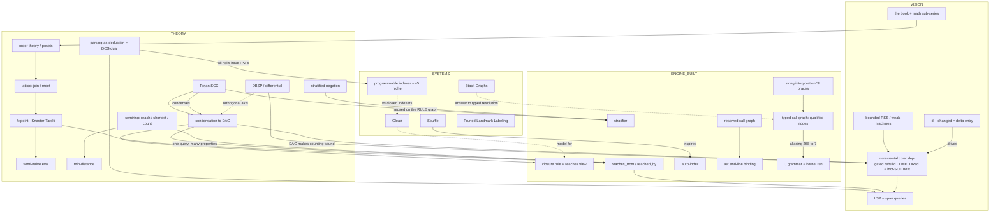

# Conversation concept graph (live)

A parallel semantic graph of this session. Open in **Markdown Preview** (`Cmd+Shift+V`)
to see it drawn. It grows each turn: the diff is logged at the bottom in a string
matchable form, then folded into the graph.

We do not solve layout. We **declare** nodes/edges; Mermaid lays them out. That is the
whole trick that makes "graph drawing" tractable here.

## Delta log (most recent first)

Format you can string-match: `+n id "label"`, `+e src -> dst "rel"`, `~ note`.

- **t: build incremental core (step 1)** — `+n delta "dl --changed"`; `+e delta -> incr "drives it"`; `~ incr node: dep-gated rebuild LANDED (fc22c16). edit chain A rebuilds only da, db untouched, byte-identical to full. DRed + incr-SCC still pending`.
- **t: conversation graph idea** — `~ dogfood the incrementality thesis on the convo itself`; this file is born.
- **t: DCG / "all calls have DSLs"** — `+n pad "parsing-as-deduction"`; `+e pad -> lsp "span queries"`; `+e pad -> prog "self-hosted grammars"`; `~ DCGs do not port (top-down); use the datalog dual`.
- **t: DD vs condensation** — `+n dd "DBSP/differential"`; `+e dd -> cond "orthogonal axis"`; `+e cond -> incr "DAG makes counting sound"`; `+n incr "incremental core (NEXT)"`.
- **t: can I use Glean** — `+n glean "Glean"`; `+e glean -> clo "model for"`; `+n prog "programmable indexer"`; `+e prog -> glean "vs closed indexers"`.
- **t: SOTA / papers** — `+n stackg`; `+n souffle`; `+n pll`; `+e stackg -> typed "answer to typed resolution"`.
- **t: lattices / order theory** — `+n order`; `+n lat`; `+e order -> lat`; `+e lat -> fix "underpins"`.
- **t: semirings** — `+n ring "reach/shortest/count"`; `+e ring -> rf "one query many properties"`; `+n mind "min-distance"`.
- **t: typed call graph** — `+n interp "$ braces"`; `+n typed "qualified nodes"`; `+e interp -> typed`; `~ max SCC 268 -> 7`.
- **t: C grammar** — `+n cgram "C grammar + kernel"`; `~ 16442 fns, view 1.98s vs Rust 30us`.
- **t: stratification** — `+n strat`; `+n st "stratifier"`; `+e tarj -> st "reused on rule graph"`.
- **(earlier session)** — `+n tarj`; `+n cond`; `+n clo`; `+n rf`; `+n ai`; `+n rcg`; `+n rss`.

## Protocol going forward

Each turn I append a delta block in the format above and fold it into the Mermaid
graph. Each turn is one of: **new** (add a node), **associate** (add an edge to prior
work), or **switch** (a new subgraph / disconnected component). The delta lines are
grep-able, so you can later script the diff/animation off the raw turns if you want.
