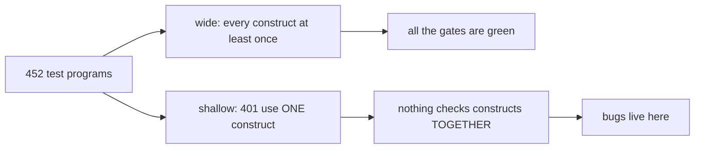
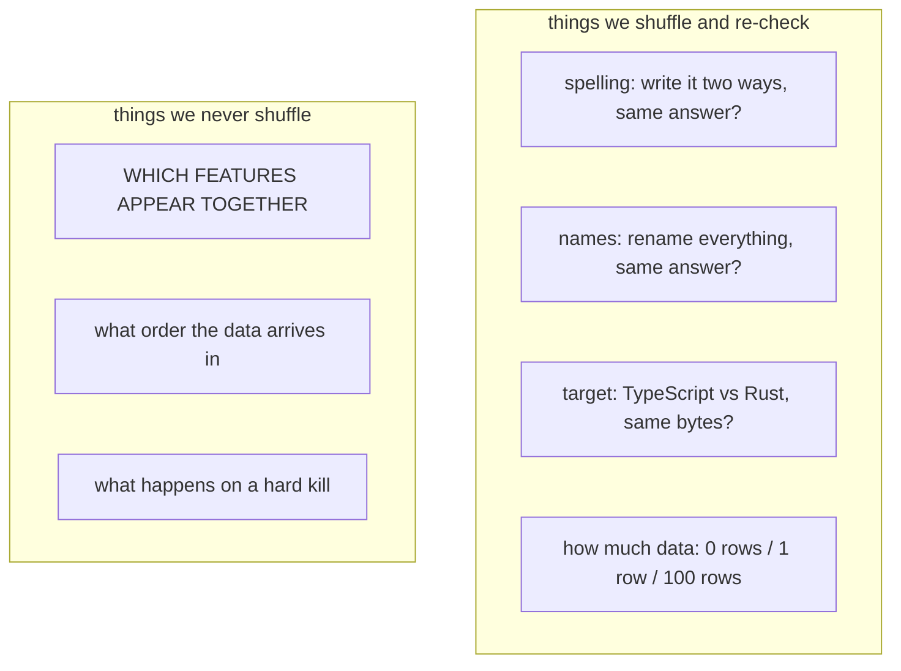
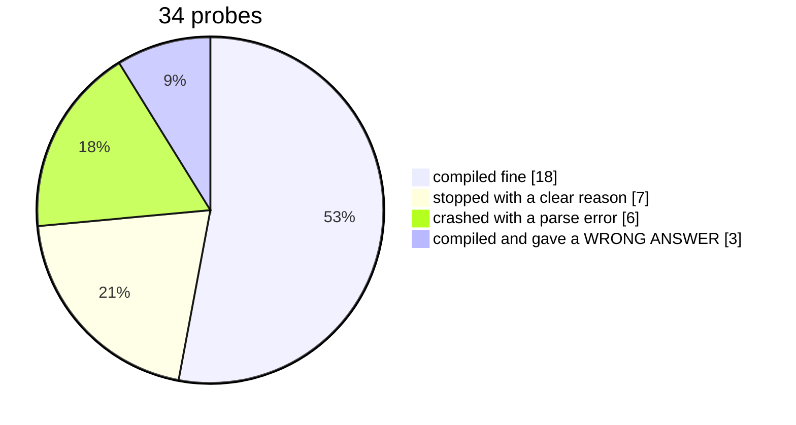
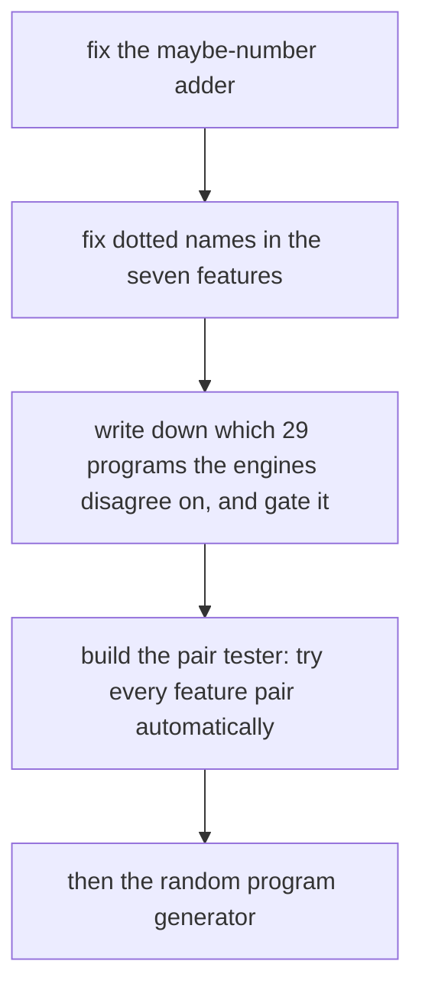

# How hard is dl6 tested, really

## Contents

- [The one picture](#the-one-picture)
- [What we test today](#what-we-test-today)
- [The hole](#the-hole)
- [What 34 hand-written programs found](#what-34-hand-written-programs-found)
- [The four things worth your time](#the-four-things-worth-your-time)
- [What to build](#what-to-build)

## The one picture



We have a lot of tests. They are all the same shape: one idea per program.
Bugs live where two ideas meet, and almost nothing puts two ideas in one file.

## What we test today



Everything on the left is well covered and quietly excellent. Everything on
the right is untouched. The top item on the right is the cheap one.

## The hole

Two features that each work fine can break when you use them in the same
rule. We have 435 possible feature pairs. 71 of them have never appeared
together in any test program, ever. They cluster hard:

| feature | how many test programs use it | how many partners it has never met |
|---|---|---|
| dotted rel names like `orchard.tree(...)` | 17 | 25 |
| array fan-out `[... item]` | 5 | 21 |
| everything else | plenty | a handful |

## What 34 hand-written programs found

I wrote 34 small programs pairing features that had never met, and compiled
each one. Under 7 seconds for the whole set.



## The four things worth your time

### 1. Adding up a maybe-number adds up the wrong numbers

If a column can be missing (`option(int)`), or if it holds one of several
named shapes (an enum), and you ask for the total, you get a total. It is a
total of the wrong thing. Internally these columns store a bookkeeping row
number, not the value, and the adder never notices. Same for greater-than
comparisons.

The identical mistake with a different column type IS caught, correctly, with
a clear message. So the check exists. It just does not look at these two
kinds of column.

This is the one that scares me. It is silent. Nothing turns red.

### 2. Dotted names break seven features, with a useless error

```
orchard.tree(X)                  works
latest( orchard.tree(X) )        parse error at line 8, column 24
pre( orchard.counter(X, N) )     parse error at line 10, column 28
coalesce( orchard.label(X, L) )  parse error at line 10, column 25
```

Seven working features refuse a dotted name, and instead of saying "dotted
names do not work here yet" they hand back a column number. One line of the
parser reads a plain name where everywhere else in the file reads a dotted
one.

### 3. The two engines disagree about 29 programs, and only one admits it

We have two engines that should agree: the reference one and the compiler.
On 29 of our 452 test programs, the reference engine happily runs the program
and the compiler flatly refuses to build it. Exactly one of those 29 has a
note explaining the disagreement. The other 28 look like ordinary passing
tests.

The biggest group of nine is all one feature, and the note on the work item
says its own reason went stale a month ago and nobody owns it.

Two of these are our showcase programs. The one titled "the rxjs receipt,
written entirely in already-settled features" does not compile.

### 4. Two thirds of our error messages have never been seen

The compiler has 120 places where it stops and names a reason. Our 452 test
programs trigger 43 of them. The other 77 are guesses nobody has confirmed.

That is how problem 1 hid: the correct check for it exists and had never once
fired, so nobody noticed the gap sitting next to it.

## What to build



The pair tester is already written up as a work item. This audit is a hand
sample of it: 22 pairs out of 435 found four real problems. The machine
version should find more, and it is the cheap half of the two fuzzing items
we have queued.
