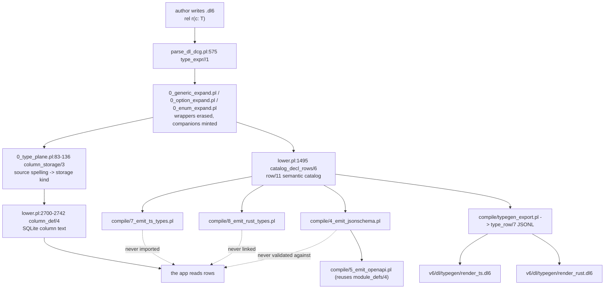

# Userland typegen audit

Audit only. No implementation, no design change. Tree `7d22a3cbf5ca` (origin/main,
2026-08-17). Paths are repo-relative.

## Contents

1. [Scope, method, and the peer fork](#1-scope-method-and-the-peer-fork)
2. [The map](#2-the-map)
3. [Six walkthroughs](#3-six-walkthroughs)
   - [3.1 Scalars](#31-scalars-bool_literals_round_trip)
   - [3.2 Enum](#32-enum-enum_name_is_a_column_type)
   - [3.3 Option](#33-option-option_text_column_reads_through_tag_join)
   - [3.4 List](#34-list-list_bare_column_round_trips)
   - [3.5 Typed host in and out](#35-typed-host-in-and-out-struct_host_output_schedule_answer_interned)
   - [3.6 Rel-referencing rel](#36-rel-referencing-rel-struct_nested_value_renders_whole_tree)
4. [Ugliness scorecard](#4-ugliness-scorecard)
5. [Ranked findings](#5-ranked-findings)
6. [Five real error messages](#6-five-real-error-messages)
7. [Stale claims found in prior docs](#7-stale-claims-found-in-prior-docs)
8. [What was not measured](#8-what-was-not-measured)

## 1. Scope, method, and the peer fork

| item | value |
|---|---|
| tree audited | `7d22a3cbf5ca95bce62680e0c52593c13b033486` (origin/main) |
| fixtures compiled ad hoc | 6, each under 1s (`COMPILE-TRACE total=22/102139` on the largest) |
| gates run | none |
| corpus swept | `v6/prolog/compile/out/`, 342 `.types.ts` + 342 `.types.rs` + 345 `.schema.json` + 1 `.openapi.json` |
| external checkers used | `rustc 2021` on staged copies, `tsc --strict --noEmit` on staged copies, python `json` for `$ref` reachability |

Local `main` carries 19 commits not on the audited tree, several of them
type-plane work: `36f56f008 dl6: add bytes to the type system`,
`9e86af295 Compose option wrappers`,
`c75a51121 Carry typed host descriptors through ProgramJson`,
`26308d32d Persist ordered list values across restarts`. Nothing below reflects
them. A `bytes` primitive in particular will add a row to every mapping table
counted in [finding 6](#5-ranked-findings).

`v6/prolog/compile/out/text-door/` does not exist in a fresh tree (gitignored,
written by sweep), so every `.dl6` this audit quotes comes from the committed
`dl_view` render or from a file this audit authored. Measured: 273 of 758 `rel` lines
across `v6/prolog/compile/dl_view/*.dl6` carry no `: type` annotation at all,
and synthesized names such as `col2` appear in their place. The `CLAUDE.md`
warning about `dl_view` is accurate.

## 2. The map



The dotted edges are the headline. Grep for an import of any emitted
`*.types.ts` under `v6/tsv2` returns nothing; `v6/sprefa-engine-rs/src/types.rs`
is hand-written (`RowColumnType` at `:8` and `Value` at `:24`), not emitted. Every
consumer path reads `IRow = readonly IRowValue[]`
(`v6/tsv2/runtime/types.ts:40`), a positional untyped array.

Two planes exist and no artifact names which one it is describing.

| plane | what it says about `path: text` | where |
|---|---|---|
| value | `string` | `7_emit_ts_types.pl:121` |
| storage | `INTEGER NOT NULL` into `__str` | `lower.pl:2738` |

Measured: zero of the 1029 emitted type artifacts mention `__id` or
`__refcount`, and every emitted table has `__id`.

## 3. Six walkthroughs

### 3.1 Scalars (`bool_literals_round_trip`)

Authored (`compile/dl_view/bool_literals_round_trip.dl6`):

```
rel flag(name: text, enabled: bool).
```

| column | storage kind | DDL | types.ts | types.rs | schema |
|---|---|---|---|---|---|
| `name: text` | interned | `"name" INTEGER NOT NULL` | `name: string` | `pub name: String` | `{"type":"string"}` |
| `enabled: bool` | `bool` | `"enabled" INTEGER NOT NULL CHECK ("enabled" IN (0,1))` | `enabled: boolean` | `pub enabled: bool` | `{"type":"boolean"}` |

DDL, `compile/out/bool_literals_round_trip.ts:154-155`:

```sql
CREATE TABLE "__str" ("__id" INTEGER PRIMARY KEY, "content" TEXT NOT NULL UNIQUE);
CREATE TABLE "flag" ("__id" INTEGER PRIMARY KEY, "name" INTEGER NOT NULL,
  "enabled" INTEGER NOT NULL CHECK ("enabled" IN (0,1)), UNIQUE ("name", "enabled"));
```

`SELECT * FROM flag` yields three columns of two integers. `Flag` declares two
properties, one of them `string`. Neither artifact carries the `__str` join.

### 3.2 Enum (`enum_name_is_a_column_type`)

Authored:

```
rel grade(ripe(sugar: int) ; green(days: int)).
rel picked(id: int, g: grade).
rel picked_tag(id: int, tag: text).
```

Emitted `compile/out/enum_name_is_a_column_type.types.ts`, in full:

```ts
export interface GradeGreen { id: number; days: number; }
export interface GradeRipe  { id: number; sugar: number; }
export interface GradeTag   { id: number; tag: string; }
export interface Picked     { id: number; g: number; }
export interface PickedTag  { id: number; tag: string; }
```

| authored | emitted |
|---|---|
| the sum type `grade` | no type of any name |
| `picked.g: grade` | `g: number` |
| the two variants | two standalone interfaces the author never named |
| the discriminator | `GradeTag.tag: string`, not a literal union |

TypeScript can spell this shape (`{tag:'ripe',sugar:number} | {tag:'green',days:number}`)
and Rust can spell it as an enum. Neither emitter has a clause for it: `ts_kind/7`
at `7_emit_ts_types.pl:118-136` has arms for primitive, type_parameter,
json_list, list, option, rel, and nothing else. The four `grade_*` tables in the
DDL are the whole story an app gets.

### 3.3 Option (`option_text_column_reads_through_tag_join`)

Authored:

```
rel user_profile(user_id: int, email: option(text)) key(1).
```

Four tables, `compile/out/option_text_column_reads_through_tag_join.ts:158-166`:

```sql
CREATE TABLE "__opt_text_none" ("__id" INTEGER PRIMARY KEY, "id" INTEGER NOT NULL, UNIQUE ("id"));
CREATE TABLE "__opt_text_some" ("__id" INTEGER PRIMARY KEY, "id" INTEGER NOT NULL,
  "value" INTEGER NOT NULL, UNIQUE ("value"));
CREATE TABLE "__opt_text_tag" ("__id" INTEGER PRIMARY KEY, "id" INTEGER NOT NULL,
  "tag" INTEGER NOT NULL, "__refcount" INTEGER NOT NULL DEFAULT 1, UNIQUE ("id", "tag"));
CREATE TABLE "user_profile" ("__id" INTEGER PRIMARY KEY, "user_id" INTEGER NOT NULL,
  "email" INTEGER NOT NULL, UNIQUE ("user_id"));
```

| artifact | says |
|---|---|
| types.ts | `email: string \| null` |
| types.rs | `pub email: Option<String>` |
| schema | `"email": {"anyOf": [{"type":"string"}, {"type": null}]}` |
| DDL | `"email" INTEGER NOT NULL` |

The schema line is invalid. JSON Schema 2020-12 requires `type` to be a string
or an array of strings; `null` the JSON literal is neither. The site is
`4_emit_jsonschema.pl:146`, `Schema = _{ anyOf: [ Inner, _{ type: null } ] }`,
where SWI's `json_write_dict/3` renders the atom `null` as a JSON null while
every other atom in `primitive_schema/2` renders as a string. Measured: 166
occurrences of `"type":null` across 4 `.schema.json` files, 159 more in
`pokeapi_shape.openapi.json`.

Reading one present email costs three tables: `user_profile.email` into
`__opt_text_tag.id`, branch on `tag`, then `__opt_text_some.value` into
`__str.__id`.

### 3.4 List (`list_bare_column_round_trips`)

Authored:

```
rel box(id: int, items: list(text)) key(1).
```

DDL, `compile/out/list_bare_column_round_trips.ts:155-160`:

```sql
CREATE TABLE "__gen__list_text_df210f232c1299bd"
  ("__id" INTEGER PRIMARY KEY, "content" INTEGER NOT NULL, UNIQUE ("content"));
CREATE TABLE "__gen__list_text_df210f232c1299bd__member"
  ("__id" INTEGER PRIMARY KEY, "list_id" INTEGER NOT NULL, "idx" INTEGER NOT NULL,
   "value" INTEGER NOT NULL, UNIQUE ("list_id", "idx"));
CREATE TABLE "box" ("__id" INTEGER PRIMARY KEY, "id" INTEGER NOT NULL,
   "items" INTEGER NOT NULL, UNIQUE ("id"));
```

`Box` is `{ id: number; items: Array<string> }`. Four joins stand between that
declaration and the storage: `box.items` to `__gen__..._member.list_id`, order
by `idx`, `value` to `__str.__id`, read `content`. The `__gen__` name carries a
16-hex sha of the canonical type text (`0_generic_expand.pl:966`), so the join
target's identifier changes whenever the element type text changes.

`list(<rel>)` compiles. This audit authored `rel holder(id: int, spans: list(span)) key(1).`
with `rel span(start: int, end: int).` and it compiled rc=0 to
`Array<Span>` plus `__gen__list_span_45c70c9ce112d515{,__member}`.

### 3.5 Typed host in and out (`struct_host_output_schedule_answer_interned`)

Authored:

```
rel span(end: int, start: int).
rel host_span(path: text, at: span).
sh scan_span(path: text) -> (at: span) = `scan {path}`.
```

Emitted `types.ts` names `HostSpan`, `HostStart`, `SourcePath`, `Span`, and
nothing for `scan_span`. Neither an input struct nor an output struct is
emitted for a host, in any of the five targets. What the host declaration does
produce is two DDL tables an app must know by name,
`compile/out/struct_host_output_schedule_answer_interned.ts:171-173`:

```sql
CREATE TABLE "__host_demand_scan_span" ("__id" INTEGER PRIMARY KEY,
  "identity_digest" INTEGER NOT NULL, "witness_digest" INTEGER NOT NULL,
  "path" INTEGER NOT NULL, "__refcount" INTEGER NOT NULL DEFAULT 1,
  UNIQUE ("identity_digest", "witness_digest", "path"));
CREATE TABLE "__host_response_scan_span" ("__id" INTEGER PRIMARY KEY,
  "witness_digest" INTEGER NOT NULL, "ordinal" INTEGER NOT NULL,
  "path" INTEGER NOT NULL, "at" INTEGER NOT NULL, UNIQUE ("witness_digest", "ordinal"));
```

The real host consumer, `v6/tsv2/serve/1_hosts.ts:574-583`, reads a demand row
this way:

```ts
private demandOf(plan: IHostPlan, row: IRow): HostDemand {
  const columns = this.engine.program.rel_columns[plan.demand_rel] ?? [];
  const inputs = new Map<string, IRowValue>();
  for (const input of plan.inputs) {
    const index = columns.indexOf(input.name);
    inputs.set(input.name, index >= 0 ? (row[index] ?? "") : "");
  }
  const witness_index = columns.indexOf("witness_digest");
  return { plan, witness_digest: String(row[witness_index] ?? ""), inputs };
}
```

Name lookup by `indexOf`, positional index into an untyped array, `String()` at
the edge. Zero emitted types participate.

### 3.6 Rel-referencing rel (`struct_nested_value_renders_whole_tree`)

Emitted `compile/out/struct_nested_value_renders_whole_tree.types.rs`, first
five lines:

```rust
#[derive(Debug, Clone, PartialEq, serde::Serialize, serde::Deserialize)]
pub struct Diag {
    pub where: Place,
    pub message: String,
}
```

`rustc --edition 2021 --crate-type lib` on that file:

```
error: expected identifier, found keyword `where`
help: escape `where` to use it as an identifier
   |     pub r#where: Place,
```

There is no keyword escape anywhere in `8_emit_rust_types.pl`. Swept: 5 of the
342 committed `.types.rs` files fail `rustc` once `serde` is stubbed.

| file | error |
|---|---|
| `struct_nested_value_renders_whole_tree.types.rs` | keyword `where` as a field name |
| `module_path_local_name_binds_before_the_dotted_one.types.rs` | E0428 duplicate struct name |
| `two_bounded_parameters_mint_one_instance.types.rs` | E0392 type parameter `Label` never used |
| `nested_bounded_template_instance.types.rs` | E0392 type parameter `Left` never used |
| `mixed_bounded_and_free_parameters.types.rs` | E0392 type parameter `Value` never used |

The same 342 `.types.ts` pass `tsc --strict --noEmit` clean, because TypeScript
merges the duplicate interface declarations silently. Authored source of the
duplicate, `compile/dl_view/module_path_local_name_binds_before_the_dotted_one.dl6`:

```
rel tree(tree_id: int).
rel orchard.tree(tree_id: int).
```

Both render as `ModulePathLocalNameBindsBeforeTheDottedOneTree`, because
`emitted_type_name/4` (`7_emit_ts_types.pl:138-146`) prefixes with the row's
`ModuleId`, which for both rels is the entry module, never the `orchard` path.
`4_emit_jsonschema.pl:163-169` walks the parent chain and gets it right, keying
the defs `tree` and `orchard.tree`, so the schema emitter and the two code
emitters disagree on the identity of a module-pathed rel.

The E0392 rows are a second defect underneath the first. Authored:

```
rel span(Start: json_encodable, Label: json_encodable)(start: Start, label: Label).
```

Emitted: `pub struct Span<Start: JsonEncodable, Label: JsonEncodable> { pub start: Start, }`.
The `label` column is gone. `ts_generic_text/2` (`7_emit_ts_types.pl:35-45`)
collects `generic_column` rows and one of the two never arrives.

## 4. Ugliness scorecard

Rubric: 0 no defect found, 1 cosmetic, 2 the author must learn a rule no doc
states, 3 the author gets a wrong or unusable artifact.

| axis | score | receipt |
|---|---|---|
| naming | 3 | `pub where: Place` (`out/struct_nested_value_renders_whole_tree.types.rs:3`, rustc rejects); duplicate `ModulePathLocalNameBindsBeforeTheDottedOneTree` (E0428); `GenSpanIntTextE5126de851365aff` in 4 files; `export interface Orchard {}` in 5 files, a module rendered as a data type; snake_case schema keys against PascalCase code names, so two codegens off one program disagree on every identifier |
| wrapper leakage | 3 | enum emits no type at all, only `GradeRipe` / `GradeGreen` / `GradeTag` (3.2); option emits `__opt_text_{none,some,tag}` (3.3); list emits `__gen__list_text_df210f232c1299bd__member` (3.4); host emits `__host_demand_*` / `__host_response_*` (3.5). Every one of these names is compiler-minted and every one is a table an app must open |
| duplication | 3 | 163 of 181 lines identical between `7_emit_ts_types.pl` and `8_emit_rust_types.pl` after renaming; `compiler_helper_rel/1` defined 3 times (`4_:49`, `7_:26`, `8_:26`), `type_name/2` twice (`7_:172`, `8_:172`), `module_type_name/2` twice (`7_:148`, `8_:148`), `capitalized/2` twice; 8 independent tables map a dl6 type to a representation (below); the second TS door has already drifted, see finding 6 |
| consumer ergonomics | 3 | zero imports of any emitted `*.types.ts` anywhere in `v6/tsv2`; `v6/sprefa-engine-rs/src/types.rs` is hand-written; the real read path is `columns.indexOf(name)` then `row[index]` (`v6/tsv2/serve/1_hosts.ts:578-579`). Reading one `Box` row as `{id, items: string[]}` needs 3 joins the artifacts do not mention |
| error quality | 2 | codes are named, distinct, and greppable, and the manifest reason carries the payload; the user-facing text drops it. 5 probes below: 3 of 5 print no file and no line, 5 of 5 drop the types or the column name, and all 5 print the error code in the slot reserved for a rule name |
| doc coverage | 3 | `README.md` contains zero occurrences of `.dl6`, `option(`, `list(`, `json_list`, `acyclic(`, or an `sh` host decl; it documents v5's `type severity = "error" \| "warn".` brands instead. `docs/reference/*.md` is generated from v5's `op_catalog`. The only v6 type-plane writeup is `docs/generics-wrapper-inspection.md`, filed as an inspection, not user documentation |

The eight mapping tables counted under duplication:

| # | site | maps |
|---|---|---|
| 1 | `0_type_plane.pl:83-136` | source spelling to storage kind |
| 2 | `lower.pl:2700-2742` | storage kind to SQLite column text |
| 3 | `compile/4_emit_jsonschema.pl:136-151` | catalog kind to JSON Schema |
| 4 | `compile/7_emit_ts_types.pl:118-136` | catalog kind to TS |
| 5 | `compile/8_emit_rust_types.pl:118-136` | catalog kind to Rust |
| 6 | `v6/dl/typegen/render_ts.dl6:25-32` | catalog kind to TS, again |
| 7 | `v6/dl/typegen/render_rust.dl6:27-32` | catalog kind to Rust, again |
| 8 | `v6/tsv2/runtime/types.ts:37` and `v6/sprefa-engine-rs/src/types.rs:8-33` | the runtime's own column-type vocabulary, twice, by hand |

`5_emit_openapi.pl` is not a ninth: it imports `module_defs/4` from the
JSON Schema emitter.

## 5. Ranked findings

| # | finding | where | cost | needs Chris |
|---|---|---|---|---|
| 1 | Every option column in every emitted schema writes `"type": null`, a JSON literal where 2020-12 requires the string `"null"`. 166 occurrences in `.schema.json`, 159 in `.openapi.json`. Nothing validates emitted schemas against the metaschema | `compile/4_emit_jsonschema.pl:146` | S | n |
| 2 | 5 of 342 committed `.types.rs` do not compile: one unescaped Rust keyword, one duplicate struct name, three unused type parameters | `8_emit_rust_types.pl` (no `r#` escape, no module-path prefix, generic column dropped) | S for the keyword, M for the rest | n |
| 3 | 4 emitted schemas carry `$ref`s into `#/$defs/__gen__...` that are not in `$defs`, because the `__` filter runs on the defs but not on the refs. The generic template itself is also absent from every schema | `4_emit_jsonschema.pl:43-49` filters, `:147-152` emits the ref | S | n |
| 4 | No emitted type artifact is consumed by anything. `v6/tsv2` imports none of the 342 `.types.ts`; `v6/sprefa-engine-rs/src/types.rs` is hand-written. 684 files, 21 MB of `out/`, graded by byte-diff only | `compile/test/typegen_golden.sh` (no `rustc`, no `tsc`, no validator) | M to wire a checker, L to make them the consumed surface | y |
| 5 | An enum rel emits no type of its own in TS, Rust, or JSON Schema. The author writes one sum type and receives three unrelated interfaces and a `number` column | `7_emit_ts_types.pl:118-136` has no enum arm; same in `8_` and `4_` | L | y, this is type design |
| 6 | The two TS doors disagree. `render_ts.dl6` has no `float` clause, so a float column derives no `type_of` row and vanishes from the interface with no error; `7_emit_ts_types.pl:119` renders `number`. `render_rust.dl6:29` does have float. The golden corpus contains a float type row that no column points at, so the divergence is ungraded | `v6/dl/typegen/render_ts.dl6:25-32` (5 primitive arms, no float) vs `7_emit_ts_types.pl:119` | S | n |
| 7 | `render_ts.dl6` and `render_rust.dl6` unroll list nesting to exactly five levels; the prolog emitters recurse without bound. A six-deep list drops in one door and renders in the other | `render_ts.dl6:142-177` | S | n |
| 8 | Silent drop, two different ways. A column whose type has no rendering makes the prolog emitter drop the whole rel (`renderable_rel/2`'s `maplist(ts_column_type...)` guard, `7_:22`); the dl6 door drops only that column (`field_line`'s `type_of/2` join, `render_ts.dl6:199-204`). Neither throws | `7_emit_ts_types.pl:20-24`, `render_ts.dl6:196-204` | M | n |
| 9 | The emitted OpenAPI carries 212 component schemas and zero `$ref` from any operation, because no response declares `content`. 80 KB of the 80.4 KB document is unreachable | `5_emit_openapi.pl:64-67` `response_pair/2` emits `description` only | M | y, response bodies are API design |
| 10 | Userland error text drops the payload the manifest reason carries, and prints the error code where a rule name belongs. See section 6 | the message formatter, reached from every `throw(unsupported_construct(...))` | S to thread the payload, M to add positions | n |
| 11 | Module-path collision resolution prefixes with the entry module, not the rel's own module path, so two rels in one file can still collide. The JSON Schema emitter walks the parent chain and does not have the bug | `7_emit_ts_types.pl:138-146` and `8_:138-146` vs `4_emit_jsonschema.pl:163-169` | M | n |
| 12 | `7_emit_ts_types.pl` and `8_emit_rust_types.pl` are 181 lines each and differ in 18 after mechanical renaming. Four predicates are copied verbatim between them; `compiler_helper_rel/1` is copied a third time into `4_emit_jsonschema.pl` and diverges there (no `concrete_rel` escape) | the three emitter files | M | n |
| 13 | Nothing user-facing documents the v6 type spellings. README is v5-only; `docs/reference/` is generated from v5's `op_catalog` | `README.md`, `docs/reference/` | M | n |
| 14 | 205 of 786 columns (26%) in the largest real userland program are `: json`, standing in for enums, oneOf, and lists of refs the type plane cannot spell. They render as TS `unknown`, Rust `serde_json::Value`, and JSON Schema `{}` | `v6/dl/fixtures/pokeapi_shape.dl6` | L | y, this is the expressivity fork |
| 15 | The value plane and the storage plane are both real and no artifact says which one it describes. `path: text` is `string` in three emitters and `INTEGER` into `__str` in the DDL; `at: span` is `Span` and `INTEGER`. Zero of 1029 emitted artifacts mention `__id` or `__refcount` | `7_:121` vs `lower.pl:2738`; `7_:135` vs `lower.pl:2713` | L | y |

## 6. Five real error messages

Compiled ad hoc from files this audit authored, each under 1s. Left column is
the printed text, right is the payload the manifest already carries for the
same code.

| printed to the author | manifest reason for the same code |
|---|---|
| `rule-index unavailable: unsupported_construct: compiler refused rule 'comparison_type_mismatch' (comparison_type_mismatch)` | `comparison_type_mismatch(A==B,text,int)` |
| `rule-index unavailable: unsupported_construct: compiler refused rule 'column_type_unknown' (column_type_unknown)` | `column_type_unknown(treee)` |
| `rule-index unavailable: unsupported_construct: compiler refused rule 'option_element_type_unknown' (option_element_type_unknown)` | `option_element_type_unknown(json_list(int))` |
| `/tmp/…/optkey.dl6:1: unsupported_construct: compiler refused rule 'option_in_key_column' for rel 'session/2' (option_in_key_column)` | `option_in_key_column(session/2,token)` |
| `/tmp/…/mismatch.dl6:5: unsupported_construct: compiler refused rule 'head_column_type_conflict' for rel 'b/1', 'c/1' (head_column_type_conflict)` | `head_column_type_conflict(target/1,total,int,source/1,name,text)` |

Three failures, uniform across all five:

1. Three of five print no file and no line. The two that do print a zero-width
   range at column 0.
2. Five of five drop the payload: which column, which two types, which name was
   unknown. The author is told `column_type_unknown` without being told which
   name is unknown.
3. Five of five put the error code in the slot reading `compiler refused rule
   '…'`. There is no rule by that name; the diagnostic reads as if the author
   named it.

Probe sources, for the record: `s(v:int)`/`t(v:text)` joined on `A == B`;
`rel node(id: int, child: mystery)`; `option(option(int))`;
`rel session(token: option(text), n: int) key(1)`; `c(V) <- a(V), b(V)` across
an `int` and a `text` rel.

## 7. Stale claims found in prior docs

| doc | claim | status |
|---|---|---|
| `CLAUDE.md` | `type_name/2` at `compile/7_emit_ts_types.pl:61-64` and `compile/8_emit_rust_types.pl:61-64` | stale, both are at `:172` |
| `CLAUDE.md` | no coercions "in code at `lower.pl:1826` (`comparison_type_mismatch`) and `lower.pl:335` (`join_column_type_mismatch`)" | stale, `:2319` and `:347` |
| `CLAUDE.md` | pinned by `compile/test/plunit_tests.pl:2284` and `:2295` | stale, `:2460` and `:2471` |
| `CLAUDE.md` | `0_type_plane.pl:145-151` (wrapper inventory) | stale, `:153-157`; already corrected in the typespec plan and still uncorrected here |
| `CLAUDE.md` | `0_option_expand.pl:39-49` (the scalar-vs-reference split) | mislabeled; `:39-49` is `check_acyclic_target/3`, the split is `desugar_option_column/5` at `:53-76` |
| `CLAUDE.md` | `0_generic_expand.pl:125-176` (collection artifacts) | mislabeled; `:125-131` is `expand_user_templates/3`, the collection artifacts are `list_flavor_artifacts/2` at `:766-816` |
| `CLAUDE.md` | `4_emit_jsonschema.pl:121-146` renders option columns required-and-nullable | confirmed, `:121` builds `required` from every property key and `:146` emits the `anyOf`. The prior inspection's correction stands |
| `docs/generics-wrapper-inspection.md` | manifest is "448 rows total, 341 compiled / 107 unsupported" | stale, 452 / 342 / 110 |
| `docs/generics-wrapper-inspection.md` | named stop `list_of_relation_refs(E)` at `0_type_plane.pl:123` | site correct, framing misleading. The throw sits in the `json_list(Element)` arm only. The relational `list(<rel>)` compiles: this audit compiled `list(span)` rc=0. The fixture name `list_of_relation_refs_still_refused` names a `json_list(span)` column |
| `docs/generics-wrapper-inspection.md` | `type_wrapper/2` `:153-157`, `unwrapped_column_type/2` `:161-166`, `column_def/4` `:2700-2742`, `list_row_kind/3` `:2007-2008`, `desugar_option_column/5` `:53-76` | all confirmed unchanged |
| `docs/generics-wrapper-inspection.md` | stale claim 1: the comment calling the four list constructors term-door-only | still present, now at `0_generic_expand.pl:687-689`. Flagged, never fixed |
| `plans/2026-08-16-typespec-parity-typegen.PLAN.md` | `out/*.types.{ts,rs}` is 338 + 338 = 676 | stale after one day, 342 + 342 = 684 |
| `plans/2026-08-16-typespec-parity-typegen.PLAN.md` | `find v6 -name "*.types.*"` is 704 | stale, 708 |
| `plans/2026-08-16-typespec-parity-typegen.PLAN.md` | 12 TS goldens, 12 RS goldens, 9 `.type_rows.jsonl` | confirmed |
| `plans/2026-08-16-typespec-parity-typegen.PLAN.md` | `render_ts.dl6` header scope line is stale because the body implements module-prefix | confirmed the header is stale, and the body's module-prefix arm carries the same entry-module bug as the prolog emitter (finding 11) |
| `v6/dl/typegen/render_ts.dl6:10-12` | "Module-prefix and generic-rel emission are future arcs, named in the report, not implemented here" | stale, `module_prefix/2` at `:99-108` and `emitted_type_name/2` at `:111-119` |

## 8. What was not measured

- The dl6 renderers were read, never run. Running them needs `pnpm install` in
  `v6/tsv2`, which this audit did not do. Findings 6, 7, and 8's dl6 half are
  read from the rule bodies, not from a render.
- Emitted schemas were checked for `$ref` reachability and for the `type`
  keyword by hand. No JSON Schema metaschema validator is installed on this
  machine (`pip install jsonschema` is blocked by PEP 668).
- `.types.ts` was checked with `tsc --strict --noEmit` from a tsc found outside
  this repo. `v6/tsv2/node_modules` does not exist in a fresh tree.
- The `dl_view` warning was verified for dropped `: type` annotations
  (273 of 758 rel lines). The second half of the warning, that `dl_view` drops
  whole `rel` declarations, was not independently measured.
- Nothing here reflects the 19 unlanded peer commits on local `main`, including
  the `bytes` primitive.
