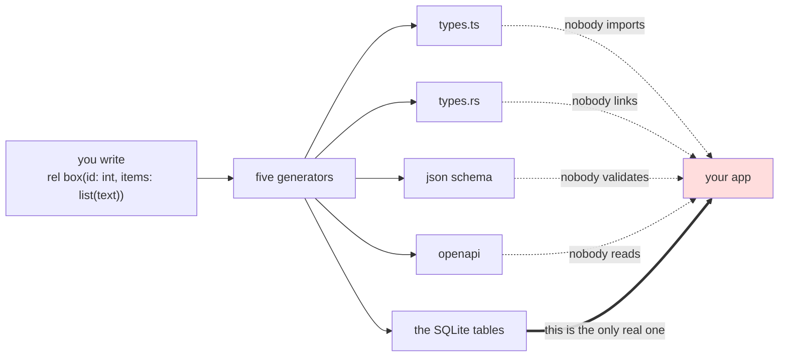
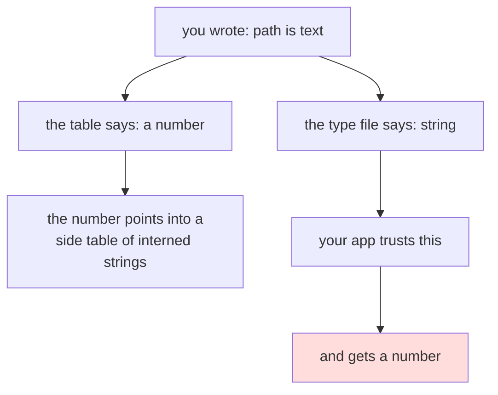
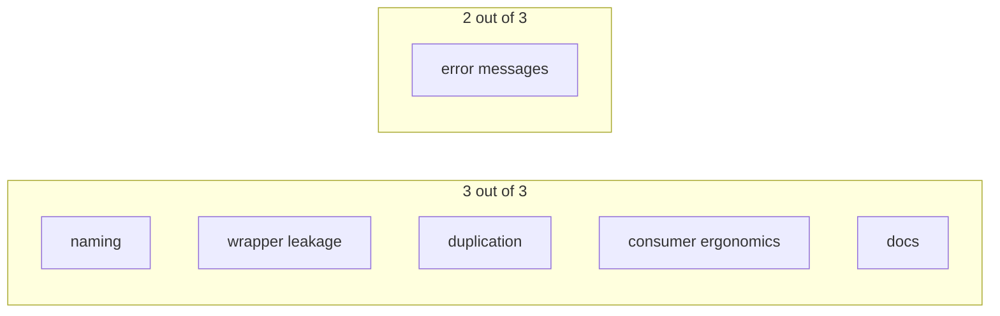
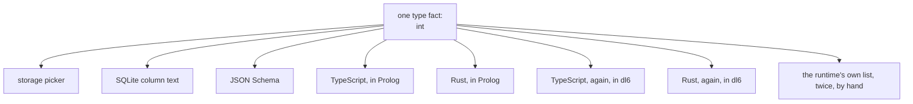
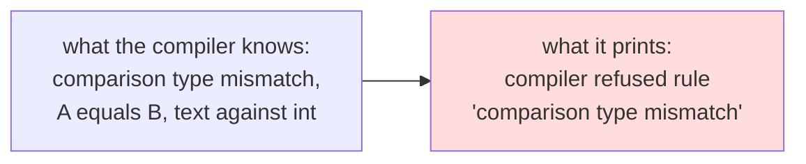

# Userland types, in plain words

## What this is

You write a type in a `.dl6` file. Five different things get generated from it.
This is a grade of how ugly that is for the person writing the program.

## The short version

The generated types are pretty. Nothing uses them.

Your app talks to the tables. It gets a plain array of values with no names and
no types, and it finds a column by searching a list of strings for its name.

## The two stories problem

The generated type says one thing. The table says another. Nothing tells you
which one you are looking at.

Same problem for lists, for optional values, and for one row pointing at
another row. In every case the pretty type hides two to four table joins.

## The grade

Zero is clean. Three means you get an artifact that is wrong or unusable.

Seventeen out of a possible eighteen. It is ugly.

## Five things that are simply broken

| what | how bad |
|---|---|
| Every optional column in every generated JSON Schema writes a broken null. Three hundred and twenty five places | small fix, no design call needed |
| Five generated Rust files do not compile. One uses a Rust reserved word as a field name. One declares the same struct twice. Three declare a type parameter and never use it | small to medium fix |
| Four generated schemas point at definitions that are not in the file | small fix |
| The generated OpenAPI has two hundred and twelve type definitions and not one of them is attached to any endpoint | needs a call on what the endpoints should return |
| The type generator gate compares text and only text. It never asks Rust or TypeScript whether the output compiles. That is why the five broken files sit in the repo looking green | small fix, and it catches the others |

## Three things that need you in the room

**Sum types vanish.** You write one type with two shapes. You get back three
unrelated types, none of them named after the thing you wrote, and the column
that holds it comes back as a plain number. Both TypeScript and Rust can spell
what you meant. Neither generator tries.

**A quarter of the biggest real program is untyped.** Two hundred and five of
its seven hundred and eighty six columns are marked "just JSON" because the
type language could not say what they were. Those cross into TypeScript as
"unknown" and into JSON Schema as "no constraint at all".

**Two planes, no label.** The value story and the storage story are both true
and both generated, and no file says which one it is. Deciding which one the
generated types should describe is a design call.

## Same code, written twice

Eight places. The TypeScript and Rust generators written in Prolog are the same
one hundred and eighty one lines with eighteen lines different.

The two copies have already drifted. The second TypeScript generator forgot
floats. A float column silently disappears from the type it generates, with no
error. The second one also stops at five levels of nested list where the first
one keeps going.

## What the compiler tells you when you get a type wrong

It knows exactly what went wrong. It knows the file, the line, the column, and
both types. It prints almost none of that.

Three of the five cases tested print no file and no line at all. All five drop
the detail. And all five put the error code in the sentence slot where a rule
name belongs, so it reads as if you named your rule after the error.

## Where to start

1. The broken null in JSON Schema. One line.
2. Make the gate run the Rust and TypeScript compilers on its own output. Then
   fix the five files it turns red.
3. Thread the detail the compiler already has into the message the author sees.

Everything past that is a design conversation.

## One caveat

There is a newer pile of work sitting on the local machine that is not in the
audited copy, including a new byte type, option wrapper composition, and typed
host descriptors. None of it is reflected above. The byte type in particular
adds a ninth row to every one of those eight duplicate tables.
