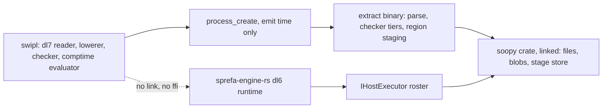

# Inventory: host bindings dl7 comptime and the dbsp emitter would share

Retrieval only, no design. Every row cites a file:line opened on origin/main
`f579e5836` (or the branch named). Feeds
`plans/2026-09-03-comptime-bindings.PLAN-BRIEF.md`.

1. [Process boundary today](#process-boundary-today)
2. [Executors engine-rs links](#executors-engine-rs-links)
3. [Child-process spawn sites](#child-process-spawn-sites)
4. [soopy CLI surface](#soopy-cli-surface)
5. [extract CLI and wire](#extract-cli-and-wire)
6. [dl7 comptime phases](#dl7-comptime-phases)
7. [dd and dbsp emit surface](#dd-and-dbsp-emit-surface)
8. [swipl on this machine](#swipl-on-this-machine)

## Process boundary today

Caption: swipl reaches extract only through a child process, and only from
the emit-time region mainer; the comptime evaluator makes no out-of-process
call (`v7/src/1_libtime/0_evaluator.pl`: zero hits for process_create, shell,
foreign, ffi). engine-rs links soopy in-process and never spawns git
(`v6/sprefa-engine-rs/src/executors/mod.rs:76`).

## Executors engine-rs links

Trait: `IHostExecutor` at `v6/sprefa-engine-rs/src/hosts.rs:38` (`run` :39,
`cadence` :46). Roster exports: `src/executors/mod.rs:17-21`.

| executor | host names it answers | inputs (`required_input` keys) | outputs | calls | file:line |
|---|---|---|---|---|---|
| `SoopyCheckoutExecutor` | checkout | `repo_slug`/`slug`, `dest_root`/`root`, `want_sha`/`sha` | head_sha, checkout path | `soopy::discover`, `soopy::RefQuery`, `soopy::Refs::open` | `executors/checkout.rs:19-60` |
| `SoopyWatchExecutor` | watch (glob) | `glob`, `repo` | one row per path with content id | `soopy::discover`, `soopy::enumerate`, `GitFilesQuery`, `Revision::Worktree`, `ContentId::GitBlob` | `executors/watch.rs:12-80` |
| `RepoAtExecutor` | `repo_files_at`, `repo_grep_at` | `root`, `rev`, `glob`, `pattern` | listing rows, grep rows | soopy revisions | `executors/repo_at.rs:35-60` |
| `GitRefsExecutor` | `git_ref`, `git_tag` | repo | ref rows | soopy refs | `executors/git_refs.rs:24-39` |
| `GitHistoryExecutor` | `git_merge_base`, `git_ancestor`, `git_ahead_behind` (pair family); `git_change`, `git_rename`, `git_changed_line` (diff family) | pair or diff inputs | history rows | soopy history | `executors/git_history.rs:37-52` |
| `TickCostExecutor` | tick cost | none | resident-set reading | in-process | `executors/cost.rs:73-75` |
| `ClockExecutor` | clock | none | now | in-process | `executors/clock.rs:12-30` |
| `EnvExecutor` | env | var name | value | in-process | `executors/env.rs:12-14` |
| `TomlJsonExecutor` | toml to json | path | json rows | in-process | `executors/toml.rs:12-14` |
| `HttpGetExecutor`, `HttpPostExecutor` | http get, http post | url, body | response rows | pooled client, 8 idle per host | `executors/http.rs:39,287,300` |

CLAUDE.md's named executor set also lists extract, scip, cargo_metadata,
fixture as linked executors; they are not under `src/executors/` and were not
located in this pass (search `ExtractExecutor`, `SprefaExtractExecutor` in
`v6/sprefa-engine-rs/src` before relying on them).

## Child-process spawn sites

| where | binary | arguments | who reads the output |
|---|---|---|---|
| `v7/src/3_emit/3_rust_type_region_mainer.pl:49-75` (branch `feature/dl7-source-intelligence`, PR #689) | extract (`default_extract` :137) | `--witness --family type <rust>`; then `region <target> <region> [--state DIR] --apply` | `load_tsi_text/3` (`0c_extract_loader.pl`), then the region apply writes the generated .dl7 |
| `v6/prolog/compile/test/*.pl` (`0_trace.test.pl:25`, `compiler_relations.test.pl:553,889`, `plunit_tests.pl:9458,9820,11005,11017`, `run_plunit.pl:384`, `run_sql_check.pl:314,325`, `type_relation_ir.test.pl:525`) | env, sqlite3, git, rustc, a test bin | test harness only | the tests |
| `v7/src/**` on origin/main | none | | |

## soopy CLI surface

Crate `~/projects/hafley-rs/crates/soopy`, bin `soopy` (`Cargo.toml:34-35`),
subcommand enum `src/main.rs:32-90`, handlers `:237-364`.

| subcommand | flags | output format | lib entry |
|---|---|---|---|
| `resolve <revision>` | | text | `_2_repository.rs:9 discover`, `:28 open` |
| `files` (alias `enumerate`) | `Selection` (revision, glob), `--format tsv\|jsonl` | tsv default, jsonl | `_3a_files.rs:17 snapshot` |
| `read` | `Selection`, `--format raw\|jsonl` | raw default, jsonl | `_3a_files.rs:22 read_each` |
| `watch` | `--glob` (repeatable, default `**/*`), `--format text\|jsonl` | text default, jsonl deltas | `_8_watch.rs:37 open`, `:112 watch`, `:70/:177/:378 recv` |
| `query <pattern>` | `--glob` repeatable | text or jsonl | `SourceQuery` (`main.rs:146`) |
| `status-metrics` | | text | `_5a_git_status.rs` |
| `show-stage <id> --store PATH`, `discard-stage <id> --store PATH` | | | `_7e_stage_store.rs` (`DurableStageStore`) |

## extract CLI and wire

| flag | where | note |
|---|---|---|
| `--witness`, `--resolve`, `--family <list>`, `--project-root`, `--ingest <PATH>`, `--schema`, `--indexer` | `v6/sprefa-extract/src/bin/extract.rs` (`--rust-checker` :102, `--ts-checker` :111 are bool flags; `--max-bytes` :207) | `--ingest` takes a file path, never stdin |
| `region <target> <region> [--state DIR] [--apply]` | the subcommand the region mainer spawns; on branch `feature/dl7-source-intelligence` (PR #689, commit 1df17d4c3), absent from origin/main `extract.rs` | stages generated regions through soopy's stage store |
| wire records | `src/types.rs:2988 FlatFact`: Protocol, Run, Fact, Witness, Coverage, Diagnostic, Node, Edge, DfParam, DfArg, DfField, ... FileRow (`src/wire.rs:571 file_fact`) | TSI rows: `src/tsi/types.rs` RunOut :21, Arg :33, FactOut :45, WitnessOut :54, CoverageOut :63, DiagnosticOut :73, Mode :13, Method :83 |
| registry | `src/tsi/registry.rs` (`extract --schema` prints it; `tsi.name` added PR #688) | |
| content id | `src/shape.rs content_id_of` (blake3 or git blob id) | the cache key a comptime binding would reuse |

## dl7 comptime phases

`v7/src/2_comptime/2_compiler.pl` `run_compile_phase/3` call sites, in order:

| phase label | line | what runs |
|---|---|---|
| read | :60 | `read_program_texts/3` (prelude + program text) |
| expand | :84 | `parse_program_texts` |
| read (project) | :121 | `read_project_units` |
| lower | :263, :275 | `lower_compiler_units/…` (single and project forms) |
| check | :339 | `check_datalog/4` |
| comptime | :349 | `evaluate_checked/4` (`1_libtime/0_evaluator.pl`, no out-of-process call) |

Loaders beside the phases: `0b_filesystem_grapher.pl` exports
`install_project_graph/6`; `0c_extract_loader.pl` exports `load_tsi_stream/3`,
`accepted_rows/2`, `install_tsi_graph/6`; `0d_source_fact_loader.pl` (branch
`feature/dl7-source-intelligence`) exports `load_source_fact_files/3`,
`install_source_fact_graph/6`. `load_type_prelude/2` at `2_compiler.pl:166`.
Cache: `1c_compiler_cacher.pl`.

## dd and dbsp emit surface

| piece | where |
|---|---|
| `dd_plan` term | `v6/prolog/compile/6_isolated_compiler_dd.pl:75`: `dd_plan(Name, rels(Rels), arrangements(Arrangements), operators(Operators), wires(Wires), tick_order(TickOrder))`, built from `lowered/8`; JSON twin `dd_plan_json_dict` :73 (name, ddl, rels, arrangements, rules, operators, wires) |
| dd-runner | `v6/dd-runner/src/{kernel.rs,main.rs}` reads the JSON twin (ARCH `dd_plan_dd_runner`, done) |
| dbsp crate map | `docs/ext-dbsp-incremental.md`: 1 core types (ZWeight, OrdZSet), 2 embedder program, 3 retraction mechanics, 4 operator surface, 5 memory, verdict |

## swipl on this machine

| probe | result |
|---|---|
| `swipl --version` | SWI-Prolog 10.0.2 arm64-darwin |
| `use_module(library(ffi))` | absent: `source_sink library(ffi) does not exist` |
| `use_module(library(process))` | loads |

