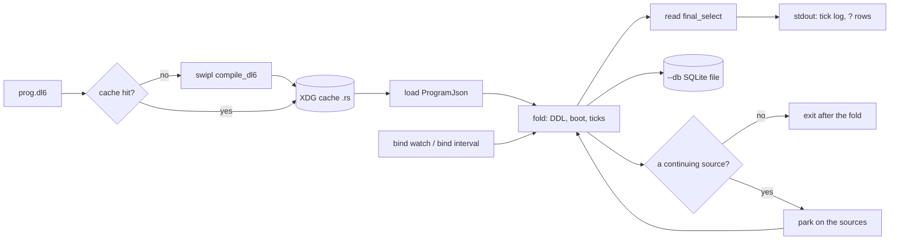

# `dl6 run`

One verb folds a `.dl6` program. The FILE decides whether the process stays: a
program that routes a rel to a continuing source keeps running and re-prints the
rows that changed, one tick per push; a program with no such source folds once,
prints its `?` rows and exits.

## Contents

- [The one verb](#the-one-verb)
- [Flags](#flags)
- [The compile cache](#the-compile-cache)
- [Example 1: a one-shot report](#example-1-a-one-shot-report)
- [Example 2: `bind watch`](#example-2-bind-watch)
- [Example 3: `bind interval`](#example-3-bind-interval)
- [The database is the receipt](#the-database-is-the-receipt)
- [What a built binary adds](#what-a-built-binary-adds)

## The one verb

```
dl6 run prog.dl6 [--arrive rel=v,v ...] [--final-tsv] [--fail-on q] [--db f]
                 [--root dir] [--once]
```



`run::stays_resident` asks the loaded program whether any rel is routed to
`live_watch` or `live_interval`. With none, the fold ends and the process exits.
With one, the process parks on its sources: each coalesced burst of filesystem
events, and each turn of each declared cadence, becomes one arrival batch and
therefore one tick. What re-prints is a delta of the `?` rows, `+` for a row the
tick added and `-` for one it retired. `--once` folds tick 0 of a resident
program and exits, for a snapshot.

The verb runs no cargo. The compiled program is a text the engine loads, so a
run costs one compile (cached) plus the fold. `dl6 build` is still the way to
get one standalone binary out of one program.

## Flags

| flag | what it does |
| --- | --- |
| `--arrive <rel>=<v>[,<v>...]` | Seed one arrival row into tick 0. Repeat for more. The declared column type decides how a cell reads; an `int` column that cannot read its cell is a stop, never a `0`. |
| `--schedule <file>` | An arrival schedule, the shape `emit_rust_harness` reads. The `--arrive` rows join its first batch. |
| `--final` | Print each `?` rel as one JSON document, `{rel, columns, rows}`. |
| `--final-only` | Drop the tick log; print only the `?` rows. |
| `--final-tsv` | Print `rel<TAB>col...`, so no shell parses JSON. A tab or newline inside a value is a stop, never a forged column. |
| `--final-rels <rel>[,<rel>...]` | Name and order the rels. Without it every rel in `final_select` prints, sorted. |
| `--fail-on <query>` | Exit 1 when the named `?` query answers any row. A name the program does not answer is a stop that lists the ones it does. |
| `--db <file>` | Fold into a plain SQLite file a cold `sqlite3` reads afterwards. See below. |
| `--root <dir>` | The tree the hosts read and a `bind watch` glob resolves against. Defaults to `.`. |
| `--adapters <file>` | The `.adapters.json` sidecar. Defaults to the one beside the source. |
| `--no-live-hosts` | Fold `sh` decls from a scripted schedule instead of running them live. Hosts run live by default. |
| `--once` | Fold tick 0 of a resident program and exit, rather than staying up. |

A `?` query whose declaration carries an `order by` tail prints in the cursor's
own order; every other rel sorts, so a run is reproducible either way.

## The compile cache

The key is the blake3 of the source's bytes and a digest of every `.pl` the
compiler is built from, under `${XDG_CACHE_HOME:-~/.cache}/sprefa/dl6`. An edit
to either misses. Measured on the dead-module rail over `~/projects/hafley-rs`:

| pass | compile | whole run |
| --- | --- | --- |
| cold | `compile swipl 1.62s` | 5.24s |
| warm | `compile cached 0.00s` | 3.21s |

The compiler digest is a stat, not a content hash: the tree is 170 files, and
the key only has to miss when one of them moves.

## Example 1: a one-shot report

`v6/dl/deadcode/dead-module-rail.dl6`, run from inside the tree it reads:

```bash
dl6 run v6/dl/deadcode/dead-module-rail.dl6 \
  --root ~/projects/hafley-rs \
  --arrive 'want=crates/*/src/*.rs' --arrive 'cargo_manifest=.' \
  --final-only --final-tsv --final-rels rail_unproven_module
```

The program's own shape, abridged:

```dl6
rel want(glob: text).

# One `git hash-object` process for the whole set, never one per file.
# rx: want$.pipe(mergeMap(glob => enumerate(glob)))
sh files(glob: text) -> (path: text, digest: text) =
  `git ls-files -- '{glob}' | git hash-object --stdin-paths`.

rel source_file(path: text, digest: text).
source_file(Path, Digest) <- want(Glob), files(Glob, Path, Digest).

# rx: rows$.pipe(map(rows => sortBy(rows, [desc('defs'), 'path'])))
? rail_unproven_module(path, defs) order by defs desc, path.
```

Add `--fail-on rail_dead_module` and the command is a rail: exit 1 the moment
the query answers a row, which is what a pre-commit hook or a CI step reads.

## Example 2: `bind watch`

`v6/sprefa-engine-rs/tests/fixtures/watch_module_defs.dl6`:

```dl6
bind watch(glob: text, path: text, digest: text).

rel source_file(path: text, digest: text).
source_file(Path, Digest) <- watch('crates/*/src/*.rs', Path, Digest).
```

Column 1 is the configuration column for every bind: the glob the program's own
rules name there is the file set a resident `dl6 run` opens a soopy watcher on. A bind
whose rules read no literal gets no live source at all, never a default.

```
# rx lowering of the bind line
watchSource(glob).pipe(
  bufferTime(coalesceMs),                    // one burst is one tick
  map(() => enumerate(glob)),                // (path, gitBlobOid)[]
  distinctUntilChanged(sameDigests),
  mergeMap(rows => diffAgainstHeld(rows)))   // -> IArrivalRow[] with signs
```

The watcher **notifies** and the enumeration **answers**. soopy's delta carries a
`ContentId::Blake3`; a demand host addresses its cache by the git blob oid
`soopy::enumerate` gives, so a burst re-enumerates rather than translating the
delta. That also makes a rename, a removal and a rescan one code path.

The digest is what makes this a freshness source rather than a notification: a
save that changed no bytes re-enumerates to the same oid, which is zero delta at
the rel boundary, so nothing downstream re-derives.

```
+seen  src/one.ts  d8157863065d81742f8fb38fe13ec2cc05ce8207   <- first fold
-seen  src/one.ts  d8157863065d81742f8fb38fe13ec2cc05ce8207   <- content change
+seen  src/one.ts  290f93225dd90c35b065c6f9f43fd23e2d3dafe1
+seen  src/three.ts bd0710d10bec5a010069504d5d926aaaf7d4c566  <- new file
-seen  src/two.ts  6a2308adf33fbc9e053feb40d7d9ffe02ac3a471   <- removal
```

Five minutes over a clone of `~/projects/hafley-rs`, one touch every 30 seconds:

| t | RSS (KB) | | tick | batch wall |
| --- | --- | --- | --- | --- |
| 0s | 2 576 | | first fold | 907 ms |
| 30s | 67 600 | | +1 | 128 ms |
| 60s | 67 680 | | +2 | 53 ms |
| 90s | 67 680 | | +3 | 71 ms |
| 120s | 67 696 | | +4 | 61 ms |
| 150s | 67 712 | | +5 | 58 ms |
| 180s | 36 128 | | +6 | 153 ms |
| 210s | 18 192 | | +7 | 196 ms |
| 240s | 21 088 | | +8 | 117 ms |
| 270s | 21 456 | | +9 | 81 ms |
| 300s | 21 664 | | +10 | 81 ms |

Ten touches, ten batches, no growth: RSS peaks at 67.7 MB while the first folds'
extract answers are live, then the allocator returns it and the process settles
at 21.7 MB. Load average over the window was 16.9 falling to 8.4, so the walls
are an upper bound on a busy machine, not a quiet-machine best case.

A `run` of the same program takes one enumeration and folds once, with no
watcher armed behind it, so a `bind watch` program is a one-shot report too.

## Example 3: `bind interval`

`v6/sprefa-engine-rs/tests/fixtures/interval_beat.dl6`:

```dl6
bind interval(period: int, bucket: int).

rel beat(bucket: int).
beat(Bucket) <- interval(1, Bucket).

? beat(bucket).
```

```
# rx lowering of the bind line
timer(0, period * 1000).pipe(
  map(() => Math.floor(Date.now() / 1000 / period)),
  distinctUntilChanged(),
  pairwise(),
  mergeMap(([held, next]) => [del(period, held), add(period, next)]))
```

The bucket is `floor(epoch_secs / period)`, which is restart-stable: a restarted
watch re-derives the same row rather than minting a fresh identity. The previous
bucket is retired in the same batch the new one arrives in, so the rel holds one
row per cadence rather than growing.

```
+beat  1787331501
-beat  1787331501
+beat  1787331502
-beat  1787331502
+beat  1787331503
```

The loop parks until the earliest cadence turns over, so a one-second beat costs
one wakeup a second and an idle watch costs a condvar wait.

## The database is the receipt

`--db prog.db` folds into a plain SQLite file. Nothing bespoke is on top of it:
`sqlite3 prog.db` after the process exits reads every row.

| name | what it is |
| --- | --- |
| `__str(__id, content)` | The text dictionary. Every `text` column in a base table stores an `__id` into it, never the text. |
| `<program>_<rel>` | One base table per rel, surrogate `__id` primary key, interned columns. |
| `__txt_<program>_<rel>` | The decoded read of that table: one correlated `__str` lookup per interned column. Created as `CREATE TEMP VIEW` by the fold and re-created as a persistent `CREATE VIEW` under `--db`. |
| `v_<query>` | One view per `?` query, carrying that query's own `ORDER BY`. |
| `__meta` | `program`, `source_digest`, `compiler_digest`, `tick`, `finished_at`, one row per run. |

The receipt, run cold after the process exited:

```
$ sqlite3 prog.db 'SELECT path, defs FROM v_rail_unproven_module LIMIT 3'
crates/soopy/src/_7e_stage_store.rs|40
crates/soopy/src/_8_watch.rs|39
crates/soopy/src/_5a_git_status.rs|28
```

Three joins across rels, in raw SQL:

```sql
-- 1. every unproven module with its full reach counts.
SELECT u.path, u.defs, r.used, r.ambiguous
FROM v_rail_unproven_module u
JOIN v_module_reach r ON r.path = u.path
ORDER BY u.defs DESC;

-- 2. a rel with no `?` at all: read its decoded view directly.
SELECT d.path, count(*) AS defs
FROM __txt_dead_module_rail_def_site d
GROUP BY d.path
ORDER BY defs DESC;

-- 3. the dictionary by hand, for a column the decoded view does not project.
SELECT s.content AS name, count(DISTINCT d.path) AS files
FROM dead_module_rail_def_site d
JOIN __str s ON s."__id" = d.name
GROUP BY s.content
HAVING files > 1
ORDER BY files DESC;
```

Query 3 is the ambiguity plane in one statement, which is the point: any
syntactic, semantic, filesystem or git fact the program derived is a table, so a
question the program never asked is still a join away.

**Restart.** A second `dl6 run --db prog.db` on the same file starts fresh and
replaces it, with a warning on stderr. The engine has no restart path today: the
emitted DDL carries no `IF NOT EXISTS` and the boot statements `DELETE FROM` each
derived rel before re-deriving it, so resuming from the stored tick would need an
IR that distinguishes a cold boot from a warm one. `__meta.tick` records how far
the run that wrote the file got.

## What a built binary adds

`dl6 build prog.dl6 --out ./prog` produces a binary that takes the same flags:

```bash
./prog run   --arrive 'want=crates/*/src/*.rs' --final-tsv
./prog watch --root ~/projects/hafley-rs --final-tsv
./prog serve --socket /tmp/prog.sock
```

`./prog run` prints the same rows `dl6 run` prints for the same program and the
same seeds, byte for byte, because both call one `run_once`. What the binary
adds is that it carries its own `.adapters.json` and needs no compiler on the
machine; what it costs is a cargo build.
