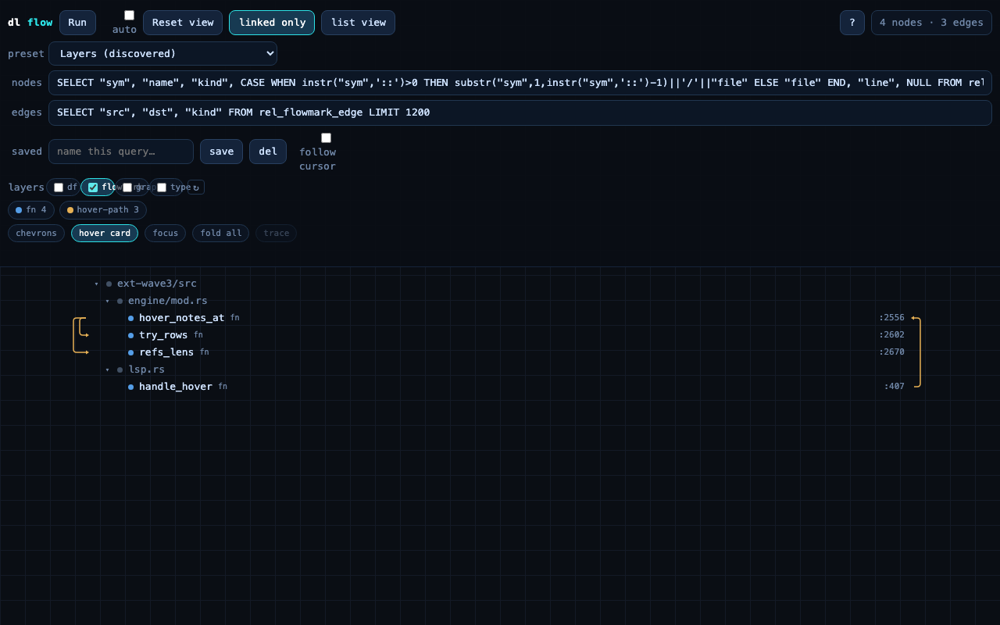
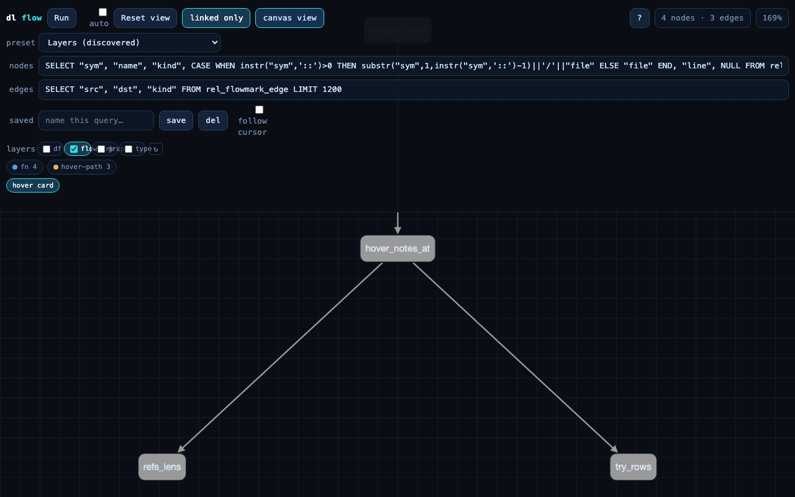

# flow-marks dogfood: recorded on sprefa itself (2026-07-10)

Six goto jumps replayed through the real `dl --lsp` stdio session via
`dl/hookEvent` (the exact request the VS Code recorder sends), over this
repo's actual sources, program = `examples/goto-flows.dl` + two `flow_take`
facts. Everything below is captured output, unedited. Driver script:
a ~90-line node LSP client (Content-Length framing, initialize, six
dl/hookEvent requests, dl/query reads, one textDocument/hover).

## The two takes

```
# take "hover-take-1"
handle_hover (src/lsp.rs:410) -> hover_notes_at (src/engine/mod.rs:2560) -> try_rows (:2605)
# take "hover-take-2"
handle_hover (src/lsp.rs:412) -> hover_notes_at (src/engine/mod.rs:2558) -> refs_lens (:2672)
# grouped by facts:
flow_take("hover-path", "hover-take-1").  flow_take("hover-path", "hover-take-2").
```

## Union vs anti-unified spine

```
== flow_stat (1 rows)
  hover-path | 2 | 3

== flow_union_edge (3 rows)
  hover-path | ...Engine.hover_notes_at | ...Engine.refs_lens
  hover-path | ...Engine.hover_notes_at | ...Engine.try_rows
  hover-path | ...handle_hover          | ...Engine.hover_notes_at

== flow_common_edge (anti-unified spine) (1 rows)
  hover-path | ...handle_hover          | ...Engine.hover_notes_at
```

Both detours (`try_rows` in take 1, `refs_lens` in take 2) washed out of the
common set. The anti-unify works on real navigation.

## Panel

Layer `flowmark` was auto-discovered from the db schema (no preset edit),
legend chips `fn 4` and `hover-path 3` (edge kind = flow name, one chip per
flow). The list rows rendering at all is also live proof of the
zero-rows offsetTop fix (same headless Chromium that reproduced the bug).





## Hover, through the real LSP

```
-> textDocument/hover  src/engine/mod.rs, decl line of hover_notes_at
{ "kind": "markdown", "value": "**in flow:** hover-path" }
```

## Verified / not verified

Verified end to end on this codebase: dl/hookEvent ingestion, jsonp
extraction, call_def sym lift, take edges, flow_take grouping, union,
anti-unify, flowmark layer discovery + both panel views, hover_note through
textDocument/hover.

NOT yet verified: the physical VS Code gesture (cmd+alt+g -> jump -> stop)
— the command path has e2e coverage but no human has recorded a real
session; needs the vsix rebuild first. hover_note spans cover only the decl
line, so hovering mid-body shows nothing (worth revisiting: widen to the
call_def span, one-line change in goto-flows.dl).
