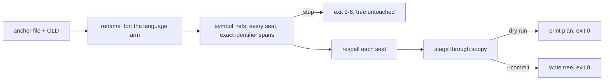

# extract rename

Rename one symbol and respell every occurrence bound to it, per language, dry
run by default. Sibling verb: `extract move --help` (a file moves, its
specifiers follow).

- [Usage](#usage)
- [What runs](#what-runs)
- [Which declaration is meant](#which-declaration-is-meant)
- [Stops and exit codes](#stops-and-exit-codes)
- [Per-language seats](#per-language-seats)
- [Receipts](#receipts)
- [Where it lives](#where-it-lives)

## Usage

```sh
extract rename src/util.rs#Helper Tool                 # dry run, prints the plan
extract rename src/util.rs#Helper Tool --commit        # writes the tree
extract rename src/app.ts#Foo Bar --at 412 --commit    # pick the declaration at byte 412
extract rename src/app.ts#Foo Bar --text-refs          # also list plain-text spellings left behind
extract rename src/app.ts#Foo Bar --verify-scip index.scip   # cross-check the plan against a SCIP index
extract rename --list renames.tsv --commit             # anchor<TAB>old<TAB>new rows
```

| flag | meaning |
|---|---|
| `<FILE>#<OLD> <NEW>` | the declaring file, the identifier as written today, the new spelling |
| `--root <dir>` | corpus root; default is the git root holding the anchor |
| `--commit` | apply; without it nothing is written |
| `--at <byte>` | byte offset inside the intended declaration when the anchor declares `OLD` more than once |
| `--text-refs` | report old-name spellings in comments, strings, markdown; never rewritten |
| `--verify-scip <index>` | report only: the SCIP count never changes the plan or the exit code |
| `--list <tsv>` | many renames, one per line; never combined with `--at` |

## What runs



One parse per file that can reach the anchor. Every seat is the identifier
token alone, no quotes, no path prefix. The core re-reads each seat before
staging; a byte mismatch is a plan error, never a silent skip.

## Which declaration is meant

Decision 2026-08-28: a binding at the anchor's root scope wins.

| anchor holds | `--at` absent | `--at <byte>` |
|---|---|---|
| one root binding, any number of nested same-name bindings | the root one renames; nested ones and their uses stay | the binding containing the byte, root or nested |
| zero root bindings, one nested | that one | same |
| zero root bindings, two or more nested | `Ambiguous`, exit 3, every site listed | the one containing the byte |
| two or more root bindings (TS merged declaration; Rust `mod` block item plus root item) | `Ambiguous`, exit 3 | the one containing the byte |

Rust: an item declared inside a function body shadows the name inside that
block only (`Decl.block`). An item in a `mod` block is a different module path
and needs `--at`. Prolog: the symbol is name/arity; two arities in one anchor
need `--at`.

## Stops and exit codes

A partial rename compiles less often than none, so an arm stops instead of
emitting a subset. Every stop writes nothing.

| exit | stop | meaning |
|---|---|---|
| 2 | plan error | usage, no arm for the file, verify failure, two texts claimed one span |
| 3 | `Ambiguous` | see the table above; pass `--at` |
| 4 | `NotFound` | `OLD` declares nothing in the anchor |
| 5 | `Inexact` | a reference the arm found but cannot span exactly (Rust `syn` column bridge on a non-ASCII line) |
| 6 | `Dynamic` | reachable only through a runtime form: TS `obj["Foo"]`, dynamic import; Rust glob `use m::*` or a macro body; Kotlin `import a.*`; Prolog `=..` or `call/N` with a variable functor |

## Per-language seats

| language | parser | definition seats | reference seats | never rewritten |
|---|---|---|---|---|
| TypeScript, JS | `oxc_semantic` scope plane; importers through `oxc_resolver` | the binding identifier | reads, writes, type refs, `import {Old}` and `export {Old}` trailing names, re-exports across files; `import {Old as local}` moves `Old` only | strings, comments, computed members (stop 6) |
| Rust | `syn` | item idents: struct, enum, trait, type, fn, const, static, mod, impl/trait members | `use` trailing segment, `ExprPath`/`TypePath` trailing segment, method call name when the anchor is a method | `macro_rules!`, attribute args, `format!` bodies (stop 6), globs (stop 6) |
| Kotlin | `tree-sitter-kotlin-sg` | `type_identifier` of class/object/interface/enum/typealias, top-level fun/property `simple_identifier` | `import a.Old` trailing name, `a.Old` fully qualified, same-package unqualified use; `import a.Old as H` moves `Old` only | strings, KDoc, annotation args, wildcard importers (stop 6) |
| Prolog | `tree-sitter-prolog` | every clause head of name/arity, the `module/2` export entry, `dynamic`/`discontiguous`/`multifile`/`table` directives | body goals in the anchor and every `use_module` importer, `mod:goal` qualified goals, import-list entries, `Name/Arity` indicators | strings, comments, `format/2` templates, variable functors (stop 6) |

Roster: `v6/sprefa-extract/src/lang/mod.rs` `renames()`. A file no arm owns
is exit 2 naming the roster.

## Receipts

| suite | what it pins |
|---|---|
| `tests/4_rename_ts.rs` | byte-exact against a hand-written `after/` tree; each stop's exit code with the tree untouched; the importer walk over `fixtures/ts_rename/exports`; `--text-refs`; `--verify-scip`; `tsc` clean on the committed tree |
| `tests/5_rename_rust.rs` | the same shape; `cargo check --offline` on the renamed no-dep fixture crate; `self_rename_is_judged_by_rustc` is `#[ignore]` (this crate renamed and `cargo check`ed, ~21 s of rustc, run by hand) |
| `tests/7_rename_kotlin.rs` | the same shape; wildcard import stop |
| `tests/8_rename_prolog.rs` | the same shape; two arities need `--at`; `swipl -g halt -l after/main.pl` exits 0 |

```sh
cd v6/sprefa-extract && cargo test --features cli --test 4_rename_ts --test 5_rename_rust --test 7_rename_kotlin --test 8_rename_prolog
```

## Where it lives

| path | role |
|---|---|
| `v6/sprefa-extract/src/0_rename.rs` | the verb: CLI, plan, stage, exit codes |
| `v6/sprefa-extract/src/1_rename_verify.rs` | `--verify-scip` |
| `v6/sprefa-extract/src/2_move_text.rs` | `--text-refs` for move and rename |
| `v6/sprefa-extract/src/rename_cx.rs` | `RenameCx`, `RenameRequest`: the corpus view an arm reads |
| `v6/sprefa-extract/src/types.rs` | `Rename` trait, `SymbolRef`, `RefRole`, `RenameStop` |
| `v6/sprefa-extract/src/lang/{ts_rename,rust_rename,kotlin_rename}.rs`, `lang/prolog/_2_rename.rs` | one arm per language |
| `plans/2026-08-27-extract-rename.PLAN.md` | the contract and the six arcs; `.visual.human.unga.md` beside it |
