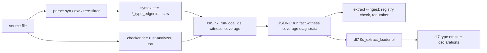

# TSI: the type-graph wire from `extract` to dl7

Living doc. Updated at every landing on this thread; the last section is the
change ledger. Truth commands beat the tables: when they disagree, run the
command and fix the table.

1. [What it is](#what-it-is)
2. [Commands](#commands)
3. [Pipeline](#pipeline)
4. [Wire](#wire)
5. [Identity](#identity)
6. [Names](#names)
7. [Per-language state](#per-language-state)
8. [dl7 consumer](#dl7-consumer)
9. [Open forks, user's](#open-forks-users)
10. [Ledger](#ledger)

## What it is

`extract --witness --family type <file>` prints one JSONL stream: `run`,
`fact`, `witness`, `coverage`, `diagnostic` records. The `fact` rows form a
type graph over run-local integer ids, spelled in a language-neutral
vocabulary (`tsi.*`) plus per-language native rows (`ts.*`, `rust.*`,
`go.*`). dl7 loads the stream and prints the graph back as declarations.

## Commands

| what | command |
|---|---|
| syntax tier, one file | `extract --witness --family type <file>` |
| checker tier, ts | `extract --witness --resolve --family type --ts-checker --project-root <dir> <files>` |
| checker tier, rust | `extract --witness --resolve --family type --rust-checker --project-root <dir> <files>` (binary built with `--features cli,rust-checker`) |
| the registry, every relation and arity | `extract --schema` |
| round trip, rc=0 or a named stop | `extract --witness --family type <file> \| extract --ingest` |
| relation counts of a stream | `... \| grep '"record":"fact"' \| grep -oE '"relation":"[a-z_.]+"' \| sort \| uniq -c` |
| dl7 load | `v7/test/4_extract_loader.test.pl` `install_streams` shows the call |
| build gates | `cd v6/sprefa-extract && cargo test --features cli` ; `cd v7 && just build` |

`--ts-checker` and `--rust-checker` are bool flags (`src/bin/extract.rs`);
the root is `--project-root`.

## Pipeline

One caption: the syntax tier is what a hand import gets; the checker tier
needs a loadable project and answers with `coverage complete` per relation
it enumerated.

## Wire

The registry is data: `v6/sprefa-extract/src/tsi/registry.rs`, printed by
`extract --schema`. The contract with identity rules and the mode contract:
`issues/extract-semantic-fact-roundtrip/item.md` `## Decisions`. Argument
shapes: `id`, `span(digest, start, end)`, `text`, `int`, `atom`.

| row family | what it says |
|---|---|
| `tsi.type`, `tsi.symbol`, `tsi.value` | declaring rows; every id an argument names is declared by one of these, `tsi.edge` arg 0, `rust.impl` arg 0, or `tsi.called` arg 2 (`src/tsi/ingest.rs` `id_closure`) |
| `tsi.origin(id, lang, span)` | where the id was declared or first written; byte offsets into the file whose `file` row carries that digest |
| `tsi.name(id, text)` | the spelling a consumer prints; see [Names](#names) |
| `tsi.product`, `tsi.sum`, `tsi.callable`, `tsi.primitive` | the shape of an id |
| `tsi.edge(edge, owner, label, target, position)` | fields, variants, members, bounds |
| `tsi.parameter`, `tsi.called`, `tsi.argument` | generics: declared parameters, written applications, their argument lists |
| `tsi.input`, `tsi.output` | callable signatures |
| `tsi.has_type(span, id)` | a value occurrence's type: const, static, typed var |
| `tsi.denotes`, `tsi.subtype`, `tsi.assignable`, `tsi.conforms`, `tsi.equivalent` | relations between ids; the last four carry a witness atom |
| `ts.*`, `rust.*`, `go.*` | native rows: interfaces, impls, lifetimes, ownership, embeddings, type sets |

## Identity

| tier | an id is |
|---|---|
| syntax | one per distinct written text per file (`TsiNames::named`, `src/types.rs`); a type parameter in scope wins (rule 4); tuples are structural, one id per occurrence, identity is their edges |
| checker, rust | nominal: one per `ModuleDef`; structural: one per (crate, rendered display string) (`src/lang/rust_checker_ra.rs` `nominal`, `rendered`) |
| checker, ts | one per tsc `Type` object, one per `Symbol` (`src/lang/ts_checker.mjs` `typeId`, `symbolId`) |
| across files | `--resolve` rebases syntax ids per file (`src/wire.rs` `tsi_rows_rebased`); `--ingest` renumbers by first appearance |

Ids are run-local. The syntax rows are dropped under `--resolve` for a
language whose checker answered (ARCH `resolve_syntax_tsi_beside_loaded_checker`,
a user fork).

## Names

Decision, Chris 2026-09-03: "send the name". Before it, the only spelling
pointer was the `tsi.origin` span and a consumer had to open the file.

| id kind | `tsi.name` text | tier |
|---|---|---|
| written type | the full written text the id is keyed on: `Vec<Option<T>>`, `std::fmt::Result`; the origin span is the last segment | syntax |
| primitive | its class; rust `()` prints `()` | syntax, checker |
| declared type parameter, callable | the written identifier | syntax |
| tuple, impl block, anonymous product | no row | syntax |
| nominal type, symbol | the definition's name | checker |
| structural type | the checker's rendering (`Option<T>`, `(element: T) => U`) | checker |

Pins: `tests/110_tsi_name.rs`, plus the semantic lists in `tests/100`,
`101`, `102`, `108`.

## Per-language state

| lang | syntax tier | checker tier | `tsi.name` | dl7 render | open |
|---|---|---|---|---|---|
| rust | `src/lang/rust_type_edges.rs`, PR #678 graph (calls, variants, methods, has_type, primitives) | rust-analyzer, `src/lang/rust_checker_ra.rs`, all cargo features, walk by supplied file, site-resolve spans | yes | PR #689 (codex-tsi) | `()` and dotted names, see forks; `rust_checker_def_map_over_sibling_targets` |
| ts | `src/lang/ts.rs` `tsi_type_id`: applications as calls, tuples/literals/unions/function types as anonymous shapes, keyword primitives, `has_type` for typed bindings (parity with rust) | tsc, `src/lang/ts_checker.mjs` | yes | IN FLIGHT (emitter generalization) | none on the syntax tier |
| go | `src/lang/go_type_edges.rs` (PR #698): structs, interfaces, type sets, generics, methods, aliases, typed consts, primitives | none | yes | IN FLIGHT (emitter generalization) | prelude has no Go primitive block (dl7 takeover); no checker tier |

Fixtures: `v6/sprefa-extract/tests/fixtures/tsi/` (`probe.ts`, `probe.rs`,
`probe_graph.rs`, `rust_probe/`, the ts and go graph probes when they land).
Tests: `tests/96` to `tests/112` in that crate; `100_tsi_intersection.rs`
pins the rows both checker tiers share over the probe pair.

## dl7 consumer

| piece | where |
|---|---|
| loader, accepted relations, foreign records | `v7/src/2_comptime/0c_extract_loader.pl` |
| primitive classes the prelude declares | `v7/prelude/5_tsi_primitives.dl7` (ts block, rust block; go block IN FLIGHT) |
| type emitter | `v7/src/3_emit/2_rust_type_emitter.pl` (rust only today; one emitter over ts/rust/go IN FLIGHT, `plans/2026-09-03-dl7-tsi-render-takeover.BRIEF.md`) |
| tests | `v7/test/4_extract_loader.test.pl`, `6_rust_type_emitter.test.pl`, `7_rust_type_region.e2e.pl` |
| render today | `User`, `User_T`, `Shape_Circle`, `User_Mapper_impl`, `unit` |
| render decided | `User`, `User.T`, `Shape.Circle`, `User.Mapper.impl`, `()` |

## Open forks, user's

| fork | where | options |
|---|---|---|
| `()` as a type in dl7 | lowerer answers `unresolved_expression_form` for an empty form in type position | DECIDED: empty product, prints `()` (U1 in the takeover brief) |
| dotted atoms `User.T` | reader atom rule `v7/src/0_reader/0_parser.pl:303-309` admits no `.` | DECIDED: admit `.` inside an atom, qualified name per modscope (U2) |
| syntax rows beside a loaded checker | ARCH `resolve_syntax_tsi_beside_loaded_checker` | drop (today) vs rebase and emit both |
| def maps over sibling targets | ARCH `rust_checker_def_map_over_sibling_targets` | all_targets false / narrow workspace / accept release 5.0s |
| ts interface vs rust trait shape | ARCH `tsi_contract_vs_trait_shape` | |

## Ledger

| date | landing | PR |
|---|---|---|
| 2026-09-02 | witness envelope, registry, multi-witness, syntax rows, ts and rust checker tiers, v7 loader, intersection (A1-A8) | #645 to #661 |
| 2026-09-03 | one hash per file, tier decline diagnostic, resolve carries syntax rows, loader skips foreign records | #671, #673, #674 |
| 2026-09-03 | rust syntax type graph D1-D7 | #678 |
| 2026-09-03 | rust checker: all features, walk by file, site-resolve spans | #680, #683, #686 |
| 2026-09-03 | `tsi.name` on every named id, both tiers, rust and ts | #688 |
| 2026-09-03 | dl7 prints written rust names (codex-tsi) | #689 (open) |
| 2026-09-03 | briefs: ts parity, go graph, dl7 takeover | #690, #691 |
| 2026-09-03 | ts syntax type graph parity T1-T3, `tests/111_ts_syntax_graph.rs` | #694 |
| 2026-09-03 | go syntax tsi rows, `tests/112_go_syntax_graph.rs` (claude-280) | #698 |
| 2026-09-03 | comptime bindings inventory and PLAN pair | #696, #697 |
