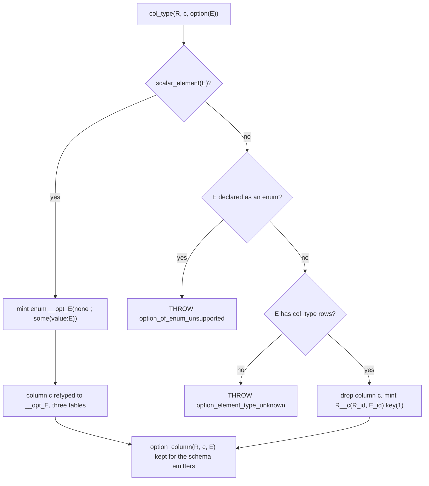

# Generics and wrapper inspection (v6)

Inspection only. No design proposal, no implementation. Every row below is a
`path:line`, a manifest bucket, or emitted DDL read out of
`v6/prolog/compile/out/`.

Paths are relative to `v6/prolog/`.

## Contents

1. [The roster](#the-roster)
2. [Doors: what the parser accepts](#doors-what-the-parser-accepts)
3. [Storage per spelling](#storage-per-spelling)
4. [The four list flavors, table by table](#the-four-list-flavors-table-by-table)
5. [option(T): two lowerings](#optiont-two-lowerings)
6. [User templates and interfaces](#user-templates-and-interfaces)
7. [Expansion order, one trace](#expansion-order-one-trace)
8. [Boundary rendering: TS, Rust, JSON Schema](#boundary-rendering-ts-rust-json-schema)
9. [Named stops](#named-stops)
10. [Manifest receipts](#manifest-receipts)
11. [Two stale claims found](#two-stale-claims-found)
12. [Out of scope](#out-of-scope)

## The roster

`type_wrapper/2` at `0_type_plane.pl:153-157` is the wrapper inventory. It has
five rows. Three more parametric spellings exist outside it: `json_list(T)`
(a storage kind, `0_type_plane.pl:113`), `acyclic(T)` (a constraint stripped
before storage, `0_option_expand.pl:38`), and user `rel_template` applications
(`compile/parse_dl_dcg.pl:477`).

| spelling | wrapper slot | element placed in | declared at |
|---|---|---|---|
| `option(T)` | `endpoint` | an id, or an enum tag | `0_type_plane.pl:153` |
| `list(T)` | `value` | member rel `value` column | `0_type_plane.pl:154` |
| `list_entity_dense_sequence(T)` | `value` | member rel `value` column | `0_type_plane.pl:155` |
| `list_interned_set(T)` | `value` | value dictionary rel | `0_type_plane.pl:156` |
| `list_entity_linked_sequence(T)` | `value` | member rel `value` column | `0_type_plane.pl:157` |
| `json_list(T)` | not a wrapper row | inside the TEXT carrier | `0_type_plane.pl:113` |
| `acyclic(T)` | not a wrapper row | erased; `acyclic_column/2` kept | `0_option_expand.pl:37-43` |
| `Template(A, B)` | not a wrapper row | minted concrete rel | `0_generic_expand.pl:500-511` |

`unwrapped_column_type/2` (`0_type_plane.pl:161-166`) walks only the five
`type_wrapper/2` constructors, so `json_list` and `acyclic` are invisible to
every caller that uses that walk.

## Doors: what the parser accepts

`type_expr//1` at `compile/parse_dl_dcg.pl:575`:

| source form | produces |
|---|---|
| `int` `text` `bool` `float` `json` | the scalar atom |
| `T?` | `option(T)` |
| `W(T)` for every `W` in `type_wrapper/2`, plus `json_list` | `W(T)` (`parse_dl_dcg.pl:581-584`) |
| `name` | the bare rel name |
| `name(Arg, ...)` | a template application (`parse_dl_dcg.pl:585-590`) |
| `rel pair(T: iface)(first: T, second: T).` | `rel_template/3` (`parse_dl_dcg.pl:477`) |
| `interface json_encodable.` | `interface_decl/2` (`parse_dl_dcg.pl:524`) |
| `rel r(...) is iface(...)` | rejected with `dl_parse_error(statement, ...)` |

`acyclic(...)` has no DCG production: grep of `compile/parse_dl_dcg.pl` for
`acyclic` returns nothing. It is a term-door spelling only, and the fixture
`acyclic_option_chain_matches_the_bare_spelling` is a term-door fixture.

## Storage per spelling

`column_storage/3` (`0_type_plane.pl:83-136`) picks the storage kind;
`column_def/4` (`lower.pl:2700-2742`) turns that kind into one column.

| storage kind | emitted column | site |
|---|---|---|
| `int` | `INTEGER NOT NULL` | `lower.pl:2700` |
| `bool` | `INTEGER NOT NULL CHECK (c IN (0,1))` | `lower.pl:2701` |
| `float` | `REAL NOT NULL CHECK (typeof = 'real' AND range)` | `lower.pl:2704` |
| `ref(Name)` | `INTEGER NOT NULL`, no FK, no cascade | `lower.pl:2713` |
| `list(T)` | `INTEGER NOT NULL` (the minted entity id) | `lower.pl:2716` |
| `json_list(T)` | `TEXT NOT NULL CHECK (json_valid AND json_type = 'array')` | `lower.pl:2721` |
| `json` | `TEXT NOT NULL CHECK (json_valid)` | `lower.pl:2733` |
| interned | `INTEGER NOT NULL` into `__str` | `lower.pl:2738` |
| `text` | `TEXT NOT NULL` | `lower.pl:2742` |

The three named list flavors never reach `column_def/4` as themselves.
`replace_generic_type/3` (`0_generic_expand.pl:948-951`) collapses them to
`int` after minting, and only bare `list(T)` keeps its spelling to the relplan.

## The four list flavors, table by table

`list_flavor_artifacts/2` (`0_generic_expand.pl:766-816`) is the whole
difference between them. Names are `__gen_<stem>_<sha256-16>` plus a suffix
(`canonical_type_name/2`, `0_generic_expand.pl:966`).

| flavor | minted rels | keys | ordered | dedupes |
|---|---|---|---|---|
| `list(T)` | `E`, `E__member` | `E(content)`, `member(list_id, idx)` | yes, `idx` | by content text |
| `list_entity_dense_sequence(T)` | `E`, `E__member`, `E__owner`, `E__refcount` | `E(id)`, `member(list_id, idx)`, `owner(owner_id, list_id)`, `refcount(list_id)` | yes, `idx` | no; refCount instead |
| `list_interned_set(T)` | `E`, `E__value`, `E__member` | `E(content_id)`, `value(value)`, `member(content_id, value_id)` | no | yes, twice: content and value |
| `list_entity_linked_sequence(T)` | `E`, `E__member`, `E__link` | `E(id)`, `member(member_id)`, `link(before, after)` | yes, by link edges | no |

Emitted DDL, read from `compile/out/list_entity_dense_sequence_end_to_end.ts:155-161`:

```sql
CREATE TABLE "__gen__list_entity_dense_sequence_text_42382f22da23f5c6"
  ("__id" INTEGER PRIMARY KEY, "id" INTEGER NOT NULL, UNIQUE ("id"));
CREATE TABLE "__gen__list_entity_dense_sequence_text_42382f22da23f5c6__member"
  ("__id" INTEGER PRIMARY KEY, "list_id" INTEGER NOT NULL, "idx" INTEGER NOT NULL,
   "value" INTEGER NOT NULL, UNIQUE ("list_id", "idx"));
CREATE TABLE "..._owner"    (..., "owner_id" INTEGER, "list_id" INTEGER, UNIQUE ("owner_id","list_id"));
CREATE TABLE "..._refcount" (..., "list_id" INTEGER, "count" INTEGER, UNIQUE ("list_id"));
CREATE TABLE "entity_parent__entries"
  (..., "entity_parent_id" INTEGER NOT NULL,
   "__gen__list_entity_dense_sequence_text_42382f22da23f5c6_id" INTEGER NOT NULL,
   UNIQUE ("entity_parent_id"));
```

The `value` column is INTEGER in all three receipts because the element is
either a rel ref (target id) or interned text (`__str` id), never inline bytes.

`json_list(T)` mints nothing. `compile/out/list_of_json_documents_round_trips.ts:144`:

```sql
CREATE TABLE "batch" ("__id" INTEGER PRIMARY KEY, "id" INTEGER NOT NULL,
  "payloads" TEXT NOT NULL CHECK (json_valid("payloads") AND json_type("payloads") = 'array'),
  UNIQUE ("id", "payloads"));
```

## option(T): two lowerings

`desugar_option_column/5` (`0_option_expand.pl:53-76`) forks on the element.



Scalar arm, `compile/out/option_text_column_reads_through_tag_join.ts:158-166`:

```sql
CREATE TABLE "__opt_text_none" ("__id" INTEGER PRIMARY KEY, "id" INTEGER NOT NULL, UNIQUE ("id"));
CREATE TABLE "__opt_text_some" ("__id" INTEGER PRIMARY KEY, "id" INTEGER NOT NULL,
  "value" INTEGER NOT NULL, UNIQUE ("value"));
CREATE TABLE "__opt_text_tag"  ("__id" INTEGER PRIMARY KEY, "id" INTEGER NOT NULL,
  "tag" INTEGER NOT NULL, "__refcount" INTEGER NOT NULL DEFAULT 1, UNIQUE ("id","tag"));
CREATE TABLE "user_profile"    ("__id" INTEGER PRIMARY KEY, "user_id" INTEGER NOT NULL,
  "email" INTEGER NOT NULL, UNIQUE ("user_id"));
```

The option column stays NOT NULL. Absence is a row in `__opt_text_none`, never
a NULL.

Reference arm, `compile/out/option_rel_ref_desugars_to_companion_split_rel.ts:156-158`:
`commit` loses the column entirely and `commit__reviewed_by(commit_id, person_id)`
carries presence, keyed on position 1.

Companion naming is `<parent>__<column>` (`0_option_expand.pl:163`); a
self-typed column qualifies the far endpoint as `<column>_<parent>_id`
(`0_option_expand.pl:186-190`) because one CREATE TABLE cannot carry the same
atom twice.

`acyclic(T)` is stripped at `0_option_expand.pl:37-43`, leaves an
`acyclic_column/2` marker, and only admits `option(<the declaring rel>)`
(`0_option_expand.pl:48`). The guard is default-on for a self-typed option
column whether or not the author spelled it (`0_option_expand.pl:168-173`).

## User templates and interfaces

A template is one decl term and mints declarations only; rules stay
author-written (`0_generic_expand.pl:4-5`, ruling `generic_template_rules`).

| stage | predicate | site |
|---|---|---|
| collect applications in column position | `user_template_instances/3` | `0_generic_expand.pl:477` |
| arity check against the parameter list | `check_template_application_arities/2` | `0_generic_expand.pl:489` |
| substitute and mint `type_decl` + `col_type` rows | `instantiate_user_template/4` | `0_generic_expand.pl:502` |
| name the instance | `canonical_type_name/2`, sha256 first 16 hex | `0_generic_expand.pl:966` |
| discharge bounds, emit judgment rows | `judge_template_bounds/4` | `0_generic_expand.pl:538` |
| collision check against author names | `throw_on_author_collision/3` | `0_generic_expand.pl:677` |

`rel pair(T: json_encodable)(first: T, second: T).` with a column typed
`pair(int)` emits one ordinary table,
`compile/out/bounded_template_ground_instance.ts:156`:

```sql
CREATE TABLE "__gen__pair_int_8b7ec0fa0e1f9d69" ("__id" INTEGER PRIMARY KEY,
  "first" INTEGER NOT NULL, "second" INTEGER NOT NULL, UNIQUE ("first","second"));
```

Interfaces carry no members. `interface_decl(Name, Parameters)` is a name plus
parameter names. A generic bound names an interface application:
`rel box(T: json_encodable(any))(value: T).` keeps `T` as the implementing
type and treats `any` as a wildcard for one complete interface argument.
`rel text_box(T: encodable_as(text))(value: T).` requires the exact argument.
Bare interfaces remain zero-argument shorthand. Bounds use the same
application spelling. Structural proofs live in the
compiler `$type` plane and are erased before runtime declarations; ordered
application arguments remain in catalog metadata for type generation.

The type IR leaving expansion is `semantic_type_rows/1`, one sorted set of
`declaration/5`, `parameter/4`, `member/5`, `constraint/3`, application,
`derived_from/2`, and judgment rows
(`0_generic_expand.pl:140-150`, `0_generic_expand.pl:402-406`). Ids come from
`0_type_ids.pl` labels and ordinals, never source order.

## Expansion order, one trace

`expand_generic_program/2` (`0_generic_expand.pl:32-41`) runs nine stages.
Trace on the committed fixture
`option_dense_sequence_of_rel_round_trips_absent_and_present`
(`compile/dl_view/option_dense_sequence_of_rel_round_trips_absent_and_present.dl6`):

```
source   rel fighter_summary(name: text, url: text).
         rel squad(id: int, members: option(list_entity_dense_sequence(fighter_summary))) key(1).

step 1  expand_user_templates          no rel_template present -> decls unchanged, TypeIr rows built
step 2  generic_fixpoint               generic_type(option(X)) holds since X is a list flavor
                                       instance set = [list_entity_dense_sequence(fighter_summary)]
                                       mints 12 decls: E(id), E__member(list_id,idx,value),
                                       E__owner(owner_id,list_id), E__refcount(list_id,count) + 4 keyed
                                       rescan finds no new instance -> fixpoint
step 3  validate_generated_name_collisions   4 minted names, all distinct, none authored
step 4  expand_list_decodes            no decode(_, [.. X]) goal -> rule terms returned unchanged
step 5  replace_generic_types          option(flavor) -> option('__gen__list_..._bb78bd1b4eb62d42')
step 6  generic_artifact_order         author decls first, the 12 minted decls after
step 7  merge_flavor_type_rows         declaration/derived_from rows for E, __member, __owner, __refcount
step 8  expand_option_decls            element is a declared rel -> reference arm:
                                       squad drops `members`, mints
                                       squad__members(squad_id, __gen__..._id) key(1)
step 9  retarget_type_decl_mirrors     type_decl(squad, ...) rebuilt from surviving col_type rows
```

Emitted result, `compile/out/option_dense_sequence_of_rel_round_trips_absent_and_present.ts:166-174`:
five minted tables plus `squad("__id","id")` and
`squad__members("__id","squad_id","__gen__list_entity_dense_sequence_fighter_summary_bb78bd1b4eb62d42_id")`.

Termination of step 2 is by worklist: `generic_fixpoint_/4`
(`0_generic_expand.pl:709-721`) subtracts already-minted instances each pass
and stops when the new set is empty, so a list whose element is itself a list
mints inner-first over successive passes.

## Boundary rendering: TS, Rust, JSON Schema

The catalog kind, not the source spelling, is what the emitters read.

| catalog kind | TS (`compile/7_emit_ts_types.pl:118-136`) | Rust (`compile/8_emit_rust_types.pl:118-136`) | JSON Schema (`compile/4_emit_jsonschema.pl:136-151`) |
|---|---|---|---|
| `primitive int` / `float` | `number` | `i64` / `f64` | per `primitive_schema/2` |
| `primitive text` | `string` | `String` | string |
| `primitive bool` | `boolean` | `bool` | boolean |
| `primitive json` | `unknown` | `serde_json::Value` | permissive |
| `json_list` | `Array<E>` | `Vec<E>` | `{type: array, items: E}` |
| `list` | `Array<E>` | `Vec<E>` | `{type: array, items: E}` |
| `option` | `E \| null` | `Option<E>` | `{anyOf: [E, {type: null}]}` |
| `rel` | named type, module-prefixed on collision | same | `$ref` |
| `type_parameter` | the parameter name verbatim | the parameter name verbatim | no clause |

Catalog rows for lists exist only for `json_list(T)` and `list(T)`
(`list_row_kind/3`, `lower.pl:2007-2008`). The three named flavors have no
catalog row and no boundary render; they collapsed to `int` at step 5.

`option` rows do not survive expansion either. `4_emit_jsonschema.pl:52-94`
rebuilds them from the `option_column/3` markers, and only for the five scalar
elements (`scalar_option_element/1`, `:65-69`). A reference-arm option column
is gone from its parent rel by then and gets no `anyOf`.

## Named stops

Every one is a `throw(unsupported_construct(...))`, with a fixture in the
manifest bucket `unsupported`.

| stop | throw site | fixture |
|---|---|---|
| `list_of_relation_refs(E)` | `0_type_plane.pl:123` | `list_of_relation_refs_still_refused` |
| `list_element_not_scalar(E)` | `0_type_plane.pl:124` | none in manifest |
| `column_type_unknown(N)` | `0_type_plane.pl:137` | `option_list_of_unknown_name_keeps_its_stop` |
| `acyclic_not_a_self_option/3` | `0_option_expand.pl:50` | `acyclic_over_another_rels_option_is_named` |
| `option_column_untyped_siblings(R)` | `0_option_expand.pl:56` | none in manifest |
| `option_in_key_column/2` | `0_option_expand.pl:60` | `option_in_key_column_is_refused` |
| `option_of_enum_unsupported(E)` | `0_option_expand.pl:69` | none in manifest |
| `option_element_type_unknown(E)` | `0_option_expand.pl:74` | `option_of_json_list_keeps_its_stop`, `option_of_option_of_scalar_keeps_its_stop` |
| `option_companion_name_collision/3` | `0_option_expand.pl:134` | `option_companion_name_collision_is_named` |
| `interface_unknown(N)` | `0_generic_expand.pl:340,344,380` | `unknown_bound_interface_is_named` |
| `interface_duplicate(N)` | `0_generic_expand.pl:349` | none in manifest |
| `generic_template_arity/3` | `0_generic_expand.pl:497` | none in manifest |
| `generic_bound_unsatisfied/3` | `0_generic_expand.pl:552` | `unsatisfied_bound_names_the_path` |
| `generic_generated_name_collision(N)` | `0_generic_expand.pl:680` | none in manifest |
| `list_interned_set_relation_element(E)` | `0_generic_expand.pl:702` | `list_interned_set_relation_element_refused`, `option_of_interned_set_of_rel_is_refused` |
| `generic_type_not_ground(T)` | `0_generic_expand.pl:755` | none in manifest |
| `reference_target_has_no_columns(R/0)` | `0_generic_expand.pl:931` | `reference_target_emptied_by_option_split_is_named` |
| `duplicate_generic_parameter(P)` | `compile/parse_dl_dcg.pl:518` | none in manifest |

Two stops are stacked rather than independent: `option(option(int))` and
`option(json_list(int))` both land on `option_element_type_unknown`, because
`desugar_option_column/5` tests scalar, then enum, then declared-rel, and a
compound element matches none of the three. Neither is a checked impossibility;
each is an untaken branch.

## Manifest receipts

Read from `compile/out/manifest.json`, 448 rows total, 341 `compiled` /
107 `unsupported`. Wrapper-related rows: 55, of which 13 are `unsupported`.
Compiled coverage per spelling:

| spelling | compiled fixtures |
|---|---|
| `list(T)` | `list_bare_column_round_trips`, `list_bare_text_door`, `nested_list_text_door`, `rel_element_list_round_trips`, `nested_rel_element_list_round_trips`, `list_mint_order_follows_content_text_not_derivation_order` |
| `list_entity_dense_sequence(T)` | `list_entity_dense_sequence_end_to_end`, `list_dense_sequence_text_door`, `option_dense_sequence_of_rel_round_trips_absent_and_present` |
| `list_interned_set(T)` | `list_interned_set_end_to_end`, `list_interned_set_text_door`, `list_interned_set_dictionary_content_deduplicates`, `split_value_is_the_interned_list_id`, `two_producers_share_one_interned_list_id` |
| `list_entity_linked_sequence(T)` | `list_entity_linked_sequence_end_to_end`, `list_linked_sequence_text_door` |
| `json_list(T)` | `list_of_json_documents_round_trips`, `nested_list_of_text_round_trips`, `head_column_list_and_json_share_storage` |
| `option(T)` | `option_text_column_reads_through_tag_join`, `option_scalar_enums_mint_per_element_type`, `option_rel_ref_desugars_to_companion_split_rel`, `option_list_column_roundtrips_null_and_present`, `option_list_of_rel_round_trips_absent_and_present`, `option_rel_on_a_reference_target_round_trips_absent_and_present`, `option_list_of_scalar_and_of_rel_in_one_rel`, `module_path_and_option_column_coexist`, `nested_child_and_an_option_column_coexist` |
| `acyclic(T)` | `acyclic_option_chain_matches_the_bare_spelling`, `self_ref_option_chain_reads_through_the_companion`, `recursive_enum_acyclic_tree_round_trips` |
| templates | `bounded_template_ground_instance`, `two_bounded_parameters_mint_one_instance`, `nested_bounded_template_instance`, `mixed_bounded_and_free_parameters`, `generic_expansion_end_to_end` |

## Two stale claims found

1. `0_generic_expand.pl:683-685` says the four list constructors are
   "term-door-only lab constructors. No parser spelling is claimed here."
   `compile/parse_dl_dcg.pl:581-584` enumerates `type_wrapper/2` and so accepts
   every one of them, and four `*_text_door` fixtures parse them from `.dl6`
   text and sit in bucket `compiled`. The comment is wrong; `acyclic` is the
   only term-door-only spelling.

2. `CLAUDE.md` states `4_emit_jsonschema.pl:121` "papers over it by dropping
   option columns from `required`". At `compile/4_emit_jsonschema.pl:121`
   `required` is every property key (`:125` writes it), option columns
   included, and
   `kind_schema/7` at `:144-146` renders `{anyOf: [E, {type: null}]}`. The
   present schema is required-and-nullable, not looser by omission. The
   distinction `CLAUDE.md` raises (key absent vs key present and null) still
   holds; the mechanism named for it does not.

## Out of scope

- The Rust runtime's own reading of these tables (`v6/sprefa-engine-rs`): not
  inspected here, only the emitted type text at `compile/8_emit_rust_types.pl`.
- `enum_decl` expansion (`0_enum_expand.pl`): a wrapper only where
  `option(<enum>)` throws.
- Any proposal for type parameters on rules, generic bodies, or dispatch. This
  document ends at what exists.
