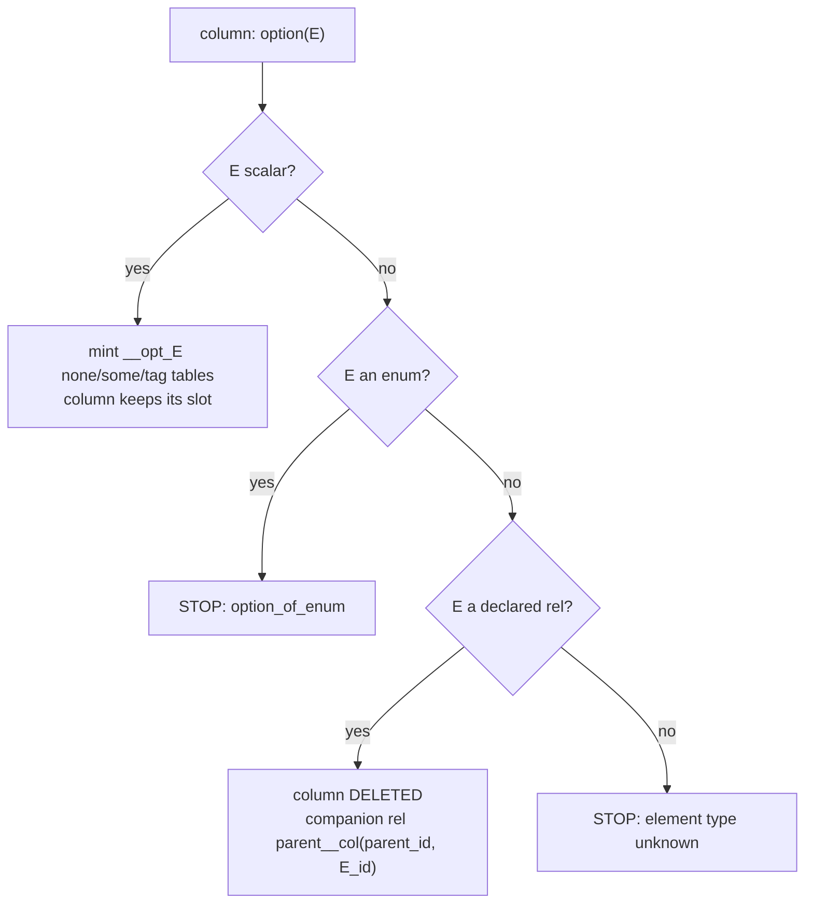
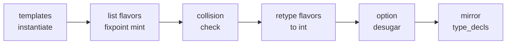

# Generics and wrappers: what exists today

Companion to `generics-wrapper-inspection.md` (that one has the citations).
Inspection only; nothing here proposes a design.

## Contents

1. [The eight spellings](#the-eight-spellings)
2. [Where the bytes go](#where-the-bytes-go)
3. [The four list flavors](#the-four-list-flavors)
4. [option: one spelling, two machines](#option-one-spelling-two-machines)
5. [Templates and interfaces](#templates-and-interfaces)
6. [The expansion pipeline](#the-expansion-pipeline)
7. [Stops: untaken branches, not walls](#stops-untaken-branches-not-walls)
8. [Two stale claims](#two-stale-claims)

## The eight spellings

| spelling | what it is | text door? |
|---|---|---|
| `option(T)` / `T?` | value-or-none | yes |
| `list(T)` | ordered, dedupes by content | yes |
| `list_entity_dense_sequence(T)` | ordered, refCounted, no dedupe | yes |
| `list_interned_set(T)` | unordered, dedupes twice | yes |
| `list_entity_linked_sequence(T)` | ordered by link edges | yes |
| `json_list(T)` | a JSON array inside one TEXT cell | yes |
| `acyclic(T)` | a cycle guard, erased before storage | term door only |
| `Template(A, B)` | user template application, mints a concrete rel | yes |

## Where the bytes go

Every wrapper column ends up as one `INTEGER NOT NULL` id. The value lives in
minted side tables (lists, option) or the string dictionary (text). Only
`json` / `json_list` keep bytes inline, as checked TEXT. No NULLs anywhere:
absence is always a row in a tag table.

## The four list flavors

| flavor | ordered | dedupes | extra machinery |
|---|---|---|---|
| `list` | by idx | by content | none |
| `dense_sequence` | by idx | no | owner + refCount tables |
| `interned_set` | no | content AND value | value dictionary |
| `linked_sequence` | by link edges | no | before/after edge table |

Each flavor mints 2-4 tables named `__gen_<stem>_<hash>`. After minting, the
three named flavors collapse to plain `int` columns; only bare `list(T)` is
still visible to the boundary emitters (TS `Array<E>`, Rust `Vec<E>`).

## option: one spelling, two machines

Scalar arm: presence is a row in `__opt_E_some`, absence a row in
`__opt_E_none`. Reference arm: the column vanishes and a companion rel carries
presence. `acyclic` rides only on a self-typed option column and turns into a
default-on cycle guard.

## Templates and interfaces

A template mints declarations only; you still write every rule yourself.
`pair(int)` becomes one ordinary table with a hashed name. An interface is a
compile-time bound with zero members and zero runtime dispatch: a rel
satisfies it by declaring `is iface(...)` or by structural admission.

## The expansion pipeline

The fixpoint mints inner lists first, so a list of lists works over successive
passes and stops when a pass mints nothing new.

## Stops: untaken branches, not walls

19 named stops; 10 of them have NO fixture pinning them. The three everyone
asks about — `option(option(T))`, `option(<enum>)`, `option(json_list(T))` —
all fall through one desugar test chain (scalar? enum? declared rel?) and land
in the same catch-all. Each is an untaken branch. None is a checked
impossibility.

## Two stale claims

1. A compiler comment says the list flavors are term-door-only. The parser
   accepts all four from `.dl6` text and fixtures prove it. `acyclic` is the
   only term-door-only spelling.
2. CLAUDE.md says the JSON Schema emitter drops option columns from
   `required`. It does not: it renders required-and-nullable. The absent-key
   vs present-null gap is real, but that named mechanism is not how it leaks.
