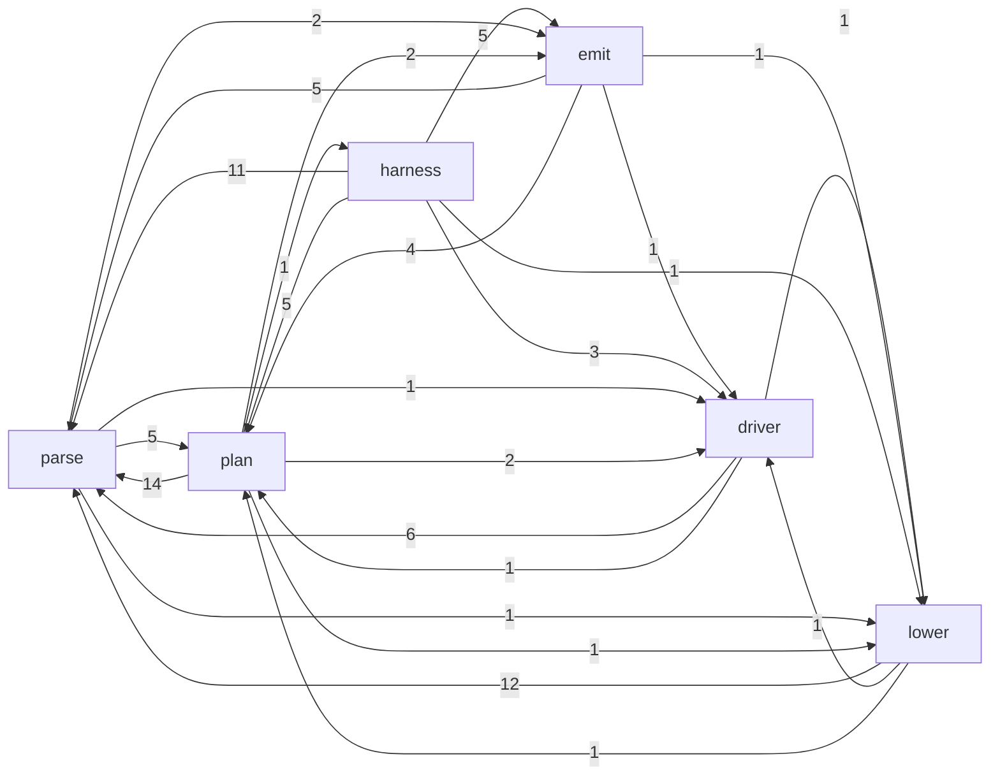
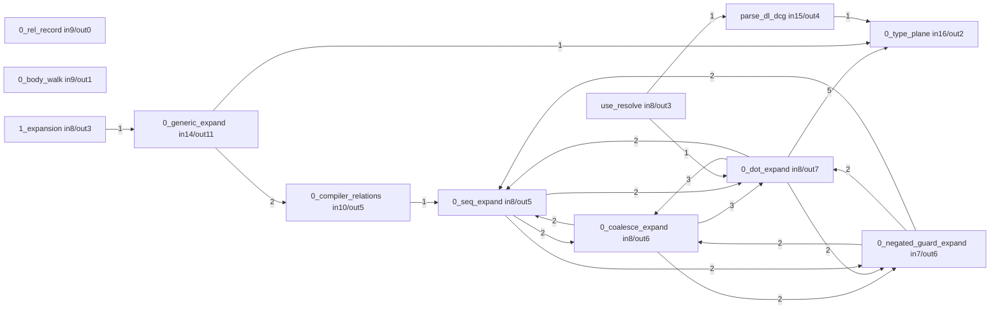
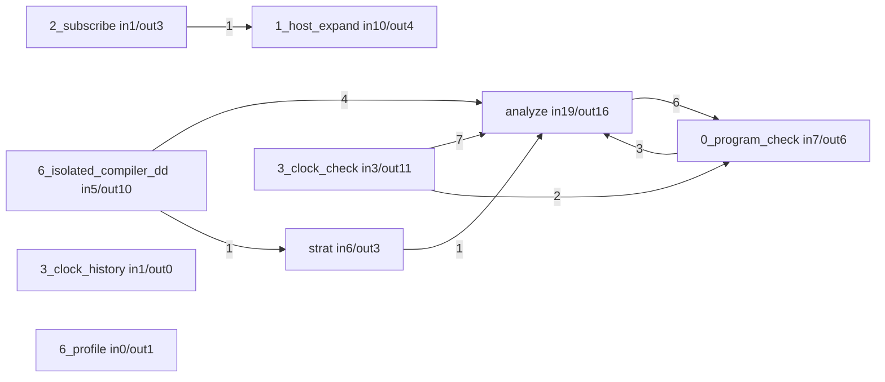
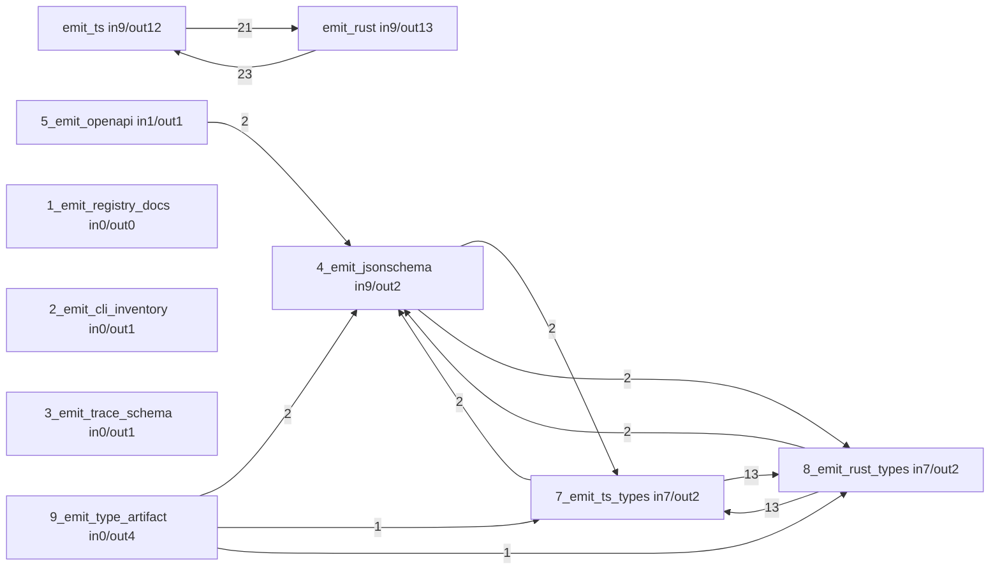
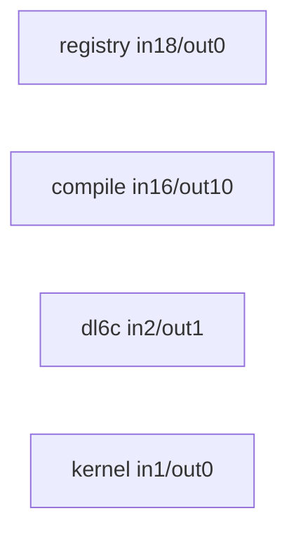
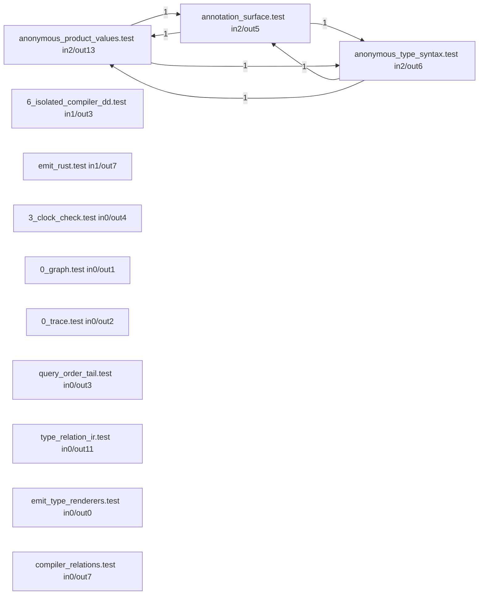

# The dl6 compiler, read by sprefa-extract

Generated by `just selfdoc` from `v6/dl/selfdoc/selfdoc.dl6`. Every number
is a row that program derived; edit the program, never this file.

A module edge is a CALL: a callee names a name and never a file, so a name
several files define resolves to all of them. The map over-links.

- [The phase graph](#the-phase-graph)
- [parse](#parse)
- [plan](#plan)
- [lower](#lower)
- [emit](#emit)
- [driver](#driver)
- [harness](#harness)
- [unphased](#unphased)
- [fixture](#fixture)
- [The host roster](#the-host-roster)
- [Orphan predicates](#orphan-predicates)
- [The twenty hottest symbols](#the-twenty-hottest-symbols)

## The phase rule

Every file makes one or more ranked phase CLAIMS and the lowest rank wins.

| rank | claim | phase |
|---:|---|---|
| 1 | under `v6/prolog/conformance/` | fixture |
| 2 | stem ends `.test` | harness |
| 3 | a `phase_driver` row, from compile.pl:657/819/822/836 | that row |
| 4 | stem contains `emit` | emit |
| 5 | stem starts `0_` or `1_` | parse |
| 5 | stem starts `2_`..`9_` | plan |
| 6 | any other prolog file | unphased |

## The phase graph

An edge counts the distinct TARGET modules the source phase calls into.

## parse

Source text to an expanded program: the DCG, `expand_uses/8`, and the `0_`/`1_` expansion passes.

12 of 27 modules are drawn, ranked by fan-in; every one is in the table.

| module | defs | sites | fan-in | fan-out |
|---|---:|---:|---:|---:|
| `v6/prolog/0_type_plane.pl` | 75 | 112 | 16 | 2 |
| `v6/prolog/compile/parse_dl_dcg.pl` | 218 | 284 | 15 | 4 |
| `v6/prolog/0_generic_expand.pl` | 320 | 316 | 14 | 11 |
| `v6/prolog/0_compiler_relations.pl` | 38 | 56 | 10 | 5 |
| `v6/prolog/0_rel_record.pl` | 18 | 13 | 9 | 0 |
| `v6/prolog/0_body_walk.pl` | 14 | 23 | 9 | 1 |
| `v6/prolog/0_dot_expand.pl` | 71 | 93 | 8 | 7 |
| `v6/prolog/use_resolve.pl` | 44 | 76 | 8 | 3 |
| `v6/prolog/0_coalesce_expand.pl` | 22 | 40 | 8 | 6 |
| `v6/prolog/0_seq_expand.pl` | 16 | 41 | 8 | 5 |
| `v6/prolog/1_expansion.pl` | 12 | 21 | 8 | 3 |
| `v6/prolog/0_negated_guard_expand.pl` | 8 | 14 | 7 | 6 |
| `v6/prolog/0_option_expand.pl` | 34 | 49 | 6 | 0 |
| `v6/prolog/0_type_ids.pl` | 16 | 19 | 6 | 0 |
| `v6/prolog/print_dl.pl` | 72 | 97 | 5 | 3 |
| `v6/prolog/0_cst_query.pl` | 37 | 53 | 5 | 1 |
| `v6/prolog/0_anonymous_expand.pl` | 36 | 58 | 5 | 5 |
| `v6/prolog/compile/0_trace.pl` | 19 | 41 | 5 | 0 |
| `v6/prolog/0_enum_expand.pl` | 35 | 50 | 4 | 5 |
| `v6/prolog/0_ast_expand.pl` | 26 | 41 | 4 | 4 |
| `v6/prolog/compile/scripts/0_json_arrival.pl` | 14 | 45 | 4 | 0 |
| `v6/prolog/0_graph.pl` | 17 | 25 | 2 | 0 |
| `v6/prolog/0_unsupported_messages.pl` | 21 | 40 | 1 | 2 |
| `v6/prolog/0_match_expand.pl` | 13 | 29 | 1 | 2 |
| `v6/prolog/0_relation_pattern.pl` | 6 | 20 | 1 | 3 |
| `v6/prolog/0_annotation_expand.pl` | 4 | 6 | 1 | 0 |
| `v6/prolog/0_relation_edge_expand.pl` | 11 | 22 | 0 | 2 |

## plan

The expanded program to a `plan/9` term: analysis, stratification, host expansion, the checks.

| module | defs | sites | fan-in | fan-out |
|---|---:|---:|---:|---:|
| `v6/prolog/analyze.pl` | 127 | 144 | 19 | 16 |
| `v6/prolog/1_host_expand.pl` | 58 | 88 | 10 | 4 |
| `v6/prolog/0_program_check.pl` | 46 | 91 | 7 | 6 |
| `v6/prolog/strat.pl` | 14 | 31 | 6 | 3 |
| `v6/prolog/compile/6_isolated_compiler_dd.pl` | 96 | 120 | 5 | 10 |
| `v6/prolog/3_clock_check.pl` | 37 | 68 | 3 | 11 |
| `v6/prolog/2_subscribe.pl` | 5 | 12 | 1 | 3 |
| `v6/prolog/compile/test/3_clock_history.pl` | 4 | 0 | 1 | 0 |
| `v6/prolog/6_profile.pl` | 7 | 25 | 0 | 1 |

## lower

The plan to SQL text. One module, and the largest in the tree.

| module | defs | sites | fan-in | fan-out |
|---|---:|---:|---:|---:|
| `v6/prolog/lower.pl` | 545 | 530 | 21 | 17 |

## emit

Lowered SQL to a host language: the two doors plus the type and schema artifact emitters.

| module | defs | sites | fan-in | fan-out |
|---|---:|---:|---:|---:|
| `v6/prolog/emit_ts.pl` | 216 | 219 | 9 | 12 |
| `v6/prolog/emit_rust.pl` | 79 | 100 | 9 | 13 |
| `v6/prolog/compile/4_emit_jsonschema.pl` | 66 | 88 | 9 | 2 |
| `v6/prolog/compile/8_emit_rust_types.pl` | 86 | 96 | 7 | 2 |
| `v6/prolog/compile/7_emit_ts_types.pl` | 44 | 50 | 7 | 2 |
| `v6/prolog/compile/5_emit_openapi.pl` | 12 | 17 | 1 | 1 |
| `v6/prolog/compile/1_emit_registry_docs.pl` | 25 | 39 | 0 | 0 |
| `v6/prolog/compile/2_emit_cli_inventory.pl` | 4 | 7 | 0 | 1 |
| `v6/prolog/compile/3_emit_trace_schema.pl` | 4 | 7 | 0 | 1 |
| `v6/prolog/compile/9_emit_type_artifact.pl` | 4 | 10 | 0 | 4 |

## driver

The entry points and the tables everything reads.

| module | defs | sites | fan-in | fan-out |
|---|---:|---:|---:|---:|
| `v6/prolog/compile/registry.pl` | 20 | 16 | 18 | 0 |
| `v6/prolog/compile.pl` | 81 | 125 | 16 | 10 |
| `v6/prolog/dl6c.pl` | 15 | 31 | 2 | 1 |
| `v6/prolog/src/kernel.pl` | 4 | 3 | 1 | 0 |

## harness

plunit batteries and the graders. Not part of a compile.

12 of 18 modules are drawn, ranked by fan-in; every one is in the table.

| module | defs | sites | fan-in | fan-out |
|---|---:|---:|---:|---:|
| `v6/prolog/compile/test/anonymous_product_values.test.pl` | 6 | 27 | 2 | 13 |
| `v6/prolog/compile/test/anonymous_type_syntax.test.pl` | 5 | 27 | 2 | 6 |
| `v6/prolog/compile/test/annotation_surface.test.pl` | 3 | 8 | 2 | 5 |
| `v6/prolog/compile/test/6_isolated_compiler_dd.test.pl` | 24 | 41 | 1 | 3 |
| `v6/prolog/compile/test/emit_rust.test.pl` | 5 | 21 | 1 | 7 |
| `v6/prolog/compile/test/3_clock_check.test.pl` | 12 | 43 | 0 | 4 |
| `v6/prolog/compile/test/0_graph.test.pl` | 8 | 34 | 0 | 1 |
| `v6/prolog/compile/test/0_trace.test.pl` | 7 | 34 | 0 | 2 |
| `v6/prolog/compile/test/query_order_tail.test.pl` | 7 | 19 | 0 | 3 |
| `v6/prolog/compile/test/type_relation_ir.test.pl` | 7 | 50 | 0 | 11 |
| `v6/prolog/compile/test/emit_type_renderers.test.pl` | 5 | 8 | 0 | 0 |
| `v6/prolog/compile/test/compiler_relations.test.pl` | 3 | 28 | 0 | 7 |
| `v6/prolog/compile/test/diag.test.pl` | 3 | 9 | 0 | 1 |
| `v6/prolog/compile/test/dl6c.test.pl` | 3 | 19 | 0 | 1 |
| `v6/prolog/compile/test/shared_frontier.test.pl` | 3 | 12 | 0 | 2 |
| `v6/prolog/compile/test/anonymous_sum_values.test.pl` | 2 | 18 | 0 | 7 |
| `v6/prolog/compile/test/scip_namespaces.test.pl` | 2 | 15 | 0 | 2 |
| `v6/prolog/compile/test/typed_host_contracts.test.pl` | 2 | 11 | 0 | 4 |

## unphased

Prolog files the rule places nowhere: tools, labs, and one-off scripts.

| module | defs | sites | fan-in | fan-out |
|---|---:|---:|---:|---:|
| `v6/prolog/compile/test/run_sql_check.pl` | 37 | 65 | 9 | 6 |
| `v6/prolog/compile/scripts/metamorphic_rename.pl` | 69 | 107 | 7 | 11 |
| `v6/prolog/sweep.pl` | 54 | 104 | 7 | 12 |
| `v6/prolog/tools/self_map_facts.pl` | 15 | 43 | 6 | 6 |
| `v6/prolog/compile/test/plunit_tests.pl` | 200 | 343 | 4 | 102 |
| `v6/prolog/compile/test/dd/isolated_compiler_dd_unsupported_fixture.pl` | 1 | 0 | 4 | 0 |
| `v6/prolog/src/grader.pl` | 1 | 7 | 4 | 0 |
| `v6/prolog/compile/scripts/arm_census.pl` | 39 | 79 | 3 | 4 |
| `v6/prolog/compile_messages.pl` | 12 | 23 | 3 | 0 |
| `v6/prolog/labs/break-hunt/oracle_case.pl` | 6 | 23 | 3 | 7 |
| `v6/prolog/compile/oracle_dump.pl` | 27 | 62 | 2 | 4 |
| `v6/prolog/diag.pl` | 16 | 31 | 2 | 1 |
| `v6/prolog/compile/scripts/text_door_receipt.pl` | 15 | 31 | 2 | 2 |
| `v6/prolog/tools/arch_map.pl` | 14 | 29 | 2 | 2 |
| `v6/prolog/compile/scripts/golden_oracle.pl` | 7 | 20 | 2 | 7 |
| `v6/prolog/compile/scripts/dl6_oracle.pl` | 4 | 15 | 2 | 5 |
| `v6/prolog/sweep_timings.pl` | 3 | 14 | 2 | 0 |
| `v6/prolog/ARCH.pl` | 20 | 12 | 1 | 3 |
| `v6/prolog/compile/typegen_export.pl` | 19 | 52 | 1 | 6 |
| `v6/prolog/compile/scripts/bop_check.pl` | 8 | 22 | 1 | 2 |
| `v6/prolog/compile/test/run_plunit.pl` | 34 | 80 | 0 | 0 |
| `v6/prolog/tools/prolog_lint.pl` | 22 | 45 | 0 | 0 |
| `v6/prolog/compile/scripts/golden_coverage.pl` | 19 | 42 | 0 | 1 |
| `v6/prolog/examples/ghcacher.pl` | 10 | 5 | 0 | 2 |
| `v6/prolog/cpg_edge_vocab.pl` | 8 | 16 | 0 | 0 |
| `v6/prolog/src/checks.pl` | 6 | 7 | 0 | 0 |
| `v6/prolog/compile/debug_dbg.pl` | 1 | 2 | 0 | 0 |
| `v6/prolog/compile/test/dd/float_avg_is_grouped.dd.pl` | 1 | 0 | 0 | 0 |
| `v6/prolog/compile/test/dd/float_exact_join_has_no_epsilon.dd.pl` | 1 | 0 | 0 | 0 |
| `v6/prolog/compile/test/dd/retraction_only_tick_retracts_level_view.dd.pl` | 1 | 0 | 0 | 0 |

## fixture

Conformance fixtures. Independent programs, drawn as a table only.

| module | defs | sites | fan-in | fan-out |
|---|---:|---:|---:|---:|
| `v6/prolog/conformance/engine.pl` | 55 | 96 | 13 | 83 |
| `v6/prolog/conformance/body.pl` | 46 | 88 | 12 | 2 |
| `v6/prolog/conformance/ticklog.pl` | 21 | 47 | 6 | 74 |
| `v6/prolog/conformance/fixtures/8_json_flex.pl` | 2 | 0 | 4 | 0 |
| `v6/prolog/conformance/fixtures/0_decl_order.pl` | 1 | 0 | 4 | 0 |
| `v6/prolog/conformance/fixtures/0_enum_variants.pl` | 1 | 0 | 4 | 0 |
| `v6/prolog/conformance/fixtures/0_generic_expand.pl` | 1 | 0 | 4 | 0 |
| `v6/prolog/conformance/fixtures/0_list_text_door.pl` | 1 | 0 | 4 | 0 |
| `v6/prolog/conformance/fixtures/0_option_type.pl` | 1 | 0 | 4 | 0 |
| `v6/prolog/conformance/fixtures/10_list_elements.pl` | 1 | 0 | 4 | 0 |
| `v6/prolog/conformance/fixtures/10_text_scalars.pl` | 1 | 0 | 4 | 0 |
| `v6/prolog/conformance/fixtures/11_string_std_builtins.pl` | 1 | 0 | 4 | 0 |
| `v6/prolog/conformance/fixtures/11_variant_field_types.pl` | 1 | 0 | 4 | 0 |
| `v6/prolog/conformance/fixtures/12_enum_rel_payload.pl` | 1 | 0 | 4 | 0 |
| `v6/prolog/conformance/fixtures/12_string_substr_instr.pl` | 1 | 0 | 4 | 0 |
| `v6/prolog/conformance/fixtures/13_initcap.pl` | 1 | 0 | 4 | 0 |
| `v6/prolog/conformance/fixtures/13_option_list_columns.pl` | 1 | 0 | 4 | 0 |
| `v6/prolog/conformance/fixtures/14_option_wrapper_walk.pl` | 1 | 0 | 4 | 0 |
| `v6/prolog/conformance/fixtures/15_string_split.pl` | 1 | 0 | 4 | 0 |
| `v6/prolog/conformance/fixtures/16_string_affix_tests.pl` | 1 | 0 | 4 | 0 |
| `v6/prolog/conformance/fixtures/17_recursive_enum.pl` | 1 | 0 | 4 | 0 |
| `v6/prolog/conformance/fixtures/18_recursive_list_arg.pl` | 1 | 0 | 4 | 0 |
| `v6/prolog/conformance/fixtures/19_list_value_position.pl` | 1 | 0 | 4 | 0 |
| `v6/prolog/conformance/fixtures/1_match_block.pl` | 1 | 0 | 4 | 0 |
| `v6/prolog/conformance/fixtures/20_parent_chain.pl` | 1 | 0 | 4 | 0 |
| `v6/prolog/conformance/fixtures/21_list_mint_order.pl` | 1 | 0 | 4 | 0 |
| `v6/prolog/conformance/fixtures/21_template_bounds.pl` | 1 | 0 | 4 | 0 |
| `v6/prolog/conformance/fixtures/22_ref_column_collision.pl` | 1 | 0 | 4 | 0 |
| `v6/prolog/conformance/fixtures/23_diverging_recursion.pl` | 1 | 0 | 4 | 0 |
| `v6/prolog/conformance/fixtures/24_mutual_recursion.pl` | 1 | 0 | 4 | 0 |
| `v6/prolog/conformance/fixtures/25_parameterized_enum.pl` | 1 | 0 | 4 | 0 |
| `v6/prolog/conformance/fixtures/2_hosts_wiring.pl` | 1 | 0 | 4 | 0 |
| `v6/prolog/conformance/fixtures/3_flagship_callgraph.pl` | 1 | 0 | 4 | 0 |
| `v6/prolog/conformance/fixtures/4_flagship_flow.pl` | 1 | 0 | 4 | 0 |
| `v6/prolog/conformance/fixtures/4_struct_values.pl` | 1 | 0 | 4 | 0 |
| `v6/prolog/conformance/fixtures/5_compiler_quality.pl` | 1 | 0 | 4 | 0 |
| `v6/prolog/conformance/fixtures/5_flow_value_plane.pl` | 1 | 0 | 4 | 0 |
| `v6/prolog/conformance/fixtures/5_value_plane.pl` | 1 | 0 | 4 | 0 |
| `v6/prolog/conformance/fixtures/6_relation_depth.pl` | 1 | 0 | 4 | 0 |
| `v6/prolog/conformance/fixtures/7_coalesce.pl` | 1 | 0 | 4 | 0 |
| `v6/prolog/conformance/fixtures/7_module_path.pl` | 1 | 0 | 4 | 0 |
| `v6/prolog/conformance/fixtures/7_module_path_element.pl` | 1 | 0 | 4 | 0 |
| `v6/prolog/conformance/fixtures/7_module_path_wrapper.pl` | 1 | 0 | 4 | 0 |
| `v6/prolog/conformance/fixtures/9_ordered_aggregates.pl` | 1 | 0 | 4 | 0 |
| `v6/prolog/conformance/fixtures/9_pr_size.pl` | 1 | 0 | 4 | 0 |
| `v6/prolog/conformance/fixtures/9_regexp.pl` | 1 | 0 | 4 | 0 |
| `v6/prolog/conformance/fixtures/affinity_drop.pl` | 1 | 0 | 4 | 0 |
| `v6/prolog/conformance/fixtures/body_words.pl` | 1 | 0 | 4 | 0 |
| `v6/prolog/conformance/fixtures/check_eventing.pl` | 1 | 0 | 4 | 0 |
| `v6/prolog/conformance/fixtures/door_split_trigger_literal.pl` | 1 | 0 | 4 | 0 |
| `v6/prolog/conformance/fixtures/engine_core.pl` | 1 | 0 | 4 | 0 |
| `v6/prolog/conformance/fixtures/expressions.pl` | 1 | 0 | 4 | 0 |
| `v6/prolog/conformance/fixtures/json_arm.pl` | 1 | 0 | 4 | 0 |
| `v6/prolog/conformance/fixtures/json_patch_fold.pl` | 1 | 0 | 4 | 0 |
| `v6/prolog/conformance/fixtures/merge_family.pl` | 1 | 0 | 4 | 0 |
| `v6/prolog/conformance/fixtures/occurrence_identity.pl` | 1 | 0 | 4 | 0 |
| `v6/prolog/conformance/fixtures/one_vs_any.pl` | 1 | 0 | 4 | 0 |
| `v6/prolog/conformance/fixtures/operators.pl` | 1 | 0 | 4 | 0 |
| `v6/prolog/conformance/fixtures/order_by_read.pl` | 1 | 0 | 4 | 0 |
| `v6/prolog/conformance/fixtures/ordered_level_fixpoint.pl` | 1 | 0 | 4 | 0 |
| `v6/prolog/conformance/fixtures/recursion_throw_pins.pl` | 1 | 0 | 4 | 0 |
| `v6/prolog/conformance/fixtures/resident_coroutine.pl` | 1 | 0 | 4 | 0 |
| `v6/prolog/conformance/fixtures/scopes.pl` | 1 | 0 | 4 | 0 |
| `v6/prolog/conformance/fixtures/seq_wire.pl` | 1 | 0 | 4 | 0 |
| `v6/prolog/conformance/fixtures/shell_stream.pl` | 1 | 0 | 4 | 0 |
| `v6/prolog/conformance/fixtures/spine_semantics.pl` | 1 | 0 | 4 | 0 |
| `v6/prolog/conformance/fixtures/state_machine.pl` | 1 | 0 | 4 | 0 |
| `v6/prolog/conformance/fixtures/temporal_pipe.pl` | 1 | 0 | 4 | 0 |
| `v6/prolog/conformance/fixtures/timeless_rail.pl` | 1 | 0 | 4 | 0 |
| `v6/prolog/conformance/level_eval.pl` | 45 | 76 | 3 | 6 |
| `v6/prolog/conformance/rulings.pl` | 1 | 0 | 1 | 0 |
| `v6/prolog/conformance/go.pl` | 3 | 7 | 0 | 69 |

## The host roster

Read from the `.adapters.json` sidecars; `demands` counts the rule bodies
in the owning program that name the host.

| program | host | executor | demands |
|---|---|---|---:|

## Orphan predicates

A predicate no clause calls, no term mentions, and no `:- module/2` export
list names. It OVER-reports in one shape: `maplist(bare_atom, ...)` passes
the closure as an arity-0 ATOM, and the call family emits no record for an
atom argument, so `path_component_stem/2` reads as an orphan against a live
call at `0_anonymous_expand.pl:266`. Read every row before deleting one.

Total: 287.

| module | predicate | arity |
|---|---|---:|
| `v6/prolog/0_anonymous_expand.pl` | `path_component_stem` | 2 |
| `v6/prolog/0_anonymous_expand.pl` | `variant_to_term` | 2 |
| `v6/prolog/0_ast_expand.pl` | `normalize_cst_rule` | 2 |
| `v6/prolog/0_compiler_relations.pl` | `compiler_classification` | 1 |
| `v6/prolog/0_dot_expand.pl` | `apply_nested_capture` | 3 |
| `v6/prolog/0_dot_expand.pl` | `ensure_type_decl` | 3 |
| `v6/prolog/0_dot_expand.pl` | `goal_bound_vars` | 3 |
| `v6/prolog/0_dot_expand.pl` | `insert_path` | 3 |
| `v6/prolog/0_dot_expand.pl` | `shift_key_position` | 2 |
| `v6/prolog/0_enum_expand.pl` | `variant_column` | 2 |
| `v6/prolog/0_generic_expand.pl` | `annotation_target_argument` | 1 |
| `v6/prolog/0_generic_expand.pl` | `annotation_transport_decl` | 1 |
| `v6/prolog/0_generic_expand.pl` | `column_mirror` | 2 |
| `v6/prolog/0_generic_expand.pl` | `ensure_annotation_relation_mirror` | 3 |
| `v6/prolog/0_generic_expand.pl` | `interface_application_name` | 2 |
| `v6/prolog/0_generic_expand.pl` | `interface_argument_matches` | 2 |
| `v6/prolog/0_generic_expand.pl` | `is_rel_template` | 1 |
| `v6/prolog/0_generic_expand.pl` | `is_rel_template_enum` | 1 |
| `v6/prolog/0_generic_expand.pl` | `minted_decl` | 1 |
| `v6/prolog/0_generic_expand.pl` | `owner_carrier_entry` | 2 |
| `v6/prolog/0_generic_expand.pl` | `pair_col` | 2 |
| `v6/prolog/0_generic_expand.pl` | `template_artifacts` | 2 |
| `v6/prolog/0_generic_expand.pl` | `template_parameter_name` | 2 |
| `v6/prolog/0_negated_guard_expand.pl` | `flip_goal` | 2 |
| `v6/prolog/0_negated_guard_expand.pl` | `flip_negated_guards_in_rule` | 2 |
| `v6/prolog/0_rel_record.pl` | `declared_col_type` | 2 |
| `v6/prolog/0_rel_record.pl` | `inferred_col` | 3 |
| `v6/prolog/0_relation_edge_expand.pl` | `wrap_latest` | 2 |
| `v6/prolog/0_type_ids.pl` | `append_encoding` | 3 |
| `v6/prolog/0_type_ids.pl` | `path_element_encoding` | 2 |
| `v6/prolog/0_type_plane.pl` | `normalize_float_json_atom` | 2 |
| `v6/prolog/0_type_plane.pl` | `object_pair` | 2 |
| `v6/prolog/0_unsupported_messages.pl` | `reason_relation_text` | 2 |
| `v6/prolog/0_unsupported_messages.pl` | `unsupported_context` | 3 |
| `v6/prolog/0_unsupported_messages.pl` | `unsupported_inventory_example` | 2 |
| `v6/prolog/0_unsupported_messages.pl` | `unsupported_reason_text` | 2 |
| `v6/prolog/1_host_expand.pl` | `column_name` | 2 |
| `v6/prolog/1_host_expand.pl` | `host_field` | 2 |
| `v6/prolog/1_host_expand.pl` | `normalize_rule` | 2 |
| `v6/prolog/1_host_expand.pl` | `salt_matches_column` | 2 |

The first 40 of 287, by module. Run `just selfdoc` for the whole set.

## The twenty hottest symbols

`fan_in` counts the distinct CALLING DEFINITIONS, one per (file, name) pair
whose clauses name it. `fan_out` counts the distinct callees of its own.

| module | symbol | fan-in | fan-out |
|---|---|---:|---:|
| `v6/prolog/lower.pl` | `quote_ident/2` | 74 | 3 |
| `v6/prolog/emit_rust.pl` | `ref_name/2` | 43 | 3 |
| `v6/prolog/lower.pl` | `table_name/2` | 43 | 3 |
| `v6/prolog/0_anonymous_expand.pl` | `ref_name/2` | 43 | 1 |
| `v6/prolog/0_generic_expand.pl` | `ref_name/2` | 43 | 1 |
| `v6/prolog/compile/6_isolated_compiler_dd.pl` | `ref_name/2` | 43 | 1 |
| `v6/prolog/emit_ts.pl` | `ref_name/2` | 43 | 0 |
| `v6/prolog/0_rel_record.pl` | `relplan_columns/3` | 40 | 1 |
| `v6/prolog/0_rel_record.pl` | `relplan_parts/6` | 39 | 1 |
| `v6/prolog/compile/test/run_sql_check.pl` | `rel_ref/2` | 32 | 1 |
| `v6/prolog/conformance/body.pl` | `rel_ref/2` | 32 | 1 |
| `v6/prolog/emit_ts.pl` | `js_string/2` | 29 | 6 |
| `v6/prolog/0_coalesce_expand.pl` | `conjunction_goals/2` | 28 | 5 |
| `v6/prolog/0_dot_expand.pl` | `conjunction_goals/2` | 28 | 5 |
| `v6/prolog/0_negated_guard_expand.pl` | `conjunction_goals/2` | 28 | 5 |
| `v6/prolog/0_seq_expand.pl` | `conjunction_goals/2` | 28 | 5 |
| `v6/prolog/analyze.pl` | `conjunction_goals/2` | 28 | 1 |
| `v6/prolog/0_rel_record.pl` | `relplan_column_types/3` | 27 | 1 |
| `v6/prolog/analyze.pl` | `body_ref_uses/2` | 24 | 2 |
| `v6/prolog/0_generic_expand.pl` | `semantic_decl_id/4` | 23 | 7 |

