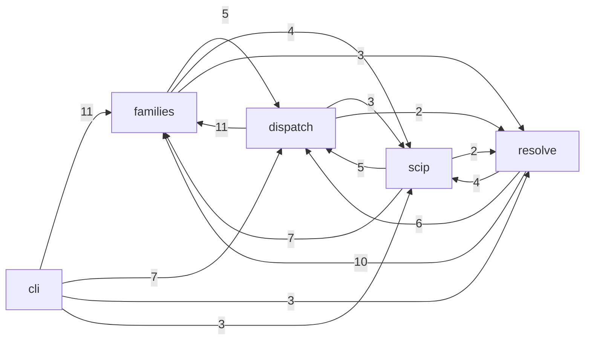
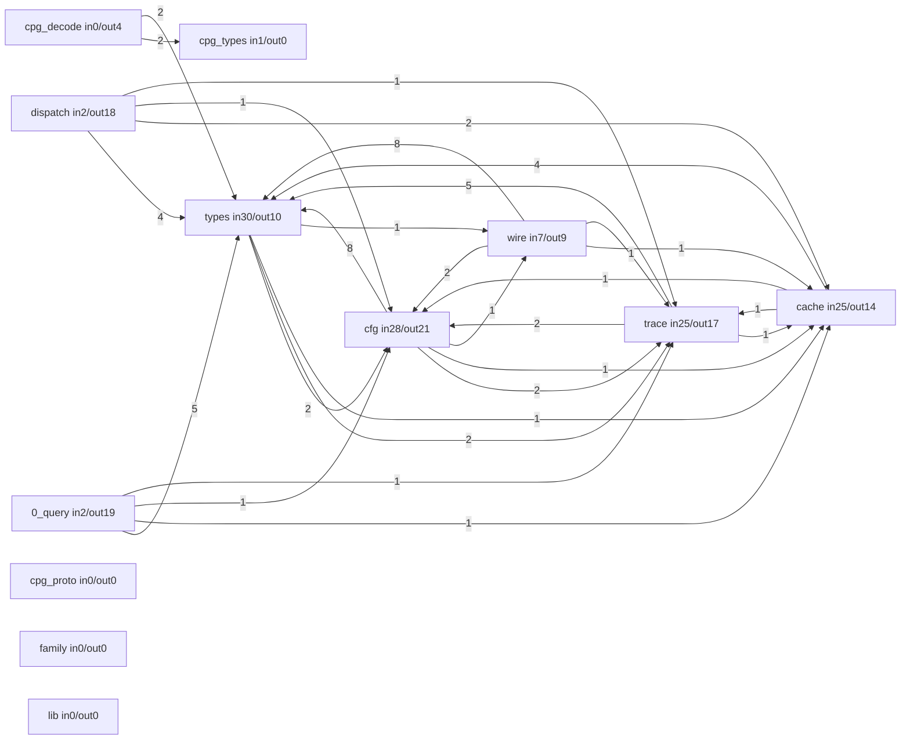
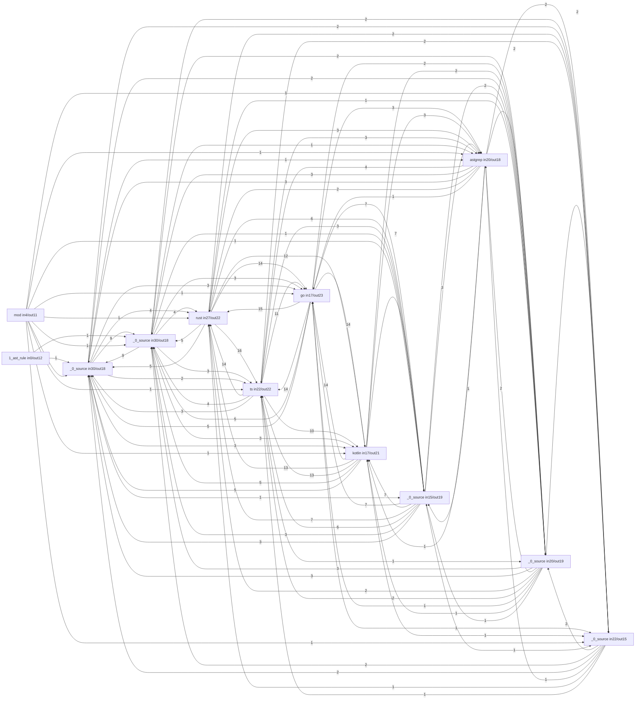
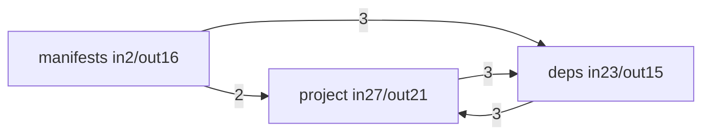
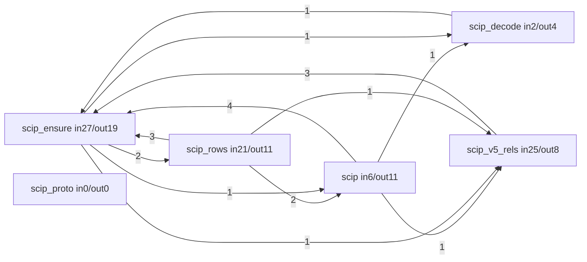

# sprefa-extract, read by itself

Generated by `just selfdoc` from `v6/dl/selfdoc/selfdoc.dl6`. Every number
is a row that program derived; edit the program, never this file.

A module edge is a CALL, resolved by NAME. A rust `mod` tree edge with no
call across it is not drawn.

- [The phase graph](#the-phase-graph)
- [cli](#cli)
- [dispatch](#dispatch)
- [families](#families)
- [resolve](#resolve)
- [scip](#scip)
- [The twenty hottest symbols](#the-twenty-hottest-symbols)

## The board rule

Every file makes one or more ranked board CLAIMS and the lowest rank wins.

| rank | claim | board |
|---:|---|---|
| 11 | under `src/bin/` | cli |
| 11 | under `src/lang/` | families |
| 12 | basename contains `scip` | scip |
| 13 | stem is `project`, `deps` or `manifests` | resolve |
| 15 | any other rust file | dispatch |

## The phase graph

An edge counts the distinct TARGET modules the source phase calls into.

## cli

Argument parsing and the one binary. Every flag lands in a FamilyMask.

| module | defs | sites | fan-in | fan-out |
|---|---:|---:|---:|---:|
| `v6/sprefa-extract/src/bin/extract.rs` | 14 | 73 | 1 | 25 |
| `v6/sprefa-extract/src/bin/extract/help.rs` | 0 | 0 | 0 | 0 |

## dispatch

One file plus a mask to a family output, then the JSONL wire.

12 of 17 modules are drawn, ranked by fan-in; every one is in the table.

| module | defs | sites | fan-in | fan-out |
|---|---:|---:|---:|---:|
| `v6/sprefa-extract/src/types.rs` | 40 | 50 | 30 | 10 |
| `v6/sprefa-extract/src/cfg.rs` | 19 | 58 | 28 | 21 |
| `v6/sprefa-extract/src/trace.rs` | 18 | 43 | 25 | 17 |
| `v6/sprefa-extract/src/cache.rs` | 7 | 28 | 25 | 14 |
| `v6/sprefa-extract/src/wire.rs` | 11 | 58 | 7 | 9 |
| `v6/sprefa-extract/src/0_query.rs` | 13 | 69 | 2 | 19 |
| `v6/sprefa-extract/src/dispatch.rs` | 1 | 8 | 2 | 18 |
| `v6/sprefa-extract/src/cpg_types.rs` | 5 | 6 | 1 | 0 |
| `v6/sprefa-extract/src/cpg_decode.rs` | 9 | 40 | 0 | 4 |
| `v6/sprefa-extract/src/cpg/cpg_proto.rs` | 0 | 0 | 0 | 0 |
| `v6/sprefa-extract/src/family.rs` | 0 | 0 | 0 | 0 |
| `v6/sprefa-extract/src/lib.rs` | 0 | 0 | 0 | 0 |
| `v6/sprefa-extract/src/rows.rs` | 0 | 0 | 0 | 0 |
| `v6/sprefa-extract/src/schema.rs` | 0 | 0 | 0 | 0 |
| `v6/sprefa-extract/src/seams.rs` | 0 | 0 | 0 | 0 |
| `v6/sprefa-extract/src/shape.rs` | 0 | 0 | 0 | 0 |
| `v6/sprefa-extract/src/source.rs` | 0 | 0 | 0 | 0 |

## families

One module per language front-end. Each projects a tree-sitter parse into the shared record shapes.

12 of 17 modules are drawn, ranked by fan-in; every one is in the table.

| module | defs | sites | fan-in | fan-out |
|---|---:|---:|---:|---:|
| `v6/sprefa-extract/src/lang/prolog/_0_source.rs` | 37 | 98 | 30 | 18 |
| `v6/sprefa-extract/src/lang/dl6/_0_source.rs` | 22 | 76 | 30 | 18 |
| `v6/sprefa-extract/src/lang/rust.rs` | 70 | 192 | 27 | 22 |
| `v6/sprefa-extract/src/lang/ts.rs` | 92 | 207 | 22 | 22 |
| `v6/sprefa-extract/src/lang/markdown/_0_source.rs` | 12 | 54 | 22 | 15 |
| `v6/sprefa-extract/src/lang/data/_0_source.rs` | 28 | 102 | 20 | 19 |
| `v6/sprefa-extract/src/lang/astgrep.rs` | 7 | 52 | 20 | 18 |
| `v6/sprefa-extract/src/lang/go.rs` | 47 | 150 | 17 | 23 |
| `v6/sprefa-extract/src/lang/kotlin.rs` | 43 | 141 | 17 | 21 |
| `v6/sprefa-extract/src/lang/python/_0_source.rs` | 23 | 65 | 15 | 19 |
| `v6/sprefa-extract/src/lang/mod.rs` | 2 | 5 | 4 | 11 |
| `v6/sprefa-extract/src/lang/1_ast_rule.rs` | 18 | 91 | 0 | 12 |
| `v6/sprefa-extract/src/lang/data/mod.rs` | 0 | 0 | 0 | 0 |
| `v6/sprefa-extract/src/lang/dl6/mod.rs` | 0 | 0 | 0 | 0 |
| `v6/sprefa-extract/src/lang/markdown/mod.rs` | 0 | 0 | 0 | 0 |
| `v6/sprefa-extract/src/lang/prolog/mod.rs` | 0 | 0 | 0 | 0 |
| `v6/sprefa-extract/src/lang/python/mod.rs` | 0 | 0 | 0 | 0 |

## resolve

Phase 2: names to files, across a supplied project.

| module | defs | sites | fan-in | fan-out |
|---|---:|---:|---:|---:|
| `v6/sprefa-extract/src/project.rs` | 50 | 156 | 27 | 21 |
| `v6/sprefa-extract/src/deps.rs` | 16 | 81 | 23 | 15 |
| `v6/sprefa-extract/src/manifests.rs` | 12 | 44 | 2 | 16 |

## scip

A SCIP index in, raw rows out. The one plane a compiler resolved.

| module | defs | sites | fan-in | fan-out |
|---|---:|---:|---:|---:|
| `v6/sprefa-extract/src/scip_ensure.rs` | 32 | 123 | 27 | 19 |
| `v6/sprefa-extract/src/scip_v5_rels.rs` | 12 | 68 | 25 | 8 |
| `v6/sprefa-extract/src/scip_rows.rs` | 10 | 56 | 21 | 11 |
| `v6/sprefa-extract/src/scip.rs` | 16 | 91 | 6 | 11 |
| `v6/sprefa-extract/src/scip_decode.rs` | 7 | 32 | 2 | 4 |
| `v6/sprefa-extract/src/scip/scip_proto.rs` | 2 | 1 | 0 | 0 |

## The twenty hottest symbols

`fan_in` counts the distinct CALLING DEFINITIONS, one per (file, name) pair
whose clauses name it. `fan_out` counts the distinct callees of its own.

| module | symbol | fan-in | fan-out |
|---|---|---:|---:|
| `v6/sprefa-extract/src/cfg.rs` | `new` | 201 | 15 |
| `v6/sprefa-extract/src/scip_ensure.rs` | `new` | 201 | 11 |
| `v6/sprefa-extract/src/scip_v5_rels.rs` | `new` | 201 | 7 |
| `v6/sprefa-extract/src/trace.rs` | `new` | 201 | 3 |
| `v6/sprefa-extract/src/project.rs` | `new` | 201 | 2 |
| `v6/sprefa-extract/src/types.rs` | `new` | 201 | 2 |
| `v6/sprefa-extract/src/cache.rs` | `new` | 201 | 1 |
| `v6/sprefa-extract/src/lang/rust.rs` | `push` | 170 | 2 |
| `v6/sprefa-extract/src/scip_ensure.rs` | `len` | 82 | 1 |
| `v6/sprefa-extract/src/types.rs` | `len` | 82 | 1 |
| `v6/sprefa-extract/src/lang/data/_0_source.rs` | `walk` | 70 | 19 |
| `v6/sprefa-extract/src/types.rs` | `intern` | 62 | 6 |
| `v6/sprefa-extract/src/lang/dl6/_0_source.rs` | `span` | 46 | 3 |
| `v6/sprefa-extract/src/lang/markdown/_0_source.rs` | `span` | 46 | 3 |
| `v6/sprefa-extract/src/lang/prolog/_0_source.rs` | `span` | 46 | 3 |
| `v6/sprefa-extract/src/cfg.rs` | `span` | 46 | 0 |
| `v6/sprefa-extract/src/scip_ensure.rs` | `is_empty` | 44 | 1 |
| `v6/sprefa-extract/src/types.rs` | `is_empty` | 44 | 1 |
| `v6/sprefa-extract/src/deps.rs` | `as_str` | 33 | 0 |
| `v6/sprefa-extract/src/types.rs` | `as_str` | 33 | 0 |

