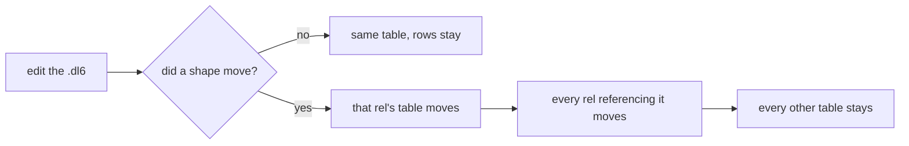

# Storage name hash

- [What a table is called](#what-a-table-is-called)
- [What goes into the digest](#what-goes-into-the-digest)
- [Worked example: person and address](#worked-example-person-and-address)
- [Derived rels and served programs](#derived-rels-and-served-programs)

## What a table is called

A stored rel lives in `<module>_<rel>_<digest>`; a derived rel lives in
`<module>_<rel>`. The module part is the declaring file's path relative to the
entry. The digest is 12 hex characters of SHA-256. Every helper object a rel
needs (`__delta_`, `__frontier_`, `__pre_`, `__ref_`, the list member table,
the indexes) is built from that same name, so they move together or not at all.

Minted at `v6/prolog/compile.pl` `relation_storage_candidate/6`; read at
`v6/prolog/lower.pl` `table_name/2` and nowhere else.

## What goes into the digest

The rel's own storage shape plus the storage shape of every rel its columns
point at, transitively: column names in position order, column types after
wrapper/option/list expansion, `key(...)` positions, and `log` versus `set`. A
referenced rel enters keyed by its name, so renaming one moves its referrers.

Out: rules, comments, whitespace, the source filename, the module prefix, and
the rel's own name. The prefix stays outside the digest as plain text, so two
modules holding an identically shaped rel still get two tables.

## Worked example: person and address

```
rel address(city: text).
rel person(name: text, home: address).
rel note(body: text).
```

Add a comment and a blank line: nothing moves. Add a column to `address`:

| rel | before | after |
|---|---|---|
| `address` | `main_address_8d3c44e060f1` | `main_address_13e5dea3d1ef` |
| `person` | `main_person_5adfae796cd4` | `main_person_3948be3b4e83` |
| `note` | `main_note_36bfb9fa46f1` | `main_note_36bfb9fa46f1` |



## Derived rels and served programs

A derived rel's rows are re-derived on load, never carried, so it takes no
digest today. `compile.pl` `storage_shape_suffix/5`'s first clause is the seam
where one would be added.

`serve/0_compile.ts` writes the posted source to `gen_served/<sha>/main.dl6`.
The sha still names the file on disk; the compiler reads the entry module name
off the file stem, so every served program compiles under `main` and an edit
keeps its prefix. Before that the entry file itself was digest-named, so every
table renamed on every edit and the reload plan matched nothing.
