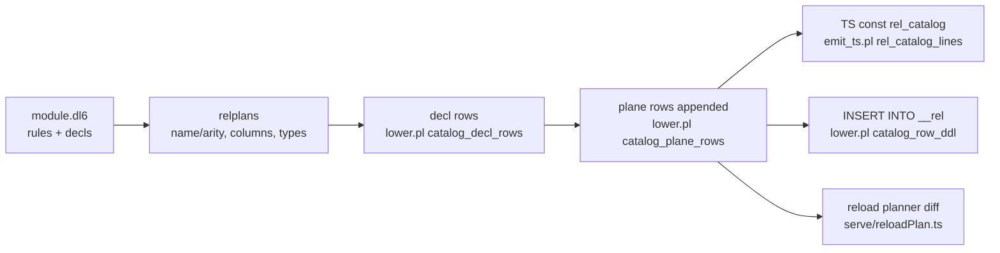

# v6 rel catalog emitters

How a compiled module's schema becomes the `__rel` row list, and where that
list is rendered. Every output below is a real run or a real emitted file,
captured 2026-08-09 at main `d88d2ced`.

- [The row shape](#the-row-shape)
- [The emitter, run live](#the-emitter-run-live)
- [Before/after: ids shift, hashes hold](#beforeafter-ids-shift-hashes-hold)
- [Which edit moves which hash](#which-edit-moves-which-hash)
- [Known hole: h_rule is blind to head wiring](#known-hole-h_rule-is-blind-to-head-wiring)
- [Step 8: the emitted const widened to the plane block](#step-8-the-emitted-const-widened-to-the-plane-block)
- [The SQL door is opt-in](#the-sql-door-is-opt-in)
- [The three renderings](#the-three-renderings)



## The row shape

One shape for every node kind (`IRelCatalogRow`, tsv2/runtime/types.ts:379):

```prolog
row(RelId, ParentId, Ordinal, LocalName, Kind, TypeId, Arity,
    ModuleId, HId, HSchema, HRule)
```

- `RelId`: positional id, assigned by counting, dense per module.
- `ParentId`: tree edge. Column -> its rel, rel -> module, delta view -> the
  delta row, storage row -> the column row.
- `Ordinal`: column position, 1-based; 0 for non-columns.
- `Kind`: primitive, list, module, rel, column, delta, frontier,
  next_frontier, departure, pre, view, dictionary, scope, storage, ...
  (full union in types.ts:384).
- `TypeId`: for a column, the rel_id of its type's row.
- `HId` / `HSchema` / `HRule`: identity hashes, next sections.

## The emitter, run live

Driver:

```prolog
:- use_module('/Users/chrishafley/projects/sprefa/v6/prolog/lower').
:- op(1200, xfx, <-).

go :-
    Rule = (reach(A, B) <- edge(A, B)),
    Plans = [ relplan(edge/2,  set, [src_node, dst_node], none, [text, text]),
              relplan(reach/2, set, [src_node, dst_node], none, [text, text]) ],
    lower:catalog_rows(demo, [Rule], Plans, Rows),
    forall(member(R, Rows), (print(R), nl)).
```

```
$ swipl -g go -t halt catalog_demo.pl
row(1,0,0,text,primitive,0,0,0,'','','')
row(2,0,0,int,primitive,0,0,0,'','','')          %  ids 1-5: constant prefix
row(3,0,0,float,primitive,0,0,0,'','','')
row(4,0,0,bool,primitive,0,0,0,'','','')
row(5,0,0,json,primitive,0,0,0,'','','')
row(6,0,0,demo,module,0,0,6,'2a97516c354b6884','','')
row(7,6,0,edge,rel,0,2,6,'365ee55fa724c949','07bee66ea86c7ed5','')
row(8,7,1,src_node,column,1,0,6,'41ac3ea3a365428f','','')   % type_id 1 = text
row(9,7,2,dst_node,column,1,0,6,'91172b1f1bbff8e0','','')
row(10,6,0,reach,rel,0,2,6,'0c3714bc49d0dff2','07bee66ea86c7ed5','0761955a07506428')
row(11,10,1,src_node,column,1,0,6,'0d49709886053281','','')
row(12,10,2,dst_node,column,1,0,6,'9cd31012db8819ef','','')
```

`reach` carries an `h_rule` because a rule derives it; `edge` is a source rel,
so `''`. List-typed columns get extra rows between the primitives and the
module row, inner list before outer, so a nested `list(list(text))` chains
through `type_id`.

Id assignment trace (pure counting, no lookups):

```
step 0  id=1..5    primitives                     constant, every module
step 1  id=6       module row                     5 + list-row count + 1
step 2  id=7       rel edge/2                     module id + 1
step 3  id=8,9     its columns                    parent=7, ordinal 1..2
step 4  id=10      rel reach/2                    7 + 1 + 2: edge consumed 1+arity
step 5  id=11,12   its columns                    parent=10
        base case: plan list empty, FinalId=13 handed to the plane half
```

Two passes over the rels (lower.pl:1300): pass A only computes each rel's
future id (`Id + 1 + Arity` per rel), pass B builds rows. That order lets a
`ref(other_rel)` column point at a rel declared later in the file.

## Before/after: ids shift, hashes hold

Insert `alpha/1` before `edge`, change nothing else:

```
before:  row(7,6,0,edge,rel,0,2,6,'365ee55fa724c949','07bee66ea86c7ed5','')
after:   row(7,6,0,alpha,rel,0,1,6,'74d930e8ef8a9c81','91f9eacf3a969ff6','')
         row(9,6,0,edge,rel,0,2,6,'365ee55fa724c949','07bee66ea86c7ed5','')
                ^^ rel_id 7 -> 9                ^^ h_id byte-identical
```

`h_id = sha256(ParentHash/Name/Arity)` truncated to 16 hex (lower.pl:739),
keyed under the PARENT's hash so two rels can share a column name. Positional
ids renumber freely; identity rides the hash chain.

## Which edit moves which hash

```
edit                                  h_id      h_schema   h_rule
rename column dst_node -> target      changes   changes    -
change a column type int -> float     -         changes    -
add/remove/reorder a rule body        -         -          changes
add a rel elsewhere in the module     -         -          -
```

The reload planner branches on exactly these (serve/reloadPlan.ts:33):

```ts
} else if (prev_row.h_schema !== next_row.h_schema) {
  verdicts.set(key, "recreate");   // DROP TABLE + CREATE
} else if (prev_row.h_rule !== next_row.h_rule) {
  verdicts.set(key, "refill");     // DELETE FROM, re-derive
} else {
  verdicts.set(key, "keep");       // rows survive the swap
```

## Known hole: h_rule is blind to head wiring

Measured 2026-08-09, demo above rerun with only the join direction swapped:

```prolog
% before                             % after
reach(A, B) <- edge(A, B).           reach(A, B) <- edge(B, A).
```

```
before:  row(10,6,0,reach,rel,...,'0761955a07506428')
after:   row(10,6,0,reach,rel,...,'0761955a07506428')    % h_rule IDENTICAL
```

Different programs, same `h_rule`, so the planner verdicts `keep` and the old
derivation's rows survive a live swap. Cause: `rule_bodies_map` (lower.pl:750)
collects `Ref-Body` pairs via `findall`, which severs head-body variable
sharing; `numbervars` then renames by first appearance inside the body alone,
so `edge(A,B)` and `edge(B,A)` both canonicalize to
`edge('$VAR'(0),'$VAR'(1))`. Any edit that only permutes head-to-body
variable wiring is invisible. Candidate fix: hash `Head-Body` pairs instead of
bare bodies, plus a fail-first test on the swapped-join case. UNFIXED as of
this writing.

## Step 8: the emitted const widened to the plane block

Fixture `compile/dl_view/aggregate_count_min_max_track_arrivals_and_retraction.dl6`,
one rule:

```
stat(Repo, count(Stars), min(Stars), max(Stars)) <- star_row(Repo, Stars).
```

Before step 8 the emitted const stopped at the decl block (still visible in
the stale `tsv2/gen_emitted/` copy):

```ts
  { rel_id: 14, parent_id: 10, ordinal: 4, local_name: "col4", kind: "column", ... },
];
```

After (compile/out/, the 231-module regen `5b0a4876`), the plane rows follow;
ids append so 1-14 never moved:

```ts
  { rel_id: 15, parent_id: 7,  local_name: "__delta_star_row",    kind: "delta",  arity: 4, ... },
  { rel_id: 16, parent_id: 7,  local_name: "__frontier_star_row", kind: "frontier", ... },
  { rel_id: 19, parent_id: 15, local_name: "__txt___delta_star_row", kind: "view", ... },  // parent = the DELTA row
  { rel_id: 25, parent_id: 6,  local_name: "__str",               kind: "dictionary", ... },
  { rel_id: 27, parent_id: 8,  local_name: "interned_id",         kind: "storage", ... },  // parent = the COLUMN row
];
```

Each plane family is emitted under the SAME condition its `CREATE TABLE` mint
site uses (lower.pl:833-957):

- delta / frontier / next_frontier: unconditional, per rel.
- departure frontier: the rel is in DepartureRefs, mirror of `delta_ddl/3`.
- pre: the rel is in PreRefs, mirror of `pre_ddl/3`.
- `__txt_*` views: `any_interned_column`, the same predicate `text_view_ddls/6`
  gates on; the delta view parents on the delta ROW, giving the two-level tree.
- `__str` / `__ref_*` dictionaries: mirror of the dict DDL arms.

So a plane row cannot describe a table the lowering did not create. The rail:
corpus-wide DDL-vs-plane set-equality plunit test plus `just catalog-audit`
inside `just green-all`.

## The SQL door is opt-in

A program gets the `__rel` table only if a rule literally names `__rel` at
the contract arity (analyze.pl:199). Then the lowering appends three
statements (lower.pl:5427):

```sql
CREATE TABLE ... "__rel" ("rel_id" INTEGER PRIMARY KEY, "parent_id", "ordinal",
                          "local_name", "kind", "type_id", "arity",
                          "module_id", "h_id", "h_schema", "h_rule")
CREATE INDEX IF NOT EXISTS "__rel_parent" ON "__rel" ("parent_id", "local_name")
INSERT OR IGNORE INTO "__rel" (...) VALUES (1,0,0,'text','primitive',...), ...
```

A legal .dl6 program querying its own schema:

```
wide_rel(RelName, Arity) <- __rel(_, _, _, RelName, "rel", _, Arity, _, _, _, _), Arity > 3.
```

## The three renderings

Same row list, three targets:

1. Emitted TS module: `const rel_catalog: readonly IRelCatalogRow[]`
   (emit_ts.pl:771), emitted for EVERY module so a reload can compare.
2. DDL: one `INSERT OR IGNORE INTO "__rel"` (lower.pl:789), only for
   catalog-using programs, so live SQLite answers schema queries as a rel.
3. Reload plan: prev-vs-next row diff (`IReloadPlanner`,
   runtime/types.ts:426) driving keep/refill/recreate/drop per table.
