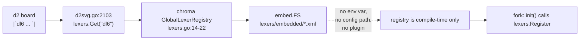

# d2 renders `dl6` code blocks highlighted

`d2` paints a `|`lang ... `|` block by handing the language name to chroma. Stock
`d2` has no `dl6` lexer, so every dl6 block on a board renders as flat black
text. This directory carries the chroma lexer, and `~/projects/d2-dl6` is the
patched `d2` that registers it.

## Contents

| section | what it answers |
|---|---|
| [Why a fork](#why-a-fork) | the file:line that rules out a runtime hook |
| [Files](#files) | what lives where |
| [Rebuild](#rebuild) | clone, patch, build |
| [Point `d2` at the fork](#point-d2-at-the-fork) | PATH, alias, or absolute path |
| [Test the lexer](#test-the-lexer) | the tokenise gate |
| [Token classes](#token-classes) | dl6 surface to chroma token to github colour |
| [Theme note](#theme-note) | theme-id 0 vs 300 on code-heavy boards |

## Why a fork



`chroma/v2@v2.14.0` builds `GlobalLexerRegistry` from a package-private
`//go:embed embedded` FS and nothing else (`lexers/lexers.go:10-22`). There is no
env var, no directory scan, no plugin seam. `d2` reads that registry directly at
`d2renderers/d2svg/d2svg.go:2103` for shapes and `:1208` for connections, and
falls back to `lexers.Fallback` when `Get` returns nil. `d2`'s own plugin system
(`d2plugin`) covers layout engines only. So a new language reaches a d2 render
only through a `lexers.Register` call compiled into the binary.

## Files

| path | role |
|---|---|
| `editors/dl6.chroma.xml` | the lexer. Source of truth. |
| `editors/dl6.fixture.dl6` | fixture exercising every rule |
| `editors/dl6-chroma-check/main.go` | tokenises the fixture, fails on a dead token class or any `Error` token |
| `~/projects/d2-dl6/d2renderers/d2svg/dl6_lexer.go` | the fork's `init()` registration |
| `~/projects/d2-dl6/d2renderers/d2svg/dl6.chroma.xml` | a copy of the lexer, embedded into the binary |

The keyword lists come from `editors/vscode-dl/syntaxes/dl6.tmLanguage.json`,
which `v6/prolog/compile/1_emit_registry_docs.pl` generates from `registry.pl`.
Re-run that emitter and the two lists can drift; re-copy them by hand.

## Rebuild

```bash
git clone --depth 50 https://github.com/terrastruct/d2.git ~/projects/d2-dl6
cd ~/projects/d2-dl6
git fetch --depth 1 origin tag v0.7.1 && git checkout v0.7.1

cp ~/projects/sprefa/editors/dl6.chroma.xml d2renderers/d2svg/dl6.chroma.xml
# write d2renderers/d2svg/dl6_lexer.go (embed.FS + lexers.Register in init)

go build -o bin/d2 .
./bin/d2 --version    # v0.7.1-HEAD
```

After editing `editors/dl6.chroma.xml`, one command re-syncs and rebuilds:

```bash
cp ~/projects/sprefa/editors/dl6.chroma.xml ~/projects/d2-dl6/d2renderers/d2svg/dl6.chroma.xml \
  && (cd ~/projects/d2-dl6 && go build -o bin/d2 .)
```

`v0.7.1` matches the Homebrew `d2` on this machine. The Homebrew binary at
`/opt/homebrew/bin/d2` is untouched.

## Point `d2` at the fork

Three ways, least invasive first.

| way | command | scope |
|---|---|---|
| absolute path | `~/projects/d2-dl6/bin/d2 board.d2 board.svg` | one render |
| alias | `alias d2=~/projects/d2-dl6/bin/d2` in `~/.zshrc` | interactive shells |
| PATH | `export PATH=~/projects/d2-dl6/bin:$PATH` | shell and its children, shadows Homebrew |

Do not `brew link --overwrite` or copy over `/opt/homebrew/bin/d2`; a `brew
upgrade` would silently restore the stock binary and dl6 blocks would go flat
again with no error.

## Test the lexer

```bash
cd ~/projects/sprefa/editors/dl6-chroma-check && go run . ..
```

Prints a count per token class and exits non-zero when a class never fires or
when chroma emits an `Error` token. The lexer ends with a catch-all `.` rule, so
an `Error` token means the state machine broke, not that a character was unknown.

## Token classes

chroma's `github` style is hardcoded for the light render at
`d2svg.go:2108-2112`, so the colour column is fixed by that style, not chosen.

| dl6 surface | chroma token | github colour |
|---|---|---|
| `# comment` | `CommentSingle` | italic `#999988` |
| `rel sh bind interface import log keep key salt` | `KeywordDeclaration` | bold `#000000` |
| `int text json bool float bytes option list json_list list_*` | `KeywordType` | bold `#445588` |
| registry live words (`count sum avg min max not is match now next pre probe query regexp seq latest coalesce combine decode finalize group_concat json_group_array json_object ts_query true false all`) | `NameBuiltin` | `#0086b3` |
| registry non-live words (`complete error json_array json_each scan set sg_pattern subscribe unsubscribe zip`) | `KeywordReserved` | bold `#000000` |
| `/soopy/files`, `/clock/tick` | `NameNamespace` | `#555555` |
| relation name before `(` | `NameFunction` | bold `#990000` |
| column name before `:` | `NameAttribute` | `#008080` |
| `Capitalized` and `_` variables | `NameVariable` | `#008080` |
| `?` query marker | `NameDecorator` | bold `#3c5d5d` |
| `<- <+ -> := <= >= != == =< < > = + - * / %` | `Operator` | bold `#000000` |
| `'atom'` | `LiteralStringSymbol` | `#990073` |
| `"text"` | `LiteralStringDouble` | `#dd1144` |
| `` `template` `` | `LiteralStringBacktick` | `#dd1144` |
| `$VAR` inside a string or template | `LiteralStringInterpol` | `#dd1144` |
| `42` / `3.14` | `LiteralNumberInteger` / `LiteralNumberFloat` | `#009999` |
| `( ) [ ] { } , ; . : |` | `Punctuation` | inherits |

Two deliberate departures from `editors/vscode-dl/syntaxes/dl6.tmLanguage.json`:

- the tmLanguage paints registry non-live words `invalid.illegal`; the chroma
  lexer uses `KeywordReserved`, which falls back to plain bold. `Error` in the
  `github` style is `#a61717` on an `#e3d2d2` background, and a diagram is the
  wrong place for a red-backed word.
- the tmLanguage paints every lowercase identifier `variable.other.readwrite`;
  the chroma lexer leaves a bare lowercase identifier as `Name`, so only the
  positions that carry meaning (relation call, column label) take colour.

## Theme note

`d2` picks the code-block palette independently of the board theme: `github` for
the light render, `catppuccin-mocha` for the dark one, both hardcoded at
`d2renderers/d2svg/d2svg.go:2108-2112`. `theme-id` moves shape fills, strokes and
labels; it never moves the token colours.

| theme-id | name | code-heavy board |
|---|---|---|
| `0` | Neutral default | use this. Light shape fills sit under the `github` palette without fighting it, which is what `2026-08-21-prs.d2` does with its `classes.code` fill `#f6f8fa`. |
| `300` | Terminal | dark shape fills, but the light render still paints tokens from `github` (dark `#000000` keywords on a dark fill). Set `dark-theme-id: 200` alongside it so a dark viewer gets the `catppuccin-mocha` group, and expect the light export to stay unreadable. |

Rule of thumb: a board whose shapes are mostly code keeps `theme-id: 0` and
carries its own pale `classes.code` fill. Reach for `300` on boards where code is
an accent, and check the light export before shipping it.
