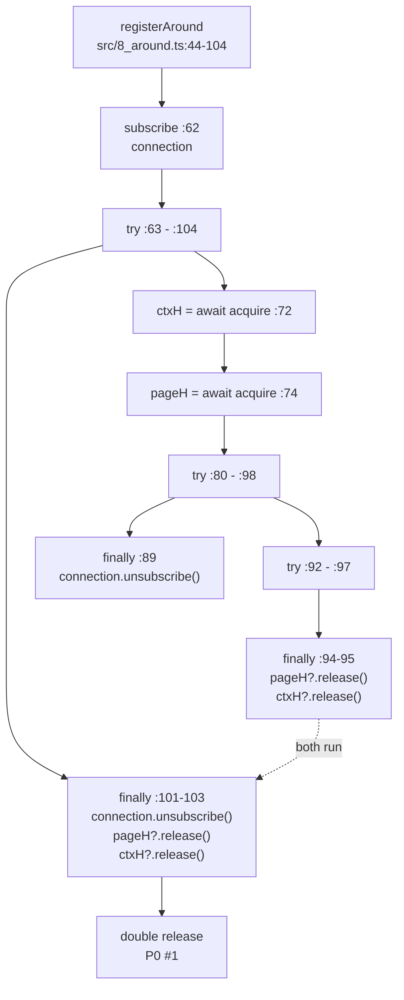

# REVIEW: `@hafley66/vitest-playwright` via `extract` only

Fact source: `~/.cargo/bin/extract` (build `5fa36e78046e`). No file was opened, catted, or read by eye.
Byte offsets come from extract records; line numbers come from `head -c N | wc -l` on a frozen copy, used
only as offset arithmetic.

The working tree was being edited during the review (7 of 17 files changed digest mid-run, and 2 new test
files appeared). Everything below is pinned to a snapshot taken at 13:09, digests recorded by
`extract --file-fact`:

| file | digest (blake3, 12) | bytes | lines |
|---|---|---|---|
| src/0_options.ts | 9305685662f2 | 4158 | 84 |
| src/1_plugin.ts | 47cb54a0f822 | 1194 | 30 |
| src/2_global-setup.ts | 355df4a0f2c8 | 3700 | 70 |
| src/3_matchers.ts | ee4397adfd49 | 16695 | 250 |
| src/4_test.ts | 9d7a3b729830 | 3886 | 72 |
| src/5_streams.ts | 6ba12ac246ec | 9812 | 177 |
| src/6_roots.ts | c2161d1f4591 | 4195 | 72 |
| src/7_page-global.ts | 548ef3f69431 | 2053 | 44 |
| src/8_around.ts | fc255d416e2d | 7064 | 140 |
| src/9_runner.ts | c89e92b22392 | 993 | 19 |
| src/10_telemetry.ts | 373251e3c8f9 | 2501 | 37 |
| src/index.ts | 505423d14181 | 613 | 9 |
| src/setup.ts | bd4e05104949 | 363 | 9 |
| tests/0_bootstrap.ts | 2f1c6e1718dd | 1850 | 30 |
| tests/1_matchers.test.ts | b0a59f23f247 | 8628 | 171 |
| tests/2_fixtures.test.ts | 1d1339bc38c7 | 2886 | 77 |
| tests/3_route_clock.test.ts | 9eb06221b351 | 1300 | 34 |

---

## 1. Findings

| # | sev | file:line | defect | extract command + filter |
|---|---|---|---|---|
| 1 | P0 | src/8_around.ts:94,95,102,103 | `pageH?.release()` and `ctxH?.release()` each appear twice, once in the inner `finally` (81-98) and once in the outer `finally` (99-104). The two `try` statements nest (3296-5014 contains 4086-4797), so both finallys run on the normal path. Neither handle is reset, so `?.` does not short-circuit the second call: every test double-releases its page and context handle. | `extract --ast-pattern a='$H?.release()' --ast-capture a=H src/8_around.ts` → 4 rows, receivers `pageH,ctxH,pageH,ctxH`; nesting from `extract --family cst src/8_around.ts \| jq -r 'select(.kind=="try_statement" or .kind=="finally_clause")'`; non-reset from `extract --ast-pattern d='$N = undefined' --ast-capture d=N src/8_around.ts` → only `lazyBrowser` |
| 2 | P0 | src/2_global-setup.ts:26 | `require("node:fs")` inside `newest()` in a `"type": "module"` package whose 12 other bindings arrive by `import`. `newest()` is called twice at line 54. `require` is not defined in a node ESM scope. | `extract --family call src/2_global-setup.ts \| jq -c 'select(.record=="specifier" and .kind=="require")'` → 1 row; text via `extract --ast-pattern p='require($A)' --ast-capture p=A src/2_global-setup.ts` |
| 3 | P0 | src/8_around.ts:89,101 | `connection.unsubscribe()` in both finally blocks of the same nest, same receiver. Idempotent on an rxjs `Subscription`, but it is the same duplicated-cleanup block as #1 and confirms the block was pasted rather than moved. | `extract --ast-pattern u='$H.unsubscribe()' --ast-capture u=H src/8_around.ts` → 2 rows at 4459 and 4853, both `connection` |
| 4 | P1 | src/4_test.ts:49,50 vs try at :51 | `ctxH = await acquire(context$(...))` (49) then `pageH = await acquire(page$(...))` (50) both sit outside the `try` (2714-2816) whose `finally` (2768-2816) holds the two `release()` calls (52). If the page acquire rejects, the context handle leaks a live `BrowserContext`. | `extract --family call,cst src/4_test.ts` joined: `sites.tsv` rows `acquire@2561, acquire@2686, release@2784, release@2803` against `try_statement 2714 2816 / finally_clause 2768 2816` |
| 5 | P1 | src/4_test.ts:36,40 vs try at :44 | Same shape one fixture up: `acquire@1875` and `apiCall$(...).subscribe()@2126` both precede `try` 2275-2383 whose `finally` 2306-2383 does `unsubscribe@2316` and `release@2342`. Anything thrown between line 36 and line 44 leaks the browser handle and the subscription. | as #4, span containment over `site` + `cst` records |
| 6 | P1 | src/2_global-setup.ts:67,69 | `globalSetup` (64-70) does `await acquire(serve$(s) as any)` at 67, `ctx.provide(...)` at 68, then returns `() => h.release()` at 69. No `try`/`finally` anywhere in the function (the file's 3 try statements are at 827, 2198, 2392). A throw from `provide` leaks the dev/preview server. | `extract --family cst src/2_global-setup.ts \| jq -r 'select(.kind=="try_statement")'` → 3 spans, none containing 3601..3686 |
| 7 | P1 | src/8_around.ts:113 | `budget.addEventListener("abort", ...)` inside the `bounded` helper. `bounded` is invoked twice per `capture()` and no `removeEventListener` exists in any of the 17 files, so each capture leaves listeners on the `AbortSignal`. The `AbortSignal.timeout(budgetMs)` is created once per capture and shared by both bounded calls, so the second call gets an already-partly-spent budget. | `for f in $(cat files.txt); do extract --ast-pattern a='$T.addEventListener($$$B)' --ast-capture a=T "$f"; extract --ast-pattern r='$T.removeEventListener($$$B)' --ast-capture r=T "$f"; done` → 1 add, 0 remove |
| 8 | P1 | src/5_streams.ts:171,175 | `moveArtifact()` and `dropArtifact()` are defined, have zero references in the whole 17-file corpus, and are not in the `src/index.ts` barrel (which re-exports 11 names from 5_streams). Dead code holding the only uses of `renameSync` and `rmSync`. | `extract --family scip .` then `awk 'NR==FNR{r[$1];next} !($1 in r)' <(cut -f1 refs) defs` filtered to top-level symbols → 4 zero-ref decls, 2 of them these |
| 9 | P2 | src/2_global-setup.ts:18,46 · src/8_around.ts:122,125 | Four empty `catch { }` blocks: 8 bytes each, zero `expression_statement`, zero `throw_statement`, zero call sites inside. The two in 8_around wrap `context.tracing.stop(...)`, so a failed trace write is silent. | `extract --family cst,call FILE` joined by span containment: catch_clause spans vs throw_statement / expression_statement / site counts |
| 10 | P2 | src/7_page-global.ts:19,32,34 | `function proxy<K extends "page" \| "context">(key: K): any`. The package's headline `$page` / `$context` globals are typed `any` at their only definition site, plus `{} as any` (32) as the Proxy target and `current(key) as any` (34). Nothing downstream of `$page` type-checks. | `extract --scip-facts --project-root . --scip-index index.scip src/*.ts \| jq -r 'select(.record=="scip_documentation")' \| grep -E '\bany\b'` |
| 11 | P2 | src/9_runner.ts:6,8,12,16 | `PwRunner` has zero references in the corpus and is reached only through the string `siblingPath("9_runner")` in the plugin. Its 19 lines carry 6 `as any` casts including `VitestTestRunner.prototype as any` (16), `globalThis as any` (8), `this as any` (8), `(t as any).tasks ?? []` (12). Every vitest-runner integration point is uncheckable. | zero-ref join as #8; casts via `extract --ast-pattern a='$X as any' --ast-capture a=X src/9_runner.ts` |
| 12 | P2 | src/1_plugin.ts:18 | The entire returned vite config object is one `as any` cast, so `setupFiles`, `globalSetup`, `provide`, `isolate`, `runner` are all unvalidated. The three sibling module paths inside it are plain string literals `"setup"`, `"2_global-setup"`, `"9_runner"`, unresolvable by any checker. | `extract --ast-pattern a='$X as any' --ast-capture a=X src/1_plugin.ts` (1 row, 255-byte capture); literals via `extract --family df src/1_plugin.ts \| jq -c 'select(.record=="df_lit")'` |
| 13 | P2 | src/4_test.ts:67 · src/2_global-setup.ts:64 | `function rootOf(task: any): AttemptStore` and `globalSetup(ctx: { provide: (k: any, v: any) => void })`. Both are the boundary between vitest's task/context objects and this package's own state; both give up typing there. | scip_documentation `any` scan as #10 |
| 14 | P2 | 11 of 17 files | 54 `as any` casts: 3_matchers 25, 1_matchers.test 7, 9_runner 6, 2_fixtures.test 4, 10_telemetry 4, 7_page-global 3, and 1 each in 8_around, 5_streams, 4_test, 2_global-setup, 1_plugin. | `for f in $(cat files.txt); do echo "$(extract --ast-pattern a='$X as any' --ast-capture a=X $f \| wc -l) $f"; done` |
| 15 | P2 | src/5_streams.ts (29) · src/4_test.ts (6) · src/8_around.ts (3) · src/2_global-setup.ts (3) | 41 compiler `DEPRECATED` diagnostics, all rxjs v8 removals: `scheduler` argument, `resultSelector`, `thisArg`, explicit type parameters, separate-callback `subscribe(...)`, `throwError(value)`, `timer(x, undefined)`. | `extract --scip-facts --project-root . --scip-index index.scip src/*.ts tests/*.ts \| jq -r 'select(.record=="scip_diagnostic")\|[.path,.code]\|@tsv' \| sort \| uniq -c` |
| 16 | P2 | src/index.ts:1 and 8 others | 9 of the 13 src files are referenced by no test: 1_plugin, 2_global-setup, 5_streams, 6_roots, 8_around, 9_runner, 10_telemetry, index, setup. The published barrel `src/index.ts` and the `exports` map it backs are never exercised; the 3 test files import `src/4_test.js` directly. | `extract --scip-deps --project-root . --scip-index index.scip <files> \| jq -r 'select(.record=="file_edge" and (.src_path\|startswith("tests/")))\|.dst_path' \| sort -u`, then set-subtract from the src list |
| 17 | P2 | src/3_matchers.ts:28 | `flag()` wraps a computed member read (`subscript_expression` 1903-1937) in `try { } catch { return undefined }`: 26-byte catch, 0 statements, 0 throws, one `return undefined`. A renamed playwright internal degrades silently to "flag absent" instead of failing. | catch-body join as #9, plus `extract --family cst src/3_matchers.ts \| jq -c 'select(.span.start>=1940 and .span.end<=1966)'` |
| 18 | P2 | src/2_global-setup.ts:27 | `newest()` runs `statSync` per entry inside the `readdirSync(d, {withFileTypes:true})` loop and recurses through `walk`, over a tree that includes `node_modules` and `dist` by literal name. | `extract --family df src/2_global-setup.ts \| jq -c 'select(.record=="df_loop" or .record=="df_nest")'` → loop at 1181, nested calls at 1197/1212/1250/1274/1345/1364/1376 |

### Checked and clean

| check | verdict | how |
|---|---|---|
| import cycles | none | `extract --deps --project-root .` → 35 `file_edge` rows, `tsort` accepts |
| duplicate top-level names across files | none | scip_def top-level symbols grouped by bare name, no name in 2 files |
| calls resolving nowhere | none real | 1 `unresolved` row in phase 1; under `--resolve` all 50-odd rows are `reason=inferred` on host-type methods (`push`, `map`, `close`), which is resolver reach, not a typo |
| dynamic imports without rejection handlers | clean | both `.then` sites in 10_telemetry (`@logtape/logtape`, `@opentelemetry/api`, both optional peers) pass 2 args; `arg` records show `pos 0` and `pos 1` |
| diagnostics-channel subscribe/unsubscribe | paired | `dcSubscribe` at 5_streams:132 and `dcUnsubscribe` at :133, both inside `df_loop` over `Object.entries(handlers)` |
| declared types unused | none | all 40 local interface/alias/class decls have >=1 scip_ref except the two `declare module` augmentations (`ProvidedContext`, `Assertion`) and `PwRunner` (#11) |
| rxjs `acquire()` observer arity | complete | `df_field` on the observer literal shows `next`, `error`, `complete`; the promise cannot hang on source error |

---

## 2. Command scorecard

| command | rows | useful | why |
|---|---|---|---|
| `extract --help` / `--schema` | 0 (docs) | yes | required to know that `specifier.kind` distinguishes `require` from `dynamic_import`, and that `scip_documentation` carries hover signatures |
| `extract --file-fact FILE` x17 | 40,645 | yes | the workhorse: `site`, `node:call`, `node:cst`, `node:df`, `df_field`, `df_lit`, `df_loop`, `specifier`, `sig`. Findings 1-9, 12, 17, 18 all come from span joins over this. `file` rows also caught the mid-review edits |
| `extract --family scip .` | 2,761 | yes | `scip_def` + `scip_ref` + `scip_name` gave the exact zero-reference set (finding 8, 11). 17 documents, 1.2 s, no install |
| `extract --scip-facts --project-root . --scip-index ...` | 7,885 | yes | `scip_documentation` (1,215 rows) is the type oracle: every `any` in findings 10, 13 came from inferred hover text, none of it written in the source. `scip_diagnostic` (41 rows) is finding 15 for free |
| `extract --ast-pattern ID=P --ast-capture ID=N` | 4-54 per query | yes | the highest signal per row. Confirmed the duplicated `pageH?.release()` receivers, the `require("node:fs")` argument, the `as any` census, and the missing `removeEventListener`. Only mode that returns source text |
| `extract --deps --project-root .` | 84 | yes | 35 `file_edge` + 43 `file_unresolved`. Cycle check and the "index.ts re-exports what" map |
| `extract --scip-deps --project-root . --scip-index ...` | 48 | yes | includes 4 type-only edges `--deps` cannot see; gave the tests-to-src coverage set (finding 16) |
| `extract --resolve --family call,type,flow` | 1,450 | partial | 920 `flow_edge` were unused. The 55 `resolved_import` rows confirmed the barrel. The `unresolved` rows are dominated by `reason=inferred` on host library methods, which is noise for defect hunting |
| `extract --family diet_scip` | 694 | no | superseded entirely by real scip on a package this small; nothing it said was not already in `--family scip` |
| `extract --family cfg src/8_around.ts` | 3,423 | no | entry/exit/branch nodes per callable, no post-dominance and no exception edges, so it cannot answer "does this finally run twice". Span containment over `cst` did |
| `extract --package-deps package.json` | 6 | no | one manifest is not a corpus; no in-corpus dependency pairs exist |
| `extract --witness --family type src/9_runner.ts` | 57 | no | protocol/run/fact/witness/coverage envelope, provenance metadata rather than defect facts |
| `extract --bench src/8_around.ts` | 2 (stderr) | no | timing only |

Gotchas worth recording: `--scip-facts` refuses to run outside a git worktree (`". is not inside a Git worktree"`), so a scratch snapshot needs `git init` before it will stream. `--deps` and `--scip-deps` both require `--project-root` even when given explicit file paths. `--scip-facts` requires `PATH...` in addition to `--project-root`. Under `--resolve` the phase-1 records disappear, so per-file `site`/`specifier` facts must be collected file by file.

---

## 3. Five lines

1. What extract saw that eyes would miss: that the same three cleanup statements exist at two byte ranges inside nested `finally` clauses 300 bytes apart (finding 1), and that `require` is one `specifier.kind` among 12 `import` specifiers in the same ESM file (finding 2). Both read as ordinary code locally and only become defects when the containment relation is computed.
2. Second thing eyes would miss: the compiler's inferred `any` (findings 10, 13) is invisible in the source, since nobody wrote `any` at `proxy(): any` or `rootOf(task: any)`; only `scip_documentation` shows it.
3. What it cannot see: whether double-releasing a playwright `BrowserContext` throws or is a no-op, whether `AbortSignal.timeout` listeners matter at this volume, whether `moveArtifact` is dead on purpose pending a caller, and whether the `newest()` walk is hot. No fact family carries runtime semantics, library contracts, or intent.
4. Also invisible to it: `--family cfg` has no exception edges and no post-dominance, so "will this finally run twice" had to be reconstructed by hand from `try_statement`/`finally_clause` span containment rather than read off a graph.
5. Totals: 18 findings, P0=3, P1=5, P2=10, over 40,645 phase-1 rows, 2,761 scip relation rows, 7,885 raw index rows, 84 dependency rows, and 11 ast-grep pattern queries.
