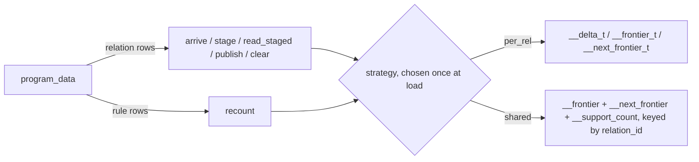

# Write-verb interface: one relational lowering IR, storage strategies behind six verbs

## Description

Six verbs name every transient write a tick makes. The compiler projects them
once; each runtime declares one interface with two implementations, and the
storage strategy stops being a flag the tick loop reads.

| verb | contract | per_rel | shared |
| --- | --- | --- | --- |
| arrive(rel, rows, sign) | `lower.pl:6986`, `types.ts:352`, `write_verbs.rs:43` | `writeVerbs.ts:219` / `write_verbs.rs:171` | `writeVerbs.ts:267` / `write_verbs.rs:262` |
| stage(rel, rows) | `lower.pl:6986`, `types.ts:352`, `write_verbs.rs:43` | `writeVerbs.ts:219` / `write_verbs.rs:171` | `writeVerbs.ts:267` / `write_verbs.rs:262` |
| read_staged(rel) | `lower.pl:6986`, `types.ts:352`, `write_verbs.rs:43` | `writeVerbs.ts:219` / `write_verbs.rs:171` | `writeVerbs.ts:267` / `write_verbs.rs:262` |
| recount(rule) | `lower.pl:7025` + `lower.pl:4796`, `types.ts:352`, `write_verbs.rs:43` | `writeVerbs.ts:219` / `write_verbs.rs:171` | `writeVerbs.ts:267` / `write_verbs.rs:262` |
| publish(rel) | `lower.pl:6986`, `types.ts:352`, `write_verbs.rs:43` | `writeVerbs.ts:219` / `write_verbs.rs:171` | `writeVerbs.ts:267` / `write_verbs.rs:262` |
| clear(tick) | `lower.pl:6986`, `types.ts:352`, `write_verbs.rs:43` | `writeVerbs.ts:219` / `write_verbs.rs:171` | `writeVerbs.ts:267` / `write_verbs.rs:262` |

The verb NAMES are fixed (`lower.pl:6951-6956` `write_verb/1`).

Card status:

| card | state |
| --- | --- |
| @write-verb-contract | the six verbs, both runtimes, both implementations |
| @frontier-step5-retraction | retraction and support parity on the shared path |
| @write-verb-strategies | the holes the contract left, named with file:line |
| @frontier-default-flip | untouched, needs Chris |

## Acceptance Criteria

- [x] Six verbs named once and reachable from the lowering projection
- [x] One interface per runtime, two implementations each
- [x] Retraction, support, negation and restart parity on the shared path, both doors, against the oracle
- [ ] Default flipped to shared and the per-rel transient lowering deleted (plan steps 6-7)

## Implementation Notes

Plan: `plans/2026-08-19-shared-sqlite-frontier.md`. Steps 1-4 landed in PR #378;
this epic carries step 5 and the verb contract. Step 6-7 stay with
@frontier-default-flip.

### 2026-08-20 · @sprefa-coordinator

UNPAUSED (perf work #382/#384 reviewed on main). Rebased onto 82987ad2c; npm test gate running; PR "supersedes #378" next.
