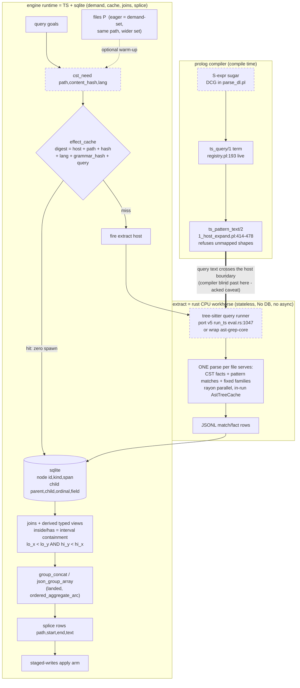
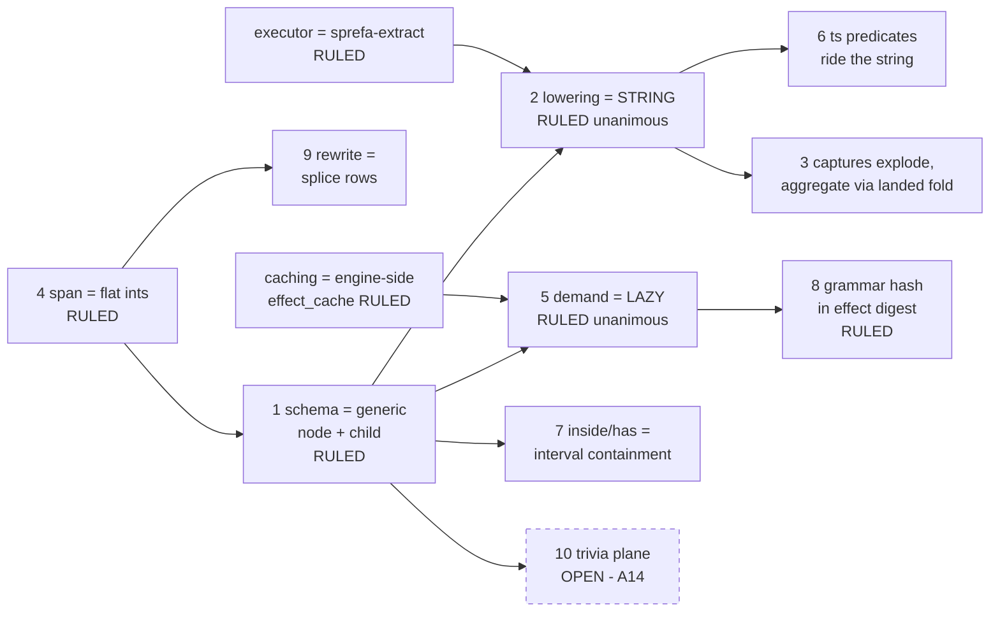

# CST/AST querying — rulings from the 2026-08-02 duel bracket

User-ratified 2026-08-02 ("agreed on all accounts"). Evidence: four DUEL docs +
two lane reports banked in `plans/duels-2026-08-02/` (worktrees disposable).
Every load-bearing citation below was coordinator-verified against the code.

## Rulings

1. **Lowering = STRING** (unanimous, flash + kimi on identical prompts).
   S-expr sugar parses by DCG into the existing `ts_query/1` term vocabulary;
   `compile_ts_query`/`ts_pattern_text` (1_host_expand.pl:414-478) emit query
   text; unsupported shapes refuse via `unmapped_feature`. Matching is bought
   (tree-sitter/ast-grep), never rebuilt as datalog joins. Missing emitters:
   anchors, negation, sg-metavariables — small branches or deliberate defers.
2. **Extraction demand = LAZY** (unanimous). Demand rows
   `cst_need(path, content_hash, lang)` derived from query goals fire the
   `extract` HostDef. Eager is the same code path with a `files(P)`-planted
   demand-set (flash's dissolve), so no second mechanism exists. Compact
   type/call/df planes keep their current eager ingest (kimi's boundary).
3. **Caching = engine-side, in effect_cache.** Request cols widen to
   (path, content_hash, lang, grammar_hash, query_text). Transactional with
   the tick, visible to the effect trail. Host stays stateless per its "No DB,
   no async" charter; per-invocation parse-tree reuse (v5 AstTreeCache
   precedent, eval.rs:1047) stays host-side. One-day host-side expression: a
   content-addressed cache dir keyed by the SAME tuple — only storage moves.
4. **sprefa-extract is the matching executor** — the CPU workhorse; the engine
   is runtime (demand + cache + joins + splice). ast-grep-core/-language 0.38
   already linked (Cargo.toml:18-19); rayon-parallel by charter. The v6 `sg`
   CLI host becomes a compatibility door. Kimi independently reached this:
   the missing phase-2 runner (`unsupported_host_execution_phase_2
   (tree_sitter_query)`, SYNTAX.md:330) should be a thin tree-sitter query
   wrapper in sprefa-extract, or a port of v5 `run_ts`.

## Picture 1 — the ruled pipeline (solid = exists, dashed = unbuilt)



## Worked example — one query through every stage

Task: flag every call to a deprecated function. `deprecated(callee_name)` is an
ordinary 10-row rel; the pattern is structural.

**Stage 1 — dl6 surface (the unbuilt sugar, proposed spelling):**

```
rel deprecated_call(file_path: text, call_start: int, call_end: int, callee_name: text).
deprecated_call(file_path, call_start, call_end, callee_name) <-
  file(file_path, content_digest),
  ts("(call_expression function: (identifier) @callee_name)",
     file_path, content_digest, callee_name, call_start, call_end),
  deprecated(callee_name).
# rx lowering: file$.pipe(mergeMap(f => tsHost.probe(f, queryText)))
#   .pipe(joinLatest(deprecated$), map(toRow)) -- capture rows stream in,
#   the deprecated join filters AFTER the host returns (the acked caveat)
```

> NOTE (user question 2026-08-02): the STRING ruling concerns the HOST WIRE
> only — what the compiler emits to the matcher. The SURFACE spelling above is
> a placeholder and is NOT ruled. Open options: (a) quoted pattern parsed at
> compile (v5 `ast` precedent — never a pass-through blob: compiler parses to
> the stage-2 term, refuses unmapped shapes, binds @captures to dl variables);
> (b) native unquoted S-expr in the dl6 grammar (syntax errors with positions,
> more DCG work); (c) bare ts_query term form (exists, verbose). All three
> lower through the same term -> text path.

**Stage 2 — what the DCG parses that string into (real vocabulary,
`1_host_expand.pl:424-478`):**

```prolog
ts_query([
  node(call_expression, [
    field(function,
      capture(callee_name, node(identifier, [])))
  ])
])
```

**Stage 3 — what `ts_pattern_text/2` emits (byte-for-byte the tree-sitter
query language):**

```scheme
(call_expression function: (identifier) @callee_name)
```

**Stage 4 — the demand row and its cache identity (engine side, ruling 3):**

```sql
-- the planner plants demand (ruling 2: LAZY)
cst_need('src/api.c', 'b3:9f2ac...', 'c')

-- effect_cache identity, fire-once per witness:
-- full_digest = mix('extract', 'src/api.c', 'b3:9f2ac...', 'c',
--                   grammar_hash('c', '0.38'), '(call_expression ...)')
INSERT INTO effect_cache(full_digest, identity_digest, host, state, requested_tick)
VALUES (0x7c31..., 0x11a0..., 'extract', 'pending', 42)
ON CONFLICT(full_digest) DO NOTHING;   -- hit = zero spawn, rows already in db
```

**Stage 5 — what sprefa-extract answers (one parse, rayon, stateless):**

```json
{"record":"match","capture":"callee_name","start":1042,"end":1051,"text":"old_hash_fn"}
{"record":"match","capture":"callee_name","start":2210,"end":2222,"text":"legacy_alloc"}
```

**Stage 6 — a containment query needs NO host at all (nested-set, decision 7):**

```
# every return statement inside a function body: pure indexed range join
rel fn_return(fn_id: int, ret_id: int).
fn_return(fn_id, ret_id) <-
  node(fn_id, "function_declaration", file_path, fn_lo, fn_hi, _),
  node(ret_id, "return_statement",   file_path, ret_lo, ret_hi, _),
  fn_lo < ret_lo, ret_hi < fn_hi.
# rx lowering: combineLatest([fnNode$, retNode$]).pipe(filter(containment))
# EXPLAIN law: SEARCH node USING INDEX (file, lo) -- never SCAN
```

**Stage 7 — the rewrite is just rows into the staged-writes path (decision 9):**

```
# replace each deprecated callee span with its successor name
splice(file_path, call_start, call_end, replacement_name) <-
  deprecated_call(file_path, call_start, call_end, callee_name),
  successor(callee_name, replacement_name).
# rx lowering: depCall$.pipe(joinLatest(successor$))
#   -> stage rows in-tick; apply arm drains between ticks (concatMap)
```

Same shape end to end: the green-all CLAUDE.md stamp, this codemod, and the
README op-table all reduce to stage 6/7 rows over different sources.

## Picture 2 — decision dependencies, with today's rulings



## Consensus defaults carried from the first flash/kimi planning round

- Schema: generic `node` + `child` (+ ordinal, field), typed views derived;
  rel-per-kind storage cut. v5 nested-set spans (README.md:557) make
  inside/has an indexed interval-containment join, no recursion.
- Span columns stay flat start/end ints; the column_type_wrapper refusal
  stands until struct-as-rows lands generally.
- Grammar hash salts the effect digest (ruling 3 covers it).
- Rewrites = captures feeding splice rows through the staged-writes path; no
  ast-grep fix: templates.
- Quantified captures explode to rows+ordinal; group_concat/json_group_array
  (landed, ARCH ordered_aggregate_arc) aggregate when needed.
- Still split, needs a ruling: trivia/comments as separate rel (flash) vs
  CST-native named nodes with doc-formats separate (kimi). A14 lives here.

## Known caveat (kimi steelman, user-acked "fair")

STRING cannot push dynamic selectivity into the matcher: a 10-row
`deprecated(name)` filter still materializes every `identifier` capture before
the join. Falsifying lab spec in duels-2026-08-02/duel-a-kimi.md (10^5
identifiers / 10 hot, 10x wall + 1000x intermediate-rows criteria). If it
fails, the answer is a hybrid that compiles filter-bound patterns differently,
not a wholesale flip.

## Unbuilt queue implied by the rulings

- Phase-2 tree-sitter runner in sprefa-extract (port run_ts or wrap
  ast-grep-core's tree-sitter access); wire the conformance fixture host
  (2_hosts_wiring.pl:200-242) to it.
- S-expr sugar DCG in parse_dl.pl; anchor/negation emitter branches or named
  refusals.
- cst_need demand planting in the planner; grammar_hash into request cols.
- Lab B (eager-vs-lazy on linux corpus): both arm designs banked; needs a
  kernel checkout. Lab A (in-process library vs CLI spawn throughput on
  linux-sim via extract-ab lineage) is the payoff measurement for ruling 4.
- Effect-trail arc (prior sitting): stage/apply promotion, trail rows extend
  PerfTrace seam, disk digest into effect_cache response side.

## Model scorecard (for the opencode-orchestration skill's next edit)

flash 0731: 4/4 lanes brief-faithful; ARCH reconcile surgical (gate-verified,
hook side-effect correctly attributed); one novel design move
(eager-as-demand-set). The "never give flash judgment" doctrine over-rotates:
with grounding-file lists and falsification-shaped prompts it produced
citation-heavy design work. Its residual weakness is anchor sloppiness (cites
the pointing row, not the row where numbers live).
kimi-for-coding: 3/3 lanes; best citation precision (spot-checks 4/4 exact);
found run_ts, registry row, SYNTAX gap, and the pushdown steelman nobody else
saw. Slower wall-clock than flash on identical prompts.
