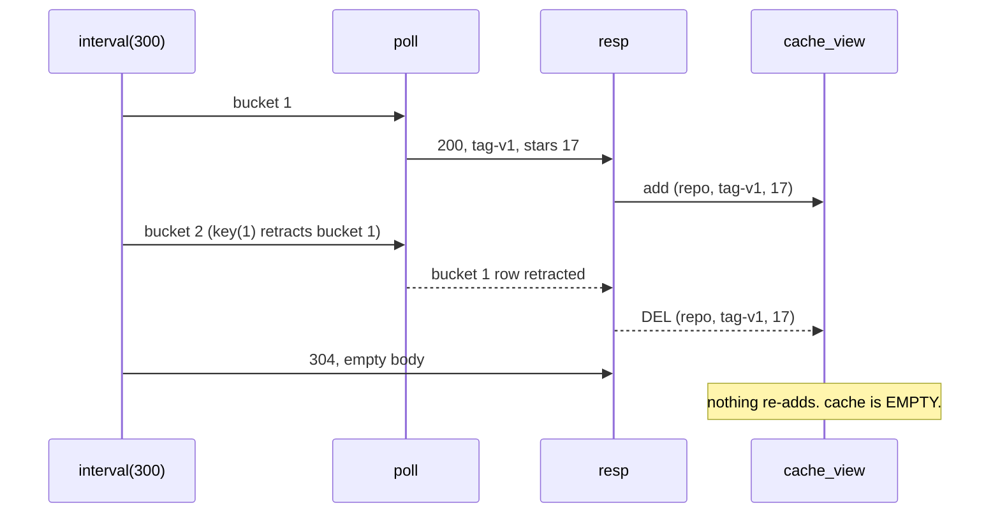
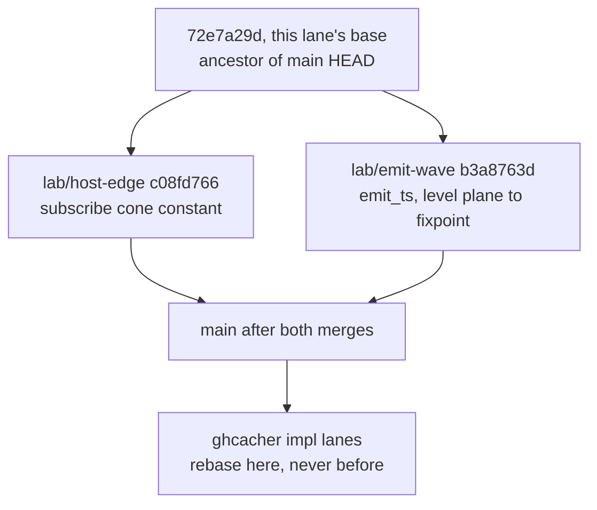
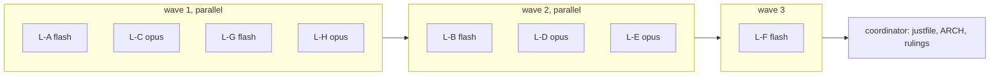

# ghcacher in v6: receipts, expressibility, design, tests

Base sha `72e7a29d` (branch `lab/ghcacher-plan`). Spec sources: the production
Rust tool at `/Users/chrishafley/projects/ghcacher/README.md`, the requirement
notes at `plans/2026-08-04-ghcacher-requirements.md`, the standing golden at
`v6/tsv2/goldens/ghcacher_tick_golden/`, and the org spine at
`v6/dl/fixtures/crawl_org.dl6`.

## TOC

1. [Receipts: what is verified, what is corrected](#1-receipts)
   1. [The measured defect: the standing cache does not survive a 304](#11-the-measured-defect)
   2. [GitHub rate doctrine, primary sources](#12-github-rate-doctrine)
   3. [Cost arithmetic at 300 repos](#13-cost-arithmetic-at-300-repos)
   4. [Corrections to the requirements doc](#14-corrections)
   5. [Prior art, superseded](#15-prior-art-superseded)
2. [Expressibility table: the README capability by capability](#2-expressibility-table)
3. [Build-vs-buy: transport and clone layer](#3-build-vs-buy)
4. [Design, four layers per work item](#4-design)
   1. [Item 1: clone host](#41-item-1-clone-host)
   2. [Item 2: config feeder](#42-item-2-config-feeder)
   3. [Item 3: tier rels and the activity feed](#43-item-3-tier-rels)
   4. [Item 4: conditional fetch host](#44-item-4-conditional-fetch-host)
   5. [Item 5: batched PR host](#45-item-5-batched-pr-host)
5. [Test plan](#5-test-plan)
6. [Sequencing](#6-sequencing)
7. [Open questions for the user](#7-open-questions)

---

## 1. Receipts

Every claim below was checked against a primary source or measured in this
worktree. Claims that could not be reached either way are marked UNVERIFIED and
carry the reason.

### 1.1 The measured defect

The requirements doc says of the standing golden: "only status 200 refreshes
cache_view, non-200 = zero delta". Measured, that is false, and the failure is
exactly the case the etag loop exists to serve.



Caption: `cache_view` is a level rule over `resp`, and `resp` carries `Bucket`,
so the clock moving retracts the cached row before the next answer arrives.

Receipt, run against the oracle in this worktree with a 304 on tick 4:

```text
tick 3 deltas: "cache_view":{"add":[],"del":[["repo","tag-v1",17,"cli/cli"]]}
tick 4 deltas: "resp":{"add":[["repo",2,304,"",0,""]]}      (no cache_view key)
final:         no "cache_view" key at all
```

The first 304 destroys the cache. A poller whose whole point is that most polls
are 304s would hold an empty cache almost always.

**The fix, measured green on BOTH doors.** Make the cache a keyed latch fed by
an edge rule off a level rel that filters the status, rather than a level rule
over `resp`:

```dl6
rel fresh_hit(ep: text, tag: text, stars: int, full_name: text).
fresh_hit(Ep, Tag, Stars, FullName) <-
  resp(Ep, _, Status, Tag, Stars, FullName), Status == 200.

rel cache_view(ep: text, tag: text, stars: int, full_name: text) key(1).
cache_view(Ep, Tag, Stars, FullName) <+ fresh_hit(Ep, Tag, Stars, FullName).
```

rx lowering: `resp$.pipe(filter(row => row.status === 200))` for `fresh_hit`,
then `freshHit$.pipe(scan((latch, row) => latch.set(row.ep, row), new Map()))`
for the keyed latch, which is `<+` over a `key(1)` head. The latch has no input
edge from the clock, so a clock tick alone moves nothing.

Measured result on the same 304 schedule:

| tick | event | `cache_view` delta |
|---:|---|---|
| 2 | 200, tag-v1 | add `(repo, tag-v1, 17, cli/cli)` |
| 3 | clock moves to bucket 2 | none |
| 4 | 304, empty body | none |
| final | | `[["repo","tag-v1",17,"cli/cli"]]` |

Oracle output and emitted-runtime output were byte-identical.

**Second finding, a door split.** The first fix attempt kept the literal in the
trigger atom:

```dl6
cache_view(Ep, Tag, Stars, FullName) <+ resp(Ep, _, 200, Tag, Stars, FullName).
```

The swipl oracle ACCEPTS and runs this. The compiler REFUSES it by name:
`trigger_arg_not_var`. One door runs a program the other rejects. This is worth
its own conformance fixture regardless of the ghcacher arc; the shape here is
"a level rel with a literal argument in an edge trigger position".

### 1.2 GitHub rate doctrine

| # | question | answer | primary source |
|---|---|---|---|
| 1 | Do 304s cost zero primary points? | YES, with a stated condition | REST best practices |
| 2 | Separate REST and GraphQL pools? | YES | both rate-limit pages |
| 3 | GraphQL cost formula? | connection count / 100, rounded, minimum 1 | GraphQL rate limits |
| 4 | Does GraphQL honor If-None-Match? | UNVERIFIED, no doc addresses it; inference below says no | see 1.2.4 |
| 5 | Secondary limits that bite a poller | 900 pts/min REST, 2000 pts/min GraphQL, 100 concurrent, serial-request guidance | rate-limit pages |

**1.2.1 Conditional requests.** From
`https://docs.github.com/en/rest/using-the-rest-api/best-practices-for-using-the-rest-api`:

> "Making a conditional request does not count against your primary rate limit
> if a `304` response is returned and the request was made while correctly
> authorized with an `Authorization` header."

> "Conditional requests for unsafe methods, such as `POST`, `PUT`, `PATCH`, and
> `DELETE` are not supported unless otherwise noted in the documentation for a
> specific endpoint."

Note the exemption names the PRIMARY limit only. Nothing states that a 304 is
free against the secondary points-per-minute limit. Design accordingly.

**1.2.2 Pools and numbers.** From
`https://docs.github.com/en/rest/using-the-rest-api/rate-limits-for-the-rest-api`:

> "The primary rate limit for unauthenticated requests is 60 requests per hour."

> "your personal rate limit of 5,000 requests per hour"

> "The GraphQL API also has a separate primary rate limit"

REST secondary limits, same page:

> "No more than 100 concurrent requests are allowed."

> "No more than 900 points per minute are allowed for REST API"

> "No more than 90 seconds of CPU time per 60 seconds of real time"

REST point values, same page:

| request | points |
|---|---:|
| Most REST `GET`, `HEAD`, `OPTIONS` | 1 |
| Most REST `POST`, `PATCH`, `PUT`, `DELETE` | 5 |

From
`https://docs.github.com/en/graphql/overview/rate-limits-and-node-limits-for-the-graphql-api`:

> "5,000 points per hour per user"

> "The REST API also has a separate primary rate limit."

> "No more than 2,000 points per minute are allowed for the GraphQL API endpoint."

> "Individual calls cannot request more than 500,000 total nodes."

> "Values of `first` and `last` must be within 1-100."

**1.2.3 The GraphQL cost formula**, verbatim from the same page:

> "1. Add up the number of requests needed to fulfill each unique connection in
> the call. Assume every request will reach the `first` or `last` argument
> limits.
> 2. Divide the number by 100 and round the result to the nearest whole number
> to get the final aggregate point value."

> "The minimum point value of a call to the GraphQL API is 1."

The worked example counts 1 request for the outer repositories connection, 100
for the issues connections, 5,000 for the labels connections, totalling 5,101,
"Dividing by 100 and rounding gives us the final score of the query: 51".

Two consequences the arithmetic in 1.3 rests on:

- The unit counted is the **connection**, not the field and not the alias. An
  aliased `repository(owner:.., name:..)` root field is a single-node lookup,
  not a connection, so by the stated rule it adds nothing on its own.
- Nesting a connection inside a connection MULTIPLIES. A flat
  `pullRequests(first: N)` per repo is cheap; adding `reviews(first: M)` inside
  it costs `repos * N` requests.

Corroboration from the production tool: the README's own per-call telemetry
line for a full PR fetch reads `"gql_cost":1`, which is the API's own reported
cost for a batched PR query.

Also on that page, and binding on batch size:

> "If GitHub takes more than 10 seconds to process an API request, GitHub will
> terminate the request and you will receive a timeout response"

> "If a timeout occurs for any of your API requests, additional points will be
> deducted from your primary rate limit for the next hour."

A timeout is therefore worse than an expensive query. Batch size is a
reliability knob, not only a cost knob.

**1.2.4 GraphQL and ETags: UNVERIFIED, with a documented inference.** No page
on docs.github.com that could be reached states whether the GraphQL endpoint
honors `If-None-Match`. The GraphQL rate-limit page, the GraphQL overview page,
and a domain-restricted search all return nothing on ETag, If-None-Match, 304,
or conditional requests. The requirements doc's flat assertion "GraphQL ignores
ETags entirely" therefore has no primary citation.

The inference chain, from two quoted sentences:

1. The GraphQL endpoint is `POST /graphql`.
2. REST best practices: conditional requests for `POST` "are not supported
   unless otherwise noted in the documentation for a specific endpoint".
3. No GraphQL page notes otherwise.

Conclusion: treat GraphQL as having no 304 path. Flag it as inference, not
quotation. The live smoke leg in section 5 measures it rather than assuming it.

**1.2.5 The Events API**, from `https://docs.github.com/en/rest/activity/events`,
which is where the production tool's cheapest signal lives:

> "Events are optimized for polling with the 'ETag' header. If no new events
> have triggered, you will see a '304 Not Modified' response, and your current
> rate limit will be untouched."

> "we provide an 'X-Poll-Interval' header that specifies how often (in seconds)
> you are allowed to poll. In times of high server load, the time may increase."

> "The timeline will include up to 300 events. Only events created within the
> past 30 days will be included."

> "This API is not built to serve real-time use cases. Depending on the time of
> day, event latency can be anywhere from 30s to 6h."

That last sentence is the single most important line in this document for the
user's stated requirement. See 1.4.

Endpoint titles on that page, which decide whether one call can cover an org:

| path | documented title |
|---|---|
| `GET /orgs/{org}/events` | "List public organization events" |
| `GET /repos/{owner}/{repo}/events` | "List repository events" |
| `GET /users/{username}/events/orgs/{org}` | "List organization events for the authenticated user" |

`/orgs/{org}/events` is titled PUBLIC. For a private org it is very likely blind
to the repos that matter. The doc page carries no sentence resolving private
visibility for `/repos/{owner}/{repo}/events` either. This is a measurable
question, not a readable one, and the live smoke leg in section 5 answers it
before any lane commits to the one-call shape.

### 1.3 Cost arithmetic at 300 repos

Assumptions stated so the arithmetic can be checked: 300 repos, one hot tier at
a 60-second cadence, authenticated user token, 5,000 REST points/hour and 5,000
GraphQL points/hour, 60 ticks per hour.

| shape | calls / tick | calls / hour | primary pts/hr, quiet org | primary pts/hr, all changed | secondary pts/min used |
|---|---:|---:|---:|---:|---|
| A: one org-events call, then targeted GraphQL | 1 + changed/20 | 60 + n | ~0 REST | 60 REST + batch pts | 1 of 900 REST |
| B: per-repo REST conditional on `/pulls` | 300 | 18,000 | 0 REST | 18,000 REST, over budget 3.6x | 300 of 900 REST |
| C: per-repo events, then targeted GraphQL | 300 | 18,000 | 0 REST | 18,000 REST | 300 of 900 REST |
| D: aliased GraphQL sweep, 20 repos per call | 15 | 900 | 900 GraphQL | 900 GraphQL | 15 of 2,000 GraphQL |
| E: aliased GraphQL sweep, 100 repos per call | 3 | 180 | 180 GraphQL | 180 GraphQL | 3 of 2,000 GraphQL |

Per-row arithmetic:

- **B**: 300 conditional GETs per tick. Every 304 is 0 primary points, so a
  fully quiet org costs nothing against the 5,000/hr pool. Every 200 costs 1.
  Break-even against 5,000/hr is 5,000 / 18,000 = 27.8% of calls returning 200.
  The binding constraint is not points, it is 300 requests inside 60 seconds
  against guidance that says "you should make requests serially instead of
  concurrently", which budgets 200ms per round trip with zero slack.
- **D**: 20 aliased `repository` root fields, one `pullRequests(first: 100)`
  connection each. 20 connections, 20 requests, 20/100 rounds to 0, floored to
  the documented minimum of 1 point. 15 calls per tick, 900 points/hour, 18% of
  the GraphQL pool. This is the README's chosen batch size and its telemetry
  reports exactly `gql_cost: 1`.
- **E**: same shape at 100 repos per call. 100 requests, 100/100 = 1 point. 3
  calls/tick, 180 points/hour, 3.6% of the pool. Cheaper on paper. Rejected as
  the default because of the 10-second server-side timeout and its punitive
  extra deduction: a query fanning 100 repos x 100 PRs is a plausible timeout,
  and a timeout costs more than the query saved. Priced as a tuning row, not a
  default.
- **A**: the production tool's shape. One conditional call names which repos
  moved; only those get a GraphQL batch. On a quiet org the entire hourly spend
  is 60 REST calls returning 304, which is 0 primary points and 1 point/minute
  of secondary budget.

Ranking on the four axes that matter:

| axis | best | worst |
|---|---|---|
| primary points/hour | A (~0) | B when busy (18,000) |
| HTTP requests/hour | A (60) | B and C (18,000) |
| secondary pts/min headroom | A (1/900) | B and C (300/900) |
| wall-clock feasibility at serial issue | A (1 call/tick) | B and C (300 calls/tick) |

A wins on every axis. Its one weakness is the visibility question in 1.2.5.

### 1.4 Corrections

| # | requirements doc §3 claim | verdict | correction |
|---|---|---|---|
| 1 | "REST conditional requests answering 304 are free against the primary limit" | CORRECT, with a condition | Only when the request carried an `Authorization` header, and only against the PRIMARY limit. The 900 pts/min secondary limit is not documented as exempt. |
| 2 | "GraphQL ignores ETags entirely" | UNVERIFIED | No primary source addresses it. Inference from the POST rule says no 304 path. Measure it in the smoke leg. |
| 3 | "REST and GraphQL draw from SEPARATE 5000/hr pools" | CORRECT | Both pages state the separation. Enterprise Cloud numbers differ per API (REST 15,000, GraphQL 10,000); the plan assumes the plain 5,000. |
| 4 | "cheap conditional REST GETs as the change detector (304s free at hundreds of repos)" | WRONG DETECTOR | The cheapest detector is ONE conditional events call per org per tick, not 300 conditional `/pulls` calls. Factor of 300 on request count and on secondary budget. Row A vs row B above. |
| 5 | golden §1: "only status 200 refreshes cache_view, non-200 = zero delta" | WRONG | Measured: a 304 leaves `cache_view` EMPTY. See 1.1. |
| 6 | "hot repos refresh every minute" | NOT ACHIEVABLE VIA EVENTS | GitHub documents events latency of "30s to 6h". A 1-minute cadence is a POLL cadence, never a freshness guarantee. Any freshness claim in a doc or test must say "polled every minute", never "at most one minute stale". |
| 7 | §2 sketch: "arithmetic/modulo forms not yet confirmed on the tick plane" | CONFIRMED WORKING | `:=`, `mod`, `/`, `-`, `<`, `>=`, `==`, `count/1`, `group_concat/2` all compile and run on the tick plane. Probe in 4.3 is oracle-graded. |

One more correction, on the concurrency cap. The README caps concurrent
git/`gh` subprocesses at 8. `v6/tsv2/serve/1_hosts.ts` runs invocations under
`concatMap`, which is concurrency 1, strictly serial. v6 is currently STRICTER
than the production tool, and there is no knob. At 300 repos a serial clone
sweep is a 10-second-law risk. Priced in 4.1.

### 1.5 Prior art, superseded

`v6/dl/fixtures/ghcacher-findings.md` (372 lines, committed 2026-07-28) is an
earlier attempt at this same arc, and its program `v6/dl/fixtures/ghcacher.dl6`
is still on disk. It targets the OLD `v6/dl` engine, not the current
`v6/prolog` compiler plus `v6/tsv2` runtime, so most of it is closed. Read as
history, not as a plan. Status of its nine findings against today's surface:

| finding | then | now |
|---|---|---|
| F1: no `@async`/`@next` in the grammar | inexpressible | CLOSED. `<+` edge rules and `key(1)` latches are the spelling |
| F2: no clock or tick builtin, "the SLOT-SWR-defining gap" | inexpressible | CLOSED. `bind interval(period, bucket)` exists and every design here rides it |
| F3: no `json` term-extraction | approximable at a cost | PARTLY. `decode/2` and the json aggregate family exist; `json_object/2` is still refused at head (item 19, section 2) |
| F4: negation-based etag bootstrap is a stratification violation | reproduced as a refusal | CLOSED by construction. The bootstrap is an arrival row, not a negation, exactly as `ghcacher_tick_golden` seeds `etag_event(repo, "")` |
| F5: `sh` splits input/output columns differently than v5 | noted | STANDING, and it is now the documented contract in `registry.pl` |
| F6: content-addressed accumulation covers `change_log` narrowly | narrow | CLOSED. `log keep(all)` is the spelling (row 11, section 2) |
| F7: the program crashes the live engine on the first host response, root cause unresolved | open | STALE. Different runtime; the crash was in `3_runtime.ts`, which the current serve path does not use. Do NOT chase it |
| F8: `rel(1)` retention is inert on a rule-headed rel, and its own semantics is a global sweep rather than per-key | open defect | RELEVANT SHAPE, different spelling. Today's `key(1)` IS per-key. Worth one assertion in G1 that the etag latch is keyed per endpoint and one endpoint's tag cannot evict another's |
| F9: no `effect_log` builtin | inexpressible | CLOSED in effect. `call_log` as a `log keep(all)` rel is the same thing as data |

The one live carry-over is F8's underlying worry, and section 5.2's final-state
assertion covers it: after a multi-endpoint schedule, `poll_state` must hold one
row PER endpoint, never one row total.

---

## 2. Expressibility table

The acceptance bar: v6 must be able to EXPRESS the production tool. Gap classes:

- **expressible-untested**: the constructs exist and are ruled; the missing work
  is a golden, not a language change.
- **needs-design**: expressible in principle, but the shape is not written and
  has an open decision inside it.
- **needs-new-ground**: no construct covers it today.
- **bought, not built**: the standing infra law puts it on the OS or a library,
  so it is correctly absent from the engine.

| # | README capability | v6 construct(s) today | golden that grades it today | gap class |
|---|---|---|---|---|
| 1 | Config TOML, search order, `$GHCACHE_CONFIG` override | `sh` host reading a path; candidate paths as fact rows; `min/1` over a rank column | none | needs-design (4.2) |
| 2 | Org repo discovery on its own interval (`org_repo_discovery_interval_seconds`) | ruling `org_fanout = repos_host_on_clock`; `gh_repos` host already declared in `crawl_org.dl6:84` with `bucket` as a freshness input | `multirepo_crawl` grades the local variant; `gh_repos` is written and ungraded (needs credentials) | expressible-untested |
| 3 | Event-targeted sync: only repos with new events re-fetched | level rules over an activity latch; the witness cache makes an unchanged answer zero delta | none | expressible-untested (4.3, probe green) |
| 4 | PR batching, up to 20 repos per aliased GraphQL call | `group_concat/2` aggregate head over a batch-index column; the host layer's applicative fold already folds several projections into one subprocess | none | expressible-untested (4.5, probe green) |
| 5 | ETag / Last-Modified `poll_state` per endpoint | `key(1)` latch fed by `<+`, exactly `current_etag` in the standing golden | `ghcacher_tick_golden` grades the loop, but see 1.1: the cache half is WRONG | needs-design (the fix in 1.1 is one line and measured) |
| 6 | Two rate pools tracked independently | two `key(1)` latches, one per pool, fed from the response rows | none | expressible-untested |
| 7 | Threshold sleep and progressive back-off | nothing. A rule can DERIVE that spend is over threshold; nothing in the language can make a host wait | none | needs-new-ground (4.4) |
| 8 | Checkout sweep: clone once, SHA-gated fetch/reset | write-effect `sh` host with the wanted sha as a FRESHNESS input, so an unchanged sha is a witness cache hit and no subprocess runs | none | needs-design (4.1) |
| 9 | Concurrency cap 8, `GHCACHE_CHECKOUT_CONCURRENCY` | none. `1_hosts.ts` uses `concatMap`, concurrency 1, no knob | none | needs-new-ground (runner change, not language) |
| 10 | `checkout_pr_branches` ref mirroring, zero API cost | same write-effect host class as row 8, different template | none | needs-design (rides 4.1) |
| 11 | `change_log` append-only | `rel change_log(..) log keep(all)`, the exact shape `etag_event` already uses at `0_ghcacher_clock_golden.dl6:9` | `ghcacher_tick_golden` grades a `log keep(all)` rel's retention | expressible-untested |
| 12 | SSE `/events` with `Last-Event-ID` backfill | ruling `edge_before_first_subscribe = keep_table_is_the_replay`: a late subscriber reads the keep-bounded table then the live stream, `concat(from(storedRows), live$)`. That IS Last-Event-ID backfill | none | expressible-untested |
| 13 | `/subscribe` + `/heartbeat` TTL expiry driving dynamic sync | ruling `subscribed_reset_pole = per_rel_declaration`: default is rx `share()`, cold when the last reader unsubscribes. TTL expiry is the teardown edge | none | needs-design (the TTL clock itself is a `bind interval` join; the mapping is real, the spelling is not written) |
| 14 | Pidfile instance lock | none, correctly | none | bought, not built (OS/`flock`, per the infra law) |
| 15 | HTTP command server, loopback | `serve/4_http.ts` exists; `/arrivals` is the ingress | tsv2 serve tests | bought, not built (the server), expressible-untested (the routes) |
| 16 | External events entering the engine | ruling `event_ingress_surface = live_event_bind`: rows arrive through POST `/arrivals` and type-check like any arrival | none | expressible-untested |
| 17 | `call_log` telemetry, per-call cost and both pools | `log keep(all)` rel written from the response rows, plus derived per-pool sums | none | expressible-untested |
| 18 | Query views (`v_open_prs`, `v_recent_events`, ...) | ordinary derived rels; `?` query heads are the subscription roots | every fixture | expressible-untested |
| 19 | Stdout JSON lines, two independent streams | derived rels plus the existing tick-log emitter; `json_group_array/1` and `json_object/2` are in the aggregate surface (`json_object` is refused at head today) | none | needs-design (which of the two streams is a rel vs an emitter concern) |
| 20 | `fs_alias` shorter checkout paths | a plain column on the org fact row, threaded into the clone host's `dest_root` | none | expressible-untested |
| 21 | `exclude` list of repo names | `not/1` level-body anti-join against an `excluded(repo_slug)` fact rel | `golden-flex.dl6:313` grades `not/1` | expressible-untested |
| 22 | Idempotent writes, `INSERT OR IGNORE` / upsert | this is what a `key(1)` head and a set-semantics rel ARE | every fixture | expressible-untested |

Tally: 13 expressible-untested, 6 needs-design, 2 needs-new-ground, 3 bought.
The two pieces of genuinely new ground are **back-off/sleep control over a host**
(row 7) and **a concurrency knob on the host runner** (row 9). Both are runner
concerns rather than language concerns. Everything else is a golden away, a
design doc away, or correctly outside the engine.

---

## 3. Build-vs-buy

### 3.1 The live conditional transport

The candidate set, priced against the standing constraint that hosts are shell
one-shots whose stdout is decoded into declared output columns, and that a
nonzero exit is a host failure (`1_hosts.ts:240`).

| candidate | how the ETag round-trips | non-2xx handling | secrets | fit with the host contract | verdict |
|---|---|---|---|---|---|
| `curl --etag-save/--etag-compare` | curl owns a per-endpoint FILE; curl reads it, sends `If-None-Match`, and overwrites it on a 200 | `--fail` gives exit 22 on >=400; a 304 is not >=400 so it exits 0 | must pass a token via `-H "Authorization: ..."` from the environment | POOR: the tag lives in a curl-owned file, which is exactly the mutable state the `key(1)` latch is supposed to be | REJECTED |
| `curl` with an explicit `-H 'If-None-Match: {prev_etag}'` and `-w '%{http_code}'` | the program owns the tag; curl is stateless | status comes back as a value, not an exit code | same token problem | GOOD on shape, BAD on secrets: the repo would grow a token path where the production tool has none | REJECTED |
| `gh api --include` with an explicit `-H 'If-None-Match: {prev_etag}'` | the program owns the tag in a `key(1)` latch; `--include` prints status line and headers so the new ETag is parseable from stdout | non-2xx exits nonzero, so the template must capture the status and exit 0 itself | NONE. Auth is delegated to the `gh` keychain | BEST | **CHOSEN** |
| `gh api --cache 60m` | gh owns an opaque TTL cache; nothing in the docs says it sends `If-None-Match` | unchanged | none | REJECTED on semantics: a TTL cache and a conditional request are different things. A TTL hit returns STALE data without asking GitHub; a 304 returns a CONFIRMATION that the data is current. The requirement is freshness confirmation, and the second sync must be provably free because GitHub said 304, not because a timer had not expired. Also unknowable from primary docs | REJECTED |
| A node HTTP client (undici, octokit, got) inside the runtime | full header control | full control | the process would hold a token | REJECTED on two standing laws at once: hosts are shell one-shots, and the production tool's stated security property is "No outbound HTTP client, all network egress goes through `gh` subprocess invocation". Adopting a node client would make v6 strictly worse on the security row than the tool it is meant to express |

Why `gh api` beats raw `curl` even though curl is the more honest HTTP tool: the
deciding column is **secrets**. `gh` inherits `gh auth` credentials from the OS
keychain, so no token ever appears in a template, an environment variable, a
process listing, or a tick log. Every curl variant requires the token to be
materialized somewhere the engine can interpolate it, and a template string is
the one place in this language that ends up in tick logs and error messages
verbatim. That is a security regression the arithmetic does not pay for.

The cost of choosing `gh`: two behaviors are undocumented on
`https://cli.github.com/manual/gh_api` (exit status on non-2xx, and whether
`--cache` sends conditional headers). Both are pinned by the smoke leg in
section 5 rather than assumed. `gh 2.92.0` is installed locally.

### 3.2 The clone layer

| candidate | first fetch cost | update cost | disk | fits "PR head mirroring" | verdict |
|---|---|---|---|---|---|
| `gh repo clone <slug> <dest>` | full history | `git fetch` afterwards | full | yes, refs are fetchable afterwards | **CHOSEN for the first clone**, matching the production tool exactly (README: `src/checkout.rs:173`) |
| `git clone --filter=blob:none` (partial clone) | trees and commits only, blobs fetched when a file is read | same | much smaller | yes | **CHOSEN as an opt-in column**, not the default. It is strictly cheaper for a poller that reads refs and shas and rarely reads file contents, which is this workload. It is NOT the default because a later `repo_files_at` crawl over a partial clone triggers a blob fetch per file, which turns a local host into a network host invisibly. That is exactly the silent behavior this repo files as a defect, so the choice must be a visible column |
| `git fetch` cadence on existing checkouts | n/a | one fetch per due repo | n/a | yes | **CHOSEN for updates**, SHA-gated. The gate is not policy code: the wanted sha is a FRESHNESS input on the host, so an unchanged sha is a witness cache hit and the subprocess never starts |
| bare cache dir plus `git worktree add` per branch | one clone per repo | one fetch | smallest for many branches | yes | REJECTED for now. It is the right shape if the tool ever checks out many branches per repo simultaneously; the README checks out ONE default branch per repo into `{staging}/{owner}/{name}` and mirrors PR heads as REFS rather than worktrees. Worktree management would add a lifetime the requirement does not have. Recorded as the answer if per-PR worktrees are ever wanted |

Ref mirroring stays exactly the README's line, and it costs zero API budget
because it rides the git transport rather than the API:

```sh
git fetch --prune origin '+refs/pull/*/head:refs/remotes/pr/*/head'
```

---

## 4. Design

Four layers per item, in the standing planning order: type signatures,
pseudo-code as comments, instance lifetimes, then storage layout followed by the
read/write sequence and the uniqueness conditions. The four layers are allowed
to disagree; where they do, it is marked.

Binding constraints, restated so each design can be checked against them:

| ruling | what it forbids here |
|---|---|
| `org_fanout = repos_host_on_clock` | inventing any construct for the repo list; it is an `sh` host on a clock bind |
| `repo_column_spelling = distinct_name_hosts` | an optional leading `repo` column on a shared host; every repo-scoped host gets its own NAME |
| `tick_boundary = ingress_transaction_list` | manufacturing simultaneity; one submission is one tick |
| `files_naming` | the word `scan`, which is spent |
| `subscribe_vocabulary` | the word `demand` outside the pre-existing `__host_demand_*` family |
| `gen_word_banned` | the word `gen` |

Adjustability bar, user-worded: "as long as its adjustable we are fine". Every
tunable below is a FACT ROW or a rule-body literal. Nothing is engine config.

| tunable | where it lives | how the user changes it |
|---|---|---|
| org list | `want_org(owner)` arrival rows | POST to `/arrivals`, or the config host emits them |
| poll cadence | the literal in `interval(60, Bucket)` | edit one rule |
| discovery cadence | the literal in a second `interval(3600, Bucket)` | edit one rule |
| tier bands and periods | `tier_rule` fact rows | POST rows |
| batch size | `batch_size` fact row | POST one row |
| excluded repos | `excluded_repo` fact rows | POST rows |
| checkout root, `fs_alias` | columns on the org fact row | POST rows |
| points threshold | `pool_threshold` fact rows | POST rows |

### 4.1 Item 1: clone host

**Layer 1: signatures.**

```dl6
# The write-effect host. Distinct NAME per ruling repo_column_spelling: this is
# not a mode column on any existing host.
sh repo_checkout(repo_slug: text, dest_root: text, want_sha: text)
  -> (checkout_path: text, head_sha: text) =
  `...`.

# The PR-head mirror. A second NAME rather than a flag column, same ruling.
sh repo_mirror_pr_heads(repo_slug: text, dest_root: text, want_sha: text)
  -> (pr_number: int, head_sha: text) =
  `...`.

rel checkout(repo_slug: text, checkout_path: text, head_sha: text) key(1).
rel pr_head(repo_slug: text, pr_number: int, head_sha: text).
```

`registry.pl` contract rows, following the `repos` precedent at
`compile/registry.pl:363`:

```prolog
host_input_contract(repo_checkout,
                    [col(repo_slug, text), col(dest_root, text), col(want_sha, text)],
                    [identity, identity, freshness]).
host_input_contract(repo_mirror_pr_heads,
                    [col(repo_slug, text), col(dest_root, text), col(want_sha, text)],
                    [identity, identity, freshness]).
```

`want_sha` is FRESHNESS, and that single word is the entire SHA gate. A
freshness input extends the witness digest without returning on the response
row, so a repo whose branch sha has not moved re-asks with the SAME witness,
hits the durable `__host_witness` cache, and the subprocess never starts. The
README implements this as an explicit DB comparison ("only runs if `branch.sha`
in the DB differs from the last recorded checkout sha"). Here it is a column
role, with no comparison code to get wrong.

**Layer 2: pseudo-code.**

```dl6
# sh repo_checkout(repo_slug, dest_root, want_sha) -> (checkout_path, head_sha)
#   dest := dest_root + "/" + repo_slug
#   if dest/.git absent:            gh repo clone repo_slug dest      (once, ever)
#   git -C dest fetch origin +refs/heads/DEFAULT:refs/remotes/origin/DEFAULT
#   if the default branch is checked out:  stash tracked edits, reset --hard
#   else:                                   branch -f DEFAULT origin/DEFAULT
#   print  dest, rev-parse HEAD               (one row)
#   exit 0 on every path; a warning is stderr, never a nonzero exit
```

The last line is not decoration. `1_hosts.ts:240` turns a nonzero exit into a
host failure, and `crawl_org.dl6:70` already records the same trap for the
`repos` host. A repo whose remote lacks the requested branch must warn and exit
0, matching the README's "the fetch is skipped with a warning".

rx lowering:

```ts
checkoutwanted$.pipe(
  map(mintIdentityAndWitness),          // want_sha rides the witness, not the identity
  distinct(row => row.witnessDigest),   // the SHA gate, as dedupe
  concatMap(runShell),                  // serial today; see the concurrency row
  mergeMap(commitEdbArrival),
)
```

**Layer 3: instance lifetimes.**

| stateful piece | lifetime | owner | reset |
|---|---|---|---|
| the clone directory `{dest_root}/{repo_slug}` | forever, across process restarts | filesystem | manual `rm -rf`, never by the engine |
| `__host_witness` row for a (slug, dest, sha) witness | forever, across restarts | SQLite, `1_hosts.ts` `WITNESS_TABLE` | `clearDeadLocks` drops only `pending` rows |
| `checkout` latch row | one per repo_slug, replaced on each new head_sha | the `key(1)` head | replaced, never accumulated |
| `pr_head` rows | set-semantics; a closed PR's row leaves when the mirror stops answering it | the level rel | delta retraction |

**Layer 4: storage, sequence, uniqueness.**

Storage: `checkout` is `key(1)` on `repo_slug`, one row per repo. `pr_head` is
unkeyed with the primary key `(repo_slug, pr_number)` by construction, since a
PR number is unique within a repo.

Sequence per tick, for one due repo:

1. read `branch_sha(repo_slug, WantSha)` (from the API side, item 5)
2. read `checkout(repo_slug, _Path, HaveSha)`
3. the host row is minted with `want_sha = WantSha`
4. witness lookup: if `WantSha` matched last tick's, STOP, zero statements
5. otherwise spawn, read stdout, commit one arrival on the response rel
6. `checkout` latch replaces its row

Uniqueness conditions: exactly one `checkout` row per `repo_slug`, enforced by
`key(1)`. Exactly one in-flight invocation per witness, enforced by the in-process
claimed-witness Set plus the durable table. Exactly one clone directory per
`(dest_root, repo_slug)` pair, enforced by the path being a pure function of the
two identity inputs.

**Layer disagreement, recorded.** Layer 2 wants the git commands to be several
steps with branching. Layer 4 wants one invocation per witness. They agree only
because the whole sequence lives inside ONE shell template, so it is one
subprocess. If the sequence ever needs to be several hosts, the witness gate
splits and the SHA gate stops being one comparison. Keep it one template.

**The concurrency row.** `1_hosts.ts` runs invocations under `concatMap`,
concurrency 1. 300 clones at even 2 seconds each is 10 minutes, which is not a
tick, and a first-ever sweep is far worse. Options, none of them chosen here
because this is a runner decision the user has not ruled:

| option | what changes | risk |
|---|---|---|
| leave `concatMap` | nothing | a first sweep takes minutes; every subsequent sweep is witness-cached and near-instant |
| `mergeMap(fn, N)` with N from a fact row | one operator, one plan column | violates nothing, but N must be capped so the machine-seizure law holds |
| bounded pool outside rx | new machinery | rejected on sight, this is what `mergeMap`'s concurrency argument is |

Recommendation to put to the user, not a decision: `mergeMap(fn, N)` with N read
from a fact row, defaulted to the README's 8, hard-capped by the daemon budget.

### 4.2 Item 2: config feeder

**Layer 1: signatures.**

```dl6
# Which candidate paths exist, in rank order. The SEARCH ORDER is data.
rel config_candidate(search_rank: int, config_path: text).

sh path_exists(config_path: text, bucket: int) -> (exists_flag: int) =
  `if [ -f '{config_path}' ]; then printf '1\n'; else printf '0\n'; fi`.

sh read_org_config(config_path: text, bucket: int)
  -> (owner: text, fs_alias: text, sync_prs: int, sync_events: int, poll_period: int) =
  `...toml reader...`.

rel config_present(search_rank: int, config_path: text).
rel chosen_config(config_path: text) key(1).
rel want_org(owner: text, fs_alias: text, sync_prs: int, sync_events: int, poll_period: int).
```

**Layer 2: pseudo-code.**

```dl6
# config_present: a candidate that the filesystem confirms
config_present(SearchRank, ConfigPath) <-
  config_candidate(SearchRank, ConfigPath),
  interval(3600, Bucket),
  path_exists(ConfigPath, Bucket, ExistsFlag),
  ExistsFlag == 1.

# the winner is the lowest rank that exists. min/1 is a live aggregate head.
rel best_rank(best_search_rank: int).
best_rank(min(SearchRank)) <- config_present(SearchRank, _ConfigPath).

# chosen_config: the path at that rank
chosen_config(ConfigPath) <-
  best_rank(BestSearchRank),
  config_present(BestSearchRank, ConfigPath).

# want_org: one row per [[org]] block in the winning file
want_org(Owner, FsAlias, SyncPrs, SyncEvents, PollPeriod) <-
  chosen_config(ConfigPath),
  interval(3600, Bucket),
  read_org_config(ConfigPath, Bucket, Owner, FsAlias, SyncPrs, SyncEvents, PollPeriod).
```

rx lowering: `combineLatest([configCandidates$, interval(3600_000)])` into a
`mergeMap(runShell)` per candidate, then `scan` to a min over the rank column,
then one more `mergeMap(runShell)` on the winner. No nested subscription; the
fan-out is rows.

The env override needs no mechanism at all. `$GHCACHE_CONFIG` is one
`config_candidate` row whose `config_path` came from the environment, at rank 2.
The README's four-level search order becomes four fact rows:

| search_rank | config_path | README level |
|---:|---|---|
| 1 | the `--config` value | flag, highest priority |
| 2 | the `$GHCACHE_CONFIG` value | env var |
| 3 | `./ghcache.toml` | cwd |
| 4 | `~/.config/ghcache/config.toml` | user config |

Changing the search order is reordering rows. Adding a fifth location is adding
a row. Neither is a code change, which is the acceptance bar.

**Layer 3: instance lifetimes.**

| piece | lifetime | reset |
|---|---|---|
| `config_candidate` rows | as long as the world keeps posting them | arrival sign, a `-` row removes a candidate |
| `chosen_config` latch | one row, replaced when a higher-ranked file appears | `key(1)` |
| the `path_exists` witness per (path, bucket) | one hour, because `bucket` is freshness on a 3600 clock | next bucket |

**Layer 4: storage, sequence, uniqueness.**

Sequence: candidates arrive, the clock ticks, one `path_exists` invocation per
candidate per hour, the min-rank aggregate picks one, one `read_org_config`
invocation per hour on the winner, `want_org` rows land, and everything
downstream joins against them.

Uniqueness: exactly one `chosen_config` row, by `key(1)` and by `min/1` being a
scalar. Exactly one `want_org` row per `owner` in a well-formed file; the file
having two blocks for one owner is the README's own documented double-sync
hazard and is left visible rather than deduped, matching the README's advice to
use `exclude`.

**Open decision.** The TOML reader itself. Options: `yj`/`dasel`/`tomlq` as a
dependency, or a small `awk` template. The build-vs-buy law applies at the lane,
not here, because the decision needs the user's word on adding a binary
dependency to the host path.

### 4.3 Item 3: tier rels and the activity feed

This item is oracle-graded already. The program below COMPILES and RUNS in this
worktree, and the schedule receipt is in section 5.

**Layer 1: signatures.**

```dl6
bind interval(period: int, bucket: int).

rel repo(repo_slug: text).
rel repo_activity(repo_slug: text, last_event_bucket: int) key(1).
rel tier_rule(tier_name: text, min_idle_ticks: int, max_idle_ticks: int, period_ticks: int).
rel batch_size(rows_per_call: int) key(1).
rel repo_ordinal(repo_slug: text, ordinal: int) key(1).

rel repo_tier(repo_slug: text, tier_name: text, period_ticks: int).
rel due(repo_slug: text, bucket: int, tier_name: text).
rel due_batch(bucket: int, batch_index: int, repo_slug: text).
rel batch_query(bucket: int, batch_index: int, slug_list: text).
rel points_budget(bucket: int, calls_this_tick: int).
```

**Layer 2: pseudo-code, which is here the real code.**

```dl6
# Which band a repo is in: idle ticks since its last event, matched against
# NON-OVERLAPPING bands. The bands are fact rows, so retiering is posting rows.
repo_tier(RepoSlug, TierName, PeriodTicks) <-
  repo(RepoSlug),
  repo_activity(RepoSlug, LastEventBucket),
  interval(60, Bucket),
  tier_rule(TierName, MinIdleTicks, MaxIdleTicks, PeriodTicks),
  IdleTicks := Bucket - LastEventBucket,
  IdleTicks >= MinIdleTicks,
  IdleTicks < MaxIdleTicks.

# Due this tick: the band's period divides the bucket. A non-due repo derives
# NO ROW, which is why it costs nothing downstream.
due(RepoSlug, Bucket, TierName) <-
  interval(60, Bucket),
  repo_tier(RepoSlug, TierName, PeriodTicks),
  PhaseSlot := Bucket mod PeriodTicks,
  PhaseSlot == 0.

# Batching: integer division of a stable ordinal by the batch size.
due_batch(Bucket, BatchIndex, RepoSlug) <-
  due(RepoSlug, Bucket, _TierName),
  repo_ordinal(RepoSlug, Ordinal),
  batch_size(RowsPerCall),
  BatchIndex := Ordinal / RowsPerCall.

# The aliased-query slug list, built by a SQL aggregate rather than by string code.
batch_query(Bucket, BatchIndex, group_concat(RepoSlug, ' ')) <-
  due_batch(Bucket, BatchIndex, RepoSlug).

# The budget, as rows.
points_budget(Bucket, count(BatchIndex)) <- batch_query(Bucket, BatchIndex, _SlugList).
```

rx lowering:

```ts
// repo_tier
combineLatest([repo$, repoActivityLatch$, interval(60_000), tierRule$]).pipe(
  map(([repos, activity, tick, bands]) =>
    repos.flatMap(repoRow => bands
      .filter(band => inBand(tick.bucket - activity.get(repoRow.slug), band))
      .map(band => ({ slug: repoRow.slug, tier: band.name, period: band.periodTicks })))),
)
// due
repoTier$.pipe(withLatestFrom(clock$),
  map(([tiers, tick]) => tiers.filter(row => tick.bucket % row.period === 0)))
// batch_query: groupBy(batchIndex) -> reduce(join(' ')), which is group_concat
dueBatch$.pipe(groupBy(row => row.batchIndex),
  mergeMap(group => group.pipe(reduce((slugs, row) => [...slugs, row.slug], []),
                               map(slugs => slugs.join(' ')))))
```

**Layer 3: instance lifetimes.**

| piece | lifetime | reset |
|---|---|---|
| `repo_activity` latch | one row per repo, forever, replaced on each new event bucket | `key(1)` |
| `tier_rule` rows | until the user posts different bands | arrival sign |
| `repo_ordinal` latch | one per repo; assigned by the discovery host, stable across ticks so batch membership does not churn | `key(1)` |
| `due` rows | one tick; the next bucket retracts and re-derives | the clock latch |

**Layer 4: storage, sequence, uniqueness.**

Storage: `repo_activity` and `repo_ordinal` and `batch_size` are keyed tables,
one row per key. `tier_rule` is a small unkeyed fact table. `due`, `due_batch`,
`batch_query`, `points_budget` are derived and hold only the current bucket's
rows in practice, because the clock latch is `key(1)`.

Sequence per tick: clock latch replaces, `repo_tier` re-derives for every repo,
`due` filters by the phase slot, `due_batch` divides, `batch_query` aggregates,
`points_budget` counts. All of it is SQL over small tables; the network work
downstream is what the rows gate.

Uniqueness conditions, and this is the one place the design can be wrong
silently:

1. `tier_rule` bands MUST be non-overlapping and MUST cover the whole idle
   range. Overlapping bands put one repo in two tiers and double its calls.
2. `[MinIdleTicks, MaxIdleTicks)` is half-open on both the rule and the rule
   body, so adjacent bands share an endpoint without overlapping.
3. `PeriodTicks` must be >= 1. Zero divides.
4. `repo_ordinal` must be stable, or a repo migrates between batches every tick
   and the aliased query text churns for no reason.

Condition 1 is not enforced by the language. It gets its own assertion in the
tier golden: a COUNT test that a repo appears in `repo_tier` exactly once.

**Where `repo_activity` comes from.** Three sources, priced:

| source | API cost | freshness | verdict |
|---|---|---|---|
| `GET /orgs/{org}/events` conditional | 1 call/tick, 0 points on 304 | 30s to 6h documented latency; public events only | primary, subject to the visibility question in 1.2.5 |
| `GET /orgs/{org}/repos?sort=pushed&per_page=100` conditional | 3 calls/tick at 300 repos, 0 points on 304 | `pushed_at` per repo | fallback, and the only shape that certainly covers private repos |
| `git -C {checkout} log -1 --format=%ct` | zero API | only as fresh as the last fetch | bootstrap before the first API pass, and a cross-check |

### 4.4 Item 4: conditional fetch host

**Layer 1: signatures.**

```dl6
# One NAME per endpoint family, never a mode column (ruling repo_column_spelling).
sh gh_rest_cond(endpoint_path: text, prev_etag: text, bucket: int)
  -> (status_code: int, next_etag: text, body_json: text, rest_remaining: int) =
  `...`.

rel poll_state(endpoint_path: text, etag_value: text) key(1).
rel rest_call(endpoint_path: text, bucket: int, status_code: int,
              next_etag: text, body_json: text, rest_remaining: int).
rel fresh_body(endpoint_path: text, body_json: text).
rel cached_body(endpoint_path: text, body_json: text) key(1).
rel rest_pool(remaining_points: int) key(1).
rel call_log(endpoint_path: text, bucket: int, status_code: int,
             cache_hit: int, remaining_points: int) log keep(all).
```

```prolog
host_input_contract(gh_rest_cond,
                    [col(endpoint_path, text), col(prev_etag, text), col(bucket, int)],
                    [identity, identity, freshness]).
```

`prev_etag` is IDENTITY, not freshness, matching the existing `fetch` contract
at `registry.pl:399`. It must return on the response row so the tick log shows
which tag was sent, and a new tag is genuinely a different question.

**Layer 2: pseudo-code.**

```dl6
# sh gh_rest_cond
#   out := gh api --include -H "If-None-Match: {prev_etag}" '{endpoint_path}' || true
#     --include prints the status line and headers, so status and etag are parseable
#     || true because gh exits nonzero on non-2xx and 304 is non-2xx;
#     the status is a VALUE here, never an exit code
#   status := first line's code
#   etag   := the etag header, or {prev_etag} unchanged on 304
#   body   := "" on 304, the JSON on 200
#   remaining := the x-ratelimit-remaining header
#   print status, etag, body, remaining     (one row)
#   exit 0 always

# the etag latch: only a 200 moves it
fresh_etag(EndpointPath, NextEtag) <-
  rest_call(EndpointPath, _Bucket, StatusCode, NextEtag, _BodyJson, _Remaining),
  StatusCode == 200.
poll_state(EndpointPath, EtagValue) <+ fresh_etag(EndpointPath, EtagValue).

# THE FIX FROM 1.1, applied here: the body is a LATCH, not a level rule.
fresh_body(EndpointPath, BodyJson) <-
  rest_call(EndpointPath, _Bucket, StatusCode, _NextEtag, BodyJson, _Remaining),
  StatusCode == 200.
cached_body(EndpointPath, BodyJson) <+ fresh_body(EndpointPath, BodyJson).

# telemetry, append-only, exactly the README's call_log
call_log(EndpointPath, Bucket, StatusCode, CacheHit, Remaining) <-
  rest_call(EndpointPath, Bucket, StatusCode, _NextEtag, _BodyJson, Remaining),
  CacheHit := 304 - StatusCode,   # 0 on a 304, nonzero otherwise; see the note
  ...
```

The `CacheHit` line is deliberately left incomplete above because it is the one
spot where the four layers disagree: layer 1 wants a bool column, and the
language has no `if`. The honest spellings are two rules with a literal each:

```dl6
call_log(EndpointPath, Bucket, StatusCode, 1, Remaining) <-
  rest_call(EndpointPath, Bucket, StatusCode, _E, _B, Remaining), StatusCode == 304.
call_log(EndpointPath, Bucket, StatusCode, 0, Remaining) <-
  rest_call(EndpointPath, Bucket, StatusCode, _E, _B, Remaining), StatusCode \== 304.
```

Two arms on a `log` head with `keep(all)` is legal; the `bounded_log_arm_order`
ruling refuses two arms only on a head with `keep(count(N))`.

rx lowering: `restCall$.pipe(filter(row => row.status === 200))` for both fresh
rels, then `scan` into a Map for each latch, and `merge` of two filtered arms
for `call_log`.

**Layer 3: instance lifetimes.**

| piece | lifetime | reset |
|---|---|---|
| `poll_state` etag latch | forever per endpoint, replaced only by a 200 | `key(1)`, survives restarts via the table |
| `cached_body` latch | forever per endpoint, replaced only by a 200 | `key(1)`; THIS is the row that 1.1 proved was being destroyed |
| `rest_pool` latch | one row, replaced on every call | `key(1)` |
| `call_log` | append-only, unbounded | `keep(all)`, the README's stated audit trail |
| the `gh_rest_cond` witness | one per (endpoint, etag, bucket) | next bucket |

The witness composition is the whole cache story: a tick with an unchanged etag
and a NEW bucket is a new witness, so the call DOES fire, which is correct, that
is the poll. What the 304 then buys is zero public delta, not a skipped call.

**Layer 4: storage, sequence, uniqueness.**

Sequence per tick per due endpoint: read `poll_state` for the previous tag, mint
the host row with (endpoint, prev_tag, bucket), spawn, parse, commit the
response arrival, filter to 200, replace two latches, append one `call_log` row.

Uniqueness: one `poll_state` row and one `cached_body` row per `endpoint_path`,
both by `key(1)`. One `call_log` row per call, by the bucket being in the row.
One in-flight call per (endpoint, tag, bucket) witness.

**The back-off gap, stated plainly.** Rows can DERIVE that the pool is under
threshold:

```dl6
rel over_budget(bucket: int).
over_budget(Bucket) <-
  rest_pool(Remaining), pool_threshold(Floor), Remaining < Floor,
  interval(60, Bucket).
```

and `due` can join `not(over_budget(Bucket))` so no calls are minted that tick.
That is a relational PAUSE and it works today. What does NOT exist is a SLEEP:
nothing can hold a host invocation for N seconds, and nothing computes a
progressive back-off delay. The relational pause is strictly better for this
engine's shape (a paused tick simply derives no rows, costing nothing), and the
sleep is unnecessary as long as the clock keeps ticking and the threshold rule
keeps refusing. Recommendation: implement the pause, do not build a sleep. That
is a scope reduction against the README, and it needs the user's word.

### 4.5 Item 5: batched PR host

**Layer 1: signatures.**

```dl6
sh gh_pr_batch(batch_key: text, slug_list: text, bucket: int)
  -> (repo_slug: text, pr_number: int, pr_title: text, pr_state: text,
      head_sha: text, updated_at: text, gql_cost: int, gql_remaining: int) =
  `...`.

rel pull_request(repo_slug: text, pr_number: int, pr_title: text,
                 pr_state: text, head_sha: text, updated_at: text).
rel graphql_pool(remaining_points: int) key(1).
rel v_open_prs(repo_slug: text, pr_number: int, pr_title: text, head_sha: text).
```

```prolog
host_input_contract(gh_pr_batch,
                    [col(batch_key, text), col(slug_list, text), col(bucket, int)],
                    [identity, identity, freshness]).
```

**Layer 2: pseudo-code.**

```dl6
# sh gh_pr_batch
#   build one aliased query from the space-separated slug_list:
#     query { r0: repository(owner:"a", name:"b") { pullRequests(first:100, states:OPEN,
#               orderBy:{field:UPDATED_AT, direction:DESC})
#               { nodes { number title state headRefOid updatedAt } } }
#             r1: repository(...) { ... }
#             rateLimit { cost remaining } }
#   NO connection nested inside pullRequests. That is the whole cost discipline:
#   one connection per repo keeps the call at the documented 1-point minimum,
#   and a nested reviews/comments connection multiplies by first:100.
#   gh api graphql --include -f query=... || true
#   emit one row per PR, carrying rateLimit.cost on every row
#   exit 0 always

pull_request(RepoSlug, PrNumber, PrTitle, PrState, HeadSha, UpdatedAt) <-
  batch_query(Bucket, BatchIndex, SlugList),
  batch_key_of(BatchIndex, BatchKey),
  gh_pr_batch(BatchKey, SlugList, Bucket,
              RepoSlug, PrNumber, PrTitle, PrState, HeadSha, UpdatedAt,
              _GqlCost, _GqlRemaining).

v_open_prs(RepoSlug, PrNumber, PrTitle, HeadSha) <-
  pull_request(RepoSlug, PrNumber, PrTitle, PrState, HeadSha, _UpdatedAt),
  PrState == 'OPEN'.

? v_open_prs(RepoSlug, PrNumber, PrTitle, HeadSha).
```

rx lowering:

```ts
batchQuery$.pipe(
  map(mintIdentityAndWitness),        // (batchKey, slugList) identity, bucket freshness
  distinct(row => row.witnessDigest),
  concatMap(runShell),                // one subprocess per batch, not per repo
  mergeMap(rows => commitEdbArrival(rows)),
)
```

The applicative fold the host layer already does is what makes this one
subprocess for 20 repos rather than 20: `groupInvocations` at `1_hosts.ts:526`
folds compatible projections into one spawn.

**Layer 3: instance lifetimes.**

| piece | lifetime | reset |
|---|---|---|
| the query text | one tick; it is a value in a row, never stored | derived per bucket |
| `pull_request` rows | set semantics; a PR that stops appearing retracts | delta |
| `graphql_pool` latch | one row | `key(1)` |
| the batch witness | one per (batch_key, slug_list, bucket) | next bucket |

Note the witness composition: `slug_list` is IDENTITY, so a batch whose
membership changed is a genuinely different question and re-fires. A batch whose
membership is identical re-fires anyway because `bucket` is freshness. Correct
on both counts.

**Layer 4: storage, sequence, uniqueness.**

Sequence per tick: `batch_query` yields one row per batch index with its slug
list, one host invocation per batch, each answering N rows, all committed as one
arrival batch per invocation. `tick_boundary` holds: each host completion is its
own submission and therefore its own tick, and nothing coalesces them.

Uniqueness: `(repo_slug, pr_number)` is the natural key of `pull_request` and is
unique by construction inside one GitHub response. Across two batches it is
unique because a repo appears in exactly one batch, which is guaranteed by
`repo_ordinal` being `key(1)` and `BatchIndex := Ordinal / RowsPerCall` being a
function. That chain is the uniqueness argument and it is worth an assertion.

**Layer disagreement, recorded.** Layer 1 gives `gh_pr_batch` a `slug_list` text
column carrying a space-separated list, which is a denormalized value in a
relational language. Layer 4 wants the batch membership to be rows
(`due_batch`), and it IS rows; the list is only the projection handed to one
subprocess. They disagree about where the list lives, and the resolution is that
`due_batch` is the truth and `batch_query` is a rendering of it. If a future
construct lets a host take a set-valued input directly, `batch_query` disappears
and nothing else changes.

---

## 5. Test plan

Non-negotiable properties: hermetic, schedule-fed, no network, no shell, no wall
clock, byte-diffed oracle against emitted, and a sabotage receipt in every
header.

### 5.1 The golden set

| # | golden | seam | what it grades | README receipt it mirrors |
|---|---|---|---|---|
| G1 | `ghcacher_304_golden` | schedule-fed `__host_response_*` | a 304 tick produces ZERO public delta and the cache SURVIVES; a 200 tick refreshes | "Second sync -- watch it be instant" and "Confirm it was free" |
| G2 | `ghcacher_tier_golden` | schedule-fed `interval` | hot repo on consecutive ticks, cold repo exactly on its Nth, non-due repo derives nothing | "org repos with no new events since the last pass are skipped entirely" |
| G3 | `ghcacher_batch_golden` | schedule-fed | only CHANGED repos enter a batch; batch membership divides by ordinal; one query row per batch | "Those PR numbers are batched into a single aliased GraphQL query per repo" |
| G4 | `ghcacher_budget_golden` | schedule-fed | `points_budget` rows prove worst-case tick spend at 300 repos stays under the envelope, as ROWS | "Two pools are tracked independently" |
| G5 | `ghcacher_checkout_golden` | schedule-fed | an unchanged sha produces NO host row at all | "Skipped if DB SHA matches checkout SHA" |
| G6 | `ghcacher_config_golden` | schedule-fed | rank 2 present beats rank 3; removing rank 2 promotes rank 3 | "Config file search order" |
| L1 | `ghcacher_live_smoke` | REAL network, gated | the four unverifiable facts | the tool itself |

Each of G1 to G6 clones the existing rig exactly: a `.dl6` program, a
`1_schedule.json`, a `2_expected.tick.jsonl`, a `3_expected.final.jsonl`, a
`4_oracle.pl`, a `6_gate.sh` running compile, oracle, emitted, and three diffs.
The seam is `v6/tsv2/scripts/4_ghcacher-tick-golden.ts`, unchanged.

### 5.2 G1, the 304 golden, already measured

The schedule and the expected bytes exist; they were produced in this worktree
during the receipts pass and are reproduced in 1.1. The graded properties:

| tick | arrival | required `cache_view` delta | required `call_log` delta |
|---:|---|---|---|
| 1 | watch, bootstrap tag, `interval(300,1)` | none | none |
| 2 | 200, tag-v1 | add | one row, `cache_hit` 0 |
| 3 | tag feedback, `interval(300,2)` | NONE (this is the assertion that fails today) | none |
| 4 | 304, empty body | NONE | one row, `cache_hit` 1 |
| 5 | 200, tag-v2 | replace | one row, `cache_hit` 0 |
| final | | exactly one row, tag-v2 | three rows |

Sabotage receipt for the header, verified broken once: revert `cache_view` from
`key(1)` plus `<+` back to the level rule over `resp`, and tick 3 gains a `del`
and the final state loses `cache_view` entirely. That exact red output is
recorded in 1.1 and goes in the header verbatim.

Points assertion: a `points_spent(bucket, points)` rel derived as 0 on a 304 arm
and 1 on a 200 arm, checked in the final state. A 304 tick must contribute 0.

### 5.3 G2, the tier golden, already measured

The program in 4.3 compiles and the schedule below was RUN through the oracle in
this worktree. Bands: hot `[0,60)` period 1, cold `[60,100000)` period 30.
Repos: `org/hot` last event at bucket 100, `org/cold` last event at bucket 0.

| tick | bucket | `due` add | grades |
|---:|---:|---|---|
| 2 | 100 | `org/hot` only | hot fires, cold silent |
| 3 | 101 | `org/hot` only | hot fires on a CONSECUTIVE tick |
| 4 | 102 | `org/hot` only | still consecutive; cold still silent on a non-multiple |
| 5 | 120 | `org/cold` and `org/hot` | cold fires exactly on a multiple of 30 |
| 6 | 150 | `org/cold` and `org/hot` | and again 30 later |

Measured `batch_query` on tick 5: `[120, 0, 'org/cold org/hot']`. Measured
`points_budget`: `[120, 1]`.

Three assertions, and the third is the one the brief insists on:

1. Tick-log byte diff, oracle against emitted, over the whole schedule.
2. A COUNT test that `repo_tier` holds exactly ONE row per repo per bucket, which
   is the non-overlapping-bands uniqueness condition from 4.3.
3. A STATEMENT-COUNT test that a non-due repo contributes ZERO statements on its
   quiet ticks.

Assertion 3 needs a seam note. The prolog oracle has no SQL, so it cannot grade
statement counts, and the byte-diff cannot carry them. The count assertion
therefore lives in a `v6/tsv2/tests/` file rather than in the byte-diff gate,
using `stmt_counter` from `sprefa-store-engine/src/engine/counter.ts`, which
`serve/3_engine.ts:198` already reads per tick. That matches the existing
count-test law and the pattern in `tests/relationDepth.test.ts`. Shape:

```ts
// reset, run tick at bucket 101 (cold not due), read the delta
stmt_counter.reset();
await firstValueFrom(engine.submit(tickAt(101)));
const quietTickStatements = stmt_counter.get();
// then the same with the cold repo removed from the world entirely
// the two counts must be EQUAL: a non-due repo costs nothing
assert.equal(quietTickStatements, baselineWithoutColdRepo);
```

The equality against a baseline is stronger than a magic number and does not rot
when the engine's per-tick statement floor changes.

Sabotage receipt: change the cold band's `period_ticks` from 30 to 1 and tick 3
gains `org/cold`, which breaks both the byte diff and the statement equality.

### 5.4 G4, the budget golden, as rows

The requirement is arithmetic proven as data, not a comment. The rel:

```dl6
rel pool_envelope(pool_name: text, points_per_hour: int, ticks_per_hour: int).
rel worst_case_spend(pool_name: text, bucket: int, points_this_tick: int).
rel budget_holds(pool_name: text, bucket: int).

budget_holds(PoolName, Bucket) <-
  worst_case_spend(PoolName, Bucket, PointsThisTick),
  pool_envelope(PoolName, PointsPerHour, TicksPerHour),
  PerTickCeiling := PointsPerHour / TicksPerHour,
  PointsThisTick =< PerTickCeiling.

? budget_holds(PoolName, Bucket).
```

The golden seeds 300 repos all in the hot band, `batch_size` 20, and asserts the
final state contains a `budget_holds` row for every bucket and every pool. With
`points_per_hour` 5000 and `ticks_per_hour` 60, the per-tick ceiling is 83, and
the worst case is 15 GraphQL calls at 1 point plus 1 REST call, so 16 against 83.
The margin is a row, visible and diffable.

Sabotage receipt: set `batch_size` to 1 and the worst case becomes 300 calls per
tick, `budget_holds` empties, and the final state diff goes red.

### 5.5 G5, the checkout golden

The graded property is an ABSENCE: an unchanged sha produces no host row at all.
Schedule: tick 1 posts a repo and a branch sha; tick 2 delivers the checkout
response; tick 3 posts the SAME sha again; tick 4 posts a DIFFERENT sha.

| tick | `__host_demand_repo_checkout` delta | grades |
|---:|---|---|
| 1 | one add | the first clone is asked for |
| 2 | none | the response commits |
| 3 | NONE | the SHA gate, as a witness, produced no new question |
| 4 | one add, one del | a moved sha is a new question |

Sabotage receipt: change `want_sha` from `freshness` to `identity` in the
`registry.pl` contract and tick 3 gains a row, because the sha would then be
part of the identity and a repeat would still mint a new witness. Verified
broken once before landing.

### 5.6 L1, the live smoke leg

Gated, excluded from `green-all`, and capped. It exists to answer the four
things no document could:

| # | question | how it is measured | pass condition |
|---|---|---|---|
| 1 | Does GraphQL honor `If-None-Match`? | one `gh api graphql --include -H 'If-None-Match: <tag from a prior identical call>'` | records the status; any status other than 304 confirms the inference in 1.2.4 |
| 2 | What is the real `rateLimit.cost` of a 20-repo aliased PR query? | the query carries `rateLimit { cost remaining }` and the value is printed | the arithmetic in 1.3 predicts 1; a different number rewrites the table rather than the test |
| 3 | Does `/orgs/{org}/events` see private-repo events? | one call against a private test org, compared against a per-repo events call | records which repos each sees |
| 4 | What is gh's exit status on a 304? | one conditional call known to 304, `echo $?` | pins the `|| true` in every template |

Gate: `[ -n "$GHCACHE_SMOKE_TOKEN" ]` and a network reachability check, both of
which skip cleanly. Recipe name `ghcacher-smoke`, absent from `green` and from
`green-all`.

Runtime cap: 10 seconds, per the standing law. Four calls at a typical 200ms
round trip is under 1 second; the cap is `timeout 10`. If a future version of
this leg must exceed 10 seconds, it gets a named exception in this document and
nowhere else. It does not need one today.

Every result of L1 is written back into section 1 of THIS document as a receipt.
The smoke leg is not a test that passes; it is a measurement that updates a
table. That distinction is why it is excluded from the gate.

### 5.7 What is deliberately NOT tested here

| thing | why |
|---|---|
| the TOML parser itself | it is a bought dependency; its own tests cover it |
| `gh` auth | delegated to the keychain; there is nothing to grade |
| the pidfile lock | bought from the OS; a v6 golden would be testing `flock` |
| back-off sleep timing | 4.4 recommends not building it; the relational pause is graded instead |

---

## 6. Sequencing

### 6.1 Rebase expectation



Caption: both in-flight lanes touch the prolog ground every ghcacher golden
compiles through, so no implementation lane starts until both have landed.

Why each one binds:

| lane | what it touches | why it blocks ghcacher |
|---|---|---|
| `lab/host-edge` | the subscribe cone | every new golden carries `?` query heads, and `zero_query_semantics` makes the cone decide what is evaluated at all. A golden written against the old cone can go red on merge for reasons unrelated to ghcacher |
| `lab/emit-wave` | `emit_ts.pl`, level plane fixpoint | items 3 and 5 chain four level rules deep (`repo_tier` to `due` to `due_batch` to `batch_query`). "level plane runs to fixpoint, not one round per head clause" is exactly the property those chains rely on |

Instruction for every implementation lane: first action is
`git merge --ff-only <sha stated by the coordinator>`, where the sha is main
AFTER both merges. Any other base, stop and report.

### 6.2 Lane slices, disjoint file ownership

| lane | owns (exclusive) | one-page brief? | model | depends on |
|---|---|---|---|---|
| **L-A: the 304 fix and its golden** | `v6/tsv2/goldens/ghcacher_tick_golden/*` and a new `ghcacher_304_golden/*` | yes | **flash** | nothing |
| **L-B: tier golden** | `v6/tsv2/goldens/ghcacher_tier_golden/*`, one new file in `v6/tsv2/tests/` | yes | **flash** | L-A merged |
| **L-C: registry contracts** | `v6/prolog/compile/registry.pl` only | yes | **opus** | nothing |
| **L-D: clone host and its golden** | `v6/tsv2/goldens/ghcacher_checkout_golden/*` | yes | **opus** | L-C |
| **L-E: conditional fetch host body** | `v6/dl/fixtures/ghcacher_live.dl6`, the smoke script | yes | **opus** | L-C, L-A |
| **L-F: batch host and budget golden** | `v6/tsv2/goldens/ghcacher_batch_golden/*`, `ghcacher_budget_golden/*` | yes | **flash** | L-B, L-C |
| **L-G: config feeder golden** | `v6/tsv2/goldens/ghcacher_config_golden/*` | yes | **flash** | nothing |
| **L-H: the door-split fixture** | one file in `v6/prolog/conformance/fixtures/` | yes | **opus** | nothing |
| **coordinator only** | `v6/justfile`, `v6/prolog/ARCH.pl`, `v6/prolog/conformance/rulings.pl` | n/a | n/a | all |

Nobody but the coordinator touches the justfile, so the recipe wiring for six
new goldens is one coordinator commit at the end rather than six conflicting
edits.

Why each model:

| lane | reasoning |
|---|---|
| L-A | the change is two tokens (`key(1)` and `<-` to `<+`) plus regenerating expected bytes from a run. The red-first output is already captured in 1.1. Zero judgment |
| L-B | the program is written in 4.3 and oracle-verified; the schedule is written in 5.3; the expected bytes come from running the oracle. The only thinking is the statement-count baseline, and 5.3 gives the shape |
| L-C | contract roles decide cache behavior. Getting `freshness` wrong on `want_sha` silently disables the SHA gate, and it will still pass a naive test. Needs judgment |
| L-D | shell template correctness against a real git tree, the exit-status trap, and the stash branch. Judgment |
| L-E | the `\|\| true` and header-parsing template, plus the smoke leg that rewrites section 1 based on what it measures. Judgment |
| L-F | mechanical once L-B's rig exists; the arithmetic is in 5.4 |
| L-G | mechanical; the rules are written in 4.2 |
| L-H | writing a fixture for a door split needs the refusal taxonomy. Judgment |

Parallel waves:



### 6.3 What must reach the user before wave 1

Three of these change the design, so they are not lane questions:

1. The concurrency decision in 4.1 (leave `concatMap`, or add `mergeMap(fn, N)`).
2. The back-off scope reduction in 4.4 (relational pause instead of a sleep).
3. Whether the private-org events visibility question in 1.2.5 is answered by
   running L1 first, before any lane commits to the one-call shape.

---

## 7. Open questions

| # | question | blocked work | who answers |
|---|---|---|---|
| 1 | Concurrency: keep the serial `concatMap`, or add a capped `mergeMap`? | L-D at scale | user |
| 2 | Relational pause instead of progressive back-off sleep: acceptable scope cut? | L-E | user |
| 3 | Is the target org private? It decides whether the one-call events shape is viable at all | the whole detector choice | user, then L1 measures |
| 4 | TOML reader: add a binary dependency (`dasel`/`yj`/`tomlq`) or write an `awk` template? | L-G | user, after a build-vs-buy pass |
| 5 | Partial clone (`--filter=blob:none`) as an opt-in column: wanted now or deferred? | L-D | user |
| 6 | Does the `trigger_arg_not_var` door split get a fixture in this arc or its own? | L-H | coordinator |
| 7 | `json_object/2` is refused at head today; does the stdout JSON-lines stream need it? | item 19 in section 2 | user |
