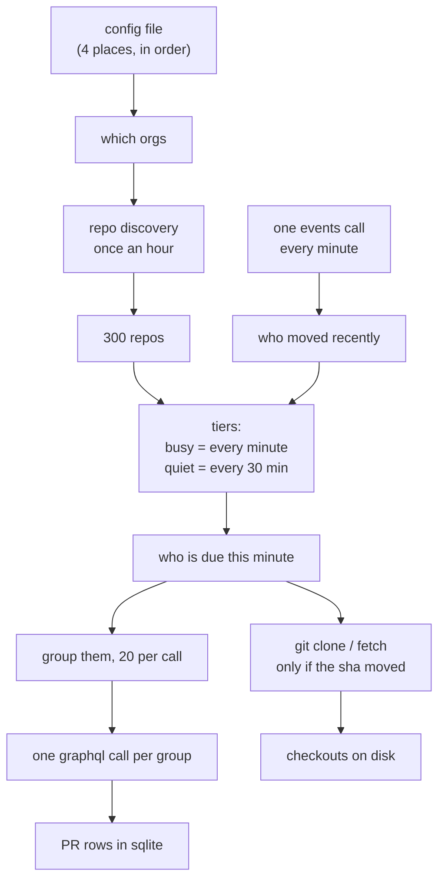
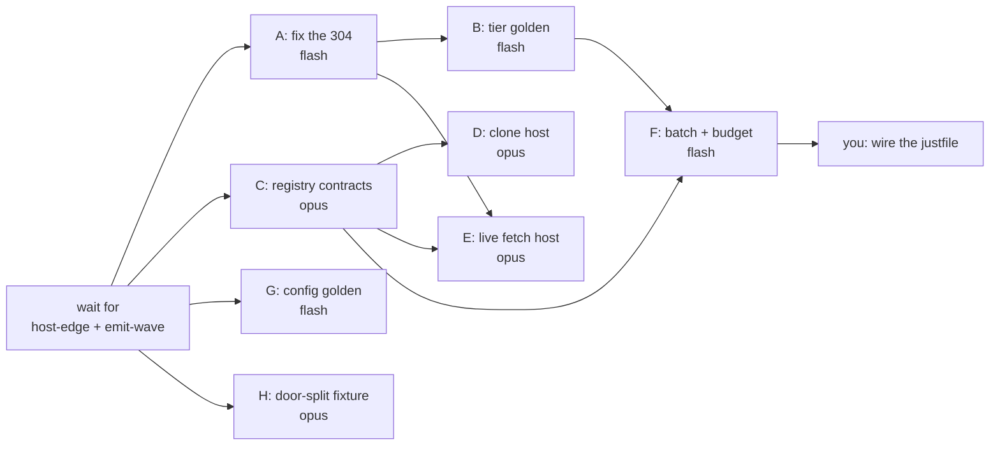

# ghcacher plan, plain words

No citations here. The other doc has those.

## TOC

1. [The one bad thing we found](#1-the-one-bad-thing-we-found)
2. [The shape of the whole thing](#2-the-shape-of-the-whole-thing)
3. [Cheap vs expensive, drawn](#3-cheap-vs-expensive-drawn)
4. [The tiers, drawn on a timeline](#4-the-tiers-drawn-on-a-timeline)
5. [Can v6 express your rust tool?](#5-can-v6-express-your-rust-tool)
6. [What we chose to run the calls](#6-what-we-chose-to-run-the-calls)
7. [The tests](#7-the-tests)
8. [Who builds what, in what order](#8-who-builds-what-in-what-order)
9. [Three things only you can answer](#9-three-things-only-you-can-answer)

---

## 1. The one bad thing we found

The etag golden we already have does not actually keep the cache. We ran it. On
the first 304, the cached row vanishes.

```
    tick 2      tick 3          tick 4
    200 OK      clock moves     304 not modified
      |             |               |
      v             v               v
  cache = [row]  cache = []      cache = []
                    ^                ^
                    |                |
              the clock wiped   nothing put it back
              it, not the 304
```

Why: the cache was written as a rule that says "the cache is whatever the last
response was". The response carries the clock tick number. New tick, old
response is gone, cache is gone with it.

The fix is two tokens. Make the cache a latch that only a 200 is allowed to
move.

```
    before:  cache  <-  response          (recomputed every tick)
    after:   cache  <+  good_response     (only moves on a 200)
```

We ran the fix through both engines. Byte identical, and the cache survives:

```
    tick 2      tick 3          tick 4        final
    200 OK      clock moves     304           
      |             |             |            
      v             v             v            
  cache = [row]  no change    no change    cache = [row]  <- survived
```

This matters more than it looks. Your whole design is "most polls are free
304s". If every 304 emptied the cache, the cache would be empty almost always.

Side note we tripped over: one spelling of the fix is accepted by the prolog
engine and rejected by the compiler. Two doors, one program, different answers.
Worth its own small test.

## 2. The shape of the whole thing



Caption: one cheap call finds out who moved, and only those repos cost anything
after that.

## 3. Cheap vs expensive, drawn

Five ways to poll 300 repos every minute. Bars are calls per hour.

```
  A  events call, then only what changed
     |=|                                              60 calls/hr

  E  graphql sweep, 100 repos per call
     |==|                                            180 calls/hr

  D  graphql sweep, 20 repos per call
     |=======|                                       900 calls/hr

  B  ask every repo about its PRs, one by one
     |==========================================|  18,000 calls/hr

  C  ask every repo about its events, one by one
     |==========================================|  18,000 calls/hr
```

The requirements note said to do B. B is 300 times more calls than A for the
same information.

Points spent per hour, out of 5000:

```
  A   ~0        (304s are free)          |
  E   180       |=|
  D   900       |=====|
  B   0 if quiet, 18000 if busy          |================================| blows past 5000
```

The catch with A, and it is a real one:

```
   GitHub says: events can be 30 seconds late.
                events can also be SIX HOURS late.
```

So "poll every minute" is honest. "never more than a minute stale" is not. Do
not let anyone write the second sentence in a doc or a test name.

Second catch: the one-call-per-org endpoint is documented as PUBLIC events only.
If your org is private, that call may see nothing. We do not know. We wrote a
tiny live test to find out before anyone builds on it.

## 4. The tiers, drawn on a timeline

This part is not a sketch. We wrote it, compiled it, and ran it.

Two repos. One busy, one quiet. Base clock ticks every minute.

```
  bucket:   100    101    102    ...    120    ...    150
            |      |      |             |             |
  busy:     X      X      X             X             X      every tick
  quiet:    .      .      .             X             X      every 30th tick
                                        ^
                                        120 and 150 divide by 30
```

Real output from the run:

```
  tick at bucket 100  ->  due: busy
  tick at bucket 101  ->  due: busy
  tick at bucket 102  ->  due: busy
  tick at bucket 120  ->  due: busy, quiet
  tick at bucket 150  ->  due: busy, quiet
```

The quiet repo produces literally nothing on ticks 100, 101, 102. Not a skipped
row. No row at all.

The knobs, all of them rows in the database, none of them code:

```
  tier_rule("hot",   idle 0 to 60,      run every 1 tick)
  tier_rule("cold",  idle 60 to 100000, run every 30 ticks)
  batch_size(20)
```

Want a third tier? Post a row. Want hot to mean "idle under 10 minutes"? Change
a number in a row. Want cold every 5 minutes instead of 30? Change a number in a
row. Nothing recompiles.

One trap, and we wrote a test for it: if two tier rules overlap, a repo lands in
both tiers and gets called twice. The bands have to touch without overlapping.

## 5. Can v6 express your rust tool?

We went through the README line by line. 24 capabilities.

```
  can do it, just needs a test written     #############  13
  can do it, needs a design decision       ######          6
  genuinely missing                        ##              2
  correctly not our job (OS/library)       ###             3
```

The two genuinely missing things:

**1. Sleeping when the rate pool runs low.** We can DERIVE "we are over budget"
and refuse to make calls that tick. We cannot make a call wait N seconds and
then get longer each time. Our suggestion: do not build the sleep. A tick that
refuses to make calls costs nothing anyway, and the clock keeps ticking, so the
pause is free and self-clearing. This is a scope cut from your tool and you
should say yes or no to it.

**2. A knob for how many git processes run at once.** Your tool caps it at 8.
Ours runs them one at a time, always, with no knob. Stricter, but 300 clones one
at a time is minutes. This is a one-operator change in the runtime, not a
language change.

Some nice surprises where your tool's features are already ruled ground here:

```
  SSE with Last-Event-ID backfill   ->  already ruled: a late reader reads the
                                        stored rows then joins the live stream.
                                        That IS backfill.

  /subscribe + heartbeat TTL       ->  already ruled: things go cold when the
                                        last reader leaves. TTL expiry is that.

  change_log append-only            ->  already a thing: a "log keep(all)" rel.
                                        The etag golden already uses one.

  20 repos per graphql call         ->  the host layer already folds several
                                        questions into one subprocess. And the
                                        query text gets built by a SQL
                                        group_concat, not by string code.
```

That last one is the prettiest bit of the plan. The list of repos to put in one
GraphQL call is built by a database aggregate over the rows that are due. We ran
it:

```
  bucket 120, batch 0  ->  "org/cold org/hot"
```

## 6. What we chose to run the calls

Four options for making the actual HTTP call. Picked `gh api`.

```
  curl --etag-save          NO   curl keeps the etag in a file it owns.
                                 We want the etag in the database, in a row.

  curl -H "If-None-Match"   NO   good shape, but we would have to put your
                                 GitHub token into a template string, and
                                 template strings show up in logs.

  gh api --cache 60m        NO   that is a timer, not a question. It hands you
                                 stale data because a clock has not run out.
                                 We want GitHub to SAY "still current".

  gh api -H "If-None-Match" YES  we own the etag, gh owns the login. The token
                                 never touches our process. Same as your tool.

  a node http client        NO   your tool's own security note says no direct
                                 HTTP client. Adopting one makes us worse.
```

For git:

```
  first time     ->  gh repo clone            (same as your tool)
  after that     ->  git fetch, but ONLY if the sha moved
  PR heads       ->  git fetch refs/pull/*    (costs zero API budget)
  smaller clones ->  --filter=blob:none, available, but OFF by default
                     because it makes file reads secretly hit the network
```

The "only if the sha moved" part needs no comparison code. We mark the wanted
sha as a freshness field, which means the engine already knows that asking the
same question again is the same question and does not run the process. Your
tool does this with an explicit DB check. Here it is one word in a table.

## 7. The tests

Six hermetic goldens plus one live probe. Hermetic means no network, no shell,
no wall clock. We feed a fake schedule and byte-compare two engines.

```
  G1  the 304 test        304 = zero change, cache survives, 200 refreshes
  G2  the tier test       busy fires every tick, quiet fires every 30th,
                          AND a quiet repo costs ZERO database statements
  G3  the batch test      only changed repos go in a batch
  G4  the budget test     300 repos worst case stays under 5000/hr, as ROWS
  G5  the clone test      unchanged sha = the process never starts
  G6  the config test     the search order works, and removing a file promotes
                          the next one down

  L1  the live probe      the four things no document could tell us
```

Every one of them ships with a sabotage note in its header: what to break to
make it fail, verified broken once. For G1 that note already exists, because we
broke it on purpose during the research and wrote down the red output.

The G2 statement count is the strict one you asked for. Not "the answer looks
right at the end". Actually counting SQL statements on a tick where the quiet
repo is not due, and proving the number is the same as if the quiet repo did not
exist at all.

The live probe is gated behind an env var, runs in under a second, and is NOT in
green-all. It exists to answer four things:

```
  1. does graphql honor etags at all?     (nobody documents this)
  2. what does a 20-repo query really cost? (we predict 1 point)
  3. can the org-wide events call see private repos?
  4. what exit code does gh give on a 304?
```

Point 3 is the one that could change the design. Run it first.

## 8. Who builds what, in what order

Two other lanes are in flight touching the same ground. Nothing starts until
both land.



Eight lanes, none of them share a file. Four are mechanical enough for a flash
lane. Four need judgment and get opus.

The mechanical ones are mechanical because this doc already contains the working
program text and the measured output. A flash lane copies and runs, it does not
invent.

Nobody but you touches the justfile, ARCH, or rulings. Six new goldens means six
new recipes, and that is one commit at the end instead of six fights.

## 9. Three things only you can answer

```
  1. Git processes: leave them one-at-a-time (safe, slow first sweep),
     or add a cap-at-N knob like your rust tool has?

  2. Rate limit back-off: is "refuse to make calls this tick" good enough,
     instead of "sleep, and sleep longer each time"?
     We think yes. It is your call.

  3. Is the target org private?
     If yes, the cheap one-call-per-org trick may not work and we fall back
     to a call per repo. This changes the whole cost table.
```

Four smaller ones: how to read TOML (add a small binary, or write awk), whether
you want small clones on by default, whether the two-doors-disagree bug gets
fixed in this arc or its own, and whether the stdout JSON stream needs a
construct that is currently refused.
