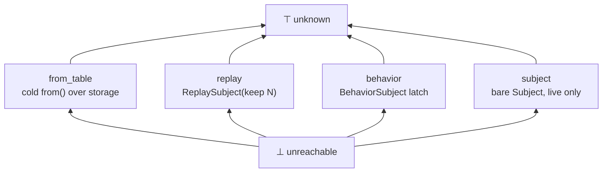
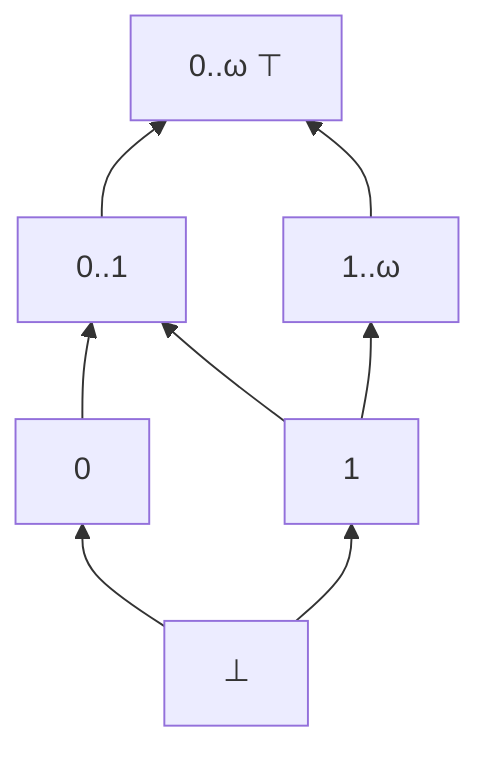
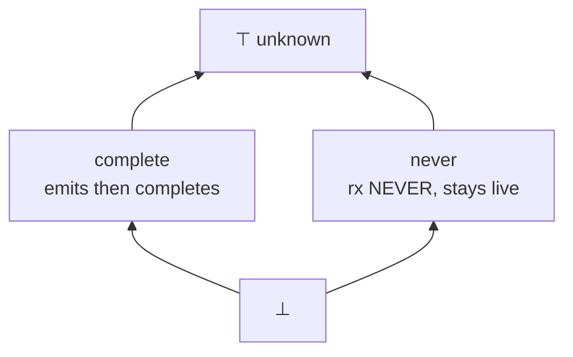

# Marble types: three per-rel lattices, priced for cheap extension

Slots into the fuse contract as its own section when the duel words land.
Design driver, user-set 2026-08-04: minimize the cost of extending the model
later; never let today's inference lock out a pending ruling.

## TOC

1. [The three axes, drawn](#1-the-three-axes-drawn)
2. [Extension laws](#2-extension-laws)
3. [Storage spelling: EAV rows](#3-storage-spelling-eav-rows)
4. [Transfer function shape](#4-transfer-function-shape)
5. [Worked example with rx lowering](#5-worked-example-with-rx-lowering)
6. [Rust consumer mapping](#6-rust-consumer-mapping)
7. [Contradiction audit vs standing rulings and doors](#7-contradiction-audit)
8. [Open question resolved: live_event needs no 5th value](#8-live_event-needs-no-5th-value)
9. [What stays out, on purpose](#9-what-stays-out-on-purpose)

## 1. The three axes, drawn

Every rel gets one value per axis, inferred by abstract interpretation over
the closed operator set, same fixpoint shape as the subscribe cone.

Axis `subject`: which rx subject class a late subscriber sees. Flat lattice;
any two distinct classes join to unknown.



Axis `cardinality`: rows per key per tick, as a six-point interval lattice.
No parameter N anywhere; keep(count(N)) stays a declaration, never a lattice
point, so ascending chains are finite and the fixpoint needs no widening.



Axis `completion`: rx completion behavior. Flat lattice.



Vocabulary check: marble (rx), subject/replay/behavior/from (rx API words),
cardinality (SQL), complete/never (rx). Zero invented words.

## 2. Extension laws

| law | statement | what it buys |
|---|---|---|
| top-default | every construct absent from the transfer table maps to ⊤ on every axis | a new operator costs zero rows for soundness; precision rows are added only when someone wants them |
| refinement-only | later work may move a rel down a lattice (more precise), never to an incomparable point that changes consumer behavior | emitted code survives model growth |
| ancestor-correct consumers | every consumer (rust lowering first) must be correct at ⊤ and at every value above the one it optimizes for | refinement is always pure optimization: Vec narrows to Option, a kept task becomes droppable; correctness never moves |
| finite lattices | all three lattices are finite and parameter-free | SCC fixpoint terminates by construction; the widening wall from the 2026-08-03 feasibility sketch dissolves |
| new flat point | extending a flat axis = adding one incomparable point; existing joins are untouched | until(F) lands in completion later without touching complete/never programs |

## 3. Storage spelling: EAV rows

```prolog
% marble_fact(RelRef, Axis, Value)
marble_fact(rel(commit_note), subject,     replay).
marble_fact(rel(commit_note), cardinality, interval(0, omega)).
marble_fact(rel(commit_note), completion,  never).
```

Triple rows, one per axis, over a fixed 3-arity record:

| shape | cost of a 4th axis | verdict |
|---|---|---|
| `marble_fact(Ref, sub(S), card(C), fin(F))` | arity change; every caller and every stored row churns | rejected |
| `marble_fact(Ref, Axis, Value)` | new rows only; absent axis reads as ⊤ by the top-default law | chosen |

An unqueried axis is simply absent, and absence means ⊤, so old programs and
old fixtures never need backfill when an axis is born.

## 4. Transfer function shape

```prolog
% marble_transfer(Construct, InMarbles, OutMarble)
% precise rows first, one per construct the arc has priced ...
marble_transfer(latest_sample, _, marble(behavior, interval(0,1), never)).
% ... catch-all LAST: the top-default law as code. Never delete this clause.
marble_transfer(_Construct, _In, marble(top, interval(0,omega), top)).
```

SCC rule: iterate transfer over the strongly connected component to fixpoint,
joining per axis. Finite lattices make this terminate; no widening operator
exists in this design.

## 5. Worked example with rx lowering

```dl6
rel commit_note(path, note) keep(count(100)).
commit_note(path, note) <+ live_event(path, note).
```

Inferred marbles and the lowering each one names:

| axis | value | rx lowering (the ruled spelling) |
|---|---|---|
| subject | replay | `concat(from(storedRows), liveRows$)` per edge_before_first_subscribe: keep table IS the replay |
| cardinality | 0..ω | one ingress transaction per tick is a LIST of events (tick_boundary), so a deliberate batch can land many rows in one tick |
| completion | never | `liveRows$` never completes; a files_at(rev, ...) pinned feed would infer complete instead |

Full lowering of the subscribe surface:

```ts
const commitNote$ = defer(() =>
  concat(
    from(readKeepTable("commit_note")),   // replay: bounded by keep(count(100))
    liveArrivals$.pipe(
      filter((arrivalRow) => arrivalRow.rel === "commit_note"),
    ),
  ),
);
```

## 6. Rust consumer mapping

The lowering reads exactly the three axes; the rightmost column is the
ancestor-correct fallback that ⊤ always gets.

| axis value | optimized rust | ⊤ fallback |
|---|---|---|
| cardinality 0..1 / 1 | `Option<Row>` / `Row` field | `Vec<Row>` |
| subject from_table / replay / behavior | boot read of storage before stream attach | boot read (safe superset) |
| subject subject | skip the boot read | boot read |
| completion complete | drop the task after settle | keep the task alive |
| completion never / ⊤ | keep the task alive | keep the task alive |

## 7. Contradiction audit

Every standing ruling and pending word, checked against this design.

| ruling / door | interaction | lockout? |
|---|---|---|
| tick_boundary (ingress transaction list) | fixes ingress cardinality to 0..ω with 0..1 only under a one()-family decl | no; the lattice states what the ruling already says |
| one_pick_order + one_admission_no_lockout | first-wins AND zip-takeover both yield cardinality ≤1 per key per tick; the marble value is identical under either fold | no; duel words stay free |
| one_decl_surface (decl-only properties) | decls are inference INPUTS; marble rows are outputs; dependency is one-directional | no cycle |
| edge_before_first_subscribe | is literally the replay transfer row | agreement |
| event_ingress_surface (live_event bind) | live_event rels take subject/replay off their retention decl like any arrival path | no new value needed (§8) |
| subscribed_reset_pole (warm/cold share) | refcount lifecycle is a DIFFERENT fact from what a subscriber sees; kept out as a candidate future axis, cheap under EAV | no |
| zero_query_semantics | marbles are static per-rel facts, computed regardless of subscription | orthogonal |
| keyed-vs-log revisit (standing dislike) | the algebra axis (idempotence table, doors doc §6) is NOT defined here; defining it now would front-run the revisit | deliberately parked |
| door 3 Esterel combine (anti-lazy) | if a declared-combine ever lands it is a new construct row; top-default covers it meanwhile | no |
| host-edge ruling (pending) | host rels currently infer ⊤ across the board; the ruling can only refine them | no |
| fold-wall fix (emit_ts.pl) | changes evaluation order inside a tick, touches no axis definition | orthogonal |

## 8. live_event needs no 5th value

The open question from 2026-08-04 morning. Resolution: the subject axis reads
the RETENTION DECLARATION, never the ingress transport. A live_event-fed rel
with keep(count(N)) infers replay; with a latch shape it infers behavior; with
no retention it infers subject. The transport (POST /arrivals, file watch,
clock bind) is invisible to the axis, which is exactly the
event_ingress_surface ruling: live_event rows type-check like any arrival.

## 9. What stays out, on purpose

| parked thing | wakes when | why parked |
|---|---|---|
| algebra axis (idempotent / monoid / last-write, doors §6 table) | keyed-vs-log revisit | that revisit is user-owned; an axis now would pre-decide it |
| share-reset axis (warm/cold) | if the rust lowering ever needs it | subscribed_reset_pole already carries it as a per-rel decl |
| until(F) completion point | until(F) formula presentation arc | new flat point, zero cost later by the new-flat-point law |
| finite(N) as a lattice value | never | the cliff named in the feasibility sketch; N lives in decls |
