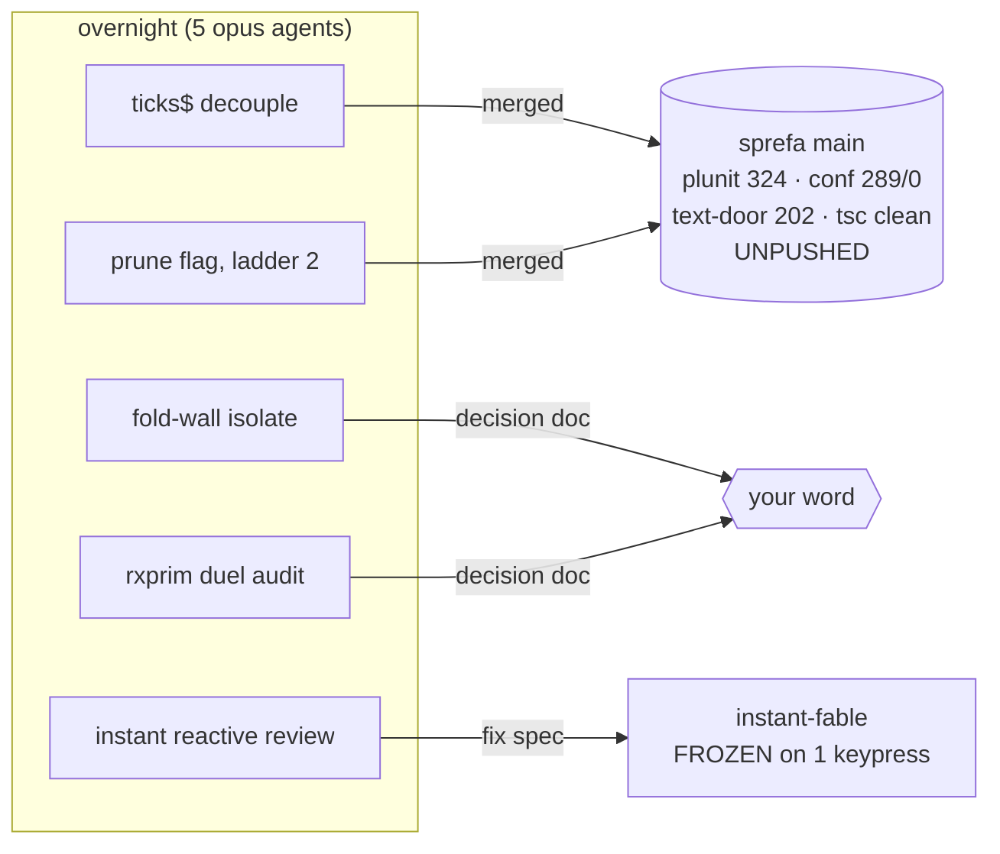
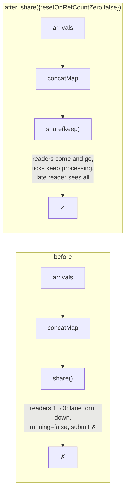
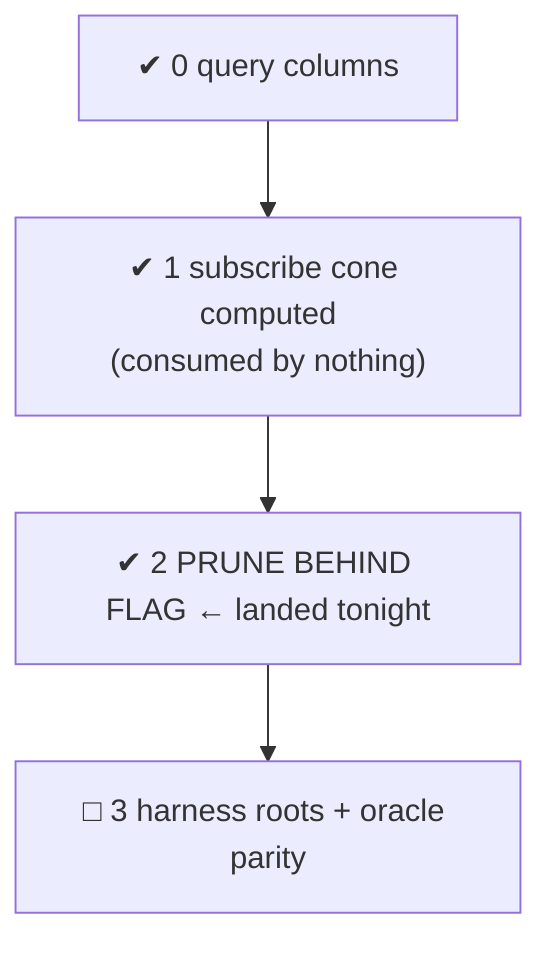
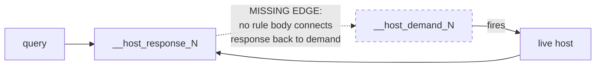
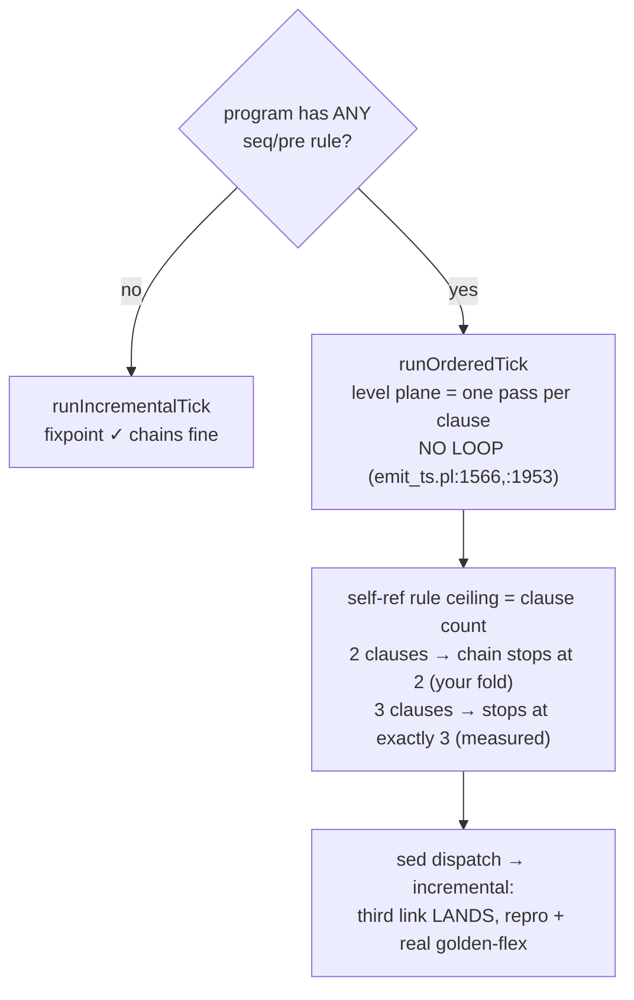
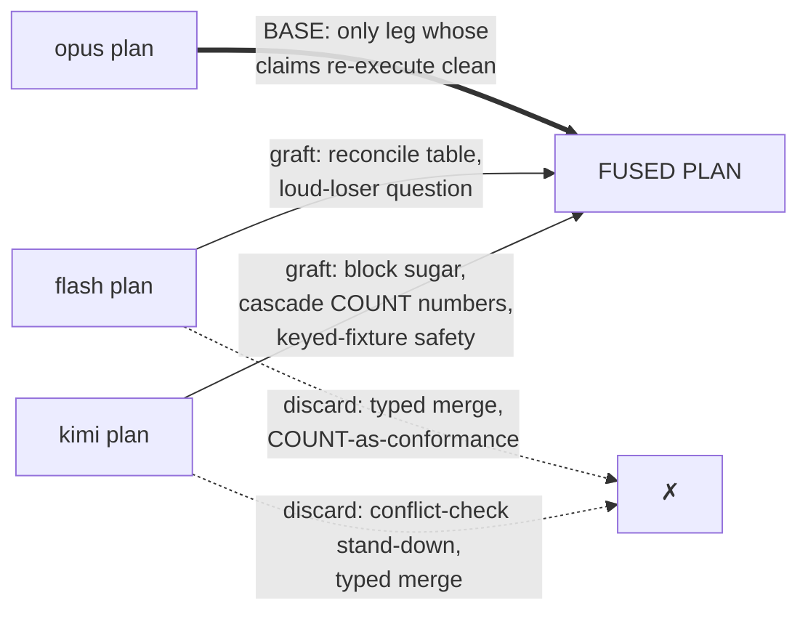
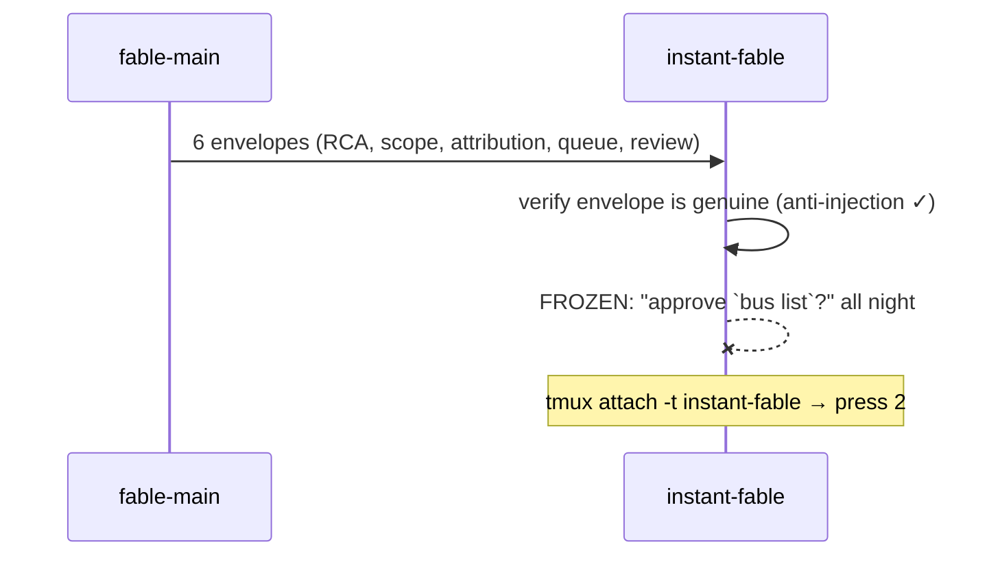

# Good morning. While you slept: 5 agents ran, 2 fixes merged, 4 things need your word.

Your four calls today, cheapest first:

| # | call | where |
|---|---|---|
| 1 | `tmux attach -t instant-fable`, press 2 | unfreezes instant entirely |
| 2 | duel words: `throttle(1)` vs `zip(tick)`; block sugar now or later | §5 |
| 3 | GO on the fold-wall fix lane | §4 |
| 4 | host-edge ruling (blocks flag-on for host programs) | §3 |

Then: push + tag whenever you like; main is the greenest it has ever been.

---

## 1. Merged: engine survives losing its last viewer

You walk away from the dashboard, the last subscriber drops, and before
tonight the engine tore itself down; submits made while nobody watched were
refused with "engine is not running".

Kept on purpose: submit before the FIRST-ever subscribe still errors (the lane
has never connected; the batch would vanish). Eager-connect = separate card.

## 2. Merged: ladder step 2, the engine can skip unasked-for work

| `SPREFA_TSV2_SUBSCRIBE_PRUNE` | query-bearing program | zero-query program |
|---|---|---|
| **off** (default) | identical BY REFERENCE + text-door 202/202 | derives as today |
| **on** | subscribed rels byte-equal; unsubscribed rels `[]`, 0 statements | derives NOTHING; ingest still lands (keep()=replay ruling) |

Bonus: typecheck had been red for every lane (202 errors, interface field
never emitted). Fixed here; first clean tsc since the rename.

## 3. Your ruling: the host edge the cone cannot see

Replay fixtures inject responses directly, so every gate is green and the hole
is invisible. A LIVE host with the flag on: demand never derives, host never
runs, the subscribed rel is silently empty. Standing rule until you rule: flag
stays OFF for host-bearing programs. The fix widens the oracle-shared constant
AND un-prunes the only pruning fixture, so it wants your word, twice.

## 4. Your go: fold wall root-caused (1a and 1b were one defect)

Side finds: MODE PARITY is vacuous for ordered programs (mode emitted, never
read: the gate compares a run to itself), and the naive door has its own
one-round wall. Fix site shares emit_ts.pl with the duel's one() change, so
sequence the two lanes. Repro + ledger: sprefa-lab-foldwall/FOLDWALL.md.

## 5. Your two words: duel verdict

Opus's key find: one `TriggerKind` test at lower.pl:1560-1566 is the fork
between arm-order (concat, today's bug) and arrival-order (merge, your
ruling). Widening it closes one_pick_order for the new construct AND legacy
programs, oracle untouched.

Word 1: reserved door name, `throttle(1)` (opus) vs `zip(tick)` (shelf).
Word 2: block sugar in the same wave, or property first.

## 6. Instant: review delivered, courier frozen

REVIEW-reactive.md, 12 findings, the sharp ones: every waterfall bar click
resurrects a dead lane (3rd call site; boot replay is a 4th); your brush drag
is wiped every 8s by refreshRogue's store write; after the first session
loads, later tick marks never paint (`bump(1)` hits React's Object.is
bailout); one failed `list_sessions` downgrades liveness until reload; two of
three mail views have no live feed at all.

## 7. Loose ends

| yours today | nobody's yet | standing |
|---|---|---|
| push + tag | roundtrip rewrites 126 dl_view files (stale printer corpus) | rxprim x3 + foldwall worktrees kept for your read, then labs-die |
| calls 1-4 above | flash-prolog fate | monitor still watching instant-fable |
| | 9 unmerged branches (20260803.9 save) | |
