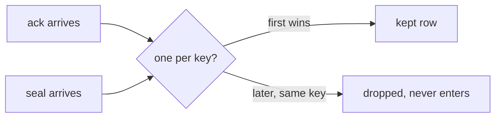
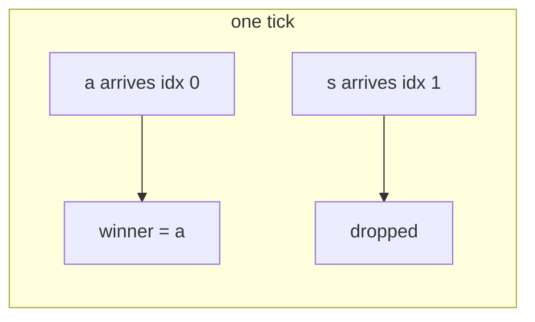
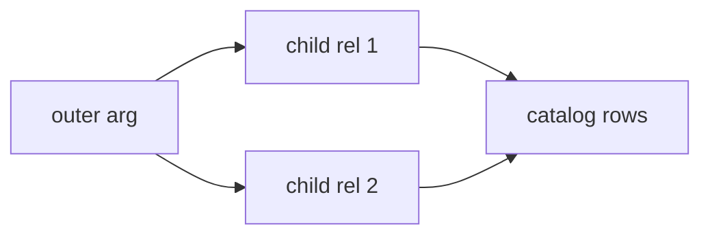
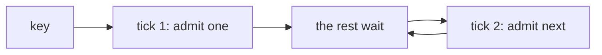
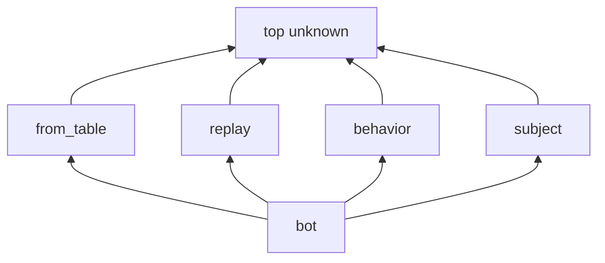

# rxprim fused contract, plain picture

Docs only. One file that ships "pick the first of these" for a key.

## TOC

1. [The job](#1-the-job)
2. [Three stages](#2-three-stages)
3. [One() on a head](#3-one-on-a-head)
4. [The doors agree](#4-the-doors-agree)
5. [The block](#5-the-block)
6. [The typed tag](#6-the-typed-tag)
7. [Reserved door](#7-reserved-door)
8. [Marble lattices](#8-marble-lattices)

## 1. The job

You have two things that can fill the same slot. You want the one that
arrived first in a tick, and nobody else after it. That is `one()`.



First in is kept. The rest vanish. The key stays shut for the whole run.

## 2. Three stages

| stage | what | does what |
| --- | --- | --- |
| S1 | `one(1)` on a rel | keeps first per key, both doors agree |
| S2 | merge block | groups arms into a head; the lowered flat form is the real thing, braces later |
| S3 | enum tag column | names an enum in a column type, checker only, no run-time change |

## 3. One() on a head

```dl
rel dispatch_first(dispatch_id: int, note_tag: text) log keep(all) one(1).
dispatch_first(DispatchId, 'acked')  <+ dispatch_ack(DispatchId).
dispatch_first(SealedId, 'sealed')   <+ dispatch_seal(SealedId).
```

Lowered:

```ts
merge(ack$, seal$).pipe(
  groupBy((row) => row.dispatchId),
  mergeMap((group) => group.pipe(take(1))),
);
```

The group never closes, so `take(1)` shuts the key for the run. State equals
history.

## 4. The doors agree

Two engines run the same program. They used to pick different winners when
the arms were ordered one way and the arrivals another. Now both read the
arrival order, not the arm order.



Flipping the source lines changes nothing. The winner follows arrival order
on both engines.

## 5. The block

Grouping is real. The block's lowered form is the construct: flat rels with
long names, catalog rows tying them, and any outer arg pushed into every
child as a leading key column. The brace surface is a later sugar wave, not
today's work.



Today you write the flat arms by hand. The block wrapper is sugar that comes
later.

## 6. The typed tag

The arm that won leaves its name in a tag column. That tag is typed by an
enum, so a wrong variant is refused at compile time and the arm set must
cover every variant.

```dl
rel gate_source(pre_commit() ; timer()).
rel gate_fire(source: gate_source, repo: text) log keep(all).
gate_fire('pre_commit', Repo) <+ pre_commit(Repo).
gate_fire('timer', Repo)      <+ latest(armed(Repo)), interval(1, Repo).
```

The tag is text at rest, a union in the type. Bytes do not change between
the plain and the typed form.

## 7. Reserved door

`one()` keeps the first forever. A second, sound fold exists: admit one per
key per tick, let the rest WAIT for the next tick, drop nothing. That is
everything first-wins is not, and nothing in first-wins closes it off.



Drop-flavored words are rejected. It is concat-family territory. The exact
spelling is still open, priced later, not invented here.

## 8. Marble lattices

Every rel gets one value on three axes, worked out by abstract
interpretation in the fixpoint.



Subject: which late subscriber class. Cardinality: rows per key per tick as
an interval (`0`, `1`, `0..1`, `1..many`, `0..many`). Completion: `complete`
or `never` or unknown.

Three laws hold. Absent means top (cheap to grow). Later work only refines,
never moves sideways. Every consumer must work at top and above the value it
optimizes for. Lattices are finite, so the fixpoint always ends.

Under `one()` a key is at most one row per tick. The queued door gives the
same marble value. Either fold leaves the lattice unchanged.
