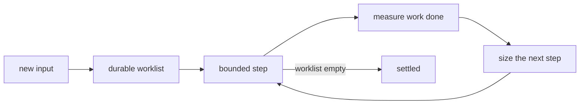

# Fixpoint budget: constant throughput, never more than needed

## TOC
- The problem in one table
- What the machinery already has
- Prior art: V8, k8s, and what each actually guarantees
- The design
- Build vs buy for the slicing mechanism
- What a budget cannot promise
- Build order
- Open questions for Chris

## The problem in one table

| today | consequence |
|---|---|
| `drain_cap(100)` counts TICKS (`conformance/engine.pl:92`, `tickLoop.ts:43`) | a tick deriving 10 rows and a tick deriving 10M rows both count 1 |
| the cap throws (`engine.pl:613`, `tickLoop.ts:51`) | a legitimate deep graph is refused rather than paced |
| recursive level results never reach the next-frontier table (failure-modes 41) | the worklist is destroyed at tick end, so the drain never runs at all |

chain@10k needs 2580 semi-naive rounds. A 100-tick cap refuses it. A cap of 5000
would admit it and also admit one tick eating a core for ten seconds. Counting
ticks measures the wrong thing.

## What the machinery already has

| piece | where | fit for a budget |
|---|---|---|
| durable worklist | `__frontier_<rel>` / `__next_frontier_<rel>` tables | already survives ticks and process restart, being SQLite |
| worklist admission | `stageEvents` (`1_incremental.ts:118`) | every derived row enters through one function |
| carry signal | `promoteFrontiers` (`1_incremental.ts:1070`) | one boolean, computed from worklist emptiness |
| loop driver | `TickFold` (`tickLoop.ts:38`) | the one place a budget decision belongs |
| per-rule measurement | `RuntimeTrace.rule(ruleId, rows, wallMs)` (`runtime/trace.ts`) | rows and ms per statement, standardized 2026-08-05 |
| statement counter | `sprefa-store/js/src/engine/counter.ts` | global resettable count, already the N+1 tripwire |
| process-level caps precedent | v5 `src/budget.rs`, `apply_daemon_budget` | the "nothing seizes the machine" law, one layer down |

Nothing above needs inventing. The budget is a policy over parts that exist.

## Prior art: V8, k8s, and what each actually guarantees

### V8 incremental marking

| mechanism | what it does |
|---|---|
| mark worklist | a durable stack of grey objects; a step pops a bounded number |
| step budget | each step runs for a time slice or a byte quota, then returns to the mutator |
| write barrier | mutator writes during a pause re-enter the worklist, so slicing cannot lose work |
| adaptive sizing | step size scales with allocation rate, so marking finishes before the heap limit |
| concurrent marking | background threads drain the worklist while the mutator runs |

The guarantee is bounded pause per step. Total completion time is an estimate,
adjusted every step from measured progress against measured allocation.

### k8s

| mechanism | what it does |
|---|---|
| requests and limits | a floor that is reserved and a ceiling that is enforced |
| QoS classes | who gets evicted first when the node is short |
| controller workqueue | items stay queued until acked; rate limiter plus exponential backoff per item |
| resync period | a periodic full pass catching anything the event stream lost |

The guarantee is the ceiling and the queue's at-least-once delivery. Convergence
time is explicitly eventual.

### The shared shape



Both systems pair a durable worklist with a bounded step and adaptive sizing.
Neither promises a completion deadline. Both promise a ceiling per slice.

## The design

### 1. Carry becomes worklist emptiness, and the worklist stops being destroyed

The enabling fix from failure-modes 41: level results stage into next-frontier as
well as frontier, so `promoteFrontiers` mints carry when rounds remain. Without
this every budget is dead code, because the loop already believes it converged.

### 2. The cap becomes a work budget, measured in three currencies

| currency | source | why it is in the list |
|---|---|---|
| wall ms per tick | `RuntimeTrace.rule` already sums it | the latency the caller feels |
| rows derived per tick | `stageEvents` counts them | the memory and IO the tick creates |
| statements per tick | `stmt_counter` | the SQLite work, already the N+1 tripwire's unit |

A tick runs semi-naive rounds until any currency crosses its ceiling, then
returns with carry set. The next tick resumes from the same worklist tables.

```
tick(seam, arrivals, budget) ->
  applyArrivals
  rounds = 0
  loop:
    applyOneRound            // the existing level pass
    rounds += 1
    if worklist empty       -> settled, carry = false, break
    if budget.spent(ms, rows, statements) -> carry = true, break
  promoteFrontiers
```

### 3. Floor and ceiling, borrowed from k8s

| knob | meaning | default proposal |
|---|---|---|
| floor | minimum rounds per tick, so a starved program still advances | 1 round |
| ceiling | maximum work per tick | 50ms, or 100k rows, or 5k statements, whichever first |
| livelock guard | ticks with carry set and zero new rows | 3 in a row is a defect, refuse loudly |

The floor is what makes progress a guarantee rather than a hope. The livelock
guard replaces `drain_cap` as the "something is wrong" signal, and it fires on
absence of progress instead of on the amount of legitimate work.

### 4. Adaptive sizing, borrowed from V8

Measured rows-per-ms from the previous round predicts how many rounds fit in the
remaining budget. A round that derives 2M rows at 40M rows/sec costs 50ms, so the
next tick takes one round; a round deriving 400 rows takes microseconds and the
tick can afford thousands. This is the same feedback V8 runs against allocation
rate, using numbers the telemetry envelope already emits.

### 5. Convergence becomes observable

A rel is `settled` or `draining`, and a reader is entitled to know which. Without
this, a query mid-fixpoint returns a partial closure that looks complete, which
is the same class of silent wrongness as failure-modes 41 itself.

| surface | addition |
|---|---|
| tick log line | `settled: bool`, plus `rounds` and `budget_spent` |
| `/idb/:rel` response | the rel's settled state at read time |
| `/stats` | count of draining rels, oldest draining tick |

## Build vs buy for the slicing mechanism

The policy is ours; the yielding mechanism is not something to hand-roll.

| candidate | fit | verdict |
|---|---|---|
| rxjs `asyncScheduler` + `observeOn` | already the runtime's idiom, the tick loop is rx | **use for yielding between ticks** |
| Node `setImmediate` | yields to the event loop, no dependency | the primitive `asyncScheduler` uses |
| `scheduler.postTask` (Prioritized Task Scheduling) | browser API, priorities built in | not available in Node 22 |
| `p-limit` / `bottleneck` | concurrency and rate limiting for async calls | wrong shape: caps parallel calls, we need work slicing inside one call |
| `node:worker_threads` | the V8 concurrent-marking analogue | a later arc; SQLite connection affinity has to be settled first |

The measurement side is bought too: `perf_hooks.performance.now` and the existing
`RuntimeTrace`, with no new timing code.

## What a budget cannot promise

State it plainly, since the estimate-versus-guarantee gap is the whole risk.

| promised | not promised |
|---|---|
| per-tick ceiling on ms, rows, statements | a completion deadline for a closure |
| progress every tick, given the floor | that a reader sees a complete closure |
| termination for a monotone program, since the derived set is finite | termination under a program whose rules are not stratified |
| loud refusal on zero-progress ticks | detection of a program that is merely slow rather than stuck |

The completion estimate is a projection from measured rows-per-ms over the rounds
run so far. It is a forecast and should be labelled one wherever it is surfaced.

## Build order

| step | deliverable | proven by |
|---|---|---|
| 1 | level results write next-frontier; carry mints for recursion | the batched two-hop fixture from failure-modes 41, failing pre-fix |
| 2 | `TickFold` takes a budget object, floor 1 round, ceiling in ms | a deep-chain program completes across many ticks with no `drain_overflow` |
| 3 | rows and statements currencies added | COUNT test: rounds per tick track the ceiling as the ceiling moves |
| 4 | livelock guard replaces `drain_cap` | a rigged zero-progress program refuses within 3 ticks |
| 5 | settled/draining on the tick log and `/idb/:rel` | a read mid-drain reports draining, a read after reports settled |
| 6 | adaptive sizing from measured rows-per-ms | tick wall time stays inside the ceiling across a 100x change in round cost |

Steps 1 and 2 are the ones that unblock the dl6 benchmark row.

## Open questions for Chris

| question | why it needs you |
|---|---|
| default ceiling: 50ms, or something tied to the arrival cadence | it is a product feel decision, not a measurement |
| does a query mid-drain block until settled, or return partial with a flag | blocking is simpler to reason about and can stall a caller indefinitely |
| per-program budgets, or one global budget shared across loaded programs | the k8s QoS question: who yields when two programs are both draining |
| does the drain run on a worker thread later | changes the SQLite connection story |
