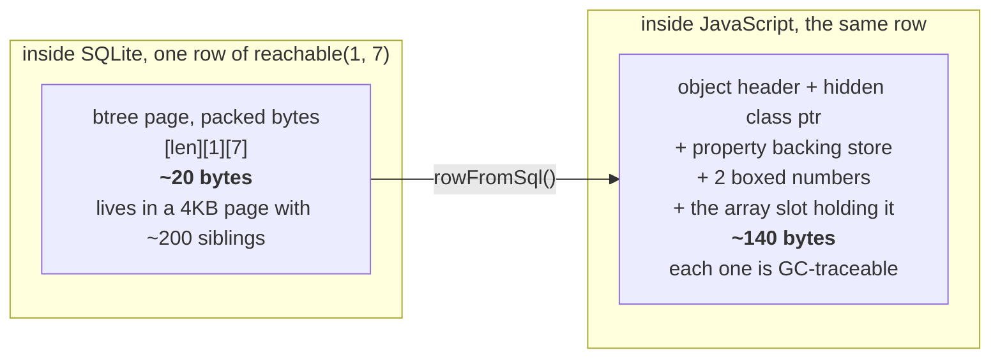
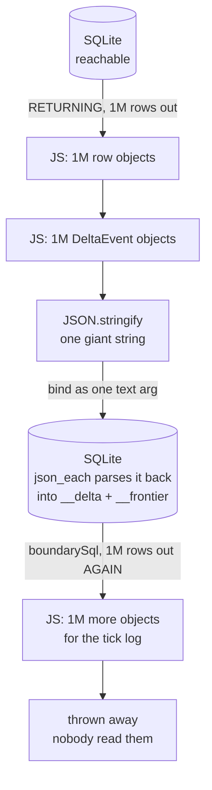
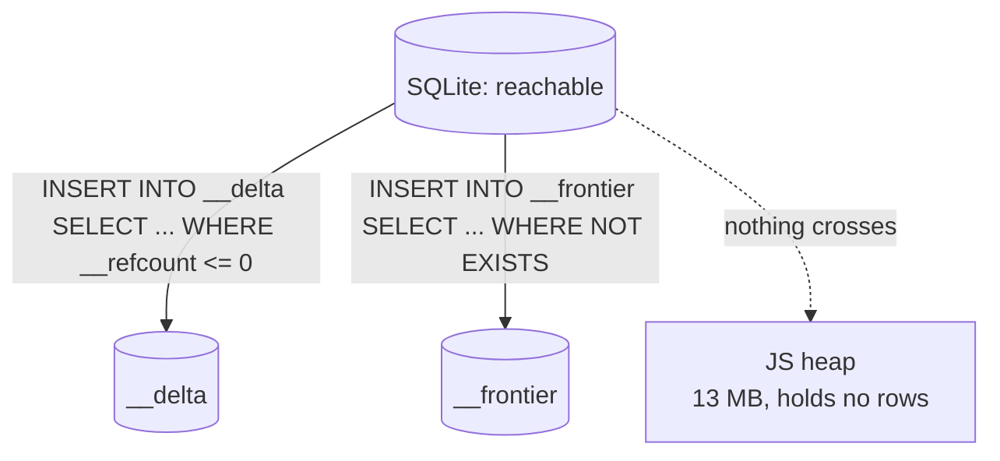
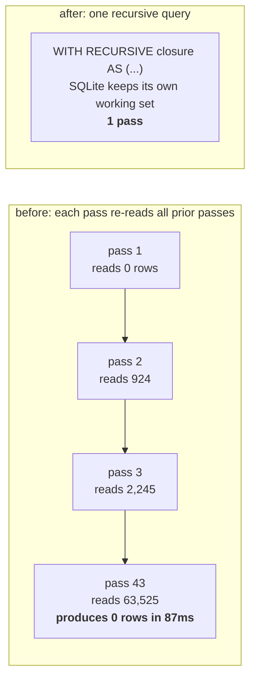
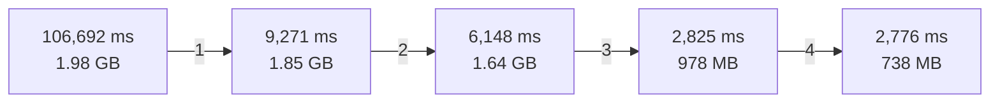
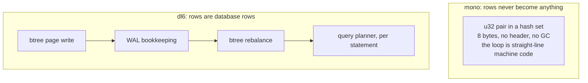

# dl6 seam physics: where 106 seconds went

The 2026-08-06 perf arc on `v6/labs/exec_shootout/dl6`, drawn. One workload
throughout: `grid_10000`, 3,960 edges, 1,069,200 derived rows, checksum
`9d7239568960d6a8` at every step.

## TOC
- [1. What one row physically is](#1-what-one-row-physically-is)
- [2. Where the rows went, before](#2-where-the-rows-went-before)
- [3. Where they go now](#3-where-they-go-now)
- [4. The closure loop](#4-the-closure-loop)
- [5. The four changes](#5-the-four-changes)
- [6. Why rust is still ahead](#6-why-rust-is-still-ahead)
- [7. Receipts](#7-receipts)
- [8. What stayed open](#8-what-stayed-open)

## 1. What one row physically is

1,069,200 rows: **21 MB** as pages, **150 MB** as objects, and the garbage
collector walks all 1,069,200 of them repeatedly.

Measured phase by phase (`v6/labs/exec_shootout/dl6/rssprobe.mjs`):

| phase | peak RSS | JS heap |
|---|---|---|
| schema created | 120 MB | 12 MB |
| edges loaded | 123 MB | 13 MB |
| closure computed (recursive CTE) | 136 MB | 13 MB |
| delta staged in SQL | 177 MB | 13 MB |
| **head + frontier written, all in SQLite** | **247 MB** | **13 MB** |
| + final select pulls 1,069,200 rows into JS | 369 MB | 98 MB |
| + boundary read pulls 1,069,200 rows into JS | 518 MB | 166 MB |

SQLite holds the whole closure across five tables in 247 MB. Everything above
that line is rows becoming JavaScript objects.

## 2. Where the rows went, before

Every derived row left SQLite, became two JS objects, became text, got parsed
back in, then came out a second time to be discarded.

## 3. Where they go now

The rows stay in SQLite's arena. The same predicates that decide what to delete
and insert also decide what to stage: retractions from `"__refcount" <= 0`
before the delete, additions from the `NOT EXISTS` over the support table
before the insert.

`level_ref_count_sql` (`v6/prolog/lower.pl`) emits nine statements where it
emitted five, and both `RETURNING` clauses are gone.

## 4. The closure loop

The frontier accumulated and the emitted query filtered it with
`_phase >= 0`, which admits every row ever staged. Measured per pass on a
22x22 grid:

| pass | new rows | `__frontier_reachable` | ms |
|---|---|---|---|
| 1 | 924 | 0 | 1.1 |
| 10 | 3,069 | 19,206 | 30.1 |
| 43 | **0** | 63,525 | **87.6** |

The emitter already wrote the closure as a `WITH RECURSIVE` CTE in
`supportSql`. `retractionGuardSql` only let it run when a delta carried a
retraction, so a purely additive tick fell through to the loop.

## 5. The four changes

| # | change | commit | what stopped happening |
|---|---|---|---|
| 1 | recursive head uses its own CTE | `ba9af659` | 43 passes over a growing table became 1 |
| 2 | delta and frontier staged in SQL | `798afa5c` | 2M objects + 2 giant JSON strings per tick |
| 3 | unread rel keeps its rows | `20d5a37f` | 1M objects built for a tick log nobody read |
| 4 | checksum folded by page | `d46dc8a1` | 10M objects held at once to XOR them |

**38.4x faster, 2.7x less memory**, same checksum at every step.

## 6. Why rust is still ahead

`chain_10000`, 9,996,213 rows: dl6 336,844 derived rows/sec against mono's
68,467,212. **203x**, down from 6,832x at the start of the day.

SQLite is a durable, transactional, queryable store; mono is an array of
integers. What remains is what durability and generality cost, which is a
thing to buy. The 38x was work that bought nothing.

## 7. Receipts

Three gates, all green (`v6/labs/exec_shootout/dl6/run.sh`):

| gate | derived | checksum | ms | peak RSS |
|---|---|---|---|---|
| chain3 | 3 | `a6b23e50ed0dd5c5` | 2 | 140 MB |
| grid_10000 | 1,069,200 | `9d7239568960d6a8` | 2,776 | 738 MB |
| chain_10000 | 9,996,213 | `df09b2f409f8b9a8` | 29,676 | 2.26 GB |

`chain_10000`'s checksum matches the value mono's own run banked in
`v6/findings/INSIGHTS.md`.

Battery, after every change:

| gate | result |
|---|---|
| tsv2 | 146 pass / 1 skip / 0 fail |
| conformance | 302 PASS / 0 FAIL |
| sweep | RUN 420, identical 418, wrong=0, emitted_crash=0; FINAL final_wrong=0 |

All 420 fixtures kept byte-identical tick logs throughout.

### The rail

`v6/tsv2/tests/recursiveClosureCounts.test.ts` counts statements per tick
against recursion depth, because the sweep grades end state and a naive
closure grades IDENTICAL.

| runtime | depth 3 | depth 8 | depth 16 |
|---|---|---|---|
| round loop (fail-pre-fix) | 39 | 59 | 91 |
| one-pass closure | 34 | 34 | 34 |

### Two hypotheses measured and killed

| hypothesis | test | verdict |
|---|---|---|
| the JS round trip dominates | V8 cpuprofile, 118.4s | wrong at the time: 91.1% self time inside the libsql native call |
| arm 3 needs an index on `reachable(target)` | added via `--extra-ddl` | wrong: 3,011 ms to 3,330 ms, a regression |

### Two false DNFs

Gate 3 was called DNF twice and blamed on the engine. The engine settled all
9,996,213 rows in 30,293 ms and printed it on stderr. The OOM came after, in
the driver's own `SELECT source, target FROM reachable`, holding 10M rows as JS
objects to fold the checksum. One stderr line between the tick and the read
made it visible.

## 8. What stayed open

| item | why it is open |
|---|---|
| `unreadRels` is opt-in per caller | dl6 declares it; served programs still materialize every boundary row. Deriving it from the subscription cone is the general version and needs a decision |
| the tick log built in SQL | removes the last ~33% marshalling for callers that DO read, and risks the 420 byte-identical logs |
| rust two-mode emitter | parked at `plans/2026-08-06-rust-emitter-modes.md`, unstarted |
