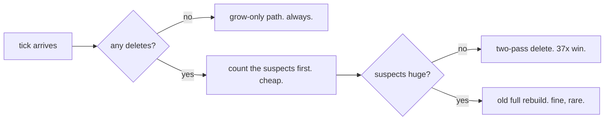

# dred emit, unga version

closure table no rebuild every tick anymore. store lab already solved this.
we copy store answer into emitted sql. probe already ran. numbers real.

## the two moves

```
INSERT edge:              DELETE edge:
                          
  new edge                  dead edge
     |                         |
     v                         v
  grow only from it         mark everything it fed as SUSPECT   (pass 1)
  hop, hop, hop until          hop, hop, hop, whole suspect cone
  nothing new                  |
     |                         v
     v                      any suspect row with another
   done.                    living parent? RESCUE it,
   never touch              and rescue its children too      (pass 2)
   the old rows                |
                               v
                            rows nobody rescued = truly dead.
                            a dead CYCLE has no living parent
                            outside itself -> whole cycle dies. correct.
```

## the numbers (grid 50x50, 1.6 million row closure)

| tick | old way (rebuild all) | new way | winner |
|---|---|---|---|
| add 1 edge | 2,179 ms | 40 ms | new way 54x |
| add 100 edges | 3,517 ms | 1,084 ms | new way 3x |
| delete 1 edge | 2,195 ms | 60 ms | new way 37x |
| delete 100 edges everywhere at once | 2,218 ms | 7,153 ms | OLD way |
| cut cycle anchor | rebuild | instant, cycle dies | both correct |

## so the rule is



## why trust it
- store rust lab proved both moves 2026-07-22. we copied, not invented.
- probe checked every scenario against full-rebuild answer. checksum same.
  even the cycle one.
- probe file is the spec now. lanes copy its sql shapes into the compiler.
