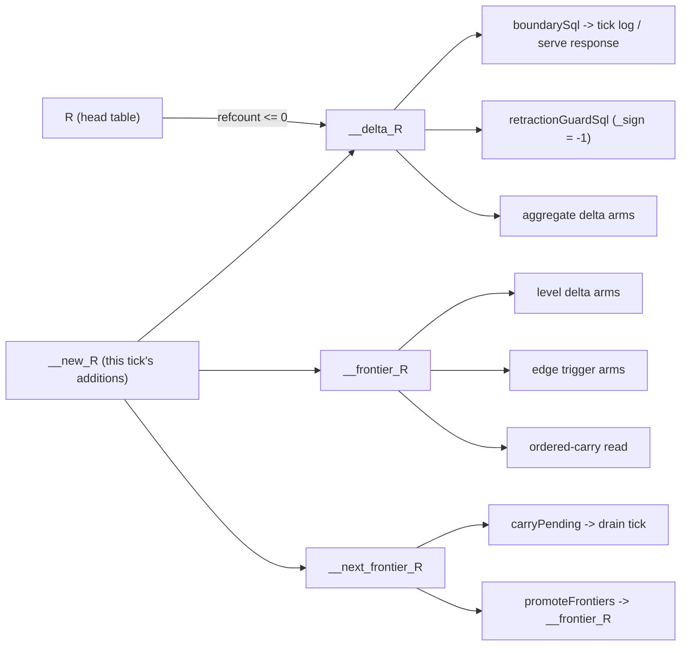
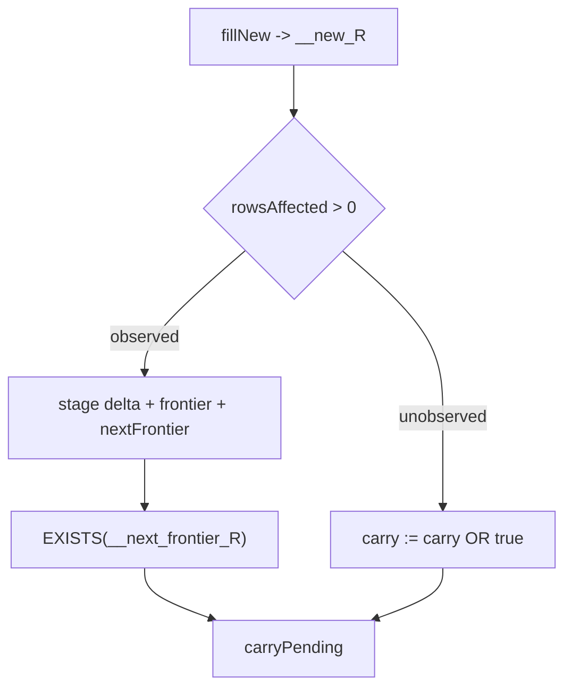

# THE UNOBSERVED-REL SKIP: contract for not copying a rel nobody reads

Design lane `lane/unread-rel-contract`, base `14c03007`. Design only, zero
source edits. Names the working title "unreadRels" out of existence: the rxjs
word for a source with no subscribers is `observed` (`Subject.observed`,
`shareReplay({ refCount: true })`), so the feature is **the unobserved-rel
skip** and the seam field is `unobservedRels`.

## TOC
1. The prize, measured
2. What a rel's event copies are, and who reads them
3. Candidate analysis: which layer owns "nobody reads this rel"
4. The contract
5. The carry signal (the companion change that keeps tick counts intact)
6. Wrongness rail
7. Assumptions about the DRed-in-place lane
8. Phase 1 lane spec
9. Gates
10. Known risks

## 1. The prize, measured

`v6/labs/exec_shootout/dl6/FACTS.unbatched.md`, run with
`DL6_BENCH_UNBATCH=1` so per-statement cost is attributed (its own header
line 9 warns totals read high against a real tick, and line 3 warns single
runs make single-digit percent moves noise).

| case | `INSERT INTO __delta_reachable` | `INSERT INTO __frontier_reachable` | sum | fixpoint ms |
|---|---|---|---|---|
| `chain_10000` | 3027.8 ms / 8.9% | 1976.0 ms / 5.8% | **14.7%** | 34,213 |
| `grid_10000` | 310.1 ms / 15.0% | 207.7 ms / 10.1% | 25.1% | 2,074 |
| `layered_10000` | 2979.9 ms / 14.9% | 1971.1 ms / 9.8% | 24.7% | 20,077 |

Receipts: FACTS.unbatched.md:72-73 (chain), :32,:35 (grid), :51,:54 (layered).
Every one of those rows is `calls 1, rows out 0`: one statement, whole tick,
nothing read it. The bench declares its observers already
(`v6/labs/exec_shootout/dl6/bench.ts:220`, `run.ts:159`:
`unreadRels: new Set(["edge", "reachable"])`) and still pays all six copies,
because today that field gates exactly one thing: the boundary SELECT at
`v6/tsv2/runtime/1_incremental.ts:1090`.

The same tables cost `chain_10000` another 86.2 ms in the promote pass
(FACTS.unbatched.md:76, `DELETE FROM "__frontier_edge"; INSERT INTO ...`).

## 2. What a rel's event copies are, and who reads them

One rel R carries three temp tables plus one optional fourth
(`lower.pl:161-168`, `:180-181`; DDL at `lower.pl:3326-3366`):

```
__delta_R           signed event log   (_sign, _sequence, cols)
__frontier_R        this tick's mailbox (_phase, _sequence, cols)
__next_frontier_R   next tick's mailbox
__departure_frontier_R   emitted ONLY for finalize-bound rels
```

### 2a. Writers (the copies this design skips)

| # | statement | lowered | executed |
|---|---|---|---|
| 1 | `INSERT INTO __delta_R (_sign...) SELECT -1, row_number() ... WHERE "__refcount" <= 0` | lower.pl:2420-2422 (`StageRetractSql`) | 1_incremental.ts:567 |
| 2 | `INSERT INTO __delta_R (_sign...) SELECT 1, "rowid"-1 ... FROM __new_R` | lower.pl:2437-2439 (`StageAddSql`) | 1_incremental.ts:567 |
| 3 | `INSERT INTO __frontier_R (_phase...) SELECT ?, "rowid"-1 ... FROM __new_R` | lower.pl:2440-2442 (`StageFrontierSql`) | 1_incremental.ts:560-563 |
| 4 | `INSERT INTO __next_frontier_R ...` same shape | lower.pl:2443-2445 (`StageNextFrontierSql`) | 1_incremental.ts:560-563 |
| 5 | arrival/edge boundary stage (json_each of JS-side events) | 1_incremental.ts:82-99 | `stageEvents` :137 |
| 6 | arrival/edge frontier stage | 1_incremental.ts:101-116 | `stageEvents` :142-149 |
| 7 | `DELETE FROM __delta_R; DELETE FROM __next_frontier_R` | driver-built | `prepareTick` :696-702 |
| 8 | promote: delete frontier, insert from next, delete next | driver-built | `promoteFrontiers` :1174-1185 |
| 9 | merge next into current | driver-built | `mergeNextIntoCurrent` :953-959 |
| 10 | retention `-1` staging | driver-built | `applyRetentionStatement` :631-645 |

Statements 1-4 are slots 3, 7, 8, 9 of the eleven-slot `supportSql` array
(rendered `emit_ts.pl:1001-1015`, destructured `1_incremental.ts:554-557`).
`support*` is the known naming violation awaiting its own rename commit
(CLAUDE.md style laws); this design introduces no new one.

### 2b. Readers, every family, with its receipt

| reader | table | receipt |
|---|---|---|
| level rule delta arm | `__frontier_<bodyRef>` | lower.pl:3192-3194 (`level_delta_select_arm`) |
| edge rule trigger arm | `__frontier_<trigger>` | lower.pl:1745-1750 |
| edge rule `finalize` arm | `__departure_frontier_<trigger>` | lower.pl:1747, gated by `analyze.pl:1283-1288` |
| ordered-carry read | `__frontier_<trigger>` | emit_ts.pl:1385-1392 |
| aggregate `avg` delta maintenance | `__delta_<bodyRef>` | lower.pl:2045-2052 |
| aggregate scope seed | `__delta_<bodyRef>` | lower.pl:2243-2250 |
| boundary read (tick log, serve response, `finalSelect` callers) | `__delta_R` | `boundarySql` lower.pl:3253-3265; run at 1_incremental.ts:1083-1097 |
| retraction guard (decides whether the reconcile pass runs AT ALL) | every `__delta_R` `WHERE _sign = -1` | 1_incremental.ts:613-619 |
| carry / drain-tick decision | `EXISTS` on every `__next_frontier_R` | 1_incremental.ts:1157-1173 |

The last two are cross-rel: they read tables of rels other than the one whose
work they gate. Section 4 and section 5 answer each.

### 2c. The rel graph the copies implement



### 2d. The .dl6 this is about, with its pure-rxjs lowering

```prolog
reachable(Source, Target) <- edge(Source, Target).
reachable(Source, Target) <- reachable(Source, Mid), edge(Mid, Target).
```

```ts
// Intended pure-rxjs lowering. The event copies ARE the multicast.
const edge$: Observable<IRow> = arrivals$.pipe(filter(isEdge));
const reachable$: Observable<IRow> = defer(() =>
  merge(
    edge$,
    reachable$.pipe(joinOn(edge$, (left, right) => hop(left, right))),
  ),
).pipe(distinct(rowKey), shareReplay({ bufferSize: 1, refCount: true }));
```

`shareReplay({ refCount: true })` with zero subscribers does not multicast, and
`Subject.observed` is rxjs's name for the predicate. `__delta_reachable` and
`__frontier_reachable` are the multicast buffer; the bench subscribes nobody to
it and pays for it anyway.

## 3. Candidate analysis: which layer owns "nobody reads this rel"

| candidate | verdict | one-line reason |
|---|---|---|
| 1 compile-time omission | REJECT (half kept) | the compiler cannot see the boundary observer, and the only compile-time proxy marks 206 of 211 modules reader-free while the sweep reads all of them |
| 2 runtime static, per-rel flag decided at boot | **TAKE** | the two facts meet at boot, which is the only moment either can change |
| 3 runtime dynamic, per-tick live listener count | REJECT | no per-rel listener registry exists to count |
| 4 hybrid dormant + backfill on arrival | REJECT the backfill, KEEP the two-fact insight | the signed event log is not a function of head state |

### Candidate 1: compile-time, omit the copies from the emitted plan

Three receipts against.

**1a. The compiler cannot see the boundary observer.** `readBoundary` runs over
`SUBSCRIBED_RELATIONS` in every emitted module
(`v6/tsv2/gen_emitted/*.ts:283` pattern) and `ticklog.ts:8` prints every rel
with a nonempty add or del. The only compile-time narrowing that exists is the
query cone: `2_subscribe.pl:32-34` returns `[]` for a program with no `?` decl
(ruling `zero_query_semantics`, 2026-08-03). Measured in this worktree:

```
$ ls v6/tsv2/gen_emitted/*.ts | wc -l                      211
$ grep -l 'subscribedRels: readonly string\[\] = \[\];' *.ts | wc -l   206
```

206 of 211 emitted modules carry an empty cone. A compile-time omission driven
by the cone would delete the delta copies for nearly the whole corpus while the
sweep still diffs those rels' rows against the oracle. The cone is a subscribe
filter (`3_subscribe.ts:47-81`), off by default for exactly this reason
(`SPREFA_TSV2_SUBSCRIBE_PRUNE=on` is the only value that prunes, :49).

**1b. It collides with the DRed lane by file.** Omitting the copies means
editing `level_ref_count_sql/4` (`lower.pl:2386-2450`), which is the region
`plans/2026-08-06-dred-emit-lab-header.md` section 4 assigns to its lane A
(`lower.pl` `level_ref_count_sql` region, new `assert_sql`/`dred_sql`
emission). Two lanes rewriting one predicate is a merge conflict by
construction. The chosen design touches zero SQL lowering.

**1c. It freezes a boot-time fact into compiled text.** An embedded caller
declares its observers when it builds the seam
(`v6/labs/exec_shootout/dl6/run.ts:159`), not when it compiles. Under candidate
1 a caller that changes its mind must recompile the program.

**Kept from it:** the RULE observer half is genuinely compile-time knowledge and
nothing else can compute it. `analyze.pl:body_ref_uses/2` and the walk policy in
`0_body_walk.pl` are already the single place both compiler and oracle agree
about what a body reads (`2_subscribe.pl:14-18` states that sharing).

### Candidate 2: runtime static, per-rel flag, decided at boot (CHOSEN)

The emitted module gains one additive field per relation entry,
`ruleObservers: readonly string[]` (the head rels whose statements read R's
delta or frontier). The driver skips a rel's copies when that list is empty AND
the boot-supplied `unobservedRels` names the rel.

Precedent for the shape, in this exact codebase: `departureFrontierTableName` is
an OPTIONAL field on `IIncrementalRelationPlan`, emitted only for rels some rule
binds with `finalize/1`, precisely so a program without that feature renders the
text it always rendered, character for character (`emit_ts.pl:896-905`,
`analyze.pl:1276-1288`, `lower.pl:173-179`). `ruleObservers` is the same move
one field over.

Byte-identity argument, structural rather than empirical: when the boot set is
absent the driver returns the statement arrays it was handed, by reference, and
the emitted SQL strings are unchanged (the new field adds no statement and
removes none). That is `SubscribeCone`'s own default-path argument
(`3_subscribe.ts:8-10`, `:52-56`): the default is byte-identical rather than
merely equivalent.

### Candidate 3: runtime dynamic, per-tick live listener count

There is no registry to count. serve delivers the whole tick-log line to the
client that posted the arrivals (`serve/3_engine.ts:171-174`) and exposes no
per-rel subscription route (`serve/4_http.ts` header, :14-36). A per-tick check
would re-read, once per statement per tick, a set that changes only at program
load. The cost model is inverted: the guard would run more often than the fact
it guards can move.

### Candidate 4: hybrid dormant statements with re-enable and backfill

The backfill is unsound, and the receipt is three lines of the runtime.
`prepareTick` clears `__delta_R` and `__next_frontier_R` at the head of every
tick (`1_incremental.ts:696-702`). The delta rows are SIGNED events carrying a
`_sequence` (`lower.pl:2420-2422`, `:2437-2439`); the head table holds only the
current row set. A row added at tick 3 and retracted at tick 5, with the copies
skipped, leaves no trace anywhere: not in the head table (gone), not in the
delta table (cleared twice since). The event log is not a function of head
state, so no backfill can reconstruct it.

There is also no dormancy to manage. serve's program swap unsubscribes the
previous program's whole branch and subscribes the new one under one `switchMap`
(`serve/4_http.ts:22-26`), so the only moment the observer set can change is
already a full re-entry through boot.

**Kept from it:** the insight that the fact is a conjunction of two facts owned
by two layers. Neither layer alone can answer "nobody reads this rel".

## 4. The contract

### 4a. Reader-set definition

```
observers(R) = ruleObservers(R)  ∪  boundaryObservers(R)
```

`ruleObservers(R)`, COMPILE TIME, emitted per relation entry. The head rel of
every statement that reads R's event tables:

| clause | reads | receipt |
|---|---|---|
| level rule with head H, R a positive body ref | `__frontier_R` | lower.pl:3192-3194 |
| edge rule with head H, R the trigger | `__frontier_R` | lower.pl:1745-1750 |
| edge rule with head H, `finalize(R)` bound | `__departure_frontier_R` | analyze.pl:1283-1288 |
| aggregate head H, R the delta ref | `__delta_R` | lower.pl:2045-2052, :2243-2250 |
| R in the ordered-carry read list | `__frontier_R` | emit_ts.pl:1385-1392 |

Computed with `0_body_walk.pl`'s registry-driven walk, the one
`analyze.pl:body_ref_uses/2` already uses, so compiler and oracle cannot
disagree about what a body reads (`2_subscribe.pl:14-18`).

`boundaryObservers(R)`, BOOT TIME, supplied by the caller on the seam. ABSENT
MEANS EVERY REL (`types.ts:64-66` already states that default). The fail-safe
direction is the negative set: forgetting to name a rel costs the optimization,
never an event.

### 4b. Statements skipped when `observers(R)` is empty

| skipped | kept, always |
|---|---|
| 1 `__delta_R` retraction stage (supportSql[3]) | every DDL: the tables exist whatever the observer set says (`3_subscribe.ts:18` precedent) |
| 2 `__delta_R` addition stage (supportSql[7]) | head mutations: clear, seed, update, collectZero, clearNew, fillNew, insertNew |
| 3 `__frontier_R` stage (supportSql[8]) | the expand wavefront (`expandSql`), untouched |
| 4 `__next_frontier_R` stage (supportSql[9]) | `__departure_frontier_R`, already gated by `listened_departure_refs/2` |
| 5 arrival/edge boundary stage (`stageEvents` :137) | arrival writes into R itself (ruling `edge_before_first_subscribe`: ingestion is eager) |
| 6 arrival/edge frontier stage (`stageEvents` :142-149) | |
| 7 `prepareTick` clears for R | |
| 8 promote delete/insert/delete for R | |
| 9 merge-next-into-current insert for R | |
| 10 retention `-1` staging for R | |
| R's term in `retractionGuardSql`'s OR (:613-619) | |

Skipping R's term in the retraction guard is sound exactly when
`ruleObservers(R)` is empty: with no rule body reading R, no other rel's row can
stop being derivable because R lost a row. The guard is a proxy for "an input
left"; a rel that is nobody's input is not an input.

### 4c. Subscriber-arrival answer

| question | answer |
|---|---|
| can a subscriber arrive mid-life? | Only through a program load. serve's `switchMap` tears down the whole branch and re-enters boot (`serve/4_http.ts:22-26`). |
| recompile? | No. The compiled text already carries `ruleObservers` for every rel; only the boot-time set moves. |
| refuse? | No refusal needed; the arriving observer's set is read at the same boot the seam is built at. |
| backfill the event log? | REFUSED, and the reason is soundness, not cost: the delta tables are cleared every tick (:696-702) and carry signed events; head state cannot reconstruct them (section 3, candidate 4). |
| what does a late observer get? | The head snapshot through `finalSelect` (`types.ts:525`, `:563`), which is a set read of the rel's own table and needs no event history. |

### 4d. Interaction with the oracle byte-identity sweep

`scripts/sweep.sh` stages 1-3 compile every fixture, dump the oracle log, and
diff the emitted tick log byte-for-byte (`scripts/sweep.ts:7-8`, `:232-233`).
Measured in this worktree: `v6/prolog/compile/out/manifest.json` holds 512 rows,
420 `bucket: "compiled"`, 92 `unsupported`.

The sweep sets no `unobservedRels` and no `SPREFA_TSV2_SUBSCRIBE_PRUNE`
(grep over `scripts/sweep.ts` and `scripts/sweep.sh`: no occurrence). Under the
contract, an absent boot set means every rel is observed, so
`observers(R)` is nonempty for every R in every fixture, so zero statements
change and the 420 logs are identical BY CONSTRUCTION rather than by
measurement. The phase-1 lane must preserve that structurally: with the boot set
absent, hand back the same arrays by reference, the `3_subscribe.ts:52-56` move.

Fixtures that DO have readers are untouched under any boot set, because
`ruleObservers` is nonempty for them and the union only grows.

## 5. The carry signal

Dropping copy #4 alone is a DEFECT, not an optimization. `carryPending` is
`EXISTS` over every `__next_frontier_R` (`1_incremental.ts:1157-1173`), and
`TickFold` keeps ticking while it holds (`tickLoop.ts:31-33`). A skipped
`__next_frontier_R` turns `carryPending` false where it was true, deleting whole
drain ticks and therefore whole tick-log LINES.

The companion change, required in the same commit as the skip:

| path | carry source today | carry source under the skip |
|---|---|---|
| refCount reconcile | `EXISTS(__next_frontier_R)` | `fillNew` (`supportSql[6]`) `rowsAffected > 0` |
| arrival / edge / log | `EXISTS(__next_frontier_R)` | `events.filter(sign === 1).length > 0`, already in JS at `stageEvents` :138 |

`fillNew` fills `__new_R`, which is the exact table copies #3 and #4 read
(`lower.pl:2433-2436`, `:2440-2445`), so its `rowsAffected` equals the row count
the copy would have inserted. `seam.runner.batch` already returns `rowsAffected`
and the driver already reads it for the expand loop (`1_incremental.ts:589`).
No new statement, no new SQL shape.



## 6. Wrongness rail

The nightmare is a missed reader family: the analysis says "nobody reads R", a
statement somewhere reads `__frontier_R`, and the program silently derives
fewer rows with no error. Three rails, cheapest first.

### RAIL A `nolisten_text_audit` (static, per fixture, runs inside the sweep)

For every compiled fixture and every rel R with `ruleObservers(R) == []`, scan
the emitted module TEXT for `__delta_R`, `__frontier_R`, `__next_frontier_R`.
Every occurrence must fall in the allowed set: the DDL list, `prepareTick`'s
clear, `promoteFrontiers`/`mergeNextIntoCurrent`, the ten writer statements,
`boundarySql`, `retractionGuardSql`. Any other occurrence fails the sweep with
the fixture name, the rel and the offending statement.

This catches a missed reader family WITHOUT knowing what the families are: it
compares the analysis against the emitted text rather than against a second copy
of the analysis. It runs over all 420 compiled fixtures and executes nothing.

Sabotage receipt the lane must record in the rail's header: delete one clause of
`ruleObservers` (say the aggregate delta ref), rerun, and quote the fixtures the
audit turns red.

### RAIL B twin-run referee (dynamic, landing gate)

Run each fixture's own schedule twice in one process: once with the boot set
absent, once with it set to every rel whose `ruleObservers` is empty. Require
the two tick logs identical after deleting the skipped rels' entries from both,
AND the LINE COUNT identical (that is the carry-signal assertion from section 5).
Precedent: `plans/2026-08-06-dred-emit-lab-header.md` section 1, the
checksum-equality-on-a-twin-db referee, `v6/labs/exec_shootout/dl6/dred.mjs`.

### RAIL C `nolistenCounts.test.ts` (standing COUNT test)

The opposite failure: the skip silently never fires. A COUNT test in the
formerly-quadratic style (CLAUDE.md style laws: statement counts, never
end-state equality alone) asserting statements-per-tick is exactly ten fewer per
skipped rel, flat at 5 / 100 / 1000 source rows. `coalesceCounts.test.ts` is the
shape precedent (33 statements/tick flat at 5/100/1000).

## 7. Assumptions about the DRed-in-place lane

`plans/2026-08-06-dred-emit-lab-header.md` section 4 replaces the refCount
family for recursive heads with assert/DRed paths and introduces
`__ping_<rel>` / `__pong_<rel>` / `__cone_<rel>`.

| this contract assumes | if the DRed lane breaks it |
|---|---|
| The skip removes STATEMENT SLOTS by name (`stageRetract`, `stageAdd`, `stageFrontier`, `stageNextFrontier`), never by source table. | Nothing to change: whatever the copy's `FROM` clause becomes, the slot is still the slot. |
| Some single table or count materializes "R's +1 rows this tick" before the copies run (today `__new_R`, `lower.pl:2452-2453`). | The carry signal (section 5) loses its source. Replacement: the assert path's own cone row count. Coordination point, named. |
| `__delta_R` stays the retraction guard's input (`1_incremental.ts:613-619`), which the DRed header section 3 also relies on ("`retractionGuardSql` already discriminates the tick kinds"). | Both designs need renegotiating together; neither can move it alone. |
| The DRed lane owns `lower.pl` and `emit_ts.pl` SQL TEXT; this design adds one non-SQL field in `emit_ts.pl`'s relation entry line and one predicate in `analyze.pl`. | Sequencing: land DRed's lower.pl work first, then this field. The field is additive and rebases clean. |

If `__new_<rel>` disappears entirely for recursive heads, the skip degrades
gracefully: there are no copy statements in that family to skip, and the prize
shrinks to the arrival/edge/promote statements (#5-#10).

## 8. Phase 1 lane spec

Base: whatever sha the coordinator states; first action `git merge --ff-only`.
Lanes never spawn subagents.

### Lane A: prolog, computes and emits the rule observer set

Owns: `v6/prolog/analyze.pl`, `v6/prolog/emit_ts.pl` (relation entry line only),
`v6/prolog/tests/` unit for the new predicate.
Touches ZERO SQL text and does NOT open `lower.pl`.

1. `analyze.pl`: `rel_rule_observers(+Rules, +Ref, -HeadRefs)`, the five clauses
   of section 4a, built on `0_body_walk.pl`'s registry walk, sorted. Export it.
2. `emit_ts.pl`: render `ruleObservers: ["h/2", ...]` on each
   `IIncrementalRelationPlan` entry line (the line at :906-910), following
   `departureFrontierTableName`'s optional-field precedent at :896-905.
3. plunit: the predicate agrees with a hand-written expectation on one fixture
   per reader family (level body ref, edge trigger, finalize, aggregate delta
   ref, ordered carry).

### Lane B: typescript runtime, the skip and the carry signal

Owns: `v6/tsv2/runtime/1_incremental.ts`, `v6/tsv2/runtime/types.ts`.
Does not open any `.pl`.

1. `types.ts`: rename `unreadRels` to `unobservedRels` on `ISqlSeam` (3 call
   sites: `1_incremental.ts:1090`, `labs/exec_shootout/dl6/bench.ts:220`,
   `run.ts:159`); add `ruleObservers?: readonly string[]` to
   `IIncrementalRelationPlan`.
2. `1_incremental.ts`: one predicate `isUnobserved(relation, seam)` =
   `(relation.ruleObservers ?? ["*"]).length === 0 && seam.unobservedRels?.has(relation.rel) === true`.
   The `?? ["*"]` is the fail-safe: a module compiled before lane A lands has no
   field and is never skipped.
3. Apply it at the ten writer sites of section 4b, plus the
   `retractionGuardSql` term list.
4. The carry signal of section 5.
5. With `seam.unobservedRels` absent, return the same arrays by reference.

### Lane C: rails

Owns: `v6/tsv2/scripts/` (the RAIL A audit), `v6/tsv2/tests/nolistenCounts.test.ts`.
Depends on lane A's field existing; starts after A lands.

## 9. Gates

Every lane, every commit:

| gate | command | required |
|---|---|---|
| sweep byte-identity | `cd v6/tsv2 && bash scripts/sweep.sh` | 420 compiled, identical unchanged, 0 wrong, 0 emitted_crash |
| conformance | `just green-all` | no regression from the branch base |
| plunit | as in `just green-all` | new units green |
| RAIL A | inside `sweep.sh` | 0 findings |
| RAIL B | twin-run referee over the fixture corpus | line counts equal, filtered logs equal |
| RAIL C | `nolistenCounts.test.ts` | statement count drops by exactly the skipped set |
| prize | `just dl6-bench` with `DL6_BENCH_UNBATCH=1` | `__delta_reachable` and `__frontier_reachable` rows GONE from the chain_10000 table |
| 10-second law | every gate | no leg over its budget |

## 10. Known risks

| risk | mitigation |
|---|---|
| a reader family exists that section 2b missed | RAIL A compares the analysis against emitted TEXT, so it catches families nobody enumerated |
| carry signal drifts from the frontier row count | RAIL B asserts LINE COUNT equality, which is the only thing carry controls |
| the DRed lane lands first and moves `__new_<rel>` | section 7 names the one coordination point; the skip itself is table-agnostic |
| the rename `unreadRels` -> `unobservedRels` touches a lab file mid-bench | rename in the same commit as the field; the bench declares it in two places, both listed |
| someone wires `boundaryObservers` from the query cone | REFUSED by this contract: 206 of 211 modules have an empty cone (section 3, 1a) and the cone is a subscribe filter, not an observer count |
