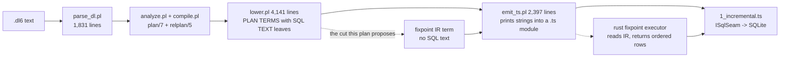
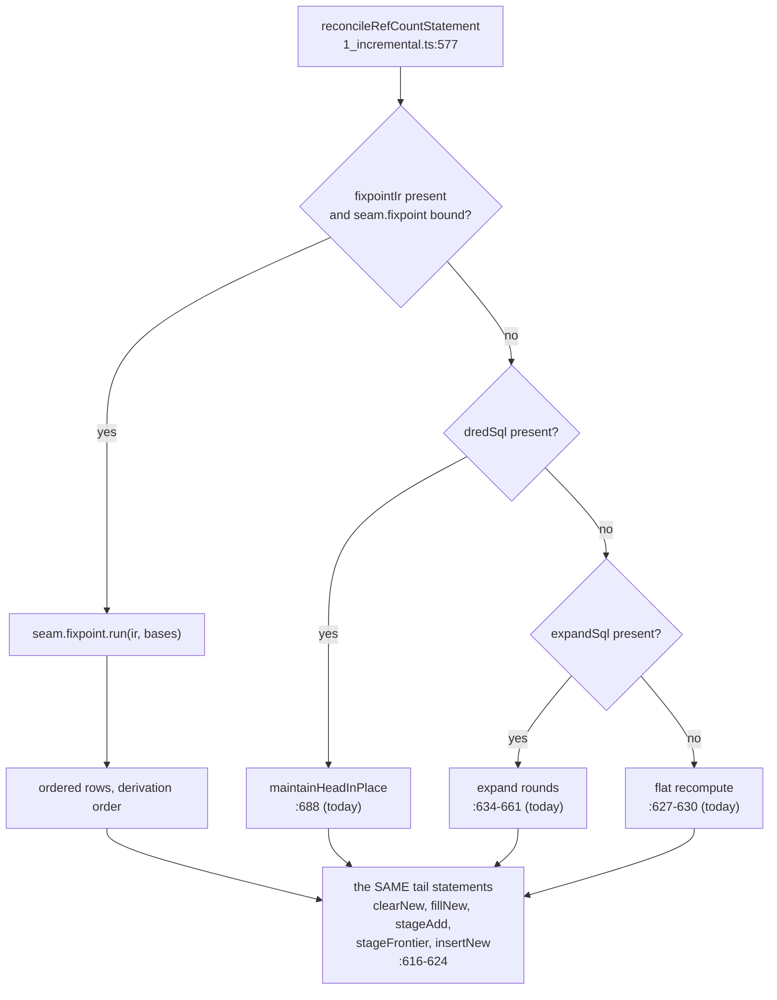
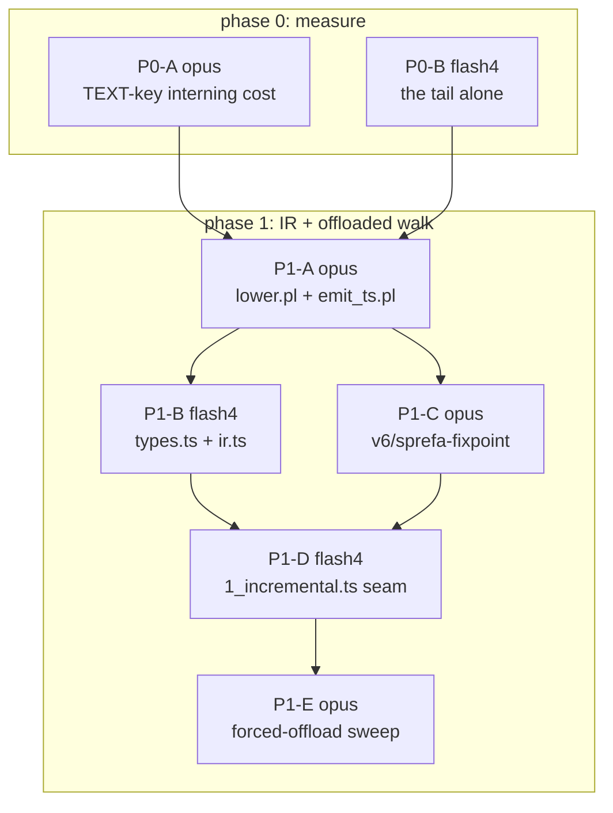

# Plan IR offload: the backend-neutral boundary, and a phased route to a second executor

Design lane `lane/ir-offload-design`, base `e1a9696f`. Design only, no source
edits. Pass 1 of 2; the coordinator audits this contract before any
implementation lane opens.

## TOC

1. [The question, and the answer in one table](#1-the-question-and-the-answer-in-one-table)
2. [IR boundary: what lower.pl actually builds today](#2-ir-boundary-what-lowerpl-actually-builds-today)
   - 2.1 [The plan terms, cited](#21-the-plan-terms-cited)
   - 2.2 [Every leaf that mints SQL text, classified into op families](#22-every-leaf-that-mints-sql-text-classified-into-op-families)
   - 2.3 [What the recursive subset uses, and what it does not](#23-what-the-recursive-subset-uses-and-what-it-does-not)
   - 2.4 [Phase-1 IR, written out](#24-phase-1-ir-written-out)
   - 2.5 [The long tail, and where each piece lands later](#25-the-long-tail-and-where-each-piece-lands-later)
3. [Backend candidates, one section each](#3-backend-candidates-one-section-each)
   - 3.1 [Library research first: what exists](#31-library-research-first-what-exists)
   - 3.2 [DataFusion](#32-datafusion)
   - 3.3 [differential-dataflow (and DBSP / Feldera)](#33-differential-dataflow-and-dbsp--feldera)
   - 3.4 [ascent / crepe / ascent-interpreter](#34-ascent--crepe--ascent-interpreter)
   - 3.5 [DuckDB via bindings](#35-duckdb-via-bindings)
   - 3.6 [limbo / Turso](#36-limbo--turso)
   - 3.7 [Extend in-house: interp + rxgraph + sprefa-store](#37-extend-in-house-interp--rxgraph--sprefa-store)
   - 3.8 [Decision, and its two strongest counterarguments](#38-decision-and-its-two-strongest-counterarguments)
4. [The seam: where phase 1 attaches at runtime](#4-the-seam-where-phase-1-attaches-at-runtime)
   - 4.1 [Three options](#41-three-options)
   - 4.2 [The pinned event order, and how the offload reproduces it](#42-the-pinned-event-order-and-how-the-offload-reproduces-it)
   - 4.3 [The ceiling this seam imposes](#43-the-ceiling-this-seam-imposes)
5. [Phase plan with lanes](#5-phase-plan-with-lanes)
6. [Risks](#6-risks)
7. [Appendix: receipts index](#7-appendix-receipts-index)

---

## 1. The question, and the answer in one table

The compiler plans programs into structured prolog terms and bakes SQLite SQL
TEXT into the leaves. `emit_ts.pl` prints those strings into a TypeScript
module. The ask: pass 1 emits a backend-neutral plan IR, pass 2 lowers IR to a
backend, and a second backend runs the measured-hot subset.

| question | answer |
|---|---|
| what is the IR boundary | the `arm` (sources, equalities, filters, projection) plus 11 statement-shaped ops, replacing the SQL strings inside `expandplan/7`, `dredplan/24` and 7 of the refCount 11-tuple |
| which backend | extend in-house: a rust IR-driven operator-graph executor seeded from `v6/labs/exec_shootout/rxgraph` wiring and `interp` storage, reusing `v6/sprefa-store/src/engine.rs`'s DRed walk shape |
| where does it attach | option (b): a parallel fixpoint seam the tsv2 driver picks per level statement when that statement carries an IR plan; SQLite stays the system of record |
| what does phase 1 buy | `chain_10000` 30,670 ms -> the SQLite insert floor (~9-12s). Beating the floor needs phase 2 (head residency) |
| biggest risk | the win is capped by the keyed insert into the head, not by the walk; a phase 1 that does not measure that first can ship a correct IR that moves no number |



---

## 2. IR boundary: what lower.pl actually builds today

### 2.1 The plan terms, cited

| term | arity | built at | carried to the runtime as |
|---|---|---|---|
| `plan/7` | 7 | `v6/prolog/compile.pl:212` (doc at `:76-92`) | not emitted; the compile input |
| `relplan/5` | 5 | `v6/prolog/compile.pl:195-201` | `IIncrementalRelationPlan`, `types.ts:94-122` |
| `lowered/8` | 8 | `v6/prolog/lower.pl:4024-4089` | the module's four const arrays |
| `levelstmt/6` | 6 | `v6/prolog/lower.pl:1974-1999` | `IIncrementalLevelStatement`, `types.ts:160-191` |
| `refcountsql/13` | 13 (11 SQL + 2 subplans) | `v6/prolog/lower.pl:2518-2588` | `supportSql` tuple of 11, `types.ts:171-183` |
| `expandplan/7` | 7 | `v6/prolog/lower.pl:2633-2657` | `IExpandSeedPlan`, `types.ts:193-201` |
| `dredplan/24` | 24 | `v6/prolog/lower.pl:2717-2793` | `IDredPlan`, `types.ts:205-236` |
| `edgestmt/8` | 8 | `v6/prolog/lower.pl:1673-1732` | `IIncrementalEdgeStatement`, `types.ts:124-135` |
| `avgsql/7`, `aggsql` | 7 | `v6/prolog/lower.pl:2041-2103` | `IAggregateLevelPlan`, `types.ts:152-158` |

Emission is a straight print: `emit_ts.pl:988-1013` writes the level entry,
`:1036-1051` flattens `refcountsql/13`, `:1053-1066` flattens `expandplan/7`,
`:1068+` flattens `dredplan/24`. Every field is a JS template literal holding
SQL bytes. `lower.pl` holds 254 `format(atom(...))` calls, of which 41 mint a
statement starting `SELECT|INSERT|DELETE|UPDATE|WITH|CREATE` and 24 mint DDL.

### 2.2 Every leaf that mints SQL text, classified into op families

The shared arm builder is `level_recursive_arm_parts/8`
(`lower.pl:3000-3015`). Everything recursive reuses it, which is why the IR has
one arm shape rather than one per plan.

| op family | prolog leaf | line span | SQL it mints today |
|---|---|---|---|
| `scan` | `compile_positive_uses/7` | `lower.pl:343-362` | `"rel" b0` FROM parts, alias `b<index>` |
| `scan_pre` | `positive_use_table(pre, ...)` | `lower.pl:361` | `"__pre_rel" b0` |
| `scan_delta` | `dred_delta_select/4` | `lower.pl:2875-2890` | delta read at one sign with a liveness `EXISTS`/`NOT EXISTS` |
| `scan_wave` | `dred_hop_arm/5`, `expand_hop_sql/9` | `lower.pl:2910-2925`, `:2672-2685` | the self atom's FROM part swapped for the frontier table |
| `join` | `compile_pattern_arg/7` + `where_text/2` | `lower.pl:270-289`, `:334-338` | equality texts `b0."x" = b1."y"` |
| `filter` | `compile_guard_goals/4`, `compile_comparison/3` | `lower.pl:614-622`, `:829-847` | comparison WHERE texts |
| `filter_regexp` | `compile_regexp_goal/3` | `lower.pl:809-827` | `regexp(...)` UDF call |
| `project` | `head_select_list/4`, `compile_expr/4` | `lower.pl:869-877`, `:449-491` | SELECT list, aliased and raw |
| `project_json_term` | `compile_expr/4` compound branch | `lower.pl:481-489` | `json_object('fn',...,'args',json_array(...))` |
| `probe_absent` / `probe_present` | `dred_absent_probe/3`, `dred_present_probe/3` | `lower.pl:2795-2805` | `NOT EXISTS` / `EXISTS` correlated subquery |
| `antijoin` | `FillNewSql` | `lower.pl:2571-2574` | `LEFT JOIN ... WHERE h."first" IS NULL` |
| `insert_distinct` | `dred_commit_sql/4`, `expand_absorb_sql/4`, `dred_hop_sql/8` | `lower.pl:2807-2809`, `:2687-2690`, `:2899-2908` | `INSERT OR IGNORE INTO ... SELECT` |
| `insert_append` | `dred_arrival_sql/4` | `lower.pl:2813-2816` | `INSERT INTO __new_ ... SELECT ..., 1` |
| `stage_delta` | `StageRetractSql`, `StageAddSql` | `lower.pl:2558-2560`, `:2575-2577`, `:2789-2791` | `INSERT INTO __delta_ ("_sign","_sequence",...)` |
| `stage_frontier` | `StageFrontierSql`, `StageNextFrontierSql` | `lower.pl:2578-2583` | `INSERT INTO __frontier_ ("_phase","_sequence",...)`, one bind |
| `clear` | every `DELETE FROM <temp>` | `lower.pl:2540`, `:2646-2647`, `:2739-2741`, `:2566` | `DELETE FROM "<temp>"` |
| `delete_matching` | `dred_cone_drop_sql/4`, `HeadDeleteSql` | `lower.pl:2818-2820`, `:2775-2777` | `DELETE ... WHERE (cols) IN (SELECT ...)` |
| `delete_unmatched` | `ConeTrimSql` | `lower.pl:2772-2774` | `DELETE ... WHERE NOT EXISTS (...)` |
| `delete_predicate` | `CollectZeroSql` | `lower.pl:2561-2563` | `DELETE ... WHERE "__refcount" <= 0` |
| `update_from` | `UpdateSql` | `lower.pl:2555-2557` | `UPDATE head SET __refcount = COALESCE((SELECT ...), 0)` |
| `count_scalar` | `HeadCountSql` | `lower.pl:2792-2793` | `SELECT count(*) AS "n" FROM head` |
| `aggregate` | `aggregate_select_expr/3` | `lower.pl:3452-3499` | `count/sum/min/max/avg/json_group_array/group_concat` |
| `aggregate_counted` | `level_ref_count_arm/3` | `lower.pl:3017-3042` | `count(*) AS "__refcount" ... GROUP BY` |
| `json_descent` | `json_pattern_sql/8`, `json_member_sql/9` | `lower.pl:3237-3399` | `json_extract` / `json_each` / `json_tree` |
| `boundary_read` | `SelectSql` in the level entry | `emit_ts.pl:998` | `SELECT cols FROM "rel"` |
| `boundary_render` | `canonical_column_expr/3` | `lower.pl:3864-3915` | the json-to-term CASE wrapper |
| `fixpoint_loop` | not in the compiler at all | `1_incremental.ts:634-661`, `:701-707` | the ping/pong `expand` driver, TypeScript side |

Note the last row. The loop that makes the fixpoint a fixpoint lives in the
runtime, not in the plan. Phase 1 has to lift it into the IR, because a rust
executor cannot be driven one statement at a time from JS and still win.

### 2.3 What the recursive subset uses, and what it does not

`level_ref_count_sql/4` branches at `lower.pl:2541`. When
`rules_read_head_recursively/2` holds it builds `recursive_ref_count_seed_sql/7`
plus `level_expand_plan/4` plus (when admissible) `level_dred_plan/4`.
Otherwise it builds `counted_ref_count_seed_sql/5` and both subplans are `none`.

Two facts collapse phase 1 by a whole family each.

**Fact A: on the recursive path the refCount value is the literal `1`.**
`recursive_ref_count_seed_sql/7` projects `SELECT ~w, 1` (`lower.pl:2626-2629`),
`expand_absorb_sql/4` projects `SELECT ~w, 1` (`lower.pl:2687-2690`),
`dred_arrival_sql/4` projects `SELECT ~w, 1` (`lower.pl:2813-2816`). The
`count(*) ... GROUP BY` bag-of-derivations arm (`level_ref_count_arm/3`,
`lower.pl:3017-3042`) is reached only on the non-recursive branch. **Phase 1
needs zero aggregation.**

**Fact B: `dred_plan_admissible/1` already fences the subset.**
`lower.pl:2706-2715` requires every rule of the head to have no negated use, no
`pre` use, no `__ref_*` dictionary use, and at least one positive use. A head
that fails any of those gets `DredPlan = none` and runs the recompute path. So
the phase-1 IR inherits an existing, tested admissibility predicate rather than
inventing a new one.

| op family | expandplan | dredplan | refcount 11-tuple | in phase-1 IR |
|---|---|---|---|---|
| `scan` | yes | yes | yes | YES |
| `scan_delta` | no | yes (seeds) | no | YES |
| `scan_wave` | yes (hop) | yes (hop) | no | YES |
| `join` (equality) | yes | yes | yes | YES |
| `filter` (comparison, literal, functor) | yes | yes | yes | YES |
| `project` (var, literal, arithmetic, concat) | yes | yes | yes | YES |
| `probe_absent` / `probe_present` | yes (hop antijoin) | yes (all three walks) | no | YES |
| `antijoin` (fillNew) | no | no | yes | YES |
| `insert_distinct` | yes | yes | yes | YES |
| `insert_append` | no | yes | yes (fillNew) | YES |
| `clear` | yes | yes | yes | YES |
| `delete_matching` / `delete_unmatched` | no | yes | no | YES |
| `count_scalar` | no | yes (bail price) | no | YES |
| `fixpoint_loop` | driver | driver | driver | YES (lifted) |
| `stage_delta` / `stage_frontier` | no | yes | yes | NO (stays SQL) |
| `update_from` / `delete_predicate` | no | no | yes | NO (stays SQL) |
| `aggregate` / `aggregate_counted` | no | no | non-recursive branch only | NO |
| `json_descent`, `filter_regexp`, `project_json_term` | possible in an arm | refused by `dred_plan_admissible/1`? no, only dictionary uses are | possible | NO (refusal gate, see 2.5) |
| `boundary_read` / `boundary_render` | no | no | no | NO (stays SQL) |

The last four rows are the phase boundary. Staging, the boundary, and the
retraction bookkeeping stay in SQLite on purpose: they are what makes the tick
log byte-identical, and they are not where the time goes (`FACTS.md`: the
expand rounds are 60-75% of every case's fixpoint).

### 2.4 Phase-1 IR, written out

AMENDED 2026-08-07 by lane P1-A-R against the landed
`lower.pl:level_fixpoint_ir/4` + `emit_ts.pl:fixpoint_ir_text/2`. The pre-build
draft of this section is in git; every change below is a place the draft was
narrower than the SQL it has to mirror, or was missing a fact the executor
cannot recover. Grep `v6/prolog/compile/test/plunit_tests.pl` for `fixpoint_ir_`
for the pinned terms.

Type signatures first, prolog side, then the JSON shape the emitter prints.

```prolog
% fixpointir(Storage, Assert, Dred, Revive, Expand)
%   Storage   : list of relstorage/2, one row per rel any src reads, plus head
%   the four walks are ONE term: the fence admits all four or none
fixpointir( [relstorage(Ref, [colclass])], Assert, Dred, Revive, Expand ).

% fixplan(HeadRef, Columns, ColumnTypes, Seeds, Hops, Stop, Emit)
%   Seeds     : list of arm/5, each producing head rows from base rels
%   Hops      : list of arm/5, ONE PER RECURSIVE RULE, SelfIndex reads the wave
%   Stop      : stop(SeedProbe, HopProbe), the two admission tests, either none
%   Emit      : order(round_major | key_major) or none, the _sequence contract
fixplan(  ref(Name, Arity), [Column], [Type], [Seed], [Hop], Stop, Emit).

% arm(Sources, Equalities, Filters, Project, SelfIndex)
%   Sources   : list of src/2, index-aligned with the b<index> aliases
%   SelfIndex : the position of the head's own atom, or none on a seed
arm( [src(Index, Source)], [eq(Expr, Expr)], [Filter], [Expr], SelfIndex ).

% src(Index, Source)
source( rel(Ref)                       ).  % lower.pl:343-362
source( rel_or_retracted(Ref)          ).  % lower.pl:dred_seed_from_part/9 cl.3
source( delta(Ref, Sign, liveness(present | absent)) ). % :dred_delta_select/4
source( wave(frontier)                 ).  % the a/b buffers are one IR slot
source( cone                           ).  % lower.pl:dred_cone_table_name/2

% relstorage(Ref, ColumnClasses): the comparator, which ColumnTypes is not
%   Encoding is the interning slot task #4 writes; ref(_) already reads dict
colclass( Column, Type, StorageClass, Collation, Encoding ).
%   Type        : int | text | float | bool | json | ref
%   StorageClass: integer | real | text        (lower.pl:column_def/3:939-964)
%   Collation   : binary on text storage, none otherwise (no COLLATE is emitted)
%   Encoding    : direct | dict(TargetRelName)

% expr: the closed scalar grammar phase 1 admits
expr( col(Index, Ordinal)              ).  % b<Index>."<column at Ordinal>"
expr( lit(int(N)) ; lit(text(A)) ; lit(bool(B)) ; lit(float(F)) ).
expr( arith(Op, Expr, Expr, ResultType) ). % ResultType = compile_expr/4's
expr( concat([Expr])                   ).  % lower.pl:591-612, always text

% filter: the closed predicate grammar phase 1 admits
filter( cmp(Op, Expr, Expr)            ).  % lower.pl:829-847, Op in {<,=<,>,>=,==,\==}
filter( eq_lit(Expr, Literal)          ).  % lower.pl:338
%   eq_lit at intern(dict) (user word 2026-08-08, option A): a lit(text(V))
%   compared against a column whose colclass encoding is dict(R) resolves
%   through R — the executor interns V and compares ids. No new IR node.
%   Until an executor implements that sentence, the compiler fences such
%   walks out of the IR entirely (lower.pl interned_literals_absent/2).

% probe(Kind, Target): a walk's admission test
probe( absent,  head | cone | ref_count ).  % lower.pl:2795-2799, :2686
probe( present, head | cone             ).  % lower.pl:2801-2805
```

One arm shape, one closed expression grammar, one closed predicate grammar,
one storage table. Nothing in it names SQLite.

Two facts the draft left out, both of which decide an ANSWER rather than a
shape, and both closed in the build:

| leak | what the executor got wrong without it | closed by |
|---|---|---|
| int division | `arith(/, a, b)` is `(a / b)` when both operands are INTEGER and `(CAST(a AS REAL) / b)` otherwise (`lower.pl:arithmetic_rendering/6`). Same IR node, two answers: 2 vs 2.5 | `arith/4`'s `ResultType`, taken from `arithmetic_result_type/4`, the same predicate `compile_expr/4` calls |
| TEXT collation | `col(Index, Ordinal)` named a column with no comparator. bool and `ref(_)` both store INTEGER, json stores TEXT, and `lower.pl` emits no `COLLATE` anywhere, so every text column is BINARY | `relstorage/2` + `colclass/5`, one row per rel, resolved through the arm's `src` |

The four walks are ONE term gated by `dred_plan_admissible/1`. A head with an
`expandplan` but no `dredplan` (a negated body atom, a `pre` atom, a `__ref_`
atom) emits `fixpointIr: null` even though its expand walk alone is expressible.
Phase 2 splits them if the from-scratch path needs offloading on its own; phase
1 does not, and `plunit_tests.pl:negated_body_refuses_the_in_place_plan` pins it.

The emitted JSON, one field added beside `expandSql` and `dredSql` on
`IIncrementalLevelStatement` (`types.ts:160-191`):

```
fixpointIr?: {
  head:    { rel: string; columns: string[]; types: ("int"|"text"|"float"|"bool")[] };
  storage: { rel: string; arity: number; columns: ColumnClass[] }[];
  assert:  Walk;   // emit: "round_major"
  dred:    Walk;   // emit: null
  revive:  Walk;   // emit: null
  expand:  Walk;   // emit: "key_major"
} | null

// Walk = { seeds: Arm[]; hop: Arm[]; stop: { seed: Probe|null; hop: Probe|null };
//          emit: "round_major" | "key_major" | null }
// ColumnClass = { name: string; type: string; storage: "integer"|"real"|"text";
//                 collation: "binary" | null;
//                 encoding: { kind: "direct" } | { kind: "dict"; rel: string } }
```

All four walks are always present when `fixpointIr` is non-null; the draft's `?`
markers were wrong. `runtime/types.ts` declares the field `unknown` and P1-B
replaces that with `IFixpointIr`; typing it in P1-A would have put a runtime
interface in a lane that owns no runtime file.

Additive. Every existing SQL field stays. A runtime that ignores `fixpointIr`
behaves exactly as today, which is what makes the sweep's byte-identity gate
meaningful during the build rather than only at the end.

### 2.5 The long tail, and where each piece lands later

| construct | where it lives today | phase | cost to lift, and what it costs to leave |
|---|---|---|---|
| json1 descent (`json_extract`, `json_each`, `json_tree`) | `lower.pl:3130-3399` | 4 | needs a json value model and a type guard that raises the way SQLite does (`lower.pl:3164-3174`). Leaving it out costs nothing: a head whose arm carries a decode simply has no `fixpointIr` and runs SQL |
| `spread`, `$name` key holes, `**` descent | `lower.pl:3285-3399` | 4 | one `json_each`/`json_tree` join each; same model as above |
| `regexp/2` | `lower.pl:805-827` | 3 | a UDF today; in rust it is a `regex` crate call. Cheap to lift, low value: a filter is never the bottleneck |
| ordered aggregates (`json_group_array_ordered`, `group_concat_ordered`) | `lower.pl:3478-3496` | 5 | needs an ordering key in the IR. Never reached on a recursive head (Fact A) |
| `count/sum/min/max` group scope | `lower.pl:2041-2063`, `:2407-2457` | 5 | its own four-statement maintenance family, `IAggregateLevelPlan`. Orthogonal to the fixpoint |
| `avg` accumulator | `lower.pl:2065-2350` | 5 | a REAL accumulator table; SQLite-specific by design |
| collation / affinity / canonical rendering | `lower.pl:3864-3915` | never | this IS the SQLite boundary contract; the offload returns rows, the driver renders |
| retention (`keep(Ref, count(N))`) | `lower.pl:3677-3696` | never | a `DELETE ... LIMIT` on a log rel, nowhere near a fixpoint |
| struct dictionaries (`__ref_`, `__dict_`) | `lower.pl:1029-1215` | 3 | already excluded by `dred_plan_admissible/1:2713`. Lifting means interning at the IR boundary |
| `pre` snapshots | `lower.pl:361`, `:3717-3736` | 3 | already excluded by `dred_plan_admissible/1:2712` |
| negated body atoms | `lower.pl:390-408` | 3 | already excluded by `dred_plan_admissible/1:2711`; a non-monotone head needs the recompute path anyway |
| catalog / `__tick` / `__rel` DDL | `lower.pl:624-765` | never | metadata, one row per rel, zero rows/s pressure |

Phases 3-5 are named so the boundary is checkable, not scheduled. Nothing past
phase 2 is committed by this contract.

---

## 3. Backend candidates, one section each

Build-vs-buy law: library research first, candidate by candidate, no one-line
dismissals.

### 3.1 Library research first: what exists

| candidate | crate / project | status as of Aug 2026 | licence | the shape it offers |
|---|---|---|---|---|
| DataFusion | `datafusion`, release 54.0.0 cycle | active, Apache | Apache-2.0 | Arrow columnar SQL engine, extensible `ExecutionPlan` trait |
| differential-dataflow | `differential-dataflow` 0.18.0, updated ~2 months ago | active | MIT | incremental collection algebra over timely, `iterate` for fixpoints |
| DBSP / Feldera | `feldera-sqllib`, `dbsp` | active, commercial backing | MIT / Apache | Z-sets, circuit construction API, recursion incrementally |
| ascent | `ascent` 0.8.0, last update >1 year | quiet | MIT | datalog proc-macro, lattices, stratified negation + aggregation, BYODS, rayon parallel variants |
| ascent-interpreter | `ascent-interpreter` 0.1.2 | new, tiny | MIT | parses and evaluates ascent programs at runtime, no rustc needed |
| crepe | `crepe` 0.2.0, updated ~6 months ago | maintained | MIT | datalog proc-macro, compile-time only |
| DuckDB | `duckdb` (duckdb-rs) 1.x | active | MIT | bundled C++ engine, vectorized columnar |
| Turso (ex-Limbo) | `tursodatabase/turso` | BETA, explicitly not production-ready | MIT | SQLite rewritten in rust, MVCC, async IO |
| in-house | `v6/labs/exec_shootout/{interp,rxgraph,mono}`, `v6/sprefa-store` | in-tree, measured | ours | three measured execution strategies + a landed DRed implementation |

Sources: [datafusion 54.0.0 release issue](https://github.com/apache/datafusion/issues/21080),
[datafusion recursive CTE issue #9554](https://github.com/apache/datafusion/issues/9554),
[datafusion-materialized-views](https://github.com/datafusion-contrib/datafusion-materialized-views),
[differential-dataflow on crates.io](https://crates.io/crates/differential-dataflow),
[differential-dataflow repo](https://github.com/TimelyDataflow/differential-dataflow),
[DBSP VLDB paper](https://docs.feldera.com/vldb23.pdf),
[ascent repo](https://github.com/s-arash/ascent),
[ascent-interpreter](https://crates.io/crates/ascent-interpreter/0.1.2),
[crepe](https://github.com/ekzhang/crepe),
[duckdb-rs](https://github.com/duckdb/duckdb-rs),
[Turso status](https://news.ycombinator.com/item?id=46810950).

The five axes every candidate is scored on:

| axis | what it means concretely |
|---|---|
| A. fit to the phase-1 op list | can it express arm + probe + insert_distinct + ping/pong walk without a translation layer |
| B. retraction vs the landed DRed policy | over-delete cone, rederive, mid-walk bail at cone > head/4 (`1_incremental.ts:751-756`); counting is wrong on cycles (`chat_log/20260722.0:37-39`) |
| C. interning | general modules key 4-column TEXT (`lower.pl:964` `column_def/3` text branch); the bench keys INTEGER |
| D. embedding weight | dependency count, build time, binary size, process model |
| E. grading path | can it replay `out/<name>.schedule.json` and diff byte-identically against `out/<name>.oracle.jsonl` |

### 3.2 DataFusion

**A. Fit.** DataFusion's plan algebra is relational and covers scan, filter,
projection, join, aggregate cleanly. It does not cover the phase-1 walk. Its
recursive CTE support is gated behind `datafusion.execution.enable_recursive_ctes`
and is off by default because a recursive term can buffer unbounded data
([issue #9554](https://github.com/apache/datafusion/issues/9554)). The ping/pong
frontier and the `probe_absent` admission test would be written as a custom
`ExecutionPlan` node, meaning we build the fixpoint ourselves inside someone
else's operator framework.

**B. Retraction.** No retraction model. DataFusion is a query engine, not an
IVM engine. `datafusion-contrib/datafusion-materialized-views` adds IVM for
materialized views, and it is a contrib crate, not core, and it does not target
recursive views. The landed DRed policy has no home here.

**C. Interning.** Arrow's `DictionaryArray` is a genuine fit for 4-column TEXT
keys, and this is DataFusion's one real advantage over every other candidate.

**D. Weight.** The heaviest option. The Arrow ecosystem pulls a large tree; a
cold release build is minutes, not seconds. Against `interp`'s measured 0.3s
cold build and 498 KB binary (`STANDINGS.md`, Engine builds), this is a
different order of dependency.

**E. Grading.** Would work: any executor that produces the row set can be
graded through the sweep. No special credit.

**Verdict.** Wrong tool. DataFusion is optimized for batch scans over columnar
data; the phase-1 workload is 10M point probes into a hash set. `sqlite_raw`
already showed the cost is the keyed write, and Arrow's record-batch machinery
adds per-batch overhead on top of a workload whose batches are one round of a
wavefront. The one thing it would give us (dictionary encoding) is 40 lines of
`FxHashMap<String, u32>` in any of the other candidates.

### 3.3 differential-dataflow (and DBSP / Feldera)

**A. Fit.** The best conceptual fit of any library. `iterate` is exactly a
fixpoint; `join`, `filter`, `map`, `distinct` cover the arm; the collection
algebra is the phase-1 op list with different names. DBSP is the same idea with
a cleaner algebra (Z-sets, indexed Z-sets) and an explicit circuit-construction
API, and its paper covers recursion incrementally
([VLDB](https://docs.feldera.com/vldb23.pdf)).

**B. Retraction.** Incremental by construction, including retraction, including
cycles. This is the axis where it wins outright: DD's iterative fixpoint
recomputes under consolidation, so the "counting is wrong on cycles" hazard that
forced DRed into existence (`chat_log/20260722.0:37-39`) does not arise. It also
means the landed DRed policy, the cone cap, and the mid-walk bail all become
dead code rather than being ported.

**C. Interning.** DD wants `Ord + Hash` keys; `String` works, `u32` is faster.
Same interning work as everyone else.

**D. Weight.** This is where it loses, and the receipt is in-tree.
`chat_log/20260722.0:41-43` measured DD against `sprefa-store` on the same
retraction workload: DD is fastest (~0.17s at 960k) and **resident**, at
~215 B/node, 618 MB at 2.9M nodes, while the store's rust live set is 0.09 MB
flat because its state is on disk. dl6 already peaks at 3,997 MB on
`chain_10000` (`FACTS.md`); an arrangement-resident engine on top of that is a
memory posture change, not a perf tweak. DD also brings timely, and timely
brings a worker/scheduler model that collides with the "nothing seizes the
machine" law and with the single `.subscribe()` ratchet.

**E. Grading.** DD's notion of time is its own (`Timestamp`, frontiers).
Reproducing the pinned `_sequence` order (section 4.2) means sorting DD's output
per round anyway, so the grading path exists but costs a sort DD did not need.

**Verdict.** Rejected for phase 1, kept as the named phase-4 alternative. The
reason is not quality. It is that adopting DD is adopting its event model, and
the event model is the asset this repo has spent the most effort pinning. A
second executor that replaces the tick semantics cannot be graded against the
oracle incrementally, which removes the one thing that makes a second backend
cheap to trust.

### 3.4 ascent / crepe / ascent-interpreter

**A. Fit.** `ascent` is the closest surface match in rust: stratified negation,
aggregation, lattices, BYODS so a relation can be backed by a custom structure,
and `ascent_par!` for rayon parallelism. `crepe` is the same idea, smaller.
Both are **proc-macros**: rules must be known at `rustc` time.

That is disqualifying on its own. dl6 compiles user `.dl6` at runtime; a
proc-macro backend means shelling out to `cargo` per program, which is the
"standalone binary" mode already parked in
`plans/2026-08-06-rust-emitter-modes.md` and explicitly not what this plan is
for.

`ascent-interpreter` 0.1.2 removes that objection: it parses and evaluates
ascent programs at runtime, no rustc in the loop. It is also version 0.1.2 of a
new crate, doing exactly what `v6/labs/exec_shootout/interp` already does
in-tree at a measured 4.75M-8.1M rows/s in 578 lines with one dependency.

**B. Retraction.** Neither ascent nor crepe has one. Both compute a fixpoint
from scratch. Retracting means re-running the program, which is the recompute
path we already have and are trying to stop paying for.

**C. Interning.** Ascent relations are typed rust tuples; `String` columns work,
interning is on us.

**D. Weight.** Light. `crepe` and `ascent` are macro-only. `ascent-interpreter`
is small.

**E. Grading.** Fine, and there is a genuine side use: **ascent as a second
referee.** The repo already grades against a prolog oracle; an independent
datalog implementation agreeing on the derived set is a cheap third opinion on
`conformance/` fixtures. That is a lab, not a backend.

**Verdict.** Rejected as the executor: no retraction story, and the runtime-rules
variant is a 0.1.2 crate duplicating in-tree measured code. Recorded as a
candidate referee for a future correctness lab.

### 3.5 DuckDB via bindings

**A. Fit.** DuckDB speaks SQL, has recursive CTEs, and would run the emitted
statements nearly unchanged. That is precisely the problem: the goal is
**removing** the SQL dependency from pass 1, and DuckDB satisfies the plan by
keeping it.

**B. Retraction.** None beyond what we write in SQL. Same position as SQLite.

**C. Interning.** DuckDB's dictionary compression is internal, not addressable
from the plan.

**D. Weight.** The `bundled` feature compiles DuckDB's C++ source at build time;
the crates.io package already has to drop the ICU extension to stay under the
10 MB package limit ([duckdb-rs](https://github.com/duckdb/duckdb-rs)). Build
times are minutes. A C++ engine in-process also breaks the "one artifact, no
toolchain" posture of `plans/2026-08-06-rust-emitter-modes.md` mode 1.

**E. Grading.** Would work.

**Verdict.** Rejected on the stated goal. One caveat is worth
recording for a different question: DuckDB's columnar engine would very likely
beat SQLite on the **aggregate** families (phase 5, `IAggregateLevelPlan`), which
are scan-and-group shaped rather than probe shaped. If aggregates ever become the
measured bottleneck, DuckDB re-enters as a candidate for that family alone.

### 3.6 limbo / Turso

**A. Fit.** A clean-room SQLite reimplementation in rust with the same file
format and SQL surface. Every emitted statement would run.

**B. Retraction.** Same as SQLite: whatever we write.

**C. Interning.** Same as SQLite.

**D. Weight.** In-process rust, no C dependency, async IO, MVCC. Attractive on
posture. It is explicitly BETA and its own maintainers recommend caution for
mission-critical use ([HN deep dive](https://news.ycombinator.com/item?id=46810950)).

**E. Grading.** Would work, and would be a large grading job: swapping the SQL
engine changes affinity, collation and NULL edge cases across all 211 compiled
fixtures at once, not just the recursive subset.

**Verdict.** Rejected for this plan, on the goal rather than on quality. Turso
is a **SQLite replacement**, and the ask is a **SQL removal** at the plan
boundary. The two are independent decisions and should stay independent: if
libsql is ever swapped for Turso, the IR work in this plan is unaffected either
way, which is itself an argument for doing the IR first.

### 3.7 Extend in-house: interp + rxgraph + sprefa-store

**A. Fit.** Exact, because the phase-1 op list was derived from the code these
three already run.

The decisive number nobody has drawn attention to yet is `rxgraph`.
`CONTRACT.md` describes it as "the program is a graph of boxed operator objects
(map/filter/join/distinct) wired at startup; deltas flow through trait-object
calls." That is **a program wired from data at load time**, which is exactly
what an IR-driven executor is. Its measured rates (`STANDINGS.md`):

| case | interp | rxgraph | mono |
|---|---|---|---|
| chain_10000 | 7,269,973 | **56,158,500** | 68,467,212 |
| grid_10000 | 8,100,000 | **53,460,000** | 62,894,118 |
| layered_10000 | 6,346,554 | **37,838,008** | 47,163,014 |
| chain_1000000 | 4,750,542 | **23,529,153** | 19,417,262 |

rxgraph reaches 82% of the monomorphized emitter's rate on chain_10000 and
**beats** it at chain_1000000. The dynamic-dispatch tax the lab existed to
price turned out to be 18%, and at the largest scale it is negative. The
"rules as data" cost is real only in `interp`'s shape (generic tuple storage,
re-read the IR every batch), not in the wired-operator-graph shape.

**B. Retraction.** `v6/sprefa-store/src/engine.rs` has `assert/3` at `:407` and
`retract_dred/3` at `:454`, with the over-delete then rederive structure, the
frontier ping-pong role swap (`:423-445`), and tests at `:641-696`. The
`retract_dred_cte` variant at `:554` is a measured-and-rejected alternative
(`chat_log/20260722.0:19-21`, ~20% slower). The algorithm is written, tested,
and its dead ends are already priced. It drives SQL today; the walk structure
ports unchanged to hash sets.

**C. Interning.** On us, and it is the one unmeasured risk in this section. `mono` and
`interp` key `u32`. General modules key 4-column TEXT
(`lower.pl:964`). A `FxHashMap<Box<str>, u32>` intern table plus a `Vec<Box<str>>`
reverse table is ~40 lines; its cost at 10M rows is unmeasured and phase 1 must
measure it before anything else (see lane P1-A).

**D. Weight.** `interp` 498 KB / 0.3s cold build; `rxgraph` 479 KB / 0.1s;
allowed deps are `rustc-hash` and `libc` (`CONTRACT.md`, Ground rules). The
containers are bought. The engine core is the layer `CLAUDE.md` names as "the
one legitimately bespoke layer".

**E. Grading.** Best of any candidate, because the executor slots behind the
existing seam without changing the tick model, so every one of the 211 compiled
fixtures grades on day one with `fixpointIr` present-or-absent as the only
variable.

**Build-vs-buy check, explicitly.** The common-shaped pieces of this problem are
the hash index, the string interner, the serialization format, and the process
supervision. Every one of them is bought: `rustc-hash` for the maps, `serde_json`
for the IR (already a transitive dependency of nothing we ship, so this is a new
one to justify at lane time; the alternative is a hand-rolled reader, which the
law forbids), and the OS for process lifetime. The bespoke part is the datalog
fixpoint walk, which is the exception `CLAUDE.md` names.

### 3.8 Decision, and its two strongest counterarguments

**Decision: extend in-house.** A rust IR-driven operator-graph executor, wired
from the phase-1 IR at load time in `rxgraph`'s shape, storing tuples in
`interp`'s shape, running `engine.rs`'s assert / over-delete / rederive walk.
SQLite stays the system of record and the boundary; only the fixpoint moves.

| axis | winner | margin |
|---|---|---|
| A. fit to phase-1 ops | in-house | exact, by derivation |
| B. retraction vs landed policy | differential-dataflow | DD is correct by construction; in-house ports a tested implementation |
| C. interning | DataFusion | dictionary arrays; everyone else writes 40 lines |
| D. embedding weight | in-house | 479 KB, 0.1s build, 2 deps |
| E. grading path | in-house | the only one that does not perturb the tick model |

**Counterargument 1: this is rewriting an incremental engine by hand when a
correct one exists.** DBSP and differential-dataflow solve retraction over
recursion as a theorem, not as a heuristic. Our DRed path carries a heuristic
(bail when the cone exceeds a quarter of the head, `1_incremental.ts:754`) that
exists because the algorithm can degrade, and a mid-walk bail is a correctness
cliff waiting for a workload. Adopting DD deletes that entire class.

*The response, and it is not a refutation.* DD's cost is residency: 215 B/node
measured in-tree against 0.09 MB flat for the disk-backed store
(`chat_log/20260722.0:44-46`), on an engine that already peaks at 3,997 MB. And
adopting DD means adopting its time model, which forfeits incremental
byte-identical grading against the oracle. The counterargument is strong enough
that phase 4 should be a real DD lab, not a footnote.

**Counterargument 2: phase 1 may move no number, because the ceiling is the
insert, not the walk.** `sqlite_raw/REPORT.md` measured the medium at
1.04M-1.09M derived rows/s across three graph shapes with a 4% spread, and
concluded "the rate is the btree insert rate, not the join rate". If the head
stays in SQLite, a perfect fixpoint executor still has to land 10M rows through
`__new_<rel>` and the head. `chain_10000` today is 30,670 ms; the SQLite floor
with 3.00 btree writes per derived row is 8,582-9,798 ms. So the whole prize for
phase 1 is 30.7s -> ~10s, and the 1.4s `interp` anchor is unreachable without
moving the head out of SQLite too.

*The response.* That is correct and it is why phase 2 exists and why the phase-1
gate numbers below are set at the floor rather than at the anchor. Anyone who
reads this plan and expects 20x from phase 1 has misread it.

---

## 4. The seam: where phase 1 attaches at runtime

### 4.1 Three options

| option | shape | verdict |
|---|---|---|
| (a) same seam, statements become IR ops | `ISqlSeam` grows an IR dialect; every statement in the module lowers to IR | **rejected** |
| (b) parallel fixpoint seam, picked per level | `ISqlSeam` grows an optional `fixpoint` member; `reconcileRefCountStatement` branches on `statement.fixpointIr` | **chosen** |
| (c) whole-module alternate runtime | a second emitted target that does not use `1_incremental.ts` at all | **rejected** |

**Why (a) is rejected.** `ISqlSeam` (`types.ts:61-67`) is read by every
statement family: arrivals (`types.ts:104-105`), edges (`:134`), aggregates
(`:152-158`), retention (`:238-242`), boundary reads (`:106`). Routing all of
them through IR forces phase 1 to cover json1 descent, regexp, collation,
ordered aggregates and the canonical term rendering, which is the entire
section 2.5 long tail. It converts a bounded phase into an unbounded one.

**Why (c) is rejected.** It forfeits the grading asset. The sweep's value is
that 211 fixtures already replay byte-identically; a parallel runtime has to
earn all 211 from zero before it can be trusted on one. It also duplicates
`1_incremental.ts`'s 1,444 lines of tick-phase logic, which is where the tick
model actually lives.

**Why (b) wins.** The branch point already exists.
`reconcileRefCountStatement` (`1_incremental.ts:577-681`) already dispatches
three ways today: `expandPlan === null` -> flat recompute (`:627-630`),
`expandPlan` present -> the ping/pong `expand` rounds (`:634-661`), `dredPlan`
present -> `maintainHeadInPlace` (`:668-680`). Adding a fourth branch on
`statement.fixpointIr` is one `if` at a site that is already a dispatch. Every
other statement family is untouched, and a module with no `fixpointIr` on any
level statement runs the code path that exists today, byte for byte.



The tail is the point. `_sequence`, the delta staging, the frontier phases, the
boundary read, the tick log: all of it stays on the existing statements. The
offload replaces one thing, the derivation.

### 4.2 The pinned event order, and how the offload reproduces it

The oracle pins EVENT ORDER. `_sequence` is where that order is stored, and it
is produced by exactly two SQL properties.

**Property 1: `__new_<rel>` keeps its rowid.** `ref_count_head_ddl/3` at
`lower.pl:3845-3847` creates it with no PRIMARY KEY and no WITHOUT ROWID, and
the comment at `:3841-3842` states the reason: "Keeps its rowid: three staging
reads use it as `_sequence`". Those three reads are `StageAddSql`
(`lower.pl:2575-2577`), `StageFrontierSql` (`:2578-2580`) and
`StageNextFrontierSql` (`:2581-2583`), each projecting `"rowid" - 1`. So
`_sequence` is the **insertion order into `__new_<rel>`**.

**Property 2: every wave and refCount table is WITHOUT ROWID on the head key.**
`dred_wave_table_ddl/4` (`lower.pl:3803-3807`), `expand_wave_ddl/3`
(`:3820-3825`), `ref_count_head_ddl/3` (`:3838-3840`). A full table scan of a
WITHOUT ROWID table yields rows in PRIMARY KEY order. This is what the comment
at `lower.pl:2632` means by "the refCount table's WITHOUT ROWID key keeps
downstream scan order identical", and it is what made the CTE-to-loop rewrite
byte-identical.

Composing the two gives **two different, both checkable, ordering laws**:

| path | what fills `__new_<rel>` | resulting `_sequence` order |
|---|---|---|
| expand (`expandplan/7`) | `FillNewSql` reads `__support_next_<rel>` once, LEFT JOIN antijoin against the head (`lower.pl:2571-2574`) | **key_major**: one global pass, head-key sorted |
| DRed assert (`dredplan/24`) | `dred_arrival_sql/4` runs once per walk round, per wave table (`lower.pl:2757-2758`, driven at `1_incremental.ts:714-715`) | **round_major**: round 0 first, then round 1, and within each round head-key sorted (the wave is WITHOUT ROWID) |

**The offload contract, stated so it can be tested rather than believed:**

> The fixpoint executor returns rows in the order named by the plan's `emit`
> field. `emit: "key_major"` requires one sequence sorted by the head column
> tuple under the column types' collation. `emit: "round_major"` requires
> rounds in walk order, each round internally sorted by the head column tuple.
> The driver then inserts that sequence into `__new_<rel>` with the existing
> statement, and `rowid - 1` reproduces `_sequence` by construction.

Sorting a round costs O(n log n) on the derived set. On `chain_10000` that is
10M rows sorted once, which at rust sort rates is sub-second and is dwarfed by
the ~9s insert floor it feeds. This is the real price of byte-identity and it
should be measured in lane P1-C, not assumed.

One trap worth naming now: the head column tuple's sort order under SQLite is
the storage class order (INTEGER before TEXT, TEXT by BINARY collation by
default). `column_def/3` (`lower.pl:939-964`) declares INTEGER, REAL or TEXT per
inferred type, and `join_column_types_agree/4` (`lower.pl:308-312`) already
refuses any join that mixes storage classes, so within one head every column has
one storage class and the comparison is well defined. The executor's comparator
must be that comparator, not rust's `Ord` on `String`, for any TEXT column whose
values contain non-ASCII bytes.

### 4.3 The ceiling this seam imposes

| stage of a `chain_10000` cold build | ms today | ms after phase 1 (projected) | source |
|---|---|---|---|
| expand rounds (2,581 batches) | 22,956 (74.9%) | ~1,400 | `FACTS.md` chain table rows 1-2; `interp` anchor `STANDINGS.md` |
| refCount tail (UPDATE, antijoin, bulk insert, staging) | 7,590 (24.8%) | 7,590 | `FACTS.md` chain table row 3 |
| everything else | ~106 | ~106 | `FACTS.md` remaining rows |
| **total fixpoint** | **30,670** | **~9,100** | |

The tail does not move under seam (b), by design, and it is 24.8% of chain
today and 40% of grid. Once the walk is free, the tail **is** the number. That
is the phase-2 brief in one row.

---

## 5. Phase plan with lanes

### Gates every lane runs

| gate | command | pass condition |
|---|---|---|
| sweep byte-identity | `cd v6/tsv2 && bash scripts/sweep.sh` | 306 swept / 211 compiled / 0 tick-log diffs, buckets unchanged vs `out/manifest.json` at base |
| conformance | `swipl -q -l v6/prolog/conformance/go.pl -g go -g halt` | all PASS, count unchanged |
| plunit | `swipl -q -l v6/prolog/compile/test/plunit_tests.pl -g run_tests -g halt` | all pass |
| arc gate | `swipl -g go -t halt ARCH.pl` from `v6/prolog` | green |
| battery | `just green-all` from repo root | green |
| typecheck | tsv2 package typecheck | clean |
| bench | `just dl6-bench` from `v6/`, `DL6_BENCH_FULL=1` | table below |

### Bench targets, with the numbers to beat

| case | today (`FACTS.md`) | SQLite floor (`sqlite_raw`) | rust anchor (`interp`) | phase-1 gate | phase-2 gate |
|---|---|---|---|---|---|
| `grid_10000` | 1,998 ms | 992-1,015 ms | 132 ms | <= 1,300 ms | <= 300 ms |
| `layered_10000` | 19,506 ms | 9,437-9,559 ms | 1,568 ms | <= 11,500 ms | <= 2,500 ms |
| `chain_10000` | 30,670 ms | 8,582-9,798 ms | 1,375 ms | <= 12,000 ms | <= 2,500 ms |

Incremental ticks must not regress (`FACTS.dredland.md`, grid 45x45, head
1,069,200 rows): insert one edge 42 ms, delete one edge 56 ms, delete a
structural edge 82 ms, empty drain 1 ms. These are the numbers the landed
in-place path already earned; the offload must hold them, because a fixpoint
executor that has to reload base rels on every tick would destroy them.

### Phase 0: measure before building

| lane | owns | task | routing |
|---|---|---|---|
| **P0-A** | `v6/labs/exec_shootout/interp` (read), new bench case only | Add a TEXT-keyed variant of `chain_10000` / `grid_10000` to the shootout harness (4-column TEXT keys, interned to u32 on load). Report rows/s and intern cost as a percentage. | **opus** (the interning design is a judgment call) |
| **P0-B** | `v6/labs/exec_shootout/sqlite_raw` (read), new experiment file | Price the tail alone: how long does `INSERT INTO __new_ ... ; INSERT OR IGNORE INTO head ...` take for a pre-computed 10M-row set, in derivation order. This is the phase-1 ceiling, measured rather than projected. | **flash4** (mechanical, single script, exact command given) |

P0 exists because section 4.3's projected 9,100 ms is arithmetic, not a
measurement, and section 3.7's interning risk is unmeasured. **If P0-B lands
above 12,000 ms, phase 1 as specified cannot hit its gate and the plan returns
to the coordinator before any IR is written.**

### Phase 1: the IR and the offloaded walk

| lane | owns | task | gates | routing |
|---|---|---|---|---|
| **P1-A** | `v6/prolog/lower.pl` (new predicates only), `v6/prolog/emit_ts.pl` (one new field) | Build `fixplan/7` and the `arm/5` / `expr` / `filter` / `probe` terms of section 2.4 beside the existing SQL fields. Emit `fixpointIr` as JSON. Nothing reads it yet. | sweep byte-identity (additive field, runtime ignores it), plunit, conformance, ARCH | **opus** (which SQL leaves generalize is the judgment this whole plan turns on) |
| **P1-B** | `v6/tsv2/runtime/types.ts` (additions), new `v6/tsv2/runtime/ir.ts` | Declare `IFixpointIr` and its member interfaces per the package header law, plus a pure TypeScript reference interpreter for the IR that produces the same rows as the SQL path. Slow by design; it is the differential referee. | typecheck, a new plunit-equivalent tsv2 test comparing IR-interpreted rows against SQL-path rows on every fixture carrying `fixpointIr` | **flash4** (schema is fully specified in section 2.4; the reference interpreter is mechanical) |
| **P1-C** | new crate `v6/sprefa-fixpoint` | The rust executor. Deserialize IR, wire an operator graph in `rxgraph`'s shape, store tuples in `interp`'s shape, run assert / over-delete / rederive per `engine.rs:407,454`, emit in `emit` order per section 4.2. Deps: `rustc-hash`, `serde`/`serde_json`. | replays the three shootout cases at `interp` rate or better; unit tests port from `engine.rs:641-696` | **opus** (algorithmic, and the emit-order comparator is subtle) |
| **P1-D** | `v6/tsv2/runtime/types.ts` (`ISqlSeam.fixpoint`), `v6/tsv2/runtime/1_incremental.ts` (one branch at `:625`) | Wire the seam: the fourth dispatch arm, base-rel handoff, ordered-row return, existing tail statements unchanged. | full battery + bench table above | **flash4** (the branch point, the statement list, and the tail are all named above) |
| **P1-E** | `v6/tsv2/scripts/` (new sweep mode) | A sweep mode that forces the offload seam on for every fixture whose level plan carries `fixpointIr`, and diffs tick logs byte-for-byte against the oracle. This is the grading path made routine. | 211/211 identical with the offload forced on | **opus** (a divergence here is a diagnosis job, not a mechanical one) |

### Amendment 2026-08-07 (user word): one-shot batch mode + transport lab

**One-shot mode is in scope.** P1-C ships a CLI entry point beside the library
API: read a `fixpointIr` JSON plus a facts file (JSONL or CSV, decided in the
P1-C brief), run the fixpoint to completion, print result tables, exit.
Souffle's interpreter mode, no server, no SQLite. This costs P1-C only
argument parsing and a reader/printer; the executor is the same code the seam
calls. Ahead-of-time codegen (IR -> generated rust -> program-specific binary,
souffle's compiled mode) is named here as a later phase; the IR is exactly its
input, nothing in phase 1 blocks it, and it is not scheduled.

**The IR serves many consumers by design (user word: "the logic is gonna be
multitudinal").** Program transport is settled: the IR crosses every boundary
as JSON text (risk row 9), read the same way by the TS reference interpreter
(P1-B), the rust executor (P1-C), and any later backend. Compile-time, cold,
cheap.

**Compiled mode has a named rival (user word 2026-08-08: "make it emit
bespoke rust retraction code and see if we can rival dd").** The AOT phase
emits per-program rust from the same fixpointIr, all four walks including
dred/revive, cargo-built into a program-specific binary. Grading: identical
retraction schedules run against differential-dataflow as the external bar
and against the oracle as the correctness referee. The prize is priced: the
rxgraph lab measured the rules-as-data interpretation tax at 18% of 56.2M
rows/s; codegen's whole claim is deleting that tax while DD keeps its 215
bytes/node and its own clock. Scheduled after P1-C proves the interpreted
executor; the generator consumes the identical IR, so nothing in phase 1
moves. User approved 2026-08-08 ("yes to endgame").

**Row transport is NOT settled and gets a lab (P1-D-T).** `seam.fixpoint` in
section 4.1(b) is an interface; how the rust executor is reached is a binding
decision, and rows are the hot path. Candidates to price, each with the same
grid/chain base-rel volume: (1) in-process N-API addon, rows as typed arrays;
(2) subprocess + stdio pipes, length-prefixed frames; (3) subprocess + shared
memory / mmap ring; (4) unix domain socket. Library research first per the
build-vs-buy law (napi-rs / neon for 1, existing shm ring crates for 3) before
any bespoke framing. The lab report picks the P1-D binding; the interface
shape keeps every candidate reachable later.

### Phase 2: head residency (the part that beats the floor)

Named, not specified. The shape: a level rel whose rows nobody reads at the
boundary stays inside the executor, and SQLite holds only what a reader asks
for. The signal already exists: `unobservedRels` on `ISqlSeam`
(`types.ts:64-66`) and `ruleObservers` on `IIncrementalRelationPlan`
(`types.ts:119-121`) already tell the runtime which rels nobody reads. Phase 2
is a separate contract and a separate audit.

### Phase 3-5

Section 2.5's table. Not scheduled.

### Two-pass law

Every implementation lane is followed by a named review pass owned by a
different agent, and neither lane closes until the review does.

| implementation lane | review pass | what the review grades |
|---|---|---|
| P0-A | P0-A-R | are the interning numbers reproducible from a committed script |
| P0-B | P0-B-R | is the tail measurement free of the walk's cost |
| P1-A | P1-A-R (**opus**) | does every phase-1 op family in section 2.2 have exactly one IR construct, and does `dred_plan_admissible/1` still fence the same set |
| P1-B | P1-B-R (**flash4**) | header-types law, `I` prefix, interface-bound functions, no bare `export function` |
| P1-C | P1-C-R (**opus**) | comment budget, no banned identifiers, the emit-order comparator against `column_def/3`'s storage classes |
| P1-D | P1-D-R (**flash4**) | exactly one manual `.subscribe()` still, no `await` on an Observable, no Promise above the SqlRunner seam |
| P1-E | P1-E-R (**opus**) | does the forced-offload sweep actually exercise the offload (a mode that silently falls through to SQL passes vacuously) |

### Lane ownership map



Disjoint ownership: P1-A owns prolog, P1-B owns the TypeScript types and the
reference interpreter, P1-C owns the new crate, P1-D owns the driver branch,
P1-E owns the sweep script. P1-A and P1-C can run concurrently once the IR JSON
shape in section 2.4 is frozen by the coordinator's audit of this document.

---

## 6. Risks

| # | risk | how it bites | early signal | mitigation written into the plan |
|---|---|---|---|---|
| 1 | **The boundary is drawn at the walk, and the walk is not the cost.** | Phase 1 lands correct, byte-identical, and moves `chain_10000` from 30.7s to 22s because the tail is 7.6s and the insert floor is 9s. | P0-B measures above 12,000 ms | P0-B is a gate, not a nice-to-have; phase 1 does not open if it fails |
| 2 | **Double lowering.** The IR describes the arm, and `lower.pl` keeps minting the same arm as SQL for the recompute fallback. Two implementations of `level_recursive_arm_parts/8`'s semantics drift silently. | A guard present in the SQL arm and absent from the IR arm derives extra rows on the offload path only; the phase-C silent-filter-loss class named at `lower.pl:3106-3109` | P1-B's reference interpreter disagrees with the SQL path on one fixture | P1-B exists precisely to catch this, and it must run on every fixture carrying `fixpointIr`, not on a sample |
| 3 | **SQL-isms leaking into IR.** NULL semantics, type affinity, BINARY collation, integer division, floored modulo. | An IR that says `eq(a, b)` inherits whichever language's equality the executor happens to implement | a fixture with a TEXT column holding non-ASCII, or `'1'` vs `1` | `join_column_types_agree/4` (`lower.pl:308-312`) already refuses cross-storage-class joins, and `column_def/3` (`:939-964`) fixes one storage class per column, so the IR carries `ColumnTypes` and the executor's comparator is defined by it. `empty_recursive_anchor/2` (`:2975-2978`) is the only NULL producer and it is guarded by `WHERE 0` |
| 4 | **Oracle event-order divergence.** The offload returns rows in a different order and `_sequence` shifts. | Every tick log diverges; the sweep goes red across the board rather than on one fixture | first sweep run with the offload forced on | section 4.2 states the two ordering laws explicitly and ties each to a WITHOUT-ROWID DDL line; P1-E grades it on all 211 |
| 5 | **TEMP-table lifetime.** The wave, ping, pong and cone tables become dead DDL once the walk moves, but they are `CREATE TEMP TABLE` (`lower.pl:3803-3807`, `:3820-3825`) and are created per connection at boot. | A per-connection cost and three dead tables per recursive head, forever | none; it is silent | phase 1 leaves them in place deliberately (the SQL fallback still needs them when `seam.fixpoint` is unbound). Phase 2 removes them, and only after the fallback is retired for that head |
| 6 | **Interning cost eats the win.** 4-column TEXT keys mean 4 intern lookups per tuple in and 4 reverse lookups per tuple out, at 10M rows. | The rust executor is fast on `u32` benches and slow on real modules | P0-A | P0-A measures it first; if the intern tax exceeds ~30% the IR must carry a pre-interned dictionary rather than interning per tick |
| 7 | **Base-rel handoff on every tick destroys the incremental numbers.** The 42 ms insert / 56 ms delete ticks assume nothing reloads the base rels. | A 1M-row head reloads on every tick and 42 ms becomes seconds | the incremental bench in the gate table | the offload keeps its state across ticks for a given head, or it is not used on incremental ticks at all. Phase 1 may legally apply the offload to **cold build only** and leave incremental ticks on the landed in-place path |
| 8 | **`dred_plan_admissible/1` widening by accident.** The IR generalizes an arm that the SQL path refuses, and a head that should have fallen back to recompute runs the offload with wrong semantics. | A negated body atom or a `pre` read reaching an offloaded walk | P1-A-R | the IR is emitted **only** where `level_dred_plan/4` or `level_expand_plan/4` already succeed; the admissibility predicate is reused, never re-derived |
| 9 | **A new dependency on `serde_json` in a crate that ships.** | Build-vs-buy law cuts both ways: adding a dep needs a reason | lane review | the IR crosses a process or module boundary as text; hand-rolling a reader for a 12-op grammar is the kind of bespoke work the law forbids. Recorded here so P1-C does not have to re-argue it |

---

## 7. Appendix: receipts index

Every claim in this document, and where to check it.

| claim | receipt |
|---|---|
| lower.pl is 4,141 lines, emit_ts.pl 2,397, parse_dl.pl 1,831, 1_incremental.ts 1,444, types.ts 930 | `wc -l` at base `e1a9696f` |
| 254 `format(atom(...))` in lower.pl, 41 minting statements, 24 minting DDL | `grep -c` at base |
| plan terms and their arities | `v6/prolog/lower.pl:1974`, `:2518`, `:2633`, `:2717`; `v6/prolog/compile.pl:195` |
| emission is a string print | `v6/prolog/emit_ts.pl:988-1013`, `:1036-1051`, `:1053-1066`, `:1068+` |
| refCount is the literal 1 on the recursive path | `v6/prolog/lower.pl:2626-2629`, `:2687-2690`, `:2813-2816` |
| the admissibility fence | `v6/prolog/lower.pl:2706-2715` |
| `_sequence` comes from `__new_<rel>`'s rowid | `v6/prolog/lower.pl:3841-3847`, read by `:2575-2583` |
| wave and refCount tables are WITHOUT ROWID | `v6/prolog/lower.pl:3803-3807`, `:3820-3825`, `:3838-3840` |
| the runtime dispatch site | `v6/tsv2/runtime/1_incremental.ts:577-681`, `:688-842` |
| the mid-walk bail at cone > head/4 | `v6/tsv2/runtime/1_incremental.ts:751-756` |
| SQLite ceiling 1.04M-1.09M rows/s, 4% spread across three shapes | `v6/labs/exec_shootout/sqlite_raw/REPORT.md`, "Final numbers" table |
| 3.00-3.98 btree writes per derived row; dl6 writes 7 | `v6/labs/exec_shootout/sqlite_raw/REPORT.md`, "Writes per derived row" |
| dispatch for 2,582 statements is 3-4 ms; statement fusion does not help | `v6/labs/exec_shootout/sqlite_raw/REPORT-BATCH.md`, E1 |
| five batching and storage experiments all lose or tie | `v6/labs/exec_shootout/sqlite_raw/REPORT-BATCH.md`, results table |
| interp 4.75M-8.1M rows/s, rxgraph 23M-56M, mono 19M-68M | `v6/labs/exec_shootout/STANDINGS.md` |
| interp 498 KB / 0.3s, rxgraph 479 KB / 0.1s, mono 473 KB / 0.0s | `v6/labs/exec_shootout/STANDINGS.md`, "Engine builds" |
| interp is single-threaded by contract, deps limited to fxhash/rustc-hash + libc | `v6/labs/exec_shootout/CONTRACT.md`, "The three engines", "Ground rules" |
| dl6 cold build 1,998 / 19,506 / 30,670 ms; expand rounds are 60-75% | `v6/labs/exec_shootout/dl6/FACTS.md` |
| incremental ticks 42 / 56 / 82 / 1 ms after the in-place landing | `v6/labs/exec_shootout/dl6/FACTS.dredland.md`, section 1 |
| the in-place landing is a wash on cold build (+1.5% / +2.2% / +3.8%) | `v6/labs/exec_shootout/dl6/FACTS.dredland.md`, section 2 |
| counting is wrong on cycles; DRed is 5x counting; CTE DRed is 20% slower than the loop | `chat_log/20260722.0.v6-store-hermetic-perf-harness-dred-vs-dd-honest.md:19-21`, `:37-40` |
| differential dataflow measured resident at ~215 B/node, 618 MB at 2.9M, vs store 0.09 MB flat | `chat_log/20260722.0...:44-46` |
| DRed assert and retract are implemented and tested in rust | `v6/sprefa-store/src/engine.rs:407`, `:454`, `:554`, tests `:641-696` |
| the grading path: schedule replay, oracle diff, 4 stages | `v6/tsv2/scripts/sweep.sh:1-30` |
| 306 fixtures swept, 211 compiled at base | `v6/prolog/compile/out/manifest.json` |
| the two rust delivery modes are parked, not started | `plans/2026-08-06-rust-emitter-modes.md` |
