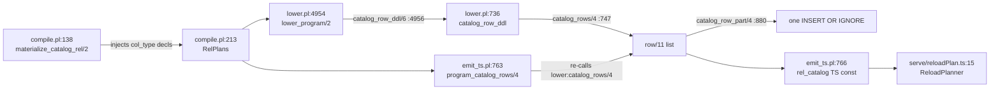
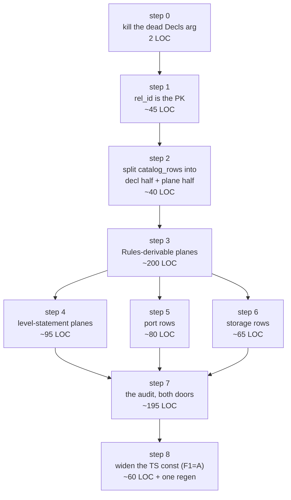
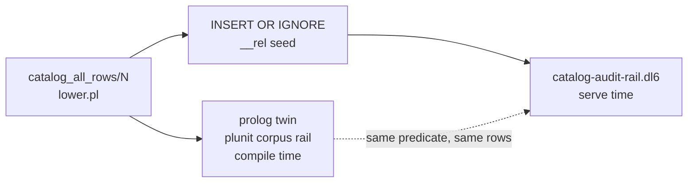

# Catalog as the plane backbone

One sentence: `__rel` today describes only the rels a user WROTE, and this plan
grows it to describe the tables the compiler DERIVES from them, so the
plane audit becomes a query over rows instead of a scan over SQL strings.

Base: `26f6e06f` (main). Written after PRs #44 #47 #48 #50 #51 #52 landed, so
every pin the parked spec carried was re-measured against that tree.

## Table of contents

| § | section | what it answers |
| --- | --- | --- |
| 1 | [The seam as it stands](#1-the-seam-as-it-stands) | which predicate owns what, at which line |
| 2 | [Receipts drift](#2-receipts-drift) | every inherited pin, re-measured |
| 3 | [The corpus, measured today](#3-the-corpus-measured-today) | row counts, plane counts, byte share |
| 4 | [The one design call: append-only id blocks](#4-the-one-design-call-append-only-id-blocks) | why no step renumbers |
| 5 | [Catalog DDL proposal](#5-catalog-ddl-proposal) | the surrogate-key fix, priced |
| 6 | [The row vocabulary](#6-the-row-vocabulary) | every new kind, column by column |
| 7 | [Step ladder](#7-step-ladder) | 7 steps, files, LOC, gates, blast radius |
| 8 | [Audit as a query](#8-audit-as-a-query) | the .dl6 rail, its rx lowering, the prolog twin |
| 9 | [Forks priced](#9-forks-priced) | six calls a lane must not take alone |
| 10 | [ARCH task rows](#10-arch-task-rows) | paste block |
| 11 | [Open for the user](#11-open-for-the-user) | what needs a word |

---

## 1. The seam as it stands



| fact | file:line |
| --- | --- |
| contract, 11 columns | `v6/prolog/lower.pl:676-679` |
| child-walk index, the only hand-minted DDL | `v6/prolog/lower.pl:683-684` |
| `catalog_rows/4`, the row producer | `v6/prolog/lower.pl:745-762` |
| positional id blocks: primitives, lists, module, rels+columns | `v6/prolog/lower.pl:750-762` |
| pass A id reservation `1 + RelArity` per rel | `v6/prolog/lower.pl:821-824` |
| pass B rel + column rows | `v6/prolog/lower.pl:828-860` |
| `catalog_column_type_id/4`: list, ref, then primitive | `v6/prolog/lower.pl:864-869` |
| `catalog_type_id/2`, five primitives plus a `0` default | `v6/prolog/lower.pl:873-878` |
| interned seed literals (the fifth bypass door's fix) | `v6/prolog/lower.pl:893-897` |
| stated future design: new facts are ROWS, never columns | `v6/prolog/lower.pl:911` (`TODO(g3)`) |
| stated blocker: a DDL seed emits no delta at any tick | `v6/prolog/lower.pl:910` (`TODO(g2)`) |
| contract injected as col_type decls | `v6/prolog/compile.pl:138-149` |
| catalog subtracted from ArrivalTargets | `v6/prolog/compile.pl:196-200` |
| reserved-namespace read allowance | `v6/prolog/compile.pl:239, 252-264` |
| TS const emitted for EVERY module, reload-comparison reason | `v6/prolog/emit_ts.pl:762-763` |
| `IRelCatalogRow`, kind union of 5 words | `v6/tsv2/runtime/types.ts:378-390` |
| ReloadPlanner reads `kind === "rel"` only | `v6/tsv2/serve/reloadPlan.ts:15` |
| h_schema drift verdict `recreate`, h_rule drift verdict `refill` | `v6/tsv2/serve/reloadPlan.ts:33-38` |

### The plane families the catalog does not yet name

Every one is minted inside `lower_program/2` from data already in scope there.

| plane | table template | mint site | existence condition | derivable from |
| --- | --- | --- | --- | --- |
| delta | `__delta_<rel>` | `lower.pl:4588-4626` | every relplan | RelPlans |
| frontier | `__frontier_<rel>` | `lower.pl:4608-4614` | every relplan | RelPlans |
| next frontier | `__next_frontier_<rel>` | `lower.pl:4618-4622` | every relplan | RelPlans |
| departure frontier | `__departure_frontier_<rel>` | `lower.pl:4557-4566` | `listened_departure_refs/2` | Rules |
| decode view | `__txt_<table>` | `lower.pl:1195-1216` | dict mode AND a text column | Mode + RelPlans |
| pre | `__pre_<rel>` | `lower.pl:4568-4584` | `level_body_pre_ref/2` | Rules |
| refCount | `__support_next_<rel>` | `lower.pl:4680` | one per level statement | LevelStatements |
| refCount staging | `__new_<rel>` | `lower.pl:3025` | one per level statement | LevelStatements |
| aggregate scope | `__agg_scope_<rel>` | `lower.pl:2886-2918` | aggregating level statement | LevelStatements |
| avg accumulator | `__avg_acc_<rel>` | `lower.pl:2531` | avg aggregate | LevelStatements |
| expand wave | `__expand_a_/__expand_b_<rel>` | `lower.pl:4662` | expand plan present | LevelStatements |
| dred wave | `__ping_/__pong_/__cone_<rel>` | `lower.pl:4643` | dred plan present | LevelStatements |
| string dictionary | `__str` | `lower.pl:1070` | dict mode with a text column | Mode + RelPlans |
| reference dictionary | `__ref_<Type>` | `lower.pl:1379` | declared struct type | Decls |
| host / bind port | `__host_demand_<n>`, `__host_response_<n>` | `1_host_expand.pl:360` | `sh_decl/4`, `bind_decl/2` | Decls |

The split that drives the step ladder: rows 1-6 and 13-15 need only
`(Mode, Rules, RelPlans, Decls)`, all four of which `emit_ts.pl:2724` can already
reach. Rows 7-12 need `RuleLevelStatements`, which `lower_program/2` builds at
`lower.pl:4939` and `emit_program_lines` also holds (it feeds
`incremental_level_statement_lines` at `emit_ts.pl:2737`).

---

## 2. Receipts drift

Every pin inherited from the parked spec, `CLAUDE.md`, or the session save,
re-measured on `26f6e06f` today.

| pin as inherited | source | measured 2026-08-08 | verdict |
| --- | --- | --- | --- |
| `catalog_rows/4` at `lower.pl:744-800` | parked spec | `catalog_rows/4` at `745-762`; the family spans `673-911` | RESTATE the span |
| the builder threads `Decls` | pre-#52 | `catalog_rows/4` takes no Decls; `catalog_row_ddl/6` at `:736` STILL declares a `Decls` head argument that its body never reads | STALE + live defect |
| that dead argument is harmless | assumption | `swipl -q -g "consult(lower)"` prints `Warning: Singleton variables: [Decls]` on every load | DEFECT, reproduced |
| `catalog_type_id(_, 0)` collapses ref/struct/list | parked spec | ref resolves via `rel_row_id/3` and list via `list_row_id/3` (`lower.pl:864-867`); the `0` clause is unreachable for every storage kind `column_storage/3` admits (`0_type_plane.pl:77-127` is a closed set: int, text, json, list(E), bool, float, ref(Name), otherwise a throw) | STALE, the type IR seed already grew |
| `compile.pl:136-239` holds the contract | parked spec | `materialize_catalog_rel/2` `138-149`; contract read `198-200`; `compiler_owned_contract/1` `239` | HOLDS |
| ruling `catalog_universe` | `rulings.pl:613` | present, unchanged, binds this plan | HOLDS |
| ruling `block_lowering_first` | `rulings.pl:608` | present; children land as FLAT rels with mangled names PLUS catalog rows relating them, which is the same parent_id mechanism this plan extends | HOLDS, and directly on point |
| ruling `effect_decl_no_arrow` | `rulings.pl:622` | appended today; response = rightmost columns, effect-ness only from a bind at link time | HOLDS, fixes the `port` row shape |
| `__rel` has an 11-column composite PK, "all-INTEGER now" | session save | true under dict; under `direct` five of the eleven PK columns are TEXT (`local_name, kind, h_id, h_schema, h_rule`), receipt `plunit_tests.pl:836` | SHARPENED: it is a literal composite-TEXT-PK defect in one of two live modes |
| conformance 310/0 | session save | 320 PASS / 0 FAIL, re-run today | GREW |
| plunit 474 | session save | 485 tests, 0 failures, one choicepoint warning at `plunit_tests.pl:6113` | GREW |
| manifest 306 fixtures | `CLAUDE.md` | 320 rows: 220 `compiled`, 100 `unsupported` | GREW |
| ARCH is `task/5` + `fork/5` | `CLAUDE.md` | `task/3` (`ARCH.pl:924-932`), `fork/5` (`ARCH.pl:615`) | CLAUDE.md wrong on task arity |
| ARCH gate `swipl -g go -t halt ARCH.pl` | `CLAUDE.md` | `swipl -q -l v6/prolog/ARCH.pl -g go -g halt` per `v6/justfile:63`; 7 PASS today | RESTATE the invocation |
| `catalogRows.test.ts` header: "type_id ... is 0 when the type is not one of the five primitives" | `v6/tsv2/tests/catalogRows.test.ts:28-30` | false since #44 and #48 | STALE comment, fix in step 1 |
| `IRelCatalogRow.kind` admits `list` | PR #50 | `types.ts:383` union is `primitive \| list \| module \| rel \| column` | HOLDS |
| no executing fixture reads a catalog text column (catalog_g2) | session save | still true, and `5_compiler_quality.pl:249-252` records WHY: the oracle holds no `__rel`, so any conformance fixture reading it is FINAL_WRONG by construction | HOLDS, and it is a hard block on step 6 |
| the intern-mode crossing is unguarded at serve | assumption worth checking | guarded at `serve/3_engine.ts:241-266` by `__str` presence, before any DDL runs | NO HOLE; the storage rows buy queryability, not safety |
| rowid+UNIQUE is 5.4-7.6% slower than WITHOUT ROWID | I-E, PR #43 | not re-measured here | INHERITED, cited only |

---

## 3. The corpus, measured today

Counted over `v6/prolog/compile/out/*.ts`, 220 emitted modules.

| measure | min | median | max | total |
| --- | --- | --- | --- | --- |
| catalog rows per module | 8 | 13 | 69 | 3720 |
| `kind: "rel"` rows per module | 1 | 3 | 20 | 776 |
| derived plane objects per module | 3 | 13 | 119 | 4458 |
| `rel_catalog` share of module bytes | 5.1% | 7.7% | 11.2% | |

Plane objects by family, whole corpus:

| family | count |
| --- | --- |
| decode view `__txt_` | 1264 |
| delta | 776 |
| frontier | 776 |
| next frontier | 776 |
| refCount `__support_next_` | 273 |
| refCount staging `__new_` | 273 |
| string dictionary `__str` | 191 |
| reference dictionary view `__ref_` | 46 |
| aggregate scope | 37 |
| pre | 18 |
| dred ping/pong/cone | 12 |
| expand a/b | 8 |
| departure frontier | 6 |
| avg accumulator | 2 |

Reading: naming every plane in the catalog adds 4458 rows against 3720 today, so
the table grows 120% and the median module goes 13 rows to 26. The
`rel_catalog` TS const would go from 7.7% of a module's bytes to roughly 15%.
That number is the reason §4 exists.

---

## 4. The one design call: append-only id blocks

`lower.pl:734` states the current invariant: ids are positional for a
byte-stable recompile. Blocks today run primitives, list rows, module, then
each rel followed by its columns.

The call this plan takes: **every new family is a new block APPENDED after the
existing ones, and no existing id ever moves.**

```
[1..5]        primitives                      unchanged
[6..]         list rows                       unchanged
[.]           module                          unchanged
[.. .]        rels + their columns            unchanged   <- the TS const stops here
[.. .]        plane rows          (step 3)    new block
[.. .]        level-plane rows    (step 4)    new block
[.. .]        port rows           (step 5)    new block
[.. .]        storage rows        (step 6)    new block
```

Three consequences worth the price of the constraint:

1. `type_id` on every existing column row keeps pointing at the same list or
   rel row, so the two-pass id assignment PR #44 landed does not have to be
   redesigned.
2. `program_catalog_rows/4` (`emit_ts.pl:763`) can keep emitting ONLY the
   decl blocks into the TS const. All 220 emitted modules then stay
   byte-identical through steps 3-6, and `text-door`, `sweep`, and
   `compile-speed` never need a re-pin. Widening the TS const is deferred to
   the step that gives `ReloadPlanner` a reason to read those rows.
3. The seed INSERT and the TS const stop being the same list, so
   `catalog_rows/N` splits into a decl half and a plane half. That split is
   itself the deliverable of step 3.

The rejected alternative was interleaving plane rows next to their source rel
for locality. It renumbers every id after the first rel, dirties 220 emitted
modules per step, and buys nothing the `__rel_parent(parent_id, local_name)`
index does not already buy.

---

## 5. Catalog DDL proposal

### 5.1 What is emitted today

```sql
CREATE TABLE "__rel" (
  "rel_id" INTEGER NOT NULL, "parent_id" INTEGER NOT NULL, "ordinal" INTEGER NOT NULL,
  "local_name" TEXT NOT NULL, "kind" TEXT NOT NULL, "type_id" INTEGER NOT NULL,
  "arity" INTEGER NOT NULL, "module_id" INTEGER NOT NULL,
  "h_id" TEXT NOT NULL, "h_schema" TEXT NOT NULL, "h_rule" TEXT NOT NULL,
  PRIMARY KEY ("rel_id","parent_id","ordinal","local_name","kind","type_id",
               "arity","module_id","h_id","h_schema","h_rule")
) WITHOUT ROWID;
```

Receipt: `plunit_tests.pl:836` (direct mode, the TEXT spelling above) and
`:848` (dict mode, every column INTEGER). Under `direct` this is a composite
PRIMARY KEY over five TEXT columns, which `.claude/skills/sql-relational-design`
calls a DEFECT in plain words, not a style choice.

Why it happens: `__rel` is a `set` relplan that is neither edge-headed nor an
arrival target (the catalog is deliberately subtracted at `compile.pl:200`), so
`rel_ddl/6`'s key guard at `lower.pl:1286-1292` cannot fire and `PkSql` falls
through to every column.

### 5.2 What it should be

```sql
CREATE TABLE "__rel" (
  "rel_id" INTEGER NOT NULL, "parent_id" INTEGER NOT NULL, "ordinal" INTEGER NOT NULL,
  "local_name" TEXT NOT NULL, "kind" TEXT NOT NULL, "type_id" INTEGER NOT NULL,
  "arity" INTEGER NOT NULL, "module_id" INTEGER NOT NULL,
  "h_id" TEXT NOT NULL, "h_schema" TEXT NOT NULL, "h_rule" TEXT NOT NULL,
  PRIMARY KEY ("rel_id")
) WITHOUT ROWID;
CREATE INDEX IF NOT EXISTS "__rel_parent" ON "__rel" ("parent_id","local_name");
```

`rel_id` is already the dense surrogate the whole table is built around
(`lower.pl:750-762` assigns it positionally, `catalog_column_type_id/4` points
at it, `reloadPlan.ts` walks parent links by it). Making it the declared key is
recording a fact the producer already guarantees.

Three properties this buys:

| property | before | after |
| --- | --- | --- |
| index key width | 11 columns copied into the `__rel_parent` btree | 1 column |
| `WHERE rel_id = ?` | scan or a wide-prefix probe | one integer probe |
| law compliance under `direct` | composite TEXT PK, a named defect | integer surrogate |

### 5.3 How to get it without a second DDL path

Add beside the contract in `lower.pl`:

```prolog
%! catalog_ddl_key(+CatalogName, -KeyPositions) is semidet.
%   rel_id is dense and positional by construction (catalog_rows/N), so the
%   table declares what the producer already guarantees.
catalog_ddl_key('__rel', [1]).
```

and widen the `rel_ddl/6` set-arm guard at `lower.pl:1286` from

```prolog
( ( memberchk(Ref, EdgeHeadedRefs) ; memberchk(Ref, ArrivalTargetRefs) ),
  KeyOrNone = key(KeyPositions) -> ... )
```

to admit a third disjunct `catalog_ddl_key(Name, KeyPositions)`. The guard stays
narrow on purpose. A level-headed rel with a declared key must keep its
all-column PK, because that PK is what `__refcount` dedups against
(`lower.pl:1295-1297`); loosening the guard for level rels would be a different,
wrong change.

### 5.4 The `kind` column stays TEXT

Under dict, `kind` is physically an interned integer already
(`catalog_text_sql/3`, `lower.pl:893-897`), so the stringly-typed complaint is
answered on disk by the door that already exists. Turning it into `kind_id`
would change `IRelCatalogRow.kind` from a string union to a number and force
`reloadPlan.ts:15` to look up a constant. Recorded as fork F4 rather than taken.

### 5.5 No new columns, ever

`lower.pl:911` already states the rule for this table: nesting, generics and
column types land as ROWS, and `__catalog_annotation` is the only future DDL
statement contemplated. Every move in this plan obeys that, including the
storage axis (step 6), which the parked spec sketched as a column. Reasons the
row spelling wins: zero contract rev, zero arity change, so
`catalog_gate_is_arity_exact` (`plunit_tests.pl:887`) keeps passing and no user
program reading `__rel/11` breaks.

---

## 6. The row vocabulary

Existing kinds: `primitive`, `list`, `module`, `rel`, `column`.

New kinds and their column meanings. `h_rule` stays `''` for every new kind,
because none of them has a derivation of its own to fingerprint.

| kind | parent_id | ordinal | local_name | type_id | arity | h_id | h_schema |
| --- | --- | --- | --- | --- | --- | --- | --- |
| `delta` | source rel's rel_id | 0 | `__delta_<rel>` | 0 | plane column count | `rel_h_id` under the rel's h_id | fingerprint of the plane's own column list |
| `frontier` | source rel's rel_id | 0 | `__frontier_<rel>` | 0 | plane column count | same | same |
| `next_frontier` | source rel's rel_id | 0 | `__next_frontier_<rel>` | 0 | plane column count | same | same |
| `departure` | source rel's rel_id | 0 | `__departure_frontier_<rel>` | 0 | plane column count | same | same |
| `view` | the row of the table it decodes (rel row OR delta row) | 0 | `__txt_<table>` | 0 | view column count | same | same |
| `pre` | source rel's rel_id | 0 | `__pre_<rel>` | 0 | plane column count | same | same |
| `scope` | head rel's rel_id | 0 | `__agg_scope_<head>` | 0 | scope column count | same | same |
| `refcount` | head rel's rel_id | 0 | `__support_next_<head>` | 0 | column count | same | same |
| `dictionary` | module_id | 0 | `__str` or `__ref_<Type>` | for `__ref_`, the type's rel row id | column count | same | same |
| `port` | module_id | 0 | the sh or bind name | the demand rel's rel_id | input column count | `rel_h_id` under the module hash | `''` |
| `port_response` | the port row's rel_id | 0 | the response rel's name | the response rel's rel_id | response column count | same | `''` |
| `storage` | the COLUMN row's rel_id | the column's ordinal | `interned_id` or `raw_characters` | 0 | 0 | `rel_h_id` under the column's h_id | `''` |

Notes that are constraints, not commentary:

- A `view` over a delta table parents on the DELTA row, giving a two-level
  plane tree that the existing `__rel_parent(parent_id, local_name)` index
  walks without change.
- Plane rows get NO child `column` rows. A plane's columns are the source rel's
  columns plus a known tag pair (`_sign`/`_sequence` for delta,
  `_phase`/`_sequence` for the frontier family). Materializing them would add
  roughly 4458 more rows for a fact `arity` plus the source link already
  answers. Fork F3 if that turns out to be wrong.
- `port` uses `type_id` as "the rel this row points at", which is exactly what
  a `column` row's `type_id` already means for `ref(_)` (`lower.pl:866`). One
  meaning, one column.
- `storage` carries the answer of `interned_column(Mode, ColumnType)`
  (`lower.pl:1064`, a single fact). Putting it in the catalog turns the
  implicit knowledge the doors-1-through-5 autopsy found at 121 SQL-string
  sites into a row anything can read.

---

## 7. Step ladder



Steps 4, 5 and 6 are independent of each other and can be three lanes with
disjoint predicate ownership inside `lower.pl`. Steps 0-3 are strictly
sequential.

LOC figures are source plus tests, counted as new-or-changed lines.

### Step 0. Delete the dead `Decls` argument

| field | value |
| --- | --- |
| files | `v6/prolog/lower.pl:736` (head), `:4956` (the one call site) |
| LOC | 2 changed |
| change | `catalog_row_ddl/6` becomes `/5`, dropping `Decls` |
| gate | `cd v6/prolog && swipl -q -g "consult(lower),halt" -t halt 2>&1 \| grep -c Warning` prints `0` |
| gate | `cd v6 && just plunit` 485+ / 0 fail |
| breaks | nothing; the argument has no reader |
| receipt to state in the PR | the singleton warning, reproduced before and absent after |

This is PR #52's last inch. Land it alone so the warning-count gate has a clean
before and after.

### Step 1. `rel_id` becomes the primary key

| field | value |
| --- | --- |
| files | `lower.pl` (+`catalog_ddl_key/2` beside `:676`, guard at `:1286`), `compile/test/plunit_tests.pl:836,848`, `v6/tsv2/tests/catalogRows.test.ts:57` and its stale header at `:28-30` |
| LOC | ~20 source, ~25 test |
| gates | `just plunit`; `just tsv2-test`; `just text-door` 196/196/0; `git diff --stat v6/prolog/compile/out` shows ZERO files |
| breaks | the two hard-coded DDL strings in plunit and the one in `catalogRows.test.ts`. No emitted module changes, because no fixture in the corpus names `__rel` (`program_uses_catalog/2`, `analyze.pl:199`, is false for all 320). |
| new tests | one asserting `PRIMARY KEY ("rel_id")` in both modes; one EXPLAIN receipt that `WHERE rel_id = ?` reports SEARCH, matching the existing parent-index receipt style in `catalogRows.test.ts` |
| sabotage receipt to record | revert the guard and the DDL string test fails naming the 11-column PK |

### Step 2. Split the producer

| field | value |
| --- | --- |
| files | `lower.pl:745-762`, `emit_ts.pl:762-764` |
| LOC | ~40 |
| change | `catalog_rows/4` keeps producing the DECL blocks and keeps its exact current output. A new `catalog_all_rows/N` appends plane blocks after it and is what `catalog_row_ddl/5` renders. `program_catalog_rows/4` keeps calling `catalog_rows/4`. |
| gates | `just plunit`; `just text-door`; zero-diff on `compile/out` |
| breaks | nothing yet; step 2 is the scaffold with an empty plane half |
| why separate | this is the step that makes the byte-neutrality of steps 3-6 structural instead of accidental |

### Step 3. The Rules-derivable planes

Families: `delta`, `frontier`, `next_frontier`, `departure`, `view`, `pre`,
`dictionary`. Together 3097 of the 4458 plane objects.

| field | value |
| --- | --- |
| files | `lower.pl` (new `catalog_plane_rows/N` family near `:860`), call sites `:4956` and `emit_ts.pl:763` |
| LOC | ~110 source, ~90 test |
| new inputs | `Mode` (already an argument of `catalog_row_ddl`), `DepartureRefs` (from `listened_departure_refs/2`, which `emit_ts.pl:2713` already calls), `PreRefs` (from `level_body_pre_ref/2`, and `emit_ts.pl:2714` already calls `plan_pre_refs/2`) |
| id rule | plane ids start at `FinalId` returned by `catalog_rel_rows/9`, so nothing before them moves |
| gates | `just plunit`; `just conformance` 320/0; `just text-door` 196/196/0; `just sweep` RUN wrong=0 emitted_crash=0; `just compile-speed` regressions=0; `git diff --stat v6/prolog/compile/out` shows ZERO files |
| breaks | the risk is the plane-existence predicate disagreeing with the DDL mint site. A `view` row that exists when `text_view_ddls/6` emitted nothing is a row that lies. |
| the test that must exist | for every emitted module, the set of `CREATE ... "__x"` table names in `ddl` equals the set of plane-row `local_name` values. That is a corpus-wide family check in the shape of the interned-storage rail at `plunit_tests.pl:5877`, not a per-fixture check. |

That last test is the single highest-value artifact in the plan. It is the
mechanism that stops the sixth bypass door.

### Step 4. The level-statement planes

Families: `scope`, `refcount`, `refcount staging`, `expand`, `dred`,
`avg accumulator`. 605 objects.

| field | value |
| --- | --- |
| files | `lower.pl`, `emit_ts.pl` |
| LOC | ~55 source, ~40 test |
| new input | `RuleLevelStatements`, held at `lower.pl:4939` and at `emit_ts.pl` (it feeds `incremental_level_statement_lines`) |
| gates | as step 3 |
| breaks | `catalog_row_ddl` moves no earlier than `lower.pl:4941`, which is already true. The ordering constraint becomes critical and must be stated at the call site as a comment about the constraint, per the comment budget. |

### Step 5. Port rows

| field | value |
| --- | --- |
| files | `lower.pl` (re-thread `Decls` into the plane half only), `emit_ts.pl` |
| LOC | ~45 source, ~35 test |
| binds | ruling `effect_decl_no_arrow` (`rulings.pl:622`): one relation, response is the rightmost columns, effect-ness comes only from a bind existing at link time. So a `port` row's `arity` is the INPUT count and the response rel is a child row; a `bind_decl` produces a port row with no `port_response` child. |
| gates | as step 3, plus a plunit case over `2_hosts_wiring.pl`'s nine fixtures |
| breaks | this re-opens the Decls thread PR #52 cut. Fine, and worth saying out loud in the PR: #52 cut it because it had NO reader; step 5 arrives with one. Thread it into the plane half only, never back into `catalog_rows/4`. |

### Step 6. Storage rows

| field | value |
| --- | --- |
| files | `lower.pl` |
| LOC | ~35 source, ~30 test |
| change | one `storage` child row per `column` row, `local_name` in `{interned_id, raw_characters}`, answered by `interned_column(Mode, ColumnType)` at `lower.pl:1064` |
| gates | as step 3 |
| breaks | nothing. Note the exact scope: `serve/3_engine.ts:241-266` already refuses an intern-mode crossing before any DDL runs, so these rows close no safety hole. They make the storage axis queryable, which is what the audit needs. |
| cost | +1 row per column row. Column rows are the bulk of the 3720, so this is the second-largest single addition after `view`. |

### Step 7. The audit, both doors

| field | value |
| --- | --- |
| files | `v6/prolog/compile/test/plunit_tests.pl` (prolog twin), `v6/dl/fixtures/catalog-audit-rail.dl6`, `v6/tsv2/scripts/catalog-audit-rail.sh`, `v6/justfile` (one recipe) |
| LOC | ~60 dl6, ~50 prolog, ~25 shell, ~1 recipe, ~60 assertions |
| gates | the new recipe, plus `just green-all` before the PR |
| blocked path | a CONFORMANCE fixture is impossible. `5_compiler_quality.pl:249-252` records the reason: the oracle holds no `__rel`, so any fixture reading it is FINAL_WRONG by construction. Lifting that is fork F5. |

---

### Step 8. Widen the TS const (F1 = A)

| field | value |
| --- | --- |
| files | `emit_ts.pl` (`program_catalog_rows/4` renders plane blocks too), tsv2 catalog row typing |
| LOC | ~60, plus the one deliberate 220-file regen |
| change | the emitted `rel_catalog` const gains the plane rows (mode, departure refs, pre refs, level refs); `as const` literal types expose them to host-app TS (insert-into-derived becomes a compile-time error surface) |
| gates | `just sweep` oracle-identical; `just text-door`; the `compile/out` regen committed deliberately in its own PR; compile-speed re-pin in the same PR |
| breaks | every emitted module regenerates ONCE, by design (rulings.pl `catalog_plane_in_const`) |

## 8. Audit as a query

### 8.1 The clock problem, stated first

`lower.pl:910` (`TODO(g2)`) records it: a DDL-time seed emits no delta at any
tick, so a rule whose only body atom is `__rel(...)` compiles and then never
fires. The plunit `catalog_program/1` at `plunit_tests.pl:150-154` is exactly
that shape and is a COMPILE receipt, never an execution one.

So a serve-time rail needs an arrival to be its clock. `comment-prod.dl6:22`
already uses this pattern with `rel staged_probe(index_digest: text)`, and the
rail below copies it.

### 8.2 The .dl6 rail

The audit chosen: every column whose storage is an interned id must have a
decode view on its rel. That is precisely the door-5 class from the interning
arc, expressed as rows.

```
# catalog-audit-rail.dl6 -- the plane audit as a query over __rel.
# The catalog is DDL-seeded and emits no delta, so the probe arrival is
# the clock and the catalog is the sampled side of the join.

rel audit_probe(run_id: int).

rel catalog_column(column_id: int, owning_rel_id: int, column_name: text).
catalog_column(column_id, owning_rel_id, column_name) <-
  audit_probe(_),
  __rel(column_id, owning_rel_id, _, column_name, "column", _, _, _, _, _, _).

rel interned_column(column_id: int, owning_rel_id: int, column_name: text).
interned_column(column_id, owning_rel_id, column_name) <-
  catalog_column(column_id, owning_rel_id, column_name),
  __rel(_, column_id, _, "interned_id", "storage", _, _, _, _, _, _).

rel decoded_rel(owning_rel_id: int).
decoded_rel(owning_rel_id) <-
  __rel(_, owning_rel_id, _, _, "view", _, _, _, _, _, _).

rel undecoded_interned_column(rel_name: text, column_name: text).
undecoded_interned_column(rel_name, column_name) <-
  interned_column(_, owning_rel_id, column_name),
  __rel(owning_rel_id, _, _, rel_name, "rel", _, _, _, _, _, _),
  not(decoded_rel(owning_rel_id)).
```

Stratification holds: `__rel` is a source rel with no rules, `decoded_rel` is
derived and negated one stratum up, and nothing in the cycle writes `__rel`
(`compile.pl:200` subtracts it from ArrivalTargets, so the write door is shut
by construction).

### 8.3 Its pure-rxjs lowering

Repo law: every .dl snippet shown carries the rx lowering it means. The
governing shape here is that a DDL-seeded table is a constant, and a rel head
write is `next`.

```ts
// __rel is seeded by DDL and never deltas, so in rx it is a constant, never
// a source. audit_probe is the clock.
const catalog$: Observable<readonly IRelCatalogRow[]> = of(rel_catalog);

const undecoded_interned_column$ = audit_probe$.pipe(
  withLatestFrom(catalog$),
  map(([_probe_rows, catalog]): readonly UndecodedFinding[] => {
    // in-memory list work is plain array code returning arrays
    const rel_name_by_id = new Map(
      catalog.filter((row) => row.kind === "rel").map((row) => [row.rel_id, row.local_name]),
    );
    const interned_column_ids = new Set(
      catalog.filter((row) => row.kind === "storage" && row.local_name === "interned_id")
             .map((row) => row.parent_id),
    );
    const decoded_rel_ids = new Set(
      catalog.filter((row) => row.kind === "view").map((row) => row.parent_id),
    );
    return catalog
      .filter((row) => row.kind === "column" && interned_column_ids.has(row.rel_id))
      .filter((row) => !decoded_rel_ids.has(row.parent_id))
      .map((row) => ({
        rel_name: rel_name_by_id.get(row.parent_id)!,
        column_name: row.local_name,
      }));
  }),
);
```

Operator-by-operator against the rule:

| dl body item | rx operator | why |
| --- | --- | --- |
| `audit_probe(_)` as first body atom | the source observable | the only ticking rel in the rule |
| `__rel(...)` in any position | `withLatestFrom(catalog$)` | sampled, never a source; a DDL seed produces no emission |
| a positive join between two `__rel` atoms | `map` with a `Map` lookup | in-memory list work stays plain array code |
| `not(decoded_rel(...))` | `map` with a `Set` membership test | negation over a derived rel that is fully known at sample time |
| head write | the observable's own `next` | one rel head write is one emission |

Operator count is 2, well under the nine-operator pipe ceiling the flip arc
found (`tick_pipe_split_lines/3`, session save). No `Subject`, no
`Subscription` field, no manual `subscribe`.

### 8.4 The compile-time twin

The same audit as a prolog predicate over the row list, so it runs inside
plunit against every fixture without a server.

```prolog
%! undecoded_interned_column(+Rows, -RelName, -ColumnName) is nondet.
%   The rail's serve-time .dl6 twin, over the SAME rows the seed renders.
undecoded_interned_column(Rows, RelName, ColumnName) :-
    member(row(ColumnId, OwningRelId, _, ColumnName, column, _, _, _, _, _, _), Rows),
    memberchk(row(_, ColumnId, _, interned_id, storage, _, _, _, _, _, _), Rows),
    memberchk(row(OwningRelId, _, _, RelName, rel, _, _, _, _, _, _), Rows),
    \+ memberchk(row(_, OwningRelId, _, _, view, _, _, _, _, _, _), Rows).
```

The plunit rail asserts this has zero solutions for every fixture in the corpus
at `intern(dict)`. Its sabotage receipt: force one `view` row to be dropped and
the rail names the rel.

### 8.5 The two doors, one row set



Agreement between the two is pinned the way `canonical_json_text/2` and
`ticklog.pl:value_json/2` are pinned today (`0_type_plane.pl:680-705`): a
byte-diff grade, with the header saying why the mirror exists.

---

## 9. Forks priced

| id | fork | option A | option B | recommendation |
| --- | --- | --- | --- | --- |
| F1 | plane rows in the TS const | emit them, `rel_catalog` goes 7.7% to ~15% of every module, 220 files regenerate per step | hold them in the SQL seed only until `ReloadPlanner` reads them | **RULED A (user 2026-08-09, rulings.pl catalog_plane_in_const)**: emit them; ladder stays SQL-first, the widening is step 8, one deliberate regen + re-pin |
| F2 | `catalog_rows` signature | grow it to `/8` with Mode, DepartureRefs, PreRefs, LevelStatements | keep `/4` for decls, add `catalog_plane_rows/N` beside it | **B** as scaffold (byte-neutrality is now scaffold-only under F1=A); step 8 may grow `/8` or render both halves |
| F3 | plane child columns | one `column` row per plane column, +4458 more rows | `arity` plus the source link, zero child rows | **B** until an audit needs a plane column by name |
| F4 | `kind` as text or id | `kind_id INTEGER` into a kind dictionary | keep the TEXT spelling, let the dict door intern it | **B**; under dict it is already an integer on disk, and A costs the `IRelCatalogRow.kind` union and `reloadPlan.ts:15` |
| F5 | conformance coverage | teach `conformance/ticklog.pl` to mint catalog rows so a fixture can read `__rel` and still grade | keep the catalog out of the oracle, cover it with plunit plus a serve-side rail | needs a user word; A is the only path that closes catalog_g2 as written |
| F6 | `h_schema` for a plane row | fingerprint the plane's own column list | copy the source rel's `h_schema` | **A**; a plane whose tag columns change without its source changing is exactly the drift worth catching |

---

## 10. ARCH task rows

Paste into `v6/prolog/ARCH.pl` beside the existing catalog row at `:924`. Shape
is `task/3` (`ARCH.pl:924-932`), verified today; `CLAUDE.md`'s "task/5" is
wrong and should be corrected in the same wave. Gate:
`swipl -q -l v6/prolog/ARCH.pl -g go -g halt` (7 PASS today, `v6/justfile:63`).

```prolog
task(catalog_row_ddl_dead_decls, unbuilt, [catalog_g1_producer]). % DEFECT FOUND 2026-08-08 by the backbone planning lane: PR #52 cut the Decls thread out of catalog_rows/4 but left the argument in catalog_row_ddl/6's head (lower.pl:736), where no clause body reads it. Receipt: `cd v6/prolog && swipl -q -g "consult(lower),halt" -t halt` prints `Warning: Singleton variables: [Decls]` on every load of the compiler. Fix = drop the argument, /6 becomes /5, one call site at lower.pl:4956. Gate = the warning count goes to zero and plunit stays 485/0.

task(catalog_rel_id_primary_key, unbuilt, [catalog_row_ddl_dead_decls]). % DEFECT 2026-08-08, the standing __rel PK complaint, measured: the emitted DDL keys on all ELEVEN columns (plunit_tests.pl:836 direct, :848 dict), and under intern(direct) five of them are TEXT, which .claude/skills/sql-relational-design calls a defect in plain words. Cause is not a design choice: __rel is a `set` relplan that is neither edge-headed nor an arrival target (compile.pl:200 subtracts it deliberately), so rel_ddl/6's key guard at lower.pl:1286 cannot fire and PkSql falls through to every column. Fix = catalog_ddl_key('__rel',[1]) beside the contract at lower.pl:676 plus a third disjunct in that guard, narrow on purpose because a level-headed rel's all-column PK is what __refcount dedups against (lower.pl:1295). Blast radius is THREE hard-coded DDL strings (plunit_tests.pl:836, :848, tsv2/tests/catalogRows.test.ts:57) and ZERO emitted modules, because program_uses_catalog/2 is false for all 320 fixtures.

task(catalog_plane_rows, unbuilt, [catalog_rel_id_primary_key]). % PLANNED 2026-08-08, plans/2026-08-08-catalog-backbone-PLAN.md. The compiler derives 4458 plane objects across the 220 emitted modules (view 1264, delta 776, frontier 776, next_frontier 776, refcount 273+273, __str 191, __ref_ 46, scope 37, pre 18, dred 12, expand 8, departure 6, avg_acc 2) and the catalog names none of them, so "which table belongs to which rel" lives only in SQL strings, which is the shape that produced five bypass doors in the interning arc. Move = new catalog kinds delta/frontier/next_frontier/departure/view/pre/dictionary/scope/refcount with parent_id = the source rel's rel_id, appended as their own ID BLOCK after the rel+column block so nothing renumbers and no emitted module changes bytes. Every plane is a function of data lower_program/2 already holds (Mode, listened_departure_refs/2, plan_pre_refs/2, RuleLevelStatements), all of which emit_ts.pl:2712-2737 also reaches. The gate that earns the arc: a corpus-wide family check, in the shape of the interned-storage rail (plunit_tests.pl:5877), asserting the set of emitted `CREATE ... "__x"` names EQUALS the set of plane-row local_names per module.

task(catalog_port_rows, unbuilt, [catalog_plane_rows]). % PLANNED 2026-08-08: sh_decl/4 and bind_decl/2 get `port` rows, with the demand rel in type_id (the same "points at a rel" meaning a column row's type_id already carries for ref(_), lower.pl:866) and a `port_response` child. Binds ruling effect_decl_no_arrow (rulings.pl:622): one relation, response is the rightmost columns, effect-ness comes ONLY from a bind existing at link time, so a bind port has no response child. Re-threads Decls into the PLANE half of the producer, which is the argument PR #52 cut for having no reader; this arc arrives with one.

task(catalog_storage_rows, unbuilt, [catalog_plane_rows]). % PLANNED 2026-08-08: one `storage` child row per column row, local_name in {interned_id, raw_characters}, answering interned_column(Mode, ColumnType) (lower.pl:1064, a ONE-CLAUSE fact whose answer the doors-1-through-5 autopsy found implicit at 121 SQL-string sites). Spelled as a ROW and not a column, per lower.pl:911's own stated design and to keep __rel at arity 11 so catalog_gate_is_arity_exact (plunit_tests.pl:887) holds. EXACT SCOPE: this closes no safety hole. serve/3_engine.ts:241-266 already refuses an intern-mode crossing on __str presence before any DDL runs. The rows make the storage axis QUERYABLE, which is what the audit rail needs.

task(catalog_audit_rail, unbuilt, [catalog_port_rows, catalog_storage_rows]). % PLANNED 2026-08-08: the plane audit as a query over the catalog, both doors on one row set. Compile-time = a plunit corpus rail over the row list; serve-time = v6/dl/fixtures/catalog-audit-rail.dl6 plus one v6/justfile recipe. The audit shipped first is the door-5 class: every column whose storage is interned_id must have a `view` row on its rel. CLOCK CONSTRAINT, stated at lower.pl:910 (TODO g2): a DDL seed emits no delta at any tick, so the rail needs an arrival as its clock; it copies comment-prod.dl6:22's staged_probe pattern. A CONFORMANCE fixture remains impossible for the reason 5_compiler_quality.pl:249-252 records (the oracle holds no __rel, so any such fixture is FINAL_WRONG by construction); closing catalog_g2 as written needs ticklog.pl to mint catalog rows and that is a user call.
```

---

## 11. Open for the user

| # | question | why it needs a word |
| --- | --- | --- |
| 1 | F5: should `conformance/ticklog.pl` mint catalog rows? | **RULED A (user 2026-08-09, rulings.pl catalog_oracle_meta)**: mint them; the oracle goes meta |
| 2 | F1: hold plane rows out of the emitted TS const? | **RULED A (user 2026-08-09)**: emit them; step 8 added to the ladder for the one deliberate widening |
| 3 | naming: `view` or `decode_view` for the `__txt_` kind | **`view`** per the language-vocabulary law (SQL word); no user word needed |
| 4 | order of steps 4, 5, 6 | they are independent and could be three concurrent lanes with disjoint predicate ownership, or one sequential lane |
| 5 | `CLAUDE.md` says ARCH is `task/5`; it is `task/3` | correct it in the same wave, or leave it |
