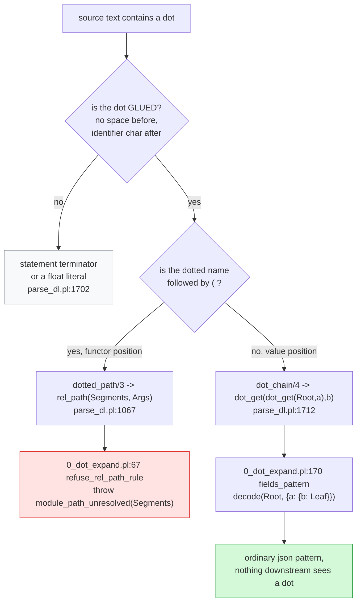

# Enums, dots, and type paths: what routes where

Every claim measured by running the compiler on 2026-08-08, never read off a
header. Reproduce with `bash v6/tools/enum-scenarios.sh`.

## Contents

- [First: the three test suites](#first-the-three-test-suites)
- [How every dot is routed](#how-every-dot-is-routed)
- [The two dot destinations, side by side](#the-two-dot-destinations-side-by-side)
- [json versus rel, for the same question](#json-versus-rel-for-the-same-question)
- [What an enum actually becomes](#what-an-enum-actually-becomes)
- [Enum scenarios, green and red](#enum-scenarios-green-and-red)
- [The type path story](#the-type-path-story)
- [Open design calls](#open-design-calls)

## First: the three test suites

They test different things, and the names do not say so.

| suite | lives in | input shape | what a pass proves |
| --- | --- | --- | --- |
| **golden** | `v6/dl/fixtures/*.dl6` (34 files) | real `.dl6` **text** | the text door parses and compiles the surface a human would type |
| **conformance** | `v6/prolog/conformance/fixtures/*.pl` (35 files, 308 fixtures) | prolog **terms** + an arrival schedule + expected deltas | the **semantics**: the prolog oracle and the TypeScript runtime produce byte-identical tick logs |
| **plunit** | `v6/prolog/compile/test/plunit_tests.pl` | direct calls to one predicate | one predicate behaves in isolation |

The useful way to hold it:

```
golden        "can you SAY it?"          text -> compiler, no execution
conformance   "do both engines AGREE?"   terms -> prolog oracle
                                              -> emitted TS runtime
                                              -> diff the two tick logs
plunit        "does this function work?" one predicate, one assertion
```

`v6/tsv2/scripts/sweep.sh` is what makes conformance the strong one. It compiles
every fixture, runs `conformance/ticklog.pl` over that fixture's own schedule to
get an oracle log, replays the same schedule against the **emitted TypeScript**,
and diffs. A fixture passing means two independent implementations agreed on
every row of every tick.

So a gap in conformance is a semantic blind spot, and a gap in golden is a
syntax blind spot. Enums have both, tabulated further down.

## How every dot is routed

The parser decides by **syntactic position**, before any phase runs. One rule
splits everything:

```
a dotted name FOLLOWED BY  (      ->  module path
a dotted name NOT followed by (   ->  member access
```



Measured, both arms:

```
out(id) <- module_a.some_rel_of_enums.enum_case_name(id, note).
  parse    findings=[]
  term     rel_path([module_a, some_rel_of_enums, enum_case_name], [Id, Note])
  compile  refused: module_path_unresolved

dcoord(FileRec.at.name, S, E) <- span(FileRec, S, E).
  term     dot_get(dot_get(FileRec, at), name)
  becomes  dcoord(Leaf, S, E) <- span(FileRec, S, E),
                                 decode(FileRec, {at: {name: Leaf}}).
```

The glue rule matters and is easy to trip over. `dot_then_ident/2` at
`parse_dl.pl:1702` requires the dot to sit against the identifier with an
alphanumeric or `_` immediately after. That is what keeps the statement-ending
period, a spaced `x . y`, and the `.` inside `1.5` all out of both routes.

## The two dot destinations, side by side

| | member access `Rec.a.b` | module path `mod.rel(...)` |
| --- | --- | --- |
| parsed into | `dot_get/2`, nested | `rel_path(Segments, Args)` |
| grammar slot | value position | functor position |
| segments | field names, receiver is a **variable** | atoms, a full path |
| what it becomes | `decode(Root, {a: {b: Leaf}})` | nothing, it is refused |
| receiver rule | must be a variable **this body binds**, else `unresolvable_member` | n/a |
| where it dies | erased in `1_expansion` before typing | `0_dot_expand.pl:67` |
| status | **works** | **refused, placeholder** |
| backed by `__rel`? | no, it is a json pattern | no, and this is where it should be |

Two more named refusals on the member-access side:

| refusal | trigger |
| --- | --- |
| `unresolvable_member(Path)` | the chain root is not a body-bound variable |
| `member_not_a_goal(Path)` | a dot chain sits where a goal belongs; unreachable from the text door, reachable from a term-door fixture |

`refuse_rel_path_rule` exists because SWI reads `a.b(X)` as `'.'(a, b(X))`, which
would otherwise silently become a relation literally named `'.'`. The stub is
catching a real hazard, and it is the slot the module resolver drops into.

## json versus rel, for the same question

The same question, "give me the name inside this thing", has two spellings, and
they differ in where the shape is checked.

| | json carrier | rel reference |
| --- | --- | --- |
| declaration | `rel doc(id: int, payload: json).` | `rel span(start: int, end: int).`<br/>`rel finding(path: text, at: span).` |
| access | `decode(payload, {name: Name})` or `payload.name` | ordinary join on `span` |
| shape checked | at decode time, per row | at **compile** time, by the type plane |
| absent field | rule does not fire | cannot happen, the column is `NOT NULL` |
| storage | TEXT with a `json_valid` CHECK | target `__id` as an INTEGER column |
| indexable | only through json1 expressions | yes, ordinary column |
| appears in `__rel` | `type_id = 5` | `type_id = 0` today, **should be the target's `rel_id`** |

The measured optionality result, three ticks, one program:

```
tick 1  doc(1, {"name":"alpha"})   ->  has_name(1,"alpha")
tick 2  doc(2, {"other":"beta"})   ->  no row          key ABSENT
tick 3  doc(3, {"name":null})      ->  no row          key present, value null
```

Tick 3 is the load-bearing line for the whole design: json `null` and a missing
key are **indistinguishable** to a pattern. Absence never becomes a value, so no
join ever meets three-valued logic, and every emitted column stays `NOT NULL`.

That is why json is the `Some` wrapper of this language. `decode` either binds
or it does not.

## What an enum actually becomes

Source:

```prolog
rel door(closed(note: text) ; open(note: text)).
```

Three tables, monomorphized:

```sql
CREATE TABLE "door_closed" ("id" INTEGER NOT NULL, "note" TEXT NOT NULL, ...)
CREATE TABLE "door_open"   ("id" INTEGER NOT NULL, "note" TEXT NOT NULL, ...)
CREATE TABLE "door_tag"    ("id" INTEGER NOT NULL, "tag" TEXT NOT NULL,
                            "__refcount" INTEGER NOT NULL DEFAULT 1,
                            PRIMARY KEY ("id","tag")) WITHOUT ROWID
```

`door_tag` is **derived**, not a source rel. Expansion appends one tag rule per
variant, so the tag rows maintain themselves incrementally, with a refcount and
a full delta family (`__delta_door_tag`, `_group`, `_sign`).

Retraction works, measured:

```
tick 1  +door_closed(1,"boot")   ->  door_tag +(1,closed)   seen +(1,closed)
tick 2  +door_open(1,"ready")    ->  door_tag +(1,open)     seen +(1,open)
tick 3  -door_closed(1,"boot")   ->  door_tag -(1,closed)   seen -(1,closed)
```

Tick 2 exposes a semantic surprise worth staring at. Row `1` gains the `open`
tag and **keeps** the `closed` one, because the tag table keys on `("id","tag")`.
An id can carry every variant at once. A sum type would key on `("id")` alone
and let the second arrival replace the first.

## Enum scenarios, green and red

Run `bash v6/tools/enum-scenarios.sh`. Each row is a real compile or a real
program run.

| # | scenario | today | covered by |
| --- | --- | --- | --- |
| 1 | declare an enum, two variants with fields | green | golden ×2, conformance ×2, plunit |
| 2 | variant rows round-trip with their fields | green | conformance |
| 3 | derived tag rel unions the variants | green | conformance ×2 |
| 4 | `match` on the tag rel with `==` guards | green | golden `:466`, `:532` |
| 5 | non-exhaustive `match` is refused | green | conformance ×1, plunit ×2 |
| 6 | variant name collision is refused | green | conformance ×1 |
| 7 | tag rel drives a keyed `<+` head | green | plunit `:1569` only |
| 8 | **retract a variant row, tag follows** | green | **nothing** |
| 9 | **nullary variant `none()`** | **RED**, invalid SQL | nothing |
| 10 | **enum name as a column type** | **RED**, refused | nothing |
| 11 | **dots onto a variant** | **RED**, refused | nothing |
| 12 | **one id holding two tags** | green, and probably wrong | nothing |

### Why 9 is red

```prolog
rel maybe_text(none() ; some(value: text)).
```

compiles clean, then emits

```sql
CREATE TABLE "maybe_text_none" ("id" INTEGER NOT NULL, PRIMARY KEY ()) WITHOUT ROWID
```

`PRIMARY KEY ()` is a syntax error in both SQLite builds this repo runs. The
program cannot boot. Every existing fixture gives every variant at least one
field, so this arm has never executed. `none()` is the arm that makes an enum an
Option, so this blocks the whole optionality story.

Bare `none` without parens is a parse error, so `none()` is the only spelling
that reaches the emitter.

### Why 10 is red

```prolog
rel grade(ripe(sugar: int) ; green(days: int)).
rel picked(id: int, g: grade).      % column_type_unknown
rel picked(id: int, g: grade_tag).  % column_type_unknown, and this table EXISTS
```

while a plain rel reference compiles:

```prolog
rel span(start: int, end: int).
rel finding(path: text, at: span).  % compiles
```

Both are spelled `rel`. The capability splits on variant-ness. Phase order is
the cause:

```
step 0  parse            enum_decl(grade, ...), col_type(picked/2, 2, grade)
step 1  parse_dl.pl:822  a name needs a relation_schema to become a type
step 2  parse_dl.pl:834  type_decl minted        -> grade SKIPPED
step 3  1_expansion:69   enum expanded           -> grade_* tables appear
step 4  0_type_plane:62  type_definitions scans for type_decl -> grade absent
step 5  0_type_plane:126 column_storage fails
step 6                   refused: column_type_unknown
```

`0_enum_expand.pl:12-16` warns about this exact hazard and mints `enum_context/2`
for it. Consumers are `0_match_expand.pl:22` and `1_expansion.pl:69`.
`0_type_plane.pl` mentions enums zero times.

### Why 11 is red

`grade.ripe(id, sugar)` parses as a **module path**, not as enum access, because
it sits in functor position. It hits `module_path_unresolved` like any other
dotted functor. Nothing in the language currently spells "this variant of that
enum".

## The type path story

A rel referencing another rel is the type system, and it works:

```prolog
rel span(start: int, end: int).
rel finding(path: text, at: span).
```

`0_type_plane.pl:1-30` states the encoding: the target carries `__id`, the parent
carries `target_id INTEGER`. Nested arrivals normalize into ordinary target
arrivals followed by the parent arrival, so membership is public and queryable
at that tick.

Three column shapes exist:

| shape | storage kind | `__rel.type_id` today |
| --- | --- | --- |
| `int` `text` `float` `bool` | itself | 1..4 |
| `json` | TEXT with a `json_valid` CHECK | 5 |
| `list(T)` | json carrier, typed view | **0** |
| `SomeRel` | target `__id` as INTEGER | **0** |
| `SomeEnum` | refused | n/a |

The two zeroes are the reason no generator can read a schema out of the
database yet. `catalog_type_id/2` at `lower.pl:766-771` maps the five primitives
and sends everything else to `0`.

## Open design calls

Three questions the code cannot answer.

| # | question | why it blocks something |
| --- | --- | --- |
| A | should `door_tag` key on `("id")` instead of `("id","tag")`? | decides whether an enum is a sum type or a set of tags; `g: grade` meaning "any variant" is ambiguous while an id can hold several |
| B | how does a column say "optional"? | three spellings already exist (json, nullary variant, split rel) and none is recorded in `__rel`, so every emitted schema marks all fields required |
| C | how does a declaration carry doc text? | no syntax exists; this is OpenAPI's `description` field |

A is new as of this lab and is the one that changes the enum fix.
