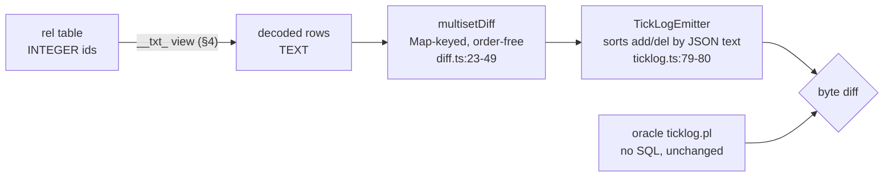
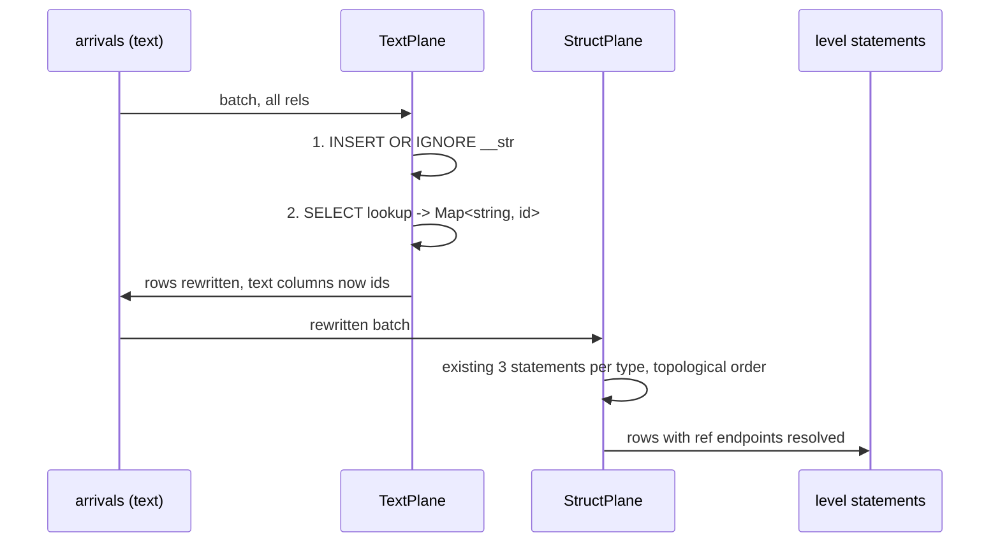
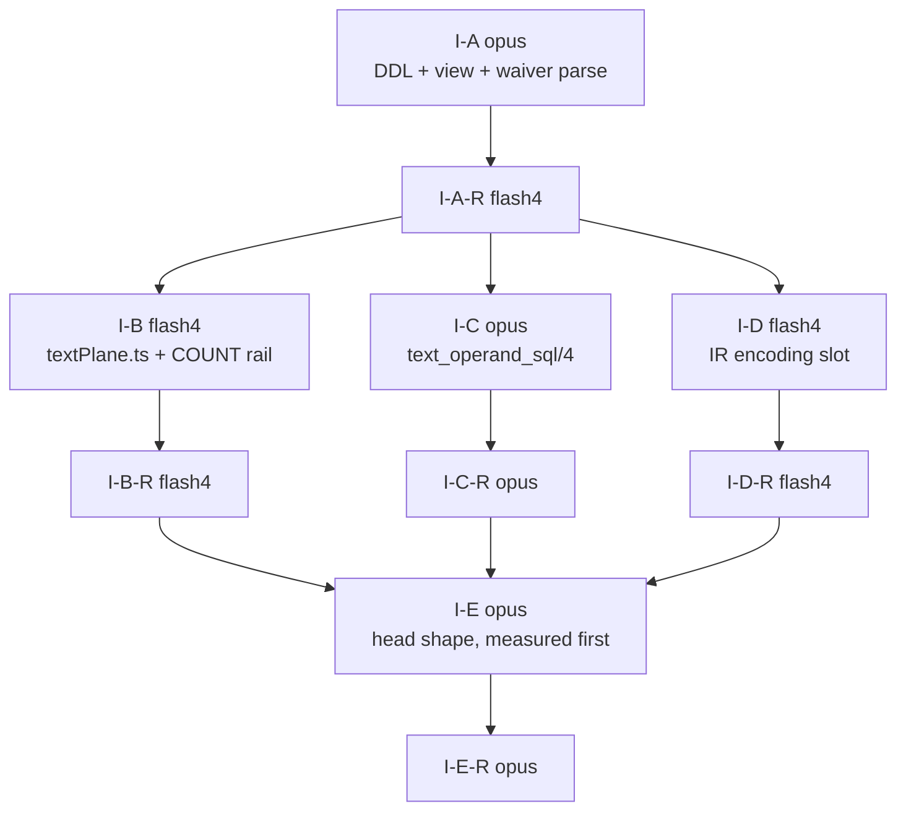
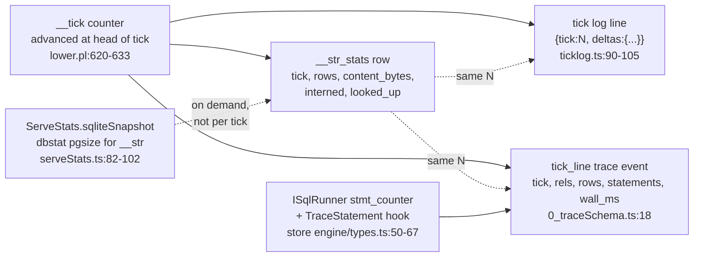
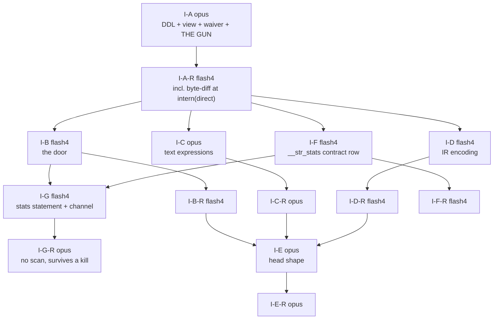

# Interning contract: dictionaries + views as the emitter default

Seed for task #4 (the second interning incident, laws set 2026-08-07). Base
`f650f2b7`. Feeds `plans/2026-08-07-plan-ir-offload-contract.md` §2.4's
`encoding` slot, which lane P1-A-R built and left empty for this document to
fill.

Plain-words twin: `plans/2026-08-08-interning-contract.visual.human.unga.md`.

## TOC

- [1. The decision, in one table](#1-the-decision-in-one-table)
- [2. What the emitter does today, cited](#2-what-the-emitter-does-today-cited)
- [3. Dictionary DDL: one global `__str`](#3-dictionary-ddl-one-global-__str)
- [4. The auto-join view, emitted in the same pass](#4-the-auto-join-view-emitted-in-the-same-pass)
- [5. Sort and compare at the render boundary](#5-sort-and-compare-at-the-render-boundary)
- [6. Ingest-door intern](#6-ingest-door-intern)
- [7. Head storage: rowid+unique vs WITHOUT ROWID](#7-head-storage-rowidunique-vs-without-rowid)
- [8. IR handshake](#8-ir-handshake)
- [9. The waiver: `direct`](#9-the-waiver-direct)
- [10. Migration across the 306-fixture corpus](#10-migration-across-the-306-fixture-corpus)
- [11. Lanes, ownership, two-pass law](#11-lanes-ownership-two-pass-law)
- [12. Phase gates with numbers](#12-phase-gates-with-numbers)
- [13. Known breaks](#13-known-breaks)
- [14. Receipts index](#14-receipts-index)
- [Amendment 2026-08-08 (user word)](#amendment-2026-08-08-user-word)
  - [15. The gun](#15-the-gun)
  - [16. Dictionary telemetry](#16-dictionary-telemetry)
  - [17. Lane table extension](#17-lane-table-extension)

---

## 1. The decision, in one table

| question | decision | argued in |
|---|---|---|
| is interning opt-in or the default? | **default** for every `text`-typed stored column; opt-out spelled `direct` | §9 |
| one dictionary per natural-key shape, or one global? | **one global `__str`** | §3 |
| when is the decode view emitted? | **in the same `rel_ddl/5` call that emits the table**, same returned list | §4 |
| what reads text? | the emitted view `__txt_<rel>`, and nothing hand-written | §4, §5 |
| what compares text? | nothing in the walk; every text comparison the language admits is identity, which survives interning | §5 |
| what breaks? | six statement families, all named, all with a decode fix | §5, §13 |
| head table shape | WITHOUT ROWID stays everywhere except recursive heads taking the rowid-range delta | §7 |
| how does the oracle stay the referee? | it never runs SQL; the sweep's tick-log diff is the migration receipt unchanged | §10 |

---

## 2. What the emitter does today, cited

Measured at base `f650f2b7` over `v6/prolog/compile/out/*.ts` (211 compiled
modules of 306 fixtures):

| fact | number | how |
|---|---|---|
| `CREATE TABLE` emitted | 754 | `grep -ho 'CREATE TABLE ' out/*.ts \| wc -l` |
| of those, `WITHOUT ROWID` | 569 | same grep, `WITHOUT ROWID` suffix |
| WITHOUT ROWID tables with >= 1 TEXT column in the PRIMARY KEY | **491** | regex over the DDL body, PK column names intersected with `"x" TEXT` column defs |
| modules affected | **167 of 211** | same script, distinct filenames |
| TEXT columns per affected PK | 1: 330, 2: 118, 3: 18, 4: 17, 6: 8 | same script |
| `CREATE TEMP VIEW "__ref_..."` already emitted | 45 across 21 modules | `grep -o` |

So the law's WRONG example (`sql-relational-design/SKILL.md:14-17`) is not a
hypothetical: 491 emitted tables are composite-or-single TEXT PKs under
`WITHOUT ROWID`, 86% of every WITHOUT ROWID table the compiler writes.

The two clauses that write them:

| site | what it does |
|---|---|
| `lower.pl:909-943` `rel_ddl/5`, set arm | two arms already exist. The `declared_type_name/2` arm (`:928-938`) emits `__id INTEGER PRIMARY KEY, <cols>, UNIQUE(<pk>)` **plus a `CREATE TEMP VIEW` in the same returned list** (`Ddls = [Ddl, ViewDdl]`, `:938`). The fallback arm (`:939-942`) emits `PRIMARY KEY (<cols>) WITHOUT ROWID` and one DDL |
| `lower.pl:951-976` `column_def/3` | `int`/`bool` -> INTEGER, `float` -> REAL, `ref(_)` -> INTEGER (`:964`), `json`/`text` -> TEXT (`:973-976`) |

The whole of task #4 is: move `text` from the second arm to the first, and make
the first arm's `Ddls = [Table, View]` shape the only shape. The emitter already
proves the pattern works; it applies it to declared struct types and to nothing
else.

Precedents, from `plans/2026-08-07-interning-archaeology.md`:

| gen | dictionary | auto-join view | outcome |
|---|---|---|---|
| v1 | one global `strings(id, value UNIQUE, norm, norm2)` | yes, `CREATE VIEW "<rule>"` per rule (`rule_tables.rs:110-136`) | purest form |
| v2, v3 | verbatim port | yes | held |
| v4 | fact store yes; new `runtime_graph` subsystem no | fact store TEMP VIEW; runtime_graph "deferred until verified live" (`app.rs:276-278`) | **died** |
| v5 | one global `_strings(id, content)` + dense `_sym_dict` | yes, `create_rel_view()` -> `rel_<name>_txt` (`src/engine/declare.rs:117-178`) | living reference |
| v6 | only `__ref_<type>` for declared struct columns | only for those | **died** |

The recorded killer sentence is v4's "deferred until verified live". §4 is
written to make that sentence unspellable.

---

## 3. Dictionary DDL: one global `__str`

### 3.1 Signature first

```prolog
% intern_ddl(-Ddls)
%   The dictionary is program-global and schema-free: one table, emitted once,
%   before every rel_ddl/5 output. No per-rel and no per-shape variant.
intern_ddl([StringTableDdl]).

% interned_column(+Decls, +Ref, +Column, +Type)
%   TRUE when a stored column takes dict('__str') encoding.
%   Pseudo-code:
%     Type == text,                       % json stays TEXT: json1 reads it in place
%     \+ direct_waiver(Decls, Ref, Column).
interned_column(Decls, Ref, Column, Type).
```

### 3.2 The DDL

```sql
CREATE TABLE "__str" (
  "__id"    INTEGER PRIMARY KEY,
  "content" TEXT NOT NULL UNIQUE
);
```

rowid table + `UNIQUE`, not `WITHOUT ROWID`. Reason, from `sqlite-costs`:
`__id` is read once per boundary render per column, and the existing receipt for
that read shape is `SEARCH d USING INTEGER PRIMARY KEY (rowid=?)`
(`lower.pl:1023-1024`, receipt in `v6/tsv2/tests/structPlane.test.ts`). Insert
side is the `rowid table + UNIQUE index ~1.34M rows/s` ladder row; the
dictionary is written once per DISTINCT string, never once per row, so its
insert rate is off the hot path by construction.

### 3.3 One global, argued

| argument | weight |
|---|---|
| **Cross-rel equality.** `reach(P) <- a(P), b(P)` lowers to `b0."p" = b1."p"` (`lower.pl:compile_comparison`, join equalities). Two dictionaries make that equality compare ids from different id spaces: silently empty, no refusal. Making it correct would need a decode on both sides of every text join, which is the hand-written string join this contract bans | **decisive** |
| Every prior generation that survived chose global: v1/v2/v3 `strings`, v5 `_strings` | strong precedent, `interning-archaeology.md` per-generation table |
| Per-shape would multiply the DDL: 491 affected tables carry ~700 TEXT key columns; per-column dictionaries mean ~700 extra tables and ~700 extra views | cost |
| Corpus shape favours sharing: the flagship TEXT key is `src/engine/lower/pass_{..}/module_{..}.ts` with a 24-byte shared prefix, 50 symbols per file, 40 files per directory (`REPORT-INTERN.md` §7). The same path string appears in many rels | fit |

Counterarguments, each recorded with its answer:

1. One hot btree. Under a future multi-writer the dictionary is the contention
   point. Today the runtime is single-writer through `ISqlSeam`, so this is a
   phase-2 concern, and the mitigation (shard by `content` hash prefix, ids stay
   globally unique) does not change any statement in this document.
2. No per-rel drop. Dropping a rel cannot drop its strings. §13 row 4.
3. `norm`-style normalized columns. v1's `strings` carried `norm`/`norm2`
   alongside `value`; v6's `norm/1` (`registry.pl:250`) computes on demand.
   Not adding `norm` to `__str` is a deliberate narrowing: `norm/1` has **zero**
   occurrences in the current corpus (`grep -o '__norm_chars' out/*.ts` = 0), so
   memoizing it now would be speculative.

### 3.4 Lifetime and uniqueness

| property | value |
|---|---|
| instance lifetime | one per database, created at boot alongside `__rel`/`__tick` catalog DDL (`lower.pl:624-765`) |
| growth | append-only within a run (`sql-relational-design/SKILL.md:47`) |
| dedup mechanism | the `UNIQUE` constraint plus `INSERT OR IGNORE`; no read-modify-write, no application-side set |
| id stability | stable within a run, NOT across runs, NOT across databases (§13 row 3) |
| NULL | impossible: `content TEXT NOT NULL UNIQUE`, and every emitted text column is already `TEXT NOT NULL` (`column_def/3:976`) |

---

## 4. The auto-join view, emitted in the same pass

**The structural rule, which is the whole point of this section:** `rel_ddl/5`
returns a LIST. An interned rel's clause returns a two-element list. There is no
second predicate, no second pass, no second lane, and no place where a table can
exist without its view. `lower.pl:938` already writes exactly this line for
declared struct types:

```prolog
Ddls = [Ddl, ViewDdl]
```

### 4.1 Signature

```prolog
% rel_ddl(+Types, +EdgeHeadedRefs, +ArrivalTargetRefs, +LevelHeadedRefs,
%         +RelPlan, -Ddls)
%   Ddls = [TableDdl]              when no column of the rel is interned
%   Ddls = [TableDdl, ViewDdl]     when >= 1 column is interned
%   NO OTHER SHAPE. The plunit gate is a length assertion over every relplan.

% text_view_name(+Ref, -Name)
%   '__txt_' ++ <table name>. Same '__' reserved namespace as __ref_, __new_,
%   __delta_, __frontier_, __ping_, __pong_, __cone_ (lower.pl grep of '__).
text_view_name(Ref, Name).

% text_view_ddl(+Ref, +Columns, +ColumnTypes, +Interned, -Ddl)
%   Pseudo-code:
%     for each column: interned -> (SELECT s."content" FROM "__str" s
%                                    WHERE s."__id" = t."<col>") AS "<col>"
%                      otherwise -> t."<col>"
%     plus every hidden column the table carries (__id, __refcount) verbatim,
%     so a reader of the view sees exactly the table's shape with text restored.
text_view_ddl(Ref, Columns, ColumnTypes, Interned, Ddl).
```

### 4.2 The emitted text

```sql
CREATE TEMP VIEW "__txt_rel_flow_reach" AS
SELECT (SELECT s."content" FROM "__str" s WHERE s."__id" = t."from_path") AS "from_path",
       (SELECT s."content" FROM "__str" s WHERE s."__id" = t."from_name") AS "from_name",
       (SELECT s."content" FROM "__str" s WHERE s."__id" = t."to_path")   AS "to_path",
       (SELECT s."content" FROM "__str" s WHERE s."__id" = t."to_name")   AS "to_name",
       t."__refcount"
FROM "rel_flow_reach" t;
```

Correlated scalar subquery rather than a `FROM`-clause LEFT JOIN, for the reason
`lower.pl:1017-1021` already gives for the struct case: the same expression text
drops into `delta_statement/2`'s SELECT list, the snapshot read, the final-state
read and the delta read with no restructuring. `TEMP` for the same reason
`__ref_` views are TEMP: per connection, never persisted, never migrated.

### 4.3 Who reads the view

| reader | site | change |
|---|---|---|
| tick-log delta read | `lower.pl:3957-3969` `delta_statement/2` `SelectSql` | `FROM "rel_<name>"` -> `FROM "__txt_rel_<name>"` |
| tick-log boundary read | same predicate, `BoundarySql` over `__delta_<rel>` | the delta table's own text columns are interned identically; same swap |
| final-state read | `v6/tsv2/scripts/sweep.ts` via the emitted module's delta statements | inherited, no edit |
| serve | `v6/tsv2/runtime/serveStats.ts`, `serveDoor` reads | inherited, no edit |
| oracle | `v6/prolog/conformance/ticklog.pl` | **none.** The oracle computes over prolog terms and never issues SQL. That is what keeps it the referee (§10) |

### 4.4 The .dl snippet, with its rx lowering (style law)

```
rel edge(from_path: text, to_path: text).
rel reach(from_path: text, to_path: text).
reach(FromPath, ToPath)  <- edge(FromPath, ToPath).
reach(FromPath, FarPath) <- reach(FromPath, MiddlePath), edge(MiddlePath, FarPath).
```

```ts
// The dictionary is a scan over the arrival stream; it is never re-read per row.
const dictionary$ = arrivals$.pipe(
  scan((dictionary, batch) => dictionary.internAll(batch.textValues()), TextDictionary.empty()),
  shareReplay({ bufferSize: 1, refCount: true }),
);

// The ingest door swaps text for ids ONCE, before anything downstream subscribes.
const edgeIds$ = arrivals$.pipe(
  withLatestFrom(dictionary$),
  map(([batch, dictionary]) => batch.rows.map((row) => row.map((value) => dictionary.id(value)))),
);

// The walk never sees a string. `expand` is the fixpoint.
const reach$ = edgeIds$.pipe(
  expand((frontier) => hop(frontier, edgeIds$)),
  distinctUntilChanged(sameRowSet),
);

// `__txt_rel_reach`, written in rx. Same pass, same file, no follow-up.
const reachText$ = reach$.pipe(
  withLatestFrom(dictionary$),
  map(([rows, dictionary]) => rows.map((row) => row.map((id) => dictionary.content(id)))),
);
```

---

## 5. Sort and compare at the render boundary

Interning flips a column's storage class from TEXT to INTEGER. Every place the
system depends on TEXT ORDER, rather than TEXT IDENTITY, is a break. The full
enumeration follows; it is short because the language refuses most of them
already.

### 5.1 What the language admits on text

| operator | registry row | type rule | consequence |
|---|---|---|---|
| `<` `=<` `>` `>=` | `compile/registry.pl:240-243` | `both_number` | **TEXT ordering is already refused**, by name, as `comparison_operand_not_number`. There is no in-language text ordering comparison to break |
| `==` `\==` | `compile/registry.pl:245-246` | `same_type` | identity. A bijective global dictionary preserves it exactly |
| `min` `max` | `lower.pl:3761-3766` via `compile_aggregate_number_operand/5:3811-3816` | int or float only | **refused on text**. Nothing to break |
| `norm/1` | `registry.pl:250`, lowering `lower.pl:522-525` | `text_only` | reads `substr`/`unicode` over the value: **breaks**, needs the decode |
| `regexp/2` | `lower.pl:820-830` | operand must be `text` | **breaks**, needs the decode |
| `concat` / `\|\|` | `lower.pl:591-612` | always text | **breaks**, needs the decode |

### 5.2 The exact statements affected

| # | statement | site | order today | order after intern | verdict |
|---|---|---|---|---|---|
| 1 | `delta_statement/2` `SelectSql` (`SELECT <cols> FROM <table>`) | `lower.pl:3962` | full scan of a WITHOUT ROWID table = PK order = text order | id order | **SAFE.** `multisetDiff` is Map-keyed and order-independent (`runtime/diff.ts:23-49`); `TickLogEmitter` sorts add/del lexicographically by their own JSON text (`runtime/ticklog.ts:79-80`). Requires §4.3's view swap so the sorted text is text |
| 2 | `json_group_array(V ORDER BY V)` | `lower.pl:3767-3771` | value order, "v5 parity, digest-stable" per `v6/dl/fixtures/golden-flex.dl6:376` | id = intern order | **BREAKS.** 24 occurrences in `out/*.ts` |
| 3 | `group_concat(V, Sep ORDER BY V)` | `lower.pl:3779-3782` | value order | id order | **BREAKS.** 4 occurrences (`group_concat(b0."value", ' > ' ORDER BY b0."value")`) |
| 4 | `json_group_array_ordered`, `group_concat_ordered` | `lower.pl:3772-3778`, `:3783-3789` | ORDER BY an int ordinal (`compile_aggregate_ordinal_operand/3`) | unchanged | **SAFE** |
| 5 | `regexp/2` | `lower.pl:830` | `(<text expr> REGEXP <lit>)` | `(<integer id> REGEXP <lit>)`, silently never matching | **BREAKS.** 15 occurrences across 3 modules |
| 6 | `norm/1` | `lower.pl:522-525` | `substr`/`unicode` over the value | over an id | **BREAKS.** 0 occurrences in the corpus today; fix it anyway, the fixture that adds one must not be the discovery |
| 7 | concat `\|\|` | `lower.pl:591-612` | text concatenation | integer concatenation, a different string | **BREAKS.** 5 modules |
| 8 | `_sequence` (= `__new_<rel>`'s rowid, `lower.pl:3841-3847`, read by `:2575-2583`) | fill order comes from a WITHOUT ROWID scan of `__support_next_<rel>` (key_major) or a wave table (round_major), offload contract §4.2 | head-key text order | head-key id order | **ORDER CHANGES, observable in two places only:** Log rels (append-only, physical row order is the multiset) and `keep(count(N))` retention, which keeps by `rowid DESC LIMIT` (`lower.pl:3981`). 4 modules use retention |
| 9 | `departure_read_sql/3` `ORDER BY "_phase","_sequence"` | `lower.pl:198` | | | inherits row 8; the ORDER BY names no data column |
| 10 | delta arm `ORDER BY d0."_phase", d0."_sequence"` | `lower.pl:1918` | | | inherits row 8 |

### 5.3 The rule that fixes rows 2, 3, 5, 6, 7

> **An expression whose declared operand type is `text` reads the value through
> `__str`. An expression that only needs identity (`==`, `\==`, join equality,
> `GROUP BY`, `PRIMARY KEY`, `NOT EXISTS`) reads the id.**

One predicate carries it:

```prolog
% text_operand_sql(+ColumnSql, +Encoding, +Demand, -Sql)
%   Demand = value | identity
%   Pseudo-code:
%     Encoding == direct                 -> Sql = ColumnSql
%     Demand == identity                 -> Sql = ColumnSql        % ids compare
%     otherwise -> format('(SELECT s."content" FROM "__str" s WHERE s."__id" = ~w)',
%                         [ColumnSql]).
text_operand_sql(ColumnSql, Encoding, Demand, Sql).
```

Callers, exhaustively: `compile_regexp_goal/3` (`lower.pl:820`),
`text_scalar_rendering/3` (`:522`), the concat arm (`:591-612`), and the two
`ORDER BY` renderings at `:3770` and `:3781`. `aggregate_select_expr/3`'s
ORDER BY is the value under `value` demand while the aggregated value itself is
also `value` demand, so both operands decode and the emitted text stays one
expression.

Its receipt, and the reason it is a gate rather than a claim: a plunit test that
enumerates every `expression/5` row in `compile/registry.pl` whose TypeRule is
`text_only` and asserts the lowered SQL for an interned column names `__str`.
A new text operator that forgets the decode fails that test on the day it is
added.

### 5.4 Byte-identity of the sweep, stated as a chain



Scan order never reaches the comparison. That is why row 1 of §5.2 is SAFE and
why the whole migration rests on §4's view being emitted; the walk's order
never reaches it.

### 5.5 A win worth naming

The offload contract's risk row 3 and its P1-C-R review question are both about
the executor's TEXT comparator: "the executor's comparator must be that
comparator, not rust's `Ord` on `String`, for any TEXT column whose values
contain non-ASCII bytes" (§4.2 closing paragraph). After interning, a head's
text columns are INTEGER, the emit-order comparator is integer compare, and that
whole class of risk is deleted rather than mitigated. Record it in the offload
contract when task #4 lands.

---

## 6. Ingest-door intern

### 6.1 Signature

```prolog
% text_intern_plan(+Decls, +RelPlans, -Plan)
%   Plan = textintern(InternSql, LookupSql, RelColumns)
%     RelColumns : rel name -> list of booleans, one per column, TRUE = interned.
%                  The runtime's rewrite map; the same shape IStructRefColumns
%                  already has (types.ts:IStructRefColumns).
text_intern_plan(Decls, RelPlans, textintern(InternSql, LookupSql, RelColumns)).
```

```ts
// v6/tsv2/runtime/types.ts, per the header-types law
export interface ITextInternPlan {
  readonly internSql: string;
  readonly lookupSql: string;
  /** rel name -> per-column flags; a column not listed is `direct`. */
  readonly relColumns: Readonly<Record<string, readonly boolean[]>>;
}

export interface ITextPlane {
  intern(seam: ISqlSeam, plan: ITextInternPlan, arrivals: IArrivalBatch): Observable<IArrivalBatch>;
}
```

### 6.2 The two set-based statements

```sql
-- 1. intern: one statement, flat in the number of arriving distinct values
INSERT OR IGNORE INTO "__str" ("content") SELECT i.value FROM json_each(?) i;

-- 2. lookup: one statement, flat in the same
SELECT s."content" AS "__lookup", s."__id" AS "__id"
FROM json_each(?) i JOIN "__str" s ON s."content" = i.value;
```

Two statements, where `StructPlane` needs three. `StructPlane` needs three because its dictionary is keyed on a
DECLARED KEY that can be a proper subset of the row, so a same-key/different-row
conflict is possible and gets a preflight (`structPlane.ts:238-245`). `__str`'s
key IS the whole value, so that conflict cannot exist and the preflight is
deleted rather than copied.

`INSERT OR IGNORE` rather than `NOT EXISTS`: `sqlite-costs` measures OR IGNORE
beating a NOT EXISTS prefilter 1.4x on identical storage at every duplication
rate.

### 6.3 NULL / NOT NULL

| case | rule |
|---|---|
| a stored text column | already `TEXT NOT NULL` (`column_def/3:976`); `__str.content` is `TEXT NOT NULL UNIQUE`; a NULL cannot be stored either side |
| a NULL arriving at the door | named refusal `text_intern_null(Rel, Column)`, thrown at the door with the rel and column named, never a dictionary row and never a silent id |
| the one NULL producer in the compiler | `empty_recursive_anchor/2` (`lower.pl:2975-2978`), guarded by `WHERE 0`, so it produces no row; offload contract risk row 3 already relies on this |
| the empty string | an ordinary value with an ordinary id, carrying no sentinel meaning |

### 6.4 The intern-before-swap batch invariant

> Within one tick, the intern+lookup pair runs ONCE over the union of every text
> value in every arriving row, and completes BEFORE any arrival row is rewritten
> and before any level statement runs.

Ordering inside a tick:



Text intern runs BEFORE struct intern, not after: `__ref_<type>` target tables
carry text columns of their own, and their `INSERT OR IGNORE` writes rows whose
text columns must already be ids or the target's UNIQUE key is computed over the
wrong values.

**The COUNT-test rail.** `v6/tsv2/tests/textIntern.test.ts`, built on the
`countingSeam` helper already written for the struct plane
(`v6/tsv2/tests/structPlane.test.ts:214-234`):

| assertion | value |
|---|---|
| N distinct values across M rels, one tick | exactly 2 statements, for N in {1, 3, 50} and M in {1, 4} |
| an empty batch | 0 statements |
| a batch with no interned column | 0 statements |
| the batch handed to `StructPlane.intern` | contains no `string` in any interned position |
| sabotage receipt in the TEST header | flip the door to per-row interning, assert the count test goes RED with the observed number, per the comment-budget law's fail-first rule |

### 6.5 Lifetimes

| instance | lifetime | holds |
|---|---|---|
| `__str` table | database | id -> content |
| `ITextInternPlan` | emitted module constant | SQL text, per-rel column flags |
| the tick's `Map<string, number>` | ONE tick, discarded after the rewrite | lookup results |
| a rust executor's dictionary (offload, P1-C) | one head across ticks | the id space it received; it never re-interns |

No process-lifetime string cache in the runtime. The lookup Map dies with the
tick; the only durable copy is `__str`.

---

## 7. Head storage: rowid+unique vs WITHOUT ROWID

Interning and head-shape are two independent switches. Interning is decided by
column type plus the waiver. rowid+unique is decided by whether the head takes
the rowid-range delta from `REPORT-SUBSEC.md`. Coupling them is a mistake the
existing emitter invites, because `rel_ddl/5`'s `__id` arm exists for a
different reason (declared struct types need a dense endpoint for PARENT columns
to point at). An interned text column points at `__str`, not at its own rel, so
interning alone does not require the rel to grow an `__id`.

| table family | shape after task #4 | why |
|---|---|---|
| non-recursive set rel | **WITHOUT ROWID**, PK now all-INTEGER | the fastest insert on the ladder: `4-col WITHOUT ROWID PK, INTEGER ~3.3M -> 2.9M rows/s` vs `rowid table + UNIQUE index ~1.34M rows/s` (`sqlite-costs`). It also collects the measured 1.68-1.99x TEXT->INTEGER win directly |
| recursive level head with a non-null `fixpointIr` | **rowid + UNIQUE**, the arm `lower.pl:930` already writes | `REPORT-SUBSEC.md` "Why sub-1,000 requires a restructure": the rowid-range delta needs append + range read, and on a WITHOUT ROWID head it cannot recover the floor (measured 1,123 ms bare loop, still above the ~1,001 ms floor) |
| wave / ping / pong / cone (`lower.pl:3803-3807`, `:3820-3825`) | **WITHOUT ROWID stays** | their PK-order scan IS ordering law property 2 (offload contract §4.2). Flipping them changes `_sequence` for every program |
| refCount head `__support_*` (`lower.pl:3838-3840`) | **WITHOUT ROWID stays** | same; it is what makes `FillNewSql` key_major |
| `__new_<rel>` (`lower.pl:3841-3847`) | **plain rowid, unchanged** | its rowid IS `_sequence` |
| `__ref_<type>` struct dictionaries | already rowid+unique | unchanged |
| `__str` | rowid+unique by construction | §3.2 |
| Log rels (`lower.pl:900-908`) | plain rowid, unchanged | duplicate rows must physically coexist |

**Open measurement, flagged rather than asserted.** `sqlite-costs` carries the
line `WITHOUT ROWID vs rowid+unique: 16% slower fixpoint, 2.2x less memory
(pairs stored once, not table+index)`. Which side owns which number is not
stated in the skill, and the ladder above it reads the other way on pure insert.
Lane I-E's FIRST task is to re-derive that constant on the flagship TEXT-keyed
shape before flipping any head, and to write the direction into the skill. Do
not flip a head on the strength of an ambiguous constant.

---

## 8. IR handshake

`plans/2026-08-07-plan-ir-offload-contract.md` §2.4 already carries the slot,
built and pinned by lane P1-A-R:

```prolog
colclass(Column, Type, StorageClass, Collation, Encoding).
%   Encoding : direct | dict(TargetRelName)
```

Live code, base `f650f2b7`:

| site | today | after |
|---|---|---|
| `lower.pl:3039` | `ir_column_storage(text, text, text, direct).` | splits: interned -> `ir_column_storage(text, text, integer, dict('__str'))`, waived -> unchanged |
| `lower.pl:3028-3030` `ir_column_class/3` | `StorageClass == text -> Collation = binary` | an interned column's storage class is `integer`, so `Collation = none` falls out with no edit |
| `emit_ts.pl:1169-1170` `fixpoint_encoding_text/2` | already renders both `{ kind: "direct" }` and `{ kind: "dict", rel: ... }` | **no edit** |
| `lower.pl:3043-3049` `fixpoint_ir_columns/4` | admits head column types `[int, text, float, bool]` | unchanged. The column's TYPE stays `text`; only its ENCODING and STORAGE CLASS move. The executor learns "text values, carried as dictionary ids" from the `colclass` row |

`ir_column_storage/4` must become decl-aware to read the waiver, which means
threading `Decls` into `ir_rel_storage/3` (`lower.pl:3019`). That is the only
signature change in the IR path.

Plunit pins to add, beside the existing `fixpoint_ir_` tests:

| test | asserts |
|---|---|
| `fixpoint_ir_text_column_encodes_dict` | a `text` head column emits `storage: "integer", collation: null, encoding: { kind: "dict", rel: "__str" }` |
| `fixpoint_ir_waived_text_column_stays_direct` | a `direct`-waived column emits `storage: "text", collation: "binary", encoding: { kind: "direct" }` |
| `fixpoint_ir_encoding_agrees_with_ddl` | for every relplan in a program, the `colclass` encoding and the emitted `column_def/3` storage type agree. This is the anti-drift test: one run, two outputs, one comparison |

---

## 9. The waiver: `direct`

### 9.1 Spelling

```
rel http_log(url: text, body: text) log keep(count(64)) direct(body).
rel scratch_note(text_body: text) direct.
```

`direct` because §8's IR already spells the two encodings `direct | dict(rel)`.
The surface word and the IR atom are the same word, so a reader never has to
translate. It is also a SQL-family word (dictionary encoding vs direct
encoding), satisfying the vocabulary law.

### 9.2 Parse

`parse_dl.pl:603-609` `decl_a_modifiers/4` is a findall-in-order loop over
optional modifiers (`log`, `keep(...)`, `key(...)`) in ANY order. One more
clause, same shape:

```prolog
decl_a_modifiers(Ref, [Decl | Rest], S0, S) :-
    ( word(`log`, S0, S1)               -> Decl = kind(Ref, log)
    ; keep_clause(Policy, S0, S1)       -> Decl = keep(Ref, Policy)
    ; key_clause(Positions, S0, S1)     -> Decl = keyed(Ref, Positions)
    ; direct_clause(Columns, S0, S1)    -> Decl = direct(Ref, Columns)   % NEW
    ), !, ws0(S1, S2), decl_a_modifiers(Ref, Rest, S2, S).

% direct_clause(-Columns) :  `direct`  ->  all
%                            `direct(a, b)` -> [a, b]
```

Decl term `direct(Ref, all | [Column, ...])`. Refusals, by name:

| refusal | when |
|---|---|
| `direct_column_unknown(Ref, Column)` | a named column is not in the rel's column list |
| `direct_column_not_text(Ref, Column, Type)` | a named column is not `text`; waiving a column that was never interned is a reader trap |

The printer (`print_dl.pl`) must reproduce exactly the modifier that was
literally present, per `parse_dl.pl:564-567`'s round-trip law: no synthesized
default `direct`.

### 9.3 When a waiver is legitimate

The in-repo measurement, from `v6/prolog/ARCH.pl:833` (`stale_labs_sweep`,
landed 2026-07-30): **"interning is a 2.44x win ONLY when names repeat and a
1.2% LOSS when unique."** That is the whole test.

| waiver is right when | waiver is wrong when |
|---|---|
| every value is distinct (a digest column, a UUID, a full request body) | the column holds a path, a symbol name, a kind tag, an enum-like word |
| the rel is a Log rel with a small `keep(count(N))` window and its rows never join another rel on that column | the column appears in any join equality with another rel's text column (that join needs one id space, §3.3) |
| the value is written once and read once, never compared | the column is in a PRIMARY KEY of a table with more than a few thousand rows |

Review demands a one-line reason in the `.dl6` beside the modifier. The comment
budget admits it: this is a constraint the code cannot show.

### 9.4 The waiver .dl snippet, with its rx lowering

```
rel http_log(url: text, body: text) log keep(count(64)) direct(body).
```

```ts
// `url` interns (paths repeat); `body` does not (every payload distinct).
const httpLog$ = arrivals$.pipe(
  withLatestFrom(dictionary$),
  map(([batch, dictionary]) =>
    batch.rows.map((row) => [dictionary.id(row[0] as string), row[1]] as const)),
  // keep(count(64)) is a bounded window, not a Subject and not a Subscription
  scan((window, rows) => [...window, ...rows].slice(-64), [] as readonly IRow[]),
);
```

---

## 10. Migration across the 306-fixture corpus

### 10.1 What moves and what cannot

| artifact | changes? | why |
|---|---|---|
| `v6/prolog/compile/out/<name>.ts` (211 files) | **YES**, 167 of them | DDL: TEXT -> INTEGER column defs, plus one `CREATE TEMP VIEW "__txt_..."` per interned rel. Statements: `FROM "rel_x"` -> `FROM "__txt_rel_x"` in the delta reads, plus decode subqueries at the §5.3 call sites |
| `v6/prolog/compile/out/<name>.oracle.jsonl` | **NO** | the oracle is `conformance/ticklog.pl` over prolog terms. It issues no SQL and knows nothing about storage. This is why it stays the referee |
| the emitted tick log | **NO** | §5.4's chain: view decode -> order-free multiset diff -> lexicographic sort |
| `out/manifest.json` buckets | **NO** | 211 compiled / 95 unsupported, unchanged |
| `out/manifest.json` reasons | **only by addition** | two new refusal names (`text_intern_null`, `direct_column_unknown`, `direct_column_not_text`) reachable only from programs that do not exist in the corpus yet. Run this arc with `MANIFEST_DIFF_STRICT=1` |

### 10.2 The three receipts, in order

| # | receipt | command | pass condition |
|---|---|---|---|
| 1 | tick-log byte-identity | `cd v6/tsv2 && bash scripts/sweep.sh` | 306 swept / 211 compiled / **wrong=0**, both RUN and FINAL, buckets unchanged |
| 2 | refusal-reason stability | stage 4 of the same script, `MANIFEST_DIFF_STRICT=1` | only additions, and each addition names a program shape absent from the corpus |
| 3 | **inverted byte-identity probe** | diff `out/*.ts` against base, classify every changed line | lane P1-A-R's probe asserted 0/212 modules moved. Here the DDL genuinely moves, so the probe inverts: every changed line falls into one of four classes (a column type flipped TEXT->INTEGER, a `CREATE TEMP VIEW "__txt_` added, a delta-read FROM swapped, a §5.3 decode subquery added). **A changed line outside those four classes is the finding.** |

Receipt 3 is what makes this migration auditable rather than trusted. Write the
classifier as a script beside `scripts/manifest-reason-diff.ts` so the reviewer
runs it rather than reads 167 diffs.

### 10.3 Fixture families that need a new fixture, not just a green diff

| family | why | new fixture |
|---|---|---|
| ordered aggregates | §5.2 rows 2-3 are the only order-sensitive statements | `9_ordered_aggregates.pl`: a `group_concat/2` over a text column whose intern order is DELIBERATELY the reverse of its lexicographic order. Fail-first: the fixture must be RED before §5.3's decode lands |
| retention | §5.2 row 8 | `keep(count(2))` on a Log rel fed by a derived rel with interned columns, arrivals ordered so id order and text order disagree |
| cross-rel text join | §3.3's decisive argument | two rels joining on a text column, asserting a nonempty result. Under per-shape dictionaries this fixture is silently empty; it is the regression test for the one-global decision |
| non-ASCII text | offload contract risk row 3 | a text column holding multi-byte values, round-tripped through `__str` and out the view |
| waiver | §9 | a `direct(col)` rel, asserting the emitted DDL keeps `TEXT` for that column and the IR keeps `encoding: direct` |

---

## 11. Lanes, ownership, two-pass law

Disjoint file ownership, and where two lanes want the same file they are
SEQUENCED, not run concurrently. `lower.pl` is wanted by three lanes; I-A owns
it first, I-C opens only after I-A merges, I-D and I-E after I-C.

| lane | owns (exclusive) | task | gate | routing |
|---|---|---|---|---|
| **I-A** | `v6/prolog/lower.pl` (`rel_ddl/5`, `column_def/3`, a new intern-DDL section), `v6/prolog/compile/parse_dl.pl` (one `decl_a_modifiers/4` clause), `v6/prolog/print_dl.pl` (round-trip of the new modifier) | §3 DDL, §4 view in the same returned list, §9 waiver parse | plunit (incl. the `Ddls` length assertion), sweep stage 1, `swipl -g go -t halt ARCH.pl` | **opus**: which columns intern, and the waiver's refusal set, are judgment |
| **I-A-R** | review only | count the `rel_ddl/5` clauses; assert every interned arm returns a 2-element list; find any path that returns a table without a view | n/a | **flash4**: mechanical, the question is a clause count and a plunit read |
| **I-B** | `v6/tsv2/runtime/types.ts` (additions), NEW `v6/tsv2/runtime/textPlane.ts`, NEW `v6/tsv2/tests/textIntern.test.ts` | §6 ingest door: 2 statements, NOT NULL refusal, the ordering vs StructPlane, the COUNT rail | typecheck, the COUNT test, `pnpm test` | **flash4**: `structPlane.ts` is a line-for-line template and the SQL is given verbatim in §6.2 |
| **I-B-R** | review only | header-types law and `I` prefix; interface-bound, no bare `export function`; exactly one manual `.subscribe()`; no `await` on an Observable; the COUNT test actually counts (a test that passes with the door disabled passes vacuously) | n/a | **flash4** |
| **I-C** | `v6/prolog/lower.pl` expression path ONLY, after I-A merges | §5.3 `text_operand_sql/4` and its five call sites; the registry-walking plunit | sweep wrong=0 on the 3 regexp modules, 5 concat modules, 7 json_group_array modules, 4 retention modules | **opus**: §5.2's table is a semantics audit, and a missed call site is silent |
| **I-C-R** | review only | walk §5.2 row by row against the emitted SQL; assert every `text_only` registry row has a decode receipt; assert `==`/`\==`/join/GROUP BY still read the ID and did not accidentally grow a decode (that would be a correct-but-slow regression) | n/a | **opus** |
| **I-D** | `v6/prolog/lower.pl` `ir_column_storage/4` + `ir_rel_storage/3` signature, `v6/prolog/compile/test/plunit_tests.pl` (3 new tests) | §8 IR handshake | plunit 368+3, sweep byte-identity of the `fixpointIr` key | **flash4**: three clauses and three named assertions |
| **I-D-R** | review only | does `fixpoint_ir_encoding_agrees_with_ddl` actually compare the two outputs of ONE run, or two hardcoded strings | n/a | **flash4** |
| **I-E** | `v6/labs/exec_shootout/dl6` (bench), `v6/prolog/lower.pl` `rel_ddl/5` recursive-head arm, `.claude/skills/sqlite-costs/SKILL.md` (the one ambiguous line) | §7: re-derive the WITHOUT ROWID vs rowid+unique constant, THEN flip only recursive heads carrying `fixpointIr` | full battery + §12 bench table | **opus**: `REPORT-SUBSEC.md` calls this a compiler-wide restructure that ripples into every program's DDL |
| **I-E-R** | review only | did the head flip change any tick log; did `_sequence` move anywhere the §5.2 row-8 analysis did not predict | n/a | **opus** |



Every lane's first action is `git merge --ff-only <sha>` with the sha the
coordinator states; failure or a missing tree stops the lane. Lanes never spawn
subagents.

---

## 12. Phase gates with numbers

### 12.1 The budget the bench sets

| quantity | measured | source |
|---|---|---|
| intern throughput | 7.5M edges/sec (999,989 edges in 133 ms; 30M string lookups/sec + 15M pair lookups/sec) | `REPORT-INTERN.md` §2 |
| intern share of total | 0.058% at 7.7k input edges, **4.33% worst case** at 1M input edges | §2, `intern %` column |
| materialize back to TEXT | 40-43M rows/s; 230 ms for 10M rows, **1:29** against the >= 6,600 ms TEXT insert it feeds | §4 |
| insert, same 4-col WITHOUT ROWID PK, TEXT vs INTEGER | **1.68x-1.99x** faster INTEGER, at every volume 4k-1M | §3 |
| 10M projection (floor, both decay with size) | TEXT >= 6.6 s, INTEGER >= 3.3 s | §3 |
| fixpoint rate on TEXT-shaped data once interned | 97-104% of the int baseline, inside run noise | §1 |

### 12.2 Gates

| # | gate | number | if it fails |
|---|---|---|---|
| G1 | intern share of load+fixpoint+materialize, flagship TEXT-keyed shape | **<= 4.5%** (the measured worst case is 4.33%) | the door is doing per-row work; the COUNT rail (§6.4) should already have caught it |
| G2 | head insert on the flagship shape, TEXT today vs INTEGER after | speedup in **[1.68x, 1.99x]** | outside the band means the key did not actually become all-INTEGER; check `column_def/3` |
| G3 | `grid_10000`, `chain_10000`, `layered_10000` fixpoint | **no regression, <= +2%** | these cases carry INTEGER node ids already (`.in` format), so interning is a no-op by construction and any movement is overhead |
| G4 | incremental ticks, grid 45x45, head 1,069,200 rows | insert 42 ms, delete 56 ms, structural delete 82 ms, empty drain 1 ms, **all held** | `FACTS.dredland.md` §1; a per-tick dictionary reload would show here first |
| G5 | sweep | 306 / 211 / **wrong=0**, buckets unchanged | §10.2 receipt 1 |
| G6 | inverted byte-identity probe | every changed emitted line in one of the four classes | §10.2 receipt 3 |
| G7 | plunit / conformance / ARCH / `just green-all` / typecheck | green | standing battery |
| G8 | the 10-second law | every gate above under 10s except SCIP | standing law |

### 12.3 What interning does NOT buy

`grid_10000` at 1,259 ms is the post-subsec number and the sub-1,000 target is
still I-E's restructure. The shootout cases feed integer node ids, so their
btree keys are already INTEGER and interning cannot move them. Anyone reading
`1.7-2.0x` and projecting `grid_10000` under 700 ms has mixed two workloads.
The 1.7-2.0x is collected on TEXT-KEYED modules: the flagship
`gen_emitted/flagship_flow_reach_over_batched_resolved_edges.ts:137` DDL shape,
which `REPORT-INTERN.md` §7 mirrors deliberately.

---

## 13. Known breaks

| # | break | bites when | signal | carried by |
|---|---|---|---|---|
| 1 | **id order is not text order** | any statement that ORDERs by a value rather than by identity | §5.2 rows 2, 3, 8 | §5.3's `text_operand_sql/4` for rows 2-3; §5.2 row 8's two observable sites (Log rels, `keep`) get the new fixtures in §10.3. Everything else is protected by the order-free diff + sorted tick log (§5.4) |
| 2 | **NULL keys** | a text column reaching the door as NULL | throw at the door | impossible in stored columns (`TEXT NOT NULL`); at the door it is the named refusal `text_intern_null(Rel, Column)` (§6.3), never a dictionary row and never id 0 |
| 3 | **ids are not portable across databases** | a snapshot copied between databases; a `pre/1` read against another db; any future cross-db compare | silent wrong answers | ids never leave the database as ids. Every boundary read goes through `__txt_<rel>` (§4.3). State it as a law: **an id is a within-database physical detail, and no artifact the system writes outside the database contains one** |
| 4 | **append-only growth** | a long-running daemon with high string churn; retracting every row referencing a string does not free it | `__str` row count grows without bound while rel row counts do not | accepted for phase 1, matching `sql-relational-design/SKILL.md:47` ("append-only within a run"). v5 carries the same open item. Named mitigations for later, both out of scope here: a refcount column maintained by the same statements that maintain `__refcount`, or a mark-sweep at a quiescent tick. **Do not build either in this arc**; measure the growth first on the flagship |
| 5 | **all-new-strings workloads** | every value distinct: digests, UUIDs, request bodies | a 1.2% LOSS, measured (`ARCH.pl:833`) | the `direct` waiver (§9) exists exactly for this, and §9.3's table is its decision rule. The loss is small enough that the DEFAULT stays interned: guessing wrong costs 1.2%, guessing wrong the other way costs 2.44x |
| 6 | **intern-before-swap ordering** | any path that rewrites a row before the lookup completes, or that runs struct intern first | a `string` reaching a column the DDL declares INTEGER; SQLite's affinity stores it anyway and the row is silently unfindable | §6.4's sequence diagram plus the COUNT rail's assertion that the batch handed to `StructPlane.intern` contains no `string` in an interned position. This is the assertion that catches an ordering regression |
| 7 | **a text expression added without a decode** | a new `text_only` operator lands after this arc | the operator reads an integer id and silently never matches | §5.3's registry-walking plunit test fails on the day the operator is added, before any fixture exists |
| 8 | **the view drifting from the table** | a column added to a rel and not to its view | a reader sees a shorter row | structurally impossible while `rel_ddl/5` builds both from the same `Columns`/`ColumnTypes` lists in one clause (§4.1); I-A-R's job is to confirm no second construction site appears |

---

## 14. Receipts index

| claim | receipt |
|---|---|
| 491 WITHOUT ROWID tables carry >= 1 TEXT column in the PK, across 167 of 211 modules | regex script over `v6/prolog/compile/out/*.ts` at base `f650f2b7`; 754 CREATE TABLE, 569 WITHOUT ROWID |
| the emitter already emits table + view in one returned list | `v6/prolog/lower.pl:928-938`, `Ddls = [Ddl, ViewDdl]` |
| `column_def/3`'s type -> storage mapping | `v6/prolog/lower.pl:951-976` |
| the `__ref_` read plans as a rowid SEARCH, never a SCAN | `v6/prolog/lower.pl:1023-1024`, receipt `v6/tsv2/tests/structPlane.test.ts` |
| TEXT ordering comparisons are already refused | `v6/prolog/compile/registry.pl:240-243` (`both_number`), `v6/prolog/lower.pl:861-879` |
| min/max are refused on text | `v6/prolog/lower.pl:3761-3766` via `:3811-3816` |
| `json_group_array/1` sorts by the VALUE, and that is a pinned contract | `v6/prolog/lower.pl:3767-3771`; `v6/dl/fixtures/golden-flex.dl6:375-380` |
| corpus counts of the affected statements | `grep -o` over `out/*.ts`: json_group_array ORDER BY 24, group_concat ORDER BY 4 (of 2,918 group_concat occurrences, 2,910 are `canonical_column_expr`'s term rendering), REGEXP 15 across 3 modules, `__norm_chars` 0, retention `rowid NOT IN` 4 modules |
| the tick log sorts add/del by their own JSON text | `v6/tsv2/runtime/ticklog.ts:79-80` |
| the multiset diff is Map-keyed and order-independent | `v6/tsv2/runtime/diff.ts:23-49` |
| `_sequence` is `__new_<rel>`'s rowid | `v6/prolog/lower.pl:3841-3847`, read at `:2575-2583` |
| retention keeps by rowid DESC | `v6/prolog/lower.pl:3981` |
| the struct plane's three statements and why the dictionary needs a preflight | `v6/tsv2/runtime/structPlane.ts:238-267`, `v6/prolog/lower.pl:1050-1082` |
| the `countingSeam` COUNT-test pattern | `v6/tsv2/tests/structPlane.test.ts:214-234`, `:281-284` |
| decl modifiers are an any-order findall loop | `v6/prolog/compile/parse_dl.pl:556-614` |
| the IR encoding slot is built and pinned | `v6/prolog/lower.pl:3019-3040`, `v6/prolog/emit_ts.pl:1151-1171`, `.agent/salvage-20260807/p1ar/REPORT-P1AR.md:12-19` |
| ordering law properties 1 and 2 | `plans/2026-08-07-plan-ir-offload-contract.md` §4.2 |
| interning is 2.44x when names repeat, 1.2% LOSS when unique | `v6/prolog/ARCH.pl:833` (`stale_labs_sweep`, landed 2026-07-30) |
| intern cost, TEXT vs INTEGER insert, materialize cost | `v6/labs/exec_shootout/intern_bench/REPORT-INTERN.md` §1-4, §7 |
| write-rate ladder, OR IGNORE beats NOT EXISTS, index = a copy of its key | `.claude/skills/sqlite-costs/SKILL.md` |
| the surrogate-key law and the WRONG/RIGHT example | `.claude/skills/sql-relational-design/SKILL.md:8-24` |
| the sub-1,000 target needs a head-storage restructure | `v6/labs/exec_shootout/dl6/REPORT-SUBSEC.md`, "Why sub-1,000 requires a restructure" |
| five generations of interning, and the three deaths | `plans/2026-08-07-interning-archaeology.md` |
| incremental tick numbers to hold | `v6/labs/exec_shootout/dl6/FACTS.dredland.md` §1 |

---

# Amendment 2026-08-08 (user word)

Two requirements arrived after the seed landed (PR #12, main `f02ece47`):
a one-move disable with a stated blast radius, and observability of `__str`
over time correlated with SQLite activity.

## 15. The gun

User word: "i want a gun."

### 15.1 The constraint, stated first

Interning changes **emitted DDL**. A column is declared `INTEGER` or it is
declared `TEXT`, and that declaration is baked into a database file the moment
the program boots. A runtime toggle cannot undo a column type.

Worse than "cannot": a runtime toggle would be actively destructive. SQLite
applies type affinity rather than rejecting the write, so a runtime that starts
putting strings into an `INTEGER` column **stores them without complaint**, and
every subsequent key probe compares a string against a set of ids and finds
nothing. Silent, total, and only recoverable by rebuilding the database.

**Therefore: the gun is a compile-time switch, and a runtime toggle is a defect
that this contract forbids in advance.**

### 15.2 The four levels

| level | the move | scope | what it changes | rebuild needed | cost of pulling |
|---|---|---|---|---|---|
| **0** | add `direct(col)` to a `rel` declaration (§9) | one column | that column's storage in that rel | that database | one source edit + recompile |
| **1** | compile with `intern(off)` | one program | every text column in that program | that database | one flag |
| **2** | compile the corpus with `intern(off)` | everything | all emitted output returns to pre-task-#4 bytes | every database built by an interned program | one flag + a sweep run |
| **3** | flip a flag on a running database | n/a | **DOES NOT EXIST, AND MUST NOT** | n/a | §15.1 |

### 15.3 Signature of the level-1/2 flag

```prolog
% program_plan(+Fixture-Bindings, +Options, -Plan)
%   Options carries intern(dict) | intern(direct). Default dict.
%   Threading, not a global: a global flag is unrecordable in the artifact,
%   and §15.5 needs the artifact to say which mode built it.
%
%   interned_column/4 (§3.1) gains one leading guard:
%     Options carries intern(dict),
%     Type == text,
%     \+ direct_waiver(Decls, Ref, Column).
```

CLI spelling on the sweep and the compile entry point: `--intern=direct`.
Environment-variable spelling is refused: a compile input that does not appear
in the artifact cannot be audited later.

### 15.4 The gate that proves the gun works

This is the strongest form a revert switch can take, and it is cheap:

> Compiling the 306-fixture corpus with `intern(direct)` must produce emitted
> modules **byte-identical to base `f650f2b7`'s `out/*.ts`**.

Byte-identical to the commit before task #4, which is stronger than "equivalent"
and stronger than "passes the sweep". It runs in the sweep's compile stage, which is 3.7s for the whole
corpus, so the gun is checkable on every commit rather than on demand.

That gate also makes §10.2's receipt 3 (the inverted byte-identity probe)
redundant in one direction: whatever the interned mode changed, the direct mode
changes back exactly.

### 15.5 The artifact says which mode built it

`IGenProgram` gains one field:

```ts
export interface IGenProgram {
  // ... existing fields
  /** Which lowering built this module. A database is only readable by a
   *  module of the same mode; §15.6 is the crossing. */
  readonly internMode: "dict" | "direct";
}
```

Self-diagnosis law: a database plus its module answers "why does this column
hold integers" without asking anyone. Serve refuses to attach a `dict` module
to a database built by a `direct` module and vice versa, naming both modes in
the error.

### 15.6 What pulling the gun costs, measured where possible

| step | cost | source |
|---|---|---|
| recompile the corpus | ~3.7 s for 306 fixtures | sweep stage 1 wall, `REPORT-P1AR.md` |
| recompile one program | inside the compile budget the sweep already caps | `scripts/sweep.sh` budget section |
| **re-ingest** | the real cost, and it is workload-shaped | see below |

Re-ingest has two supported routes:

**Route A, preferred: replay the source.** Extraction programs re-extract from
the code on disk. Fixture programs re-run `<name>.schedule.json`. Serve
databases replay their arrival trail. Nothing bespoke, and the result is the
authoritative state rather than a translated one.

**Route B, the one-statement dump, available only while the old schema is still
mounted.** The decoder view is exactly the pre-intern row shape, so an
un-intern is one statement per relation:

```sql
CREATE TABLE "rel_x__plain" AS SELECT * FROM "__txt_rel_x";
```

Run this **before** swapping to the reverted module, while the views still
exist. This is the second payoff of §4's "the view ships with the table": the
escape hatch is one statement per relation because the decoder was never
optional.

### 15.7 What the gun cannot do

| cannot | why | what to do instead |
|---|---|---|
| un-intern a live database in place | the column types are declared, and affinity makes a wrong write silent (§15.1) | route A or route B of §15.6 |
| survive a mixed database | half the tables interned, half not, is not a state the compiler can emit or the runtime can read | the mode is per-module, and §15.5's check refuses the crossing |
| recover `__str` after it is dropped | ids in relation tables become meaningless integers | `__str` is dropped only together with the tables that reference it |
| be pulled per-tick or per-request | see §15.1 | level 0 waiver, which is per-column and permanent for that program |

### 15.8 Where the gun is built

The gun is **lane I-A's third deliverable**, in the same lane and the same
commit as the lowering it disables. A window where the interning lowering exists
and its off switch does not is the exact shape of the four previous deaths: a
thing that cannot be backed out does not get backed out, it gets lived with.
I-A-R's review gains §15.4's byte-diff as a gate.

---

## 16. Dictionary telemetry

User words: "we must observe and know its state over time so we can tell what
happens with this technique", and "correlate sqlite events/log with its status".

### 16.1 The spelling: a Log rel, declared through the catalog contract

The compiler already has exactly one mechanism for a relation the compiler owns
and the runtime writes, and it is not a magic string:

| piece | site | what it does |
|---|---|---|
| `catalog_ddl_contract/2` | `lower.pl:639-643` | declares `__rel`'s columns and types |
| `materialize_catalog_rel/2` | `compile.pl:131-143` | injects those `col_type` decls **only when the program mentions the rel** |
| `program_uses_catalog/2` | `analyze.pl:199-204` | the mention test |
| the ordinary `rel_ddl/6` path | `lower.pl:645` comment | the table itself comes from the normal path, so the rel is typed, planned and queryable like any other |
| `ArrivalTargets` subtraction | `compile.pl:180-183` | the serve door cannot write a compiler-owned rel |

`__str_stats` is a second `catalog_ddl_contract/2` row. Nothing in the engine
looks up a relation by literal name; the mechanism that already carries `__rel`
carries this too.

```
rel __str_stats(tick: int, rows: int, content_bytes: int,
                interned: int, looked_up: int) log keep(count(4096)).
```

### 16.2 The five columns, and where each number comes from

| column | meaning | source | cost |
|---|---|---|---|
| `tick` | the join key to everything else | `(SELECT "n" FROM "__tick")`, the counter the emitter already advances at the head of every tick (`lower.pl:620-633`, `emit_ts.pl:2255-2266`) | free, the read is already in the emitter's vocabulary |
| `interned` | words added THIS tick | the intern statement's `RETURNING` row count, which is the `INSERT OR IGNORE`'s `rowsAffected` | free; `ISqlRunner.batch` already returns one `QueryResult` per statement with `rowsAffected` |
| `looked_up` | distinct values presented this tick | the door's own batch size, already in memory | free |
| `rows` | dictionary row count, running | previous row's `rows` + this tick's `interned` | one backward step on `__str_stats`'s rowid index |
| `content_bytes` | logical bytes of stored text, running | previous row's `content_bytes` + `sum(length)` over the `RETURNING` rows | one backward step, plus a JS sum over the NEW words only |

**The hit ratio is not stored.** It is `(looked_up - interned) / looked_up` and
it is derived in-language (§16.5), which is the point: the engine answers
questions about itself with its own rules.

### 16.3 The statement, and why it does not scan

The naive spelling is `SELECT count(*), sum(length(content)) FROM "__str"` once
per tick. That is a **full scan of the dictionary on every tick**, which at a
million strings is a per-tick beachball and breaks both the 10-second law and
the nothing-seizes-the-machine law. It is refused here by name so nobody
rediscovers it.

The running-total spelling, one statement, appended to the door's existing
batch:

```sql
INSERT INTO "__str_stats" ("tick","rows","content_bytes","interned","looked_up")
SELECT (SELECT "n" FROM "__tick"),
       coalesce((SELECT s."rows"          FROM "__str_stats" s ORDER BY s.rowid DESC LIMIT 1), 0) + ?,
       coalesce((SELECT s."content_bytes" FROM "__str_stats" s ORDER BY s.rowid DESC LIMIT 1), 0) + ?,
       ?, ?;
```

Both correlated subqueries are `ORDER BY rowid DESC LIMIT 1`: one backward step
on the rowid index, O(1) in the log's length, and `keep(count(4096))` bounds
that length anyway. Zero scans of `__str`.

The intern statement grows a `RETURNING` clause and nothing else:

```sql
INSERT OR IGNORE INTO "__str" ("content")
SELECT i.value FROM json_each(?) i
RETURNING length("content");
```

`OR IGNORE` + `RETURNING` yields exactly the rows that were actually inserted,
so `interned` is the row count and the new-bytes sum is a fold over that same
result. No second statement, no scan.

### 16.4 The statement budget, on and off

| state | statements per tick at the door | how it is reached |
|---|---|---|
| program never mentions `__str_stats` | **2** (§6.2 unchanged) | `program_uses_*` gating: no `col_type` decls, no table, no INSERT, no `__tick` |
| program mentions `__str_stats` | **3** at the door, plus **1** for `UPDATE "__tick"` if the program did not already read `now/1` | the contract row materializes |
| empty arrival batch | **0** | the door already returns early on an empty batch; a quiet tick writes no stats row |
| database cold, no arrivals ever | **0** | same |

The `__tick` dependency is a real cost and is named rather than hidden:
declaring `__str_stats` turns on the tick counter for programs that did not
already read `now/1`, which is one `UPDATE` per tick
(`emit_ts.pl:2260-2264`, "One statement per tick, flat").

**A missing `__str_stats` row for tick N means the door did not run at tick N.**
That is unambiguous rather than a gap, because the tick log records that tick N
happened. The absence is itself the signal, and §16.6 is the reading.

### 16.5 Dogfooding: the questions are .dl programs

```
rel __str_stats(tick: int, rows: int, content_bytes: int,
                interned: int, looked_up: int) log keep(count(4096)).

rel dict_hit_pct(tick: int, pct: int).
dict_hit_pct(Tick, ((LookedUp - Interned) * 100) / LookedUp) <-
  __str_stats(Tick, _Rows, _Bytes, Interned, LookedUp), LookedUp > 0.

rel dict_converged(tick: int).
dict_converged(Tick) <-
  __str_stats(Tick, _Rows, _Bytes, 0, LookedUp), LookedUp > 0.

rel dict_bytes_per_word(tick: int, avg: int).
dict_bytes_per_word(Tick, ContentBytes / Rows) <-
  __str_stats(Tick, Rows, ContentBytes, _Interned, _LookedUp), Rows > 0.
```

`(LookedUp - Interned) * 100 / LookedUp` multiplies before dividing on purpose:
both operands are `int`, so `/` is integer division per the offload contract's
`arith/4` result-type rule. The percentage is exact; a naive
`(LookedUp - Interned) / LookedUp` would be 0 or 1.

Its rx lowering (style law):

```ts
// keep(count(4096)) is a bounded replay window, not a Subject and not a field.
const dictStats$ = tickResult$.pipe(
  map((result) => result.dictionary),
  shareReplay({ bufferSize: 4096, refCount: true }),
);

const dictHitPct$ = dictStats$.pipe(
  filter((stat) => stat.lookedUp > 0),
  map((stat) => ({
    tick: stat.tick,
    pct: Math.trunc(((stat.lookedUp - stat.interned) * 100) / stat.lookedUp),
  })),
);

// the dictionary stopped learning: the door ran, and every word was already known
const dictConverged$ = dictStats$.pipe(
  filter((stat) => stat.lookedUp > 0 && stat.interned === 0),
  map((stat) => ({ tick: stat.tick })),
);
```

### 16.6 Correlation: the exact existing structures a reader joins to

`tick` is the join key everywhere, because every one of these reads the same
`__tick` counter.



| structure | site | what it gives, and how it joins |
|---|---|---|
| the tick log | `runtime/ticklog.ts:90-105`, envelope `{"tick":N,"deltas":{...}}` | which relations moved at tick N. Join on N: "the dictionary grew 400 words at the tick where `flow_reach` gained 90k rows" |
| `tick_line` trace event | `runtime/0_traceSchema.ts:18`, fields `tick`, `rels`, `rows`, `statements`, `wall_ms` | statement count and wall time for tick N. Join on N: "the door's third statement cost nothing" is checkable rather than assumed |
| statement counting | `sprefa-store/js/src/engine/types.ts:50-67`: every `ISqlRunner` method counts against `stmt_counter` and offers the same `TraceStatement` hook, so "a caller cannot run a statement that escapes the count or the trace" | the door's statements are ALREADY inside `tick_line.statements`. No new counting is built |
| live channel | `runtime/trace.ts`, `node:diagnostics_channel`, channel `sprefa:rule`, off-path cost is one `hasSubscribers` boolean read | add channel `sprefa:dictionary` publishing the same five numbers per tick, for a subscriber that wants them live rather than by query |
| physical bytes | `runtime/serveStats.ts:82-102`, `ServeStats.sqliteSnapshot` reads `dbstat` page bytes per object, guarded by `dbstatAvailable` | `__str`'s PHYSICAL size. **On demand at the serve boundary, never per tick**: dbstat walks pages. `content_bytes` is the cheap logical number; dbstat is the expensive true one. Both exist, and the split is deliberate |

### 16.7 Laws checked, one line each

| law | how this satisfies it |
|---|---|
| self-diagnosis from the on-disk trail, including after SIGKILL | `__str_stats` is a table in the database. The channel is live-only and additive; the durable answer survives a kill |
| infra is bought, never built | `node:diagnostics_channel` is node stdlib, `dbstat` is a SQLite vtab, the tick counter and the statement counter already exist. The new code is one INSERT and one publish |
| N+1: never a per-row write | one INSERT per tick, inside the batch the door already runs. The per-row shape is refused by name in §16.3 |
| the engine dogfoods itself | §16.5: the growth and anomaly rules are ordinary .dl rules over an ordinary Log rel |
| no magic rels | §16.1: `catalog_ddl_contract/2`, the same mechanism `__rel` uses. No literal-name lookup in the engine |
| the 10-second law | zero scans of `__str`; two O(1) index steps per tick |
| comment budget | the trace schema is GENERATED from `registry.pl` by `compile/3_emit_trace_schema.pl`. Hand-editing `0_traceSchema.ts` is a defect; add a registry row and regenerate |

---

## 17. Lane table extension

§11's table gains three rows. `lower.pl` sequencing still holds: I-F opens after
I-A merges, I-G after I-B.

| lane | owns (exclusive) | task | gate | routing |
|---|---|---|---|---|
| **I-A** (amended) | as before | **plus the gun**: thread `intern(dict\|direct)` through `program_plan/2`, add `internMode` to `IGenProgram`, refuse the mode crossing at attach | as before, **plus §15.4's byte-diff** | **opus** |
| **I-A-R** (amended) | review only | as before, plus: run the corpus at `intern(direct)` and diff `out/*.ts` against base `f650f2b7`. Any byte that differs is the finding | n/a | **flash4**: the added job is one diff command |
| **I-F** | `v6/prolog/lower.pl` (`catalog_ddl_contract/2` second row), `v6/prolog/analyze.pl` (the mention test), `v6/prolog/compile/registry.pl` (one trace-schema row), regenerated `v6/tsv2/runtime/0_traceSchema.ts` | §16.1's contract row and its gating; the `dict` trace event | plunit, sweep buckets unchanged, and a fixture proving a program that never mentions `__str_stats` emits no trace of it | **flash4**: `__rel` is a line-for-line template and the columns are fixed by §16.2 |
| **I-F-R** | review only | does a program without `__str_stats` emit byte-identical output to one compiled before I-F | n/a | **flash4** |
| **I-G** | `v6/tsv2/runtime/textPlane.ts` (the third batch statement), `v6/tsv2/runtime/trace.ts` (one channel), `v6/tsv2/tests/textIntern.test.ts` (the 2-vs-3 assertion) | §16.3's statement, the `RETURNING` fold, the `sprefa:dictionary` publish | typecheck, `pnpm test`, and the COUNT rail asserting **2 statements off / 3 on / 0 empty** | **flash4**: the SQL is written out and `RuntimeTrace` is the channel template |
| **I-G-R** | review only | **does any stats path scan `__str`.** Read the emitted SQL and the EXPLAIN, not the intent. Also: is the running total recoverable after a kill, or does it silently restart at zero | n/a | **opus**: a hidden scan is the one failure that turns telemetry into the incident |

Updated flow:



### Amendment receipts

| claim | receipt |
|---|---|
| `__rel` is declared by a contract and materialized only when mentioned | `v6/prolog/lower.pl:639-646`, `v6/prolog/compile.pl:131-143`, `v6/prolog/analyze.pl:199-209` |
| a compiler-owned rel is not an arrival target | `v6/prolog/compile.pl:178-183` |
| the tick counter advances at the head of every tick, one statement, only for programs that read it | `v6/prolog/lower.pl:620-633`, `v6/prolog/emit_ts.pl:2255-2266` |
| every runner method counts its statement and offers the trace hook | `v6/sprefa-store/js/src/engine/types.ts:50-67` |
| `batch` returns one `QueryResult` per statement with `rowsAffected` | `v6/sprefa-store/js/src/engine/types.ts:65-67`, used at `v6/tsv2/runtime/1_incremental.ts:630`, `:729` |
| the live-trace channel and its off-path cost | `v6/tsv2/runtime/trace.ts:18-31` |
| the trace schema is generated, not hand-written | `v6/tsv2/runtime/0_traceSchema.ts:1`, generator `v6/prolog/compile/3_emit_trace_schema.pl` |
| dbstat gives per-object bytes, is guarded, and is one statement not N | `v6/tsv2/runtime/serveStats.ts:20-33`, `:58-80` |
| the tick log envelope carries the tick number | `v6/tsv2/runtime/ticklog.ts:90-105` |
| corpus recompile wall | sweep stage 1, 3.7s / 306 fixtures, `.agent/salvage-20260807/p1ar/REPORT-P1AR.md:17-19` |
