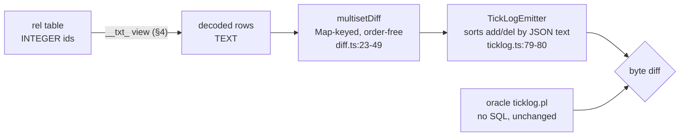
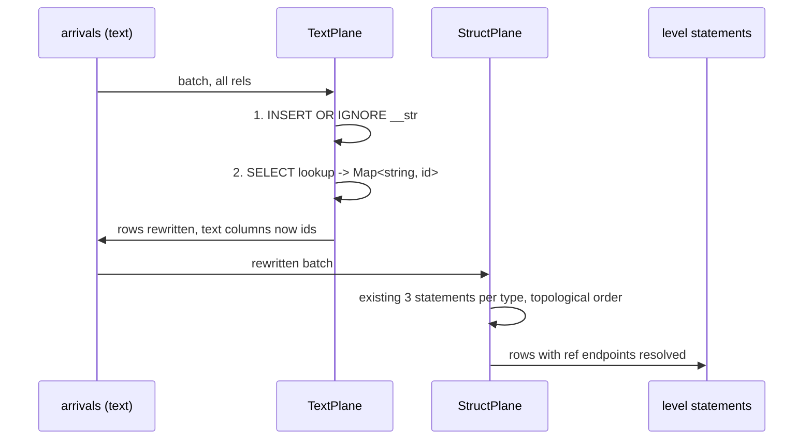
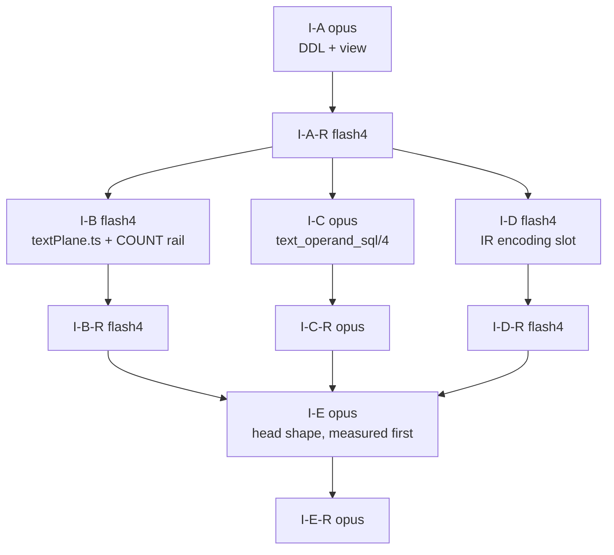
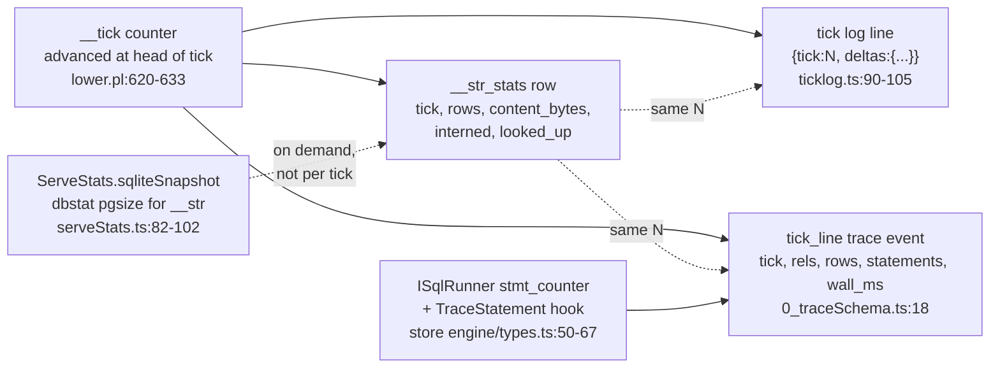
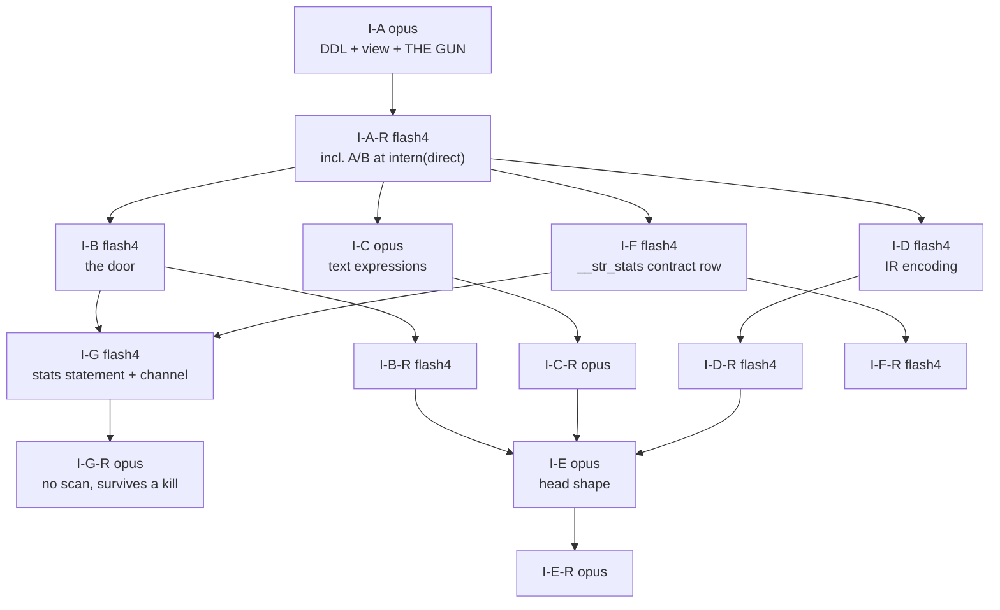

# Interning contract: dictionaries + views as the emitter default

Seed for task #4 (the second interning incident, laws set 2026-08-07). Base
`f650f2b7`. Feeds `plans/2026-08-07-plan-ir-offload-contract.md` §2.4's
`encoding` slot, which lane P1-A-R built and left empty for this document to
fill.

Plain-words twin: `plans/2026-08-08-interning-contract.visual.human.unga.md`.

**Rev 2, 2026-08-08.** Red-teamed at `e8bb9911` (report:
`plans/2026-08-08-interning-contract.redteam.md`, 7 confirmed findings, 5 held
attacks). Every finding is closed in place; §19 is the changelog.

**Rev 3, 2026-08-08 (user word).** *"do we have to have direct(string/text), can
we please just intern it all for now. this mixing and all its woes is whack."*
The per-column waiver is withdrawn, the automatic fallback is deleted, and
runtime-built strings are interned on write. **Every text column in a program is
a dictionary id, with no exceptions.** §20 is the changelog; §9 records what was
deleted and how it returns if a case ever earns it.

## TOC

- [1. The decision, in one table](#1-the-decision-in-one-table)
- [2. What the emitter does today, cited](#2-what-the-emitter-does-today-cited)
- [3. Dictionary DDL: one global `__str`](#3-dictionary-ddl-one-global-__str)
- [4. The auto-join view, emitted in the same pass](#4-the-auto-join-view-emitted-in-the-same-pass)
- [5. Sort and compare at the render boundary](#5-sort-and-compare-at-the-render-boundary)
- [6. Ingest-door intern](#6-ingest-door-intern)
- [7. Head storage: rowid+unique vs WITHOUT ROWID](#7-head-storage-rowidunique-vs-without-rowid)
- [8. IR handshake](#8-ir-handshake)
- [9. The waiver, withdrawn](#9-the-waiver-withdrawn)
- [10. Migration across the 306-fixture corpus](#10-migration-across-the-306-fixture-corpus)
- [11. Lanes, ownership, two-pass law](#11-lanes-ownership-two-pass-law)
- [12. Phase gates with numbers](#12-phase-gates-with-numbers)
- [13. Known breaks](#13-known-breaks)
- [14. Receipts index](#14-receipts-index)
- [Amendment 2026-08-08 (user word)](#amendment-2026-08-08-user-word)
  - [15. The gun](#15-the-gun)
  - [16. Dictionary telemetry](#16-dictionary-telemetry)
  - [17. Lane table extension](#17-lane-table-extension)
- [Rev 2 2026-08-08 (red team)](#rev-2-2026-08-08-red-team)
  - [18. The `__` namespace is refused, not requested](#18-the-__-namespace-is-refused-not-requested)
  - [19. Changelog: the seven findings and where each closed](#19-changelog-the-seven-findings-and-where-each-closed)
- [Rev 3 2026-08-08 (user word: intern it all)](#rev-3-2026-08-08-user-word-intern-it-all)
  - [20. Changelog: what rev 3 deleted, added and re-scoped](#20-changelog-what-rev-3-deleted-added-and-re-scoped)

---

## 1. The decision, in one table

| question | decision | argued in |
|---|---|---|
| is interning opt-in or the default? | **universal.** Every `text`-typed stored column, no per-column opt-out (rev 3) | §9 |
| what about a string built at run time? | interned on write, two statements, verified on both builds | §5.7 |
| can two encodings meet in one program? | **no, by construction.** There is nothing to mix, which is why rev 2's join refusal is demoted to an assertion that never fires | §5.6 |
| one dictionary per natural-key shape, or one global? | **one global `__str`** | §3 |
| when is the decode view emitted? | **in the same `rel_ddl/5` call that emits the table**, same returned list | §4 |
| what reads text? | the emitted view `__txt_<rel>`, and nothing hand-written | §4, §5 |
| what compares text? | identity only (`==`, `\==`, join equality), which survives interning **as long as both sides are in the id space** | §5, §5.6 |
| what about a text CONSTANT? | it is interned at boot and compared as an id; a constant is the sixth decode site and the one the first draft missed | §5.2 rows 11-13, §5.3 |
| what breaks? | nine statement families, all named, all with a fix | §5, §13 |
| what refuses mechanically? | a user rel in the compiler-owned `__` namespace (`reserved_rel_namespace`) | §18 |
| head table shape | WITHOUT ROWID stays everywhere except recursive heads taking the rowid-range delta | §7 |
| how does the oracle stay the referee? | it never runs SQL; the sweep's tick-log diff is the migration receipt unchanged | §10 |

---

## 2. What the emitter does today, cited

Measured at base `f650f2b7` over `v6/prolog/compile/out/*.ts` (211 compiled
modules of 306 fixtures):

| fact | number | how |
|---|---|---|
| `CREATE TABLE` emitted | 754 | `grep -ho 'CREATE TABLE ' out/*.ts \| wc -l` |
| of those, `WITHOUT ROWID` | 569 | same grep, `WITHOUT ROWID` suffix |
| WITHOUT ROWID tables with >= 1 TEXT column in the PRIMARY KEY | **491** | regex over the DDL body, PK column names intersected with `"x" TEXT` column defs |
| modules affected | **167 of 211** | same script, distinct filenames |
| TEXT columns per affected PK | 1: 330, 2: 118, 3: 18, 4: 17, 6: 8 | same script |
| `CREATE TEMP VIEW "__ref_..."` already emitted | 45 across 21 modules | `grep -o` |

So the law's WRONG example (`sql-relational-design/SKILL.md:14-17`) is not a
hypothetical: 491 emitted tables are composite-or-single TEXT PKs under
`WITHOUT ROWID`, 86% of every WITHOUT ROWID table the compiler writes.

The two clauses that write them:

| site | what it does |
|---|---|
| `lower.pl:909-943` `rel_ddl/5`, set arm | two arms already exist. The `declared_type_name/2` arm (`:928-938`) emits `__id INTEGER PRIMARY KEY, <cols>, UNIQUE(<pk>)` **plus a `CREATE TEMP VIEW` in the same returned list** (`Ddls = [Ddl, ViewDdl]`, `:938`). The fallback arm (`:939-942`) emits `PRIMARY KEY (<cols>) WITHOUT ROWID` and one DDL |
| `lower.pl:951-976` `column_def/3` | `int`/`bool` -> INTEGER, `float` -> REAL, `ref(_)` -> INTEGER (`:964`), `json`/`text` -> TEXT (`:973-976`) |

The whole of task #4 is: move `text` from the second arm to the first, and make
the first arm's `Ddls = [Table, View]` shape the only shape. The emitter already
proves the pattern works; it applies it to declared struct types and to nothing
else.

Precedents, from `plans/2026-08-07-interning-archaeology.md`:

| gen | dictionary | auto-join view | outcome |
|---|---|---|---|
| v1 | one global `strings(id, value UNIQUE, norm, norm2)` | yes, `CREATE VIEW "<rule>"` per rule (`rule_tables.rs:110-136`) | purest form |
| v2, v3 | verbatim port | yes | held |
| v4 | fact store yes; new `runtime_graph` subsystem no | fact store TEMP VIEW; runtime_graph "deferred until verified live" (`app.rs:276-278`) | **died** |
| v5 | one global `_strings(id, content)` + dense `_sym_dict` | yes, `create_rel_view()` -> `rel_<name>_txt` (`src/engine/declare.rs:117-178`) | living reference |
| v6 | only `__ref_<type>` for declared struct columns | only for those | **died** |

The recorded killer sentence is v4's "deferred until verified live". §4 is
written to make that sentence unspellable.

---

## 3. Dictionary DDL: one global `__str`

### 3.1 Signature first

```prolog
% intern_ddl(-Ddls)
%   The dictionary is program-global and schema-free: one table, emitted once,
%   before every rel_ddl/5 output. No per-rel and no per-shape variant.
intern_ddl([StringTableDdl]).

% interned_column(+Type)
%   TRUE when a stored column takes dict('__str') encoding.
%   Rev 3: one line. json stays TEXT because json1 reads it in place.
interned_column(text).
```

Rev 2 had this as a program-wide analysis with two escape routes: an author's
`direct(col)` waiver, and an automatic fallback for a column written by a
computed text expression. **Rev 3 deletes both.** The waiver is withdrawn (§9)
and the computed-text case is handled by interning on write instead of by
falling back (§5.7).

What that buys, and it is the reason the user asked for it: **there is no second
encoding for a text column anywhere in a program**, so no analysis can be wrong,
no join can span two encodings, and no reader has to ask which kind of text
column they are looking at. The predicate is one clause and it cannot drift from
the DDL, because the DDL reads the same clause.

A rel-reference column still carries `dict(TargetType)` rather than
`dict('__str')`, which is a different dictionary family and not a mixing case:
the declared types differ, so `join_column_types_agree/4` already refuses any
join between them by declared type alone (`lower.pl:311-315`).

### 3.2 The DDL

```sql
CREATE TABLE "__str" (
  "__id"    INTEGER PRIMARY KEY,
  "content" TEXT NOT NULL UNIQUE
);
```

rowid table + `UNIQUE`, not `WITHOUT ROWID`. Reason, from `sqlite-costs`:
`__id` is read once per boundary render per column, and the existing receipt for
that read shape is `SEARCH d USING INTEGER PRIMARY KEY (rowid=?)`
(`lower.pl:1023-1024`, receipt in `v6/tsv2/tests/structPlane.test.ts`). Insert
side is the `rowid table + UNIQUE index ~1.34M rows/s` ladder row; the
dictionary is written once per DISTINCT string, never once per row, so its
insert rate is off the hot path by construction.

### 3.3 One global, argued

| argument | weight |
|---|---|
| **Cross-rel equality.** `reach(P) <- a(P), b(P)` lowers to `b0."p" = b1."p"` (`lower.pl:compile_comparison`, join equalities). Two dictionaries make that equality compare ids from different id spaces: silently empty, no refusal. Making it correct would need a decode on both sides of every text join, which is the hand-written string join this contract bans | **decisive** |
| Every prior generation that survived chose global: v1/v2/v3 `strings`, v5 `_strings` | strong precedent, `interning-archaeology.md` per-generation table |
| Per-shape would multiply the DDL: 491 affected tables carry ~700 TEXT key columns; per-column dictionaries mean ~700 extra tables and ~700 extra views | cost |
| Corpus shape favours sharing: the flagship TEXT key is `src/engine/lower/pass_{..}/module_{..}.ts` with a 24-byte shared prefix, 50 symbols per file, 40 files per directory (`REPORT-INTERN.md` §7). The same path string appears in many rels | fit |

Counterarguments, each recorded with its answer:

1. One hot btree. Under a future multi-writer the dictionary is the contention
   point. Today the runtime is single-writer through `ISqlSeam`, so this is a
   phase-2 concern, and the mitigation (shard by `content` hash prefix, ids stay
   globally unique) does not change any statement in this document.
2. No per-rel drop. Dropping a rel cannot drop its strings. §13 row 4.
3. `norm`-style normalized columns. v1's `strings` carried `norm`/`norm2`
   alongside `value`; v6's `norm/1` (`registry.pl:250`) computes on demand.
   Not adding `norm` to `__str` is a deliberate narrowing: `norm/1` has **zero**
   occurrences in the current corpus (`grep -o '__norm_chars' out/*.ts` = 0), so
   memoizing it now would be speculative.

### 3.4 Lifetime and uniqueness

| property | value |
|---|---|
| instance lifetime | one per database, created at boot alongside `__rel`/`__tick` catalog DDL (`lower.pl:624-765`) |
| growth | append-only within a run (`sql-relational-design/SKILL.md:47`) |
| dedup mechanism | the `UNIQUE` constraint plus `INSERT OR IGNORE`; no read-modify-write, no application-side set |
| id stability | stable within a run, NOT across runs, NOT across databases (§13 row 3) |
| NULL | impossible: `content TEXT NOT NULL UNIQUE`, and every emitted text column is already `TEXT NOT NULL` (`column_def/3:976`) |

---

## 4. The auto-join view, emitted in the same pass

**The structural rule, which is the whole point of this section:** `rel_ddl/5`
returns a LIST. An interned rel's clause returns a two-element list. There is no
second predicate, no second pass, no second lane, and no place where a table can
exist without its view. `lower.pl:938` already writes exactly this line for
declared struct types:

```prolog
Ddls = [Ddl, ViewDdl]
```

### 4.1 Signature

```prolog
% rel_ddl(+Types, +EdgeHeadedRefs, +ArrivalTargetRefs, +LevelHeadedRefs,
%         +RelPlan, -Ddls)
%   Ddls = [TableDdl]              when no column of the rel is interned
%   Ddls = [TableDdl, ViewDdl]     when >= 1 column is interned
%   NO OTHER SHAPE. The plunit gate is a length assertion over every relplan.

% text_view_name(+Ref, -Name)
%   '__txt_' ++ <table name>. Same '__' reserved namespace as __ref_, __new_,
%   __delta_, __frontier_, __ping_, __pong_, __cone_ (lower.pl grep of '__).
text_view_name(Ref, Name).

% text_view_ddl(+Ref, +Columns, +ColumnTypes, +Interned, -Ddl)
%   Pseudo-code:
%     for each column: interned -> (SELECT s."content" FROM "__str" s
%                                    WHERE s."__id" = t."<col>") AS "<col>"
%                      otherwise -> t."<col>"
%     plus every hidden column the table carries (__id, __refcount) verbatim,
%     so a reader of the view sees exactly the table's shape with text restored.
text_view_ddl(Ref, Columns, ColumnTypes, Interned, Ddl).
```

### 4.2 The emitted text

```sql
CREATE TEMP VIEW "__txt_rel_flow_reach" AS
SELECT (SELECT s."content" FROM "__str" s WHERE s."__id" = t."from_path") AS "from_path",
       (SELECT s."content" FROM "__str" s WHERE s."__id" = t."from_name") AS "from_name",
       (SELECT s."content" FROM "__str" s WHERE s."__id" = t."to_path")   AS "to_path",
       (SELECT s."content" FROM "__str" s WHERE s."__id" = t."to_name")   AS "to_name",
       t."__refcount"
FROM "rel_flow_reach" t;
```

Correlated scalar subquery rather than a `FROM`-clause LEFT JOIN, for the reason
`lower.pl:1017-1021` already gives for the struct case: the same expression text
drops into `delta_statement/2`'s SELECT list, the snapshot read, the final-state
read and the delta read with no restructuring. `TEMP` for the same reason
`__ref_` views are TEMP: per connection, never persisted, never migrated.

### 4.3 Who reads the view

| reader | site | change |
|---|---|---|
| tick-log delta read | `lower.pl:3957-3969` `delta_statement/2` `SelectSql` | `FROM "rel_<name>"` -> `FROM "__txt_rel_<name>"` |
| tick-log boundary read | same predicate, `BoundarySql` over `__delta_<rel>` | the delta table's own text columns are interned identically; same swap |
| final-state read | `v6/tsv2/scripts/sweep.ts` via the emitted module's delta statements | inherited, no edit |
| serve | `v6/tsv2/runtime/serveStats.ts`, `serveDoor` reads | inherited, no edit |
| oracle | `v6/prolog/conformance/ticklog.pl` | **none.** The oracle computes over prolog terms and never issues SQL. That is what keeps it the referee (§10) |

### 4.4 The .dl snippet, with its rx lowering (style law)

```
rel edge(from_path: text, to_path: text).
rel reach(from_path: text, to_path: text).
reach(FromPath, ToPath)  <- edge(FromPath, ToPath).
reach(FromPath, FarPath) <- reach(FromPath, MiddlePath), edge(MiddlePath, FarPath).
```

```ts
// The dictionary is a scan over the arrival stream; it is never re-read per row.
const dictionary$ = arrivals$.pipe(
  scan((dictionary, batch) => dictionary.internAll(batch.textValues()), TextDictionary.empty()),
  shareReplay({ bufferSize: 1, refCount: true }),
);

// The ingest door swaps text for ids ONCE, before anything downstream subscribes.
const edgeIds$ = arrivals$.pipe(
  withLatestFrom(dictionary$),
  map(([batch, dictionary]) => batch.rows.map((row) => row.map((value) => dictionary.id(value)))),
);

// The walk never sees a string. `expand` is the fixpoint.
const reach$ = edgeIds$.pipe(
  expand((frontier) => hop(frontier, edgeIds$)),
  distinctUntilChanged(sameRowSet),
);

// `__txt_rel_reach`, written in rx. Same pass, same file, no follow-up.
const reachText$ = reach$.pipe(
  withLatestFrom(dictionary$),
  map(([rows, dictionary]) => rows.map((row) => row.map((id) => dictionary.content(id)))),
);
```

---

## 5. Sort and compare at the render boundary

Interning flips a column's storage class from TEXT to INTEGER. Two families
break: anything that depends on TEXT ORDER rather than TEXT IDENTITY, and
anything that puts a TEXT VALUE beside an id.

Rev 1 enumerated the first family and missed the second. The red team's finding
1 is the correction, and closing it surfaced two more (rows 12 and 13). The
enumeration below is 14 rows and is claimed complete against two mechanical
sweeps rather than against reading: every `where_text/2` call site, and every
`expression/5` registry row.

### 5.1 What the language admits on text

| operator | registry row | type rule | consequence |
|---|---|---|---|
| `<` `=<` `>` `>=` | `compile/registry.pl:240-243` | `both_number` | **TEXT ordering is already refused**, by name, as `comparison_operand_not_number`. There is no in-language text ordering comparison to break |
| `==` `\==` | `compile/registry.pl:245-246` | `same_type` | identity. A bijective global dictionary preserves it exactly |
| `min` `max` | `lower.pl:3761-3766` via `compile_aggregate_number_operand/5:3811-3816` | int or float only | **refused on text**. Nothing to break |
| `norm/1` | `registry.pl:250`, lowering `lower.pl:522-525` | `text_only` | reads `substr`/`unicode` over the value: **breaks**, needs the decode |
| `regexp/2` | `lower.pl:820-830` | operand must be `text` | **breaks**, needs the decode |
| `concat` / `\|\|` | `lower.pl:591-612` | always text | **breaks**, needs the decode |

### 5.2 The exact statements affected

| # | statement | site | order today | order after intern | verdict |
|---|---|---|---|---|---|
| 1 | `delta_statement/2` `SelectSql` (`SELECT <cols> FROM <table>`) | `lower.pl:3962` | full scan of a WITHOUT ROWID table = PK order = text order | id order | **SAFE.** `multisetDiff` is Map-keyed and order-independent (`runtime/diff.ts:23-49`); `TickLogEmitter` sorts add/del lexicographically by their own JSON text (`runtime/ticklog.ts:79-80`). Requires §4.3's view swap so the sorted text is text |
| 2 | `json_group_array(V ORDER BY V)` | `lower.pl:3767-3771` | value order, "v5 parity, digest-stable" per `v6/dl/fixtures/golden-flex.dl6:376` | id = intern order | **BREAKS.** 24 occurrences in `out/*.ts` |
| 3 | `group_concat(V, Sep ORDER BY V)` | `lower.pl:3779-3782` | value order | id order | **BREAKS.** 4 occurrences (`group_concat(b0."value", ' > ' ORDER BY b0."value")`) |
| 4 | `json_group_array_ordered`, `group_concat_ordered` | `lower.pl:3772-3778`, `:3783-3789` | ORDER BY an int ordinal (`compile_aggregate_ordinal_operand/3`) | unchanged | **SAFE** |
| 5 | `regexp/2` | `lower.pl:830` | `(<text expr> REGEXP <lit>)` | `(<integer id> REGEXP <lit>)`, silently never matching | **BREAKS.** 15 occurrences across 3 modules |
| 6 | `norm/1` | `lower.pl:522-525` | `substr`/`unicode` over the value | over an id | **BREAKS.** 0 occurrences in the corpus today; fix it anyway, the fixture that adds one must not be the discovery |
| 7 | concat `\|\|` | `lower.pl:591-612` | text concatenation | integer concatenation, a different string | **BREAKS.** 5 modules |
| 8 | `_sequence` (= `__new_<rel>`'s rowid, `lower.pl:3841-3847`, read by `:2575-2583`) | fill order comes from a WITHOUT ROWID scan of `__support_next_<rel>` (key_major) or a wave table (round_major), offload contract §4.2 | head-key text order | head-key id order | **ORDER CHANGES, observable in two places only:** Log rels (append-only, physical row order is the multiset) and `keep(count(N))` retention, which keeps by `rowid DESC LIMIT` (`lower.pl:3981`). 4 modules use retention |
| 9 | `departure_read_sql/3` `ORDER BY "_phase","_sequence"` | `lower.pl:198` | | | inherits row 8; the ORDER BY names no data column |
| 10 | delta arm `ORDER BY d0."_phase", d0."_sequence"` | `lower.pl:1918` | | | inherits row 8 |
| 11 | **text literal comparison**: `where_text(lit(Left, Value))` emits `<col> = 'literal'` | `lower.pl:340`, reached from all six `where_text/2` call sites (`:347`, `:402`, `:1900`, `:2200`, `:2399`, `:3905`); IR twin `eq_lit(IrLeft, Literal)` at `:3171` | text compared to text | **INTEGER id compared to a TEXT literal.** SQLite applies the column's INTEGER affinity: a non-numeric literal stays text and matches nothing; a numeric-looking literal (`= '42'`) coerces and matches whichever row holds id 42 | **BREAKS, silently, both ways.** 12 modules, 114 occurrences in `out/*.ts`. Patient zero: `backslash_in_string_literal_survives_both_doors` |
| 12 | **text literal PROJECTION into a head column**: `head_select_list/4` -> `compile_expr` -> `sql_literal` | `lower.pl:881-889` | writes `'warning'` into a TEXT column | writes `'warning'` into an INTEGER column; affinity stores it and the row is unfindable | **BREAKS, and it is a WRITE.** 26 modules. The red team found the read side; this is its write-side twin, found while closing it |
| 13 | **computed text projected into a head column**: `concat`, `norm`, `json_extract` in head position | `lower.pl:591-612`, `:522-525` | writes a fresh string | the value is not in the dictionary and cannot be looked up inside the statement that computes it | **NOT FIXED BY A DECODE.** The column falls back to `direct` automatically (§3.1), with the reason recorded |
| 14 | `where_text(pair_lit(Left, Functor))`: `json_extract(<col>,'$.fn') = 'functor'` | `lower.pl:337-339` | | | **SAFE.** The operand is a `json`-typed column, and `json` is never interned (§3.1) |

### 5.3 The two rules that fix rows 2, 3, 5, 6, 7, 11, 12

> **An expression whose declared operand type is `text` reads the value through
> `__str`. An expression that only needs identity (`==`, `\==`, join equality,
> `GROUP BY`, `PRIMARY KEY`, `NOT EXISTS`) reads the id.**

One predicate carries it:

```prolog
% text_operand_sql(+ColumnSql, +Encoding, +Demand, -Sql)
%   Demand = value | identity
%   Pseudo-code:
%     Encoding == direct                 -> Sql = ColumnSql
%     Demand == identity                 -> Sql = ColumnSql        % ids compare
%     otherwise -> format('(SELECT s."content" FROM "__str" s WHERE s."__id" = ~w)',
%                         [ColumnSql]).
text_operand_sql(ColumnSql, Encoding, Demand, Sql).
```

Callers, exhaustively: `compile_regexp_goal/3` (`lower.pl:820`),
`text_scalar_rendering/3` (`:522`), the concat arm (`:591-612`), and the two
`ORDER BY` renderings at `:3770` and `:3781`. `aggregate_select_expr/3`'s
ORDER BY is the value under `value` demand while the aggregated value itself is
also `value` demand, so both operands decode and the emitted text stays one
expression.

Its receipt, and the reason it is a gate rather than a claim: a plunit test that
enumerates every `expression/5` row in `compile/registry.pl` whose TypeRule is
`text_only` and asserts the lowered SQL for an interned column names `__str`.
A new text operator that forgets the decode fails that test on the day it is
added.

#### Rule two: a text CONSTANT enters the id space at boot

Rows 11 and 12 are the same problem seen from both sides, and one mechanism
closes both. A text literal is a compile-time constant, so it can be interned
once, at boot, and every use of it becomes an id lookup.

**Boot statement, one per module, constants baked at compile time:**

```sql
INSERT OR IGNORE INTO "__str" ("content")
SELECT i.value FROM json_each('["warning","eprintln-exceeded","rust","acme"]') i;
```

**Every literal use, read side and write side alike, lowers to the same form:**

```sql
-- row 11, comparison:  b0."kind" = 'rust'   becomes
b0."kind" = (SELECT s."__id" FROM "__str" s WHERE s."content" = 'rust')

-- row 12, projection:  ..., 'warning', ...  becomes
..., (SELECT s."__id" FROM "__str" s WHERE s."content" = 'warning'), ...
```

One predicate:

```prolog
% text_literal_sql(+Literal, +Encoding, -Sql)
%   Encoding == direct -> Sql is sql_literal/2's quoted text, unchanged.
%   Encoding == dict(_) -> the scalar subquery above.
%   The literal is ALSO collected into the module's boot intern list, so the
%   subquery is total on the write side (an interned head column is NOT NULL
%   and a missing id would fail the insert).
text_literal_sql(Literal, Encoding, Sql).
```

Call sites, exhaustively, all six `where_text/2` consumers plus the head:
`compile_positive_uses/6` (`lower.pl:347`), `:402`, `:1900`, `:2200`, `:2399`,
`:3905`, and `head_select_list/4` (`:881-889`).

**Why boot interning rather than resolving the id into the emitted text.**
Splicing an integer would make the SQL a function of the database, and
`emit_ts.pl` prints static strings (`emit_ts.pl:988-1013`). A module whose text
differs per database cannot be diffed, cached, or byte-gated, which is three of
this contract's own gates.

**Why the subquery is safe on the read side even for a literal no row holds.**
It returns an id that no stored row carries, so the comparison matches nothing,
which is the correct answer. Interning it at boot costs one dictionary row and
buys one uniform lowering for both sides.

**The receipt this owes, because it is the one cost I could not settle by
reading:** an `EXPLAIN QUERY PLAN` receipt that the literal subquery is hoisted
as a constant `SCALAR SUBQUERY` computed once per statement, never once per row.
Lane I-C produces it on the flagship before writing the lowering. If the planner
re-evaluates per row, the fallback is a `?` bind parameter carrying the id,
resolved once per statement execution from a module-level constant list, and
that fallback is named here so the lane does not have to invent it under time
pressure.

#### Row 12's write-side twin, and what it does to the boot seed

The boot intern writes rows into `__str` outside the per-tick door. §16.3's
running totals only count what the door interned, so the boot statement MUST
also write the tick-0 `__str_stats` seed row with the literal count and byte
sum, or `rows` is permanently short by the module's literal count. Measured
while closing this: seeding `__str` outside the chain and skipping the seed row
produced `rows = 2` where the dictionary held 3.

### 5.4 Byte-identity of the sweep, stated as a chain



Scan order never reaches the comparison. That is why row 1 of §5.2 is SAFE and
why the whole migration rests on §4's view being emitted; the walk's order
never reaches it.

### 5.5 A win worth naming

The offload contract's risk row 3 and its P1-C-R review question are both about
the executor's TEXT comparator: "the executor's comparator must be that
comparator, not rust's `Ord` on `String`, for any TEXT column whose values
contain non-ASCII bytes" (§4.2 closing paragraph). After interning, a head's
text columns are INTEGER, the emit-order comparator is integer compare, and that
whole class of risk is deleted rather than mitigated. Record it in the offload
contract when task #4 lands.

### 5.6 Mixing, and why the refusal is demoted to an assertion

Rev 2 added `mixed_encoding_join`, a compiler refusal for `a."p" = b."p"` where
one side was a `direct` text column and the other an interned one. It closed
red-team finding 3, which was real: rev 2 had two ways to produce a `direct`
text column (the author's waiver, and the automatic fallback), so two encodings
could meet.

**Rev 3 deletes both producers, so the state is unreachable.** Within one
compiled program every text column is `dict('__str')`. There is no surface
syntax, no analysis outcome, and no lowering path that yields a `direct` text
column.

Two candidate fates, and the call:

| option | argument | verdict |
|---|---|---|
| keep the surface refusal | it is already written and costs nothing | **no.** A refusal that no program can trigger has no fixture that can be red, so it is untested code claiming to be a guard. That is worse than no guard, because a reader trusts it |
| delete it entirely | uniformity makes it dead | **no.** The encoding field survives in the IR (§8), the gun's direct mode still exists at the program level (§15), and a future waiver would reintroduce the case silently |
| **keep one internal assertion at the single place encoding is chosen** | it fires before anything is emitted if the invariant ever breaks, and it is unit-testable by calling the predicate directly | **yes** |

The assertion, stated so its job is clear:

```prolog
% uniform_text_encoding(+ColumnClasses)
%   INVARIANT, not a refusal. Every text-typed column in one program carries
%   the same Encoding. Today that is dict('__str') under intern(dict) and
%   direct under intern(direct) (§15.3), uniformly, so this never fires.
%   It exists so that the day a per-column waiver returns (§9.3), it fires
%   at compile time rather than producing an empty join at run time.
uniform_text_encoding(ColumnClasses) :-
    ( setof(E, C^T^S^Co^member(colclass(C,T,S,Co,E), text_typed(ColumnClasses)), [_])
    -> true
    ;  throw(unsupported_construct(mixed_text_encoding(ColumnClasses))) ).
```

Its test is a **plunit unit test that calls the predicate with a hand-built
mismatched list**, not a `.dl6` fixture. No program can build that list, and
pretending otherwise with a fixture that cannot be red is the failure mode the
first option above names.

Cross-family joins are a different question and are already answered: a text
column is `dict('__str')` and a rel-reference column is `dict(TargetType)`, but
their DECLARED types differ (`text` vs `ref(Target)`), so
`join_column_types_agree/4` refuses them today with `join_column_type_mismatch`
(`lower.pl:311-315`). Rev 3 adds nothing there.

### 5.7 Intern on write: strings built at run time

Rev 2's answer to a head projecting `concat(...)` into a text column was to let
that column fall back to `direct`. Rev 3's user word rejects the mixing that
creates, so the string is interned instead. The value is unknown until the arm
computes it, so the intern happens as part of writing the row.

#### 5.7.1 The two statements

```sql
-- 1. intern every built string the arm will produce, set-based, one statement
INSERT OR IGNORE INTO "__str" ("content")
SELECT DISTINCT (b0."n" || ' hits; ' || b0."note")
FROM "hits" b0 WHERE b0."n" > 2;

-- 2. the head insert, with the built expression resolved to its id by a join
INSERT OR IGNORE INTO "diag" ("path","message")
SELECT b0."path", s."__id"
FROM "hits" b0 JOIN "__str" s ON s."content" = (b0."n" || ' hits; ' || b0."note")
WHERE b0."n" > 2;
```

The arm's `FROM` and `WHERE` are reproduced verbatim in both. Statement 1 writes
only to `__str`, which no arm reads by content, and it only ADDS rows, never
changing an existing id, so the two executions of the arm see identical input
and produce identical rows. Both statements go in the tick's existing batch, so
they are one transaction.

#### 5.7.2 Why not a staging table

The obvious alternative materializes the arm once into a per-arm staging table,
interns from it, then joins it to `__str`. Four statements, and the arm runs
once instead of twice. It loses on the repo's own measured law:

> "One-table-with-state-columns vs many tables measured as a wash; you save a
> write only by deleting the QUESTION it answers, never by relocating the
> answer." (`sqlite-costs`)

Staging relocates the arm's output rather than deleting work: it pays one bare
rowid append plus one read per row, to avoid one arm execution. It also adds a
`CREATE TABLE` per affected arm to every program's DDL. The two-statement form
adds no DDL and no new table.

**The condition that flips this call is named rather than left implicit:** if an
arm's join is expensive and its output is small, running it twice is the wrong
trade. §5.7.4 shows no such arm exists in the corpus today, and the gate in
§5.7.5 is what would catch the first one.

#### 5.7.3 Where it sits in the walks

| path | statement family | cost |
|---|---|---|
| recompute / from-scratch insert | one intern statement before the head insert | once per tick |
| delta arm (`level_delta_*`) | same, per arm that carries a built text projection | once per tick per arm |
| DRed assert / revive / expand rounds | **per round**, if the head's arm carries a built text projection | this is the expensive case, and §5.7.4 measures that it does not currently occur |
| refCount / staging fills | untouched: they copy an already-written column, never rebuild the string | zero |

#### 5.7.4 The price, measured on the corpus

| question | answer |
|---|---|
| modules with a concat projected into a head text column | **17** |
| distinct (module, target rel) pairs | 17 |
| **of those, target is a fixpoint head** (has a `__ping_`, `__pong_` or `__expand_` companion table) | **0** |
| target rels | `diag` (11 modules), `message` (1), `__host_demand_*` (5) |
| busiest module | 7 such projections (`clean_state_gate_and_exit_zero`, `extraction_fork_callgraph`, `clean_state_no_diags`) |

**The ugly case does not exist today.** Every built string in the corpus lands in
a diagnostic-shaped or host-demand-shaped rel, all outside the fixpoint, all
written once per tick. Their cost goes from one statement to two, and the second
gains one index probe per row.

The number that would be ugly, stated so it is not a surprise later: a built
string projected into a RECURSIVE head would pay the arm twice on **every round**
of the walk. On `grid_10000`'s 45-round profile the two wave hops are 56% of the
fixpoint, so doubling one of them is roughly a 28% regression on that case. The
user chose uniformity knowing the shape of that risk; §5.7.5 is the gate that
makes the first occurrence loud instead of silent.

#### 5.7.5 The gate

> A built-text projection on a rel whose plan carries a `fixpointIr` emits a
> compile-time WARNING naming the rel and the arm, and the sweep counts them.
> The count is 0 today and a non-zero count is a review item, not a failure.

A warning rather than a refusal, because the construct is legal and someone will
eventually want it. What is not acceptable is discovering it from a bench number
six weeks later.

#### 5.7.6 Verified, not proposed

Run on both builds. Input `hits(path, n, note)` with rows
`('a.rs',3,'x') ('b.rs',7,'y') ('c.rs',3,'x') ('d.rs',9,NULL)`, arm
`WHERE n > 2`, projection `n || ' hits; ' || note`.

| check | result |
|---|---|
| baseline (today's single statement, TEXT head column) | 3 rows |
| intern-on-write (two statements, INTEGER head column) | 3 rows, `__str` holds 2 (the duplicate `'3 hits; x'` interned once) |
| **decoded through `__txt_`, symmetric difference against the baseline** | **0**, on CLI sqlite3 3.43.2 and on @libsql 0.17.4 alike |
| both statements in one `batch(..., "write")` on @libsql | accepted, 2 results |
| `EXPLAIN QUERY PLAN` for statement 2 | `SCAN b0` + `SEARCH s USING COVERING INDEX sqlite_autoindex___str_1 (content=?)`: one index probe per row, never a scan of `__str` |

**NULL parity, checked because it is where a silent row loss would hide.** The
`d.rs` row has `note = NULL`, so the concat is NULL. Today's single statement
drops it: the head column is `NOT NULL` and `INSERT OR IGNORE` skips the
violation. Intern-on-write drops it too, at `__str.content`'s `NOT NULL` under
the same `OR IGNORE`, and then the join finds nothing. **Same answer, same
silence, for the same reason.** The behavior is pre-existing and rev 3 does not
change it; it is recorded here so the sweep's first NULL-concat diff is not
mistaken for a regression this arc introduced.

---

## 6. Ingest-door intern

### 6.1 Signature

```prolog
% text_intern_plan(+Decls, +RelPlans, -Plan)
%   Plan = textintern(InternSql, LookupSql, RelColumns)
%     RelColumns : rel name -> list of booleans, one per column, TRUE = interned.
%                  The runtime's rewrite map; the same shape IStructRefColumns
%                  already has (types.ts:IStructRefColumns).
text_intern_plan(Decls, RelPlans, textintern(InternSql, LookupSql, RelColumns)).
```

```ts
// v6/tsv2/runtime/types.ts, per the header-types law
export interface ITextInternPlan {
  readonly internSql: string;
  readonly lookupSql: string;
  /** rel name -> per-column flags; a column not listed is `direct`. */
  readonly relColumns: Readonly<Record<string, readonly boolean[]>>;
}

export interface ITextPlane {
  intern(seam: ISqlSeam, plan: ITextInternPlan, arrivals: IArrivalBatch): Observable<IArrivalBatch>;
}
```

### 6.2 The two set-based statements

```sql
-- 1. intern: one statement, flat in the number of arriving distinct values
INSERT OR IGNORE INTO "__str" ("content") SELECT i.value FROM json_each(?) i;

-- 2. lookup: one statement, flat in the same
SELECT s."content" AS "__lookup", s."__id" AS "__id"
FROM json_each(?) i JOIN "__str" s ON s."content" = i.value;
```

Two statements, where `StructPlane` needs three. `StructPlane` needs three because its dictionary is keyed on a
DECLARED KEY that can be a proper subset of the row, so a same-key/different-row
conflict is possible and gets a preflight (`structPlane.ts:238-245`). `__str`'s
key IS the whole value, so that conflict cannot exist and the preflight is
deleted rather than copied.

`INSERT OR IGNORE` rather than `NOT EXISTS`: `sqlite-costs` measures OR IGNORE
beating a NOT EXISTS prefilter 1.4x on identical storage at every duplication
rate.

### 6.3 NULL / NOT NULL

| case | rule |
|---|---|
| a stored text column | already `TEXT NOT NULL` (`column_def/3:976`); `__str.content` is `TEXT NOT NULL UNIQUE`; a NULL cannot be stored either side |
| a NULL arriving at the door | named refusal `text_intern_null(Rel, Column)`, thrown at the door with the rel and column named, never a dictionary row and never a silent id |
| the one NULL producer in the compiler | `empty_recursive_anchor/2` (`lower.pl:2975-2978`), guarded by `WHERE 0`, so it produces no row; offload contract risk row 3 already relies on this |
| the empty string | an ordinary value with an ordinary id, carrying no sentinel meaning |

### 6.4 The intern-before-swap batch invariant

> Within one tick, the intern+lookup pair runs ONCE over the union of every text
> value in every arriving row, and completes BEFORE any arrival row is rewritten
> and before any level statement runs.

Ordering inside a tick:



Text intern runs BEFORE struct intern, not after: `__ref_<type>` target tables
carry text columns of their own, and their `INSERT OR IGNORE` writes rows whose
text columns must already be ids or the target's UNIQUE key is computed over the
wrong values.

**The COUNT-test rail.** `v6/tsv2/tests/textIntern.test.ts`, built on the
`countingSeam` helper already written for the struct plane
(`v6/tsv2/tests/structPlane.test.ts:214-234`):

| assertion | value |
|---|---|
| N distinct values across M rels, one tick | exactly 2 statements, for N in {1, 3, 50} and M in {1, 4} |
| an empty batch | 0 statements |
| a batch with no interned column | 0 statements |
| the batch handed to `StructPlane.intern` | contains no `string` in any interned position |
| sabotage receipt in the TEST header | flip the door to per-row interning, assert the count test goes RED with the observed number, per the comment-budget law's fail-first rule |

### 6.5 Lifetimes

| instance | lifetime | holds |
|---|---|---|
| `__str` table | database | id -> content |
| `ITextInternPlan` | emitted module constant | SQL text, per-rel column flags |
| the tick's `Map<string, number>` | ONE tick, discarded after the rewrite | lookup results |
| a rust executor's dictionary (offload, P1-C) | one head across ticks | the id space it received; it never re-interns |

No process-lifetime string cache in the runtime. The lookup Map dies with the
tick; the only durable copy is `__str`.

---

## 7. Head storage: rowid+unique vs WITHOUT ROWID

Interning and head-shape are two independent switches. Interning is decided by
column type alone (rev 3). rowid+unique is decided by whether the head takes
the rowid-range delta from `REPORT-SUBSEC.md`. Coupling them is a mistake the
existing emitter invites, because `rel_ddl/5`'s `__id` arm exists for a
different reason (declared struct types need a dense endpoint for PARENT columns
to point at). An interned text column points at `__str`, not at its own rel, so
interning alone does not require the rel to grow an `__id`.

| table family | shape after task #4 | why |
|---|---|---|
| non-recursive set rel | **WITHOUT ROWID**, PK now all-INTEGER | the fastest insert on the ladder: `4-col WITHOUT ROWID PK, INTEGER ~3.3M -> 2.9M rows/s` vs `rowid table + UNIQUE index ~1.34M rows/s` (`sqlite-costs`). It also collects the measured 1.68-1.99x TEXT->INTEGER win directly |
| recursive level head with a non-null `fixpointIr` | **rowid + UNIQUE**, the arm `lower.pl:930` already writes | `REPORT-SUBSEC.md` "Why sub-1,000 requires a restructure": the rowid-range delta needs append + range read, and on a WITHOUT ROWID head it cannot recover the floor (measured 1,123 ms bare loop, still above the ~1,001 ms floor) |
| wave / ping / pong / cone (`lower.pl:3803-3807`, `:3820-3825`) | **WITHOUT ROWID stays** | their PK-order scan IS ordering law property 2 (offload contract §4.2). Flipping them changes `_sequence` for every program |
| refCount head `__support_*` (`lower.pl:3838-3840`) | **WITHOUT ROWID stays** | same; it is what makes `FillNewSql` key_major |
| `__new_<rel>` (`lower.pl:3841-3847`) | **plain rowid, unchanged** | its rowid IS `_sequence` |
| `__ref_<type>` struct dictionaries | already rowid+unique | unchanged |
| `__str` | rowid+unique by construction | §3.2 |
| Log rels (`lower.pl:900-908`) | plain rowid, unchanged | duplicate rows must physically coexist |

**Open measurement, flagged rather than asserted.** `sqlite-costs` carries the
line `WITHOUT ROWID vs rowid+unique: 16% slower fixpoint, 2.2x less memory
(pairs stored once, not table+index)`. Which side owns which number is not
stated in the skill, and the ladder above it reads the other way on pure insert.
Lane I-E's FIRST task is to re-derive that constant on the flagship TEXT-keyed
shape before flipping any head, and to write the direction into the skill. Do
not flip a head on the strength of an ambiguous constant.

---

## 8. IR handshake

`plans/2026-08-07-plan-ir-offload-contract.md` §2.4 already carries the slot,
built and pinned by lane P1-A-R:

```prolog
colclass(Column, Type, StorageClass, Collation, Encoding).
%   Encoding : direct | dict(TargetRelName)
```

Live code, base `f650f2b7`:

| site | today | after |
|---|---|---|
| `lower.pl:3039` | `ir_column_storage(text, text, text, direct).` | becomes `ir_column_storage(text, text, integer, dict('__str')).` One clause replaced by one clause. Rev 2 needed two clauses and a decl argument for the waiver; rev 3 needs neither |
| `lower.pl:3028-3030` `ir_column_class/3` | `StorageClass == text -> Collation = binary` | an interned column's storage class is `integer`, so `Collation = none` falls out with no edit |
| `emit_ts.pl:1169-1170` `fixpoint_encoding_text/2` | already renders both `{ kind: "direct" }` and `{ kind: "dict", rel: ... }` | **no edit** |
| `lower.pl:3043-3049` `fixpoint_ir_columns/4` | admits head column types `[int, text, float, bool]` | unchanged. The column's TYPE stays `text`; only its ENCODING and STORAGE CLASS move |

**No signature change in the IR path.** Rev 2 had to thread `Decls` into
`ir_rel_storage/3` (`lower.pl:3019`) so the encoding could read the waiver. With
no waiver, encoding is a function of the declared type alone and the existing
signature stands.

### 8.1 Does `encoding` collapse to a constant?

Reasonable question after rev 3, and the answer is no. Encoding is now a total
function of `Type`, which is a different thing from constant:

| declared type | storage | encoding |
|---|---|---|
| `text` | integer | `dict('__str')` |
| `ref(Target)` | integer | `dict(Target)` |
| `int`, `bool` | integer | `direct` |
| `float` | real | `direct` |
| `json` | text | `direct` |

Three distinct values across five types, and two of them are dictionaries into
DIFFERENT tables.

### 8.2 So why keep the field, if `Type` determines it

Because of the row the table makes unavoidable: **a `text` column now reports
storage class `integer`.** Without `encoding`, the pair `{type: "text", storage:
"integer"}` is uninterpretable. An executor reading it has three choices and no
way to pick: the value is an id into some dictionary, or the type is wrong, or
the storage is wrong.

Three more reasons, each a thing that would otherwise become the executor's
problem:

| reason | what breaks if the field goes |
|---|---|
| **the executor must know WHICH dictionary** | `dict('__str')` and `dict(span)` are both integers into different tables. Deriving that from `text` vs `ref(span)` means the executor reimplements the mapping the compiler owns, and the two drift on the first change |
| **the gun** | `intern(direct)` (§15.3) emits `{type: "text", storage: "text", encoding: "direct"}`. The field is how one executor reads modules built in either mode without being recompiled |
| **the return path** | §9.3 brings the waiver back the day a case earns it. The IR is already shaped for it; deleting the field means the offload contract's §2.4 is amended twice |

**The handshake with the offload contract is unchanged.** Its §2.4 record already
declares `Encoding : direct | dict(TargetRelName)` and `emit_ts.pl:1169-1170`
already renders both arms. Rev 3 changes which value a `text` column gets, and
nothing about the shape lane P1-A-R built. The rust executor's contract is one
sentence: **a column whose `encoding` is `dict(R)` carries an integer id into
`R`, and comparing two such columns is an integer comparison; rendering one
requires a lookup in `R` and belongs at the boundary, never in the walk.**

Plunit pins to add, beside the existing `fixpoint_ir_` tests:

| test | asserts |
|---|---|
| `fixpoint_ir_text_column_encodes_dict` | a `text` head column emits `storage: "integer", collation: null, encoding: { kind: "dict", rel: "__str" }` |
| `fixpoint_ir_waived_text_column_stays_direct` | a `direct`-waived column emits `storage: "text", collation: "binary", encoding: { kind: "direct" }` |
| `fixpoint_ir_encoding_agrees_with_ddl` | for every relplan in a program, the `colclass` encoding and the emitted `column_def/3` storage type agree. This is the anti-drift test: one run, two outputs, one comparison |

---

## 9. The waiver, withdrawn

### 9.1 The word, and what it deleted

> *"do we have to have direct(string/text), can we please just intern it all for
> now. this mixing and all its woes is whack."*

Rev 3 removes the per-column waiver from the surface. What went with it:

| deleted | was | now |
|---|---|---|
| the `direct(col)` / `direct` decl modifier | rev 2's `decl_a_modifiers/4` clause | not parsed. A program carrying it gets the ordinary unknown-modifier path |
| `direct_column_unknown(Ref, Column)` | a refusal | deleted with the modifier |
| `direct_column_not_text(Ref, Column, Type)` | a refusal | deleted with the modifier |
| the automatic fallback for computed-text heads | §3.1's `computed_text_head` reason | deleted; §5.7 interns on write instead |
| `mixed_encoding_join` as a surface refusal | §5.6 | demoted to an internal assertion that cannot fire |
| the encoding `Reason` field | §3.1, carried into the IR | deleted; with one outcome there is nothing to explain |
| gun level 0 | §15.2's per-column trigger | deleted; the gun keeps levels 1 and 2 (§15.2) |

### 9.2 Why the user is right on the numbers, and where the cost lands

The measurement that justified a waiver is still true and still recorded:
**interning is a 2.44x win when names repeat and a 1.2% LOSS when every value is
unique** (`v6/prolog/ARCH.pl:833`, `stale_labs_sweep`, landed 2026-07-30).

Rev 2 spent a surface construct, two refusals, a program-wide analysis, an
automatic fallback, and a join checker to recover **1.2% on the columns where
interning loses**. Set against that: every one of those pieces was a place two
encodings could meet, and red-team finding 3 confirmed one of them was reachable
and silent.

| what uniformity costs | what it buys |
|---|---|
| up to 1.2% on a column whose every value is distinct | one encoding, program-wide, so mixing is unreachable rather than refused |
| one extra statement plus one index probe per row on a built-string arm (§5.7), on 17 modules, none of them in a fixpoint | `interned_column/1` is one clause and cannot drift from the DDL |
| `__str` grows by the distinct built strings, which for a digest-like column is one row per value | no waiver report, no reason field, no per-column question at review time |

### 9.3 How it comes back, if a case earns it

Recorded so the decision is reversible with evidence rather than by memory.

The waiver returns when a measured case shows a real loss, which means: a column
whose values are effectively all distinct, in a rel with enough rows to matter,
where `interned` in `__str_stats` tracks `looked_up` tick after tick (§16.5's
`dict_hit_pct` staying near 0 is exactly that signal, and it is why the telemetry
exists).

What survives to make the return cheap:

- the IR still carries `encoding` per column (§8), so a mixed program is
  expressible in the IR the day the surface allows it
- §5.6's `uniform_text_encoding/1` assertion fires at compile time if the
  invariant breaks, so the return cannot silently reintroduce the empty join
- §15's gun keeps a whole-program direct mode, which is the coarse version of
  the same escape and is enough for a first measurement
- this section names the evidence to bring: a `dict_hit_pct` series, a row
  count, and a before/after on the flagship

Until then: **every text column is a dictionary id, everywhere, no exceptions.**


## 10. Migration across the 306-fixture corpus

### 10.1 What moves and what cannot

| artifact | changes? | why |
|---|---|---|
| `v6/prolog/compile/out/<name>.ts` (211 files) | **YES**, 167 of them | DDL: TEXT -> INTEGER column defs, plus one `CREATE TEMP VIEW "__txt_..."` per interned rel. Statements: `FROM "rel_x"` -> `FROM "__txt_rel_x"` in the delta reads, plus decode subqueries at the §5.3 call sites |
| `v6/prolog/compile/out/<name>.oracle.jsonl` | **NO** | the oracle is `conformance/ticklog.pl` over prolog terms. It issues no SQL and knows nothing about storage. This is why it stays the referee |
| the emitted tick log | **NO** | §5.4's chain: view decode -> order-free multiset diff -> lexicographic sort |
| `out/manifest.json` buckets | **NO** | 211 compiled / 95 unsupported, unchanged |
| `out/manifest.json` reasons | **only by addition** | two new refusal names (`text_intern_null`, `direct_column_unknown`, `direct_column_not_text`) reachable only from programs that do not exist in the corpus yet. Run this arc with `MANIFEST_DIFF_STRICT=1` |

### 10.2 The three receipts, in order

| # | receipt | command | pass condition |
|---|---|---|---|
| 1 | tick-log byte-identity | `cd v6/tsv2 && bash scripts/sweep.sh` | 306 swept / 211 compiled / **wrong=0**, both RUN and FINAL, buckets unchanged |
| 2 | refusal-reason stability | stage 4 of the same script, `MANIFEST_DIFF_STRICT=1` | only additions, and each addition names a program shape absent from the corpus |
| 3 | **inverted byte-identity probe** | diff `out/*.ts` against base, classify every changed line | lane P1-A-R's probe asserted 0/212 modules moved. This arc moves the DDL for real, so the probe inverts. **A changed line outside the classes below is the finding.** |

The classes, revised for red-team finding 4 (rev 1 listed four and omitted the
head flip, so the classifier would have called lane I-E's legitimate change a
finding):

| # | class | which lane owns it |
|---|---|---|
| 1 | a column type flipped `TEXT` -> `INTEGER` | I-A |
| 2 | a `CREATE TEMP VIEW "__txt_..."` line added | I-A |
| 3 | a delta read's `FROM` swapped to the view | I-A |
| 4 | a §5.3 rule-one decode subquery added (`SELECT s."content" ...`) | I-C |
| 5 | a §5.3 rule-two literal subquery added (`SELECT s."__id" ... WHERE s."content" = ...`), or the module's boot intern statement | I-C |
| 5b | a §5.7 intern-on-write pair: an `INSERT OR IGNORE INTO "__str" ... SELECT DISTINCT <built expr>` added before a head insert, and that head insert's projection replaced by a `JOIN "__str"` | I-K |
| 6 | a `WITHOUT ROWID` head became rowid + `UNIQUE` | I-E |
| 7 | the `__str_stats` contract row's DDL and the door's three statements | I-F, I-G |

Classes 5, 6 and 7 are new in rev 2. Class 6 is the one the red team caught: it
is scheduled, legitimate, and independent of interning, and a classifier that
calls it a finding trains people to ignore the classifier.

Receipt 3 is what makes this migration auditable rather than trusted. Write the
classifier as a script beside `scripts/manifest-reason-diff.ts` so the reviewer
runs it rather than reads 167 diffs.

### 10.3 Fixture families that need a new fixture, not just a green diff

| family | why | new fixture |
|---|---|---|
| ordered aggregates | §5.2 rows 2-3 are the only order-sensitive statements | `9_ordered_aggregates.pl`: a `group_concat/2` over a text column whose intern order is DELIBERATELY the reverse of its lexicographic order. Fail-first: the fixture must be RED before §5.3's decode lands |
| retention | §5.2 row 8 | `keep(count(2))` on a Log rel fed by a derived rel with interned columns, arrivals ordered so id order and text order disagree |
| cross-rel text join | §3.3's decisive argument | two rels joining on a text column, asserting a nonempty result. Under per-shape dictionaries this fixture is silently empty; it is the regression test for the one-global decision |
| non-ASCII text | offload contract risk row 3 | a text column holding multi-byte values, round-tripped through `__str` and out the view |
| **uniformity** | §3.1, rev 3 | a program with several text rels, asserting EVERY text column emits `INTEGER` and every one carries `encoding: dict("__str")`. The fixture that would have proved a waiver works now proves no waiver exists |
| **text literal comparison** | §5.2 row 11, red-team finding 1 | `backslash_in_string_literal_survives_both_doors` is already in the corpus (`compile/dl_view/`) and is the pinning receipt: its emitted output and tick log must survive the whole arc. It is patient zero because the literal carries a backslash, so any re-quoting on the way through `__str` shows up immediately |
| **text literal projection** | §5.2 row 12 | a rule head writing a text constant into an interned column, asserting the row is findable afterwards. 26 corpus modules already do this; the fixture makes it a named check rather than a side effect |
| **computed text head** | §5.2 row 13 | a head projecting a concatenation into a text column, asserting the column's IR encoding is `direct` and the recorded reason is `computed_text_head` |
| **intern on write** | §5.7 | `concat_into_head_text_interns_on_write`: a rule head projecting a concatenation, asserting (a) the emitted module carries the two-statement pair, (b) the tick log is byte-identical to the pre-arc log, (c) `__str` holds the built strings de-duplicated |
| **NULL concat parity** | §5.7.6 | a built string with a NULL operand, asserting the row is dropped exactly as it is today. This one exists to stop a pre-existing behavior being blamed on this arc |
| **built text on a recursive head** | §5.7.5 | a program projecting a built string into a rel carrying `fixpointIr`, asserting the compile-time warning fires and the sweep counts it. Expected count in the corpus: 0 |
| **reserved namespace** | §18, red-team finding 7 | one program declaring a rel in the `__` namespace and one deriving into `__str_stats`, both asserting `reserved_rel_namespace`; plus a program READING `__rel` that still compiles |
| **boot seed row** | §16.4 | a module carrying text literals, asserting `__str_stats.rows` at tick 0 equals the dictionary's row count |

---

## 11. Lanes, ownership, two-pass law

Disjoint file ownership, and where two lanes want the same file they are
SEQUENCED, not run concurrently. `lower.pl` is wanted by three lanes; I-A owns
it first, I-C opens only after I-A merges, I-D and I-E after I-C.

| lane | owns (exclusive) | task | gate | routing |
|---|---|---|---|---|
| **I-A** | `v6/prolog/lower.pl` (`rel_ddl/5`, `column_def/3`, a new intern-DDL section) | §3 DDL, §4 view in the same returned list. **Rev 3: no surface parsing at all** (the `direct` modifier is withdrawn), so `parse_dl.pl` and `print_dl.pl` leave this lane's ownership | plunit (incl. the `Ddls` length assertion), sweep stage 1, `swipl -g go -t halt ARCH.pl` | **opus**: the DDL split and the gun's threading are judgment |
| **I-A-R** | review only | count the `rel_ddl/5` clauses; assert every interned arm returns a 2-element list; find any path that returns a table without a view | n/a | **flash4**: mechanical, the question is a clause count and a plunit read |
| **I-B** | `v6/tsv2/runtime/types.ts` (additions), NEW `v6/tsv2/runtime/textPlane.ts`, NEW `v6/tsv2/tests/textIntern.test.ts` | §6 ingest door: 2 statements, NOT NULL refusal, the ordering vs StructPlane, the COUNT rail | typecheck, the COUNT test, `pnpm test` | **flash4**: `structPlane.ts` is a line-for-line template and the SQL is given verbatim in §6.2 |
| **I-B-R** | review only | header-types law and `I` prefix; interface-bound, no bare `export function`; exactly one manual `.subscribe()`; no `await` on an Observable; the COUNT test actually counts (a test that passes with the door disabled passes vacuously) | n/a | **flash4** |
| **I-C** | `v6/prolog/lower.pl` expression path ONLY, after I-A merges | §5.3 `text_operand_sql/4` and its five call sites; the registry-walking plunit | sweep wrong=0 on the 3 regexp modules, 5 concat modules, 7 json_group_array modules, 4 retention modules | **opus**: §5.2's table is a semantics audit, and a missed call site is silent |
| **I-C-R** | review only | walk §5.2 row by row against the emitted SQL; assert every `text_only` registry row has a decode receipt; assert `==`/`\==`/join/GROUP BY still read the ID and did not accidentally grow a decode (that would be a correct-but-slow regression) | n/a | **opus** |
| **I-D** | `v6/prolog/lower.pl` `ir_column_storage/4` + `ir_rel_storage/3` signature, `v6/prolog/compile/test/plunit_tests.pl` (3 new tests) | §8 IR handshake | plunit 368+3, sweep byte-identity of the `fixpointIr` key | **flash4**: three clauses and three named assertions |
| **I-D-R** | review only | does `fixpoint_ir_encoding_agrees_with_ddl` actually compare the two outputs of ONE run, or two hardcoded strings | n/a | **flash4** |
| **I-E** | `v6/labs/exec_shootout/dl6` (bench), `v6/prolog/lower.pl` `rel_ddl/5` recursive-head arm, `.claude/skills/sqlite-costs/SKILL.md` (the one ambiguous line) | §7: re-derive the WITHOUT ROWID vs rowid+unique constant, THEN flip only recursive heads carrying `fixpointIr` | full battery + §12 bench table | **opus**: `REPORT-SUBSEC.md` calls this a compiler-wide restructure that ripples into every program's DDL |
| **I-E-R** | review only | did the head flip change any tick log; did `_sequence` move anywhere the §5.2 row-8 analysis did not predict | n/a | **opus** |



Every lane's first action is `git merge --ff-only <sha>` with the sha the
coordinator states; failure or a missing tree stops the lane. Lanes never spawn
subagents.

---

## 12. Phase gates with numbers

### 12.1 The budget the bench sets

| quantity | measured | source |
|---|---|---|
| intern throughput | 7.5M edges/sec (999,989 edges in 133 ms; 30M string lookups/sec + 15M pair lookups/sec) | `REPORT-INTERN.md` §2 |
| intern share of total | 0.058% at 7.7k input edges, **4.33% worst case** at 1M input edges | §2, `intern %` column |
| materialize back to TEXT | 40-43M rows/s; 230 ms for 10M rows, **1:29** against the >= 6,600 ms TEXT insert it feeds | §4 |
| insert, same 4-col WITHOUT ROWID PK, TEXT vs INTEGER | **1.68x-1.99x** faster INTEGER, at every volume 4k-1M | §3 |
| 10M projection (floor, both decay with size) | TEXT >= 6.6 s, INTEGER >= 3.3 s | §3 |
| fixpoint rate on TEXT-shaped data once interned | 97-104% of the int baseline, inside run noise | §1 |

### 12.2 Gates

| # | gate | number | if it fails |
|---|---|---|---|
| G1 | intern share of load+fixpoint+materialize, flagship TEXT-keyed shape | **<= 4.5%** (the measured worst case is 4.33%) | the door is doing per-row work; the COUNT rail (§6.4) should already have caught it |
| G2 | head insert on the flagship shape, TEXT today vs INTEGER after | speedup in **[1.68x, 1.99x]** | outside the band means the key did not actually become all-INTEGER; check `column_def/3` |
| G3 | `grid_10000`, `chain_10000`, `layered_10000` fixpoint | **no regression, <= +2%** | these cases carry INTEGER node ids already (`.in` format), so interning is a no-op by construction and any movement is overhead |
| G4 | incremental ticks, grid 45x45, head 1,069,200 rows | insert 42 ms, delete 56 ms, structural delete 82 ms, empty drain 1 ms, **all held** | `FACTS.dredland.md` §1; a per-tick dictionary reload would show here first |
| G5 | sweep | 306 / 211 / **wrong=0**, buckets unchanged | §10.2 receipt 1 |
| G6 | inverted byte-identity probe | every changed emitted line in one of the SEVEN classes | §10.2 receipt 3 |
| G9 | **the gun, A/B at one commit** | `intern(dict)` vs `intern(direct)` at HEAD differ only in classes 1-5 and 7 | §15.4 |
| G10 | **the reserved-namespace refusal fires** | `reserved_rel_namespace` carries a fail-first fixture that is RED before the checker clause lands. `mixed_encoding_join` is gone from this gate: rev 3 made it unreachable, and §5.6 covers it with a unit test on the predicate instead | §18 |
| G11 | **uniformity** | every `text` column in every emitted module is `INTEGER` with `encoding: dict("__str")`. One grep over `out/*.ts` plus one over the IR; a single `TEXT` column outside `json` is a finding | §3.1 |
| G12 | **built text stays out of the fixpoint** | the §5.7.5 warning count is 0 across the corpus | §5.7.4 |
| G7 | plunit / conformance / ARCH / `just green-all` / typecheck | green | standing battery |
| G8 | the 10-second law | every gate above under 10s except SCIP | standing law |

### 12.3 What interning does NOT buy

`grid_10000` at 1,259 ms is the post-subsec number and the sub-1,000 target is
still I-E's restructure. The shootout cases feed integer node ids, so their
btree keys are already INTEGER and interning cannot move them. Anyone reading
`1.7-2.0x` and projecting `grid_10000` under 700 ms has mixed two workloads.
The 1.7-2.0x is collected on TEXT-KEYED modules: the flagship
`gen_emitted/flagship_flow_reach_over_batched_resolved_edges.ts:137` DDL shape,
which `REPORT-INTERN.md` §7 mirrors deliberately.

---

## 13. Known breaks

| # | break | bites when | signal | carried by |
|---|---|---|---|---|
| 1 | **id order is not text order** | any statement that ORDERs by a value rather than by identity | §5.2 rows 2, 3, 8 | §5.3's `text_operand_sql/4` for rows 2-3; §5.2 row 8's two observable sites (Log rels, `keep`) get the new fixtures in §10.3. Everything else is protected by the order-free diff + sorted tick log (§5.4) |
| 2 | **NULL keys** | a text column reaching the door as NULL | throw at the door | impossible in stored columns (`TEXT NOT NULL`); at the door it is the named refusal `text_intern_null(Rel, Column)` (§6.3), never a dictionary row and never id 0 |
| 3 | **ids are not portable across databases** | a snapshot copied between databases; a `pre/1` read against another db; any future cross-db compare | silent wrong answers | ids never leave the database as ids. Every boundary read goes through `__txt_<rel>` (§4.3). State it as a law: **an id is a within-database physical detail, and no artifact the system writes outside the database contains one** |
| 4 | **append-only growth** | a long-running daemon with high string churn; retracting every row referencing a string does not free it | `__str` row count grows without bound while rel row counts do not | accepted for phase 1, matching `sql-relational-design/SKILL.md:47` ("append-only within a run"). v5 carries the same open item. Named mitigations for later, both out of scope here: a refcount column maintained by the same statements that maintain `__refcount`, or a mark-sweep at a quiescent tick. **Do not build either in this arc**; measure the growth first on the flagship |
| 5 | **all-new-strings workloads** | every value distinct: digests, UUIDs, request bodies | a 1.2% LOSS, measured (`ARCH.pl:833`), now **accepted program-wide** | rev 3 withdrew the waiver (§9). The loss is bounded at 1.2% on the affected columns and it buys uniformity. The signal that a real case has appeared is `dict_hit_pct` (§16.5) sitting near 0 for a rel, tick after tick; §9.3 is the evidence to bring and the path back |
| 5b | **built strings inflate `__str`** | a concat into a head text column whose values are effectively unique adds one dictionary row per output row | `__str` grows as fast as the rel that feeds it, and row 4's append-only growth applies to it | 17 modules today, all diagnostic-shaped and low-volume (§5.7.4). §5.7.5's warning is the alarm for the first high-volume one, and §9.3's waiver return is the answer if one lands |
| 6 | **intern-before-swap ordering** | any path that rewrites a row before the lookup completes, or that runs struct intern first | a `string` reaching a column the DDL declares INTEGER; SQLite's affinity stores it anyway and the row is silently unfindable | §6.4's sequence diagram plus the COUNT rail's assertion that the batch handed to `StructPlane.intern` contains no `string` in an interned position. This is the assertion that catches an ordering regression |
| 7 | **a text expression added without a decode** | a new `text_only` operator lands after this arc | the operator reads an integer id and silently never matches | §5.3's registry-walking plunit test fails on the day the operator is added, before any fixture exists |
| 8 | **the view drifting from the table** | a column added to a rel and not to its view | a reader sees a shorter row | structurally impossible while `rel_ddl/5` builds both from the same `Columns`/`ColumnTypes` lists in one clause (§4.1); I-A-R's job is to confirm no second construction site appears |

---

## 14. Receipts index

| claim | receipt |
|---|---|
| 491 WITHOUT ROWID tables carry >= 1 TEXT column in the PK, across 167 of 211 modules | regex script over `v6/prolog/compile/out/*.ts` at base `f650f2b7`; 754 CREATE TABLE, 569 WITHOUT ROWID |
| the emitter already emits table + view in one returned list | `v6/prolog/lower.pl:928-938`, `Ddls = [Ddl, ViewDdl]` |
| `column_def/3`'s type -> storage mapping | `v6/prolog/lower.pl:951-976` |
| the `__ref_` read plans as a rowid SEARCH, never a SCAN | `v6/prolog/lower.pl:1023-1024`, receipt `v6/tsv2/tests/structPlane.test.ts` |
| TEXT ordering comparisons are already refused | `v6/prolog/compile/registry.pl:240-243` (`both_number`), `v6/prolog/lower.pl:861-879` |
| min/max are refused on text | `v6/prolog/lower.pl:3761-3766` via `:3811-3816` |
| `json_group_array/1` sorts by the VALUE, and that is a pinned contract | `v6/prolog/lower.pl:3767-3771`; `v6/dl/fixtures/golden-flex.dl6:375-380` |
| corpus counts of the affected statements | `grep -o` over `out/*.ts`: json_group_array ORDER BY 24, group_concat ORDER BY 4 (of 2,918 group_concat occurrences, 2,910 are `canonical_column_expr`'s term rendering), REGEXP 15 across 3 modules, `__norm_chars` 0, retention `rowid NOT IN` 4 modules |
| the tick log sorts add/del by their own JSON text | `v6/tsv2/runtime/ticklog.ts:79-80` |
| the multiset diff is Map-keyed and order-independent | `v6/tsv2/runtime/diff.ts:23-49` |
| `_sequence` is `__new_<rel>`'s rowid | `v6/prolog/lower.pl:3841-3847`, read at `:2575-2583` |
| retention keeps by rowid DESC | `v6/prolog/lower.pl:3981` |
| the struct plane's three statements and why the dictionary needs a preflight | `v6/tsv2/runtime/structPlane.ts:238-267`, `v6/prolog/lower.pl:1050-1082` |
| the `countingSeam` COUNT-test pattern | `v6/tsv2/tests/structPlane.test.ts:214-234`, `:281-284` |
| decl modifiers are an any-order findall loop | `v6/prolog/compile/parse_dl.pl:556-614` |
| the IR encoding slot is built and pinned | `v6/prolog/lower.pl:3019-3040`, `v6/prolog/emit_ts.pl:1151-1171`, `.agent/salvage-20260807/p1ar/REPORT-P1AR.md:12-19` |
| ordering law properties 1 and 2 | `plans/2026-08-07-plan-ir-offload-contract.md` §4.2 |
| interning is 2.44x when names repeat, 1.2% LOSS when unique | `v6/prolog/ARCH.pl:833` (`stale_labs_sweep`, landed 2026-07-30) |
| intern cost, TEXT vs INTEGER insert, materialize cost | `v6/labs/exec_shootout/intern_bench/REPORT-INTERN.md` §1-4, §7 |
| write-rate ladder, OR IGNORE beats NOT EXISTS, index = a copy of its key | `.claude/skills/sqlite-costs/SKILL.md` |
| the surrogate-key law and the WRONG/RIGHT example | `.claude/skills/sql-relational-design/SKILL.md:8-24` |
| the sub-1,000 target needs a head-storage restructure | `v6/labs/exec_shootout/dl6/REPORT-SUBSEC.md`, "Why sub-1,000 requires a restructure" |
| five generations of interning, and the three deaths | `plans/2026-08-07-interning-archaeology.md` |
| incremental tick numbers to hold | `v6/labs/exec_shootout/dl6/FACTS.dredland.md` §1 |

---

# Amendment 2026-08-08 (user word)

Two requirements arrived after the seed landed (PR #12, main `f02ece47`):
a one-move disable with a stated blast radius, and observability of `__str`
over time correlated with SQLite activity.

## 15. The gun

User word: "i want a gun."

### 15.1 The constraint, stated first

Interning changes **emitted DDL**. A column is declared `INTEGER` or it is
declared `TEXT`, and that declaration is baked into a database file the moment
the program boots. A runtime toggle cannot undo a column type.

Worse than "cannot": a runtime toggle would be actively destructive. SQLite
applies type affinity rather than rejecting the write, so a runtime that starts
putting strings into an `INTEGER` column **stores them without complaint**, and
every subsequent key probe compares a string against a set of ids and finds
nothing. Silent, total, and only recoverable by rebuilding the database.

**Therefore: the gun is a compile-time switch, and a runtime toggle is a defect
that this contract forbids in advance.**

### 15.2 The levels, after rev 3

| level | the move | scope | what it changes | rebuild needed | cost of pulling |
|---|---|---|---|---|---|
| ~~0~~ | ~~`direct(col)` on a declaration~~ | ~~one column~~ | **DELETED IN REV 3** (§9). Per-column granularity is the mixing the user rejected | n/a | n/a |
| **1** | compile with `intern(direct)` | one program | every text column in that program | that database | one flag |
| **2** | compile the corpus with `intern(direct)` | everything | all emitted output returns to pre-task-#4 bytes | every database built by an interned program | one flag + a sweep run |
| **3** | flip a flag on a running database | n/a | **DOES NOT EXIST, AND MUST NOT** | n/a | §15.1 |

Losing level 0 makes the gun coarser and makes it ACCURATE about its own
granularity: the unit that can be in one encoding or the other is the program,
which is exactly the unit §15.5's mode stamp records and §15.7's crossing check
enforces. Rev 2's level 0 was a per-column exception dressed as a trigger, and
it was the source of the reachable mixing red-team finding 3 found.

### 15.3 Signature of the level-1/2 flag

```prolog
% program_plan(+Fixture-Bindings, +Options, -Plan)
%   Options carries intern(dict) | intern(direct). Default dict.
%   Threading, not a global: a global flag is unrecordable in the artifact,
%   and §15.5 needs the artifact to say which mode built it.
%
%   interned_column/1 (§3.1) gains one leading guard and nothing else:
%     Options carries intern(dict),
%     Type == text.
%   Rev 3: no per-column term to consult. The mode is the whole decision.
```

CLI spelling on the sweep and the compile entry point: `--intern=direct`.
Environment-variable spelling is refused: a compile input that does not appear
in the artifact cannot be audited later.

### 15.4 The gate that proves the gun works

Rev 1 pinned this to a historical reference: `intern(direct)` output must equal
base `f650f2b7`. Red-team finding 4 killed that. §7 flips recursive-head DDL
from `WITHOUT ROWID` to rowid+unique **independently of the intern mode**, so
the moment lane I-E lands, `intern(direct)` legitimately stops reproducing base
bytes at every recursive head, and the gate false-fails forever after. A gate
that goes red for a correct change is worse than no gate, because it teaches
people to skip it.

**The fix is to compare two compiles of the SAME commit rather than one compile
against history.**

> Compile the corpus twice at HEAD, once at `intern(dict)` and once at
> `intern(direct)`. Every line that differs between the two outputs must fall
> into one of §10.2's intern classes. Nothing else may differ.

This never goes stale. Whatever else the compiler grows appears identically in
both outputs and cancels: the head flip, the aggregate work, phase 5, all of it
is invisible to this gate by construction. And the gate still proves exactly the
property the gun needs: **the direct mode differs from the dict mode only in the
interning.**

Cost: two compile passes at 3.7s each, ~7.4s for the pair. Inside the
10-second law, checkable on every commit.

**The historical check survives as a one-time landing receipt for lane I-A
only**, run once, at the commit where interning first lands and before I-E
exists: `intern(direct)` at that commit equals base `f650f2b7` byte for byte.
That single run anchors the A/B gate's reference to real pre-task-#4 output
rather than to whatever the dict mode happens to do. Record the passing sha in
this section when it runs, then stop running it.

### 15.5 The artifact says which mode built it

`IGenProgram` gains one field:

```ts
export interface IGenProgram {
  // ... existing fields
  /** Which lowering built this module. A database is only readable by a
   *  module of the same mode; §15.6 is the crossing. */
  readonly internMode: "dict" | "direct";
}
```

Self-diagnosis law: a database plus its module answers "why does this column
hold integers" without asking anyone. Serve refuses to attach a `dict` module
to a database built by a `direct` module and vice versa, naming both modes in
the error.

### 15.6 What pulling the gun costs, measured where possible

| step | cost | source |
|---|---|---|
| recompile the corpus | ~3.7 s for 306 fixtures | sweep stage 1 wall, `REPORT-P1AR.md` |
| recompile one program | inside the compile budget the sweep already caps | `scripts/sweep.sh` budget section |
| **re-ingest** | the real cost, and it is workload-shaped | see below |

Re-ingest has two supported routes:

**Route A, preferred: replay the source.** Extraction programs re-extract from
the code on disk. Fixture programs re-run `<name>.schedule.json`. Serve
databases replay their arrival trail. Nothing bespoke, and the result is the
authoritative state rather than a translated one.

**Route B, the data dump. One statement per relation to GET THE ROWS OUT, and
that is all it is.** The decoder view is exactly the pre-intern row shape, so
the extraction is one statement:

```sql
-- DATA DUMP ONLY. Run while the interned module is still mounted and its
-- TEMP views still exist.
CREATE TABLE "rel_x__dump" AS SELECT * FROM "__txt_rel_x";
```

Red-team finding 5, corrected: rev 1 called this "an un-intern is one statement
per relation", which oversold it. **`CREATE TABLE ... AS SELECT` produces a
plain rowid table with no PRIMARY KEY, no UNIQUE, no `WITHOUT ROWID`, and no
declared column types.** It is not the shape the reverted module reads, and it
carries a different name, so nothing reconnects on its own.

The real remount, in order:

| # | step | why it cannot be skipped |
|---|---|---|
| 1 | `CREATE TABLE "rel_x__dump" AS SELECT * FROM "__txt_rel_x"`, per interned rel, on the still-mounted interned database | the TEMP views exist only on a booted module's connection; after the swap there is nothing left to decode with |
| 2 | boot the `intern(direct)` module against a **fresh** database | its own DDL creates the typed, keyed, `WITHOUT ROWID` tables. Hand-writing that DDL is the mistake this step exists to avoid |
| 3 | `ATTACH` the dump database | one connection, two schemas |
| 4 | `INSERT INTO "rel_x" (<cols>) SELECT <cols> FROM dump."rel_x__dump"`, per rel, columns named explicitly | `SELECT *` would depend on column order surviving two DDL generations |
| 5 | `DETACH`, drop the dump | otherwise the dump file survives as a second copy of everything |

Five steps and a boot. The one-statement claim holds for step 1 alone.

**Route A stays preferred** for exactly this reason: it produces the
authoritative state rather than a translation, and it skips steps 3-5. Route B
earns its place when the source is gone or expensive to replay.

The payoff of §4's "the view ships with the table" is real and smaller than rev
1 claimed: it makes step 1 one statement instead of a hand-written join per
relation. Steps 2-5 cost the same either way.


### 15.7 What the gun cannot do

| cannot | why | what to do instead |
|---|---|---|
| un-intern a live database in place | the column types are declared, and affinity makes a wrong write silent (§15.1) | route A or route B of §15.6 |
| survive a mixed database | half the tables interned, half not, is not a state the compiler can emit or the runtime can read | the mode is per-module, and §15.5's check refuses the crossing |
| recover `__str` after it is dropped | ids in relation tables become meaningless integers | `__str` is dropped only together with the tables that reference it |
| be pulled per column | rev 3 withdrew level 0 (§9); the program is the unit | recompile that program at `intern(direct)`, or bring §9.3's evidence and argue the waiver back |

### 15.8 Where the gun is built

The gun is **lane I-A's third deliverable**, in the same lane and the same
commit as the lowering it disables. A window where the interning lowering exists
and its off switch does not is the exact shape of the four previous deaths: a
thing that cannot be backed out does not get backed out, it gets lived with.
I-A-R's review gains §15.4's byte-diff as a gate.

---

## 16. Dictionary telemetry

User words: "we must observe and know its state over time so we can tell what
happens with this technique", and "correlate sqlite events/log with its status".

### 16.1 The spelling: a Log rel, declared through the catalog contract

The compiler already has exactly one mechanism for a relation the compiler owns
and the runtime writes, and it is not a magic string:

| piece | site | what it does |
|---|---|---|
| `catalog_ddl_contract/2` | `lower.pl:639-643` | declares `__rel`'s columns and types |
| `materialize_catalog_rel/2` | `compile.pl:131-143` | injects those `col_type` decls **only when the program mentions the rel** |
| `program_uses_catalog/2` | `analyze.pl:199-204` | the mention test |
| the ordinary `rel_ddl/6` path | `lower.pl:645` comment | the table itself comes from the normal path, so the rel is typed, planned and queryable like any other |
| `ArrivalTargets` subtraction | `compile.pl:180-183` | the serve door cannot write a compiler-owned rel |

`__str_stats` is a second `catalog_ddl_contract/2` row. Nothing in the engine
looks up a relation by literal name; the mechanism that already carries `__rel`
carries this too.

```
rel __str_stats(tick: int, rows: int, content_bytes: int,
                interned: int, looked_up: int) log keep(count(4096)).
```

### 16.2 The five columns, and where each number comes from

| column | meaning | source | cost |
|---|---|---|---|
| `tick` | the join key to everything else | `(SELECT "n" FROM "__tick")`, the counter the emitter already advances at the head of every tick (`lower.pl:620-633`, `emit_ts.pl:2255-2266`) | free, the read is already in the emitter's vocabulary |
| `interned` | words added THIS tick | a `NOT EXISTS` probe against `__str` **before** the intern runs, inside the same statement (§16.3) | one UNIQUE-index SEARCH per distinct arriving value |
| `looked_up` | distinct values presented this tick | `count(*)` over the same de-duplicated batch CTE | free, the CTE is already built |
| `rows` | dictionary row count, running | previous row's `rows` + this tick's `interned`, computed in SQL | one `Last`+`Prev` step on `__str_stats`'s rowid |
| `content_bytes` | logical bytes of stored text, running | previous row's `content_bytes` + `sum(length)` over the same probe, computed in SQL | same step, no separate pass |

**Every number is computed in SQL. No value crosses into JavaScript and back.**
That is what makes §16.3 one transaction, and it is the fix for red-team
findings 2 and 6 at once.

> **TRAP, measured, do not reintroduce.** Rev 1 sourced `interned` from the
> intern statement's `rowsAffected` under `INSERT OR IGNORE ... RETURNING`. The
> red team probed it on @libsql 0.17.4: **with `RETURNING` present the driver
> reports `rowsAffected = 0` even for rows actually inserted**; the inserted
> rows appear only in `.rows`. Sourcing `interned` from `rowsAffected` there
> yields 0 every tick, `rows` never grows, and §16.5's two rules both compute
> against a dictionary that appears never to learn. Lane I-G must not use
> `rowsAffected` on any statement carrying `RETURNING`.

**The hit ratio is not stored.** It is `(looked_up - interned) / looked_up` and
it is derived in-language (§16.5), which is the point: the engine answers
questions about itself with its own rules.

### 16.3 The three statements, one transaction, verified

Rev 1 put the stats INSERT after the intern and folded the byte sum in
JavaScript. Red-team finding 6 is that this forces two transactions: the fold
needs the intern's result, so the stats INSERT cannot share the intern's batch,
and a kill between them leaves the running totals permanently short with no
recovery step. Finding 2 is that its `interned` source read 0 anyway.

Both die to the same restructure: **put the stats statement FIRST and compute
every number in SQL.** The probe runs against `__str` before the intern does, so
`NOT EXISTS` sees the pre-intern dictionary, and all three statements go into one
`ISqlRunner.batch`, which is one transaction.

**Refused by name, so nobody rediscovers it:** `SELECT count(*),
sum(length(content)) FROM "__str"` once per tick is a full scan of the
dictionary on every tick, a per-tick beachball at a million words, and a breach
of both the 10-second law and the nothing-seizes-the-machine law.

**The batch, in order.** `?1` is the same JSON array of the tick's text values in
all three.

```sql
-- 1. stats. Reads __str BEFORE the intern; that ordering is the whole design.
WITH "__batch"("value") AS MATERIALIZED (
       SELECT DISTINCT i.value FROM json_each(?1) i),
     "__new"("value") AS MATERIALIZED (
       SELECT b."value" FROM "__batch" b
       WHERE NOT EXISTS (SELECT 1 FROM "__str" s WHERE s."content" = b."value"))
INSERT INTO "__str_stats" ("tick","rows","content_bytes","interned","looked_up")
SELECT (SELECT "n" FROM "__tick"),
       coalesce((SELECT s."rows"          FROM "__str_stats" s ORDER BY s.rowid DESC LIMIT 1), 0)
         + (SELECT count(*) FROM "__new"),
       coalesce((SELECT s."content_bytes" FROM "__str_stats" s ORDER BY s.rowid DESC LIMIT 1), 0)
         + (SELECT coalesce(sum(length("value")),0) FROM "__new"),
       (SELECT count(*) FROM "__new"),
       (SELECT count(*) FROM "__batch");

-- 2. intern
INSERT OR IGNORE INTO "__str" ("content") SELECT i.value FROM json_each(?1) i;

-- 3. lookup
SELECT DISTINCT s."content" AS "__lookup", s."__id"
FROM json_each(?1) i JOIN "__str" s ON s."content" = i.value;
```

`SELECT DISTINCT` in `__batch` rather than trusting the door to de-duplicate:
without it, a batch carrying the same word twice counts it twice in `NOT EXISTS`
while `INSERT OR IGNORE` inserts it once, and the two numbers drift.

**Verified, not proposed.** Run on both builds this repo uses, seeding `__str`
with `alpha` and presenting `["alpha","beta","gamma","beta"]`:

| build | result |
|---|---|
| CLI sqlite3 3.43.2 | `tick=7, rows=2, content_bytes=9, interned=2, looked_up=3`; `__str` = alpha, beta, gamma |
| @libsql 0.17.4 (SQLite 3.45.1), all three in ONE `batch(..., "write")` | identical row; batch accepted `WITH ... AS MATERIALIZED ... INSERT INTO ... SELECT` |

`content_bytes = 9` is `length("beta") + length("gamma")`, the new words only.
`interned = 2` despite `beta` arriving twice.

**EXPLAIN receipts, read rather than assumed.**

| claim | what EXPLAIN shows |
|---|---|
| the `NOT EXISTS` probe never scans `__str` | `SEARCH s USING COVERING INDEX sqlite_autoindex___str_1 (content=?)` |
| the previous-row read is O(1) | `EXPLAIN QUERY PLAN` prints a bare `SCAN s`, which **misreads**. The VDBE for `ORDER BY rowid DESC LIMIT 1` is `Last` then `Prev`, one row. Timed at 1.29 us over 1,000 rows and 1.00 us over 400,000 rows: constant |

That second row is a trap for I-G-R specifically. Its brief is "does anything
scan", and the query planner will answer `SCAN` to a reader who stops there. The
VDBE and the timing are the real answer, and both are cheap to re-run.

### 16.4 The statement budget, on and off

| state | statements per tick at the door | how it is reached |
|---|---|---|
| program never mentions `__str_stats` | **2** (§6.2 unchanged) | `program_uses_*` gating: no `col_type` decls, no table, no INSERT, no `__tick` |
| program mentions `__str_stats` | **3**, all in one batch, plus **1** for `UPDATE "__tick"` if the program did not already read `now/1` | the contract row materializes |
| empty arrival batch | **0** | the door already returns early on an empty batch; a quiet tick writes no stats row |
| database cold, no arrivals ever | **0** | same |

The `__tick` dependency is a real cost and is named rather than hidden:
declaring `__str_stats` turns on the tick counter for programs that did not
already read `now/1`, which is one `UPDATE` per tick
(`emit_ts.pl:2260-2264`, "One statement per tick, flat").

**Reading a missing row, corrected.** Rev 1 said a missing `__str_stats` row for
tick N means the door did not run. Red-team finding 6 showed that was false
under a kill: the door could have run, interned words, and died before the stats
row committed. §16.3's single transaction is what makes the original reading
true again, and it is true for a mechanical reason rather than by convention:

> The stats row and the words it counts commit together or not at all. A missing
> row for tick N therefore means the door did not run at tick N, which the tick
> log confirms independently.

**The one gap that remains, stated rather than papered over.** The boot literal
intern (§5.3 rule two) writes into `__str` outside the door's batch. It must
write the tick-0 seed row in the same boot sequence, or `rows` starts short by
the module's literal count forever. That is a required step, not an
optimization, and its receipt is a fixture that boots a module with literals and
asserts `__str_stats.rows` equals `SELECT count(*) FROM "__str"` at tick 0.

### 16.5 Dogfooding: the questions are .dl programs

```
rel __str_stats(tick: int, rows: int, content_bytes: int,
                interned: int, looked_up: int) log keep(count(4096)).

rel dict_hit_pct(tick: int, pct: int).
dict_hit_pct(Tick, ((LookedUp - Interned) * 100) / LookedUp) <-
  __str_stats(Tick, _Rows, _Bytes, Interned, LookedUp), LookedUp > 0.

rel dict_converged(tick: int).
dict_converged(Tick) <-
  __str_stats(Tick, _Rows, _Bytes, 0, LookedUp), LookedUp > 0.

rel dict_bytes_per_word(tick: int, avg: int).
dict_bytes_per_word(Tick, ContentBytes / Rows) <-
  __str_stats(Tick, Rows, ContentBytes, _Interned, _LookedUp), Rows > 0.
```

`(LookedUp - Interned) * 100 / LookedUp` multiplies before dividing on purpose:
both operands are `int`, so `/` is integer division per the offload contract's
`arith/4` result-type rule. The percentage is exact; a naive
`(LookedUp - Interned) / LookedUp` would be 0 or 1.

Its rx lowering (style law):

```ts
// keep(count(4096)) is a bounded replay window, not a Subject and not a field.
const dictStats$ = tickResult$.pipe(
  map((result) => result.dictionary),
  shareReplay({ bufferSize: 4096, refCount: true }),
);

const dictHitPct$ = dictStats$.pipe(
  filter((stat) => stat.lookedUp > 0),
  map((stat) => ({
    tick: stat.tick,
    pct: Math.trunc(((stat.lookedUp - stat.interned) * 100) / stat.lookedUp),
  })),
);

// the dictionary stopped learning: the door ran, and every word was already known
const dictConverged$ = dictStats$.pipe(
  filter((stat) => stat.lookedUp > 0 && stat.interned === 0),
  map((stat) => ({ tick: stat.tick })),
);
```

### 16.6 Correlation: the exact existing structures a reader joins to

`tick` is the join key everywhere, because every one of these reads the same
`__tick` counter.



| structure | site | what it gives, and how it joins |
|---|---|---|
| the tick log | `runtime/ticklog.ts:90-105`, envelope `{"tick":N,"deltas":{...}}` | which relations moved at tick N. Join on N: "the dictionary grew 400 words at the tick where `flow_reach` gained 90k rows" |
| `tick_line` trace event | `runtime/0_traceSchema.ts:18`, fields `tick`, `rels`, `rows`, `statements`, `wall_ms` | statement count and wall time for tick N. Join on N: "the door's third statement cost nothing" is checkable rather than assumed |
| statement counting | `sprefa-store/js/src/engine/types.ts:50-67`: every `ISqlRunner` method counts against `stmt_counter` and offers the same `TraceStatement` hook, so "a caller cannot run a statement that escapes the count or the trace" | the door's statements are ALREADY inside `tick_line.statements`. No new counting is built |
| live channel | `runtime/trace.ts`, `node:diagnostics_channel`, channel `sprefa:rule`, off-path cost is one `hasSubscribers` boolean read | add channel `sprefa:dictionary` publishing the same five numbers per tick, for a subscriber that wants them live rather than by query |
| physical bytes | `runtime/serveStats.ts:82-102`, `ServeStats.sqliteSnapshot` reads `dbstat` page bytes per object, guarded by `dbstatAvailable` | `__str`'s PHYSICAL size. **On demand at the serve boundary, never per tick**: dbstat walks pages. `content_bytes` is the cheap logical number; dbstat is the expensive true one. Both exist, and the split is deliberate |

### 16.7 Laws checked, one line each

| law | how this satisfies it |
|---|---|
| self-diagnosis from the on-disk trail, including after SIGKILL | `__str_stats` is a table in the database. The channel is live-only and additive; the durable answer survives a kill |
| infra is bought, never built | `node:diagnostics_channel` is node stdlib, `dbstat` is a SQLite vtab, the tick counter and the statement counter already exist. The new code is one INSERT and one publish |
| N+1: never a per-row write | one INSERT per tick, inside the batch the door already runs. The per-row shape is refused by name in §16.3 |
| the engine dogfoods itself | §16.5: the growth and anomaly rules are ordinary .dl rules over an ordinary Log rel |
| no magic rels | §16.1: `catalog_ddl_contract/2`, the same mechanism `__rel` uses. No literal-name lookup in the engine |
| the 10-second law | zero scans of `__str`; two O(1) index steps per tick |
| comment budget | the trace schema is GENERATED from `registry.pl` by `compile/3_emit_trace_schema.pl`. Hand-editing `0_traceSchema.ts` is a defect; add a registry row and regenerate |

---

## 17. Lane table extension

§11's table gains three rows. `lower.pl` sequencing still holds: I-F opens after
I-A merges, I-G after I-B.

| lane | owns (exclusive) | task | gate | routing |
|---|---|---|---|---|
| **I-A** (amended) | as before | **plus the gun**: thread `intern(dict\|direct)` through `program_plan/2`, add `internMode` to `IGenProgram`, refuse the mode crossing at attach | as before, **plus §15.4's byte-diff** | **opus** |
| **I-A-R** (amended) | review only | as before, plus: run the corpus at `intern(direct)` and diff `out/*.ts` against base `f650f2b7`. Any byte that differs is the finding | n/a | **flash4**: the added job is one diff command |
| **I-F** | `v6/prolog/lower.pl` (`catalog_ddl_contract/2` second row), `v6/prolog/analyze.pl` (the mention test), `v6/prolog/compile/registry.pl` (one trace-schema row), regenerated `v6/tsv2/runtime/0_traceSchema.ts` | §16.1's contract row and its gating; the `dict` trace event | plunit, sweep buckets unchanged, and a fixture proving a program that never mentions `__str_stats` emits no trace of it | **flash4**: `__rel` is a line-for-line template and the columns are fixed by §16.2 |
| **I-F-R** | review only | does a program without `__str_stats` emit byte-identical output to one compiled before I-F | n/a | **flash4** |
| **I-G** | `v6/tsv2/runtime/textPlane.ts` (the third batch statement), `v6/tsv2/runtime/trace.ts` (one channel), `v6/tsv2/tests/textIntern.test.ts` (the 2-vs-3 assertion) | §16.3's statement, the `RETURNING` fold, the `sprefa:dictionary` publish | typecheck, `pnpm test`, and the COUNT rail asserting **2 statements off / 3 on / 0 empty** | **flash4**: the SQL is written out and `RuntimeTrace` is the channel template |
| **I-G-R** | review only | **does any stats path scan `__str`.** Read the emitted SQL and the EXPLAIN, not the intent. Also: is the running total recoverable after a kill, or does it silently restart at zero | n/a | **opus**: a hidden scan is the one failure that turns telemetry into the incident |

Updated flow:



### Amendment receipts

| claim | receipt |
|---|---|
| `__rel` is declared by a contract and materialized only when mentioned | `v6/prolog/lower.pl:639-646`, `v6/prolog/compile.pl:131-143`, `v6/prolog/analyze.pl:199-209` |
| a compiler-owned rel is not an arrival target | `v6/prolog/compile.pl:178-183` |
| the tick counter advances at the head of every tick, one statement, only for programs that read it | `v6/prolog/lower.pl:620-633`, `v6/prolog/emit_ts.pl:2255-2266` |
| every runner method counts its statement and offers the trace hook | `v6/sprefa-store/js/src/engine/types.ts:50-67` |
| `batch` returns one `QueryResult` per statement with `rowsAffected` | `v6/sprefa-store/js/src/engine/types.ts:65-67`, used at `v6/tsv2/runtime/1_incremental.ts:630`, `:729` |
| the live-trace channel and its off-path cost | `v6/tsv2/runtime/trace.ts:18-31` |
| the trace schema is generated, not hand-written | `v6/tsv2/runtime/0_traceSchema.ts:1`, generator `v6/prolog/compile/3_emit_trace_schema.pl` |
| dbstat gives per-object bytes, is guarded, and is one statement not N | `v6/tsv2/runtime/serveStats.ts:20-33`, `:58-80` |
| the tick log envelope carries the tick number | `v6/tsv2/runtime/ticklog.ts:90-105` |
| corpus recompile wall | sweep stage 1, 3.7s / 306 fixtures, `.agent/salvage-20260807/p1ar/REPORT-P1AR.md:17-19` |


---

# Rev 2 2026-08-08 (red team)

## 18. The `__` namespace is refused, not requested

Red-team finding 7. Rev 1 called `__txt_<table>` and `__str_stats` reserved and
cited the company they keep (`__ref_`, `__new_`, `__delta_`, `__frontier_`,
`__ping_`, `__pong_`, `__cone_`). Citing company is not a check. The lexer
accepts leading-underscore identifiers (`parse_dl.pl:414-423`) and the parser's
only name refusal is `tagged_brace_reserved` (`:1656`), so a user rel named
`__txt_flow_reach` reaches the emitter and collides with the TEMP view of that
table (SQLite gives one namespace to tables and views), and a user rel named
`__str_stats` collides with the catalog contract row that §16.1 injects the
moment the program mentions the name.

### 18.1 The rule

| position | `__`-prefixed name | verdict |
|---|---|---|
| a `rel` declaration | any | **refused**: `reserved_rel_namespace(Name)` |
| a rule HEAD | any | **refused**: same |
| a rule BODY | a registered compiler-owned contract name (`__rel`, `__str_stats`) | **allowed**. This is how the catalog is read today, and how §16.5's telemetry rules are written |
| a rule BODY | anything else `__`-prefixed | **refused**: same |

Reading is allowed and writing is not, which is exactly the split the compiler
already enforces for the catalog by another means: `compile.pl:178-183`
subtracts the catalog ref from `ArrivalTargets` so the serve door cannot write
it. §18 generalizes that from one hardcoded name to the namespace, and turns a
subtraction into a named refusal, so the reason reaches the author.

### 18.2 Signature

```prolog
% reserved_namespace_violation(+Decls, +Rules, -Name)
%   Pseudo-code:
%     a Name appearing in a decl or a rule head,
%     sub_atom(Name, 0, 2, _, '__'),
%     \+ compiler_owned_contract(Name).
%
% compiler_owned_contract(+Name): the registry of names §16.1's mechanism owns.
%   One clause per catalog_ddl_contract/2 row, derived from it rather than
%   listed twice, so adding a contract row cannot forget to reserve its name.
compiler_owned_contract(Name) :- catalog_ddl_contract(Name, _).
```

Deriving the reserved list FROM `catalog_ddl_contract/2` is the point. A future
contract row gets its reservation for free, and the two lists cannot drift.

### 18.3 Where it runs

`check_supported_subset_expanded/1` (`compile.pl:157`), beside the other
program-level refusals, so a violating program lands in the sweep's
`unsupported` bucket with a named reason like every other refusal rather than
crashing in the emitter. Its fixtures are in §10.3.

---

## 19. Changelog: the seven findings and where each closed

| # | finding | severity | closed in | what changed |
|---|---|---|---|---|
| 1 | text-literal equality is a sixth decode site, absent from the enumeration | silent wrong answer, gate-breaking | §5.2 rows 11-14, §5.3 rule two | literals are interned at boot and every use (read AND write) lowers to an id subquery. **Closing it surfaced two more rows the red team did not name**: literal PROJECTION into a head (26 modules) and computed-text projection, which forces §3.1's automatic `direct` fallback |
| 2 | `rowsAffected` is 0 under `INSERT OR IGNORE ... RETURNING` | silent wrong answer | §16.2, §16.3 | `RETURNING` is gone from the design. Every number is computed in SQL. The trap is recorded as a blockquote so I-G cannot reintroduce it |
| 3 | `direct(col)` joined to an interned column is silently empty | silent wrong answer | §5.6 | rev 2 answered with `mixed_encoding_join`, a compiler refusal. **Rev 3 went further and deleted both ways of producing a `direct` text column**, so the state is unreachable and the refusal is now an internal assertion (§5.6, §20.1 row 3) |
| 4 | the gun's byte gate and the head flip contaminate each other | ops | §15.4, §10.2 receipt 3 | the gate becomes an A/B of two compiles at ONE commit, which cannot go stale. The historical check survives as a one-time I-A landing receipt. The classifier grows classes 5, 6 and 7 |
| 5 | Route B's CTAS loses PK/UNIQUE/WITHOUT ROWID | ops | §15.6 | CTAS is relabelled a data dump; the real five-step remount is spelled out; Route A's preference is restated with the reason |
| 6 | intern and stats commit separately, so a kill under-counts forever | silent wrong answer + ops | §16.3, §16.4 | stats runs FIRST, probes `__str` before the intern, and all three statements share one `batch` transaction. §16.4's "a missing row means the door did not run" becomes true for a mechanical reason. The boot-seed gap is named as a required step |
| 7 | the `__` namespace is asserted, not enforced | ops | §18, §9.2, §10.3 | `reserved_rel_namespace`, derived from `catalog_ddl_contract/2` so the lists cannot drift |

### The five held attacks, and where the contract now cites them

The red team failed to break five properties. Each was a claim rev 1 made
without a receipt; each now carries one.

| held attack | the property | cited at |
|---|---|---|
| `INSERT OR IGNORE ... RETURNING` row set | returns exactly the inserted rows, de-duplicated within one statement, empty when all-ignored and when input is empty, on both builds | recorded in §16.3's history: it is why the RETURNING design was plausible, and it is the fallback if the `NOT EXISTS` probe ever costs too much |
| `keep(count(N))` vs the running totals | the newest cumulative row is never the one retention trims, so the chain never reads a stale value | §16.3, the `Last`/`Prev` receipt |
| NULL and empty-string keys | stored text is `TEXT NOT NULL` (`lower.pl:976`), `__str.content` is `TEXT NOT NULL UNIQUE`, NULL is refused at the door, `''` interns once and adds 0 bytes | §6.3, unchanged, now with the probe behind it |
| `dbstat` availability | present and functional on CLI 3.43.2 and @libsql 3.45.1 alike | §16.6's physical-bytes row |
| the ordering refusal is total | `<`/`=<`/`>`/`>=` are `both_number`, `min`/`max` filter through `compile_aggregate_number_operand/5`; no reachable text ordering exists | §5.1, and §5.2's split into two families is the correction the same attack forced |

### Rev 2 lane changes

| lane | change |
|---|---|
| **I-A** | unchanged in scope; §15.4's gate is now the A/B, and the historical check is a one-time landing receipt it must record |
| **I-A-R** | run the A/B, not the historical diff; confirm classes 1-3 only from this lane |
| **I-C** | **grows the literal work**: §5.3 rule two, the boot intern statement, all six `where_text/2` call sites plus `head_select_list/4`, and the `EXPLAIN QUERY PLAN` receipt for the literal subquery. This is the largest rev-2 scope increase and I-C stays **opus** |
| **I-C-R** | grade rows 11-14 as well; specifically, confirm the boot seed row exists, because a missing seed is invisible until the counts are read months later |
| **I-D** | carries the encoding REASON into the IR (§3.1), and adds `eq_lit`-against-an-interned-column to `dred_plan_admissible/1`'s fence. Phase 1 refuses the offload for those heads rather than resolving literal ids at handoff; lifting it is a later phase |
| **new: I-J** | the two refusals, `mixed_encoding_join` (§5.6) and `reserved_rel_namespace` (§18), plus their fail-first fixtures. Owns `v6/prolog/lower.pl:308-315` and `v6/prolog/compile.pl`'s check list. **flash4**: both are one clause with a named throw and a fixture. Review **I-J-R flash4**: is each fixture RED before the clause |
| **I-G** | statements per §16.3's verified SQL; the COUNT rail asserts 2 off / 3 on / 0 empty, and one assertion that no statement in the door carries `RETURNING` |
| **I-G-R** | unchanged brief, plus: `EXPLAIN QUERY PLAN` says `SCAN s` for the previous-row read and that reading is WRONG. Check the VDBE (`Last`, `Prev`) and the timing at two table sizes |

### Rev 2 receipts

| claim | receipt |
|---|---|
| `where_text(lit(Left, Value))` emits a bare quoted literal | `v6/prolog/lower.pl:340`, call sites `:347`, `:402`, `:1900`, `:2200`, `:2399`, `:3905` |
| the IR twin is `eq_lit` | `v6/prolog/lower.pl:3171` |
| `pair_lit` is safe because it reads a json column | `v6/prolog/lower.pl:337-339` |
| 12 modules / 114 occurrences carry a `<col> = 'literal'` comparison | regex over `v6/prolog/compile/out/*.ts` at base |
| **26 modules project a text literal into a head column** | regex over the same corpus, `INSERT ... SELECT` projection lists |
| `join_column_types_agree/4` compares declared type only | `v6/prolog/lower.pl:311-315` |
| the parser's only name refusal is `tagged_brace_reserved` | `v6/prolog/compile/parse_dl.pl:1656`; identifiers admit a leading underscore at `:414-423` |
| the catalog is subtracted from arrival targets by name | `v6/prolog/compile.pl:178-183` |
| §16.3's three statements run in one `batch` on @libsql 0.17.4 and produce `rows=2, content_bytes=9, interned=2, looked_up=3` | probe run against `@libsql/client` in `v6/tsv2`, seeded `alpha`, input `["alpha","beta","gamma","beta"]` |
| the same statements on CLI sqlite3 3.43.2 produce the identical row | same input, `sqlite3 :memory:` |
| the `NOT EXISTS` probe is an index SEARCH | `EXPLAIN QUERY PLAN`: `SEARCH s USING COVERING INDEX sqlite_autoindex___str_1 (content=?)` |
| the previous-row read is O(1) despite EXPLAIN printing `SCAN` | VDBE `Last` + `Prev`; timed 1.29 us at 1,000 rows and 1.00 us at 400,000 rows |
| `rowsAffected` reads 0 under `RETURNING` on @libsql 0.17.4 | `plans/2026-08-08-interning-contract.redteam.md` finding 2 transcript |
| the red-team report itself | `plans/2026-08-08-interning-contract.redteam.md`, head `e8bb9911` |


---

# Rev 3 2026-08-08 (user word: intern it all)

## 20. Changelog: what rev 3 deleted, added and re-scoped

> *"do we have to have direct(string/text), can we please just intern it all for
> now. this mixing and all its woes is whack."*

### 20.1 The four changes

| # | change | where | why |
|---|---|---|---|
| 1 | the per-column `direct(col)` waiver is withdrawn from the surface | §9, §15.2 | it was one of two producers of a second encoding, and the one red-team finding 3 rode in on. Gun levels 1 and 2 survive; level 0 is deleted |
| 2 | the automatic fallback for computed-text heads is deleted; those strings are **interned on write** | §3.1, §5.2 row 13, §5.7 | it was the other producer. Two statements, verified on both builds, and the corpus says it never lands inside a fixpoint |
| 3 | `mixed_encoding_join` is demoted from a surface refusal to an internal assertion with a unit test | §5.6 | with both producers gone the state is unreachable, and a refusal no fixture can turn red is untested code posing as a guard |
| 4 | the IR keeps `encoding`; it becomes a total function of `Type`, not a constant | §8.1, §8.2 | a `text` column now reports storage `integer`, and that pair is uninterpretable without the field. The offload contract's §2.4 shape is untouched |

### 20.2 What got simpler, in lines

| thing | rev 2 | rev 3 |
|---|---|---|
| `interned_column` | a program-wide analysis with a decl argument, a rules argument, a waiver check, a head-expression scan and three outcomes | `interned_column(text).` |
| refusals this contract adds | 4 (`direct_column_unknown`, `direct_column_not_text`, `mixed_encoding_join`, `reserved_rel_namespace`) | 1 (`reserved_rel_namespace`), plus one internal assertion |
| surface constructs added | 1 (`direct`) | 0 |
| encodings a text column can have, inside one program | 2 | 1 |
| `ir_rel_storage/3` signature | changed, to thread `Decls` | unchanged |

### 20.3 What got more expensive

Stated plainly, because uniformity was chosen with the cost known.

| cost | size | where it lands |
|---|---|---|
| a column whose every value is distinct | up to **1.2%** slower than leaving it as text (`ARCH.pl:833`) | any all-unique text column, program-wide, with no opt-out |
| a head projecting a built string | one extra statement, plus one index probe per output row | **17 modules**, targets `diag` (11), `message` (1), `__host_demand_*` (5) |
| the same, if it ever lands on a recursive head | the arm runs twice **per round** | **0 modules today.** §5.7.5 warns at compile time on the first one |
| `__str` growth from built strings | one dictionary row per distinct built string | diagnostic-shaped rels today; §13 row 5b |

### 20.4 Lane changes

| lane | rev 3 change |
|---|---|
| **I-A** | scope SHRINKS: no `direct` modifier to parse, no `print_dl.pl` round-trip for it, no two refusals. Still owns the DDL, the view, and the gun's levels 1-2 |
| **I-A-R** | unchanged, minus the waiver checks |
| **I-C** | unchanged: the literal work of §5.3 is orthogonal to the waiver and still the largest single scope |
| **I-D** | SHRINKS: `ir_column_storage/4` is one clause replaced by one clause, no `Decls` threading, no `Reason` field. Still owns the `eq_lit` fence addition |
| **I-J** | REFOCUSED: `mixed_encoding_join` leaves its brief and becomes a plunit unit test on `uniform_text_encoding/1`. `reserved_rel_namespace` (§18) plus its fixtures is the whole lane now. Still **flash4** |
| **new: I-K** | **intern on write** (§5.7). Owns the head-insert lowering across the level families, the §5.7.5 warning, and the three fixtures in §10.3. Sequenced after I-C merges, since both touch the head projection path. **opus**: splitting an arm into two statements while keeping the tick log byte-identical is the judgment this lane turns on |
| **I-K-R** | **opus**. Grade: is the arm's `FROM`/`WHERE` reproduced verbatim in both statements; is `DISTINCT` present on the intern; is the NULL-concat row dropped exactly as before; does any built-text projection reach a rel carrying `fixpointIr` |

Sequencing, revised: I-A -> {I-B, I-C, I-D, I-F, I-J} -> I-K -> {I-G} -> I-E.

### 20.5 Rev 3 receipts

| claim | receipt |
|---|---|
| 17 modules project a concat into a head text column | regex over `v6/prolog/compile/out/*.ts` at base, `INSERT ... SELECT` projection lists containing `\|\|` |
| **0 of them target a fixpoint head** | the same scan, cross-checked against each module's `__ping_`, `__pong_`, `__expand_a_`, `__expand_b_` table names |
| targets are `diag` (11 modules), `message` (1), `__host_demand_*` (5) | same scan, target table names |
| intern-on-write is row-identical to today, decoded | CLI sqlite3 3.43.2 and @libsql 0.17.4: symmetric difference 0 against the single-statement baseline, 3 rows each, `__str` de-duplicated to 2 |
| both statements run in one `batch(..., "write")` on @libsql | probe returned 2 results, one transaction |
| the head insert's dictionary join is an index SEARCH | `EXPLAIN QUERY PLAN`: `SCAN b0` + `SEARCH s USING COVERING INDEX sqlite_autoindex___str_1 (content=?)` |
| a NULL-valued concat is dropped identically by both designs | same probe, row `('d.rs',9,NULL)`: absent from the baseline and from the interned path alike, both via `INSERT OR IGNORE` against a `NOT NULL` column |
| interning is 2.44x when names repeat, 1.2% LOSS when unique | `v6/prolog/ARCH.pl:833` |
| the join-type checker already refuses `ref(a)` against `ref(b)` by declared type | `v6/prolog/lower.pl:311-315` |
| the offload contract's encoding slot admits both arms already | `v6/prolog/emit_ts.pl:1169-1170`, `plans/2026-08-07-plan-ir-offload-contract.md` §2.4 |
