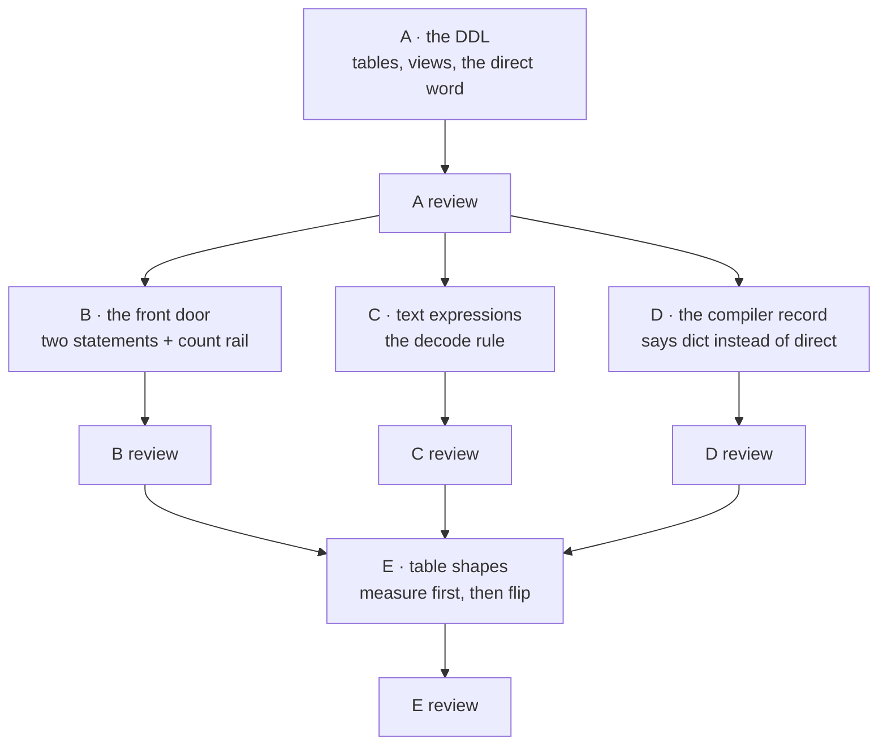

# Interning contract, plain words

Same plan as `2026-08-08-interning-contract.md`, told without a single file
reference. If you only read one, read this one.

**Rev 2.** A red team attacked this plan and broke it in seven places. All seven
are fixed in the sections below, and section 16 lists what each one was. Three
of the seven were "answers wrong and says nothing", which is the category that
matters.

**Rev 3.** Your call: *"do we have to have direct(string/text), can we please
just intern it all for now. this mixing and all its woes is whack."* Done. There
is no per-column opt-out any more, the compiler never quietly leaves a column as
words, and runtime-built strings go into the bag too. Section 17 is the summary
of what that deleted.

## TOC

- [1. The one-sentence version](#1-the-one-sentence-version)
- [2. What the compiler writes today](#2-what-the-compiler-writes-today)
- [3. What it writes after](#3-what-it-writes-after)
- [4. One word bag for the whole program](#4-one-word-bag-for-the-whole-program)
- [5. The view ships with the table](#5-the-view-ships-with-the-table)
- [6. The scary part: sorting](#6-the-scary-part-sorting)
- [7. The front door](#7-the-front-door)
- [8. Table shapes](#8-table-shapes)
- [9. The escape hatch, removed](#9-the-escape-hatch-removed)
- [10. Proving nothing broke](#10-proving-nothing-broke)
- [11. Who builds what](#11-who-builds-what)
- [12. Numbers to hit](#12-numbers-to-hit)
- [13. Things that will bite](#13-things-that-will-bite)
- [14. The gun](#14-the-gun)
- [15. Watching the word bag](#15-watching-the-word-bag)
- [16. What the red team broke](#16-what-the-red-team-broke)
- [17. What rev 3 deleted](#17-what-rev-3-deleted)

---

## 1. The one-sentence version

Stop storing the same string forty times. Store it once, in a numbered list,
and put the number in every table that mentions it. Ship a decoder view with
every table so nobody ever has to write the join by hand.

This has been built and lost four times. It dies every time because someone
treats it as an upgrade to apply later. So this time it is the compiler's
default path, and the decoder view comes out of the same function call as the
table.

---

## 2. What the compiler writes today

```
                     rel flow_reach
   ┌──────────────┬──────────────┬────────────┬────────────┐
   │  from_path   │  from_name   │  to_path   │  to_name   │
   │  TEXT        │  TEXT        │  TEXT      │  TEXT      │
   └──────────────┴──────────────┴────────────┴────────────┘
    all four are the PRIMARY KEY, table is WITHOUT ROWID

   src/engine/lower/pass_2/module_17.ts   resolveBindingStep_3   ...
   src/engine/lower/pass_2/module_17.ts   resolveBindingStep_4   ...
   src/engine/lower/pass_2/module_17.ts   resolveBindingStep_5   ...
                  ▲
        38-40 bytes, 24 of them the same prefix, written again per row
```

That path is copied into the table's key, into the delta table, into the
frontier table, into the wave table, and into every index over any of them.
Five or more copies of the same forty bytes, per row.

Count from the current corpus: the compiler emits 754 tables, 569 of them
`WITHOUT ROWID`, and 491 of those have at least one TEXT column sitting in the
primary key. That covers 167 of the 211 programs that compile, and 190 of the
211 carry a text column somewhere, in or out of a key. This is the normal
output.

Every comparison inside the database walks those shared prefix bytes one at a
time before it can decide which row is bigger.

---

## 3. What it writes after

```
     __str  (the word bag, one per database)
   ┌───────┬────────────────────────────────────────────┐
   │ __id  │ content                                    │
   ├───────┼────────────────────────────────────────────┤
   │   1   │ src/engine/lower/pass_2/module_17.ts       │
   │   2   │ resolveBindingStep_3                       │
   │   3   │ resolveBindingStep_4                       │
   └───────┴────────────────────────────────────────────┘

                     rel flow_reach
   ┌──────────────┬──────────────┬────────────┬────────────┐
   │  from_path   │  from_name   │  to_path   │  to_name   │
   │  INTEGER     │  INTEGER     │  INTEGER   │  INTEGER   │
   ├──────────────┼──────────────┼────────────┼────────────┤
   │      1       │      2       │     1      │      3     │
   └──────────────┴──────────────┴────────────┴────────────┘

               __txt_rel_flow_reach  (a view over the table above)
   ┌──────────────────────────────────────┬──────────────────────┬─...
   │ src/engine/lower/pass_2/module_17.ts │ resolveBindingStep_3 │
   └──────────────────────────────────────┴──────────────────────┴─...
```

Measured on identical four-column tables: integer keys insert 1.7 to 2.0 times
faster than text keys, at every size from four thousand rows to a million.

---

## 4. One word bag for the whole program

Two options were on the table.

| option | what it means |
|---|---|
| one bag per column shape | `flow_reach.from_path` gets its own numbered list, separate from `call_edge.caller_path` |
| **one bag for everything** | every string in the program, in one numbered list |

Pick one bag. The reason is a bug rather than a benchmark.

```
   rule:   reach(P) <- module(P), touched(P)
                       ▲          ▲
                       │          │
                    bag A       bag B
                  "foo.ts" = 7   "foo.ts" = 3

   the database compares  7 = 3   and answers "no rows"
   with no error, no warning, and no way to notice
```

Two bags means the same string has two different numbers, and every rule that
joins two relations on a text column silently returns nothing. Fixing that
would mean decoding both sides of every join, which is exactly the hand-written
string join this whole plan exists to abolish.

Also: every earlier version that survived used one bag. The two that used
something else are the two that died.

Costs of one bag, written down rather than hidden:

- it is one busy table, which matters the day there are two writers
- deleting a relation cannot delete its strings
- it grows and never shrinks within a run

None of those change any decision here. The growth one gets measured before
anyone builds a cleanup.

---

## 5. The view ships with the table

The recorded sentence that killed version four was "view deferred until
verified live". The view never got verified live. It never got built.

So the fix is structural rather than procedural.

```
   the function that emits DDL returns a LIST

     plain relation      →  [ CREATE TABLE ... ]
     relation with text  →  [ CREATE TABLE ... , CREATE VIEW ... ]
                                                 ▲
                                    same call, same list, same commit
```

There is no second function. There is no follow-up task. There is nowhere in
the code for a table to exist without its decoder. The test is a length check:
every relation with an interned column returns exactly two things.

The compiler already writes this exact line for declared struct types. It has
worked for a month. The change applies it to plain text columns too.

Written as rx, the view is the last operator in the chain:

```
  arrivals ──scan──▶ word bag ────────────────┐
     │                                        │
     └──map(text→number)──▶ the walk ──▶ withLatestFrom ──▶ decoded rows
                            (never sees                       │
                             a string)                        ▼
                                                       what serve and the
                                                       tick log read
```

---

## 6. The scary part: sorting

Numbers do not sort the way words do. `"apple"` comes before `"banana"`, but
apple might be number 91 and banana number 4. Every place the system leans on
word order rather than word identity is a place this plan can break.

The good news, found by reading the compiler: the language mostly refuses to
sort text already.

| what a rule can say about text | today | after |
|---|---|---|
| `A < B`, `A > B` and friends | refused, numbers only | still refused, nothing to break |
| `A == B`, `A \== B` | works | works, because one bag means one number per word |
| `min(A)`, `max(A)` | refused on text, numbers only | still refused |
| `regexp(A, "...")` | works | **breaks** without a decode |
| `norm(A)` | works | **breaks** without a decode |
| joining two strings together | works | **breaks** without a decode |
| `group_concat` and `json_group_array` sorted by value | works | **breaks** without a decode |
| **`A == "some literal"`** | works | **breaks**, and this is the one rev 1 missed |

Rule one, covering the first four:

> If an expression wants the WORD, hand it the word. If it only wants to know
> whether two things are the same, hand it the number.

One function decides which. Five call sites use it. A test walks the operator
registry and fails if any text operator is missing its decode, so the next
person to add a text operator finds out immediately.

### The one the red team caught: comparing against a constant

A rule that says `Value == "rust"` used to compile to exactly that. After
interning, the column holds a number and the constant is still a word:

```
   before:   "kind" = 'rust'          ← word vs word, works
   after:    7      = 'rust'          ← number vs word

   SQLite does not complain. It looks at the column's declared type,
   decides the literal should be a number, and:

     'rust'   is not number-shaped  →  stays a word  →  matches NOTHING
     '42'     IS number-shaped      →  becomes 42    →  matches whichever
                                                        word happens to be #42
```

Both answers are silently wrong, and 12 programs in the test corpus do this
today.

Rule two fixes it, and it is simple because a constant is known at compile time:

> Put every constant in the bag when the program boots. Then compare
> number-to-number, like everything else.

```
   at boot, once:   add "rust", "warning", "acme", ... to the bag
   in every rule:   "kind" = (look up 'rust' in the bag)
```

### Two more the red team did not name, found while fixing that one

Constants do not only appear in comparisons. They appear on the OUTPUT side too,
and that side is a write:

```
   a rule that produces:   diag(path, 'warning', 'eprintln-new-file')
                                      ▲          ▲
                                      └──────────┴─ words being written
                                                    into columns that now
                                                    hold numbers
```

26 programs do this. Same fix: the constant is in the bag, so the rule writes
its number.

The third case is a rule that BUILDS a string by gluing pieces together, so the
word does not exist until the rule runs:

```
   diag_message(path, hits || ' counted hits; the baseline allows ' || cap)
                              ▲
                     a brand new string, made at run time,
                     not in the bag and not lookupable in the
                     same statement that computes it
```

Rev 2 let that column quietly stay words. **Rev 3 does not**, because quietly
staying words is exactly the mixing you rejected. The string goes in the bag as
it is written, in two statements instead of one:

```
   1. build the strings and put the new ones in the bag
        INSERT OR IGNORE INTO bag(word)
          SELECT DISTINCT <the built string> FROM <the rule's inputs> WHERE <its filter>

   2. write the rows, looking each string up as it goes
        INSERT INTO diag(path, message)
          SELECT path, bag.number
          FROM <the rule's inputs> JOIN bag ON bag.word = <the built string>
          WHERE <its filter>
```

The rule's inputs and filter are copied word for word into both, so both see the
same rows. Statement 1 only ever ADDS to the bag, so it cannot change what
statement 2 reads.

### What that costs, counted rather than guessed

```
   programs that build a string into a column:        17
   of those, inside a fixpoint loop:                   0   ← the number that matters
   where they land:  diag (11)   message (1)   host demands (5)
```

Zero is the whole story. Every built string in the test corpus lands in a
diagnostics-shaped relation, written once per tick, outside any loop. Their cost
goes from one statement to two, plus one index lookup per row.

The bad case, named so it is not a surprise: a built string inside a fixpoint
loop would run its rule twice on **every round**. On the grid benchmark the two
loop statements are 56% of the time, so doubling one is roughly a 28% hit. That
case does not exist today, and the compiler now WARNS at build time on the first
one that does.

### And it was tested, on both databases

```
   inputs:  a.rs/3/x   b.rs/7/y   c.rs/3/x   d.rs/9/NULL      filter: n > 2

   today, one statement, words in the column   →  3 rows
   rev 3, two statements, numbers in column    →  3 rows, bag holds 2
                                                  (the duplicate stored once)
   decode the numbers back and compare         →  ZERO difference
```

Both statements run in one transaction. The row with the missing note is dropped
by BOTH designs, for the same reason, so that is not a new behaviour.

### The refusal rev 2 needed is now unnecessary

Rev 2 had to add a compiler refusal for "word column joined to number column",
because two things could leave a column as words: your opt-out, and the
automatic give-up above. Rev 3 deleted both, so no program can produce that
situation at all.

The check does not vanish entirely. It shrinks to an internal alarm that should
never go off, kept for the day someone brings the opt-out back with evidence. A
check nobody can trigger is not a guard, so it gets a unit test rather than a
pretend test program.

### Why the tick log survives

```
  table (numbers)
      │
      ▼  the decoder view
  rows with words
      │
      ▼  multiset diff  ── keyed by row content, order does not matter
  add / del lists
      │
      ▼  tick log       ── sorts both lists alphabetically before printing
  bytes on disk
      │
      ▼
  compared against the oracle, which never touched SQL and did not change
```

Scan order never reaches the comparison. That is the whole safety argument, and
it holds only if the decoder view exists. Which is why the view is section 5.

### The one place order really does change

Row insertion order changes. That is invisible everywhere except two spots:

1. append-only log relations, where physical row order is the data
2. `keep(count(N))`, which keeps the last N rows by insertion order

Both get a new fixture built to fail before the fix and pass after.

---

## 7. The front door

Two SQL statements per tick, whatever the number of rows or relations in it.

```
  ┌── one tick ──────────────────────────────────────────────┐
  │                                                          │
  │  incoming rows, all relations, all text values           │
  │            │                                             │
  │            ▼                                             │
  │   statement 1:  add any new words to the bag             │
  │   statement 2:  read back the numbers for all of them    │
  │            │                                             │
  │            ▼                                             │
  │   rewrite every row: word → number                       │
  │            │                                             │
  │            ▼                                             │
  │   struct plane runs (it also has text columns)           │
  │            │                                             │
  │            ▼                                             │
  │   the rules run                                          │
  └──────────────────────────────────────────────────────────┘
```

Word interning goes FIRST, before the struct plane, because struct target rows
have text columns of their own and their identity key must be computed over
numbers.

The struct plane uses three statements because its key can be part of the row,
so two different rows can claim the same key and it has to check. The word bag's
key is the whole word, so that check cannot fail and the statement is deleted
rather than copied.

Nothing is allowed to be NULL. Stored text columns are already declared NOT
NULL, and the word bag's column is NOT NULL too. A NULL arriving at the door
stops with a named error saying which relation and which column. The empty
string is an ordinary word with an ordinary number.

### The rail that keeps it flat

A test counts SQL statements while feeding the door 1, 3, and 50 distinct
values across 1 and 4 relations. The answer must be 2 every time. Feeding it
nothing must cost 0.

The test header records what it looks like when sabotaged: switch the door to
one statement per row, watch the count go to 50, that is the number the test is
guarding against.

---

## 8. Table shapes

Two separate questions that keep getting confused.

```
   question 1: does this column hold a number instead of a word?
               → decided by the column's type and the escape hatch

   question 2: does this table have a hidden row counter?
               → decided by whether the fixpoint walks it a certain way

   these are INDEPENDENT. Do not couple them.
```

| table | shape | why |
|---|---|---|
| ordinary relation | keeps its current no-rowid shape, keys now numeric | fastest insert available, and it collects the 1.7-2.0x win directly |
| recursive head that the fixpoint walks | gains a rowid | the sub-second work needs to read "everything added since last round" as a rowid range, which a no-rowid table cannot do |
| wave, ping, pong, cone tables | unchanged | their scan order IS the ordering contract; touching them moves every program's output |
| the arrivals staging table | unchanged | its rowid is the sequence number |
| log relations | unchanged | duplicate rows have to physically coexist |

One gap to state plainly: the recorded cost constant comparing the two table shapes is
ambiguous about which side owns which number, and the insert ladder above it
reads the other way. The lane that flips head shapes measures it first and
writes the direction down. Do not flip a table on the strength of a number
nobody can read.

---

## 9. The escape hatch, removed

Interning is a 2.44x win when words repeat and a 1.2% loss when every word is
unique. That was measured in this repo and written down nowhere useful.

Rev 2 spent a new keyword, two error messages, a whole-program analysis, an
automatic give-up rule, and a join checker to recover **that 1.2%** on the
columns where interning loses.

Rev 3 spends none of it:

```
   rev 2                                    rev 3
   ─────────────────────────────────        ──────────────────────────────
   rel log(url: text, body: text)           rel log(url: text, body: text)
       direct(body).                            .
        ▲
   one column opts out                      nothing opts out

   plus: 2 error messages for getting       plus: nothing
         the opt-out wrong
   plus: a rule for when the compiler
         opts a column out for you
   plus: a checker for when an
         opted-out column meets one
         that did not
```

Every one of those extra pieces was a place two kinds of column could meet, and
the red team proved one of them was reachable and silent. That is the trade in
one line: **1.2% on some columns, against four moving parts and one confirmed
silent-wrong-answer bug.**

### What it costs you

| you pay | how much |
|---|---|
| a column where every value is different, like a digest or a request body | up to 1.2% slower than leaving it alone. No way to turn it off per column |
| a column built by gluing strings together | one extra statement per rule, plus one lookup per row. 17 programs, none in a loop |
| the bag gets bigger | one entry per distinct built string. Diagnostics-shaped relations today |

### How the escape hatch comes back

Written down so this is a reversible decision rather than a forgotten one.

It comes back when a measured case shows a real loss. The monitoring in section
15 is exactly how you would spot it: **a relation whose hit rate sits near zero,
tick after tick, is a relation whose words never repeat.** That is the evidence
to bring, along with a row count and a before/after.

Three things are kept so the return is cheap rather than a rewrite:

- the compiler's internal record still has a slot saying which kind a column is,
  so a mixed program is expressible the day the surface allows it
- the internal alarm from section 6 fires at build time if two kinds ever meet
- the gun (section 14) still has a whole-program off switch, which is the blunt
  version of the same escape and enough for a first measurement

Until then, one rule with no exceptions: **every text column is a number.**


## 10. Proving nothing broke

There are 306 test programs. 211 of them compile. The compiler's output changes
for 167 of them.

```
  what changes                        what cannot change
  ─────────────────────────────       ──────────────────────────────
  emitted SQL: column types           the oracle's answer files
  emitted SQL: one view per relation  the tick logs the runtime prints
  emitted SQL: decode subqueries      which programs compile and which refuse
```

The oracle is the referee and it stays the referee for a structural reason: it
computes the right answer in prolog and never issues a single SQL statement. It
cannot notice this change. So if the tick logs still match, the change is
correct.

Three checks, in order:

1. run the sweep, demand zero wrong tick logs and the same compile counts
2. demand no refusal message changed, except the two brand-new ones
3. **classify every changed line of emitted code**

Check 3 is the one that makes this reviewable. There are exactly seven kinds of
line that are allowed to change:

```
   ✓ a column type flipped from TEXT to INTEGER
   ✓ a CREATE VIEW line appeared
   ✓ a read switched from the table to the view
   ✓ a decode subquery appeared in a text expression
   ✓ a constant lookup appeared, or the boot statement that fills the bag
   ✓ a table swapped one key shape for another  (section 8's separate change)
   ✓ the stats relation and its statements       (section 15)

   ✗ anything else  ← that is the finding, go look at it
```

The last three are new in rev 2. The red team caught the sixth: section 8's
table-shape change is scheduled, correct, and has nothing to do with interning,
and a checker that calls it a problem teaches everyone to ignore the checker.

Write that classifier as a script. Nobody should read 167 diffs by hand.

New test programs to add, each one red before the fix and green after:

- a sorted `group_concat` where insertion order and alphabetical order disagree
- a `keep(count(2))` log fed in an order that exposes the sequence change
- two relations joined on a text column, asserting the result is not empty
- a text column holding non-ASCII bytes, round-tripped out through the view
- a `direct` relation, asserting its column stayed TEXT
- **a rule comparing against a constant containing a backslash.** This one is
  already in the corpus and becomes the pinning test: if anything re-quotes a
  word on its way through the bag, a backslash is where it shows
- **a rule writing a constant into a column**, asserting the row is findable
- **a rule building a string into a column**, asserting that column gave up on
  interning and recorded why
- **a word column joined to a number column**, asserting the compiler refuses
- **a program naming a relation in the reserved namespace**, asserting refusal
- **a program with constants**, asserting the bag's counter starts at the right
  number rather than at zero

---

## 11. Who builds what

Nobody shares a file. Where two lanes want the same file, they run one after
the other, never at the same time.



| lane | job | who |
|---|---|---|
| A | emit the word bag, emit every relation's decoder view in the same breath, parse `direct` | the careful model: deciding which columns intern is a judgment call |
| A review | count the DDL branches, confirm no path returns a table without a view | the fast model: it is a length check |
| B | the two-statement door, the NOT NULL rule, the ordering against the struct plane, the count rail | the fast model: the struct plane is a working template and the SQL is written out for them |
| B review | interface rules, one subscribe, no awaited observables, and does the count test actually count | the fast model |
| C | the decode rule and its five call sites | the careful model: a missed call site is silent, which is the worst kind |
| C review | walk the break list line by line against real emitted SQL; also confirm equality checks did NOT grow a decode by accident | the careful model |
| D | three clauses so the compiler's own record says "this column is a number now" | the fast model |
| D review | does the agreement test compare two real outputs or two hardcoded strings | the fast model |
| E | measure the table-shape constant, then flip only the tables that need it | the careful model: this ripples through every program rather than staying local |
| E review | did any tick log move, and did the sequence number move anywhere unpredicted | the careful model |

Every lane starts by fast-forwarding to the commit the coordinator names. If
that fails, stop and say so. Lanes do not spawn helpers.

---

## 12. Numbers to hit

What the bench already measured:

| thing | number |
|---|---|
| interning speed | 7.5 million edges per second |
| interning as a share of total work | 0.06% on small inputs, 4.3% at a million edges |
| turning numbers back into words | 40 to 43 million rows per second |
| that decode versus the insert it feeds | 1 to 29 |
| integer keys versus text keys, same table | 1.68x to 1.99x faster, every size |
| the walk itself on interned data | 97-104% of the integer baseline, inside noise |

What this arc must hit:

| gate | number |
|---|---|
| interning share of a real text-keyed program | at most 4.5% |
| insert speedup on that program | between 1.68x and 1.99x |
| the three shootout cases | no regression, at most +2% |
| single-edge insert and delete ticks | 42ms, 56ms, 82ms, 1ms, all held |
| sweep | zero wrong tick logs |
| changed emitted lines | all four allowed kinds, nothing else |
| every gate | under ten seconds |

One number this does NOT buy: the shootout cases feed integer node ids already.
Their keys are numbers today. Interning cannot speed them up, and the sub-second
goal still belongs to the table-shape lane. Anyone quoting 1.7x at the grid case
has mixed two different workloads.

---

## 13. Things that will bite

| what | when you notice | what catches it |
|---|---|---|
| **numbers sort differently than words** | a sorted list comes out shuffled | the decode rule for expressions, plus two new fixtures for the two spots where insertion order is real data |
| **NULL** | a text column arrives empty | impossible in storage, named error at the door, never a silent zero |
| **numbers do not travel** | somebody copies a snapshot to another database and the numbers mean different words | law: a number is a fact about one database, and nothing written outside the database contains one |
| **the bag only grows** | long-running process, high word churn, the bag outgrows the data | accepted for now, matching how the previous version ships. Measure it on a real workload before building any cleanup |
| **all-unique workloads** | 1.2% slower than doing nothing | accepted, everywhere, on purpose (section 9). The monitoring is how you would find a case worth arguing about |
| **strings built at run time** | one extra statement per rule, one lookup per row | 17 programs, none inside a loop, and the compiler warns on the first one that is |
| **doing the swap in the wrong order** | a word lands in a column declared as a number, the database stores it anyway, and the row is unfindable forever | the door's count rail also asserts the batch it hands onward contains no words in numbered positions |
| **a new text operator forgets to decode** | it reads a number, matches nothing, ever | a test walks the operator registry and fails the day the operator is added |
| **the view drifting from the table** | a reader gets fewer columns than the table has | impossible while both are built from the same column list in one function; the reviewer's job is to confirm no second builder appears |

---

## 14. The gun

You asked for a gun. What follows names what it can shoot and how big the hole is.

### The thing that makes this awkward

Interning changes what the tables look like. A column says INTEGER or it says
TEXT, and that word is baked into the database file the second it is created.
No switch flipped at runtime can change a word that is already written down.

And a switch that pretended to would be worse than useless:

```
   flag says "stop interning"
              │
              ▼
   runtime writes  "foo.ts"  into a column declared INTEGER
              │
              ▼
   SQLite shrugs and stores it            ← no error, no warning
              │
              ▼
   every lookup compares "foo.ts" against a pile of numbers
              │
              ▼
   finds nothing, forever, and the only fix is rebuilding the database
```

So the gun fires at compile time. A runtime switch is banned on purpose, and
this plan says so in advance so nobody adds one later as a convenience.

### Three triggers, one that does not exist

```
   ┌─────────────────────────────────────────────────────────────┐
   │  level 0 ── one column                                      │
   │     ✗ REMOVED IN REV 3 (section 9). Per-column granularity  │
   │       was the mixing you asked us to stop doing.            │
   ├─────────────────────────────────────────────────────────────┤
   │  level 1 ── one program                                     │
   │     compile with  --intern=direct                           │
   │     blast radius: every text column in that program         │
   │     cost: one flag, recompile, rebuild that database        │
   ├─────────────────────────────────────────────────────────────┤
   │  level 2 ── everything                                      │
   │     same flag, whole corpus                                 │
   │     blast radius: back to exactly the old output            │
   │     cost: one flag, ~4 seconds to recompile all 306         │
   │           test programs, rebuild every database             │
   ├─────────────────────────────────────────────────────────────┤
   │  level 3 ── flip it on a live database                      │
   │     ✗ DOES NOT EXIST AND WILL NOT                           │
   └─────────────────────────────────────────────────────────────┘
```

### How we know the gun actually works

By diffing it, on every commit.

Rev 1 said: compile everything with the flag off, and demand the output match
the commit before any of this landed, byte for byte. The red team killed that.
Section 8's table-shape change is scheduled independently, so the day it lands,
the flag-off output legitimately stops matching that old commit and the check
goes red forever. A check that goes red for correct work gets switched off.

The fix is to stop comparing against history:

> Compile everything TWICE at today's code. Once with interning on, once with it
> off. The only differences between those two outputs may be the interning
> differences.

```
   today's compiler ──┬── intern ON  ──▶ output A ──┐
                      │                             ├─▶ diff
                      └── intern OFF ──▶ output B ──┘
                                                     │
                    every difference must be one of the
                    interning kinds, and nothing else
```

This can never go stale. Anything else the compiler grows shows up in BOTH
outputs and cancels. Eight seconds for the pair, so it still runs on every
commit.

The old historical check survives as a one-time thing: run it once, on the day
interning first lands, to prove the off-switch really reproduces the old world.
Then stop running it.

### The expensive part

Recompiling is seconds. Rebuilding the database is the real bill, and it depends
entirely on what fills that database.

Two ways out:

**Way A, the normal one: rebuild from the source.** Code extraction re-reads the
code. Test programs re-run their schedule. A server replays its arrival trail.
Nothing custom, and you end up with the real answer rather than a translation.

**Way B, getting the data out, only while the old program is still attached.**
The decoder view is already the old shape, so dumping a relation back to plain
text is one line each:

```
   CREATE TABLE relx_dump AS SELECT * FROM __txt_relx;
```

Rev 1 called this "un-interning in one statement per relation". The red team was
right that this oversells it. **That kind of copy makes a bare table: no primary
key, no uniqueness, no declared column types, and a different name.** It carries
the data and nothing that made it a relation.

The actual round trip:

```
   1. dump each relation through its view      ← one statement each, on the
                                                 old database, views still alive
   2. boot the reverted program on a FRESH db  ← its own setup makes the
                                                 properly shaped tables
   3. attach the dump
   4. copy rows in, naming columns explicitly
   5. detach and delete the dump
```

Five steps and a boot. The "one statement" claim covers step 1 only.

Way A is preferred for exactly this reason: it skips steps 3 to 5 and gives you
the real answer instead of a translation.

Do step 1 BEFORE switching to the reverted program, while the views still
exist. That much of the "view ships with the table" payoff is real: without the
view, step 1 would be a hand-written join per relation.

### Which mode built this?

Every generated program stamps itself `dict` or `direct`. Attaching a `dict`
program to a `direct` database is refused by name, with both modes printed. You
never have to guess which world a database lives in.

### Where the gun gets built

In the same lane and the same commit as the interning itself.

A period where the new thing exists and its off switch does not is exactly how
this technique died the last four times: something you cannot back out of does
not get backed out, it gets lived with.

---

## 15. Watching the word bag

You want to see what the word bag does over time, and line that up against what
the database is doing. That is the right ask: a technique nobody
watches is a technique nobody can defend.

### The shape: it is just another relation

The engine already has one relation that the compiler owns and the runtime
fills: the program catalog. It is declared through a normal contract, it gets a
normal table, and you query it with normal rules. No special case, no name
hardcoded anywhere in the engine.

The word bag gets a second one:

```
   __str_stats  (one row per tick, oldest 4096 kept)

   ┌────────┬────────┬───────────────┬──────────┬─────────────┐
   │ tick   │ rows   │ content_bytes │ interned │ looked_up   │
   ├────────┼────────┼───────────────┼──────────┼─────────────┤
   │  41    │ 12,400 │   488,300     │   400    │   9,000     │
   │  42    │ 12,400 │   488,300     │     0    │   8,700     │
   │  43    │ 12,401 │   488,341     │     1    │   9,100     │
   └────────┴────────┴───────────────┴──────────┴─────────────┘
      │        │            │             │          │
      │        │            │             │          └─ words asked about this tick
      │        │            │             └──────────── words NEW this tick
      │        │            └────────────────────────── total text stored
      │        └─────────────────────────────────────── words in the bag
      └──────────────────────────────────────────────── the join key
```

The hit rate is deliberately NOT stored. It is `looked_up` minus `interned`,
over `looked_up`, and you compute it with a rule, because the engine answering
questions about itself using its own rules is the entire point.

### The trap we are avoiding

The lazy way to fill `rows` and `content_bytes` is to count the bag every tick:

```
   SELECT count(*), sum(length(content)) FROM __str      ← reads EVERY row
                                                            EVERY tick
```

At a million words that freezes the machine once per tick. Named here so nobody
rediscovers it in three months.

The real way: keep a running total. Each tick adds this tick's new words to last
tick's number. Reading "last tick's number" is one backward step from the end of
the log, and the log is capped at 4096 rows anyway.

Rev 1 counted the new words by having the insert hand back what it inserted, and
adding them up in JavaScript. **The red team broke that twice.**

First, the driver reports "rows inserted" as ZERO whenever the statement is
asked to hand rows back. So the counter would have read 0 every tick, forever,
and the whole feature would have reported a dictionary that never learns.

Second, and worse: adding up in JavaScript means the counting has to happen
BETWEEN two database writes, which means they cannot be in the same transaction.
Kill the process in that gap and the words are saved but the count is not, and
nothing ever notices or repairs it.

Both die to the same change: **count first, in SQL, before inserting.**

```
   ┌── ONE transaction ────────────────────────────────────────┐
   │                                                           │
   │  1. stats:  how many of these words are new?              │
   │             (asks the bag, BEFORE anything is added)      │
   │             writes the row: tick, totals, new, asked      │
   │                                                           │
   │  2. intern: add the new words                             │
   │                                                           │
   │  3. lookup: read back everyone's number                   │
   │                                                           │
   └───────────────────────────────────────────────────────────┘
        all three commit together, or none of them do
```

Asking "is this word new" is one index lookup per word, which the insert was
going to do anyway. Nothing reads the whole bag.

This was tested rather than reasoned about. Seeded with one word, handed four
words (one repeat), on both database builds this project uses:

```
   words in:  alpha, beta, gamma, beta
   result:    new = 2      (beta and gamma; the repeat counted once)
              asked = 3    (distinct words presented)
              bytes = 9    ("beta" + "gamma")
```

```
   before telemetry:   2 statements per tick at the door
   after telemetry:    3 statements per tick, all in one transaction
   telemetry off:      2 statements, and no table exists at all
   nothing arriving:   0 statements
```

Turning it off is not a flag. A program that never mentions `__str_stats` gets
no table, no column definitions, no insert. The cost is zero because the thing
does not exist.

### Lining it up with everything else

Every one of these reads the same tick counter, so `tick` joins them all:

```
                     tick counter
                    (bumped once per tick)
                          │
        ┌─────────────────┼─────────────────┬────────────────┐
        ▼                 ▼                 ▼                ▼
   __str_stats       the tick log      the trace line    live channel
   rows, bytes,      which relations   how many          for a watcher
   new, asked        moved, and how    statements ran,   that wants it
                     many rows         how long          right now
```

Nothing new gets built for the last three. The tick log exists. The trace line
exists and already counts statements, because the database wrapper refuses to
run a statement that escapes the count. The live channel exists and costs one
boolean check when nobody is listening.

One thing stays deliberately separate: the true on-disk size of the word bag.
That number comes from asking SQLite to walk its pages, which is not cheap, so
it stays where it already lives, at the server's stats endpoint, on demand.
`content_bytes` is the cheap running number. Page bytes are the expensive true
number. Both are available; only the cheap one runs per tick.

And because it all lives in the database, it survives a hard kill. After a crash
you can still ask what the word bag was doing.

### One question, answered end to end

> "Did the dictionary stop growing when ingest went quiet?"

Two rules:

```
  rel dict_converged(tick: int).
  dict_converged(Tick) <-
    __str_stats(Tick, _Rows, _Bytes, 0, LookedUp), LookedUp > 0.
```

Read out loud: give me every tick where the door RAN, was asked about words, and
added none. That is the bag having learned everything.

```
  rel dict_hit_pct(tick: int, pct: int).
  dict_hit_pct(Tick, ((LookedUp - Interned) * 100) / LookedUp) <-
    __str_stats(Tick, _Rows, _Bytes, Interned, LookedUp), LookedUp > 0.
```

Multiply by 100 first, then divide, because integer division throws away the
fraction otherwise.

Written as rx, the same two questions:

```ts
const dictStats$ = tickResult$.pipe(
  map((result) => result.dictionary),
  shareReplay({ bufferSize: 4096, refCount: true }),   // keep(count(4096))
);

const dictConverged$ = dictStats$.pipe(
  filter((stat) => stat.lookedUp > 0 && stat.interned === 0),
  map((stat) => ({ tick: stat.tick })),
);

const dictHitPct$ = dictStats$.pipe(
  filter((stat) => stat.lookedUp > 0),
  map((stat) => ({
    tick: stat.tick,
    pct: Math.trunc(((stat.lookedUp - stat.interned) * 100) / stat.lookedUp),
  })),
);
```

Now read the answer:

```
   tick 40   interned 400   hit 95%     ← still learning
   tick 41   interned 400   hit 95%
   tick 42   interned   0   hit 100%    ← dict_converged fires
   tick 43   interned   1   hit 99%
   tick 44   ─── no row ───             ← the door did not run at all
```

Tick 44 having no row is information rather than a gap. The tick log says tick
44 happened, so the absence means nothing arrived that tick. Growth stopped
because ingest stopped. Ticks 42 and 43 are the interesting ones: work was
arriving and the bag had already seen almost all of it, which is the technique
paying off.

That reading only works because of the one-transaction fix above. The red team
pointed out that in rev 1's design a missing row could ALSO mean "the door ran,
added words, and then the process was killed", which is the opposite meaning.
Now the row and the words it counts commit together, so a missing row has
exactly one meaning.

One loose end, stated rather than buried: the constants added at boot (section
6) go into the bag outside this per-tick path, so boot has to write its own
starting row. Skip that and the counter is permanently short by however many
constants the program has. There is a test for it.

### Who builds it

| lane | job | who |
|---|---|---|
| F | declare the stats relation the same way the catalog is declared, and make it vanish when unused | the fast model: the catalog is a copy-paste template |
| F review | does a program that never mentions it come out byte-identical to before | the fast model |
| G | the one extra statement, the running totals, the live channel, the statement-count test | the fast model: the SQL is written out |
| G review | **does anything in here read the whole word bag**, and does the running total survive a crash | the careful model: a hidden full scan is what turns monitoring into the outage |
| J | the reserved-name refusal, and its test programs | the fast model: one rule with a named error |
| K | **strings built at run time go in the bag** (section 6): split the rule into two statements, warn if one ever lands inside a loop | the careful model: splitting a rule in two while keeping the output byte-identical is the whole job |
| K review | are the rule's inputs and filter copied word for word into both statements, is the duplicate-removal there, is the missing-value row still dropped the same way | the careful model |


---

## 16. What the red team broke

Seven holes. Three of them the "wrong answer, says nothing" kind, which is the
only kind that really matters.

| # | what they found | how bad | fixed in |
|---|---|---|---|
| 1 | comparing a column to a written-out constant was never in the plan's list of things that break | **wrong answer** | section 6. Constants go in the bag at boot. Fixing it turned up two more cases nobody had named: writing a constant into a column, and building a string into a column |
| 2 | the way the plan counted new words reads zero, always, on the real driver | **wrong answer** (the monitoring) | section 15. Counting moved into SQL and now runs before the insert |
| 3 | a column that opted out, joined to one that did not, returns nothing and says nothing. The only guard was a review comment | **wrong answer** | section 6. The compiler now refuses that join by name |
| 4 | the gun's proof compared against an old commit, and a separate scheduled change would make that comparison fail forever | breaks the process | section 14. Compare two compiles of today instead |
| 5 | the escape-hatch copy loses the table's key and shape, so it is raw data rather than a working relation | breaks the process | section 14. Five steps now, counted accurately |
| 6 | the monitoring's write and the words it counts could not be in the same transaction, so a crash between them under-counts permanently and nothing repairs it | **wrong answer** (the monitoring) | section 15. One transaction, count first |
| 7 | the reserved `__` name prefix was described as reserved and never actually enforced | breaks the process | new rule: the compiler refuses a program that declares or writes a relation in that namespace, while still letting programs read the ones it owns |

### What they tried and could not break

Five attacks bounced. Worth listing, because each one was something the plan
asserted without proof, and now each has proof behind it:

- the insert really does hand back exactly the rows it inserted, de-duplicated,
  on both database builds
- trimming the log to its last 4096 rows never trims the row the running total
  reads next
- empty strings and missing values behave: empty interns once and adds zero
  bytes, missing is refused at the door
- the page-size measurement works on both database builds
- the language really has no way to sort text, so there is no hidden ordering
  break beyond the ones listed

### The one number that will fool the next reviewer

The reviewer whose job is "does anything read the whole bag" will run the query
planner, and for one of these reads it prints the word **SCAN**. That reading is
wrong. Looking at what the database actually executes shows it jumps to the last
row and stops. Timed at 1.3 microseconds over a thousand rows and 1.0 microseconds over four
hundred thousand, so it does not grow with the log.

It is written down here so the answer costs a minute rather than a lane.


---

## 17. What rev 3 deleted

Your word: *"do we have to have direct(string/text), can we please just intern it
all for now. this mixing and all its woes is whack."*

### The four changes

| # | what | why |
|---|---|---|
| 1 | the per-column opt-out is gone from the language | it was one of two ways a column could stay words, and the way the red team's worst bug got in |
| 2 | the compiler no longer gives up on a column by itself; built strings go in the bag as they are written | that was the other way |
| 3 | the "word column meets number column" refusal shrinks to an internal alarm | with both ways gone, no program can reach that state, and a check nothing can trigger is not a check |
| 4 | the compiler's record still labels each column's kind | a text column now stores a number, and that pair means nothing without the label. It is also what makes the opt-out cheap to bring back |

### What got simpler

```
   rev 2                                  rev 3
   ───────────────────────────────        ────────────────────────
   "is this column a number?"             "is it text?"
     read the declaration
     check for an opt-out
     scan every rule that writes it
     three possible answers                one answer

   4 new error messages                   1
   1 new keyword                          0
   2 kinds of text column                 1
```

### What got more expensive

Said plainly, because you chose this knowing the cost:

- **1.2%** on any column whose values never repeat, with no way to turn it off
- **one extra statement plus one lookup per row** on the 17 programs that build
  strings, none of which sit inside a loop
- the bag grows by one entry per distinct built string

### The one number that decides whether this was right

The monitoring in section 15 reports, every tick, how many words were already
known. A relation whose hit rate sits near zero is a relation whose words never
repeat, and that is the exact case the opt-out existed for. If that number never
approaches zero, the opt-out was never worth its four moving parts. If it does,
section 9 names the evidence to bring to get it back.
