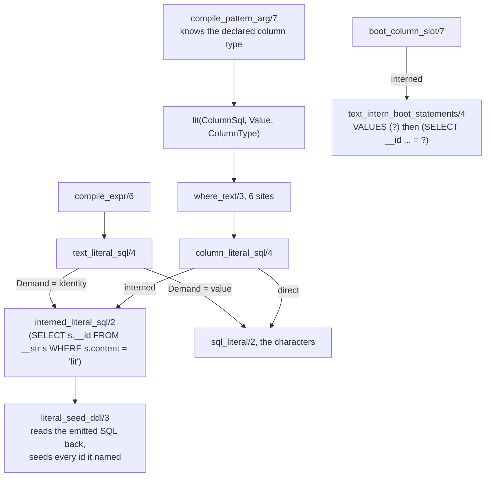

# REPORT-IC — the literal path under `intern(dict)`

Lane I-C (opus), branch `lane/i-c-literals`, base `9bc52a9b` verified first action.
Commits: `83198a68` (threading + lowering + boot seed), `46379ded` (classifier + tests).
Banked by the coordinator; the lane's harness blocked writing this file itself.

## 1. What landed, per scope item

| # | scope item | landed |
|---|---|---|
| 0 | mode threading | `Mode` is the first argument of 64 SQL-building predicates, `lower_program/2` down to `where_text/3` and `compile_expr/6`. Zero emitted bytes move at direct |
| 1 | literals, READ | `compile_pattern_arg/7` emits `lit(ColumnSql, Value, ColumnType)`; `where_text/3` resolves via `column_literal_sql/4` when that column is interned |
| 2 | literals, WRITE | `compile_expr/6` gains `Demand`. `identity` (head projection, `==`, `\==`, `:=` right side, `GROUP BY`) resolves the constant; `value` (concat piece, `norm`, `regexp`, json1 sub-arg, aggregated text) keeps the characters |
| 3 | the boot-seed hole (§23) | `boot_statements/6` takes the mode. An Initial row's text column emits `INSERT OR IGNORE INTO "__str" ("content") VALUES (?)` before the row, and the row's slot is `(SELECT "__id" FROM "__str" WHERE "content" = ?)` — the shape `struct_intern_statements/8` already used for a `ref` column |
| 3b | module literal seed | one DDL statement per module, between the `__str` create and the first table |
| 4 | `eq_lit` fence | left standing, reason in §5 |
| 5 | G9 classifier | three classes `literal-id`, `literal-seed`, `seed-id`; `unexplained=0` |
| 5b | plunit | 8 new tests, dict+direct pairs, fail-first receipts taken |

Measured numbers:

| quantity | value |
|---|---|
| modules resolving a literal through `__str` at dict | 38 of 211 |
| literal id lookups emitted | 802 |
| boot-seed intern statements / id slots | 423 each, exactly paired |
| corpus modules losing `fixpointIr` to the fence | 0 — 4 modules carry non-null `fixpoint_ir` at dict, the same 4 as at direct (§21.2's number to watch) |
| emitted bytes moving at `intern(direct)` | 0 |

## 2. Call-site enumeration

`where_text/3`, read side — 6, the contract's count is right: `lower.pl:356`
`compile_positive_uses/7`, `:411` `compile_negative_uses/6`, `:2123`
`edge_delta_project_sql/9`, `:2423` `avg_delta_rows_sql/5`, `:2622`
`aggregate_scope_seed_sql/7`, `:4160` `level_delta_select_arm/8`. All six are fed
by two `lit/3` producers at `:289` and `:296`, so the column's declared type
travels in the term and no site needed a per-site decision.

`head_select_list/5` — 7 consumers: `:2036` `edge_statement_single/10`, `:2132`
`edge_delta_project_sql/9`, `:3562`+`:3564` `level_recursive_arm_parts/9`,
`:3579` `level_ref_count_arm/4`, `:3643` `level_insert_sql/5`, `:4165`
`level_delta_select_arm/8`.

Sites the contract's six do NOT cover, found here. Probed across all 306
fixtures, 6 carry one:

| shape | fixture | site |
|---|---|---|
| `Var == 'literal'` | `backslash_in_string_literal_survives_both_doors` | `compile_comparison/4`, `:855-856` |
| `Var \== 'literal'` | `clock_rel_join_storms`, `diag_scenario_seven_ticks_end_to_end` | same |
| `Var := 'literal'` | 3 `coalesce_*` fixtures | `compile_guard_goal/4`, `:816` |

The contract's own patient zero for row 11 reaches the id space through
`compile_comparison`, not `where_text`. All three are closed by `Demand`, not a
third mechanism.

The `Demand` split. `identity` (14 sites): head, `compile_int_operand/5`,
`compile_numeric_operand/7`, tick check, `:=` value and `:=`-as-check, both
`compile_comparison` operands, avg value operands, `group_expr/4`,
`aggregate_select_expr`'s `plain` arm, ordinal and number operands. `value`
(8 sites): `compile_term_sub_expr/4`, `compile_text_operand/5`,
`compile_concat_part/5`, `compile_regexp_goal/4`'s operand, and the four
aggregate text arms.

The `value` list carries weight: without it, `fpath('a.rs')` in head position
emitted `json_object('fn','fpath','args',json_array(<id subquery>))` — an id
inside the tagged-term encoding, which `canonical_column_expr/3` renders as
`fpath(7)`. That was the first draft's real output.

## 3. The mechanism



The seed list is read back out of the SQL the lowering just wrote
(`interned_literals/2`), never recomputed from the rules: one spelling produced
those lookups, so one reader cannot drift from them, whereas a parallel walk
over `Rules` provably can. `sql_literal/2` throws `quote_in_literal`, so `')`
terminates the content at its first occurrence with no escape grammar.

## 4. The `EXPLAIN QUERY PLAN` receipt §5.3 owes

Taken before writing the lowering, sqlite3 3.43.2. Both the read and the write
form give:

```
|--SCAN b0
`--SCALAR SUBQUERY 1
   `--SEARCH s USING COVERING INDEX sqlite_autoindex___str_1 (content=?)
```

`EXPLAIN QUERY PLAN` alone does not answer once-per-statement vs once-per-row,
so the bytecode was read:

```
5     Once           0     14    0     <- subroutine body runs once
14    Return         3     5     1
15    Ne             4     18    1     BINARY-8   <- integer compare, per row
```

`Once` at address 5 jumping past the whole lookup: one index probe per statement
execution. The `?` bind-parameter fallback §5.3 names is not needed and was not
built.

## 5. The `eq_lit` fence decision — left standing

`ir_atom_conditions/4` builds `eq_lit(IrLeft, lit(text('rust')))`. Under dict
the column holds an id, so an executor replaying that node compares an id to a
word. Making the node correct needs the id, and §5.3 already establishes the
compiler cannot know it ("splicing an integer would make the SQL a function of
the database") — which is exactly why the SQL side got a subquery rather than a
number. The IR has no subquery.

Two exits, both somebody else's call:

| option | cost |
|---|---|
| the executor interns `lit(text(V))` using the `colclass` `encoding: dict("__str")` it already receives | one sentence in the offload contract: *a `lit(text(V))` compared against a column whose encoding is `dict(R)` resolves through `R` before the comparison.* No compiler change |
| a new IR node `eq_dict_lit(Column, Dictionary, Content)` | offload-contract §2.4 amendment plus an emitter arm, two documents moving for 0 corpus modules |

Cost of leaving it, measured: 4 modules carry non-null `fixpoint_ir` at dict,
the same 4 as at direct. The fence stays inert on the corpus after I-C.
`text_literal_filter_fences_the_ir_at_dict` still passes on a hand-built walk
that does carry one.

## 6. Gates, verbatim

```
$ cd v6/tsv2 && bash scripts/sweep.sh
SWEEP total=308 compiled=211 unsupported=97 crash=0
RUN total=211 identical=210 wrong=0 emitted_crash=0 rejection=1 no_oracle_log=0
FINAL total=211 final_identical=210 final_wrong=0 no_oracle_final=1
real	0m3.805s

$ cd v6/prolog/compile && swipl -f none -g "load_files(['test/plunit_tests.pl'], []), run_tests." -t halt
% All 404 (+46 sub-tests) tests passed in 0.996 seconds (0.974 cpu)

$ cd v6/tsv2 && pnpm exec tsgo --noEmit        (no output, exit 0)
$ cd v6/tsv2 && pnpm test                      tests 183  pass 182  fail 0  skipped 1

$ cd v6/tsv2 && bash scripts/intern-ab.sh
INTERN_AB modules=211 decode-read=1863 decode-subquery=23 decode-view=1242
  dictionary-ddl=184 door-call=772 door-plan=2093 ir-encoding=32
  literal-id=802 literal-seed=463 mode-stamp=422 seed-id=423 unexplained=0

$ cd v6/prolog && swipl -g go -t halt ARCH.pl   -> 7 PASS
```

Every gate under the 10-second law. Coordinator re-ran sweep, intern-ab,
plunit, tsgo, pnpm test in the worktree: identical numbers.

Fail-first receipts. Making the three decision predicates fail
(`text_literal_sql/4`'s interned clause, `column_literal_sql/4`'s interned arm,
`boot_column_slot/7`'s interned arm):

```
% [383/404] interning:text_li..ough_the_dictionary .. **FAILED
% [385/404] interning:text_li..rite_projects_an_id .. **FAILED
% [389/404] interning:boot_se..e_it_writes_the_row .. **FAILED
```

Exactly the three positive pins go red; the three `_at_direct` pins stay green,
which is the property saying they pin direct-mode bytes rather than the
mechanism.

New tests: `text_literal_read_resolves_through_the_dictionary`,
`text_literal_read_stays_a_word_at_direct`, `text_literal_write_projects_an_id`,
`text_literal_write_projects_a_word_at_direct`,
`text_literal_in_a_concat_keeps_its_characters`,
`every_resolved_literal_is_seeded`, `boot_seed_interns_before_it_writes_the_row`,
`boot_seed_binds_the_value_at_direct`.

## 7. Deviations, with reasons

| # | contract | landed | reason |
|---|---|---|---|
| 1 | §5.3's seed via `json_each('[...]')` | `INSERT OR IGNORE INTO "__str" ("content") VALUES ('a'), ('b')` | the `json_each` form needs the literals JSON-escaped — a second escaping scheme beside `sql_literal/2`'s, and the two disagree on a backslash. `native_ts_query_term` carries a tree-sitter query with `"`, `\|` and newlines. The VALUES form re-uses the exact quoting that produced the lookup it must match, so seed and lookup cannot disagree by construction. One statement either way, no N+1 |
| 2 | §5.3's `text_operand_sql/4` — rule ONE | `Demand` landed on `compile_expr/6`, read only in the text-literal branch | rule one has two halves. The literal half is done. The other half (decoding a text COLUMN under `value` demand — §5.2 rows 2, 3, 5, 6, 7) needs `Bound`'s `typed(Sql, Type)` to carry the ENCODING, because under `value` demand a variable bound to a column is an id that must decode while one bound by `:= concat(...)` is raw text that must not. That touches `bound_lookup/3`, `ir_bound/3`, `compile_trigger_bound/4`, `join_column_types_agree/4`; it is the built-string family and belongs with I-K. Rows 2,3,5,6,7 are exactly as broken at dict as before this lane, no more |
| 3 | §5.3's receipt enumerating every `text_only` `expression/5` row | not written | it is rule ONE's receipt. Asserting it today asserts something false (`norm`/`regexp`/`concat` do not name `__str` yet, per deviation 2); writing it green would need a fake. I-K's to write |
| 4 | §5.3's `__str_stats` tick-0 seed row | not written | `__str_stats` does not exist; it is I-F's contract row and I-G's statement. Carried to §8 |
| 6 | — | `v6/tools/gen-index.sh` gained `unset GIT_DIR GIT_WORK_TREE GIT_INDEX_FILE` | out of scope but no commit was possible without it. A git hook exports an ABSOLUTE `GIT_DIR`; in a linked worktree that makes `git ls-files` print repo-root paths while the script's cwd is `v6/`, so every `wc -l` failed and `INDEX.md` was rewritten with 5,969 empty rows. Reproduces on any worktree lane. One line, `INDEX.md` byte-identical after |

## 8. Residuals the review inherits

| # | residual | who |
|---|---|---|
| 1 | rule one's other half: a text column under `value` demand still reaches `concat`/`norm`/`regexp`/aggregate `ORDER BY` as a raw id (§5.2 rows 2,3,5,6,7). Needs the encoding inside `Bound`'s `typed/2` | I-K |
| 2 | a bare atom projected into a `json` column would be resolved as an id by `identity` demand. Probed over all 306 fixtures: 0 occurrences (probe walks every head arg whose declared column type is not `text` and is a non-numeric atom). Named because 0 in the corpus is not 0 in the language | I-C-R |
| 3 | `__str_stats` totals will be short by the dictionary rows the door never sees: 463 seed + 423 boot-intern today | I-G |
| 4 | the `eq_lit` fence and the one-sentence executor contract that lifts it (§5) | user word / offload contract |
| 5 | the seed is derived from the lookups, so "seeded but never read" cannot happen; "looked up but never seeded" is what `every_resolved_literal_is_seeded` pins. Re-check it the first time a literal-emitting site is added outside `interned_literal_sql/2` | I-C-R |

What is NOT proven. The flip's gate — the 211-schedule sweep *executing* at
`intern(dict)` — was not run and cannot be until I-K lands: 17 modules still
project a built string into a head text column and would write a word into an
INTEGER column. Every gate above proves the emitter did not throw and that
direct did not move. That distinction is §23.4's whole point and this lane does
not blur it.
