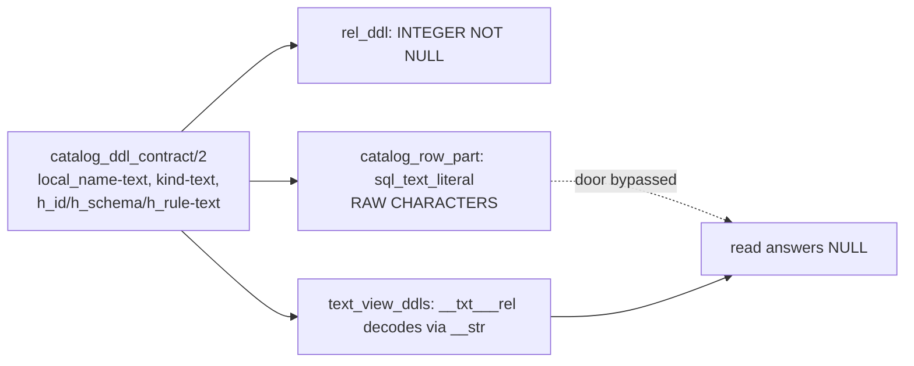

# The flip lands: `default_intern_mode(dict)`

Lane I-M, branch `arc/the-flip-lands`, base `867596d6`. The interning arc's
finish line: `v6/prolog/compile.pl:153` ships `dict`, and the emitted tree at
`v6/prolog/compile/out` is regenerated at dict as part of the commit.

## TOC

- [1. What shipped](#1-what-shipped)
- [2. The catalog seed defect](#2-the-catalog-seed-defect)
- [3. The generalized rail](#3-the-generalized-rail)
- [4. The 14 respells, plus 3 the fix exposed](#4-the-14-respells-plus-3-the-fix-exposed)
- [5. Unplanned scope: two flip blockers the brief did not name](#5-unplanned-scope-two-flip-blockers-the-brief-did-not-name)
- [6. Gate receipts](#6-gate-receipts)
- [7. Residual risks](#7-residual-risks)

---

## 1. What shipped

| file | change |
|---|---|
| `v6/prolog/compile.pl` | `default_intern_mode(direct)` -> `dict` (coordinator's edit, kept) |
| `v6/prolog/lower.pl` | `catalog_text_sql/3`; `catalog_row_ddl/4` -> `/5`; `catalog_row_part/3` -> `/4` |
| `v6/prolog/emit_ts.pl` | `tick_pipe_split_lines/3`: the tick pipe splits for the intern arm too |
| `v6/prolog/compile/test/plunit_tests.pl` | rail unit `interned_storage_rail`, 2 catalog dict twins, 17 mode pins, 2 helpers lifted to shared scope |
| `v6/tsv2/tests/*.test.ts` (5 files) | statement-count and plan rails re-pinned to the dict budget |
| `v6/tsv2/goldens/trace-line.jsonl` | re-pinned via `TRACE_GOLDEN_WRITE=1` |
| `v6/prolog/compile/out/*.ts` (211) | regenerated at dict |

---

## 2. The catalog seed defect

### 2.1 The shape

At dict the catalog table's five text columns are declared INTEGER and a
`__txt___rel` decode view is emitted, but the seed wrote raw characters that
never crossed `__str`. Every decode-view read of a catalog text column answered
NULL.



### 2.2 The seed SQL, before

```sql
INSERT OR IGNORE INTO "__rel" ("rel_id", "parent_id", "ordinal", "local_name",
  "kind", "type_id", "arity", "module_id", "h_id", "h_schema", "h_rule")
VALUES (1,0,0,'text','primitive',0,0,0,'','',''), ...
```

### 2.3 The seed SQL, after

```sql
INSERT OR IGNORE INTO "__str" ("content") VALUES (''), ('0967c02f99ba48cf'), ...,
  ('__rel'), ('arity'), ('bool'), ('catalog_reader'), ('col1'), ('column'), ...;

INSERT OR IGNORE INTO "__rel" ("rel_id", "parent_id", "ordinal", "local_name",
  "kind", "type_id", "arity", "module_id", "h_id", "h_schema", "h_rule")
VALUES (1,0,0,
        (SELECT s."__id" FROM "__str" s WHERE s."content" = 'text'),
        (SELECT s."__id" FROM "__str" s WHERE s."content" = 'primitive'),
        0,0,0,
        (SELECT s."__id" FROM "__str" s WHERE s."content" = ''),
        (SELECT s."__id" FROM "__str" s WHERE s."content" = ''),
        (SELECT s."__id" FROM "__str" s WHERE s."content" = '')), ...
```

### 2.4 Why it needed no new machinery

`catalog_text_sql/3` routes the five text values through `interned_literal_sql/2`
at dict, which is contract §5.3 rule two's one spelling. `literal_seed_ddl/3`
already reads that spelling back out of `BodyDdl` (which contains
`CatalogRowDdl`) and mints the `__str` seed, so the catalog's own strings enter
the dictionary through the same door every other constant uses. No new seed
predicate, no DML-in-CTE, no trigger.

`sql_literal/2` (refuses an embedded quote) rather than `sql_text_literal/2`
(doubles it): the seed reader's parse depends on content being quote-free. At
direct the path is unchanged, `sql_text_literal/2` verbatim.

### 2.5 Statement order, verified not assumed

`lower.pl:lower_program/2` ends `append([InternDdl, SeedDdl, BodyDdl], Ddl)` and
`BodyDdl` ends with `CatalogRowDdl`. Measured indices in the emitted Ddl list:

| index | statement |
|---|---|
| 0 | `CREATE TABLE "__str" (...)` |
| 1 | `INSERT OR IGNORE INTO "__str" ("content") VALUES ...` |
| 2 | `CREATE TABLE "__rel" (... all INTEGER ...)` |
| 24 | `INSERT OR IGNORE INTO "__rel" ... VALUES (1,0,0,(SELECT ...` |

Pinned by `catalog_seed_strings_are_interned_before_the_seed_reads_them`.

---

## 3. The generalized rail

`plunit_tests.pl`, unit `interned_storage_rail`, 2 tests.

| test | claim |
|---|---|
| `no_character_literal_lands_in_an_integer_column` | over every fixture in every `conformance/fixtures/*.pl` lowered at dict, plus the catalog program: no INSERT binds a character literal to a column whose `CREATE TABLE` declares it INTEGER |
| `the_rail_reads_the_corpus_it_scans` | non-vacuity: the scanner parses > 0 INSERT bindings and > 0 tables on a real fixture |

Scope is the statement lists the lowering returns (`Ddl`, arrival, edge, level,
delta), reached through `term_sql_atom/2`, never a regex over a file. The
scanner is quote-aware and paren-depth-aware in all three splitters, so an
interned literal's own parenthesised subquery does not read as a character
literal, and `__str`.content (TEXT) and every direct-mode column cannot fire.

### 3.1 Red receipt

With `catalog_text_sql/3` reverted to `sql_text_literal/2`:

```
% [13/14] interned_storage_..n_an_integer_column .. **FAILED (0.792 sec)
ERROR:     test interned_storage_rail:no_character_literal_lands_in_an_integer_column: failed

violations: 5
  catalog_reader-violation('__rel',h_id)
  catalog_reader-violation('__rel',h_rule)
  catalog_reader-violation('__rel',h_schema)
  catalog_reader-violation('__rel',kind)
  catalog_reader-violation('__rel',local_name)
```

The same run took the catalog dict twins red as well:

```
% [3/14] catalog_g1:catalog_table_shape_at_dict ... **FAILED (0.002 sec)
% [4/14] catalog_g1:catalo..the_seed_reads_them ... **FAILED (0.002 sec)
ERROR: [Thread main] 3 tests failed
```

Green after the fix, and 0 violations across the 211 lowering-clean fixtures
both before and after: the corpus never exercised the catalog seed, which is
why the executing sweep could not see this.

---

## 4. The 14 respells, plus 3 the fix exposed

Every snapshot string is byte-identical; only the mode the helper resolves
changed. `interning_lowered/3` and `interning_lowered_in/4` moved above the
first `begin_tests` (plunit unit modules do not see a sibling unit's clauses;
`lowered_for/2` already lived there, so this follows the file's own convention).
`catalog_program/1` and `catalog_lowered/3` moved with them: the rail needs the
catalog program and no conformance fixture mints a catalog seed.

| # | test | unit | respell |
|---|---|---|---|
| 1 | `switch_as_keyed_replace_edge_sql` | sql_text_snapshots | `lowered_for/2` -> `interning_lowered(direct, ...)` |
| 2 | `switch_as_keyed_replace_frontier_ddl` | sql_text_snapshots | same |
| 3 | `pre_edge_lowers_to_ordered_snapshot_read` | sql_text_snapshots | `lowered_for/3` -> `interning_lowered_in(_, direct, ...)` |
| 4 | `switch_as_keyed_replace_level_sql` | sql_text_snapshots | `lowered_for/2` -> `interning_lowered(direct, ...)` |
| 5 | `switch_as_keyed_replace_delta_sql_open_scope` | sql_text_snapshots | same |
| 6 | `switch_as_keyed_replace_delta_sql_route_change_log` | sql_text_snapshots | same |
| 7 | `departure_arm_reads_the_departure_frontier` | sql_text_snapshots | `lowered_for/3` -> `interning_lowered_in(_, direct, ...)` |
| 8 | `acyclic_ref_count_statements_are_emitted` | incremental_mode | `lowered_for/2` -> `interning_lowered(direct, ...)` |
| 9 | `fixpoint_ir_spells_the_reachability_walks_without_sql` | incremental_mode | `lowered_for/3` -> `interning_lowered_in(_, direct, ...)` |
| 10 | `bool_and_float_storage_constraints_are_exact` | phase5_value_plane | two `lowered_for/3` -> `interning_lowered_in(_, direct, ...)` |
| 11 | `fixpoint_ir_emits_beside_the_sql_fields` | incremental_mode | `program_plan/2` -> `program_plan(_, [intern(direct)], _)` |
| 12 | `delta_and_frontier_tables_repeat_column_affinity` | expression_miscompile_guards | same |
| 13 | `accepts_edge_head_column_typed_from_its_body` | supported_subset_gate | same |
| 14 | `now_bound_head_column_is_integer_storage` | supported_subset_gate | same |
| 15 | `catalog_table_shape` | catalog_g1 | `catalog_lowered/2` -> `catalog_lowered(direct, ...)` |

### 4.1 Three the seed fix exposed, absent from the brief's list

These passed at dict BEFORE the seed fix because the seed still carried raw
characters; they read the seed's characters positionally, so the fix took them
red. All three are pinned to direct, snapshot strings untouched.

| test | reads |
|---|---|
| `catalog_rows_are_one_statement` | `catalog_lowered/2` -> `catalog_lowered(direct, ...)` |
| `catalog_ids_are_positional` | same; its 20 pinned row strings are direct-shape |
| `hash_probe_rel_seed/2` (feeds `catalog_h_schema_tracks_shape_not_identity` + `catalog_h_rule_stable_and_distinguishes_derivation`) | `program_plan/2` -> `[intern(direct)]`; reads h_id/h_schema/h_rule at fixed character offsets |

### 4.2 The dict twins added

| test | pins |
|---|---|
| `catalog_table_shape_at_dict` | the all-INTEGER `CREATE TABLE "__rel"` plus the first seed row's exact interned text, read positionally after ` VALUES ` so a raw row cannot hide behind an interned one |
| `catalog_seed_strings_are_interned_before_the_seed_reads_them` | dictionary DDL < string seed < catalog seed, and 8 of the seed's own strings present in the `__str` seed |

---

## 5. Unplanned scope: two flip blockers the brief did not name

Both are the flip's cost, not the catalog fix's: neither moves a byte at direct.

### 5.1 rxjs's 9-operator pipe ceiling (emitter defect)

`pnpm typecheck` at dict: **20 errors**, all
`Type 'Observable<unknown>' is not assignable to type 'Observable<ITickDeltas>'`,
one per emitted module, all in `run_incremental_tick`. At direct: **0**.

Cause: rxjs types `pipe` through overloads that stop at nine operators; a tenth
degrades the chain to `Observable<unknown>`. The intern arm is a tenth operator
on an **edge-free** chain. `emit_ts.pl:pre_edge_level_reconcile_lines/3` already
knows this ceiling and splits the tick pipe at the edge boundary, but only fires
when there are edge rules.

Fix: `tick_pipe_split_lines/3` emits the same `).pipe(` at the same split point
when the edge split is absent and the module has a text-intern arm.

```prolog
tick_pipe_split_lines([], true, ['  ).pipe(']) :- !.
tick_pipe_split_lines(EdgeSplitLines, _, EdgeSplitLines).
```

Head at worst: advance_tick + intern + normalize + arrivals + levels_before +
reconcile + apply_edges + merge + post_edge_level = 9. Tail at worst: retention
+ recompute + read_boundary + departure + promote = 5. Both under the ceiling.
The operator sequence, and therefore the executed statement sequence, is
unchanged. `HasTextIntern` is false at direct, so direct output cannot move by
construction; measured clean in gate (c).

### 5.2 Eight tsv2 rails re-pinned to the dict budget

Contract §5.7.4 names this cost: "Their cost goes from one statement to two."
Every one of these is a constant offset with the **property the test exists to
protect intact** (flatness, slope, cone-independence). No test was loosened.

| test | before | after | shape |
|---|---|---|---|
| `coalesceCounts`: flat in source size | `[37,37,37]` | `[39,39,39]` | flat, +2 |
| `orderedPre`: ordered/pre curve | `13 + 2n` | `19 + 2n` | slope 2n unchanged |
| `orderedPre`: incremental family | `31` flat | `33` flat | flat, +2 |
| `orderedPre`: constant term, empty batch | `13` | `17` | +4 |
| `recursiveClosureCounts`: flat in depth | `STATEMENTS_FLAT 32` | `34` | per-round 4 unchanged |
| `recursiveClosureCounts`: delete cone | `[111,111,111]` | `[113,113,113]` | flat, +2 |
| `retentionCount`: keep(count) flat | `[12,12]` | `[14,14]` | flat, +2 |
| `traceGolden` | `36 / 30` on arrival ticks | `38 / 32` | ticks with no arrivals unchanged at 24 |

One is a plan assertion, not a count: `departureFrontier`, "the departure arm
reads only its own departure table". The arm's projection now probes `__str`:

```
SCAN d0 | CORRELATED SCALAR SUBQUERY 1 | SEARCH s USING COVERING INDEX
sqlite_autoindex___str_1 (content=?) | CORRELATED SCALAR SUBQUERY 2 | ...
```

The regex `!/\b(SCAN|SEARCH) (?!d0\b)/` now admits alias `s`. The claim that the
arm drives off `d0` and reads no other RELATION is unchanged; the dictionary is
not a relation.

---

## 6. Gate receipts

| gate | receipt |
|---|---|
| a. plunit | `474/474`, exit 0. Baseline 470 + 2 rail + 2 catalog dict twins. 31 "succeeded with choicepoint" warnings, identical to the pre-change baseline (diffed) |
| b. sweep at dict | `SWEEP total=308 compiled=211 unsupported=97 crash=0` / `RUN total=211 identical=210 wrong=0 emitted_crash=0 rejection=1 no_oracle_log=0` / `FINAL total=211 final_identical=210 final_wrong=0 no_oracle_final=1` / `MANIFEST_REASON_DIFF restated=0 args=0 bucket_moved=0 added=0 removed=0` |
| c. direct byte-parity | atom set to `direct`, `bash scripts/sweep.sh`, `git status --short v6/prolog/compile/out` -> **0 files**. Re-run after the `emit_ts.pl` change: still **0 files**. Direct output does not move |
| d. ARCH | `swipl -g go -t halt ARCH.pl` -> 7 PASS |
| e. tsv2 | `pnpm test` -> `tests 188 / pass 187 / fail 0 / skipped 1`; `pnpm typecheck` -> 0 errors |
| f1. rail red | 5 violations on the unfixed seed, quoted in §3.1 |
| f2. catalog twin red | both dict twins failed with the seed fix stashed, quoted in §3.1 |
| g. the commit ships dict | `v6/prolog/compile.pl:153` = `default_intern_mode(dict).`, `compile/out` committed as emitted at dict |

The `RUN identical=210` / `FINAL final_identical=210` shortfall is the standing
`log_retraction_rejected` rejection (the oracle throws on that schedule too), not
a regression: identical numbers at direct in the same session.

### 6.1 Timings, against the 10-second law

| step | wall |
|---|---|
| plunit (474) | 2.2 s |
| the rail alone | 0.81 s |
| sweep (the named exception) | 4.6 s |
| ARCH | 0.04 s |
| conformance | 0.28 s |
| tsv2 `pnpm test` | 7.9 s |
| tsv2 `pnpm typecheck` | 1.1 s |

### 6.2 One pre-existing red, not this lane's

`conformance/go.pl` reports `FAILURES 1`:

```
ERROR: Unknown message: log_on_level_headed_rel('__txt_reach'/2)
fail  reserved_namespace_declared_rel
```

Reproduced identically at base `867596d6` with every change stashed. Untouched
here.

---

## 7. Residual risks

| # | risk | who |
|---|---|---|
| 1 | The catalog seed's text now goes through `sql_literal/2`, which THROWS `quote_in_literal` on a rel, column or module name containing a single quote. No such name exists in the corpus and the surface grammar cannot spell one, but a future host-supplied module name could. `sql_text_literal/2` still guards the direct path | I-F, when it generalizes `catalog_ddl_contract/2` |
| 2 | The catalog seed's lookups are correlated scalar subqueries, one per text column per row. Contract §5.3 owed an `EXPLAIN QUERY PLAN` receipt that the planner hoists a constant lookup as `Once`; the departure-arm plan measured in §5.2 shows `CORRELATED SCALAR SUBQUERY`, which is the shape §5.3 named a fallback for. Not measured here | I-E / bench |
| 3 | `catalog_row_ddl/5` is one statement whose byte size now grows by ~60 bytes per text field per row. ARCH's `catalog_g1_producer` row measured the seed at 8.4%/14.6%/29.4% of a module's ddl array at direct; that share rises at dict and was not re-measured | bench |
| 4 | The `__rel` table keeps a composite PRIMARY KEY over all 11 columns (WITHOUT ROWID). At dict every one of those columns is now INTEGER, which is the surrogate-keys law's win, but an 11-column PK is still a wide key | I-F |
| 5 | The tick pipe now splits on two independent conditions. A future arm added to the head half pushes it past nine again, and the failure is a type error in 20 emitted modules rather than a named refusal. No rail counts tick-pipe operators | emitter owner |
| 6 | The tsv2 count rails were re-pinned by a constant, so the +2/tick ingest cost is now baked into the baseline. Contract §12.2 G1 (`intern share <= 4.5%`) has not been measured on the flagship at this commit | I-E / bench |
| 7 | No executing fixture reads a catalog text column, so the catalog decode path is pinned by plunit only, never by the oracle. `catalog_g2` (a fixture deriving from a catalog row) would close it | I-F |
