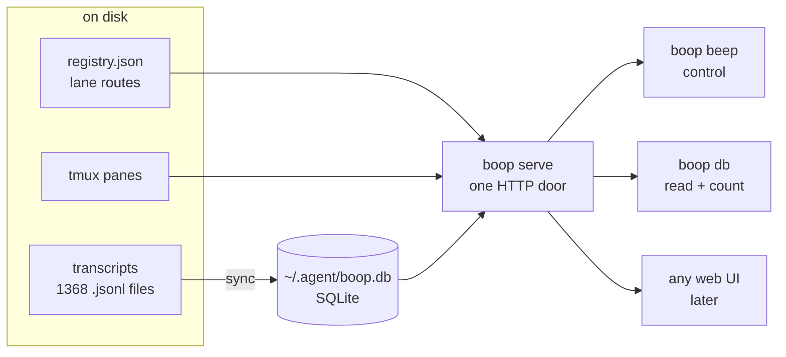
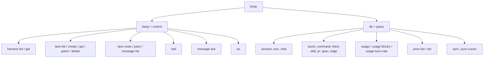
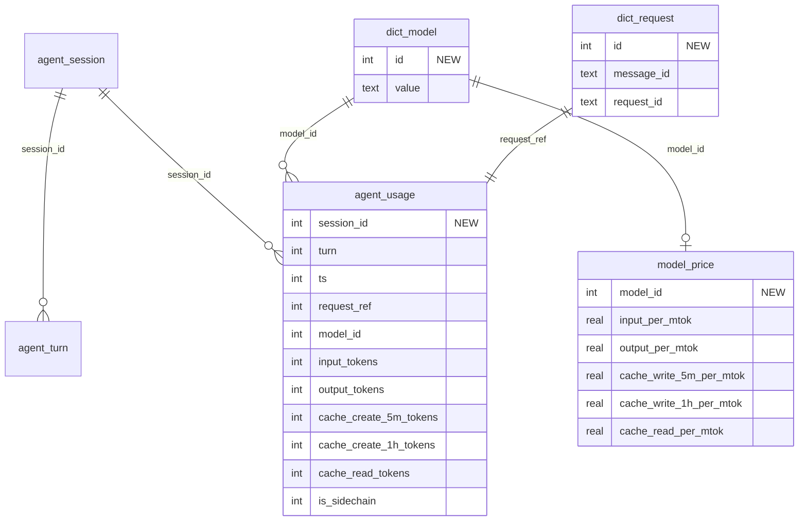
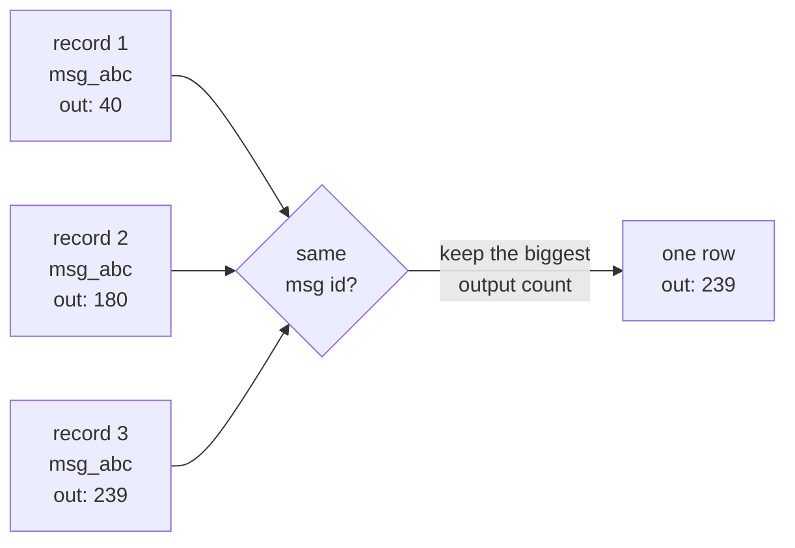
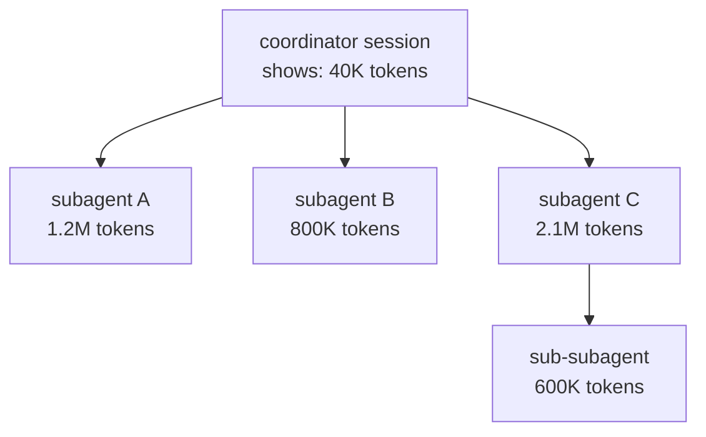

# boop: two trees, one db, and token counting that finally exists

Plain words version. No citations. Pictures first.

## What you get

1. [The one-sentence version](#the-one-sentence-version)
2. [The shape](#the-shape)
3. [What you would type](#what-you-would-type)
4. [What comes back](#what-comes-back)
5. [The new table](#the-new-table)
6. [The double-counting trap](#the-double-counting-trap)
7. [The subagent trap](#the-subagent-trap)
8. [Two things broken today](#two-things-broken-today)
9. [Full command list](#full-command-list)
10. [What is not built](#what-is-not-built)

---

## The one-sentence version

`boop beep` drives agents. `boop db` reads what they did and what it cost.
Every command is one HTTP call, so the CLI and a web UI are the same thing.

---

## The shape



Two trees, one door, one store.



---

## What you would type

Spawn a lane, talk to it, kill it.

```
boop beep lane create --lane catalog9 --cwd ~/projects/sprefa --model opus
boop beep hail catalog9 --body "run just green-all and report"
boop beep lane pane catalog9
boop beep ps
boop beep lane delete catalog9
```

Clean up everything dead.

```
boop beep lane delete --state dead
```

Ask what today cost.

```
boop db usage --group-by day --since 2026-08-01
boop db usage --group-by model
boop db usage --group-by session --since 2026-08-09
boop db usage blocks --active
boop db usage burn-rate
```

Watch it live.

```
boop db usage --follow
boop db turn list --follow
```

Read facts.

```
boop db command list --program git --since 2026-08-01
boop db touch list --path 'v6/prolog/**'
boop db session list --project ~/projects/sprefa
```

---

## What comes back

`boop db usage --group-by model`

```
model                    in       out    cache-w   cache-r      cost
claude-sonnet-5      1.2M      340K      880K      41.2M    $18.40
claude-opus-5        0.9M      210K      610K      28.7M    $52.10
claude-opus-4-8      0.8M      190K      540K      25.1M    $47.30
claude-fable-5       0.7M      160K      480K      22.4M    $ 9.80
glm-5.2              0.1M       30K       90K       4.1M         -
                                                            -------
                                                            $127.60
```

Numbers above are the shape, not a measurement. The `-` on glm is real: no rate
row exists for it, so cost is blank rather than a fake zero.

`boop db usage blocks`

```
window start        length   tokens    cost   state
2026-08-09 09:00     5h00m     412K   $8.10   closed
2026-08-09 14:00     5h00m     388K   $7.40   closed
                     2h11m        -       -   gap
2026-08-09 21:00     1h47m     140K   $2.90   ACTIVE
                                              projected 390K / $8.10
                                              3h13m left
```

A window opens on your first call and runs five hours. Go quiet for five hours
and you get a gap row instead of a pretend window.

`boop db usage burn-rate`

```
window        last 60 min
tokens/min          2,140
billable/min          310
cost/hour          $ 4.60
```

---

## The new table

Everything below `agent_usage` already exists. Only the shaded boxes are new.



Rules kept:

- Every key is an integer. No text primary keys anywhere.
- The one text pair that must be unique (message id + request id) lives in
  exactly one table, once, with a UNIQUE on it.
- Cost is never stored. It is tokens times the rate table, computed on read.
  Fix a rate, and every past number fixes itself.

---

## The double-counting trap

Claude writes the same assistant reply to the transcript more than once while it
streams. Measured on your machine right now:

```
raw usage records in transcripts    189,999
actually distinct API calls          94,943
                                    -------
inflation if you just add them up      2.00x
```

Count naively and every bill you print is exactly double.



Keeping the first one is wrong too. The first write is a partial snapshot; the
last one has the real output count. So: one row per API call, and the largest
output count wins. Re-run the sync as many times as you like, same answer.

---

## The subagent trap

Of 1368 transcript files on your disk, **1076 are subagent transcripts**. Every
tool out there counts a file against itself, so when you look at a coordinator
session you see almost none of what it actually spent.



boop already stores the parent-to-child links, so one flag folds the whole tree:

```
boop db usage --session catalog9 --rollup subtree
```

40K becomes 4.74M. That is the number you actually paid for.

---

## Two things broken today

Both need fixing before usage rows can be trusted, because usage rows use the
same key.

**1. Turn numbers restart on every sync.**

```
first sync   turns 1 2 3 4 5      written
file grows
second sync  turns 1 2 3          collide with 1 2 3, silently dropped
```

The counter is a local variable that starts at zero each pass. The insert is
"ignore on conflict", so new data quietly vanishes. Fix: remember the high-water
mark per session.

**2. Turn numbers skip.**

The counter ticks for every content block, but only text and tool blocks get a
row. Thinking blocks and tool results burn a number and write nothing.

```
1312 sessions checked
1293 have gaps
  14 are contiguous
```

Harmless as a key. Useless as a count. Pick one and write it down.

---

## Full command list

### `boop beep` (drive agents)

| type this | what it does |
|---|---|
| `beep harness list` | which adapters exist and what each can do |
| `beep harness get claude` | one adapter's capabilities |
| `beep lane list` | every lane, with live or dead |
| `beep lane create` | make a worktree, spawn the agent, register it |
| `beep lane get <lane>` | one lane's route and state |
| `beep lane patch <lane>` | point a lane at a pane you already have |
| `beep lane delete <lane>` | stop it and forget it |
| `beep lane delete --state dead` | clean up all the corpses |
| `beep lane route <lane>` | which tmux pane and session id |
| `beep lane pane <lane>` | show me the screen |
| `beep lane message list <lane>` | the mailbox |
| `beep hail <lane> --body ...` | type into a running agent |
| `beep message ack` | mark mail handled, in bulk |
| `beep ps` | pid, memory, cpu, uptime per lane |

### `boop db` (read and count)

| type this | what it does |
|---|---|
| `db session list` | every session ever seen |
| `db session get <id>` | one session |
| `db turn list` | raw turns, any filter, `--follow` to stream |
| `db turn get <session> <turn>` | one turn |
| `db chat list` | readable conversation form |
| `db touch list` | which files got read or written |
| `db command list` | every shell command run |
| `db fetch list` | every URL fetched |
| `db skill list` | every skill invoked |
| `db pr list` | every PR link |
| `db span list` | which line ranges were touched |
| `db edge list` | who spawned whom |
| `db usage` | tokens and cost, grouped however |
| `db usage blocks` | five-hour windows, gaps, projection |
| `db usage burn-rate` | tokens per minute, dollars per hour |
| `db price list` | the rate table |
| `db price set <model>` | fix a rate by hand |
| `db sync create` | ingest new transcript bytes now |
| `db sync-cursor list` | how far ingest has read |

34 commands. 34 HTTP calls. One to one, both ways, no leftovers.

### What went where

| old verb | new spelling |
|---|---|
| `harnesses` | `beep harness list` |
| `sessions` | `db session list` |
| `events` | `db turn list` |
| `chat` | `db chat list` |
| `tail` | `db turn list --session X --follow` |
| `list` | `beep lane list` and `beep lane message list` |
| `measure` | `beep ps` |
| `dispatch` and `lane` | `beep lane create` (they were the same thing) |
| `hail` | `beep hail` (name kept) |
| `resolve` | `beep lane route` |
| `adopt` | `beep lane patch` |
| `sweep` | `beep message ack` |
| `prune` | `beep lane delete --state dead` |
| `sync` | `db sync create` |
| `follow` | `boop serve`, probably (open question) |

`hail` keeps its odd name on purpose. Everything else is a row write. Hail
reaches into another process's terminal and types, and it tells you whether the
keystrokes landed, got queued, or were refused. That is not a create.

---

## What is not built

Things this plan does **not** answer, listed so nothing looks finished that is not:

- Where `boop serve` lives in the command tree.
- Whether `follow` still exists once `serve` runs the ingest tick.
- Whether the turn-number fix lands as its own PR first.
- Whether glm rates get filled in by hand or stay blank.
- That every dollar shown is an API rate-card reconstruction, not a Max plan bill.
- Error categories (what went wrong, how often) need tool-result records that
  ingest currently throws away. Separate job.
- Only Claude is wired up. Codex, opencode and kimi transcripts are unread, and
  codex counts tokens cumulatively, which is its own trap.
- Active time and lines-of-code, which Claude's own telemetry has and the
  transcript does not. Derivable later from turn gaps and span rows.
