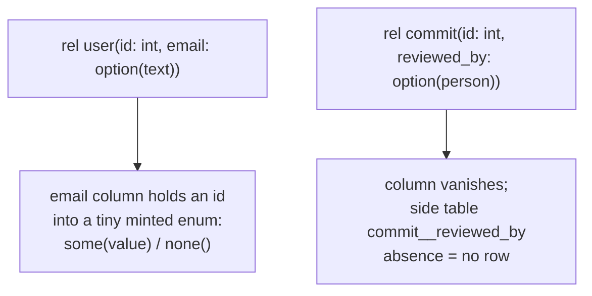

# option(T): where it plugs in, and the winner

## TOC
- the one-sentence answer
- the map
- what each path was
- what got built and proved
- what the next lane types

## the one-sentence answer

option(T) enters as a new desugar phase that runs before enum expansion, so
both doors (text files and term fixtures) get it from the same code; it is
built, tested, and green.

## the map

```mermaid
flowchart LR
    T[".dl6 text\n(option(text) or text?)"] --> P[parser\nkeeps option(T) as a term]
    F["term fixtures\n(oracle door)"] --> X
    P --> X["expansion fold"]
    X --> O["NEW phase 5: option desugar"]
    O --> E["phase 10: enum expansion\n(already existed)"]
    E --> R["everything downstream\nsees ordinary rels\nZERO new code"]
```

- path A wanted the desugar inside the parser. killed: the oracle door
  never touches the parser, so fixtures could never spell option at all.
- path B is the phase above. winner.
- path C wanted option(T) to stay a real type all the way down. killed:
  every probe fix opened a deeper wall (three deep in one sitting, the
  third one semantic), at least nine files would need to learn it, and at
  the end the storage would be the same int column B already emits.

## what each path is, one line each

| path | idea | fate |
|---|---|---|
| A | parser rewrites the decl before anyone sees it | dead: covers one door of two |
| B | one new expansion phase, both doors share it | WINNER, landed |
| C | teach the whole pipeline a new column type | dead: huge touch count, zero extra power |

## what got built and proved



- both spellings work: `option(text)` and `text?`
- one enum per element type (`__opt_text`, `__opt_int`), never per column
- option in a key column refuses with a named error
- NULL exists nowhere; absence is a tag row or a missing row

gates, all green, all fast:

| gate | result | time |
|---|---|---|
| oracle fixtures | 334 pass / 0 fail | 0.3s |
| plunit | 496 / 0 | 5.9s |
| full sweep (compile + replay) | 3 new fixtures compiled, replay identical | 5.0s |
| text door byte compare | 234 / 234 identical | 5.8s |
| ARCH | green | 0.03s |

sabotage check: flip one expected row in a new fixture and the suite goes
red with the exact mismatch, so the grading is real.

## what the next lane types

1. lift the lab commits (contract + path B + reports) into a PR
2. optional follow-ups, each small and named:
   - a `match` fixture over an option tag
   - option columns on host/bind decls (today: clean named refusal)
   - the boundary looks per target (ts `T | undefined`, jsonschema
     "absent from required") as their own arc on top of this storage
