# What is on your screen, as a table you can query

Plain version. No citations. Pictures.

## Contents

1. [The one-sentence version](#1-the-one-sentence-version)
2. [What happens today](#2-what-happens-today)
3. [What we want instead](#3-what-we-want-instead)
4. [The two tables](#4-the-two-tables)
5. [Why two tables and not one](#5-why-two-tables-and-not-one)
6. [The other way, and why we are not doing it](#6-the-other-way-and-why-we-are-not-doing-it)
7. [The one snag](#7-the-one-snag)
8. [Finding the diagrams](#8-finding-the-diagrams)
9. [What instant has to change](#9-what-instant-has-to-change)
10. [Numbers](#10-numbers)
11. [Things only you can decide](#11-things-only-you-can-decide)

---

## 1. The one-sentence version

instant already works out, sixty times a minute, exactly which messages are on
your screen and which of them contain a mermaid or d2 diagram, and then it
forgets. Give it a table to write that into and "is a diagram on screen right
now" becomes a one-line query.

---

## 2. What happens today

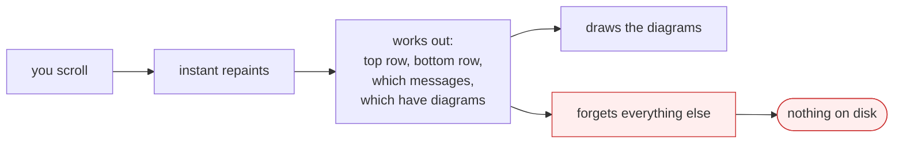

The answer is computed. It lives in a local variable for one frame. Nobody can
ask it a question.

---

## 3. What we want instead

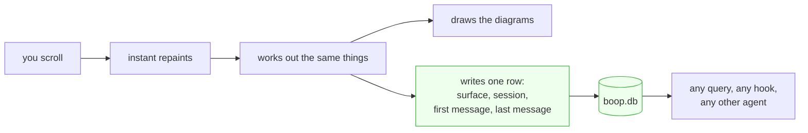

One extra row per scroll-stop. That is the whole change.

---

## 4. The two tables

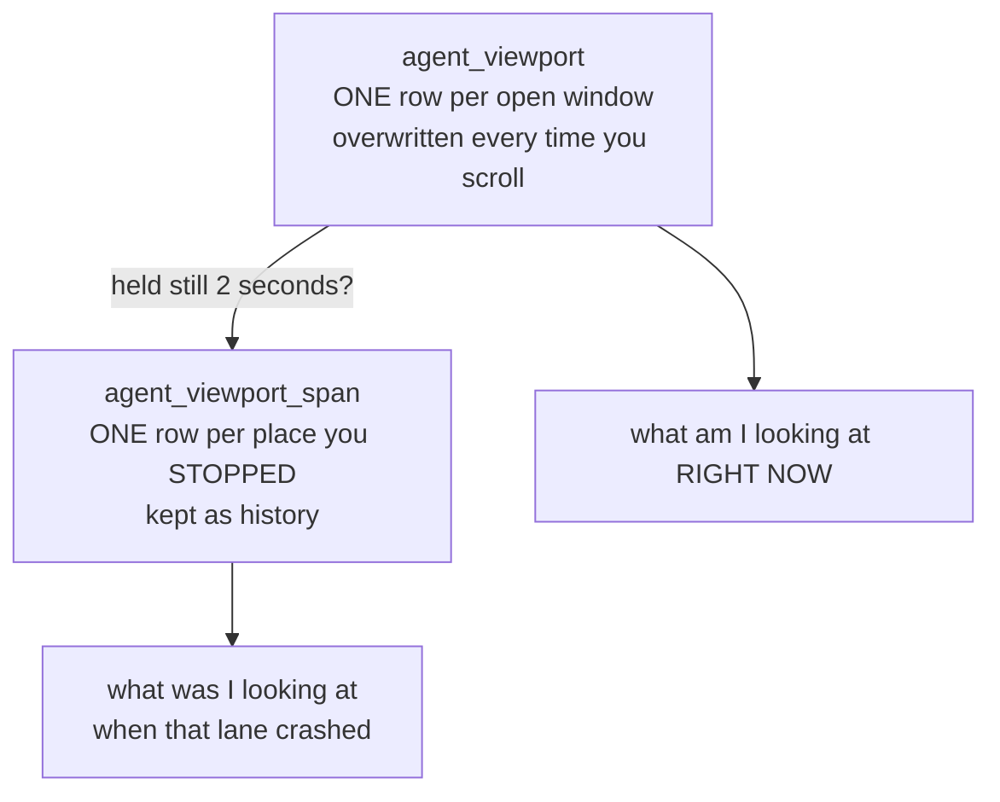

The first table is a sticky note. The second is a diary.

---

## 5. Why two tables and not one

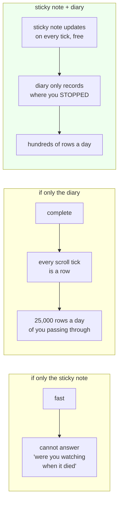

The rule that makes it work: a row reaches the diary only if the view held still
for two seconds. Scrolling past something is not looking at it.

boop already uses this exact sticky-note-plus-diary pair for "which agents are
alive". Same shape, same closing logic, one piece of code serves both.

---

## 6. The other way, and why we are not doing it

The other way is: read the text off a tmux pane and try to work out which
messages produced it. That does not work, and the reasons are measured, not
guessed.

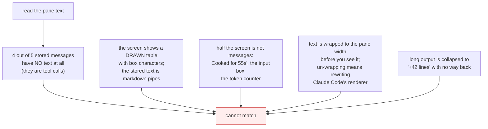

So: viewers that cooperate, yes. Guessing from pixels, no.

There is a middle rung worth knowing about. The harness itself could say "the
transcript is at message 340 and the user has not scrolled up". That is free and
exact for the common case of watching a lane run. It is a separate small job, not
part of this one.

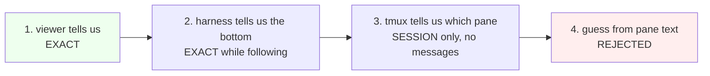

---

## 7. The one snag

boop and instant count messages differently, and neither is wrong.

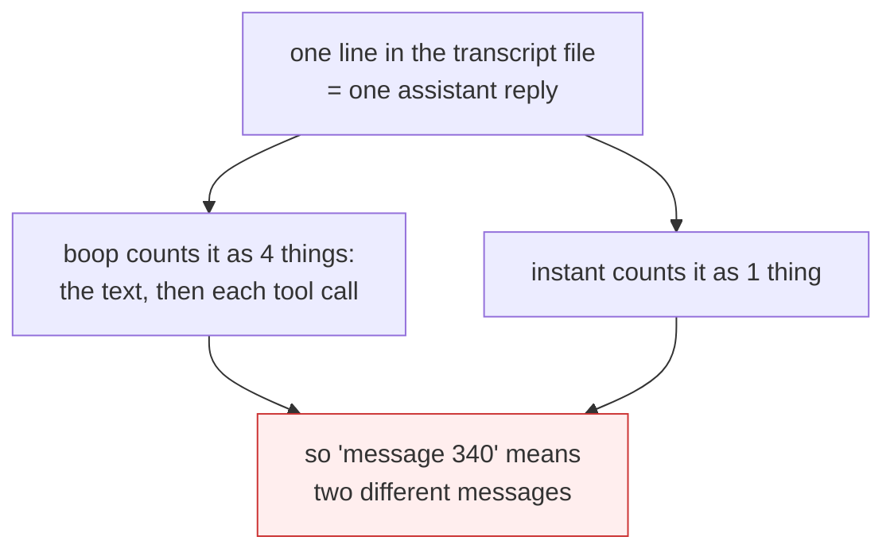

The fix: both sides already know the transcript's own record id. boop just does
not save it. Save it, and both sides have a name for the same thing.

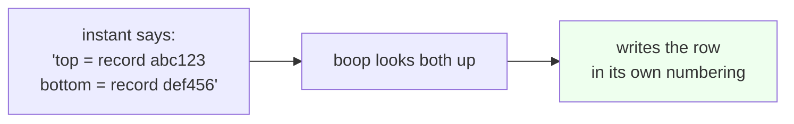

One extra column. Backfilling it means re-reading the transcripts once.

---

## 8. Finding the diagrams

Four ways to know a message contains a diagram. Three work, one is a trap.

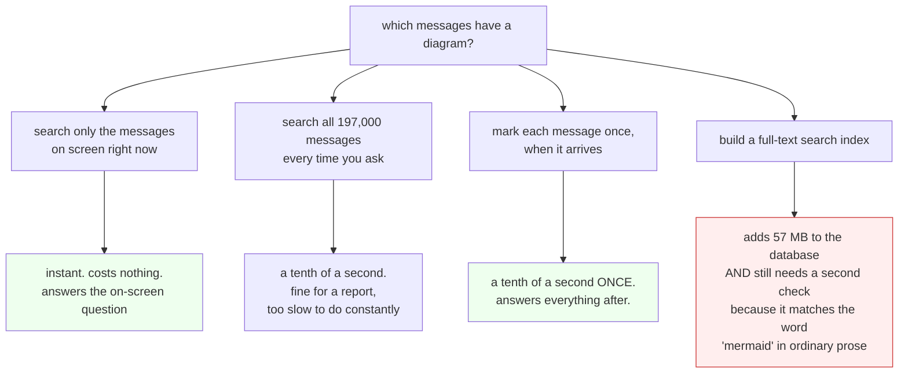

Ship the first and the third. The full-text index is a good idea for a different
feature and a bad trade for this one.

---

## 9. What instant has to change

One function. The one that draws the diagram overlays.

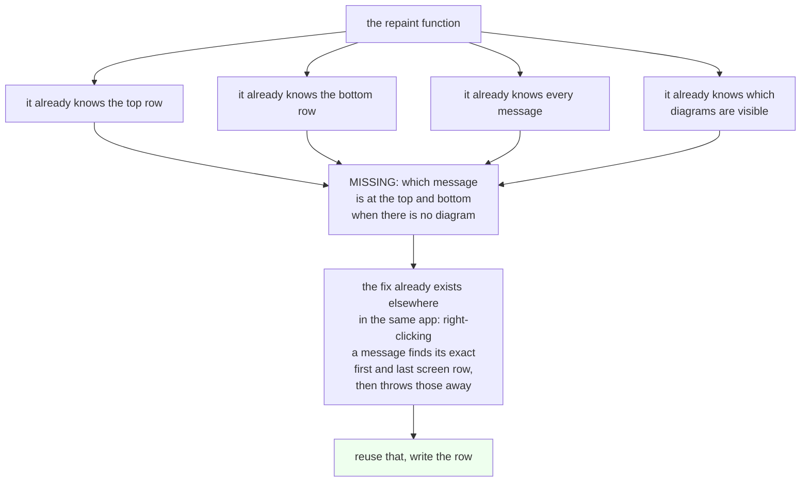

instant already opens SQLite databases for two other things, so writing the row
is one more small function. No new server, no new process.

There is a bonus second place: the session sidebar tree already knows its exact
visible range with no guessing at all, because it is a proper virtual list. That
becomes a second row in the same table, describing a second surface.

---

## 10. Numbers

| thing | measured today |
|---|---|
| messages stored | 197,662 |
| of those, with any text at all | 38,857 (one in five) |
| messages containing a mermaid diagram | 169, across 56 sessions |
| messages containing a d2 diagram | 42, across 31 sessions |
| checking the whole history for diagrams | about a tenth of a second |
| checking only what is on screen | too fast to measure |
| marking every message once, up front | about a tenth of a second |
| full-text index instead | 57 MB of extra disk, still not exact |
| writing one viewport row | half of one thousandth of a second |
| rows the diary would collect per day | hundreds, once the two-second rule is on |

---

## 11. Things only you can decide

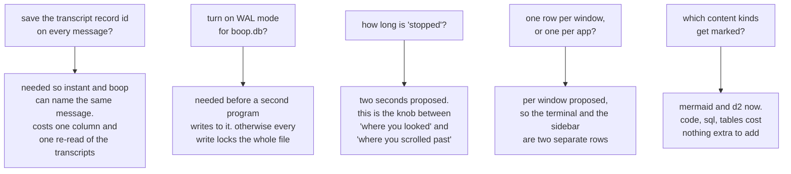
</content>
</invoke>
