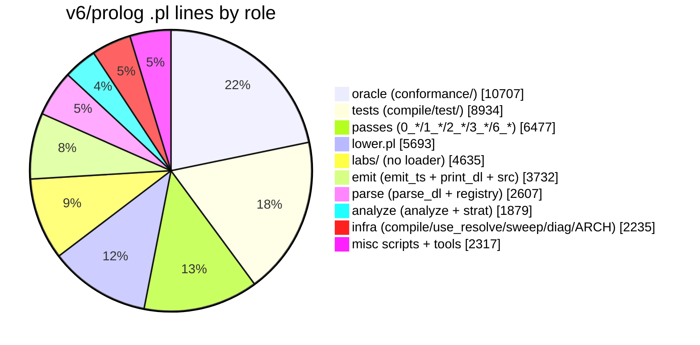

# prolog-recon — opus5 lane — stage 1 recon

Base: `git -C /Users/chrishafley/projects/sprefa rev-parse --short=8 HEAD` = **3b9e9cfd** (matches brief).
Read-only. No repo file changed; `git status v6/prolog` shows only `conformance/rulings.pl`, already dirty before this lane started.

## TOC

| § | Section |
|---|---|
| 0 | [Brief deviations](#0-brief-deviations) |
| 1 | [Mass map](#1-mass-map) |
| 2 | [Duplication inventory](#2-duplication-inventory) |
| 3 | [lower.pl structural map](#3-lowerpl-structural-map) |
| 4 | [emit_ts.pl template-shaped code](#4-emit_tspl-template-shaped-code) |
| 5 | [parse_dl.pl grammar-as-data feasibility](#5-parse_dlpl-grammar-as-data-feasibility) |
| 6 | [Dead weight](#6-dead-weight) |
| 7 | [Ranked shrink plan](#7-ranked-shrink-plan) |
| 8 | [Defect found during recon](#8-defect-found-during-recon-not-a-shrink-move) |

---

## 0. Brief deviations

Four numbers in the brief no longer match the tree. Recording rather than improvising.

| Brief says | Measured at 3b9e9cfd | Command |
|---|---|---|
| lower.pl 5652 | **5693** | `wc -l v6/prolog/lower.pl` |
| parse_dl.pl 1970 | **1983** | `wc -l v6/prolog/compile/parse_dl.pl` |
| conformance 281 fixtures | **346 PASS / 0 FAIL** | `swipl -q -l go.pl -g go -g halt \| grep -c '^PASS'` |
| catalog stride at lower.pl ~1376/1388 | **1373-1377 / 1385-1390** | `sed -n '1373,1390p' lower.pl` |
| "246 goldens" | 246 = `bucket:compiled` rows in `compile/out/manifest.json` (346 total, 100 `unsupported`). `v6/tsv2/goldens/` holds **11** directories. | `python3 -c "import json,collections;print(collections.Counter(e['bucket'] for e in json.load(open('compile/out/manifest.json'))))"` |

Conformance gate wall time: **0.328s** — well inside the 10-second law.

---

## 1. Mass map

All figures from `wc -l`, `compile/out/**` excluded. Tree total: **49,216** lines of `.pl`.



### Compiler proper (the shrink target)

| Role | Files | Lines | Code | Comment | Blank |
|---|---|---:|---:|---:|---:|
| lower | `lower.pl` | 5693 | 3909 | 1346 | 438 |
| emit | `emit_ts.pl` | 2809 | 2168 | 433 | 208 |
| parse | `compile/parse_dl.pl` | 1983 | 1365 | 402 | 216 |
| analyze | `analyze.pl` | 1765 | 977 | 656 | 132 |
| checks | `0_program_check.pl` | 940 | 501 | 346 | 93 |
| types | `0_type_plane.pl` | 891 | 536 | 281 | 74 |
| printer | `print_dl.pl` | 684 | 439 | 181 | 64 |
| driver | `compile.pl` | 571 | 414 | 107 | 50 |

`grep -cE '^\s*%'` / `'^\s*$'` per file; code = total − comment − blank.

### Passes (6,477 lines, 22 files)

`0_program_check.pl` 940 · `0_type_plane.pl` 891 · `0_dot_expand.pl` 648 · `1_host_expand.pl` 611 · `3_clock_check.pl` 563 · `0_cst_query.pl` 299 · `0_coalesce_expand.pl` 274 · `0_ast_expand.pl` 259 · `0_unsupported_messages.pl` 237 · `0_body_walk.pl` 212 · `0_enum_expand.pl` 199 · `0_graph.pl` 196 · `0_seq_expand.pl` 194 · `6_profile.pl` 139 · `0_match_expand.pl` 137 · `0_option_expand.pl` 122 · `0_rel_record.pl` 104 · `0_relation_pattern.pl` 102 · `1_expansion.pl` 98 · `2_subscribe.pl` 92 · `0_relation_edge_expand.pl` 92 · `0_negated_guard_expand.pl` 68.

### Oracle (10,707) and tests (8,934)

`conformance/fixtures/*.pl` = 8,447 across **39** files; `conformance/` top level = 2,260 (`rulings.pl` 668, `engine.pl` 668, `body.pl` 362, `level_eval.pl` 332, `ticklog.pl` 203, `go.pl` 27).
`compile/test/plunit_tests.pl` alone is **7,283** — 15% of the whole tree in one file.

### Headline

Only **~19.4k** lines are the compiler (parse + passes + analyze + lower + emit + infra). The other ~30k is oracle, tests, labs, and ARCH. Of the compiler's mass, comments are 23-27% in the big files and are the standing law's own record — not shrink material.

---

## 2. Duplication inventory

Method: 5- and 6-line sliding windows over every `.pl` (comments and blanks excluded from window eligibility), whitespace-normalized, MD5-hashed, grouped by file set. Every row below was then read at both sites.

### Cross-file

| # | What | Site A | Site B (+) | Lines | Verdict |
|---|---|---|---|---:|---|
| D1 | `classify_head_arg/2` — aggregate head classifier | `analyze.pl:1673-1699` | `conformance/level_eval.pl:36-62` | 27 | **Copy with a live divergence**: `analyze.pl:1697` requires `no_refs`, `level_eval.pl:60` accepts `_`. The oracle is looser than the compiler on the fallthrough `agg(Kind, Expr)` clause. |
| D2 | `relax_strata/4` — stratification fixpoint | `strat.pl:56-79` | `conformance/level_eval.pl:159-181` | 24 | Byte-identical. |
| D3 | `finite_float_json/2` + `normalize_float_json_atom/2` | `0_type_plane.pl:699-705`, `:825-842` | `conformance/ticklog.pl:110-116`, `:118-135` | 26 | Byte-identical modulo the output var name. `ticklog.pl:29` **already imports** `js_float_text/2` from `0_type_plane` — so the import path exists and these two were copied past it. |
| D4 | conjunction spine `conjunction_goals/2` | `0_seq_expand.pl:108`, `0_coalesce_expand.pl:117`, `0_dot_expand.pl:622`, `0_negated_guard_expand.pl:55`, `analyze.pl:1028` | — (5 copies) | 5 × 9 | The comments admit it: `0_dot_expand.pl:620` "same shape as 0_coalesce_expand.pl", `0_negated_guard_expand.pl:53` "same shape as 0_dot_expand / 0_coalesce_expand". |
| D5 | rebuild spine `goals_conjunction/2` | `0_dot_expand.pl:632`, `0_coalesce_expand.pl:127`, `0_seq_expand.pl:118`, `0_negated_guard_expand.pl:65`, `lower.pl:2546` | — (5 copies) | 5 × 4 | Same shape, and `0_ast_expand.pl:253` spells it `goals_body/2`. |
| D6 | flatten spine under a second name `body_goals/2` | `0_ast_expand.pl:243-251` | `1_host_expand.pl:461-465` | 9 + 5 | **`1_host_expand.pl:461` is already correct** — it delegates to `body_walk:body_conjunction_goals/3`. `0_ast_expand.pl:243` hand-rolls it. |
| D7 | `module_hash/2` (SHA-256 name → 16 hex) | `use_resolve.pl:244-247` | `lower.pl:753-756` | 4 | Confirmed brief seed. Bodies identical; `use_resolve`'s carries a trailing `!`, `lower`'s does not. |
| D8 | sweep driver prelude | `sweep.pl:40-66` | `compile/scripts/text_door_receipt.pl:123-143` | ~21 | Two scripts walking the fixture corpus the same way. |
| D9 | fixture-path resolution | `use_resolve.pl:128-133` | `compile/parse_dl.pl:142-147` | 6 | |
| D10 | oracle-run prelude | `compile/scripts/golden_oracle.pl:46-51` | `compile/scripts/dl6_oracle.pl:71-76` | 6 | |
| D11 | registry-doc row rendering | `tools/self_map_facts.pl:298-304` | `compile/1_emit_registry_docs.pl:195-201` | 7 | |

The shared home for D4/D5/D6 **already exists**: `0_body_walk.pl:46` exports `body_conjunction_goals/3` (defined `:114`), and exactly one of the seven call sites uses it.

**Caution on D1/D2/D3**: `conformance/` is a differential oracle. Copy-paste is not independence, and D1 proves the copies already drifted, but merging the compiler and the oracle onto one predicate destroys the differential property. Stage 2 should treat these as *alignment* work (decide which side is right, record a decision), not as line-count deletion.

### Within-file

| # | What | Sites | Verdict |
|---|---|---|---|
| D12 | catalog id stride `Id + 1 + RelArity` walked twice | `lower.pl:1373-1377` (`catalog_rel_id_map/4`) and `lower.pl:1385-1390` (`catalog_rel_block_end/3`) | Confirmed brief seed. Two independent walks over the same list computing the same running offset. |
| D13 | DDL columns/PK prelude, 6 lines verbatim ×3 | `lower.pl:5309-5314`, `5329-5334`, `5350-5355` | `relplan_columns` → `relplan_column_types` → `maplist(quote_ident)` → `maplist(column_def(Mode))` → two `atomic_list_concat`. |
| D14 | `'CREATE TEMP TABLE ~w (~w, PRIMARY KEY (~w)) WITHOUT ROWID'` literal | 6 occurrences in `lower.pl` | `grep -oE "'(CREATE\|INSERT\|SELECT\|DELETE\|UPDATE)[^']*'" lower.pl \| sort \| uniq -c \| sort -rn` |
| D15 | `'DELETE FROM ~w'` literal | 12 occurrences in `lower.pl` | same command |
| D16 | tick-pipeline builders, 3-way | `emit_ts.pl:2233 / 2274 / 2323` and `emit_ts.pl:2244 / 2296 / 2341` | `run_naive_tick_fn_lines` (2222), `run_ordered_tick_fn_lines` (2302), `run_incremental_tick_fn_lines` (2513) each hand-assemble the same rxjs stage list. |
| D17 | avg/aggregate scope family runs parallel | `avg_*` `lower.pl:3193-3435` vs `aggregate_*` `lower.pl:3437-3607` | Partly genuine (avg is a delta-maintained sum+count accumulator per `ARCH.pl:868`), partly not: `avg_delete_scoped_sql/5` at `lower.pl:3373-3376` is a **pure passthrough** to `aggregate_delete_scoped_sql/5`. |
| D18 | resolver-block emitters | `emit_ts.pl:1440/1453`, `1630/1645`, `1802/1816` | Three pairs of near-identical const-block writers. |
| D19 | `expr` walk | `analyze.pl:1390 / 1399 / 1407` | 3-way 5-line repeat. |
| D20 | decl-shape parse | `compile/parse_dl.pl:1028/1072`, `1039/1068` | Dialect-A vs dialect-B decl paths repeating the same column-list scan. |

Full within-file counts: lower.pl **14** duplicated 5-line blocks, emit_ts.pl **6**, analyze.pl **1**, parse_dl.pl **2**, 0_program_check.pl **1**.

---

## 3. lower.pl structural map

5,693 lines · 3,909 code · **402 unique predicates across 611 clause heads** (`grep -oE '^[a-z_][a-zA-Z0-9_]*' lower.pl | sort -u | wc -l`). Mean 9.7 code lines per predicate — the file is not long procedures, it is a very wide flat namespace.

### Sections (spans read off `% ──` banners + predicate first-line clustering)

| Lines | Span | Code | Section | Mechanical? |
|---|---:|---:|---|---|
| 1-175 | 175 | 35 | header + directives | — |
| 176-250 | 75 | 35 | table names + rule identity | **YES — data table** |
| 251-670 | 420 | 251 | expression / SQL compile | partly (`arithmetic_rendering` already reads `expression/5`) |
| 671-822 | 152 | 87 | DDL contract + hashing | no |
| 823-1550 | **728** | **585** | catalog rows | partly (row-shape stride, D12) |
| 1551-1921 | 371 | 258 | intern / dictionary / text view | no |
| 1922-2292 | 371 | 185 | rel_ddl + struct + dict relplans | partly |
| 2293-2638 | 346 | 208 | relation-pattern + decode expansion | no |
| 2639-3042 | 404 | 260 | arrival + edge statements | no |
| 3043-3607 | **565** | **454** | level statements + avg aggregate | partly (D17) |
| 3608-3792 | 185 | 164 | refCount + expand waves | no |
| 3793-4055 | 263 | 224 | DRed | no |
| 4056-4361 | 306 | 245 | fixpoint IR | no (it *is* the data model) |
| 4362-4549 | 188 | 140 | recursive arm + insert | no |
| 4550-4864 | 315 | 162 | body guards + json | no |
| 4865-5032 | 168 | 144 | aggregate select | no |
| 5033-5209 | 177 | 132 | delta + retention | no |
| 5210-5452 | 243 | 170 | **DDL emitters** | **YES — template table** (D13/D14) |
| 5453-5562 | 110 | 84 | boot | no |
| 5563-5693 | 131 | 86 | `lower_program` top | no |

Clause-head counts by name prefix: `catalog_` 60 · `avg_` 48 · `ir_` 46 · `aggregate_` 36 · `compile_` 37 · `json_` 31 · `dred_` 25 · `level_` 20 · `text_` 14 · `expand_` 12 · `boot_` 12 · `intern_` 11.

### The two parts that should be data, not code

**(a) The table-name family — `lower.pl:176-250`, plus 10 scattered later.**
16 predicates match `^[a-z_]*table_name(`; **13** of them are one `format/3` call over the pattern `'__<prefix>_~w'`:

| Predicate | Line | Prefix |
|---|---:|---|
| `table_name/2` | 176 | (identity) |
| `delta_table_name/2` | 178 | `__delta_` |
| `frontier_table_name/2` | 181 | `__frontier_` |
| `next_frontier_table_name/2` | 184 | `__next_frontier_` |
| `pre_table_name/2` | 187 | `__pre_` |
| `departure_frontier_table_name/2` | 197 | `__departure_frontier_` |
| `ref_count_table_name/2` | 248 | `__support_next_` |
| `avg_accumulator_table_name/2` | 3193 | (avg acc) |
| `aggregate_scope_table_name/2` | 3437 | (scope) |
| `arrival_scratch_table_name/2` | 3687 | (scratch) |
| `expand_table_name/3` | 3757-3759 | wave a / wave b |
| `dred_ping/pong/cone_table_name/2` | 3793/3796/3799 | DRed waves |

One fact table `plane_table_prefix(Kind, Prefix)` + one `plane_table_name(Kind, Ref, Table)` driver replaces the lot.
**Side finding**: `ref_count_table_name/2` still emits `__support_next_~w` (`lower.pl:249`) even though CLAUDE.md records the `support` → `refCount` rename as executed 2026-08-02. The word survives in the emitted SQL and therefore in every one of the 246 compiled goldens and in `compile/test/plunit_tests.pl:641,648,678,1048,1252,6219` and `v6/tsv2/runtime/1_incremental.ts`. Renaming it is a golden-churn arc of its own, not a free cleanup.

**(b) The DDL emitters — `lower.pl:5210-5452`.**
`delta_ddl` (5210), `departure_frontier_ddl` (5221), `pre_ddl` (5232), `ref_count_ddl` (5296), `dred_wave_ddl` (5307), `dred_wave_table_ddl` (5321), `expand_wave_ddl` (5327), `ref_count_head_ddl` (5345). Three of them repeat the same 6-line prelude verbatim (D13) and six sites emit the same `CREATE TEMP TABLE … WITHOUT ROWID` template (D14). A `temp_table_spec(Kind, ExtraColumns, KeyShape)` table + one `render_temp_table/4` collapses the family.

### What is *not* mechanical

`catalog rows` (728 lines) looks repetitive but is not: each `catalog_*_rows` predicate emits a differently-shaped `row/11` with a different id-stride contract, and the id assignment is positional and must stay byte-stable (`lower.pl:1387` comment: "so the room rows the nesting needs can take ids past it without moving a single existing rel or column row"). Only the stride walk itself (D12) is safely shareable.

The `fixpoint IR` block (4056-4361) is the compiler's data model. It is already the "data" that a driver interprets — on the emit side (§4).

---

## 4. emit_ts.pl template-shaped code

2,809 lines · 2,168 code · **186 unique predicates / 296 clause heads** · 149 `format(` calls · 42 `atomic_list_concat`.

Naming families (`grep -cE '^<pat>' emit_ts.pl`): `*_lines` **89** · `*_line` **45** · `*_text` **49** · `fixpoint_*` **35** · `*_entry_line` **17** · `*_json` **7**.

### T1 — the const-block writer (small win, ~25 lines)

Eight predicates share an exact shape:

```prolog
X_lines(Items, Lines) :-
    maplist(X_entry_line, Items, EntryLines),
    append([ [Open], EntryLines, [Close] ], Lines).
```

Sites: `emit_ts.pl:734, 742, 753, 776, 806, 857, 975` (`grep -nE "\['const [a-z_]+:" emit_ts.pl`). A `const_block(Kind, OpenText, CloseText)` fact table + one driver removes ~3 lines each. Honest ceiling: ~25 lines. Value is uniformity, not mass.

### T2 — `fixpoint_*_text` is a hand-written term→JSON serializer (the real win, ~95 lines)

`emit_ts.pl:1285-1435` = **151 lines / 35 predicates**, and every single clause has the same body shape: destructure a Prolog term, render each argument, `format/3` a JS object literal with hardcoded key names.

| Predicate | Line | Emits |
|---|---:|---|
| `fixpoint_ir_text/2` | 1285 | `{ head: {...}, storage, assert, dred, revive, expand }` |
| `fixpoint_storage_text/2` | 1300 | `{ rel, arity, columns }` |
| `fixpoint_column_class_text/2` | 1306 | `{ name, type, storage, collation, encoding }` |
| `fixpoint_collation_text/2` | 1315 | scalar / `null` |
| `fixpoint_encoding_text/2` | 1318 | `{ kind: "direct" }` / `{ kind: "dict", rel }` |
| `fixpoint_walk_text/2` | 1324 | `{ seeds, hop, stop: {...}, emit }` |
| `fixpoint_arm_array_text/2` | 1335 | `[…]` |
| `fixpoint_emit_text/2` | 1340 | scalar / `null` |
| `fixpoint_probe_text/2` | 1343 | `{ kind, target }` |
| `fixpoint_probe_target/2` | 1348 | rename map (`ref_count` → `refCount`) |
| `fixpoint_arm_text/2` | 1351 | `{ sources, equalities, filters, project, selfIndex }` |
| `fixpoint_term_array_text/3` | 1364 | **generic list renderer — already exists** |
| `fixpoint_self_index_text/2` | 1369 | scalar / `null` |
| `fixpoint_source_text/2` | 1372 | `{ index, source }` |
| `fixpoint_source_kind_text/2` | 1376 | 5-way tagged union |
| `fixpoint_equality_text/2` | 1390 | `{ left, right }` |
| `fixpoint_filter_text/2` | 1395 | 2-way tagged union |
| `fixpoint_expr_text/2` | 1407 | 4-way tagged union |
| `fixpoint_literal_text/2` | 1425 | `{ kind, type, value }` |

`fixpoint_term_array_text/3` at `:1364` proves the higher-order idiom is already acceptable in this file. A `js_shape(Functor/Arity, [Key-Renderer, …])` fact table (~25 fact lines) plus one `render_shape/3` and one `render_union/3` (~30 lines) replaces the other ~130.

Hard constraint: **key ORDER inside each emitted object literal must be preserved byte-for-byte** or all 246 compiled goldens churn. The fact table's list order carries it, so the constraint is expressible — but it is what makes this a byte-identity-gated move, not a free one.

### T3 — the tick-pipeline trio (~65 lines, higher risk)

Three predicates each hand-assemble the same rxjs `.pipe()` stage list from the same helper set:

| Predicate | Line | Span |
|---|---:|---|
| `run_naive_tick_fn_lines/8` | 2222 | 2222-2301 |
| `run_ordered_tick_fn_lines/8` | 2302 | 2302-2346 |
| `run_incremental_tick_fn_lines/?` | 2513 | 2513-2569 |

Detector found 3-way exact repeats at `2233/2274/2323` and `2244/2296/2341`. All three call the same five stage builders (`departure_stage_naive_lines`, `advance_tick_naive_line`, `naive_text_intern_lines`, `naive_reference_normalize_lines`, `retention_tick_lines*`).

The blocker is real and documented in place: `emit_ts.pl:2334-2336` records that rxjs `pipe()` typed overloads stop at 9 operators, so the ordered path splits into a second `.pipe(` mid-list. A stage table would need to model that split. Feasible (`tick_stage(Mode, Ordinal, StageKind)` + a chunking renderer), but this is the move most likely to churn goldens.

---

## 5. parse_dl.pl grammar-as-data feasibility

1,983 lines · **1,365 code** · 402 comment · 216 blank. **180 unique predicates / 322 clause heads.**

### The shape it actually has

It is **not** a DCG. `grep -c -- '-->' parse_dl.pl` = **15** (only the number lexer at 455-480). The rest is hand-threaded recursive descent: **114** predicates carry an explicit `S0, S` difference-list pair, with `ws0(` called **153** times and `lit_dcg(` **119** times. That 272-call whitespace/punctuation tax is the single largest line source in the file.

### Already table-driven

| Mechanism | Site | Table | Rows |
|---|---|---|---:|
| keyword-call body items | `parse_dl.pl:1366-1372` (`body_item/5` clause 2) reads `surface/5` and `wrapper_lower_role/3` | `compile/registry.pl` `surface/5` | **59** |
| infix guard/bind operators | `parse_dl.pl:1636-1654` `registered_infix_op/4` — longest-match by `keysort` over negated length | `compile/registry.pl` `surface/5` where `LowerRole = infix(_)` | (subset of 59) |

So the *dispatch* half of grammar-as-data is done and works.

### The gap the recon found

`compile/registry.pl:236-240` **already declares operator precedence as data**:

```prolog
expression('+'/2,    arithmetic,  1, infix('+'),            both_number).
expression('-'/2,    arithmetic,  1, infix('-'),            both_number).
expression('*'/2,    arithmetic,  2, infix('*'),            both_number).
expression('/'/2,    arithmetic,  2, numeric_division,      both_number).
expression(mod/2,    arithmetic,  2, sign_corrected_modulo, both_int).
```

The header at `registry.pl:222` calls field 3 `PrintPrecedence`. `print_dl.pl:606` reads it. **`parse_dl.pl` does not** — it hardcodes the identical two tiers at `parse_dl.pl:1727-1758` as `add_expr`/`add_expr_rest` (tier 1: `+ -`) and `mul_expr`/`mul_expr_rest` (tier 2: `* / mod`). The printer is table-driven; the parser is not. Adding an operator today means editing both.

One precedence-climbing loop over `expression(Op/2, arithmetic, Prec, _, _)` replaces 32 lines with ~14 and makes the registry the single door.

### What resists a declarative grammar

| Blocker | Site | Why |
|---|---|---|
| **Dual state threading** | every production | Each predicate threads `Vars0, Vars` (the whole-file `Name-Var` accumulator) *alongside* `S0, S`. `parse_dl.pl:57-65` explains why: variable identity must survive parsing so `analyze.pl:rel_columns/4`'s `Arg == BoundVar` check works. A stock SWI DCG gives one threaded state, not two. EDCG or an explicit state term is required — which is roughly what the file already is. **This is the reason a plain DCG rewrite does not shrink the file.** |
| Balanced-paren raw scan | `parse_dl.pl:1500-1510` | `keyword_call/4` consumes the wrapper's inner text unparsed because `only`'s inner shape differs from `decode`'s (`:1490-1492`). Not expressible as a production. (Also defective — see §8.) |
| CST block scan | `parse_dl.pl:1397-1405` | `cst_block_codes/3` scans to a matching `}` with string awareness, then hands the codes to `0_cst_query.pl`. |
| Template literal scan | `parse_dl.pl:1119-1126` | backtick body with escape handling. |
| JS-exact number lexing | `parse_dl.pl:432-490` (59 lines) | float syntax must round-trip with `0_type_plane.pl:js_float_text/2`. |
| String/atom literals | `parse_dl.pl:491-538` (48 lines) | escape table `escape_codes/4` at `:532-537`. |
| Error positioning | `build_line_starts/1`, `mark_furthest/1`, `remaining_line_column/3` | The furthest-failure tracking is cross-cutting; a generated parser would need to re-provide it, and `compile/test/plunit_tests.pl:parse_error_positions` pins it. |

### Fraction estimate

| Bucket | Lines (of 1,983) | Basis |
|---|---:|---|
| Comment + blank | 618 | measured |
| Resistant (lexer 432-538, raw scans, error positioning, Vars threading spine) | ~420 | section spans + blocker table |
| Already table-driven dispatch | ~30 | `:1366-1372` + `:1636-1654` |
| **Replaceable by a production table + interpreter** | **~350-400** | dialect-A decl modifiers `:584-812` (229 → ~140), dialect-B decl `:813-888` (76 → ~40), world decls `:962-1126` (165 → ~80), head atom `:1209-1344` (136 → ~40), arithmetic tiers `:1727-1758` (32 → ~14), misc |
| Remainder (glue, dispatch, normalization `:342-364`, `:889-961`) | ~570 | |

**Estimate: a production-table + interpreter replaces ~20% of the 1,983 lines (~26% of the 1,365 code lines), netting maybe 200-250 lines saved after the table itself is written.** The bigger prize is not lines — it is that the arithmetic grammar stops living in two places.

A cheaper, non-structural alternative worth pricing in stage 2: introduce a `lexeme(Parser)` wrapper that absorbs the surrounding `ws0/2` calls. That alone targets the 153 `ws0` + 119 `lit_dcg` sites with no grammar redesign and no change to the Vars threading.

---

## 6. Dead weight

**Method.** For each predicate defined at column 0 in a file, count every mention of the name across all `.pl` in `v6/prolog` (excluding `compile/out/`) that is *not itself a column-0 clause head. Zero non-head mentions ⇒ no callers (meta-calls survive this test because `maplist(pred, …)` mentions the bare atom). Every hit below was then read at its site and re-grepped repo-wide across `.pl/.ts/.md/.js/.mjs/.sh/Justfile`.

### Confirmed zero-caller predicates

| Site | Predicate | Lines | Notes |
|---|---|---:|---|
| `lower.pl:3419-3428` | `avg_scope_from/4` | 10 | Repo-wide grep finds only its own 2 clause heads (plus an archived copy at `.agent/salvage-20260806/…`). |
| `lower.pl:3430-3435` | `avg_join_equalities/3` | 6 | **Transitively dead** — its only non-recursive caller is `avg_scope_from/4:3425`. |
| `emit_ts.pl:2451-2462` | `incremental_carry_expr/2` | 12 | Repo-wide grep: 2 hits, both its own clause heads. |
| `0_type_plane.pl:825-842` | `normalize_float_json_atom/2` | 18 | Dead in the compiler; the identical copy at `conformance/ticklog.pl:118` **is** live. (= D3.) |
| `lower.pl:3373-3376` | `avg_delete_scoped_sql/5` | 4 | Not caller-less — a pure passthrough whose whole body is `aggregate_delete_scoped_sql/5`. |

Subtotal: **50 lines**.

### Confirmed false positives (recording so stage 2 does not re-chase them)

| Candidate | Why it is alive |
|---|---|
| `compile/parse_dl.pl:1626 comp_op` | Line 1626 is a **body goal written at column 0** inside `comparison_item/5` (started `:1623`), so the head-detector counted a call as a head. Alive — and the mis-indentation is itself a small style defect. |
| `lower.pl:1767 dictionary_content_sql` | Called from `lower.pl:525`. |
| `compile/parse_dl.pl:1727 add_expr` | Called from `parse_dl.pl:1725`. |
| `0_program_check.pl:815 body_goal` | Called from `0_program_check.pl:813`. |
| `0_type_plane.pl:699 finite_float_json` | Called from `0_type_plane.pl:681`. |

### Whole trees with no loader

| Path | Lines | Receipt |
|---|---:|---|
| `v6/prolog/labs/**` | **4,635** | `grep -rn "use_module('labs\|use_module(labs\|ensure_loaded.*labs" --include=*.pl v6/prolog` → **no hits**. `v6/justfile` and `v6/tsv2/scripts/*.sh` reference `v6/labs/` and `tsv2/labs/`, which are different directories. Standing law (CLAUDE.md, Lab protocol): "Labs die on landing … lab files deleted." |
| `v6/prolog/src/emit_ts.pl` | 239 | `ARCH.pl:195` "engine-v1 seam experiment; **superseded** by the tsv2 rows below"; `ARCH.pl:700` `task(emit_ts_direct, done, …)` "experiment; **superseded** by tsv2_pipeline". Only self-references in its own header. |
| `v6/prolog/src/checks.pl` | 42 | No `use_module`/`ensure_loaded` anywhere. |

`v6/prolog/src/kernel.pl` (52) and `src/grader.pl` (26) **are** live — `ARCH.pl:315` and `ARCH.pl:969`.

Subtotal: **4,916 lines** of unloaded tree.

---

## 7. Ranked shrink plan

Ranked by (lines saved) ÷ (risk × gate cost).

| # | Move | Files | Est. lines saved | Risk — what breaks | Gate that proves safety |
|---:|---|---|---:|---|---|
| 1 | Delete `v6/prolog/labs/**` per the labs-die-on-landing law; record the last-copy commit hash in a plan doc first | `v6/prolog/labs/` (13 dirs) | **4,635** | Near-zero: no loader exists. Risk is *losing a receipt*, not breaking a build — some labs are cited by comment from live code (`0_program_check.pl:535`, `conformance/fixtures/scopes.pl:2`, `compile/test/plunit_tests.pl:103,4732`). | `just green-all`; plus `grep -rn "use_module.*labs" --include=*.pl v6/prolog` stays empty |
| 2 | Delete `src/emit_ts.pl` + `src/checks.pl` (superseded experiment) | `v6/prolog/src/` | **281** | Near-zero; `ARCH.pl:195,700` already declare them superseded. Keep `src/kernel.pl` + `src/grader.pl`. | `swipl -g go -t halt ARCH.pl`; conformance 346 |
| 3 | Delete the five zero-caller predicates + the one passthrough (§6) | `lower.pl:3373-3376,3419-3435`, `emit_ts.pl:2451-2462`, `0_type_plane.pl:825-842` | **50** | Low. The one trap: `0_type_plane.pl` may export `normalize_float_json_atom/2` in its module list — check `0_type_plane.pl:45` region before deleting. | conformance 346 / 0; plunit; 246-golden byte-identity |
| 4 | `fixpoint_*_text` → `js_shape/2` fact table + `render_shape/3` + `render_union/3` | `emit_ts.pl:1285-1435` | **~95** | Medium. Emitted JSON **key order** must not move or all 246 goldens churn; the table's list order carries it. `fixpoint_term_array_text/3:1364` already proves the idiom. | byte-identity on the 246 `bucket:compiled` manifest entries — the decisive gate, and it is exact |
| 5 | Conjunction spine → the existing `body_walk:body_conjunction_goals/3` | `0_seq_expand:108,118`, `0_coalesce_expand:117,127`, `0_dot_expand:622,632`, `0_negated_guard_expand:55,65`, `0_ast_expand:243,253`, `analyze:1028`, `lower:2546` | **~60** | Medium. `body_walk`'s flatten policy is *documented* as matching the naive copies (`0_body_walk.pl:41-43`), and CLAUDE.md's law says a comment is not the language. Prove equality by differential run **before** editing, one call site at a time. `1_host_expand.pl:461` is the working precedent. | conformance 346; plunit; TEXT_DOOR 196; 246-golden byte-identity |
| 6 | Table-name family → `plane_table_prefix/2` facts + one driver | `lower.pl:176-250` + `:1718,1825,2035,3193,3437,3687,3757,3793-3799` | **~25** | Medium-high **only because the strings are the goldens**. A one-character prefix change rewrites every emitted SQL statement. Do NOT bundle the `__support_next_` → refCount rename into this move. | 246-golden byte-identity; `plunit_tests.pl:641,648,678,1048,1252` pin the literal names |
| 7 | DDL emitter family → `temp_table_spec/3` + `render_temp_table/4` | `lower.pl:5210-5452` | **~35** | Medium. D13 prelude ×3 and D14 template ×6 collapse cleanly; `ref_count_head_ddl` has an extra `"__refcount"` column and a rowid-keeping comment (`:5357`) that the spec must model. | 246-golden byte-identity; conformance 346 |
| 8 | Catalog id stride → one shared walk | `lower.pl:1373-1377` + `:1385-1390` | **~10** | Medium-high despite the size: catalog ids are positional and byte-stable by contract (`lower.pl:1387`). Any drift silently renumbers `__rel`. | 246-golden byte-identity + `compile/test/plunit_tests.pl:1048` catalog-kind assertions |
| 9 | Arithmetic precedence → climb over `registry:expression/5` | `compile/parse_dl.pl:1727-1758`, reading `compile/registry.pl:236-240` | **~18** | Medium. Fixes a real asymmetry (printer reads the table, parser does not) but touches the expression parser — the round-trip `print_dl` → `parse_dl` must stay exact. | TEXT_DOOR 196; conformance 346; `manifest.json` bucket counts unchanged (246/100) |
| 10 | `module_hash/2` dedupe (D7) into one home | `use_resolve.pl:244-247`, `lower.pl:753-756` | **~5** | Low mass, real value: this hash names every rel in `__rel` (`lower.pl:759 rel_h_id`, `:764 schema_hash`, `:784 rule_hash`). The two copies differ by a cut. Merging must not change hash output. | 246-golden byte-identity (the h_id/h_schema/h_rule columns are in the emitted `rel_catalog` const, `emit_ts.pl:779`) |

### Totals

| Bucket | Lines |
|---|---:|
| Deletion of unloaded trees + dead predicates (moves 1-3) | **4,966** |
| Structural refactor inside the live compiler (moves 4-10) | **~248** |
| **Total** | **~5,214** |

### The uncomfortable finding

**The v6 prolog compiler is not fat with duplication.** Across ~19.4k compiler lines the detector found **11** cross-file duplicate groups and **24** within-file 5-line repeats. `lower.pl` averages 9.7 code lines per predicate across 402 predicates — it is wide, not long. Roughly **95% of the achievable line reduction is deleting things nothing loads**; only ~250 lines come out of real refactoring.

If stage 2's goal is genuinely "fewer lines", moves 1-3 deliver it in an afternoon at near-zero risk. If the goal is "easier to change", the ranking inverts: moves 9 (one door for operators), 6 (one door for table names), and 4 (one door for IR serialization) are where a future edit stops needing two synchronized changes — and none of them meaningfully shrinks the file.

### Gate inventory (measured, not quoted)

| Gate | Command | Observed |
|---|---|---|
| conformance | `cd v6/prolog/conformance && swipl -q -l go.pl -g go -g halt` | **346 PASS / 0 FAIL, 0.328s** |
| manifest (language truth) | `v6/prolog/compile/out/manifest.json` | 346 entries: **246 compiled / 100 unsupported**; regenerate via `cd v6/tsv2 && bash scripts/sweep.sh` |
| plunit | `v6/prolog/compile/test/plunit_tests.pl` | 7,283 lines |
| whole battery | `v6/justfile:392 green-all` | serial form at `v6/justfile:396` lists 27 targets |

---

## 8. Defect found during recon (not a shrink move)

**`balanced_parens_/5` at `compile/parse_dl.pl:1504-1510` is blind to string literals.** A `)` inside a quoted string inside any `keyword_call` wrapper terminates the scan early.

Isolated receipt:

```
$ swipl -q -g "use_module(parse_dl), atom_codes('\"a)b\")', C),
    parse_dl:balanced_parens(C, Inner, Rest), atom_codes(I,Inner), atom_codes(R,Rest),
    format('inner=~q rest=~q~n',[I,R]), halt"
inner='"a'  rest='b")'
```

End-to-end receipt, three programs through `parse_dl/4`:

| Input body item | Result |
|---|---|
| `not(link(node, "zz"))` | `OK  findings=[]` |
| `not(link(node, "z)z"))` | `THROW dl_parse_error(statement, position(4,1))` |
| `link(node, "z)z")` (plain atom, no wrapper) | `OK  findings=[]` |

The plain-atom path is fine; only the wrapper path breaks. Affected surfaces are every `surface/5` row with a `wrapper(...)` lower role in `compile/registry.pl` — `latest/1` (:35), `finalize/1` (:40), `next/1` (:41), `combine/variadic` (:42), `not/1` (:50), `coalesce/2` (:70), `pre/1` (:71), `seq/1` (:72), `now/1` (:76), `decode/2` (:84).

The reported position is wrong too: the construct is on line 3 and the error names line 4, because the scan runs past the statement terminator before failing.

The fix already exists elsewhere in the same file — `cst_block_codes/3` at `parse_dl.pl:1398-1402` handles exactly this by delegating to `cst_block_string/3` on `0'"`. Adding the mirrored arm to `balanced_parens_/5` is ~4 lines.

Per the standing law: this is **not** a language limit. It is unfinished work at a named throw site, and nothing in `manifest.json`'s 100 `unsupported` rows names it — no fixture exercises a paren inside a string inside a wrapper, which is why it survived 346 conformance checks.
