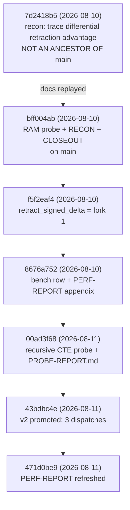
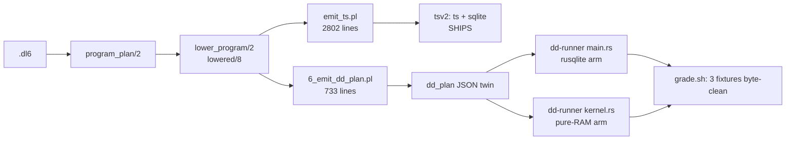

# DD line recon: three emitter targets, the SQLite algorithms, the benches

Read-only recon at `91c5ea6e`. Plain-words twin:
`plans/2026-08-11-dd-line-recon.visual.human.unga.md`.

## TOC

| # | question | one-sentence answer |
|---|---|---|
| 1 | [Where the DD line stopped](#q1-where-the-dd-line-stopped) | It did not stop at the 2026-08-10 closeout: fork 1 of the four ranked transfer forks landed in `sprefa-store` the same day and was promoted to the measured default on 2026-08-11, so the closeout's own numbers are already superseded. |
| 2 | [Did the raw SQLite algorithms improve](#q2-did-the-raw-sqlite-algorithms-improve) | Yes: DAG 960k retraction went from 1785.6 ms / 39 statements to 1135.6 ms / 3 statements, moving the ratio to dd from 10.23x to 6.50x, all cycle-correct. |
| 3 | [Are the benches known and runnable](#q3-are-the-benches-known-and-runnable) | Every bench is named and its command exists; 7 of 9 run as-is, the store rig runs with 4 of its 11 engine rows SKIPped, and the `perf_report` matrix that produces the DD table has no `just` recipe at all. |
| 4 | [The three emitter targets](#q4-the-three-emitter-targets) | All three exist in code: tsv2 ships, and both rust targets live in `v6/dd-runner` (416 Rust lines, two dispatch arms, 3 fixtures byte-clean) as naive whole-relation evaluators with no arrangements, no semi-naive, and no wiring into any battery. |
| 5 | [WITH RECURSIVE inside the dred cycle](#q5-with-recursive-inside-the-dred-cycle) | Measured, on 2026-08-11: the signed survivor CTE is 1131.8 ms at 3 statements versus 1693.4 ms at 27, while the DRed-shaped CTE loses (2578.4 ms at 6 statements). |
| 6 | [Dense and compact btree ops](#q6-dense-and-compact-btree-ops) | In place and measured on both SQLite targets: `__str` dictionary + INTEGER surrogate keys + `WITHOUT ROWID` composite PKs are what the compiler emits today, at a measured 1.68-1.99x over TEXT keys. |

Nothing in the six is "no prior work found". Two sub-items are:
`emit_rust.pl` (deleted, ARCH row still cites it) and a Rust
signed-delta/arrangement kernel (planned, never written).

---

## Q1: where the DD line stopped

### The three commits that carry the line



### The closeout table versus main today

The closeout's measured table (`plans/2026-08-10-dd-source-hunt.CLOSEOUT.md:18-23`)
is a two-engine comparison. `v6/sprefa-store/PERF-REPORT.md:41-49` at
`471d0be9` is a seven-engine matrix at the same input hash `ef153ee39296ef0f`
and the same 800002 survivors.

| engine | closeout, memory | PERF-REPORT DAG 960k | statements | ratio to dd today |
|---|---:|---:|---:|---:|
| dd | n/a (172.923 resident) | 174.6 | 0 | 1.00x |
| oracle (in-Rust reference) | not in table | 376.5 | 0 | 2.16x |
| sqlite-count (not cycle-correct) | not in table | 429.6 | 23 | 2.46x |
| sqlite-signed-delta-v2 | did not exist | 1135.6 | 3 | 6.50x |
| sqlite-dred-loop | 1697.397 | 1774.6 | 53 | 10.16x |
| sqlite-count-scc | 1705.019 | 1785.6 | 39 | 10.23x |
| sqlite-dred-cte | not in table | 2582.7 | 6 | 14.79x |

`sqlite-count` is the cheap arm and it is WRONG on cyclic input: 830478
survivors against the oracle's 815240 (`v6/sprefa-store/PERF-REPORT.md:114`).
Cycle-correctness is what the 2.46x row does not buy.

The gap holds shape at scale (`v6/sprefa-store/PERF-REPORT.md:55-63`, `:69-77`):
DAG 2.9M signed-delta-v2 3495.5 vs dd 634.3 = 5.51x; DAG 5.8M 6881.4 vs
1295.7 = 5.31x; CYC 960k 1174.4 vs 204.7 = 5.74x.

### The four ranked transfer forks, and what has code today

| # | fork (closeout `:47-77`) | code in the tree today | file:line |
|---|---|---|---|
| 1 | Timestamped signed-delta fixed point | YES, three implementations | `v6/sprefa-store/src/engine.rs:642` `retract_signed_delta`, `:724` `retract_signed_delta_v2`, `:762` `retract_delta_fold` |
| 2 | Immutable epoch batches with fueled consolidation | PARTIAL, SQLite-shaped only | `cx_delta(round,key,diff)` + `cx_refcount` appended per round, `v6/sprefa-store/src/engine.rs:139-146`; `v6/sprefa-store/PROBE-REPORT.md:61` states it does no periodic `GROUP BY/HAVING` sweep |
| 3 | Arranged half-join scheduling | PLAN TERM ONLY, no runtime | `arr(Id, Ref, KeyColumns, ValueColumns, signed)` emitted at `v6/prolog/compile/6_emit_dd_plan.pl:258-262`; `v6/dd-runner/src/kernel.rs` never reads `arrangements` |
| 4 | Early signed multiplicity consolidation | NO code | no signed weight exists in `v6/dd-runner/src/kernel.rs`; its relation type is `BTreeMap<String, Vec<Tuple>>` (`kernel.rs:15`) |

The estimated arithmetic floor for fork 1 in the closeout was "near 874.6 ms"
(`CLOSEOUT.md:51`). Measured outcome: 1135.6 ms. The commit that shipped it
says so in its own message ("the floor estimate did not survive contact with
cycle-correctness, so the number is recorded honestly", `8676a752`).

### What landed, what stayed in a lab, what was never started

| item | state |
|---|---|
| RAM probe flag `DL_SQLITE_RAM_PROBE` | LANDED on main, `v6/sprefa-store/examples/perf_report.rs` via `bff004ab` |
| RECON + unga + CLOSEOUT docs | LANDED on main, `plans/2026-08-10-dd-source-hunt.*` |
| fork 1 SQLite implementation | LANDED, `engine.rs:642-760`, in `PERF-REPORT.md` and `tests/agreement.rs` |
| recursive-CTE probe binary | LANDED, `v6/sprefa-store/examples/recursive_probe.rs` (112 lines) + `PROBE-REPORT.md` (75 lines) |
| `dd_plan` term + JSON twin | LANDED, `v6/prolog/compile/6_emit_dd_plan.pl` (733 lines), 3 goldens under `v6/prolog/compile/test/dd/` |
| dd-runner Rust consumer | LANDED as a lab-grade binary, `v6/dd-runner/` (416 lines), NOT in any battery |
| forks 2, 3, 4 as a Rust arrangement kernel | NEVER STARTED |
| `dd_plan` iterate over mutual recursion | NOT BUILT: `throw(unsupported_construct(mutual_recursion(HeadRef)))`, `v6/prolog/compile/6_emit_dd_plan.pl:468` |

### The `git commit -n` bypass

The closeout records the bypass at `CLOSEOUT.md:89`.

| question | answer | receipt |
|---|---|---|
| Is the bypassed commit on main? | NO. `7d2418b5` is not an ancestor of `91c5ea6e` and no branch contains it | `git merge-base --is-ancestor` fails; `git branch -a --contains` empty |
| What did it contain? | 27 files, 4744 insertions, of which `engine.rs` alone was 2780 lines of crate-wide `rustfmt` churn | `git show --stat 7d2418b5` |
| What reached main instead? | `bff004ab`, a 4-file commit: the two RECON docs byte-identical, plus the CLOSEOUT, plus `perf_report.rs` +18/-3 | `git diff --stat 7d2418b5 bff004ab -- plans/ v6/sprefa-store/examples/perf_report.rs` shows only CLOSEOUT.md and perf_report.rs differing |
| Did the bypassed content get rail-checked? | The rustfmt churn never entered main, so there is nothing to check. Whether `bff004ab` itself ran the hook is not recorded in the commit object | `.githooks/pre-commit:7-9` runs `v6/tsv2/scripts/comment-budget-rail.sh`, which grades the STAGED DIFF only |
| Has the touched source been re-checked since? | YES, indirectly: `perf_report.rs` has been rewritten twice on main since (`8676a752`, `43bdbc4e`) | `git log -- v6/sprefa-store/examples/perf_report.rs` |

The rail needs a built extractor and a served tsv2 program
(`v6/tsv2/scripts/comment-budget-rail.sh:16-22`), which is why a
`sprefa-store` worktree without `rxjs` could not start it.

---

## Q2: did the raw SQLite algorithms improve

Yes. The 1.7 s number does not stand.

### Where the named engines live

| bench name | dispatch | implementation | statements |
|---|---|---|---:|
| `sqlite-count` | `perf_report.rs:320` | `engine.rs:210` `retract` | 23 |
| `sqlite-count-scc` | `perf_report.rs:321` | `engine.rs:316` `retract_scc` -> `:324` `retract_scc_two_pass` | 39 |
| `sqlite-dred-loop` | `perf_report.rs:322` | `engine.rs:466` `retract_dred` | 53 |
| `sqlite-dred-cte` | `perf_report.rs:323` | `engine.rs:566` `retract_dred_cte` | 6 |
| `sqlite-signed-delta-v2` | `perf_report.rs:324` | `engine.rs:724` `retract_signed_delta_v2` | 3 |

The engine roster is `perf_report.rs:315`.

### Change since the closeout

`git log -- v6/sprefa-store/src/engine.rs` after `bff004ab` (2026-08-10):

| commit | date | what it did |
|---|---|---|
| `f5f2eaf4` | 2026-08-10 | added `retract_signed_delta`, one signed pass over a `delta(round,key,diff)` table, plus `cx_refcount` and `cx_delta` to the schema |
| `00ad3f68` | 2026-08-11 | added `retract_signed_delta_v2` and `retract_delta_fold`, the recursive-CTE probe |
| `43bdbc4e` | 2026-08-11 | promoted v2 into the matrix as `sqlite-signed-delta-v2`, retired v1's bench row |

### The decomposition the closeout published, and its standing

| closeout claim (`CLOSEOUT.md:25-33`) | standing |
|---|---|
| over-delete init and rounds 871.04 ms / 51.8% | STILL TRUE for `sqlite-count-scc` and `sqlite-dred-loop`, which are unchanged code |
| rederive base and rounds 807.70 ms / 48.0% | SAME, and it is exactly the phase v2 deletes |
| remainder 3.58 ms / 0.2% | SAME |
| logged SQL = 99.79% of wall | SAME |
| memory DB buys 3.203% (count-scc) / 6.120% (dred-loop) | SAME; the RAM probe flag is untouched since `bff004ab` |

The decomposition is confirmed against the code: `retract_scc_two_pass` is two
explicit passes (`engine.rs:324` onward), and `retract_signed_delta_v2` is one
recursive walk plus a frontier clear plus one set-based weight publish
(`engine.rs:729-746`).

### The measured improvement

| axis | 2026-08-10 best correct engine | 2026-08-11 best correct engine | delta |
|---|---:|---:|---|
| DAG 960k ms | 1774.6 (`dred-loop`) | 1135.6 (`signed-delta-v2`) | -36.0% |
| DAG 960k statements | 39-53 | 3 | -92 to -94% |
| ratio to dd | 10.16-10.23x | 6.50x | -36% |
| CYC 960k ms | 1935.8 (`count-scc`) | 1174.4 | -39.3% |
| DAG 5.8M ms | 11069.2 | 6881.4 | -37.8% |

All rows report `correct: yes` against the oracle
(`v6/sprefa-store/PERF-REPORT.md:41-49`, `:111-119`, `:69-77`).

---

## Q3: are the benches known and runnable

`v6/labs/BENCHMARKS.md` is the inventory and it is accurate except on
`sqlite_baseline`, which it calls absent (`BENCHMARKS.md:272-276`) and which
now exists at `v6/labs/exec_shootout/sqlite_baseline/` with `Cargo.toml` and
`src/engines.rs`. It is still not in `perf-all`.

| bench | what it measures | command | receipt line | measured wall | runnable as-is |
|---|---|---|---|---|---|
| `shootout` | in-RAM Rust engines, derived rows/sec at the fixpoint | `cd v6 && just shootout` | `chain 10k mono fp rows/sec ~7e7` (`justfile:385`) | ~162s (`BENCHMARKS.md:99`) | YES |
| `dl6-bench` | emitted TS+SQLite build, grid only | `cd v6 && just dl6-bench` | `grid_10000 derived=1069200 checksum=9d7239568960d6a8` (`justfile:358`) | ~30s | YES |
| `dl6-bench-full` | adds layered + chain at 10k | `cd v6 && just dl6-bench-full` | `chain_10000 derived=9996213 checksum=df09b2f409f8b9a8` (`justfile:373`) | ~164s | YES |
| `dl6-doc` | same bench, regenerates the live d2/svg | `cd v6 && just dl6-doc` | `dl6-bench: rendered .../2026-08-06-dl6-live.svg` (`justfile:368`) | ~30s | YES |
| `dl6-dred-bench` | incremental tick, in-place DRed vs refCount, grid 45x45 | `cd v6 && just dl6-dred-bench` | banked in `dl6/FACTS.dredland.md` | ~20s | YES |
| `dl6-budget` | ratchet gate on grid fixpoint ms + RSS | `cd v6 && just dl6-budget` | exit 2 on breach | ~4s | YES |
| `bench` (store rig) | 11 engine rows over a layers x width sweep | `cd v6 && just bench` | `bench/out/results.csv` + `REPORT.md` | small scale ~4s, full ladder >3 min | PARTIAL, see below |
| `bench-cli` | language-agnostic CLI contract, tick-log byte-diff | `cd v6 && just bench-cli` | `BENCH-CLI timed=16 (swipl 11 / reference 5) disqualified=0 ungraded=0 hash-agreement=OK` (`justfile:396-401`) | ~5 min, half of it swipl budget timeouts | YES, but it breaks the 10-second law by design |
| `perf-all` / `perf-all-deep` | the whole battery, 6 legs | `cd v6 && just perf-all` | per-leg `==> <leg> wall Ns (exit N)` | minutes | YES |
| PERF-REPORT matrix (the DD table) | 7 hermetic engines x 10 scales | `cd v6/sprefa-store && cargo run --release --example perf_report` | writes `PERF-REPORT.md`; `_Report generated in 958s._` | 958s | YES, but NO `just` recipe exists |
| recursive CTE probe | 6 retraction variants vs oracle | `cd v6/sprefa-store && cargo run --release --example recursive_probe -- 6 160000 0` | all variants `oracle-equal` | not stated | YES |
| `dd_wall` ramp | dd's true resident ceiling | `cargo test --release --example dd_wall`, then the binary under `DL_BREAK_CAP` | dd aborts at 3,168,002 nodes, ~224.1 B/node (`c16029e2`) | not stated | YES |
| `profile_dred` | one retract, per-phase flame | `cd v6/sprefa-store && cargo run --release --example profile_dred` | stdout only, not banked | ~5s | YES |
| `sqlite_baseline` | hand-tuned pure-SQLite closure build | none wired | none | none | NO: exists on disk, absent from `perf-all` and from `BENCHMARKS.md`'s status |

### The two "no" answers

1. **Store rig, 4 of 11 engine rows.** `bench/run.sh:19-32` lists
   `sqlite-mem`, `sqlite-disk`, `dd`, `dbsp` against binaries
   `sqlite_reach` / `dd_reach` / `dbsp_reach`. Those example binaries were
   folded out at `a7d5ad36` and `v6/sprefa-store/examples/` now holds only
   `dd_wall.rs`, `explain_plans.rs`, `perf_report.rs`, `profile_dred.rs`,
   `reach_perf.rs`, `recursive_probe.rs`, `storage_delta.rs`. `run.sh:41-43`
   prints `SKIP <label> (<path> not built)` and continues. Missing: either
   restore the binaries or delete the rows.
2. **`sqlite_baseline`.** The crate is present; `just perf-all` does not call
   it and `BENCHMARKS.md:272` still says it is absent at base. Missing: a
   `just` recipe, a bank file (`dl6/BASELINE.md` exists), and the `perf-all`
   wiring.

### `dl6-budget` ceilings

`v6/labs/exec_shootout/dl6/budget.json`, current and complete:

```json
{ "grid_10000": { "fixpoint_ms_ceiling": 2500, "peak_rss_mb_ceiling": 900 } }
```

One cell. It ratchets DOWN only (`justfile:362-363`). The banked measurement it
grades against is 2,110 ms refCount / 2,141 ms in-place, 740 -> 697 MB RSS
(`dl6/FACTS.dredland.md` section 2), so the ceiling sits about 17% above the
banked time.

### Staleness

| bank | last measured | note |
|---|---|---|
| `PERF-REPORT.md` | 2026-08-11 (`471d0be9`) | current |
| `PROBE-REPORT.md` | 2026-08-11 (`00ad3f68`) | current |
| `dl6/FACTS.dredland.md` | 2026-08-06, Node v24.15.0 | 5 days old, still the `IDredPlan` landing receipt |
| `BENCHMARKS.md` wall times | 2026-08-10 at `e926a196` | current within a day |
| `intern_bench/REPORT-INTERN.md` | 2026-08-07 | the source of the 1.7-2.0x law |
| `STANDINGS.md` | predates the v6 store | oldest bank in the set |

---

## Q4: the three emitter targets

### What exists per target

| target | what exists today (file:line) | designed and unbuilt | undecided | named blocker |
|---|---|---|---|---|
| **tsv2 (ts + sqlite), the reference** | `v6/prolog/emit_ts.pl` 2802 lines over `lowered/8` from `v6/prolog/lower.pl` 5749 lines; 270 of 370 manifest fixtures compiled; 12-phase tick contract at `v6/tsv2/runtime/types.ts:267-324`; emitted DDL uses `__str` + INTEGER `WITHOUT ROWID` PKs | Bun single-binary packaging, path C of `plans/2026-08-10-rust-emit-recon.PLAN.md:380-420` | nothing blocking; it ships | none |
| **rust x sqlite (the production one)** | `v6/dd-runner/src/main.rs:71-107`: `rusqlite` executes the `dd_plan` JSON's `ddl` + per-rule `delete`/`inserts`, tick loop at `:80-94`; 3 fixtures byte-clean via `v6/dd-runner/grade.sh` | the whole `lowered/8` surface: arrivals, edge statements, retention, expand, DRed, text/struct planes, catalog, boot. `PLAN.md:312-341` prices path A at 4,300-7,600 lines | whether Rust consumes generated `.rs` (path A) or a versioned plan wire format (path B), `PLAN.md:343-372` | `dd-runner` executes ONE phase: `if phase == "level_before_edges" { execute_rules(...) }` (`main.rs:86-90`). Every other phase in `tick_order` is a no-op |
| **rust x rust (dd style, the speed reference)** | `v6/dd-runner/src/kernel.rs`, 215 lines, zero SQLite imports; consumes `operators[].bindings/predicates/projection/aggregate` from the JSON twin; same 3 fixtures byte-clean | arrangements, semi-naive, signed weights, timestamps, feedback, consolidation, threshold state. `plans/2026-08-10-dd-dance-recon.PLAN.md:136-141` prices the kernel at 260-360 lines and the general emitter at 300-450 | whether nested time, feedback, threshold, batching, compaction and half-join ownership are runtime conventions or explicit `dd_plan` fields (`RECON.md:196`) | the kernel is NAIVE: `settle` (`kernel.rs:86-107`) clones the whole state and re-derives from base every round up to 10,000 rounds; `binding_rows` (`:160-177`) is a full cross product; `insert_rows` (`:109-112`) dedups with `Vec::contains`, a linear scan |

### The pipeline, drawn



### The `dd_plan` payload decision

`plans/2026-08-10-dd-payload-grain.PLAN.md:52` picked option B: one SQL bundle
on the rule's map operator, siblings carry `owner(MapId)`. The join golden fell
from 4,804 to 2,899 bytes. The structural test is
`v6/prolog/compile/test/6_emit_dd_plan.test.pl:36`. Option C (per-operator SQL)
was not prototyped because `edge_delta_project_sql/11` (`lower.pl:2945`) and
`level_statement_groups/4` (`lower.pl:3038`) emit rule-scoped and head-scoped
SQL, never per-node fragments.

The consequence for a compiler: the RAM target reads the relational half
(`bindings`, `predicates`, `projection`, `aggregate`), and the SQLite target
reads the `sqlite` half. One term, two backends, already split.

### ARCH.pl cross-check, quoted verbatim

```prolog
algorithm(seminaive_eval,  delta_flow,  monotone_fixpoint, 'sqlite via js lowerSql / rust store').
algorithm(count_ivm,       delta_flow,  monotone_fixpoint, 'rust store (beat DRed 4-5x)').
algorithm(tsv2_lower,      ast,         rewrite,           'compile/lower.pl (lowered/8 target-neutral plan: SQL text + structure, zero TS idiom)').
algorithm(tsv2_ts_emit,    ast,         rewrite,           'compile/emit_ts.pl (backend #1 over lowered/8; emit_rust.pl plugs the same plan via compile_fixture/4)').
tech(rust, future_bundle, [extraction, daemon, udfs, store],
     'extraction is solved here; prolog ships inside it as the compiler').
```

```prolog
task(oracle_scale_ceiling, unbuilt, [bench_cli]). % RULING CARD (gates rust phase 1): swipl oracle walls before 10k rows (s1/1k 1.4s vs tsv2 33ms) -- rust cannot be graded at PERF-REPORT 960k scale by tick-log byte-diff. Exits in bench-cli/CONTRACT.md section 7: (a) reference that scales, (b) tiered grading (tick log where oracle reaches, final-state hash beyond). User call.
```

The header line that states the whole target relationship, verbatim
(`ARCH.pl:74-77`):

```prolog
% * THE BABEL PRECEDENT. regenerator desugared yield/await into a state
%   machine whose control position is a VARIABLE (a register) — sugar first,
%   as the reference semantics; V8 later reabsorbed it natively in C++ for
%   speed. Same pipeline here: prolog desugar is the reference semantics,
%   rust/sqlite native lowering is the optimization, and the two must agree.
```

Three ARCH corrections found:

| ARCH text | reality | receipt |
|---|---|---|
| `ARCH.pl:202` `emit_rust.pl plugs the same plan via compile_fixture/4` | `emit_rust.pl` does not exist. `v6/prolog/labs/**` was deleted at `688a7252` (2026-08-10, 4,874 lines) | `git ls-files \| grep -i rust` finds no such file; `find v6/prolog -name '*rust*'` empty |
| `plans/2026-08-06-rust-emitter-modes.md:31-33` cites the same lab as live | same deletion | `plans/2026-08-10-rust-emit-recon.PLAN.md:241-263` already cites it as `e0faba55^` |
| ARCH has NO task row for `dd_plan`, `dd-runner`, or a Rust emitter arc | the work landed in 8 commits with no ARCH row | `grep '^task(' ARCH.pl` returns nothing matching |

The standing ruling on Rust emitters, quoted (`v6/prolog/conformance/rulings.pl:678-679`):

```prolog
ruling(boop_dl6_sh_door, sh_hosts_now_ts_core_rust_emitters_later, user,
       'user 2026-08-10: "boop stays as sh code in dl6 for now, ts is the core engine and when we get far enough to factor it into rust emitters, then we can get there and link into our homies". Bridge item 7 (boop base facts to DL6) therefore lands as sh decls calling the boop CLI, never a bespoke native bridge.').
```

### What the three-target picture is missing

| gap | receipt |
|---|---|
| `dd-runner` is in no battery | `grep dd-runner v6/justfile v6/tools/ .github/` returns nothing |
| the RAM kernel has no arrangement, no delta, no weight | `kernel.rs:15` `type Relations = BTreeMap<String, Vec<Tuple>>` |
| `dd_plan` cannot express mutual recursion | `6_emit_dd_plan.pl:468` throws `unsupported_construct(mutual_recursion(HeadRef))` |
| only 3 fixtures grade | `v6/dd-runner/grade.sh:27-29` against 370 manifest fixtures |
| Rust cannot be graded at 960k scale | `ARCH.pl:873` `oracle_scale_ceiling`, unbuilt, marked "User call" |

---

## Q5: WITH RECURSIVE inside the dred cycle

It was asked, and it was answered by measurement on 2026-08-11, one day after
the closeout. The bank is `v6/sprefa-store/PROBE-REPORT.md` (75 lines), added
by `00ad3f68`.

### The numbers, DAG 960k, `gen_multi_cyclic(6, 160000, 0)`

`v6/sprefa-store/PROBE-REPORT.md:35-42`:

| variant | ms | statements | survivors | oracle-equal |
|---|---:|---:|---:|:---:|
| `dred-loop` | 1781.9 | 53 | 800002 | yes |
| `dred-cte` | 2578.4 | 6 | 800002 | yes |
| `signed-delta` | 1693.4 | 27 | 800002 | yes |
| `signed-delta-cte` | 1131.8 | 3 | 800002 | yes |
| `delta-fold` | 1243.2 | 27 | 800002 | yes |
| `dd`, banked | 175.4 | 0 | 800002 | yes |

Cyclic 960k stride 7 (`PROBE-REPORT.md:46-50`) reproduces the ordering:
`signed-delta-cte` 1188.8 / 3, `dred-loop` 1963.1 / 53, `dred-cte` 2758.5 / 6.

### The three questions the probe answered

`v6/sprefa-store/PROBE-REPORT.md:13-17`, verbatim structure:

| question | result |
|---|---|
| Can `WITH RECURSIVE` remove round dispatches? | Yes. Signed survivor reachability is one distinct recursive walk plus frontier clear and weight publish: 3 statements. |
| Can a CTE own the signed-delta round column? | No. `(round,key)` makes every cycle visit distinct under `UNION`; an accumulated-set guard requires a second recursive CTE reference, rejected by SQLite. |
| Does incremental folding remove work? | It avoids the whole-row-table refcount refill. The current single-tick implementation retains 27 dispatches because each round still stages and folds separately. |

The SQLite limit is traced to a real message, not inferred: adding
`NOT IN (SELECT key FROM alive)` fails with `multiple recursive references:
alive` (`PROBE-REPORT.md:29`). That is a database limit, cited.

### The mechanism that makes the CTE win here

`v6/sprefa-store/src/engine.rs:724-749`. Three statements:

1. `DELETE FROM cx_frontier`
2. `INSERT INTO cx_frontier(key) WITH RECURSIVE alive(key) AS (... UNION ...) SELECT key FROM alive`
3. `UPDATE cx_row SET weight = CASE WHEN key IN (SELECT key FROM cx_frontier) THEN 1 ELSE 0 END`

`UNION` (not `UNION ALL`) is the cycle suppressor. The recursive walk is
survivor reachability from the roots that outlive the cut, so the over-delete
cone and the rederive walk both disappear.

### The one place the CTE loses

`dred-cte` (`engine.rs:566`) is slower than its loop twin at every scale in the
matrix: 2582.7 vs 1774.6 at DAG 960k, 15540.3 vs 11069.2 at DAG 5.8M
(`PERF-REPORT.md:47`, `:75`). This agrees with the prior banked line in
`.claude/skills/sqlite-costs/SKILL.md:52-53`: "Recursive CTE vs statement loop:
loop wins wide frontiers ~1.3x, loses on deep-thin chains; shape-dependent,
both banked."

The 2026-08-11 result refines that line rather than contradicting it: the CTE
loses when it accumulates a cone (DRed shape) and wins when it computes the
survivor set directly (signed shape). The skill's constant is about the CTE
versus the loop on the SAME algorithm; the win came from changing the
algorithm the CTE runs.

Older recursive-CTE work also exists at `engine.rs:931`, `:955`, `:976`
(reach helpers) and in `96f14b12` (2026-07-24, "ANALYZE rejected (hurts the
CTE)").

### Compiler-facing consequence

A compiler emitting SQLite for a recursive rule has two lowerings and they are
not equivalent in cost: round-by-round dispatch, and a single `WITH RECURSIVE`
walk. The measured rule of thumb from this bank: emit the CTE when the walk
computes a set directly, emit the loop when the walk must carry per-round
state. The v6 lowerer today has `level_fixpoint_ir/5` (`lower.pl:4051`) and
`level_expand_plan/5` (`lower.pl:3724`) and no CTE arm.

---

## Q6: dense and compact btree ops

Both mandatory skills read first:
`.claude/skills/sqlite-costs/SKILL.md` and
`.claude/skills/sql-relational-design/SKILL.md`. Nothing reported here
disagrees with either.

### The techniques, in use, and what each bought

| technique | in use today | file:line | measured | what it bought |
|---|---|---|---|---|
| Text dictionary with INTEGER surrogate ids | YES, default | `v6/prolog/compile.pl:154` `default_intern_mode(dict)`; emitted `CREATE TABLE "__str" ("__id" INTEGER PRIMARY KEY, "content" TEXT NOT NULL UNIQUE)` at `v6/prolog/compile/out/aggregate_count_min_max_track_arrivals_and_retraction.ts:149` | YES | 1.68-1.99x on insert, 9.0-9.4x smaller on disk over the whole fixpoint |
| `WITHOUT ROWID` composite INTEGER PK on stored rels | YES, emitted | same file `:150`, `:152` (`PRIMARY KEY ("repo","col2","col3","col4") WITHOUT ROWID`, all columns INTEGER) | YES | 5.4-7.6% faster and 2.4x smaller than rowid+UNIQUE on the same algorithm |
| `WITHOUT ROWID` on the store's dependency table | YES | `v6/sprefa-store/src/engine.rs:126-129`, `cx_dep(parent_key, child_key) PRIMARY KEY WITHOUT ROWID` | YES | "collapses from a 4-column composite to a 2-column", `engine.rs:116-118` |
| `INTEGER PRIMARY KEY` as rowid alias (zero extra key bytes) | YES | `v6/sprefa-store/src/engine.rs:121-126`, `cx_row(key INTEGER PRIMARY KEY)` | stated in the comment, not separately timed | "the key costs zero extra bytes and every lookup is a native rowid search" |
| Packed single-INTEGER key (`tag * 1e9 + id`) | YES | `v6/sprefa-store/src/engine.rs:124-125`, `tag`/`id` as VIRTUAL generated columns off `key` | YES, as a wash | 6,565 vs 6,777 ms / 10M rows against two INT columns; btree page work dominates key width |
| TEMP tables with `temp_store=MEMORY` for churn | YES | `v6/sprefa-store/src/engine.rs:128-135`, all frontier/next/hits/cone/scc tables | YES | avoids WAL-logging every round, "a ~4x tax", `engine.rs:97-100` |
| `WITHOUT ROWID` on the per-round delta table | YES | `v6/sprefa-store/src/engine.rs:141-146`, `cx_delta(round, key, diff) PRIMARY KEY (round,key) WITHOUT ROWID` | not isolated | fork 2's SQLite shape |
| Dense surrogate ids across the extraction model | YES | `v6/sprefa-store/src/spine.rs:7-8`: "Every id is a dense DB/interner surrogate, never a content hash" | prior v5 work | kills v5's `StringId=hash64` |
| `page_size=16384` | YES in the intern bench harness | `intern_bench/REPORT-INTERN.md` section 3 header | YES | ~100 MB RSS saved on 10M rows; other pragmas are no-ops on `:memory:` |
| Composite TEXT PK | PRESENT in one stale artifact | `v6/tsv2/.ghcwork/ghc.ts:157-167` (a work directory, not emitted output) | n/a | this is the shape the surrogate-keys law forbids |
| `rowid` + `UNIQUE` where a rowid range is needed | YES, deliberate | `v6/prolog/lower.pl:1764`: "rowid + UNIQUE, not WITHOUT ROWID: `__id` is read once per boundary render" | YES | the rowid-range delta is worth 17-53%, and it is the DELTA that needs a rowid |

### The 1.7-2.0x number, sourced

`.claude/skills/sql-relational-design/SKILL.md:27-29` cites
`labs/exec_shootout/intern_bench/REPORT-INTERN.md` section 3. That table
exists and reads (`REPORT-INTERN.md:71-78`), 4-column `WITHOUT ROWID` PK with
`__refcount`, only the column type differing, best of 5, rusqlite 0.32.1
bundled, in-memory, `page_size=16384` + `temp_store=MEMORY`:

| source | rows | TEXT rows/sec | INTEGER rows/sec | speedup |
|---|---:|---:|---:|---:|
| grid_10000 edges | 3,960 | 1,729,257 | 3,396,226 | 1.96x |
| chain_10000 edges | 7,743 | 1,903,392 | 3,310,389 | 1.74x |
| synth | 10,000 | 1,930,501 | 3,243,593 | 1.68x |
| synth | 100,000 | 1,627,100 | 3,137,451 | 1.93x |
| chain_1000000 edges | 999,989 | 1,487,412 | 2,925,484 | 1.97x |
| synth | 1,000,000 | 1,520,727 | 3,032,324 | 1.99x |

The band is 1.68-1.99x, so the law's "1.7-2.0x" is the honest rounding of a
real six-row measurement. Confirmed at source.

### `storage-diet 4a`

CLAUDE.md's open items list it under "Dispatchable (v5)". It is NOT an
`ARCH.pl` row: `grep '4a' v6/prolog/ARCH.pl` returns one unrelated hit
(`task(retention_minus, ...)` mentioning "stream card 4a"). The real rows are
in the v5 plan docs, quoted:

```
plans/2026-07-18-storage-diet.md:238
- (4a) WITHOUT ROWID on pure junction/set tables (flow_edge, df_edge, the many
```

```
plans/2026-07-18-storage-diet.md:331
| 4 | WITHOUT ROWID for measured pure junction rels (flow_edge, df_edge, edge tables) | 4a | -60 to -90 | classifier + dbstat per table; determinism oracle |
```

```
plans/2026-07-19-storage-endgame.md:5
4a (WITHOUT ROWID on 17 vouched junctions; 22 tables WITHOUT ROWID in the live
```

Step 4a already LANDED once in v5 on 2026-07-18
(`plans/2026-07-18-storage-diet.md:430` "### Step 4a receipt (landed
2026-07-18)"), with a named failure class from it
(`docs/failure-modes.md` class 17, STEP-4a NULL-IN-PK). What CLAUDE.md lists
as dispatchable is the successor scope in `storage-endgame.md`, which wants
the classifier's 2..=4 column cap lifted (`storage-endgame.md:397`).

### What is NOT in place

| item | state |
|---|---|
| dense id RENUMBERING (compaction of a sparse dictionary) | no prior work found. `__str` ids are dense by insertion order; nothing rewrites them after deletes |
| btree page-write counting as a receipt | measured impossible: "bundled SQLite exposes memory/cache status, with no page-write counter" (`PROBE-REPORT.md:66`) |
| a dictionary plan for TEXT-declared rels in every lowering path | `sql-relational-design/SKILL.md:51-53` states the obligation; `default_intern_mode(dict)` satisfies it for the default path, and no audit of non-default paths exists |

---

## Verification

Read-only. Commands run:

```text
git log --oneline -1                                     -> 91c5ea6e
git merge-base --is-ancestor 7d2418b5... HEAD            -> not an ancestor
git branch -a --contains 7d2418b5...                     -> empty
git diff --stat 7d2418b5 bff004ab -- plans/ ...perf_report.rs
git log --pretty='%h %ad %s' --date=short -- v6/sprefa-store/src/engine.rs
git log --pretty='%h %ad %s' --date=short -- v6/prolog/compile/6_emit_dd_plan.pl
python3 -c "json ... manifest.json"                      -> 370 fixtures, 270 compiled / 100 unsupported
```

No benchmark was run. No source file was edited. Two plan documents written.
