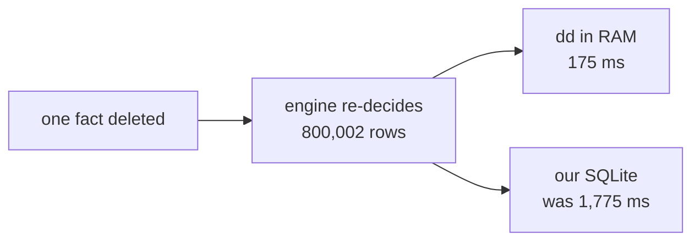
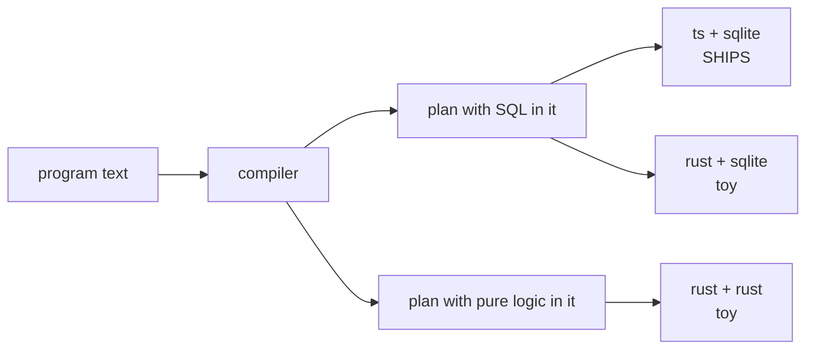

# DD line recon, plain words

For a reader with zero context. No file paths, no line numbers, no commit ids.

## TOC

1. What the whole thing is
2. The six questions, one line each
3. Where the speed race stands
4. The one big thing that changed this week
5. The three targets
6. The benches
7. What is missing

---

## 1. What the whole thing is

We compile a small logic language into a program that keeps answers up to date
when facts change. Deleting one fact at the root of a big graph is the hard
case: 800,002 rows have to be re-decided.

There is a Rust library called differential dataflow that does this in about
175 milliseconds by keeping everything in memory. Our SQLite versions took
about 1.7 seconds. The goal is to write a compiler that closes that gap.



## 2. The six questions, one line each

| # | question | answer |
|---|---|---|
| 1 | Where did the dd work stop? | It did not stop. The first of four planned ideas got built the same day the report was written, and improved again the next day. |
| 2 | Did the raw SQLite algorithms improve? | Yes. 1,775 ms down to 1,136 ms. 53 database calls down to 3. |
| 3 | Are the benches known and runnable? | Yes for almost all of them. Two have holes. |
| 4 | Where do the emitters stand? | All three exist. One ships. Two are toys that prove the shape and nothing else. |
| 5 | Did anyone try a recursive query inside the slow loop? | Yes, yesterday. That is exactly what produced the speedup. |
| 6 | Are the compact storage tricks in place? | Yes, all of them, and measured. |

## 3. Where the speed race stands

One deletion, 960,000 nodes, everything correct.

```
dd (in RAM, the target)       175 ms   ###
in-Rust reference oracle      377 ms   ######
cheap SQLite (WRONG on loops) 430 ms   #######
NEW signed recursive walk   1,136 ms   ###################
old two-pass loop           1,775 ms   ##############################
```

The cheap 430 ms row is a trap. It gives the wrong answer when the graph has
cycles: it reports 830,478 survivors when the right answer is 815,240. Being
correct on cycles is what costs the time.

The gap to dd is now about six and a half times, down from about ten times.
It stays around five to six times as the graph grows to six million nodes, so
it is a constant factor, not a curve that gets worse.

## 4. The one big thing that changed this week

The old algorithm did the job twice. First it deleted everything downstream of
the cut, then it walked back through and put back anything that had another
way to stay alive. Two passes, dozens of round trips.

The new one asks one question instead: starting from the roots that are still
alive, what can you still reach? Whatever the walk does not reach is dead.


The walk is one recursive database query. The database itself handles the
cycles, because it throws away nodes it has already seen.

One thing did not work and is worth knowing: you cannot make the recursive
query carry a round counter. Tagging each node with which round it was found
in makes every trip around a cycle look new, so the loop never ends. And the
guard that would fix it needs the query to look at itself twice, which SQLite
refuses. So the recursive query owns the walk, and the counting stays outside.

Another thing that did not work: putting the OLD two-pass algorithm inside a
recursive query. That made it slower, 2,578 ms. The win came from changing the
algorithm, not from the query form.

## 5. The three targets

We want three ways to run a compiled program.

| target | what it is | state |
|---|---|---|
| ts + sqlite | what ships today | real, complete, 270 test programs compile |
| rust + sqlite | the intended production one | a 189-line toy that runs 3 test programs |
| rust + rust | the speed reference, dd-style | a 215-line toy that runs the same 3 |



The good news: the compiler already emits ONE plan with two halves. The SQL
half feeds the two SQLite targets. The pure-logic half feeds the in-memory
target. That split is done and tested.

The honest news about the two Rust toys:

- The Rust in-memory one recomputes EVERYTHING from scratch every round, up to
  ten thousand rounds. It joins by building the full cross product of every
  table. It removes duplicates by scanning a list. It is a correctness referee,
  not an engine.
- The Rust SQLite one runs exactly one of the twelve phases a real tick has.
  The other eleven are silently skipped, and the three test programs happen not
  to need them.
- Neither is wired into any automated check, so neither can break loudly.

None of that is a design problem. Both were built to freeze the plan shape
before anyone wrote a real engine, and they did that job.

## 6. The benches

Nine named benches. Every one has a command that exists.

| bench | runs today? |
|---|---|
| in-RAM Rust engine shootout | yes, ~2.5 min |
| emitted program build, grid only | yes, ~30 s |
| emitted program build, all three shapes | yes, ~2.5 min |
| incremental tick, delete vs recompute | yes, ~20 s |
| the regression ceiling gate | yes, ~4 s |
| the whole battery in one command | yes, minutes |
| the language-agnostic CLI contract | yes, ~5 min |
| the retraction matrix that produces the dd table | yes, but 16 minutes and no shortcut command |
| the store scale rig | partly: 4 of its 11 engine rows are silently skipped |

Two holes:

1. The scale rig still lists four engines whose programs were deleted. It
   prints SKIP and keeps going, so the rig quietly measures seven things while
   claiming eleven.
2. A hand-tuned pure-SQLite baseline exists on disk but is in no battery and
   the docs still say it does not exist.

The regression gate has exactly one cell: the grid program must finish its
fixpoint in under 2,500 ms and stay under 900 MB. It last measured about
2,110 ms and 740 MB, so it has roughly 17 percent of headroom. That ceiling
only ever moves down.

## 7. What is missing

Ordered by how much it blocks the stated goal of getting close to dd with a
compiler.

| # | missing thing | why it matters |
|---|---|---|
| 1 | A real in-memory Rust engine: sorted indexes, only-what-changed evaluation, plus and minus weights | This is the entire speed story. The current one is a referee. |
| 2 | The rest of the tick in the Rust SQLite runner | Eleven of twelve phases do nothing. |
| 3 | A way to grade Rust at a million rows | The reference implementation used for grading walls out below ten thousand rows, so a fast Rust engine cannot be proven correct at the scale where speed matters. This is flagged as needing a decision from you. |
| 4 | Mutually recursive rules in the plan | The plan generator stops on them today. |
| 5 | The recursive-query trick taught to the compiler | The compiler emits round-by-round loops only. The 36 percent win came from a hand-written recursive query that the compiler cannot yet produce. |
| 6 | Wiring the Rust runners into the automated checks | Right now nothing notices if they break. |

Two record-keeping fixes found along the way:

- The architecture file still names a Rust emitter program that was deleted
  last week. Two plan documents repeat the same stale claim.
- Eight commits of dd work landed with no row in the architecture ledger.

One thing that looked like a problem and is not: a report mentioned skipping a
commit check. The commit that skipped it never reached the main branch. What
reached main was a separate, much smaller commit, and its documents are
byte-identical to the ones that were checked.
