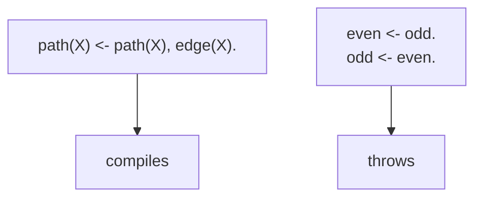
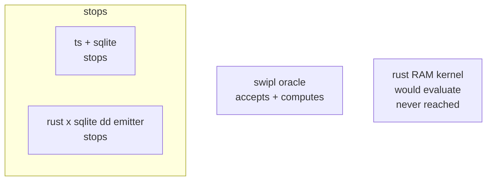
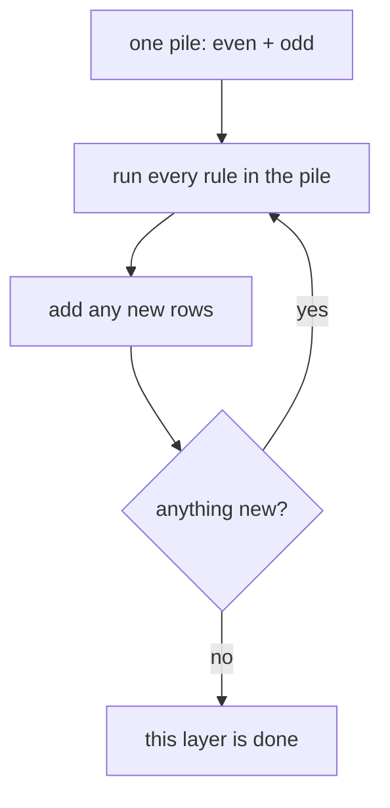
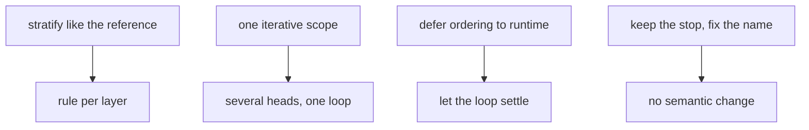
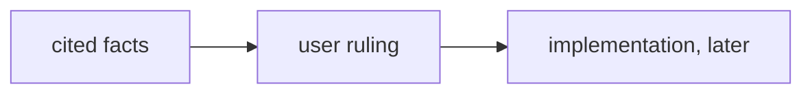

# Mutual recursion in the dd plan: the plain-words twin

## TOC

1. [The one question](#1-the-one-question)
2. [What the stop actually is](#2-what-the-stop-actually-is)
3. [The three backends, side by side](#3-the-three-backends-side-by-side)
4. [How the reference keeps two rules on one pile](#4-how-the-reference-keeps-two-rules-on-one-pile)
5. [How much it blocks today](#5-how-much-it-blocks-today)
6. [The four paths forward](#6-the-four-paths-forward)
7. [What this document does not decide](#7-what-this-document-does-not-decide)

## 1. The one question

A dl program may have a rule that calls itself. Two rules may not call each
other. A program that makes that illegal:

- `even` is true when `odd` is true.
- `odd` is true when `even` is true.

The compiler stops on this. The question is whether that stop is a real wall
or just a gate placed before work that would otherwise succeed.

## 2. What the stop actually is

The stop is a chain check, not a semantic check.

When a rule is compiled, the builder asks: "does this rule read some other
rule that reads its way back to me?" It walks from rule to rule along the
"reads" edges, never visiting a rule twice, until it either reaches the
starting rule (mutual recursion, stop) or runs out of road (fine).

Crucially, the check runs before any evaluation. By the time the check
runs, no engine has tried the rules and failed. And the engine's own
fixed-point loop already treats every head the same, so it would evaluate
mutually recursive rules if it ever saw them.

Two naming notes:

- The most visible stop is actually an earlier, blunter one. For a normal
  whole program the ordering pass trips first and reports a "recursive
  stratum". The per-rule "mutual recursion" name only surfaces when a caller
  hand-builds a plan that already contains the cycle.
- "Stop" is an ordering term; no arithmetic or type rule is violated. The
  reference backend proves the semantics run fine.

## 3. The three backends, side by side

| backend | accepts two-way recursion? | what it gives you |
|---|---|---|
| the shipping ts + sqlite backend | NO | stops at the ordering pass (self-recursion only) |
| the rust x sqlite dd-plan emitter | NO | stops the same way, same shared ordering pass; the emitter's own per-rule name is a second net |
| the pure-scoped swipl oracle | YES | computes the answer, iterating both rules together |
| the rust x rust RAM kernel (not reached) | would | computes a joint fixed point over all heads, but never sees a stopped program |

The middle two share one ordering gate, so they stop identically. The oracle
is the reference semantics, and it computes the thing the other two stop.

## 4. How the reference keeps two rules on one pile

The oracle splits a program into layers. A rule that reads another rule goes
in a layer no lower than the one it reads. Reading "on the same level" lands
both rules in the same pile. Negation or an aggregate forces a strict step
down so a layer only ever reads complete results.

A positive two-way cycle has nothing forcing either rule down, so both sit in
one pile. That pile is then evaluated in a loop: run every rule in the pile,
add what is new, repeat until nothing changes.

That joint loop is exactly what a compiler would have to emit to accept
two-way recursion today, and it is the same loop the shared kernel already
runs for every head.

## 5. How much it blocks today

The number is small:

- The shipped compile suite: **0** programs out of 370 mention either stop.
- The conformance rules: **0** pairs out of 804 trip the check.
- In the wider example corpus: **2** real two-way recursions, neither in the
  shipped suites.

Zero is a finding, not an embarrassment. The gate is a latent capacity the
real corpus has not needed. The only true two-way recursions sit in
`examples/`, outside what ships.

## 6. The four paths forward

No path is ranked. Choosing is a scheduling-semantics decision, listed here
for the decision to be made against.

### A. Break the cycle into layers

Push the two rules apart so each layer runs on its own, then reorder.

| | |
|---|---|
| what it does | keeps the existing layer machine; when a positive cycle is found, split it instead of throwing |
| what it costs | a cycle-break choice; separate passes per split group |
| what it would break | every reordering receipt and the single-pass emit for non-recursive programs |

### B. Put mutual recursion in one iterative scope

Extend the single-head loop into a scope that owns several heads, like the
reference does, and let the kernel's joint fixed point settle the group.

| | |
|---|---|
| what it does | lifts the per-rule stop for rules in the same scope; one loop, many heads |
| what it costs | a new notion of scope + inner round + feedback; the runtime needs a real loop it does not have yet |
| what it would break | the two stop receipts and the clean byte fixtures |

### C. Stop ordering; let the runtime settle

Drop the collapsed ordering for cyclic groups and let an iterative scope find
the answer.

| | |
|---|---|
| what it does | matches the oracle: no strict topo order for cyclic groups |
| what it costs | loses the ordering guarantee the single-pass emitter leans on |
| what it would break | every non-recursive module whose emitted text today stays identical |

### D. Keep the stop, fix the name

Leave behavior alone; document that this is an ordering gate, and surface one
name instead of two.

| | |
|---|---|
| what it does | labels the gate honestly |
| what it costs | nearly nothing |
| what it would break | nothing behavioral; only the error text |

## 7. What this document does not decide

Nothing here chooses a path. Language and type design happen with the user in
the room, and two-way recursion is a scheduling-semantics decision. This twin
exists so a reader with no context can follow the answer and the forks; the
decision itself stays with the user.

