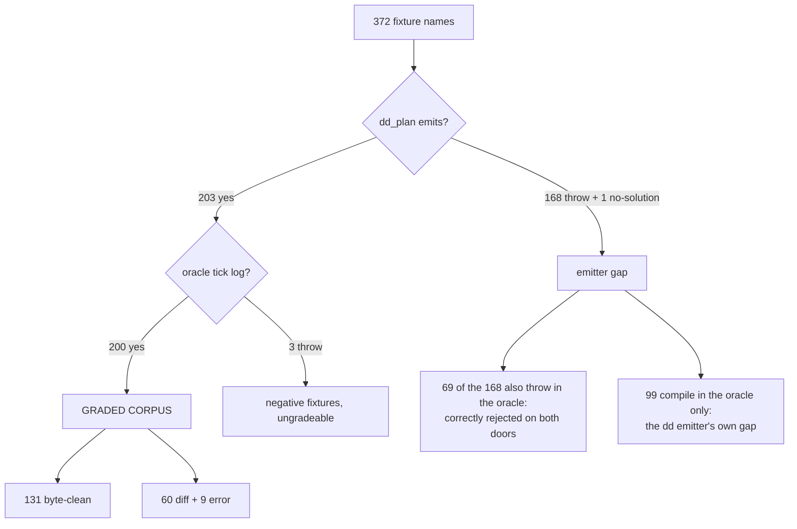
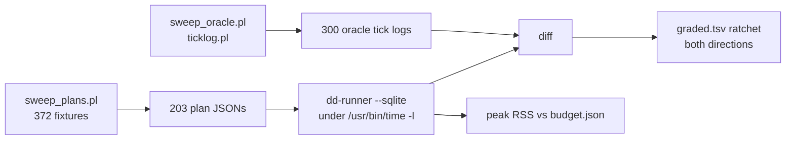

# dd-runner: one tick phase to twelve, and a battery leg

Base `4dd8ef3a`, branch `feature/dd-runner-twelve-phases`.

## TOC

| # | section | one line |
|---|---|---|
| 1 | [The twelve phases](#1-the-twelve-phases) | `tick_order/1` is a fixed list at `6_emit_dd_plan.pl:729-733`; nine now execute, three name a plan term the JSON twin does not carry |
| 2 | [Per-phase table](#2-per-phase-table) | implemented / commit / byte-clean after |
| 3 | [The corpus](#3-the-corpus-reached-and-the-blocked-list) | 3 graded -> 200 graded, 131 byte-clean; blocked list with reasons |
| 4 | [The battery leg and the RSS ceiling](#4-the-battery-leg-and-the-rss-ceiling) | `just dd-grade`, ceiling 8 MB from a 4784-5808 kB measurement |
| 5 | [ARCH ROW TO ADD](#5-arch-row-to-add) | the row text the coordinator lands |
| 6 | [Gate output](#6-gate-output) | verbatim, plus the green-all delta |
| 7 | [Findings that need the user](#7-findings-that-need-the-user) | four emitter defects, cited, not fixed here |

---

## 0. The defect as found, corrected

The brief names `main.rs:80-94` executing one of twelve phases. That is true, and
there is a second fact underneath it: **that loop had never run at all for any
program with a rule.**

```rust
if plan.operators.is_empty() { run(&conn, &plan) } else { kernel::run(...) }
```

`dd_plan_json_dict` emits an `operators` entry per rule
(`6_emit_dd_plan.pl:71-72`), so `operators` is empty only for a rule-free
program. Measured over the 203 fixtures whose plan the emitter can produce:
186 dispatch to the pure-RAM kernel, 17 to SQLite. All three fixtures
`grade.sh` graded have rules, so all three took `kernel.rs`, and the SQLite
tick loop the brief targets carried **zero** graded fixtures.

The arm is now an explicit `--sqlite` (default) / `--kernel`.

---

## 1. The twelve phases

`tick_order/1` (`v6/prolog/compile/6_emit_dd_plan.pl:729-733`) is a **constant**:
it does not vary with the program, so no phase carries its own emitted term. Each
phase's term is whatever slot of `lowered/8` the JSON twin exposes.

The reference order is `emit_ts.pl:2530-2556` (the tsv2 tick pipeline) and
`engine.pl:462-495` (`tick/7`, the oracle).

| # | phase | what it does | emitted plan term | in the JSON twin |
|---|---|---|---|:---:|
| 1 | `absorb_arrivals` | write the tick's signed rows, stamp each as an occurrence | `schedule[][]` signed rows; oracle `absorb_arrivals/8` at `engine.pl:466` | YES |
| 2 | `index_delta` | clear `__delta_<rel>` and `__next_frontier_<rel>` for the tick | `deltastmt/5` arg 3 `DeltaTable`, arg 4 `BoundarySql` | **NO** |
| 3 | `level_before_edges` | close the level plane over the post-arrival store; the frozen `MidLevel` an edge body reads | `levelstmt/7` args 2-3 `DeleteSql` + `InsertSqls`, as `rules[].delete` / `rules[].inserts` | YES |
| 4 | `edge_arrivals` | fire every arrival-triggered edge arm on the occurrence stream | `edgestmt/9` args 5-8 `ProjectSql`, `WriteSql`, `DeltaProjectSql`, `TriggerKind` | YES |
| 5 | `edge_departures` | fire departure-triggered arms on last tick's `-delta` carry | same `edgestmt/9` with `trigger_kind = departure` | YES |
| 6 | `level_after_edges` | re-close the level plane over the post-write store | `levelstmt/7`, same bundle | YES |
| 7 | `iterate` | drive a recursive head to its fixed point | `op(Id, iterate(Ref), ...)`, `6_emit_dd_plan.pl:663-669` | YES |
| 8 | `consolidate` | `INSERT INTO __frontier_<rel> SELECT FROM __next_frontier_<rel>` | frontier + next-frontier table names per rel | **NO** |
| 9 | `retain` | prune log rels past their `keep` bound | `retentionstmt(Ref, Limit, DeleteSql)` | **NO** |
| 10 | `boundary` | the tick log line: add/del against the pre-tick snapshot | `deltastmt/5` arg 2 `SelectAllSql`, as `rels[].select_all` | YES |
| 11 | `carry` | boundary-`+delta` writes and post-edge level rows become T+1 occurrences | derived from 10 plus the arm list; `engine.pl:481-494` | YES |
| 12 | `drain` | mint a tick with no outside arrivals while carry remains | `drain_cap(100)`, `engine.pl:92` | YES |

The three `NO` rows are named at runtime rather than skipped:

```
$ dd-runner edge_chain_hops_tick_per_stage.json --phases
absorb_arrivals     ran
index_delta         no-term   deltastmt/5 DeltaTable; 6_emit_dd_plan.pl:86 keeps SelectAllSql only
level_before_edges  ran       0 level bundles
edge_arrivals       ran       2 arrival arms
edge_departures     ran       0 departure arms
level_after_edges   ran       0 level bundles
iterate             ran       0 level bundles
consolidate         no-term   rel frontier + next_frontier table names; rels[] carries name/columns/select_all only
retain              no-term   retentionstmt/3; 6_emit_dd_plan.pl:609 filters LevelStatements to levelstmt/7
boundary            ran
carry               ran
drain               ran
```

An unknown phase name is a hard error, so a thirteenth phase cannot be added to
the emitter and silently dropped here.

### Why the three are blocked, with throw sites

| phase | the term | where it is dropped |
|---|---|---|
| `index_delta` | `deltastmt(Ref, SelectAllSql, DeltaTable, BoundarySql, StoredSelectSql)` | `6_emit_dd_plan.pl:86` binds `member(deltastmt(Ref, SelectAll, _, _, _), DeltaStatements)`; args 3-5 never reach `rels[]` |
| `consolidate` | frontier table names | `rels[]` is `_{name, columns, select_all}` (`6_emit_dd_plan.pl:83-84`); `rel(Ref, Columns, Kind)`'s `Kind` is dropped too |
| `retain` | `retentionstmt(Ref, Limit, DeleteSql)` | `operator_payload/3` findalls `LevelStatements` down to `levelstmt(HeadRef, ...)` at `6_emit_dd_plan.pl:609-612`; retention statements match nothing and vanish |

None of these is a design decision; all three are a field that exists in
`lowered/8` and is not copied into the JSON dict. `6_emit_dd_plan.pl` is
READ ONLY to this lane, so they stop here and are reported.

---

## 2. Per-phase table

The phase arms could not land one commit at a time: a `match` arm cannot exist
before the loop is a `match`, and the arm-dispatch fix has to precede any of
them or none of the arms run. The restructure is one commit; the corrections
after it are separate.

| # | phase | implemented | commit | byte-clean after |
|---|---|:---:|---|---:|
| 1 | `absorb_arrivals` | yes | `ad2dc0d7` | 131 |
| 2 | `index_delta` | no, term missing | `ad2dc0d7` names it | 131 |
| 3 | `level_before_edges` | yes, now closed to a fixed point | `ad2dc0d7` | 131 |
| 4 | `edge_arrivals` | yes, `arrival` triggers | `ad2dc0d7` | 131 |
| 5 | `edge_departures` | yes, `departure` triggers | `ad2dc0d7` | 131 |
| 6 | `level_after_edges` | yes, guarded on the plan having arms | `ad2dc0d7` | 131 |
| 7 | `iterate` | yes | `ad2dc0d7` | 131 |
| 8 | `consolidate` | no, term missing | `ad2dc0d7` names it | 131 |
| 9 | `retain` | no, term missing | `ad2dc0d7` names it | 131 |
| 10 | `boundary` | yes | `ad2dc0d7` | 131 |
| 11 | `carry` | yes | `ad2dc0d7` | 131 |
| 12 | `drain` | yes, `drain_cap(100)` | `ad2dc0d7` | 131 |
| - | battery leg + graded.tsv + budget.json | - | `d34c9cee` | 131 |
| - | 2^53 bound on the integral-float cast | - | `06a7cabb` | 131 |

Byte-clean, measured on the same 200-fixture corpus at each point:

| point | sqlite arm | kernel arm |
|---|---:|---:|
| base `4dd8ef3a`, arm forced | 113 | 82 |
| `ad2dc0d7` | 131 | 81 |
| `06a7cabb` (HEAD) | **131** | 81 |

Zero fixtures regressed at any step. `grade.sh` on base graded 3 named
fixtures, all of them through the kernel arm.

### Per-phase fixture coverage of the 131

| phase | clean fixtures exercising it | fixtures exercising it |
|---|---:|---:|
| `absorb_arrivals` | 76 | 143 |
| `level_before_edges` | 108 | 136 |
| `edge_arrivals` | 14 | 45 |
| `edge_departures` | 0 | 4 |
| `level_after_edges` | 0 | 0 |
| `iterate` | 5 | 19 |
| `boundary` | 131 | 200 |
| `carry` | 11 | 56 |
| `drain` | 11 | 56 |

`level_after_edges` reads 0/0 because no emitted plan carries both a level
bundle and an edge arm: `json_rule/2` (`6_emit_dd_plan.pl:107-113`) only
projects map operators that own a `levelstmt/7`, so an edge-headed program's
`rules[]` is empty. The arm is wired and never fires on today's corpus.

---

## 3. The corpus reached, and the blocked list

372 fixture names under `v6/prolog/conformance/fixtures/`.



`grade.sh` covers **all 200**, which is every fixture whose plan the dd emitter
can produce and whose oracle produces a tick log.

### What blocks the other 172

| bucket | count | reason |
|---|---:|---|
| plan throws AND oracle throws | 69 | negative fixtures; both doors reject, nothing to grade |
| plan throws, oracle compiles | 99 | the dd emitter's own gap, top reasons below |
| plan emitted, oracle throws | 3 | `json_object_dup_key_rejected`, `json_object_throws_on_duplicate_keys`, `log_retraction_rejected` |
| plan fails with no solution | 1 | `groupby_aggregate_two_bare_integer_literals` |

Top `unsupported_construct` reasons across the 168 throws:

| count | reason |
|---:|---|
| 68 | `error/2` (a plain Prolog error, not a named construct) |
| 11 | `type_arrival_shape_mismatch` |
| 9 | `edge_body_needs_json_destructure` |
| 4 | `trigger_arg_not_var` |
| 4 | `lifecycle_arm` |
| 4 | `level_body_goal` |
| 3 | `relation_pattern_not_a_relation_value`, `int_out_of_range`, `column_type_unknown` |

**`mutual_recursion` never fires.** `grep -c mutual_recursion` over the sweep
report is 0: no fixture in the corpus reaches
`6_emit_dd_plan.pl:468`. The blocker the brief warned about is not on this path.

### The 69 graded fixtures that are not byte-clean

62 diff + 7 error = 69.

| count | verdict | plan shape | example |
|---:|---|---|---|
| 22 | diff | level rules only | `changed_since_ignores_events_before_turn` |
| 15 | diff | `arrival` edge arms | `any_two_tagged_arms_land_on_one_tick` |
| 15 | diff | `ordered_arrival` edge arms | `batched_increments_both_count` |
| 5 | diff | no rules, no arms | `float_shortest_round_trip_wire` |
| 3 | diff | reduce | `diag_scenario_seven_ticks_end_to_end` |
| 2 | diff | departure arms | `pairwise_pairs_adjacent_values_when_the_source_idles` |
| 3 | error | `no such function: REGEXP` | `regexp_non_match` |
| 2 | error | arrival into a rel absent from `rels[]` | `list_interned_set_end_to_end` |
| 1 | error | departure arm writes NULL | `finalize_over_log_fires_on_retention_prune` |
| 1 | error | keyed replace departure | `keyed_replace_departs_the_old_row` |

Three structural counts inside that set, 41 of the 69 between them:

- **14** lose an edge arm to the head-scoped `edgestmt` lookup (finding 1
  below). Their second clause is not reachable from the JSON twin at all.

- **12** fixtures show a rel in the oracle tick log that **no** plan term can
  produce: no rule head, no edge arm head, no arrival. Examples: `agent_turn`
  in `changed_since_ignores_events_before_turn`, `diag_seen` in
  `clock_rel_join_storms`, `cache_row` in `fill_as_cache_update_swr`.
- **15** need the ORDERED tick (`run_ordered_tick`, `emit_ts.pl:2296-2360`):
  a `pre/1` snapshot plane plus `seq/1` arrival ordering. That is a second
  pipeline, not one of the twelve phases; `--phases` reports it as
  `ordered_arrival no-pipeline`.

---

## 4. The battery leg and the RSS ceiling

`just dd-grade` -> `v6/dd-runner/grade.sh`, added to `green-parallel.sh`
`PHASE_B` and to the `green` recipe. 31 legs -> 32.



- **`graded.tsv`** is the checked-in expectation, one row per graded fixture.
  A lost byte-clean fixture fails the leg; so does a newly clean one that has
  not been recorded. `DD_RUNNER_WRITE_GRADED=1` rewrites it.
- **`budget.json`** follows `v6/labs/exec_shootout/dl6/budget.json`'s shape
  exactly, one cell, ratchets DOWN.

### The RSS ceiling and its measurement

The property the move from TypeScript loses: a SQLite row set unloaded into JS
RAM OOMed the worker, and the crash was the detector. In Rust the same defect
is silent growth. So `grade.sh` runs every fixture under `/usr/bin/time -l`
(`-f %M` off Darwin) and reports the worst peak RSS of the run.

| run | peak RSS | worst fixture |
|---|---:|---|
| 1 | 4848 kB | `clean_state_gate_and_exit_zero` |
| 2 | 5104 kB | `generic_expansion_end_to_end` |
| 3 | 4784 kB | `diag_scenario_seven_ticks_end_to_end` |
| 4 | 5808 kB | `match_classify_response` |
| 5 | 5008 kB | `fix_by_waiver_returns_to_clean` |
| kernel arm | 2416 kB | `clean_state_gate_and_exit_zero` |

Measured band 4784-5808 kB. Ceiling **8 MB**, 41% over the worst observed.
The worst fixture moves run to run because every fixture sits inside the same
narrow band; the number the ceiling guards is the band, not one fixture.

```json
{
  "conformance_corpus": {
    "peak_rss_mb_ceiling": 8
  }
}
```

Ratchet direction is DOWN. An unbounded row unload on this corpus would be two
orders of magnitude past the ceiling, so the leg reddens long before a machine
notices.

### Two changes to grade.sh worth naming

1. The `swipl -g run_tests` plunit call is **removed**. It duplicated the
   `plunit` leg, and under `set -euo pipefail` that leg's known red (1 of 598)
   stopped grade.sh before it graded anything. grade.sh could not have exited 0
   on this base.
2. Warm wall is **3.5s**, inside the 10-second law. Cold (release build from
   scratch) is 21.8s, which is the cargo build, not the grade.

---

## 5. ARCH ROW TO ADD

`v6/prolog/ARCH.pl` has no row for `dd_plan`, `dd-runner`, or the Rust emitter
arc; eight commits landed without one
(`plans/2026-08-11-dd-line-recon.md:301`). Row text:

```prolog
task(dd_runner_tick_phases, landed, [dd_plan_emit]). % 2026-08-11: dd-runner's tick loop matched ONE of the twelve tick_order phases (6_emit_dd_plan.pl:729-733) and, because arm dispatch was `operators.is_empty()` and dd_plan always emits operators for a program with rules, the sqlite tick loop had never run for any graded fixture -- all 3 took kernel.rs. Arm is now --sqlite (default) / --kernel. Nine phases execute (absorb_arrivals, level_before_edges, edge_arrivals, edge_departures, level_after_edges, iterate, boundary, carry, drain); index_delta, consolidate and retain name the lowered/8 field 6_emit_dd_plan.pl drops (deltastmt/5 args 3-5 at :86, rel/3's Kind at :83, retentionstmt/3 at :609) instead of no-opping; an unknown phase name is a hard error. grade.sh went from 3 hand-named fixtures in NO gate to all 200 fixtures with both a dd plan and an oracle tick log, 131 byte-clean, ratcheted by graded.tsv in both directions and by budget.json's 8 MB peak-RSS ceiling (measured band 4784-5808 kB; RSS is graded because the TypeScript OOM that announced an unbounded row unload is silent in Rust). `just dd-grade` is green-all leg 32. mutual_recursion (6_emit_dd_plan.pl:468) fires on ZERO corpus fixtures.
```

---

## 6. Gate output

```text
$ cargo build --release
warning: `dd-runner` (bin "dd-runner") generated 1 warning
    Finished `release` profile [optimized] target(s) in 1.61s

$ ./grade.sh
DD-GRADE arm=--sqlite graded=200 byte-clean=131 peak_rss_mb=4 (5008 kB, fix_by_waiver_returns_to_clean) ceiling=8
DD-GRADE HOLDS
grade.sh exit=0

$ DD_RUNNER_ARM=--kernel ./grade.sh
DD-GRADE arm=--kernel graded=200 byte-clean=81 peak_rss_mb=2 (2416 kB, clean_state_gate_and_exit_zero) ceiling=8

$ cargo clippy --all-targets -- -D warnings
    Finished `dev` profile [unoptimized + debuginfo] target(s) in 0.27s

$ cargo fmt --check
fmt exit=0
```

`cargo fmt --check` and `cargo clippy -D warnings` were both **red on base**
(`git stash; cargo fmt --check` -> exit 1). `kernel.rs`'s diff in `ad2dc0d7`
is rustfmt output only; the clippy red was `manual_repeat_n` on the
pre-existing `write_row`.

### green-all delta

Both runs in this worktree, base measured before any edit.

| leg | base `4dd8ef3a` | HEAD `06a7cabb` |
|---|---|---|
| scale-floor | FAIL | FAIL |
| memory-soak | FAIL | FAIL |
| golden-flex | FAIL | FAIL |
| tsv2-test | FAIL | FAIL |
| getting-started | FAIL | FAIL |
| flagship | FAIL | FAIL |
| extraction-live | FAIL (0s) | PASS |
| serve-leak-soak | FAIL | FAIL |
| lsp-diags | FAIL | FAIL |
| compile-speed | FAIL | FAIL |
| plunit | FAIL | FAIL |
| leak-soak | FAIL | FAIL |
| rtkq-golden | FAIL | FAIL |
| **dd-grade** | **absent** | **PASS 5s** |
| other 18 legs | PASS | PASS |
| total | `GREEN ALL FAILED after 214s`, 31 legs, 13 red | `GREEN ALL FAILED after 69s`, 32 legs, 12 red |

**Zero legs turned red.** `extraction-live` flipped FAIL -> PASS; its base
failure was a 0s exit, a setup race, not a verdict this branch can move.

Base reds beyond the brief's KNOWN RED list (`plunit`, `rtkq-golden`,
`compile-speed`, `tsv2-test`): `scale-floor` (`stmts/tick set @10000` measured
`[39,43]` against an expected `[37,41]`), `memory-soak`, `golden-flex`,
`getting-started`, `flagship`, `extraction-live`, `serve-leak-soak`,
`lsp-diags`, `leak-soak`. All nine are red before this branch touches anything.

`dd-grade` passes at 5s under the 6-way parallel phase, so the RSS ceiling
holds under gate load, not only on an idle machine.

---

## 7. Findings that need the user

Four emitter defects found while grading. `6_emit_dd_plan.pl` is READ ONLY to
this lane, so none is fixed here.

| # | defect | receipt | cost of the gap |
|---|---|---|---|
| 1 | Edge arms are HEAD-scoped, so a head with two clauses reports its FIRST arm twice and the second arm is lost | `operator_payload/3` findalls `EdgeStatements` by `HeadRef` only (`:603-607`); `json_operator`'s edge branch takes the first `member/2` match (`:131`). In `any_two_tagged_arms_land_on_one_tick`, `map_1` and `map_2` both carry trigger `dispatch_ack/1` writing the literal `acked`; the `dispatch_seal` arm does not appear | **14 of the 69 failures.** 16 plans have >1 map operator on a head all reporting the same `edgestmt`; 14 of them are not byte-clean. The runner drops the duplicate rather than writing it twice, which is all it can do without the missing arm |
| 2 | `rel/3`'s `Kind` (`set` / `log`) is dropped | `6_emit_dd_plan.pl:83-84` | the runner cannot tell a log arrival (a second row) from a set arrival (a dedupe). `set_dedups_log_stacks` diffs on exactly that |
| 3 | Level bundles are also head-scoped, so `rules[]` repeats a head once per clause | `flagship_flow_reach_over_resolved_edges` carries `flow_reach/4`'s identical bundle at `map_2` and `map_3` | wasted `DELETE`+`INSERT` per repeat; the runner dedupes by head |
| 4 | `ArrivalStatements` (`arrivalstmt/6`) never reaches the JSON | `dd_plan_json_dict` destructures `lowered(_, Ddl, _, _, _, DeltaStatements, _, _)` (`:56`) | the runner hand-builds `INSERT OR IGNORE` / `DELETE`, which is not the emitted arrival semantics |

Two more items that are not emitter defects:

- **`REGEXP` is unregistered.** Three fixtures die on
  `no such function: REGEXP`. tsv2 registers a host function; `rusqlite` needs
  `Connection::create_scalar_function`. Cheap, but it is a semantics choice
  (which regex dialect) and belongs with the user.
- **`js_float_text/2` is not implemented in Rust.** `js_number` handles the
  integral case under 2^53. `float_shortest_round_trip_wire` wants the full
  ECMAScript `Number::toString` digit rewrite (`0_type_plane.pl:711`).

---

## Files

| path | change |
|---|---|
| `v6/dd-runner/src/main.rs` | 189 -> 652 lines; twelve-phase match, arm flag, edge arms, carry, drain |
| `v6/dd-runner/src/kernel.rs` | rustfmt only |
| `v6/dd-runner/grade.sh` | 29 -> 90 lines; whole-corpus sweep, RSS, ratchet |
| `v6/dd-runner/sweep_plans.pl` | new, 51 lines |
| `v6/dd-runner/sweep_oracle.pl` | new, 33 lines |
| `v6/dd-runner/graded.tsv` | new, 200 rows |
| `v6/dd-runner/budget.json` | new, one cell |
| `v6/justfile` | `dd-grade` recipe, added to `green` |
| `v6/tools/green-parallel.sh` | one `PHASE_B` leg |
