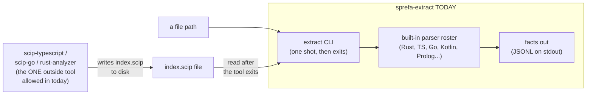
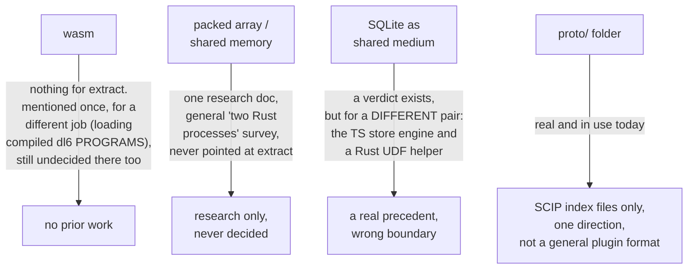
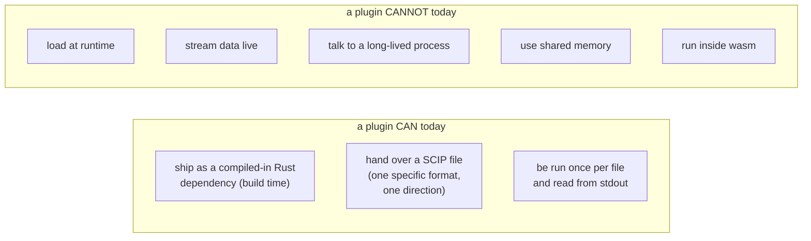

# Where the extract-plugin ABI question stopped

**One sentence: nobody built or decided anything here yet. Two general "how
do Rust processes talk to each other" research docs exist, and a separate
"SQLite UDF sidecar" verdict exists for a different part of the system, but
none of them ever got pointed at sprefa-extract.**

## The picture today

No daemon. No socket. No shared memory. No wasm. The only outside tool that
gets to hand data to this Rust process today is a SCIP indexer, and it does it
the plainest way possible: run the tool, let it finish, read the file it left
behind.

## Why the question came up

The dl6 grammar (the parser for our own `.dl6` language) is now mostly
machine-generated from the Prolog parser. If that generated grammar is ever
used by `sprefa-extract`, something not written in Rust has to get its output
into a Rust process. That's the boundary the user is asking about. Four
things were named as possible ways to cross it: wasm, a packed array over
shared memory, SQLite as the shared thing, or whatever `proto/` already is.

## What each candidate has behind it

Plain version of each row:

- **wasm**: nothing written for extract. The one place wasm shows up at all is
  a parked, undecided note about a completely different question (how a
  *compiled dl6 program* gets loaded at runtime, not how a plugin talks to
  extract).
- **shared memory / packed array**: one research document compares shared-
  memory options for "two Rust processes on one machine" in general. It never
  mentions extract by name and nothing was decided from it.
- **SQLite as shared medium**: there IS a finished verdict, but it's about a
  different pair of processes: the TypeScript store engine and a small Rust
  helper that owns the SQLite connection and can register functions the store
  can't. It proves the pattern "a Rust process is the one that owns SQLite
  and something else's results ride through it" works somewhere in this repo.
  It was never applied to extract.
- **`proto/`**: this one is real. It's the SCIP protobuf format. Extract
  already lets three outside tools (a TypeScript indexer, a Go
  indexer, and rust-analyzer) hand it data, but only in one shape: they write
  a `.scip` file, and extract reads it after they're done. That's not a
  general plugin channel. It only understands SCIP's own vocabulary, not
  extract's own fact format.

## The gap, plainly

## What this recon did NOT do

It did not pick a transport. It did not rank wasm against shared memory
against SQLite. It did not design anything. Those are the next arc's job, and
the repo's rule is that library research and a written candidate comparison
come first, and that hasn't happened yet either.
