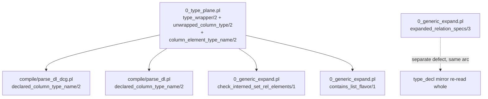

# option(list(<rel>)) and option(<rel>) via generic wrapper walking

Base `48fadfb3`. Branch `worktree-agent-a1237a7d94bba8cfe`. Every number below is
tool output from this worktree.

## TOC
1. [What landed](#1-what-landed)
2. [The wrapper-peeling site inventory](#2-the-wrapper-peeling-site-inventory)
3. [The one walk, and why it terminates](#3-the-one-walk-and-why-it-terminates)
4. [The mirror: one read, not two special cases](#4-the-mirror-one-read-not-two-special-cases)
5. [Fixture table, both directions](#5-fixture-table-both-directions)
6. [pokeapi G1 is still 12, and why](#6-pokeapi-g1-is-still-12-and-why)
7. [Fell out as a side effect](#7-fell-out-as-a-side-effect)
8. [Gate output](#8-gate-output)

---

## 1. What landed



Two spellings stopped for two unrelated reasons. Both were bookkeeping.

| spelling | base 48fadfb3 | after |
|---|---|---|
| `option(list(<rel>))` | `column_type_unknown(<rel>)` | COMPILES |
| `option(<rel>)` on a rel used as a reference target | `column_type_unknown(option(<rel>))` | COMPILES |
| `option(list_entity_dense_sequence(<rel>))` | `column_type_unknown(<rel>)` | COMPILES |
| `option(list_entity_linked_sequence(<rel>))` | `column_type_unknown(<rel>)` | COMPILES |
| `option(list_interned_set(<rel>))` | `column_type_unknown(<rel>)` | `list_interned_set_relation_element(<rel>)`, the term the bare spelling already threw |

Files touched: `v6/prolog/0_type_plane.pl`, `v6/prolog/0_generic_expand.pl`,
`v6/prolog/compile/parse_dl.pl`, `v6/prolog/compile/parse_dl_dcg.pl`,
`v6/prolog/conformance/fixtures/14_option_wrapper_walk.pl` (new),
`v6/prolog/compile/test/plunit_tests.pl`. Converter receipts in
`v6/tsv2/scripts/openapi_to_dl6.ts`, `v6/tsv2/scripts/openapi_roundtrip_check.ts`,
`v6/tsv2/tests/openapiToDl6.test.ts` (section 6 states why).

## 2. The wrapper-peeling site inventory

Confirmed by reading, not by trusting the brief's list.

| site | file:line on base | what it peeled on base | after |
|---|---|---|---|
| `list_element_type_name/2` | `compile/parse_dl_dcg.pl:641-646` | the four list flavors via `list_type_word/1` (`:637-639`), never `option` | DELETED; calls `column_element_type_name/2` |
| `list_type_word/1` | `compile/parse_dl_dcg.pl:637-639` | the wrapper-word table for both the grammar (`:450`) and the walk | DELETED; `type_wrapper/2` is the one table, and `type_base//1` reads it (`:451`) |
| `list_element_type_name/2` | `compile/parse_dl.pl:1052-1060` | the same four flavors, one clause each | DELETED; calls `column_element_type_name/2` |
| `declared_column_type_name/2` | `compile/parse_dl_dcg.pl:623-635`, `compile/parse_dl.pl:1029-1050` | the caller that decides which rel names get a `type_decl/2` mirror | unchanged shape, one call site retargeted in each door |
| `check_interned_set_rel_elements/1` | `0_generic_expand.pl:55-61` | nothing: matched `col_type(_, _, list_interned_set(Element))` literally, so `option(...)` hid the element | reads `unwrapped_column_type/2` |
| `contains_list_flavor/1` | `0_generic_expand.pl:95-96` | `option` only, one clause | reads `unwrapped_column_type/2` |
| `generic_dependency/2` | `0_generic_expand.pl:98-101` | `option` only | LEFT ALONE, see below |
| `list_element_type/2` | `0_type_plane.pl:135-140` | `json_list` element ADMISSIBILITY, not a name walk | unchanged |
| `column_storage/3` | `0_type_plane.pl:115-128` | dispatches on the storage kind; peels nothing | unchanged |
| `scalar_element/1` | `0_option_expand.pl:51-55` | a 5-element scalar table; peels nothing | unchanged |
| `retarget_type_decl_mirror/3` | `0_generic_expand.pl:257-268` | not a peel at all: a per-spec patch | rewritten, section 4 |
| `columnRelRefs/2` | `v6/tsv2/scripts/openapi_to_dl6.ts:399-404` | `option`/`list` to any depth, by regex | unchanged; it is the TS side of the same idea and it got there first |

`generic_dependency/2` is deliberately not folded into the walk. Its `option`
clause looks like the same peel, and unifying it as
`generic_dependency(Type, I) :- unwrapped_column_type(Type, I), list_flavor(I).`
would make `list(list(int))` report BOTH instances in pass 1 instead of finding
the inner one on the fixpoint's second pass (`0_generic_expand.pl:66-78`). Same
final decl set, different mint ORDER, and `generic_artifact_order/3` puts minted
decls after author decls in discovery order, so the emitted DDL order moves.
`TEXT_DOOR byte_identical` is the gate that would catch it and there is no gain
to pay for the risk.

## 3. The one walk, and why it terminates

`v6/prolog/0_type_plane.pl:145-169`, exported as `type_wrapper/2`,
`unwrapped_column_type/2`, `column_element_type_name/2`.

```prolog
type_wrapper(option, endpoint).
type_wrapper(list, value).
type_wrapper(list_entity_dense_sequence, value).
type_wrapper(list_interned_set, value).
type_wrapper(list_entity_linked_sequence, value).

unwrapped_column_type(Type, Type).
unwrapped_column_type(Type, Inner) :-
    compound(Type),
    Type =.. [Wrapper, Element],
    type_wrapper(Wrapper, _),
    unwrapped_column_type(Element, Inner).

column_element_type_name(Name, Name) :- atom(Name).
column_element_type_name(Type, Name) :-
    unwrapped_column_type(Type, Inner),
    Inner =.. [Wrapper, Name],
    type_wrapper(Wrapper, value),
    atom(Name).
```

### Termination

`unwrapped_column_type/2` clause 2 recurses on `Element`, which is a strict
subterm of the compound `Type`, so the term depth of the first argument
strictly decreases at every step. Clause 1 is the base case at every depth. A
`.dl6` column type is a finite ground tree: the parser builds it from text
(`parse_dl_dcg.pl:449-453`, `parse_dl.pl:697-744`, both bottoming out at
`ident/1`), and `check_ground_generic/1` (`0_generic_expand.pl:110-113`) rejects
a non-ground one by name, so no rational-tree cycle can reach the walk. A
compound that no `type_wrapper/2` row names (`json_list(int)`, or any arity
other than 1) matches no recursive clause and the walk stops with the term
itself as its only answer.

Receipt: plunit `type_wrapper_walk:walk_terminates_on_deep_nesting`,
`option(list(option(list(list(span)))))` yields exactly 6 answers ending in
`span`.

### Why the second argument of `type_wrapper/2` exists

The first attempt made `column_element_type_name/2` a plain leaf walk. It went
green on every probe AND turned `TEXT_DOOR` red at 270/272, because a rel named
only under a bare `option` started getting a `type_decl/2` mirror it never had.
Measured diff for `generic_expansion_end_to_end`, term door vs text door:

```
> export const STRUCT_TYPES: readonly IStructTypePlan[] = [
>   { name: "person", columns: ["id", "name"], ... intern_sql: ... },
> ];
< `CREATE TABLE "person" ("id" INTEGER NOT NULL, "name" INTEGER NOT NULL, PRIMARY KEY ("id")) WITHOUT ROWID`,
> `CREATE TABLE "person" ("__id" INTEGER PRIMARY KEY, "id" INTEGER NOT NULL, "name" INTEGER NOT NULL, UNIQUE ("id"))`,
> `CREATE TEMP VIEW "__ref_person" AS ... json_object('id', ...) AS "__rendered" FROM "person" t`,
```

That is a whole storage plane appearing for a rel nothing stores in a column.
The mirror's job is to describe a rel that lands in COLUMN position, and the
wrappers differ on exactly that:

| wrapper | artifact it mints | where the rel element lands |
|---|---|---|
| `list`, `list_entity_dense_sequence`, `list_interned_set`, `list_entity_linked_sequence` | `col_type(Member, value, Element)`, `0_generic_expand.pl:130` and siblings | a COLUMN typed by the element |
| `option` | `col_type(Companion, <Element>_id, int)`, `0_option_expand.pl:119-126` | an INTEGER id endpoint |

So `option(list(span))` reaches `span` (through the member's `value`),
`option(span)` does not, and `list(option(span))` does not either, because the
member's value column is `option(span)` and the option desugar then splits the
member. All three verdicts match what base already did for the two spellings it
accepted.

`json_list/1` is absent from the table on purpose. Its element domain is the
closed set `list_element_type/2` admits (`0_type_plane.pl:135-140`), never a rel
name, and walking through it flips `json_list(<rel>)` from
`list_element_not_scalar(<rel>)` to `list_of_relation_refs(<rel>)`. Both terms
are reachable on base depending on whether the element rel has a mirror from
somewhere else; probes p10 and p11 hold both, unchanged.

## 4. The mirror: one read, not two special cases

`0_generic_expand.pl:257-274`. Base:

```prolog
retarget_type_decl_spec(RelName, Decls, col(Column, _), col(Column, Type)) :-
    memberchk(col_type(RelName/_, Column, RewrittenType), Decls),
    mirror_column_type(Decls, RewrittenType, Type), !.
retarget_type_decl_spec(_, _, Spec, Spec).
```

A spec whose column was DELETED by `desugar_reference_option`
(`0_option_expand.pl:84-92`, `exclude/3` at `:87`) fell through the second
clause unchanged, and the mirror kept the raw `option(<rel>)` that no rel
declares. `mirror_column_type/3` had a clause for the enum RENAME and none for
a deletion.

Rename and deletion are one operation, and the operation is not "patch a spec".
The mirror STATES the rel's stored columns, so it is re-read whole from the
expanded `col_type` rows, which is exactly `relation_schema/4`
(`parse_dl_dcg.pl:617-621`) run a second time after expansion:

```prolog
retarget_type_decl_mirror(Decls, type_decl(RelName, Specs0),
                          type_decl(RelName, Specs)) :-
    !,
    (   expanded_relation_specs(Decls, RelName, Rebuilt)
    ->  Specs = Rebuilt
    ;   Specs = Specs0 ).

expanded_relation_specs(Decls, RelName, Specs) :-
    once(member(col_type(RelName/Arity, _, _), Decls)),
    findall(col(Column, Type),
            ( member(col_type(RelName/Arity, Column, Stored), Decls),
              mirror_column_type(Decls, Stored, Type) ),
            Specs),
    length(Specs, Arity).
```

Receipt: plunit `type_wrapper_walk:mirror_follows_a_deletion_and_a_rename`, one
program with `reviewed_by: option(person)` (deletion) and `title: option(text)`
(rename) on the same rel, asserting the mirror becomes
`[col(id,int), col(title,int)]` and `commit__reviewed_by/2` exists.

### The case this does NOT cover, and it is a design question

A rel whose EVERY column is a reference option shrinks to arity 0, so
`expanded_relation_specs/3` finds no `col_type` row and the stale mirror
survives, which stops as before. Adding the obvious clause (`option_column/3`
survives the desugar and is the expansion's own record, so the empty mirror is
derivable) makes the compile FAIL SILENTLY somewhere after
`check_clock_program/1`, with no ball. Measured with probe p37:

| phase | verdict with the empty mirror |
|---|---|
| `check_reserved_namespace/1` | ok |
| `expand_program_with_bindings/4` | ok, mirror = `type_decl(pair_holder, [])` |
| `materialize_reference_target_rels/2` | ok |
| `materialize_catalog_rel/2` | ok |
| `check_supported_subset_expanded/1` | ok |
| `check_clock_program/1` | ok |
| `compile_dl6/2` overall | GOAL FAILED, no ball |

The clause was reverted. A silent goal failure is worse than the named stop it
replaced, and the shape underneath is a real design question rather than
unfinished work: `0_type_plane.pl:27-28` says target identity is `key(...)`
with FULL-ROW identity as the unkeyed fallback, and a zero-column row has no
full-row identity, so every row of such a rel is the same row and its companion
split rels cannot attach to distinct parents. Same rel WITHOUT the ref-target
use compiles green (probe p34): the 0-arity rel itself is fine, it is being
POINTED AT that has no answer. Fork for the user, section 6.

## 5. Fixture table, both directions

`v6/prolog/conformance/fixtures/14_option_wrapper_walk.pl`, 8 fixtures. Each
stopping fixture states its term.

| fixture | spelling | expected | measured base 48fadfb3 |
|---|---|---|---|
| `option_list_of_rel_round_trips_absent_and_present` | `option(list(<rel>))` | COMPILES, squad 1 present + squad 2 absent, `fighter_summary` rows interned from the member values | `column_type_unknown(fighter_summary)` |
| `option_rel_on_a_reference_target_round_trips_absent_and_present` | `option(<rel>)` on a rel `audit.at_commit` points at | COMPILES, `commit__reviewed_by(101,7)` present and commit 102 absent | `column_type_unknown(option(person))` |
| `option_dense_sequence_of_rel_round_trips_absent_and_present` | `option(list_entity_dense_sequence(<rel>))` | COMPILES, absent + present | `column_type_unknown(fighter_summary)` |
| `option_list_of_scalar_and_of_rel_in_one_rel` | `option(list(<rel>))` beside `option(list(int))` | COMPILES, both companions | `column_type_unknown(fighter_summary)` |
| `option_of_json_list_keeps_its_stop` | `option(json_list(int))` | `unsupported_construct(option_element_type_unknown(json_list(int)))` | same term |
| `option_of_option_of_scalar_keeps_its_stop` | `option(option(int))` | `unsupported_construct(option_element_type_unknown(option(int)))` | same term |
| `option_list_of_unknown_name_keeps_its_stop` | `option(list(<undeclared>))` | `unsupported_construct(column_type_unknown(fighter_summry))` | same term |
| `option_of_interned_set_of_rel_is_refused` | `option(list_interned_set(<rel>))` | `unsupported_construct(list_interned_set_relation_element(fighter_summary))` | `column_type_unknown(fighter_summary)`, DIFFERENT |

The last row is the one thrown term this arc deliberately moves. On base the
option wrapper hid the rel element from `check_interned_set_rel_elements/1`, so
the interned-set ban never fired and the spelling stopped later with the generic
unknown-column term. The bare spelling `list_interned_set(<rel>)` already threw
`list_interned_set_relation_element` (`10_list_elements.pl:135`, probe p26), so
the option spelling now agrees with it instead of contradicting it.

### The full probe matrix, base vs after

39 one-program probes, run through `compile_dl6/2`, ball printed verbatim.

| # | program | base | after |
|---|---|---|---|
| p01 | `option(list(<rel>))` | THROW `column_type_unknown(span)` | **OK** |
| p02 | `option(<rel>)` on a ref target | THROW `column_type_unknown(option(lang))` | **OK** |
| p03 | `option(<rel>)`, parent not a ref target | OK | OK |
| p04 | `option(list(int))` | OK | OK |
| p05 | `option(list(text))` | OK | OK |
| p06 | `list(<rel>)` | OK | OK |
| p07 | `list(int)` | OK | OK |
| p08 | `json_list(int)` on a ref target | OK | OK |
| p09 | `option(json_list(int))` | THROW `option_element_type_unknown(json_list(int))` | same |
| p10 | `json_list(<rel>)`, element has no mirror | THROW `list_element_not_scalar(span)` | same |
| p11 | `json_list(<rel>)`, element also a bare ref | THROW `list_of_relation_refs(span)` | same |
| p12 | `option(<undeclared>)` | THROW `option_element_type_unknown(nosuch)` | same |
| p13 | bare `<undeclared>` | THROW `column_type_unknown(nosuch)` | same |
| p14 | `option(option(int))` | THROW `option_element_type_unknown(option(int))` | same |
| p15 | `list(list(int))` | OK | OK |
| p16 | `option(list(option(<rel>)))` | OK | OK |
| p17 | `option(option(list(<rel>)))` | THROW `option_element_type_unknown(option('__gen__list_span_45c70c9ce112d515'))` | same |
| p18 | `list(option(<rel>))` | OK | OK |
| p19 | `option(list(<rel>))` on a ref target | THROW `column_type_unknown(tag)` | **OK** |
| p20 | `option(list_entity_dense_sequence(<rel>))` | THROW `column_type_unknown(span)` | **OK** |
| p21 | `option(list_interned_set(<rel>))` | THROW `column_type_unknown(span)` | THROW `list_interned_set_relation_element(span)` |
| p22 | `option(<enum>)` | THROW `option_of_enum_unsupported(grade)` | same |
| p23 | `option(<rel>)` two ref-target hops | THROW `column_type_unknown(option(lang))` | **OK** |
| p24 | two `option(<rel>)` columns on one ref target | THROW `column_type_unknown(option(lang))` | **OK** |
| p25 | `option(int)` on a ref target | OK | OK |
| p26 | `list_interned_set(<rel>)` bare | THROW `list_interned_set_relation_element(span)` | same |
| p27 | `list_entity_dense_sequence(<rel>)` bare | OK | OK |
| p28 | `list_entity_linked_sequence(<rel>)` bare | OK | OK |
| p29 | `option(list_entity_linked_sequence(<rel>))` | THROW `column_type_unknown(span)` | **OK** |
| p30 | `key()` spelling probe, malformed | THROW `dl_parse_error(statement, position(2,58))` | same |
| p31 | `option(list(<rel>))` + a rule over the shrunk parent | THROW `column_type_unknown(span)` | **OK** |
| p32 | `option(<rel>)` on a ref target + a rule over the companion | THROW `column_type_unknown(option(lang))` | **OK** |
| p33 | ref target, no option anywhere | OK | OK |
| p34 | every column an `option(list(<rel>))`, parent not a ref target | THROW `column_type_unknown(first_shape)` | **OK** |
| p35 | same, parent IS a ref target | THROW `column_type_unknown(first_shape)` | THROW `column_type_unknown(option(list(first_shape)))` |
| p36 | one plain column + two `option(list(<rel>))`, ref target | THROW `column_type_unknown(first_shape)` | **OK** |
| p37 | every column an `option(<rel>)`, parent IS a ref target | THROW `column_type_unknown(option(first_shape))` | same |
| p38 | element rel name == option companion name, ref target | THROW `column_type_unknown(option(pair_holder__before))` | THROW `rel_arity_collision(pair_holder__before,1,2)` |
| p39 | element rel name == option companion name, no ref target | THROW `rel_arity_collision(pair_holder__before,1,2)` | same |

p38 is the one case where a stop that was masked becomes visible: on base the
mirror gap fired first, and with the mirror fixed the collision underneath
reports itself. p39 proves the collision is pre-existing and independent of this
arc.

## 6. pokeapi G1 is still 12, and why

`cd v6/tsv2 && npx tsx scripts/openapi_roundtrip_check.ts` prints
`Converter strict-mode dropped columns (G1): 12`. The brief's receipt was 0.
The two spellings the user ruled on are both legal now; two OTHER things hold
the count, and neither is inside this lane's decided scope.

### Blocker A: the converter's lifted rel name IS the option companion's name

| naming rule | source |
|---|---|
| converter lifts an inline object to `<parent>__<prop>` | `openapi_to_dl6.ts:371` `liftObject` |
| the reference-option desugar mints its companion as `<parent>__<column>` | `0_option_expand.pl:123` `companion_rel_decls/4` |

Every nullable lifted-object property therefore declares one name at two
arities, and the program stops with
`unsupported_construct(rel_arity_collision(<parent>__<prop>, 1, 2))`. Measured
over `v6/dl/fixtures/pokeapi.openapi.yml`: **12 of 12** dropped columns are this
shape.

```
move_detail__contest_combos__normal.use_before: option(list(move_detail__contest_combos__normal__use_before))
                                                          ^ the element rel                    ^ and the companion rel
```

Receipt, hand-built probe = the exact program the converter's probe writes:

```
$ swipl -q -l compile.pl -g "catch(compile_dl6('manual_probe2.dl6', ...), E, format('BALL ~q~n',[E]))"
BALL unsupported_construct(rel_arity_collision(pokemon_form_detail__trigger_conditions__base_form,1,2))
```

Rename the element rel and the SAME program compiles (`manual_probe3.dl6`,
`wrote .../manual_probe3.out.ts`).

Measured what a converter rename is worth: patching `liftObject` to
`` `${parent}__${columnName(prop)}_shape` `` and reading `gapList` gives
**12 -> 4**. The patch was reverted; nothing from it is in the tree.

The companion name is the RULED surface, not a free choice: authors write
`review__reviewer(Id, PersonId)` in rule bodies (`0_generic_expand.pl` fixture
`generic_expansion_end_to_end`, `0_option_type.pl:71-73`), and ruling
`option_surface` owns it. So the rename belongs on the converter side, in
`v6/tsv2/scripts/openapi_to_dl6.ts`, which this lane does not own. It also
changes every lifted rel name in the tracked artifact
`v6/tsv2/gen/pokeapi_gen.dl6`. **Coordinator's call.**

Second, smaller call: the compiler reports this collision as
`rel_arity_collision`, a term that names neither the option desugar nor the
column. `0_generic_expand.pl:201-212 validate_generated_name_collisions/3`
already does exactly this check for generic-minted names and throws
`generic_generated_name_collision(Name)`. The option expansion has no
counterpart. Adding one is a named-stop improvement, not a gap closure.

### Blocker B: a reference target whose every column is a reference option

The 4 remaining after a rename are
`move_detail__contest_combos__normal` and `__super`:

```
rel move_detail__contest_combos__normal(use_before: option(list(...)), use_after: option(list(...))).
rel move_detail__contest_combos(normal: move_detail__contest_combos__normal, super: ...).
```

Both columns move to companion split rels, the parent shrinks to zero columns,
and it is a reference target. Section 4 states why that has no answer today:
identity falls back to the full row, and a zero-column row is the same row every
time. This is language design and goes to the user, not to a patch.

| fork | what it stores | cost | what changes |
|---|---|---|---|
| B-a keep the stop, name it | unchanged | zero | a named stop in place of `column_type_unknown(option(list(...)))`, which reads as "a rel that exists is unknown" |
| B-b a zero-column ref target takes `__id` as its identity | the dense `__id` is already there | every arrival mints a new row; no dedup, no content identity, and the ruling that target identity is `key(...)` or the full row (`0_type_plane.pl:27-28`) gets a third case | `0_type_plane.pl` identity rule, the intern path, and every render that assumes at least one column |
| B-c the converter never lifts a wrapper-only object | pokeapi's 4 columns keep `list(<rel>)` and lose only their nullability | one converter rule; no compiler change | `openapi_to_dl6.ts` |

### What DID move

| | before this arc | after |
|---|---|---|
| G1 drops | 12 | 12 |
| of which caused by `option(<rel>)` / `option(list(<rel>))` themselves | 12 | **0** |
| of which caused by the rel-name collision | 0 | 12 |
| tsv2 `openapiToDl6` tests | 7 | 8, all pass |

`v6/tsv2/tests/openapiToDl6.test.ts:118` `strict drops only the ref-target
column the compiler stops on` turned RED from this arc, because the doc it uses
now compiles. It was replaced by two tests, each with a `compile_dl6.sh`
receipt: one keeps `option(<rel>)` with an empty gap list, one drops the case
that really stops (a nullable INLINE object whose lifted name collides). The
gap-row attribution `(0_program_check.pl:342)` was also dropped: every row it
printed is the collision, which stops as `rel_arity_collision` somewhere else
entirely.

## 7. Fell out as a side effect

| finding | evidence |
|---|---|
| `option(list_interned_set(<rel>))` used to bypass the interned-set ban entirely | probe p21 base vs after; the ban's own fixture `10_list_elements.pl:127-136` |
| `option(<rel>)` on a rel that is BOTH a reference target and `key(...)`-keyed loses its key when `print_dl.pl` renders it | text-door diff, `rel commit(id: int, reviewed_by: option(person)).` printed with no `key(1)` while its sibling `rel person(id: int, name: text) key(1).` kept one. Worked around by dropping `keyed/2` from the fixture; `print_dl.pl` is not this lane's file |
| `rel_arity_collision` between an author rel and the option companion is pre-existing and needs no ref target | probe p39, base and after identical |
| the brief's claim that `columnRelRefs` peels in the Prolog doors' image was right, and `plans/2026-08-11-pokeapi-generic-nesting.md:444` is the only place in the tree that names it | `rg columnRelRefs` finds it at `openapi_to_dl6.ts:399` and in that plan line |

## 8. Gate output

### Named gates, verbatim

```
$ cd v6 && just conformance
372 PASS 0 FAIL on base; 380 PASS 0 FAIL with the 8 new fixtures

$ cd v6 && just roundtrip
=== G1 ROUND-TRIP ===
G1 round-trip: 380 / 380 fixtures pass
G1: ALL PASS
G2: NO PARSE ERRORS

$ cd v6 && just text-door
TEXT_DOOR compiled=276 byte_identical=276 failures=0

$ cd v6 && just parse-parity
PARSE_PARITY mode=classic-vs-dcg total=699 parity=699 skips=0 diffs=0

$ cd v6 && just plunit
% [144/604] catalog_plane_rai..amily_corpus_counts .. **FAILED (1.103 sec)
ERROR: [Thread main] 1 test failed

$ cd v6 && just typecheck
(clean)

$ cd v6/tsv2 && npx tsx --test tests/openapiToDl6.test.ts
tests 8 / pass 8 / fail 0

$ cd v6/tsv2 && npx tsx scripts/openapi_roundtrip_check.ts
Converter strict-mode dropped columns (G1): 12; nullable-array drops (G2): 0
ROUNDTRIP PASS: componentName:212 propName:786 kind:786/0/0 refTarget:257/0/0 nullable:786/0/0
```

`plunit` is RED ON BASE at the same single test,
`catalog_plane_rail:level_plane_family_corpus_counts`
(`plunit_tests.pl:1312`), confirmed by the brief and reproduced here before any
edit. 604 tests now, 598 on base, +6 from the `type_wrapper_walk` unit.

### plunit fail-first receipt

With the four source files checked out at `48fadfb3` and the test file kept:

```
% [1/6] type_wrapper_walk.._stores_its_element .... **FAILED
% [2/6] type_wrapper_walk.._in_column_position .... **FAILED
% [3/6] type_wrapper_walk..wers_no_column_name .... **FAILED
% [4/6] type_wrapper_walk..st_is_not_a_wrapper .... **FAILED
% [5/6] type_wrapper_walk..tes_on_deep_nesting .... **FAILED
% [6/6] type_wrapper_walk..letion_and_a_rename .... **FAILED
ERROR: [Thread main] 6 tests failed
```

### green-all delta

See section 8b, filled from the two runs (this tree, then the same tree with the
diff stashed).
