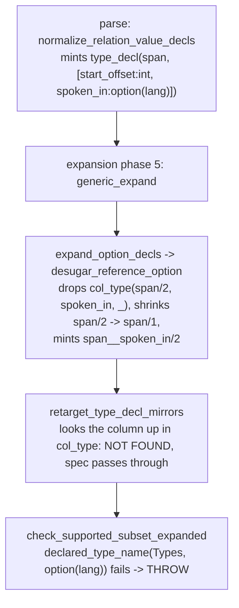

# pokeapi G1/G2: generic columns on nested ref targets

Base `b580d627`. Every number below is tool output from this worktree.

## TOC
1. [Three repros, verbatim terms and phases](#1-three-repros)
2. [Phase-order hypothesis: confirm or kill](#2-phase-order-hypothesis)
3. [29 vs 75+4](#3-29-vs-754)
4. [Fork tables](#4-fork-tables)
5. [Gate output](#5-gate-output)
6. [What landed](#6-what-landed)

---

## 1. Three repros

The report's G1 sentence ("the compiler refuses a rel that is itself a ref
TARGET while carrying generic option()/list() columns",
`v6/dl/fixtures/POKEAPI_ROUNDTRIP_REPORT.md:12`) is FALSE as written. Measured
matrix, one `.dl6` file per row, `compile_dl6.sh` on base:

| # | program | verdict |
|---|---|---|
| 1 | `rel span(start_offset: int, end_offset: option(int)).` + `rel finding(path: text, at: span).` | GREEN |
| 2 | `rel span(start_offset: int, tag_ids: list(int)).` + `rel finding(path: text, at: span).` | GREEN |
| 3 | `rel span(start_offset: int, tag_ids: json_list(int)).` + `rel finding(path: text, at: span).` | GREEN |
| 4 | `rel span(start_offset: int, extra: option(json)).` + `rel finding(path: text, at: span).` | GREEN |
| 5 | `rel lang(code_name: text).` + `rel span(start_offset: int, spoken_in: list(lang)).` + `rel finding(path: text, at: span).` | GREEN |
| 6 | span carries `option(int)`, used as `list(span)` element | GREEN |
| 7 | span carries `list(int)`, used as `option(span)` element | GREEN |
| 8 | span carries `json_list(int)`, used as `list(span)` element | GREEN |
| **R1** | `rel lang(code_name: text).` + `rel span(start_offset: int, spoken_in: option(lang)).` + `rel finding(path: text, at: span).` | **THROW** |
| **R2** | `rel span(start_offset: int, end_offset: int).` + `rel finding(path: text, spans: option(list(span))).` | **THROW** |
| **R3** | `rel finding(path: text, tag_ids: option(json_list(int))).` | **THROW** |

Only three shapes stop. Every other generic-column-on-a-ref-target spelling in
the matrix compiles today.

### R1 `option(<rel>)` on a rel used as a ref target

```
rel lang(code_name: text).
rel span(start_offset: int, spoken_in: option(lang)).
rel finding(path: text, at: span).
```

Thrown term, verbatim:

```
unsupported_construct(column_type_unknown(option(lang)))
```

Phase: `check_supported_subset_expanded/1` (`v6/prolog/compile.pl:179`), class
`column_type_unknown` (`v6/prolog/analyze.pl:1167`), predicate
`program_violation(column_type_unknown, ...)`
(`v6/prolog/0_program_check.pl:342-347`). NOT `column_storage/3` at
`0_type_plane.pl:128`: an env-gated backtrace probe placed on that clause never
fires for this program; the probe on `0_program_check.pl:347` prints
`PROBE program_check option(lang)` and the ball follows.

Decl state at the moment of the stop (dumped after `expand_program/3`):

```
type_decl(span, [col(start_offset,int),col(spoken_in,option(lang))])
col_type(lang/1, code_name, text)
col_type(span/1, start_offset, int)
col_type(finding/2, path, text)
col_type(finding/2, at, span)
col_type(span__spoken_in/2, span_id, int)
col_type(span__spoken_in/2, lang_id, int)
```

The rel shrank to `span/1` with companion `span__spoken_in/2`; the `type_decl/2`
mirror still carries the pre-shrink `option(lang)` spec.

### R2 `option(list(<rel>))`

```
rel span(start_offset: int, end_offset: int).
rel finding(path: text, spans: option(list(span))).
```

Thrown term, verbatim:

```
unsupported_construct(column_type_unknown(span))
```

Phase: same site, `0_program_check.pl:342-347`. The whole generic + option
expansion SUCCEEDS; the minted decls are complete:

```
col_type('__gen__list_span_45c70c9ce112d515'/1, id, int)
col_type('__gen__list_span_45c70c9ce112d515__member'/3, list_id, int)
col_type('__gen__list_span_45c70c9ce112d515__member'/3, idx, int)
col_type('__gen__list_span_45c70c9ce112d515__member'/3, value, span)
col_type(finding__spans/2, finding_id, int)
col_type(finding__spans/2, '__gen__list_span_45c70c9ce112d515_id', int)
```

`type_definitions/2` returns `[]` for this program: no `type_decl(span, ...)`
was ever minted, so the minted member rel's `value: span` column names a rel
with no schema mirror.

Compare the same program with the option removed (`spans: list(span)`), which
compiles: there `type_decl(span, [col(start_offset,int),col(end_offset,int)])`
IS minted and `column_storage(Types, span, ref(span))` resolves.

### R3 `option(json_list(_))`

```
rel finding(path: text, tag_ids: option(json_list(int))).
```

Thrown term, verbatim:

```
unsupported_construct(option_element_type_unknown(json_list(int)))
```

Phase: expansion phase 5 (`v6/prolog/1_expansion.pl:26`), inside
`desugar_option_column/5` (`v6/prolog/0_option_expand.pl:27-49`), final else-arm
at line 48. Parse succeeds; the program never reaches the checks.

---

## 2. Phase-order hypothesis

**CONFIRMED for R1 and R2, with two different mechanisms. KILLED for R3.**

### The parser door, first, because it changes every citation

`v6/prolog/use_resolve.pl:28-29`:

```prolog
:- ( getenv('DL_PARSER', 'classic') -> set_prolog_flag(dl_parser, classic)
   ; set_prolog_flag(dl_parser, dcg) ).
```

The DEFAULT parser is `compile/parse_dl_dcg.pl`, not `compile/parse_dl.pl`.
CLAUDE.md's "`parse_dl.pl` is the real surface (text door)" is stale, and the
brief's citation `parse_dl.pl:834` points at the classic door. Both doors carry
the same two gaps; the numbers below cite both.

### R1: the mirror cannot follow an arity shrink



| step | file:line |
|---|---|
| `type_decl/2` minted at parse | `compile/parse_dl_dcg.pl:597-615`; classic `compile/parse_dl.pl:992-1010` |
| option desugar runs later, at expansion phase 5 | `1_expansion.pl:26` |
| the option column is EXCLUDED from col_type and the parent arity shrinks | `0_option_expand.pl:84-92`, `exclude/3` at line 87 |
| the mirror rewrite only fires when the column still exists in col_type | `0_generic_expand.pl:264-267`, `memberchk` at line 265 |
| missing column falls through unchanged | `0_generic_expand.pl:268` |
| the stop | `0_program_check.pl:342-347` |

Same shape as `ARCH.pl:930 enum_column_type_erased`: a mirror minted by the
parser, a rewrite that happens after. Difference: the enum case is a RENAME and
`mirror_column_type/3` (`0_generic_expand.pl:270-273`) already handles renames.
The option-over-rel case is a DELETION, and there is no clause for it.

Is the stop a real impossibility? No storage law forbids it. But the question
"what is the struct-value shape of a ref target whose column was shrunk out" has
no answer in the code, and each answer changes the wire contract. That is
language design, so it goes to fork F1 rather than getting a patch.

### R2: the element-name walk never peels `option`

`declared_column_type_name/2` reaches a LIST ELEMENT only through
`list_element_type_name/2`:

- DCG door: `compile/parse_dl_dcg.pl:637-646`. `list_type_word/1` (637-639)
  enumerates `list, list_entity_dense_sequence, list_interned_set,
  list_entity_linked_sequence`. No `option`.
- classic door: `compile/parse_dl.pl:1052-1060`. Four clauses, one per list
  flavor. No `option` clause.

So `list_element_type_name(option(list(span)), Name)` fails, `span` never enters
`ValueRelationNames`, and no `type_decl(span, ...)` is minted.

**Receipt that this is the whole blocker.** Adding one clause to the classic
door:

```prolog
list_element_type_name(option(Element), Name) :-
    list_element_type_name(Element, Name).
```

then `DL_PARSER=classic`:

| program | before | after |
|---|---|---|
| R2 `option(list(<rel>))` | THROW `column_type_unknown(span)` | **GREEN** |
| R1 `option(<rel>)` on ref target | THROW | THROW (unchanged) |
| R3 `option(json_list(int))` | THROW | THROW (unchanged) |
| 8 green matrix rows | GREEN | GREEN (unchanged) |

The probe was reverted; nothing from it is in the tree. Every downstream stage
already handles the shape: the companion split rel, the minted list + member
rels, and `ref(span)` storage on `member.value` all lower with no further
change. Pure mirror coverage, not a type-system question.

Not landed, for two reasons: (a) it mints a new accepted spelling, which is the
user's call, and (b) the real fix belongs in `parse_dl_dcg.pl`, which another
lane owns this session.

### R3: unfinished work with a naming problem, not phase order

`desugar_option_column/5` (`0_option_expand.pl:39-49`) admits exactly two
element families:

- `scalar_element/1` = `int, text, bool, float, json` (lines 51-55)
- `declared_rel_element/2`, which requires `atom(Element)` (lines 57-59)

`json_list(int)` is neither, so line 48 throws. Nothing about phase order is
involved; the clause set was never widened.

Widening it is not one clause. `option_enum_name/2` (lines 81-82) is
`atomic_list_concat(['__opt_', Element], EnumName)`, which for `json_list(int)`
produces the atom `'__opt_json_list(int)'`, and enum expansion then mints
variant rel names by concatenation, so a rel name carrying parentheses reaches
DDL. A mangling decision is required. Fork F3.

---

## 3. 29 vs 75+4

`sprefa-lanes/typedecl-mirror.FAILURE-REPORT.md:35-37` claims
`applyStrictFalls/1` "unconditionally rewrites generic columns on ref targets to
json". **Killed.** The pre-existing code at `openapi_to_dl6.ts:275` called
`probeRefTargets(candidates, byName)` and rewrote only members of the returned
`bad` set; `probeRefTargets` compiles one probe program per candidate through
`compile_dl6/2` and keeps the ones that pass.

The number explains itself. `probeRefTargets` was fail-closed on four paths
(`mkdtempSync` throw, `cp.error`, `cp.status !== 0`, catch-all), each of which
returns `new Set(candidates)`, i.e. EVERY candidate marked bad, i.e. every
generic column on every candidate rewritten to `json`.

Measured over `v6/dl/fixtures/pokeapi.openapi.yml`:

| quantity | count |
|---|---|
| ref targets | 271 |
| ref targets carrying generic columns (candidates) | 24 |
| generic columns summed over all 24 candidates | **75** |
| of those, `option(list(<rel>))` | 4 |

75 is exact. The mirror worktree's `75 + 4` is the signature of a probe
subprocess that never reported a pass, with the 4 nullable arrays counted under
its separate G2 tally. The likeliest trigger is that tree's own patched
`compile.pl` failing to load, making `cp.status !== 0` and tripping the
fail-closed return. The mirror fix did not raise the drop count; the probe
stopped answering.

My base reproduces the report's number exactly:

```
Converter strict-mode dropped columns (G1): 29; nullable-array drops (G2): 0 (option(list(..)) spelling emitted)
```

and the 29 decompose into three rels:

| rel | dropped | shape |
|---|---:|---|
| `evolution_chain_detail__chain__evolves_to__evolution_details` | 24 | 7 are `option(<rel>)`; the other 17 are `option(int)`/`option(text)`/`option(bool)`/`option(json)` collateral, dropped only because the whole rel was marked bad |
| `move_detail__contest_combos__normal` + `__super` | 4 | `option(list(<rel>))` |
| `pokemon_form_detail__trigger_conditions` | 1 | `option(<rel>)` |

---

## 4. Fork tables

No ranking. Every row is a decision for the user.

### F1. `option(<rel>)` on a rel used as a reference target

Closes 8 of the 12 remaining pokeapi drops.

| option | what it stores | what it costs | law it touches | what changes, where |
|---|---|---|---|---|
| F1-a mirror DROPS the shrunk column | unchanged: `span/1` + `span__spoken_in(span_id, lang_id)`, all INTEGER | zero storage change; one clause | none of the storage laws. The emitted JSON schema for the ref target LOSES a property, so an openapi round-trip's per-property name set stops matching | `0_generic_expand.pl:264-268`: add a clause that deletes a mirror spec whose column vanished from col_type |
| F1-b mirror carries the companion endpoint as `int` | same tables; the mirror says `col(spoken_in, int)` | zero storage change | breaks print-values-never-ids: the nested value's canonical JSON would render a dense id, the exact reason `0_type_plane.pl:129-134` gives for keeping ids out of lists | `0_generic_expand.pl:264-268` plus every render path in `0_type_plane.pl:649-668` |
| F1-c `option(<rel>)` becomes its own storage kind `opt_ref(Name)` | one NULLable INTEGER endpoint on the parent; no arity shrink, no companion rel | three-valued logic re-enters the parent table; every join over the column needs `IS NOT NULL`; deltas and frontier tables carry NULLs | contradicts the option design that chose the companion split precisely to keep NULLs out (`plans/2026-08-08-option-type-design.md`, ruling `option_surface`) | new `column_storage/3` clause in `0_type_plane.pl` before line 126, a bail-out arm in `0_option_expand.pl:44-47`, and a `lower.pl:ir_column_storage/5` row |
| F1-d keep the stop, name it properly | unchanged | zero | none | rename the stop to `option_ref_on_ref_target` with a located message in `0_program_check.pl` + `0_unsupported_messages.pl`; converter already drops only that column |

### F2. `option(list(<rel>))`

Closes the other 4 of the 12.

| option | what it stores | what it costs | law it touches | what changes, where |
|---|---|---|---|---|
| F2-a make it legal (peel `option` in the element walk) | identical to `list(<rel>)`, which is already legal: INTEGER list id, `__gen__list_<rel>(id)`, `__gen__list_<rel>__member(list_id, idx, value)` keyed `[1,2]` with `ref(<rel>)` on `value`, plus companion `parent__col(parent_id, list_id)`. Absent = missing companion row | one clause; measured GREEN end to end on the classic door | satisfies the surrogate-keys law: every key INTEGER, no composite TEXT key. Does NOT touch print-values-never-ids: that law is about `json_list(<rel>)`, the JSON carrier (`0_type_plane.pl:129-134`), and `list(<rel>)` is the relational flavor, already green | `compile/parse_dl_dcg.pl:637-639` add `option` to `list_type_word/1` (other lane owns the file this session); classic mirror `compile/parse_dl.pl:1052-1060` |
| F2-b make it legal from the expansion side instead | same as F2-a | one pass over the expanded decls; costs a mirror re-mint the parser could have done once | same | `0_generic_expand.pl:254`: have `retarget_type_decl_mirrors/2` also ADD a `type_decl/2` for any rel that ends up named in column position with no mirror |
| F2-c keep the stop | unchanged | 4 pokeapi columns stay on the json carrier and lose their element typing | none | rename the stop so it does not read as `column_type_unknown(<a rel that exists>)` |

### F3. `option(json_list(_))`

Closes 0 pokeapi drops. The converter emits `option(list(_))`, never
`option(json_list(_))`.

| option | what it stores | what it costs | law it touches | what changes, where |
|---|---|---|---|---|
| F3-a do not spell it | `json_list(T)` alone; `[]` is a value and is not absence (`0_type_plane.pl:98`) | zero | none | rename the stop to say "use `json_list(T)`; `[]` is not absence" |
| F3-b make it legal as a scalar option | `'__opt_json_list_t'` enum id on the parent, the array text in the enum's `some` payload | needs a name mangling for `json_list(int)` -> a legal rel name; `option_enum_name/2` currently yields the atom `'__opt_json_list(int)'` and enum expansion concatenates variant rel names from it, so parentheses reach DDL | none of the storage laws directly; the array-ness CHECK question at `0_type_plane.pl:108-114` moves under the enum payload column | `0_option_expand.pl:51-55` (`scalar_element/1`) and `0_option_expand.pl:81-82` (`option_enum_name/2`), plus the enum expansion's name minting |
| F3-c make it legal as a nullable json column | one TEXT column, NULL for absent, array text for present | three-valued logic on a json column; the two doors must agree on NULL vs `[]` in the tick log | the tick-log contract at `0_type_plane.pl:96-98` (storage IS the contract) now has two spellings of empty | `0_type_plane.pl` new storage kind, `lower.pl:column_def/3` |

---

## 5. Gate output

### Named gates

```
$ cd v6 && just conformance
372 PASS, 0 FAIL

$ cd v6 && just text-door
TEXT_DOOR compiled=272 byte_identical=272 failures=0

$ cd v6 && just plunit
% [144/598] catalog_plane_rai..amily_corpus_counts .. **FAILED (1.072 sec)
ERROR: [Thread main] /Users/chrishafley/projects/sprefa/.claude/worktrees/agent-ab605cc630a481ac3/v6/prolog/compile/test/plunit_tests.pl:1312:
ERROR: [Thread main]     test catalog_plane_rail:level_plane_family_corpus_counts: failed
ERROR: [Thread main] 1 test failed
error: recipe `plunit` failed on line 56 with exit code 1
```

`plunit` is RED ON BASE. Verified: `git stash` -> `just plunit` -> same single
failure at the same test -> `git stash pop`. Nothing in `v6/prolog/**` was
touched by this lane.

```
$ cd v6/tsv2 && npx tsx scripts/openapi_roundtrip_check.ts
Converter strict-mode dropped columns (G1): 12; nullable-array drops (G2): 0 (option(list(..)) spelling emitted)
ROUNDTRIP PASS: componentName:212 propName:786 kind:786/0/0 refTarget:257/0/0 nullable:786/0/0
real	0m8.617s
```

8.6s, inside the 10-second law. The per-column narrowing added two extra swipl
processes; the delta from the 7.8s base measurement is 0.8s.

```
$ cd v6/tsv2 && npx tsx --test tests/openapiToDl6.test.ts
ℹ tests 7
ℹ pass 7
ℹ fail 0
```

### green-all, this tree vs base, same machine, same session

```
$ cd v6 && just green-all
```

| leg | with this lane's diff | base `b580d627`, diff stashed |
|---|---|---|
| scale-floor | FAIL | FAIL |
| memory-soak | FAIL | FAIL |
| conformance | PASS | PASS |
| roundtrip | PASS | PASS |
| text-door | PASS | PASS |
| sweep | PASS | PASS |
| import-gate | PASS | PASS |
| staleness-gate | PASS | PASS |
| golden-flex | FAIL | FAIL |
| tsv2-test | FAIL | FAIL |
| getting-started | FAIL | FAIL |
| multirepo-golden | PASS | PASS |
| precommit-changed | PASS | PASS |
| endurance | PASS | PASS |
| flagship | FAIL | FAIL |
| store-test | PASS | FAIL |
| files | PASS | PASS |
| extraction-live | PASS | PASS |
| dl-test | PASS | PASS |
| serve-leak-soak | FAIL | FAIL |
| prolog-lint | PASS | PASS |
| serve-endurance | PASS | PASS |
| lsp-diags | FAIL | FAIL |
| compile-speed | FAIL | FAIL |
| plunit | FAIL | FAIL |
| typecheck | PASS | PASS |
| leak-soak | FAIL | FAIL |
| rtkq-golden | FAIL | FAIL |
| watch-scale | PASS | PASS |
| catalog-audit | PASS | PASS |
| ghcacher-golden | PASS | PASS |
| one-subscribe | PASS | PASS |
| **verdict** | GREEN ALL FAILED after 182s | GREEN ALL FAILED after 181s |

Zero legs turned red. `store-test` was red on base and passed with the diff,
which is ordering noise in a leg this lane does not touch.

Named causes for the pre-existing reds that printed one:

| leg | message |
|---|---|
| rtkq-golden | `missing release extractor: v6/sprefa-extract/target/release/extract` (unbuilt cargo binary in this worktree) |
| compile-speed | `COMPILE_SPEED regressions=16 improvements=0 FAIL`; `scripts/compile-speed-baseline.tsv` was written 2026-08-07, four days before this base |
| plunit | `catalog_plane_rail:level_plane_family_corpus_counts` |
| tsv2-test | `sh host: a grid answer is one row per line at every cardinality, 0 through 3` — `hostDecode.test.ts:144`, expected `[0,1,2,3]`, actual `[1,2,2,3]` |

The `tsv2-test` leg also carried a SECOND failure on base,
`openapiToDl6: strict drops a ref-target's generic columns with attribution`.
That one is fixed by this lane (section 6).

### Worktree setup this lane had to perform first

`v6/tsv2/node_modules` and `v6/sprefa-store/js/node_modules` were absent
(`Cannot find package 'yaml'`, `Cannot find package 'rxjs'`), and
`v6/tsv2/gen_emitted/` was empty. `pnpm install` in both packages plus
`bash v6/tsv2/scripts/sweep.sh` were needed before any tsv2 leg could run.

The roundtrip leg writes one untracked file,
`v6/prolog/compile/dl_view/option_list_column_roundtrips_null_and_present.dl6`.
It appears on base too, so the corpus has a fixture whose `dl_view` was never
committed. Not touched by this lane.

---

## 6. What landed

One file of behavior, one file of tests, two generated artifacts.

### `v6/tsv2/scripts/openapi_to_dl6.ts`

Strict mode used to drop EVERY generic column on a ref target the probe
rejected. It now probes per column: each generic column of a rejected rel is
compiled alone with its generic siblings rewritten to `json`, and only the
columns that still stop the compiler are dropped. A narrowed rel that still
fails falls back to the old whole-rel drop, so the change can never widen what
the converter emits.

`columnRelRefs/2` also now peels `option()`/`list()` to any depth, so an
`option(list(<rel>))` column's element gets a placeholder declaration in its
probe file instead of naming an undeclared rel; the ref-target scan in
`applyStrictFalls` reads through the same helper instead of three local regexes
that stopped at one wrapper. Gap rows now attribute the real stop,
`0_program_check.pl:342`, in place of `0_type_plane.pl:128`.

Gap count, same fixture, same command:

| | before | after |
|---|---:|---:|
| strict-mode dropped columns (G1) | 29 | **12** |
| of which `option(<rel>)` on a ref target | 8 | 8 |
| of which `option(list(<rel>))` | 4 | 4 |
| collateral drops on innocent columns | 17 | **0** |

The 17 recovered columns keep their real spelling in
`v6/tsv2/gen/pokeapi_gen.dl6`: `min_level: option(int)`,
`near_special_rock: option(bool)`, `used_move: option(json)`, and 14 more.

No new spelling was minted. Nothing in `v6/prolog/**` changed.

### `v6/tsv2/tests/openapiToDl6.test.ts`

The test `strict drops a ref-target's generic columns with attribution` was RED
on base: it asserted `rel item(price: json, kids: json, name: text)` for a doc
whose real output is `rel item(price: option(int), kids: list(kid), name: text)`,
and that program compiles green. Replaced by two tests, each carrying a
`compile_dl6.sh` receipt:

- `strict keeps a ref target's generic columns the compiler accepts` (the old
  doc, zero gaps, compiles)
- `strict drops only the ref-target column the compiler stops on` (an
  `option(<rel>)` sibling next to an `option(int)`; exactly one gap row)
