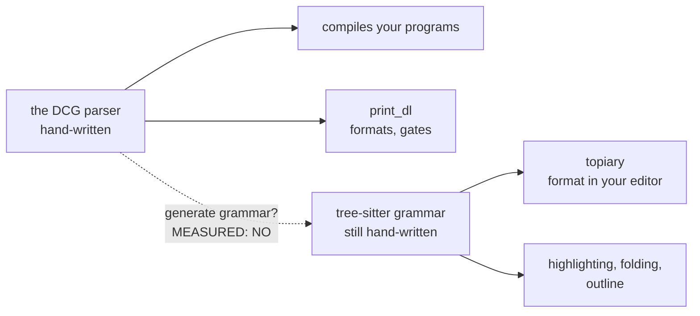

# The "one description of the language" question, answered

## What you asked

You have several files that each describe dl6. You asked whether the DCG
parser could be the only hand-written one, with everything else generated
from it. Then whether that could reach all the way to an LSP.

## The answer

Tree-sitter and Topiary: yes, done, working.

Generate the grammar from the parser: no, and now we know why. The first
attempt was a lazy generator, so we built a second one that tried the
three skipped tricks. All three worked. You now hand-write 1.7 characters
per generated one instead of 3. Still above 1, and the part that stays
hand-written is the part a compiler never needed.



## Yes: tree-sitter parses the whole language now

Not a slice this time. The full 630-line golden fixture and all 266
generated files, zero parse errors. Topiary formats to your printing law
and formatting twice changes nothing. I reran both checks.

## No: the DCG cannot generate that grammar

### Watch it succeed

Real clause from the parser, backtick template literals:

```prolog
template_codes([])         --> [0'`], !.
template_codes([0'` | Cs]) --> [0'\, 0'`], !, template_codes(Cs).
template_codes([0'\ | Cs]) --> [0'\, 0'\], !, template_codes(Cs).
template_codes([C  | Cs])  --> [C], template_codes(Cs).
```

The generator walks it, one goal at a time:

```
step 0  read clause 1   body=[0'`], !            emit so far: (nothing)
step 1  code list       fixed int 0'` = backtick  -> "`"
step 2  cut !           carries no syntax         -> blank()
step 3  clause 1 done                             -> seq("`", blank())
step 4  read clause 2   body=[0'\,0'`], !, template_codes(Cs)
step 5  code list       two fixed ints            -> "\\`"
step 6  cut                                       -> blank()
step 7  call to a known DCG head                  -> $.template_codes
step 8  clause 2 done          -> seq("\\`", seq(blank(), $.template_codes))
...     clauses 3 and 4 walk identically
step 9  4 clauses, same head, join with choice
```

Output, verbatim from `emitted-grammar.js`:

```js
template_codes: $ => choice(
  seq("\\\\", seq(blank(), $.template_codes)),
  seq("\\`",  seq(blank(), $.template_codes)),
  seq("`", blank())),
```

Three of four clauses survived. Clause 4, `[C]` with C unbound, vanished:
a variable is not a character the generator can print.

### Watch it fail

Real clause, the comma-separated-list combinator that made the parser
small:

```prolog
sep(P, [X | Xs]) -->
    call(P, X), ws,
    ( @`,` -> ws, sep(P, Xs) ; { Xs = [] } ).
```

```
step 0  read clause      head sep/2, body has call(P,X)
step 1  call(P, X)       P is a VARIABLE: the parser to run
                         is decided at runtime, not written here
step 2  STOP             cannot name a rule            -> blank()
step 3  ws               a character predicate, not a literal
                         -> needs a regex a human writes -> blank()
step 4  @`,` -> ... ; ...  if-then-else, not a grammar choice
                         (commits, no backtracking)    -> blank()
step 5  { Xs = [] }      pure semantics, zero syntax   -> blank()
step 6  clause done      everything became blank()
```

Output, verbatim: `sep: $ => $.sepv` — a name pointing at nothing usable.
Every list in the language routes through this one clause, so the whole
comma-list surface has to be hand-written anyway.

That is the shape of round 1's failure. But "the generator is
unfinished" is exactly what it turned out to be: see below.

### The measurement

The lab ran the generator on the whole parser.

| measure | number |
|---|---|
| grammar rules in the parser | 103 |
| rules the generator could translate | 32 |
| characters the generator produced | 1304 |
| characters of hand-writing still needed | 3862 |

So you would hand-write 3 characters for every 1 generated, and worse,
that hand-written part grows every time you add a construct. It is a
second grammar wearing a disguise.

What defeats it, ranked by how much of the language each one eats:

| what stops the generator | example above | what it costs |
|---|---|---|
| parser passed as an argument | `call(P, X)` in `sep` | every comma-list in the language |
| character tests written as code | `ws`, digit and letter tests | all whitespace, numbers, names |
| runtime precedence table | the operator registry | the whole expression tier |
| semantic actions | `{ Xs = [] }` | argument shapes, variable identity |
| unbound code variables | clause 4 of `template_codes` | strings, quoted atoms, templates |

Exactly the things that made the parser small are the things that cannot
be read as a grammar.

### What round 1 skipped

You said this sounds unfinished. It is. Three things the generator never
tried, each checked against the code:

| it gave up on | but actually |
|---|---|
| operator precedence ("comes from a runtime table") | that table is 76 plain facts in registry.pl. The parser looks them up with a query; the generator can run the SAME query and print the precedence rules |
| whitespace, digits, letters ("character code, not a shape") | the parser uses exactly FOUR of these. Four hand-written lines, once, covers all of them forever |
| `sep`, the list combinator ("parser decided at runtime") | its 24 call sites pass 9 known parsers. Make 9 copies, one per caller. Bounded, mechanical |

### Round 2: all three worked

| trick | worked? | hand-writing it removed |
|---|---|---:|
| read the precedence table as data | yes | 508 chars |
| four-row character table | yes | 169 chars |
| copy the list combinator per caller (14 copies) | yes | 37 chars |

You now hand-write 1.7 characters per generated character, down from 3.
And the emitted grammar is real: it builds with `tree-sitter generate`.

### What is left, and why it never comes from the parser

| still hand-written | why the parser cannot know it |
|---|---|
| where each node starts and ends | your compiler builds its own shapes, not editor shapes |
| what to call each field | it never needed names; it uses positions |
| keeping comments | your parser THROWS COMMENTS AWAY. An editor must keep them to colour them |
| string escape shapes | your parser decodes escapes; an editor displays them |
| broken half-typed code | your compiler just errors; an editor keeps working |

Every one of those is an editor job, not a compiler job. That is the real
answer: not "our parser is written wrong" but "an editor needs to know
things a compiler never has to".

### The compression made it worse, which proves the point

Run before the parser shrank, and again after:

| parser | size | rules | translatable | you hand-write per generated char |
|---|---:|---:|---:|---:|
| this morning's | 29534 | 108 | 34 | 2.7 |
| today's, after the bake-offs | 26473 | 103 | 32 | 3.0 |

Making the parser smaller made it LESS generatable. The tricks that shrank
it are the same tricks the generator cannot read. So there is no version
of the parser that is both small and readable as a grammar.

## The LSP question

Five real options were priced. The recommended one is Langium: you give
it a grammar and it generates the editor server around it, and our
compiler answers the hard questions (types, definitions, errors).

But note the trap: Langium wants its own grammar file too. Phase B just
proved generating a grammar from the DCG costs more than writing it. So
before adopting Langium we measure the same ratio for its grammar
language. That measurement is the next step, not the adoption.

## Where the count stands

| description of dl6 | status |
|---|---|
| DCG parser | the real one, stays |
| print_dl formatter | stays, it is the reverse |
| tree-sitter grammar | now complete, hand-written, stays |
| topiary rules | rides with tree-sitter |
| old langium slice | stale, delete candidate |
| old classic parser | your call, still open |

So: four real descriptions, not one. Two of them (the formatter and the
topiary rules) are small and follow from the other two.

## What needs you

1. Go or no-go on the full editor arc.
2. If go: do we keep tree-sitter and add Langium, or let Langium's
   parser replace tree-sitter? They both want to own parsing.
3. Delete the old classic parser and the stale langium slice?
