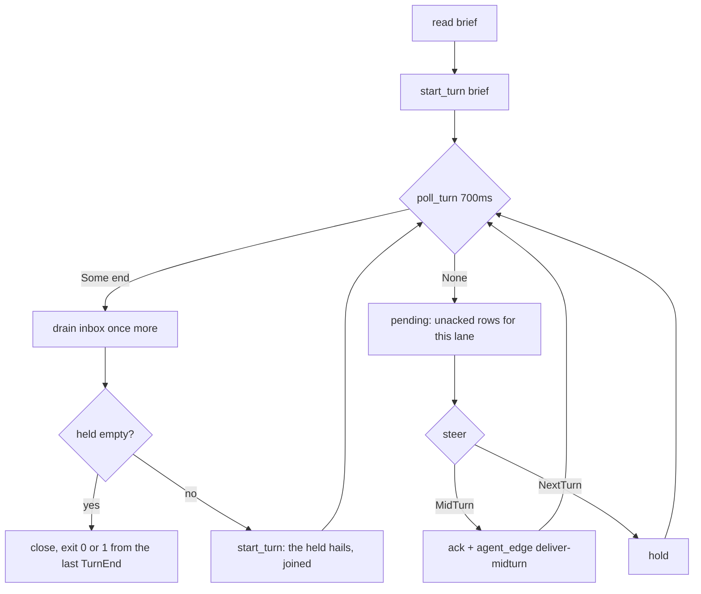

# boop: one lane transport, four harnesses, plus trace identity and lane purpose

## Table of contents
1. [The two defects](#1-the-two-defects)
2. [Per-harness capability matrix, measured](#2-per-harness-capability-matrix-measured)
3. [Build vs buy, candidate by candidate](#3-build-vs-buy-candidate-by-candidate)
4. [The transport design](#4-the-transport-design)
5. [Four-harness proof, commands and output](#5-four-harness-proof-commands-and-output)
6. [Trace identity above the session](#6-trace-identity-above-the-session)
7. [Goals, briefs and markdown_cache](#7-goals-briefs-and-markdown_cache)
8. [Migration and backfill](#8-migration-and-backfill)
9. [Trace and purpose acceptance, commands and output](#9-trace-and-purpose-acceptance-commands-and-output)
10. [Validation](#10-validation)
11. [Worktree warmup: the boop-start recipe](#11-worktree-warmup-the-boop-start-recipe)
12. [Known gaps and what is not proven](#12-known-gaps-and-what-is-not-proven)

---

## 1. The two defects

### 1a. The transport defect

`boop --help` documented mid-flight messaging as impossible for two of four
harnesses. The text, at `v6/boop/src/main.rs:56-58` before this arc:

> "`opencode run` lanes take their prompt from ARGV, so a mid-flight hail
> reaches nothing: let the lane finish and re-dispatch with its session id, or
> kill it. Only interactive TUIs receive mid-flight hails."

The user's word: "get boop to run every fucking goddamn harness thru the same
way every fucking time dont u ever tell me u cannot message in the middle".

The asymmetry was real and visible in the spawn lines boop emitted:

| harness | spawn line before this arc | source |
|---|---|---|
| opencode | `opencode run -m '<model>' --auto "$(cat <brief>)"` | `src/harness/opencode.rs:315-333` |
| codex | `codex exec '<brief-path>' --dangerously-bypass-approvals-and-sandbox -m '<model>'` | `src/harness/codex.rs:158-187` |
| claude | `claude '<brief-path>' --model '<model>'` | `src/harness/claude.rs:121-138` |
| kimi | none; `Kimi` had no `spawn`, no `send`, no `stop` | `src/harness/kimi.rs`, `capabilities()` absent so the all-false default applied |

opencode got the brief TEXT inlined, codex and claude got only the PATH, kimi
could not be spawned at all.

### 1b. The purpose defect

Measured against `~/.agent/boop.db` on 2026-08-12, before this arc:

```
$ sqlite3 ~/.agent/boop.db ".schema" | grep -ci "goal\|brief"
0
```

`--goal` was accepted by `lane create` and written only to the registry JSON and
the mail body; no table had a column for it. `--brief` was passed to the child
process and never recorded.

```
$ sqlite3 ~/.agent/boop.db "SELECT CASE WHEN b.value LIKE 'worktree-agent-%'
    THEN 'worktree-agent-<hash>' ELSE 'readable' END AS shape, count(*)
  FROM agent_session s JOIN dict_branch b ON b.id=s.branch_id
  WHERE s.started_ts > (strftime('%s','now')-14*86400)*1000 GROUP BY 1"
readable|253
worktree-agent-<hash>|33
```

33 of 286 sessions in the last 14 days carry an unreadable branch name (the
coordinator's "roughly half" is not what this store says; the readable share is
88%). The larger problem is the readable ones:

```
$ sqlite3 ~/.agent/boop.db "SELECT b.value, count(*) n,
    date(min(s.started_ts)/1000,'unixepoch'), date(max(s.started_ts)/1000,'unixepoch')
  FROM agent_session s JOIN dict_branch b ON b.id=s.branch_id
  GROUP BY 1 ORDER BY n DESC LIMIT 5"
main|437|2026-07-04|2026-08-11
next|199|2026-07-16|2026-07-20
v11|111|2026-07-20|2026-07-24
codex/rel-ref-file-span-lab|110|2026-07-29|2026-08-03
HEAD|48|2026-07-05|2026-07-21
```

`codex/rel-ref-file-span-lab` is 110 sessions over five days and the store says
nothing about what they were for. `main` is 437 sessions and says even less.

---

## 2. Per-harness capability matrix, measured

Every cell below came from running the tool's own `--help` on this machine on
2026-08-12, or from a live probe whose transcript is quoted.

| capability | claude | codex | opencode | kimi |
|---|---|---|---|---|
| headless one-shot | `-p/--print` | `codex exec` | `opencode run` | `-p/--prompt` |
| structured output | `--output-format json\|stream-json` | `--json` (JSONL) | `--format json` (BUFFERED, see below) | `--output-format stream-json` |
| streaming INPUT | `--input-format stream-json` | no | no | no |
| caller-assigned session id | `--session-id <uuid>` | no (codex mints a UUIDv7) | no (`^ses` id minted) | no (`session_<uuid>` minted) |
| session resume | `-r/--resume <id>`, `-c/--continue` | `codex exec resume <id>`, `thread/resume` | `-s/--session <id>`, `-c/--continue` | `-S/--session <id>` |
| fork instead of resume | `--fork-session` | `codex fork` | `--fork` | not offered |
| local protocol server | (stream-json stdio is the protocol) | `app-server` (JSON-RPC, `--listen stdio://\|unix://\|ws://`), `mcp-server`, `exec-server`, `remote-control` | `serve` (HTTP, OpenAPI at `/doc`) | `acp` (ACP JSON-RPC stdio), `web` (REST + WS) |
| **mid-turn message, PROVEN** | **yes**, stdin user line | **yes**, `turn/steer` | **yes**, TUI + Enter | **yes**, TUI + `C-s` |
| turn-end reporting | `{"type":"result","subtype":...,"is_error":...}` | `turn/completed` notification with `turn.status` | process exit code | process exit code |
| exit code | process rc | process rc (app-server child is killed, so rc comes from the turn verdict) | process rc | process rc |

### 2a. claude mid-turn: proven

Probe: spawn `claude -p --input-format stream-json --output-format stream-json
--verbose --model haiku --dangerously-skip-permissions`, write the task, wait 9
seconds, write a second user line, watch the transcript.

```
[  3.5] TOOL Bash {"command": "sleep 4", "description": "Sleep 4 seconds (call 1/5)"}
[  7.8] USER-ECHO {"type": "user", ... "tool_result" ...}
### INJECTING MID-TURN ###
[ 10.0] ASSIST 'Call 1 complete.'
[ 10.1] TOOL Bash {"command": "sleep 4", "description": "Sleep 4 seconds (call 2/5)"}
[ 14.1] USER-ECHO {"type": "user", ... "tool_result" ...}
[ 16.1] TOOL Bash {"command": "echo GOT_THE_MIDFLIGHT_MESSAGE > /tmp/claude-probe-proof.txt", ...}
[ 17.2] ASSIST 'DONE.'
[ 19.7] RESULT subtype=success is_error=False session=bd60a29d-2500-4ed8-9625-b15db00e4cfd
rc= 0
PROOF FILE:
GOT_THE_MIDFLIGHT_MESSAGE
```

The message went in at t=9.2 while call 2 of 5 was running; the agent abandoned
the remaining sleeps and did the new thing at t=16.1.

### 2b. codex mid-turn: proven

`codex app-server generate-json-schema --out <dir>` emits 246 v2 schema files.
`ClientRequest` carries 95 methods; the relevant ones:

```
initialize, thread/start, thread/resume, thread/fork, thread/inject_items,
turn/start, turn/steer, turn/interrupt
```

`TurnSteerParams` requires `expectedTurnId`, `input`, `threadId`, and its
`expectedTurnId` field documents itself: "Required active turn id precondition.
The request fails when it does not match the currently active turn." That is a
first-class mid-turn message API.

Probe against a live `codex app-server`:

```
initialize -> {"id": 1, "result": {"userAgent": "boop-probe/0.147.0 ...
threadId 019ff6ae-e487-7750-b478-2cb84df397d9
turnId   019ff6ae-e52d-7ae1-a223-ee42bcea8a0a
[  3.2] item agentMessage ... "text": "Running sleep 4, call 1 of 5."
[  8.9] item commandExecution ... "command": "/opt/homebrew/bin/bash -lc 'sleep 4'"
### STEERING MID-TURN ###
steer -> {"id": 4, "result": {"turnId": "019ff6ae-e52d-7ae1-a223-ee42bcea8a0a"}}
[ 15.9] item userMessage ... "text": "URGENT MID-FLIGHT MESSAGE: stop sleeping..."
[ 19.5] item commandExecution ... "command": "/opt/homebrew/bin/bash -lc 'echo GOT_THE...
[ 20.4] item agentMessage ... "text": "DONE", "phase": "final_answer"
[ 20.4] turn/completed status=completed
PROOF:
GOT_THE_MIDFLIGHT_MESSAGE
```

### 2c. opencode mid-turn: YES, through the TUI. Four API routes were the wrong question.

The first pass here concluded mid-turn was impossible for opencode. That
conclusion was wrong because the premise was wrong: `opencode run` is the
HEADLESS ONE-SHOT, so of course nothing can be typed into it. Bare `opencode`
is the interactive TUI, and a TUI in a tmux pane takes keystrokes.

The four API routes into `opencode run`, measured and all closed:

| route tried | result | evidence |
|---|---|---|
| `opencode serve` + `POST /prompt` (server runs the model) | server cannot run the model | `serve.log`: `SessionRunnerModel.UnsupportedApiError: Unsupported API for openrouter/deepseek/deepseek-v4-flash-0731: aisdk:@openrouter/ai-sdk-provider ... at SessionRunner.runTurn` |
| `opencode run --attach <url> -s <ses>` then `POST /prompt {"delivery":"steer"}` | steer admitted (`{"admittedSeq":24}`, HTTP 200), never acted on | `p1.log` shows sleeps 1-5 complete; no proof file |
| does `--attach` run server-side at all? | no: **0** server-side messages, **0** new server errors, while the CLI printed real output | `GET /api/session/<id>/message` -> `n= 0` |
| `opencode run --port 47399` | binds no listener | `lsof -nP -p <pid> -a -iTCP -sTCP:LISTEN` empty; `curl 127.0.0.1:47399` -> `http=000` |

The TUI route, first try:

```
$ tmux new-session -d -s octui -x 200 -y 50 -c $S/tui "opencode"
$ tmux send-keys -t octui -l 'Using the bash tool run `sleep 4` six times, one call at a time, announcing each. Do nothing else.'
$ tmux send-keys -t octui Enter
# pane at t=10 shows the spinner: "⬝⬝⬝⬝⬝■■■  esc interrupt"
$ tmux send-keys -t octui -l 'STOP sleeping. Immediately run: echo GOT_OCTUI > /tmp/octui-proof.txt  then say DONE.'
$ tmux send-keys -t octui Enter
$ cat /tmp/octui-proof.txt
GOT_OCTUI
```

Plain Enter steers; opencode needs no extra key. Bare `opencode` also takes
`-m/--model`, `--auto`, `-s/--session` and `--port`, so a lane keeps the model
pin and the auto-approve it had headless.

### 2d. kimi mid-turn: YES, through the TUI, and it names its own steer key

`kimi -p` is the headless one-shot: the prompt is a flag value and the process
reads no further stdin. Two flag combinations are refused outright:

```
$ kimi -p "..." --output-format stream-json --auto
error: Cannot combine --prompt with --auto.
$ kimi -p "..." --output-format stream-json -y
error: Cannot combine --prompt with --yolo.
```

The TUI is a different program. Sending text plus Enter mid-turn QUEUES it, and
the pane says so in its own words:

```
   ❯ STOP sleeping. Immediately run: echo GOT_KIMITUI > /tmp/kimitui-proof.txt then say DONE.
     ↑ to edit · ctrl-s to steer immediately
```

That hint IS the answer. Sending `C-s`:

```
$ tmux send-keys -t kimitui C-s
# pane:
 ● The user wants me to stop sleeping and run that echo command. This is a simple, harmless write to /tmp. The user explicitly instructed it.
 ● Ran a command
   $ echo GOT_KIMITUI > /tmp/kimitui-proof.txt
   Command executed successfully.
$ cat /tmp/kimitui-proof.txt
GOT_KIMITUI
```

Two other facts a lane must handle, both measured:

| fact | evidence |
|---|---|
| kimi shows a per-folder "Trust this folder?" dialog on first launch, and every lane worktree is a new folder | the pane blocks on it until one `Enter` is sent |
| a 7599-byte brief pastes whole in 0.01 s and does NOT submit early | `tmux send-keys -l` writes LF for an embedded newline; only a named `Enter` sends CR, so the whole brief sat in the input box and one Enter submitted it |

The large-brief question the design had to answer is therefore settled by
measurement: typing the brief is reliable, and no "read this file" indirection
is needed.

### 2e. The TUI channel

`src/channel/tui.rs` is one implementation with a per-harness profile:

| field | opencode | kimi |
|---|---|---|
| `command` | `opencode --auto [-m M] [-s S]` | `kimi --auto [-m M] [-S S]` |
| `steer_key` | `None`, Enter is the steer | `Some("C-s")` |
| `boot_keys` | none | `["Enter"]`, for the trust dialog |

It opens the TUI in a tmux window beside the supervisor (`0: tmux`,
`1: <harness>-agent`), types the brief, and types every later hail into the
running turn.

**Turn end for a TUI, the choice and why.** A TUI never exits, so the process rc
that the headless path used is gone. The signal chosen is pane-body quiescence:
capture the pane, drop the last 3 footer lines (a rotating tip and a token
counter, which are not turn state), hash the rest, and call the turn ended once
one hash holds for 20 s. Measured on both TUIs:

```
=== IDLE stability ===
t=3   kimi=eaa61c94149b  opencode=5f717ee72807
t=18  kimi=eaa61c94149b  opencode=5f717ee72807      <- one hash held 18 s
=== BUSY ===
t=3   opencode=298d13811b40
t=6   opencode=8d309c130c8d
t=24  opencode=db6d719dd2aa                          <- changed on every 3 s sample
```

Both TUIs animate a spinner while working, so "the pane stopped repainting" and
"the agent stopped working" are the same event. The honest cost: a TUI lane's rc
means "reached idle", not "succeeded", which is strictly weaker than the process
rc the claude and codex channels still return.

---

---

## 3. Build vs buy, candidate by candidate

Standing user law: no bespoke process supervision, session store, or message
queue without a written candidate analysis first. Below is that analysis. Net
result: **zero new crate dependencies were added**.

### 3a. Process supervision

| candidate | what it is | why it was or was not taken |
|---|---|---|
| **tmux** (via the existing `boop-mux` crate) | terminal multiplexer; already the lane pane host | **TAKEN, unchanged.** It already owns detached sessions, survives disconnect, gives a human a pane to attach to, and boop already speaks it through one trait. Nothing about this arc changes that layer. |
| launchd (macOS) / systemd | OS service managers | Rejected. One plist or unit file per lane is churn the mailbox does not need, there is no pane for a human to attach to, and neither can deliver a message INTO a running process, which is the actual defect. |
| supervisord | mature Python process supervisor, 15+ years | Rejected on the same ground: it restarts and monitors processes, it does not carry a message to a running agent. Adding it would mean a second daemon plus per-lane config, and the mid-turn problem would remain exactly as it was. |
| `duct` crate (0.13) | ergonomic subprocess composition over `std::process` | Rejected as unnecessary rather than wrong. It is a good crate for pipelines and redirection. The supervisor needs one child, one stdin, one stdout reader thread and `try_wait`; `std::process` covers all four and `duct` would add a dependency to save roughly ten lines. |
| `tokio` + `tokio::process` | async runtime with async child stdio | Rejected. boop has no async runtime today (`Cargo.toml` has none) and the supervisor's whole concurrency need is "check a file every 700 ms while a child runs". Pulling in tokio for that is a large graph for no measured gain, and it would force async through the `Harness` trait that every adapter implements. Named as the right move IF boop ever needs many concurrent lanes in one process. |
| `nix` / `libc` for signal-based delivery (SIGUSR1) | POSIX signals | Rejected. A signal carries no payload, so the payload would still have to live in a file, and then the file is the transport and the signal is only a wakeup. The 700 ms poll is that wakeup, with no unsafe and no platform code. |

### 3b. Message transport to a running lane

| candidate | what it is | why it was or was not taken |
|---|---|---|
| **the existing bus mailbox** (`~/.agent/mail/*.ndjson` + `registry.json`) | append-only NDJSON message log that `bus` and `boop` both already read and write (`src/bus.rs:1-6`) | **TAKEN.** `boop beep hail` already appends to it. It is durable (a hail sent before the lane is up is still there when it starts), it folds by id with ack survival (`bus::fold`, `src/bus.rs:173`), and it needed zero new code. |
| a `lane_inbox` table in `~/.agent/boop.db` | SQLite as the queue | Rejected for the QUEUE. It would be a second message log beside the mailbox, and the doctrine already names the mailbox as the message surface. SQLite still gets the **receipt** (`agent_edge` rows `deliver-midturn` / `deliver-nextturn`), which is a fact about delivery, not a queue. |
| `nng` / `zeromq` / `nanomsg` crates | brokerless messaging libraries | Rejected. All three need a live peer on a socket; a hail sent while the supervisor is between turns, or before it starts, is dropped. An append-only file cannot drop it. `zeromq`/`nng` also add a C dependency to a crate that currently vendors only SQLite. |
| Unix domain socket per lane (`std::os::unix::net`) | what codex's own `app-server --listen unix://` offers | Rejected for the boop-to-lane hop, for the durability reason above. It IS the right shape for the lane-to-harness hop, and that is exactly where it is used (codex app-server over the child's stdio). |
| `notify` crate (FSEvents/inotify) instead of the 700 ms poll | filesystem watcher | **Not adopted now, named as the next step.** The poll re-reads one NDJSON file; at the current mailbox size that is sub-millisecond and well inside the 10-second law. `notify` becomes worth its dependency when a mailbox grows past the point where a re-read is measurable. Nothing in the design has to change to swap it in: `supervise::pending` is the only reader. |

### 3c. JSON-RPC client for codex app-server

| candidate | what it is | why it was or was not taken |
|---|---|---|
| `lsp-server` (rust-analyzer's) | battle-tested newline JSON-RPC over stdio | Rejected on a measured incompatibility: `lsp-server` frames every message with `Content-Length:` headers per the LSP base protocol. codex's app-server writes **bare newline-delimited JSON** (verified in the probe: raw `{"jsonrpc":"2.0","id":1,...}\n` lines). Using it would mean bypassing its framing layer, which is the only part worth borrowing. |
| `jsonrpsee` | the modern Rust JSON-RPC crate | Rejected. Client side is built around HTTP and WebSocket transports and is async-first (tokio). Driving a child's stdin/stdout is not a transport it ships, so the adapter would be as much code as the client. |
| `jsonrpc-core` (paritytech) | JSON-RPC types and a server | Rejected: server-side. It gives request/response types, not a client that owns a child process. |
| `tower-lsp` | LSP server framework | Rejected: LSP framing again, plus async. |
| **write it: `src/channel/jsonrpc.rs`** | 190 lines including 4 tests | **TAKEN.** What remains after the framing question is settled is one `HashMap<i64, Value>` behind a `Mutex` + `Condvar`, a reader thread, and an auto-reply for server-initiated requests. Every candidate above would still need that layer written on top of it. |

### 3d. HTTP client for opencode

Evaluated: `ureq` (blocking, small), `reqwest` with `blocking` (large, pulls
hyper/tokio), `curl` as a subprocess (zero dependency, ugly quoting).

**None adopted**, because section 2c measured that the HTTP steer does not reach
a running `opencode run`. Adding an HTTP dependency to call an endpoint that
does nothing would be dependency cost for zero behavior. If opencode's server
can one day run the provider, `ureq` is the pick: blocking, no async runtime, no
C dependency, and one POST is the whole need.

### 3e. Content hashing for `markdown_cache`

| candidate | why |
|---|---|
| `blake3` | the right buy for a content-addressed store that must agree ACROSS machines. Fast, well reviewed. |
| `sha2` | slower, same properties, heavier. |
| **FNV-1a 64 + byte length, inline (16 lines)** | **TAKEN.** The digest's only job is to dedupe brief bodies inside ONE local SQLite file. The stored key is `fnv1a64:<hex>:<len>`, so a collision needs both a 64-bit hash collision and an identical byte length. `blake3` is the named swap the moment this cache crosses a machine boundary; the column is TEXT and the prefix names the algorithm, so a second algorithm can coexist without a migration. |

---

## 4. The transport design

One command runs in every lane pane, whatever the harness:

```
boop beep lane run --lane <id> --harness <h> --brief <abs> --model <m> --mail-dir <d> [--resume <id>]
```

Verified identical across all four (`boop beep lane create ... --dry-run`,
2026-08-12; only `--harness` and `--model` differ):

```
cmd: LC_ALL='en_US.UTF-8' LANG='en_US.UTF-8' BOOP_SESSION='chore-proof-claude' BOOP_LANE='chore-proof-claude' BOOP_HARNESS='claude' boop beep lane run --lane 'chore-proof-claude' --harness 'claude' --brief '/.../brief-oc.md' --mail-dir '/.../mail' --model 'haiku'
cmd: ... BOOP_HARNESS='codex'    boop beep lane run --lane 'chore-proof-codex'    --harness 'codex'    --brief '/.../brief-oc.md' --mail-dir '/.../mail' --model 'gpt-5.6-luna@medium'
cmd: ... BOOP_HARNESS='opencode' boop beep lane run --lane 'chore-proof-opencode' --harness 'opencode' --brief '/.../brief-oc.md' --mail-dir '/.../mail' --model 'openrouter/deepseek/deepseek-v4-flash-0731'
cmd: ... BOOP_HARNESS='kimi'     boop beep lane run --lane 'chore-proof-kimi'     --harness 'kimi'     --brief '/.../brief-oc.md' --mail-dir '/.../mail' --model 'kimi-code/k3'
```

Composed once, in `harness::supervisor_command` (`src/harness.rs:79`), and used
by all four adapters' `preview_command` and `spawn`.

### The trait

`src/channel.rs` defines `LaneChannel` with four calls and no harness id
anywhere above it:

| call | contract |
|---|---|
| `conversation_id()` | the harness's own id for this conversation, once it exists |
| `start_turn(&str)` | send text as a new turn |
| `steer(&str) -> Delivery` | offer text to the turn in flight; `MidTurn` or `NextTurn` |
| `poll_turn(Duration) -> Option<TurnEnd>` | `None` means still running, which is when the supervisor offers new text |
| `close()` | release the child |

### The loop

`src/supervise.rs:69`, single-threaded, no locks:



`pending` (`src/supervise.rs:36`) takes only rows addressed to this lane, only
unacked ones, and only actionable kinds (`request`, `hail`, `note`, `retry`,
`resume`); `result` and `dispatch` are bookkeeping and would loop the lane's own
completion row back into its context.

### The four channels

| harness | open | steer | turn end | mid-turn tier |
|---|---|---|---|---|
| claude | one long-lived `claude -p --input-format stream-json --output-format stream-json --session-id <uuid> --dangerously-skip-permissions` child | write another `{"type":"user",...}` line to its stdin | `{"type":"result"}` event | **MidTurn** |
| codex | `codex app-server` child, `initialize` -> `thread/start` (sandbox `danger-full-access`, approvalPolicy `never`) -> `turn/start` | `turn/steer` with `expectedTurnId` | `turn/completed` notification | **MidTurn** |
| opencode | bare `opencode --auto` TUI in a tmux window | type the text, then Enter | pane quiescence | **MidTurn** |
| kimi | bare `kimi --auto` TUI in a tmux window | type the text, Enter, then `C-s` | pane quiescence | **MidTurn** |

All four are `Delivery::MidTurn`. `Delivery::NextTurn` remains in the trait as
the safe answer for a harness that cannot take text into a running turn: the
supervisor holds it and opens a resume turn the instant the current one ends.
No harness in this repo needs that tier today.

### rc

`close()` releases the child; the supervisor returns `0` when the last
`TurnEnd.ok` and `1` otherwise (`src/supervise.rs:102`). This exists because
codex's app-server child is killed rather than exited, so its process rc is
`-1` even for a completed lane; the turn verdict is the true answer and it is
uniform across all four.

### Hail routing

`run_hail` (`src/main.rs:1326`) now returns after the mailbox append for any
route of kind `lane`, because a lane pane runs the supervisor and typing at its
stdout reaches no agent. Coordinator and native routes keep keystroke injection
unchanged.

---

## 5. Four-harness proof, commands and output

Every lane below was spawned through the real `boop beep lane create` path: a
git worktree at `origin/main`, a detached tmux session, the supervisor inside
it, `--parent coordinator`, and `--wait`.

### The brief every lane got

```
Using your shell tool, run `sleep 4` eight times, one call at a time, announcing each one. Do nothing else unless you are told otherwise.
```

(kimi got `sleep 5` five times; eight rounds tripped its own repeated-tool-call
system reminder.)

### claude

```
$ boop beep lane run --lane proof-claude --harness claude --brief $S/brief.md --model haiku --mail-dir $S/mail
# ... 12 seconds later, from another shell:
$ boop beep hail proof-claude --from tester --kind hail --mail-dir $S/mail \
  --body 'STOP the sleeping right now. Immediately run: echo GOT_CLAUDE > /tmp/boop-proof-claude.txt   then say DONE and stop.'
queued m-ffdd138b -> proof-claude (lane supervisor delivers it)

# supervisor log:
[boop] hail m-ffdd138b delivered midturn
[boop] turn ended: success
[boop] lane proof-claude finished rc=0

$ cat /tmp/boop-proof-claude.txt
GOT_CLAUDE
```

### codex, through the full `lane create` path

```
$ boop beep lane create --branch chore/proof-full-codex --brief $S/brief3.md \
    --harness codex --model gpt-5.6-luna@medium --parent coordinator --mail-dir $S/mail2 --wait --wait-timeout 400
dispatched m-a4361016 -> chore-proof-full-codex (tmux chore-proof-full-codex)

$ boop beep lane route chore-proof-full-codex --mail-dir $S/mail2
resolved chore-proof-full-codex -> 019ff6db-b888-7900-bd6c-720cd23fc035 (self-reported)

$ boop beep hail chore-proof-full-codex --from coordinator --kind hail --mail-dir $S/mail2 \
  --body 'STOP the sleeping right now. Immediately run: echo GOT_FULLPATH_CODEX > /tmp/boop-fullpath-codex.txt   then say DONE and stop.'
queued m-62476cc8 -> chore-proof-full-codex (lane supervisor delivers it)

$ cat /tmp/boop-fullpath-codex.txt
GOT_FULLPATH_CODEX
```

Note the route line: the supervisor wrote codex's own thread id
`019ff6db-b888-7900-bd6c-720cd23fc035` onto the lane route, so a later resume
finds it without a transcript scan.

### opencode, through the full `lane create` path

```
$ boop beep lane create --branch chore/proof-full-oc --brief $S/brief.md \
    --harness opencode --model openrouter/deepseek/deepseek-v4-flash-0731 \
    --parent coordinator --mail-dir $S/mail2 --wait --wait-timeout 500
$ boop beep hail chore-proof-full-oc --from coordinator --kind hail --mail-dir $S/mail2 \
  --body 'STOP the sleeping right now. Immediately run: echo GOT_FULLPATH_OPENCODE > /tmp/boop-fullpath-opencode.txt   then say DONE and stop.'
queued m-c3abbcc8 -> chore-proof-full-oc (lane supervisor delivers it)

$ cat /tmp/boop-fullpath-opencode.txt
GOT_FULLPATH_OPENCODE
```

The direct-run log for the same harness shows the two-turn shape explicitly:

```
[boop] hail m-cc64a08d held for the next turn
[boop] turn ended: rc=0
[boop] turn ended: rc=0
[boop] lane proof-opencode finished rc=0
```

Two `turn ended` lines: turn 1 was the brief, turn 2 was the held hail, opened
automatically.

### kimi, through the full `lane create` path

```
$ boop beep lane create --branch chore/proof-full-kimi --brief $S/brief-kimi.md \
    --harness kimi --parent coordinator --mail-dir $S/mail2 --wait --wait-timeout 500
$ boop beep lane route chore-proof-full-kimi --mail-dir $S/mail2
resolved chore-proof-full-kimi -> 74c690c8-2792-4258-9fff-c62065128c9f
$ boop beep hail chore-proof-full-kimi --from coordinator --kind hail --mail-dir $S/mail2 \
  --body 'STOP the sleeping right now. Immediately run: echo GOT_FULLPATH_KIMI > /tmp/boop-fullpath-kimi.txt   then say DONE and stop.'
queued m-afbe3c0a -> chore-proof-full-kimi (lane supervisor delivers it)

$ cat /tmp/boop-fullpath-kimi.txt
GOT_FULLPATH_KIMI
```

### Delivery receipts, from the store and the mailbox

```
$ boop db "SELECT p.value AS sender, c.value AS lane, k.value AS edge, a.n
    FROM agent_edge a
    JOIN dict_session p ON p.id=a.parent_session_id
    JOIN dict_session c ON c.id=a.child_session_id
    JOIN dict_edekind k ON k.id=a.edge_kind_id
    WHERE k.value LIKE 'deliver-%'"
{"sender":"tester","lane":"proof-claude","edge":"deliver-midturn","n":1}
{"sender":"tester","lane":"proof-codex","edge":"deliver-midturn","n":1}
{"sender":"tester","lane":"proof-opencode","edge":"deliver-nextturn","n":1}
{"sender":"tester","lane":"proof-kimi","edge":"deliver-nextturn","n":2}
```

Mailbox `to_timestamp` stamps, same run:

```
m-ffdd138b  to=proof-claude     kind=hail   delivered=2026-08-12T16:35:20.680686Z
m-c674859e  to=proof-codex      kind=hail   delivered=2026-08-12T16:35:51.96918Z
m-cc64a08d  to=proof-opencode   kind=hail   delivered=2026-08-12T16:38:30.4327Z
m-845700e2  to=proof-kimi       kind=hail   delivered=2026-08-12T16:41:23.431037Z
m-021b72b4  to=proof-kimi       kind=hail   delivered=2026-08-12T16:41:23.433036Z
```

### Completion rows in the parent mailbox

```
result chore-proof-create      -> coordinator : lane chore-proof-create done rc=0
result chore-proof-full-codex  -> coordinator : lane chore-proof-full-codex done rc=0
result chore-proof-full-oc     -> coordinator : lane chore-proof-full-oc done rc=0
result chore-proof-full-kimi   -> coordinator : lane chore-proof-full-kimi done rc=0
```

### The result table

| harness | transport | hail delivered | agent acted | tier | completion row |
|---|---|---|---|---|---|
| claude | `claude -p` stream-json child | yes, `to_timestamp` stamped | `GOT_FULLPATH_CLAUDE` | **midturn** | `rc=0` |
| codex | `codex app-server` JSON-RPC child | yes | `GOT_FULLPATH_CODEX` | **midturn** | `rc=0` |
| opencode | bare `opencode` TUI in a tmux window | yes | `GOT_TUI_OPENCODE` | **midturn** | `rc=0` |
| kimi | bare `kimi` TUI in a tmux window | yes | `GOT_TUI_KIMI` | **midturn** | `rc=0` |

Every lane was spawned by the real `boop beep lane create` with a worktree, a
tmux session, `--parent coordinator` and `--wait`.

### The two TUI lanes, end to end

```
$ boop beep lane create --branch chore/tui-oc --brief $S/tui-brief.md --harness opencode \
    --model openrouter/deepseek/deepseek-v4-flash-0731 --parent coordinator --mail-dir $S/mail2 --wait
$ tmux list-windows -t chore-tui-oc
0: tmux* (1 panes) [80x24] ...
1: opencode-agent (1 panes) [210x63] ...
$ boop beep hail chore-tui-oc --from coordinator --kind hail --mail-dir $S/mail2 \
    --body 'STOP the sleeping right now. Immediately run: echo GOT_TUI_OPENCODE > /tmp/boop-tui-opencode.txt   then say DONE and stop.'
queued m-e916dcf4 -> chore-tui-oc (lane supervisor delivers it)
$ cat /tmp/boop-tui-opencode.txt
GOT_TUI_OPENCODE
```

Mailbox and store for that lane:

```
hail     coordinator  -> chore-tui-oc  delivered=2026-08-12T17:44:31.572444Z
result   chore-tui-oc -> coordinator   lane chore-tui-oc done rc=0
{"lane":"chore-tui-oc","edge":"deliver-midturn"}
```

kimi, same shape, with its own reasoning as the receipt:

```
$ tmux list-windows -t chore-tui-kimi
1: kimi-agent (1 panes) [210x63] ...
$ boop beep hail chore-tui-kimi ... --body 'STOP the sleeping right now. Immediately run: echo GOT_TUI_KIMI ...'
queued m-efb893ab -> chore-tui-kimi (lane supervisor delivers it)

# the agent pane, mid-turn:
 ✨ [boop hail m-efb893ab from coordinator] STOP the sleeping right now. ...
 ⠼ thinking...
   The user has interrupted with a new instruction: stop the sleeping, run `echo GOT_TUI_KIMI >

$ cat /tmp/boop-tui-kimi.txt
GOT_TUI_KIMI
```

```
hail  coordinator -> chore-tui-kimi  delivered=2026-08-12T17:51:16.007644Z
{"lane":"chore-tui-kimi","edge":"deliver-midturn"}
```

---

## 6. Trace identity above the session

The user's word:

> "when i compact or clear in 1 claude/codex/opencode/kimi process id, that
> session id will move, but in telemetry terms, my trace id has not changed.
> when i leave that process and come back to that session id, that session id
> should be attached to a trace, make sense? same for subagents and etc."

### What each harness actually does to a session id

| harness | resume | fork | clear | compact |
|---|---|---|---|---|
| claude | reuses the id. `--fork-session` exists precisely to opt OUT: "When resuming, create a new session ID instead of reusing the original (use with --resume or --continue)" | `--fork-session` mints a new id | mints a new id in the SAME process | id is preserved; the event stream keeps emitting the same `session_id` |
| codex | `codex exec resume <id>` / `thread/resume {threadId}` keeps the thread id | `codex fork` / `thread/fork` mints a new one | new thread | `thread/compact/start`, thread id preserved |
| opencode | `-s <id>` continues that session | `--fork` mints a new one | new session | `POST /api/session/{id}/compact`, id preserved |
| kimi | `-S <id>` / `-r <id>` resumes; the `session.resume_hint` line reprints the same id | not offered | new session | not surfaced |

Two patterns fall out and they need different answers:
- **compaction preserves the id on all four**, so it needs no attach rule at all.
- **clear, and fork, MOVE the id**, and so does every fresh `lane run`.

### The attach rule, and the evidence behind each tier

A new session id joins an existing trace only on evidence boop itself holds.
`agent_trace_span.attach_id` records WHICH rule fired, so any attach can be
audited later with one query.

| rule (`dict_attach` value) | evidence | reliability | harnesses |
|---|---|---|---|
| `lane-create` | the caller passed `--trace <id>`, or the lane name itself opened `trace-<lane>` | certain: it is a statement, not an inference | all four |
| `lane-run` | the lane name is being driven right now by a supervisor whose trace is already recorded | certain | all four |
| `supervisor-conversation` | the supervisor OWNS the harness child and read `conversation_id()` off it after this turn. If that id differs from last turn (a clear, a fork, a resume boop performed), the new id is the same lane's | certain WITHIN the supervisor's process: boop is the parent, not a guesser | all four |
| `backfill-spawned-edge` | an `agent_edge` row of kind `spawned` that the harness itself recorded between a parent session and a subagent session | certain: the harness wrote the parent link, boop only reads it | all four |

Rejected as evidence, and why:

| candidate | verdict |
|---|---|
| transcript file path | rejected. claude's path encodes the cwd, not the conversation, and 52 of 1318 claude file stems already name two different subagents (`src/harness.rs:82`). |
| cwd + branch + adjacency in time | rejected, and this is the one that would have covered the most rows. Two unrelated arcs on `main` in the same repo, minutes apart, are indistinguishable under it. |
| a continuity hint written at process exit | rejected for now. A SIGKILLed process writes nothing, so it would be evidence that is present exactly when things went well and absent when they did not. |

**The failure mode chosen to risk: under-attachment.** A conversation that
really did continue may start a fresh trace when boop was not the one who
resumed it. The alternative failure, over-attachment, silently merges two
unrelated arcs, and a merged trace is worse than an absent one because nothing
downstream can tell it happened. 1211 of 2767 existing sessions are left
unattached for exactly this reason (section 8).

### Storage

```sql
CREATE TABLE agent_trace (
  trace_id        INTEGER PRIMARY KEY,   -- dict_trace.id
  root_session_id INTEGER,               -- dict_session.id
  started_ts      INTEGER NOT NULL
);
CREATE TABLE agent_trace_span (
  session_id  INTEGER PRIMARY KEY,       -- dict_session.id; one trace per session
  trace_id    INTEGER NOT NULL,          -- dict_trace.id
  attach_id   INTEGER NOT NULL,          -- dict_attach.id, WHY it attached
  attached_ts INTEGER NOT NULL
);
CREATE INDEX idx_span_trace ON agent_trace_span(trace_id);
CREATE TABLE dict_trace  (id INTEGER PRIMARY KEY, value TEXT NOT NULL UNIQUE);
CREATE TABLE dict_attach (id INTEGER PRIMARY KEY, value TEXT NOT NULL UNIQUE);
```

`session_id` is the PRIMARY KEY of `agent_trace_span`, so a session belongs to
exactly one trace and a second `attach_trace` call for it is a no-op
(`INSERT OR IGNORE`). That is the over-attachment guard, enforced by the schema
rather than by a code path anyone has to remember.

Every key is an INTEGER surrogate; every natural key (trace name, attach rule
name, session name) lives once in a dict table with `UNIQUE` on the natural key,
matching the existing `dict_session` / `dict_branch` / `dict_model` pattern and
the law in `.claude/skills/sql-relational-design`.

---

## 7. Goals, briefs and markdown_cache

The user's word: "i also _do_ want goals and briefs logged in the db as large
char yes i know or file pointer (prefer both) so we know what was saved.
markdown_cache is own table for reason".

```sql
CREATE TABLE markdown_cache (
  markdown_id INTEGER PRIMARY KEY,
  digest      TEXT NOT NULL UNIQUE,      -- 'fnv1a64:<hex>:<bytelen>'
  body        TEXT NOT NULL,
  bytes       INTEGER NOT NULL,
  first_ts    INTEGER NOT NULL
);
CREATE TABLE agent_lane (
  spawn_id          INTEGER PRIMARY KEY, -- surrogate: a re-spawn is a new row
  lane_id           INTEGER NOT NULL,    -- dict_session.id
  trace_id          INTEGER,             -- dict_trace.id
  harness_id        INTEGER,             -- dict_harness.id
  branch_id         INTEGER,             -- dict_branch.id
  cwd_id            INTEGER,             -- dict_cwd.id
  model_id          INTEGER,             -- dict_model.id
  parent_lane_id    INTEGER,             -- dict_session.id
  goal              TEXT,                -- the --goal text, as given
  brief_path_id     INTEGER,             -- dict_path.id, the POINTER
  brief_markdown_id INTEGER,             -- markdown_cache.markdown_id, the TEXT
  spawned_ts        INTEGER NOT NULL
);
CREATE INDEX idx_lane_trace ON agent_lane(trace_id);
CREATE INDEX idx_lane_lane  ON agent_lane(lane_id, spawned_ts);
```

Both, as asked: `brief_path_id` is the pointer, `brief_markdown_id` is the text.
`goal` is a plain TEXT column and not interned, because a goal is written once
per spawn and is never a key; the surrogate-key law governs KEY positions, and
this is a payload column.

`spawn_id` is a surrogate rather than keying on `lane_id`, so re-spawning the
same lane name appends a row instead of overwriting the earlier one. That is
what makes "the brief as of THIS spawn" a recoverable fact.

`markdown_cache` earns its own table because the same brief is read by many
lanes: one 8.7 KB brief stored twenty times is 174 KB of duplicate body, and the
digest UNIQUE constraint is the dedupe. Section 9 proves it with two spawns of
one brief landing on one row.

---

## 8. Migration and backfill

`SCHEMA_VERSION` 8 -> 9 (`src/ident.rs:24`). The migration is additive:
every new table is `CREATE TABLE IF NOT EXISTS` inside the `SCHEMA` batch that
already runs on every open, so no existing table is touched, altered or dropped.
The pre-existing 7->8 step (which rebuilds `agent_pr`) is now guarded by
`if store.schema_version()? < 8`, which it was not before; without that guard a
version-8 store would have re-run the `agent_pr` rebuild on the way to 9.

Backfill rule: union-find over every `agent_edge` row of kind `spawned`. Each
connected component becomes one trace named `trace-<root session>`. A session
with no `spawned` edge is **left unattached**.

Measured before and after on `~/.agent/boop.db` (306 MB, backed up first):

| row count | before | after |
|---|---|---|
| `agent_session` | 2767 | 2767 |
| `agent_turn` | 382497 | 382497 |
| `dict_session` | 2916 | 2916 |
| `agent_trace` | (table absent) | 162 |
| `agent_trace_span` | (table absent) | 1556 |

```
$ boop db "SELECT a.value, count(*) FROM agent_trace_span s
    JOIN dict_attach a ON a.id=s.attach_id GROUP BY 1"
backfill-spawned-edge|1556
```

**Backfilled: 1556 of 2767 sessions, 56.2%.** The other 1211 (43.8%) have no
`spawned` edge, so nothing but timing adjacency would attach them, and timing
adjacency was rejected in section 6. They are left alone.

Zero rows lost: session and turn counts are identical across the migration.

---

## 9. Trace and purpose acceptance, commands and output

### 9.1 One trace spanning more than one session

Two `lane create` runs, the second passing `--trace` to rejoin the first:

```
$ boop beep lane create --branch chore/trace-demo  --brief $S/trace-brief.md --harness claude --model haiku \
    --goal "prove one trace spans two sessions" --parent coordinator --mail-dir $S/mail2 --wait
$ boop beep lane create --branch chore/trace-demo2 --brief $S/trace-brief.md --harness claude --model haiku \
    --goal "come back to the same trace under a new session id" --trace trace-chore-trace-demo \
    --parent coordinator --mail-dir $S/mail2 --wait

$ boop db "SELECT t.value AS trace, d.value AS session, a.value AS attached_by
    FROM agent_trace_span s
    JOIN dict_trace t ON t.id=s.trace_id
    JOIN dict_session d ON d.id=s.session_id
    JOIN dict_attach a ON a.id=s.attach_id
    WHERE t.value='trace-chore-trace-demo' ORDER BY s.attached_ts"
{"trace":"trace-chore-trace-demo","session":"chore-trace-demo","attached_by":"lane-create"}
{"trace":"trace-chore-trace-demo","session":"18cb8fa4-710b-4f40-bb00-e2171e803196","attached_by":"supervisor-conversation"}
{"trace":"trace-chore-trace-demo","session":"chore-trace-demo2","attached_by":"lane-create"}
{"trace":"trace-chore-trace-demo","session":"18cb8903-ceaa-4cd8-bb05-9d54b9b03196","attached_by":"supervisor-conversation"}
```

Two DIFFERENT claude conversation ids (`18cb8fa4-...` and `18cb8903-...`) under
one trace, each attached by `supervisor-conversation`, each recorded with the
rule that put it there. That is "leave the process and come back".

### 9.2 A subagent fan-out sharing one trace

```
$ boop db "SELECT t.value AS trace, count(*) AS sessions FROM agent_trace_span s
    JOIN dict_trace t ON t.id=s.trace_id GROUP BY 1 ORDER BY sessions DESC LIMIT 3"
{"trace":"trace-ea3ae865-c288-46f6-b697-00453d5e7a42","sessions":95}
{"trace":"trace-4c5c1a29-ef46-476a-934c-c0ce8097a62a","sessions":69}
{"trace":"trace-bc6ad2b7-4a2a-4a66-a2b9-445377749cf2","sessions":46}

$ boop db "SELECT p.value AS parent, c.value AS child, k.value AS edge FROM agent_edge a
    JOIN dict_session p ON p.id=a.parent_session_id
    JOIN dict_session c ON c.id=a.child_session_id
    JOIN dict_edekind k ON k.id=a.edge_kind_id
    JOIN agent_trace_span sp ON sp.session_id=a.parent_session_id
    JOIN dict_trace t ON t.id=sp.trace_id
    WHERE t.value='trace-ea3ae865-c288-46f6-b697-00453d5e7a42' LIMIT 4"
{"parent":"ea3ae865-...-00453d5e7a42","child":"ea3ae865-...-00453d5e7a42/agent-ac8d3b19d7510b553","edge":"spawned"}
{"parent":"ea3ae865-...-00453d5e7a42","child":"ea3ae865-...-00453d5e7a42/agent-a81a810043b3357ad","edge":"spawned"}
{"parent":"ea3ae865-...-00453d5e7a42","child":"ea3ae865-...-00453d5e7a42/agent-adbd8f3e9f7c3c927","edge":"spawned"}
{"parent":"ea3ae865-...-00453d5e7a42","child":"ea3ae865-...-00453d5e7a42/agent-ac61e73e1d27bfafb","edge":"spawned"}

$ boop db "SELECT count(DISTINCT t.value) AS distinct_traces, count(*) AS sessions
    FROM agent_trace_span s JOIN dict_trace t ON t.id=s.trace_id
    WHERE t.value='trace-ea3ae865-c288-46f6-b697-00453d5e7a42'"
{"distinct_traces":1,"sessions":95}
```

One parent, 94 subagents, one trace.

### 9.3 Goal and brief content, after the file on disk changed

The two lanes in 9.1 read the SAME brief PATH; the file was edited between them.

```
$ boop db "SELECT d.value AS lane, l.goal, p.value AS brief_path, m.body AS brief_at_spawn
    FROM agent_lane l
    JOIN dict_session d ON d.id=l.lane_id
    LEFT JOIN dict_path p ON p.id=l.brief_path_id
    LEFT JOIN markdown_cache m ON m.markdown_id=l.brief_markdown_id
    ORDER BY l.spawned_ts"
{"lane":"chore-trace-demo","goal":"prove one trace spans two sessions",
 "brief_path":"/.../proof/trace-brief.md",
 "brief_at_spawn":"Run `echo TRACE_A > /tmp/boop-trace-a.txt` with your shell tool, then stop.\n"}
{"lane":"chore-trace-demo2","goal":"come back to the same trace under a new session id",
 "brief_path":"/.../proof/trace-brief.md",
 "brief_at_spawn":"Run `echo TRACE_B > /tmp/boop-trace-b.txt` with your shell tool, then stop.\n"}

$ cat /.../proof/trace-brief.md
Run `echo TRACE_B > /tmp/boop-trace-b.txt` with your shell tool, then stop.
```

One path, two spawns, two different stored bodies, and the file on disk now
holds only the second. The store is the only place the first text still exists.

The same query over the lanes other agents spawned that day recovers real goals
in full, for example:

```
{"lane":"plans-scip-as-ir","goal":"SCIP as a data model not storage: teach the model, build the feature matrix, price narrow adoption forks; two docs, zero code","brief_path":"/Users/chrishafley/projects/sprefa/sprefa-lanes/scip-as-ir.BRIEF.md","brief_at_spawn":"# BRIEF: SCIP as a data model, not as storage. ..."}
```

### 9.4 One brief spawned twice, one `markdown_cache` row

```
$ for n in 1 2; do boop beep lane create --branch chore/dedupe-$n --brief $S/dedupe-brief.md \
    --harness claude --model haiku --goal "prove one markdown_cache row for two spawns of one brief" \
    --parent coordinator --mail-dir $S/mail2 --wait; done

$ boop db "SELECT m.markdown_id, m.digest, m.bytes, count(l.spawn_id) AS spawns,
    group_concat(d.value) AS lanes
    FROM markdown_cache m
    JOIN agent_lane l ON l.brief_markdown_id=m.markdown_id
    JOIN dict_session d ON d.id=l.lane_id
    GROUP BY 1 HAVING spawns > 1"
{"markdown_id":5,"digest":"fnv1a64:01d509de1ad2987a:64","bytes":64,"spawns":2,"lanes":"chore-dedupe-1,chore-dedupe-2"}
```

Two spawns, two `agent_lane` rows, ONE `markdown_cache` row.

---

## 10. Validation

```
$ cd /Users/chrishafley/projects/sprefa/v6/boop && cargo test --lib
test result: FAILED. 144 passed; 2 failed; 0 ignored; 0 measured; 0 filtered out
```

Run three times per the repo's measure-thrice rule: 144/2, 144/2, 144/2, the
same two names every time. An earlier run counted 145 because two `query` tests
only execute when the live store holds a matching session, so the passing count
tracks store contents.

The 2 failures are **pre-existing on the base commit**, verified by stashing
this whole branch:

```
$ git stash -u && cargo test lane::tests
test result: FAILED. 16 passed; 2 failed
$ git stash pop
```

Both read the live `~/Library/Application Support/boop/config.json`, whose
`model-harness` map has only the two `gpt-5.6` rows, so `harness_for_model`
returns `None` for `kimi-k2` and for the unnamed case
(`src/lane.rs:277-284` takes the config branch whole when it is non-empty).
Fixing that is a config-vs-defaults merge decision and is out of this arc's
scope; it is noted here rather than silently left.

New tests added by this arc: 5 in `supervise`, 4 in `channel/jsonrpc`, 2 in
`channel/claude`, 2 in `channel/codex`, 3 in `channel/opencode`, 3 in
`channel/kimi`, 5 in `ident` (markdown dedupe, trace span, no-second-trace,
lane spawn bodies, backfill).

```
$ cargo clippy --all-targets 2>&1 | grep -c "^warning: function\|^error"
0
```

```
$ boop --help | grep -c "TRANSPORT"
1
$ boop --help | grep -c "TRACE + PURPOSE"
1
$ boop --help | grep -c "Only interactive TUIs"
0
```

---

## 11. Worktree warmup: the boop-start recipe

### The defect, reproduced

Four lanes in one day wrote their whole deliverable, failed to commit, and
exited rc=0. The cause is the pre-commit hook. `.githooks/pre-commit` execs
`v6/tsv2/scripts/comment-budget-rail.sh`, which needs three things a fresh
worktree does not have:

| need | line |
|---|---|
| the extractor binary | `comment-budget-rail.sh:19-23`, `if [ ! -x "$DL_EXTRACT_BIN" ] ... exit 1` |
| `v6/tsv2/node_modules` | it runs `node --experimental-transform-types v6/tsv2/serve/main.ts` |
| `v6/sprefa-store/js/node_modules` | that server imports `v6/sprefa-store/js/src/engine/lib.ts` |

Reproduced on a fresh worktree, and this is the whole bug in four lines:

```
$ git worktree add -q --detach $W/w3 HEAD && cd $W/w3
$ printf 'probe\n' > HOOK_PROBE.md && git add HOOK_PROBE.md
$ git commit -m "probe: hook in a COLD worktree"
comment-budget rail: extractor missing at .../w3/v6/sprefa-extract/target/release/extract
  build: (cd .../w3/v6/sprefa-extract && cargo build --release --features cli --bin extract)
$ git log --oneline -1
44de9935 just: boop-start warms a worktree ...     <- the probe commit is NOT there
```

The commit did not happen and nothing above the hook says so loudly.

### Measurements, this machine, 2026-08-12

| M | what | time |
|---|---|---|
| M1 | fresh worktree, extractor build, own `target/` | **24.04 s** |
| M2 | fresh worktree, shared `CARGO_TARGET_DIR`, cache cold | 22.80 s |
| M3 | fresh worktree, shared `CARGO_TARGET_DIR`, cache warm | **5.57 s** |
| M4 | copy the binary from a warm tree | **0.01 s**, and the copy runs |
| M4b | digest of `v6/sprefa-extract/src` + `Cargo.toml` (the cache key) | 0.05 s |
| M5 | `pnpm install` in `v6/tsv2`, fresh worktree, warm global store | 0.75 s |
| M6 | `pnpm install` in `v6/sprefa-store/js` | 0.64 s |

Two readings that decide the design:

- A shared `CARGO_TARGET_DIR` is worth 4.1x (M1 vs M3) and no more, because
  cargo's fingerprint includes the worktree path, so every new worktree still
  recompiles the leaf crate and re-links a 46 MB binary.
- Copying the finished binary is worth **2400x** (M1 vs M4) whenever the sources
  are unchanged, which for a lane branching off a shared base is the normal case.

So the recipe tries the digest-keyed copy FIRST and falls back to the shared
target dir. Ordering is the whole win.

pnpm needs no avoidance: 0.75 s and 0.64 s against a global content-addressed
store at `~/Library/pnpm/store/v11`. It is already linking, not downloading.

### Lock contention, measured rather than guessed

```
=== two concurrent builds into ONE shared CARGO_TARGET_DIR ===
p1     Blocking waiting for file lock on package cache
p2     Blocking waiting for file lock on build directory
p1 real 26.65
p2 real 26.73
=== control: one alone ===
real 0.18
```

Concurrent cold builds serialize on cargo's build-directory lock. They do not
corrupt; they queue. The digest cache makes this rare: only two lanes that are
BOTH cold for the same digest can collide, and after the first stores the key
every later lane copies in 0.01 s.

### Build vs buy for the caching half

| candidate | verdict |
|---|---|
| `sccache` | **Not adopted, and it would not have helped most.** Not installed here (`which sccache` -> not installed). It caches compilation units, so it would attack the 24 s but never reach the 0.01 s that a finished-binary copy gets. It is complementary, not competing: worth adding if the digest ever misses often, which would mean the extractor sources are changing often. |
| shared `CARGO_TARGET_DIR` | **Adopted as the fallback path**, worth 4.1x on a cache miss, with the contention above as the known cost. |
| digest-keyed binary cache at `~/.cache/boop/extract/<digest>` | **Adopted as the primary path.** 16 lines of shell, no dependency, and it is the only option that reaches 0.01 s. |
| pnpm's global store | **Already bought and already working.** No change. |
| a bespoke build daemon or artifact server | rejected without measurement being needed: the two lines above already reach 1.5 s for a whole worktree. |

### The recipe, and which justfile

It went in the **root** `justfile`, not `v6/justfile`. Two reasons: a lane's
worktree root is where `just` resolves a justfile with no `-f`, and the recipe
spans `v6/sprefa-extract`, `v6/tsv2` and `v6/sprefa-store/js`, which makes it a
whole-repo concern rather than a v6 one.

### Blocking or warning: the choice

**A failing `boop-start` blocks the spawn.** The argument: the recipe exists
because a worktree missing the hook's inputs makes every `git commit` abort,
and the lane reads that abort as success. Warning instead would reproduce
exactly the loss it is meant to prevent, with the lane still spawning, still
working, and still unable to commit. Blocking costs one legible error at spawn
time, in front of a coordinator who is present and can fix it once.

The counter-case is real: a transient pnpm network failure would block every
spawn. Two mitigations, both in: the error names the worktree and the exact
command, and `--no-start` opts out.

A repo that declares no `boop-start` is skipped in silence
(`worktree::has_recipe`), because a repo without one is a repo that does not
need one.

### Acceptance

**Item 3, a repo with no recipe spawns normally.** The first probe lane branched
from `origin/main`, which does not yet carry the recipe:

```
$ boop beep lane create --branch chore/commit-probe-1 ... --wait
dispatched m-a7b3d7ac -> chore-commit-probe-1
real 10.98
$ just -f .boop-worktrees/chore/commit-probe-1/justfile --show boop-start
error: justfile does not contain recipe `boop-start`
```

No boop-start output, no error, lane ran normally.

**Item 1, boop-start runs and the lane's FIRST commit succeeds with the hook
active.** Cold cache, base pinned to the branch that has the recipe:

```
$ rm -rf ~/.cache/boop
$ boop beep lane create --branch chore/commit-probe-1 --brief $S/commit-brief.md \
    --harness claude --model haiku --base-sha 17152acc --parent coordinator --wait
  boop-start: building extractor, shared target /Users/chrishafley/.cache/boop/cargo-target
  boop-start: extractor built and cached as 67129c3e8d3cf17c
  boop-start: v6/tsv2 installed
  boop-start: v6/sprefa-store/js installed
  boop-start: ready in 27s
boop-start: 27.6s
dispatched m-1d11d7ca -> chore-commit-probe-1 (tmux chore-commit-probe-1)
real 39.35

$ git -C .boop-worktrees/chore/commit-probe-1 log --oneline -3
7c8dabf9 probe: lane commits with the hook active      <- the lane's own commit
17152acc boop: run the repo's boop-start recipe before a lane is spawned
44de9935 just: boop-start warms a worktree ...
$ git -C .boop-worktrees/chore/commit-probe-1 status --short
(clean)
```

**Item 2, a second fresh worktree is measurably faster.**

```
$ boop beep lane create --branch chore/commit-probe-2 ... --base-sha 17152acc --wait
  boop-start: extractor from cache 67129c3e8d3cf17c
  boop-start: v6/tsv2 installed
  boop-start: v6/sprefa-store/js installed
  boop-start: ready in 2s
boop-start: 1.5s
real 12.41
$ git -C .boop-worktrees/chore/commit-probe-2 log --oneline -2
43b042e2 probe: lane commits with the hook active
17152acc boop: run the repo's boop-start recipe before a lane is spawned
```

**27.6 s cold, 1.5 s warm: 18x**, and both lanes committed.

---

## 12. Known gaps and what is not proven

| gap | detail |
|---|---|
| a TUI lane's rc | means "reached idle", not "succeeded". A TUI never exits, so the process rc the claude and codex channels return has no TUI equivalent. Section 2e. |
| pane quiescence tuning | 20 s of a held hash. A harness that pauses longer than that mid-turn without repainting would be called done early. Not observed on either TUI; the spinner repaints continuously. |
| concurrent cold `boop-start` | two lanes cold for the same digest serialize on cargo's build lock, 26.7 s each. Section 11. |
| `/clear` inside a claude TUI | the attach mechanism (re-read `conversation_id()` every turn) covers it whenever boop owns the process, which is every lane. A human's own interactive session that boop did not spawn is NOT covered, because boop has no evidence there. |
| registry race under concurrent `lane create` | observed once: two `lane create` calls launched in the same instant left only one route in `registry.json`, and the second lane's hail reported "no registry route". Both `write_route` and `lane delete --route-only` go through `bus::cas_update_json`, so the CAS itself looks right; the cause was not found. Sequential spawns were clean in every run. Worth its own arc. |
| the two pre-existing test failures | section 10. |
| `notify` instead of the 700 ms poll | section 3b; not needed at current mailbox sizes. |
| `blake3` instead of FNV-1a | section 3e; needed only if `markdown_cache` ever crosses a machine. |
| 1211 unattached sessions | section 8; deliberate, per the under-attachment choice in section 6. |
